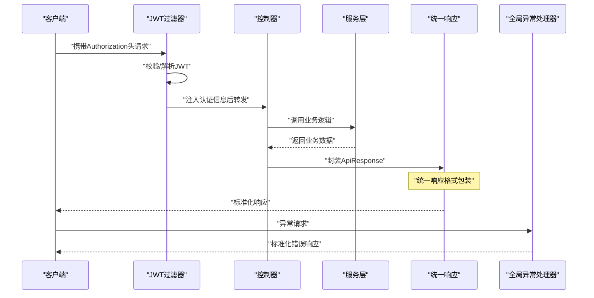

# API接口文档

<cite>
**本文档引用的文件**
- [AuthController.java](file://communication-backend/src/main/java/com/communication/controller/AuthController.java)
- [UserController.java](file://communication-backend/src/main/java/com/communication/controller/UserController.java)
- [ContentController.java](file://communication-backend/src/main/java/com/communication/controller/ContentController.java)
- [CommentController.java](file://communication-backend/src/main/java/com/communication/controller/CommentController.java)
- [SubscriptionController.java](file://communication-backend/src/main/java/com/communication/controller/SubscriptionController.java)
- [SearchController.java](file://communication-backend/src/main/java/com/communication/controller/SearchController.java)
- [DashboardController.java](file://communication-backend/src/main/java/com/communication/controller/DashboardController.java)
- [UploadController.java](file://communication-backend/src/main/java/com/communication/controller/UploadController.java)
- [ApiResponse.java](file://communication-backend/src/main/java/com/communication/dto/ApiResponse.java)
- [PageResponse.java](file://communication-backend/src/main/java/com/communication/dto/PageResponse.java)
- [AuthResponse.java](file://communication-backend/src/main/java/com/communication/dto/AuthResponse.java)
- [LoginRequest.java](file://communication-backend/src/main/java/com/communication/dto/LoginRequest.java)
- [RegisterRequest.java](file://communication-backend/src/main/java/com/communication/dto/RegisterRequest.java)
- [ContentDto.java](file://communication-backend/src/main/java/com/communication/dto/ContentDto.java)
- [CommentDto.java](file://communication-backend/src/main/java/com/communication/dto/CommentDto.java)
- [UserDto.java](file://communication-backend/src/main/java/com/communication/dto/UserDto.java)
- [CreateContentRequest.java](file://communication-backend/src/main/java/com/communication/dto/CreateContentRequest.java)
- [User.java](file://communication-backend/src/main/java/com/communication/entity/User.java)
- [JwtAuthenticationFilter.java](file://communication-backend/src/main/java/com/communication/config/JwtAuthenticationFilter.java)
- [SecurityConfig.java](file://communication-backend/src/main/java/com/communication/config/SecurityConfig.java)
- [CorsConfig.java](file://communication-backend/src/main/java/com/communication/config/CorsConfig.java)
- [JwtUtil.java](file://communication-backend/src/main/java/com/communication/util/JwtUtil.java)
- [GlobalExceptionHandler.java](file://communication-backend/src/main/java/com/communication/exception/GlobalExceptionHandler.java)
- [BadRequestException.java](file://communication-backend/src/main/java/com/communication/exception/BadRequestException.java)
- [ResourceNotFoundException.java](file://communication-backend/src/main/java/com/communication/exception/ResourceNotFoundException.java)
- [http.ts](file://communication-frontend/src/api/http.ts)
- [auth.ts](file://communication-frontend/src/stores/auth.ts)
- [auth.ts](file://communication-frontend/src/api/auth.ts)
</cite>

## 更新摘要
**所做更改**
- 标准化统一响应格式：全面采用ApiResponse<T>包装所有接口响应，提供一致的结构化输出
- 完善错误处理机制：通过GlobalExceptionHandler统一处理各类异常，确保标准化错误响应
- 增强分页查询支持：PageResponse通用分页模型，支持内容、评论、用户、订阅等模块的分页需求
- 优化认证响应格式：AuthResponse标准化认证结果，包含token、tokenType和用户信息
- 完善DTO序列化：所有数据传输对象采用builder模式和静态工厂方法，确保数据一致性
- 前端拦截器适配：前端axios拦截器已调整以支持统一响应格式，简化错误处理逻辑

## 目录
1. [简介](#简介)
2. [统一响应格式](#统一响应格式)
3. [项目结构](#项目结构)
4. [核心组件](#核心组件)
5. [架构总览](#架构总览)
6. [详细组件分析](#详细组件分析)
7. [依赖关系分析](#依赖关系分析)
8. [性能考虑](#性能考虑)
9. [故障排除指南](#故障排除指南)
10. [结论](#结论)
11. [附录](#附录)

## 简介
本文件为通信平台的完整RESTful API接口文档，覆盖认证、用户、内容、评论、订阅、搜索、后台管理、文件上传等模块。文档详细说明了各端点的HTTP方法、URL模式、请求参数、响应格式与状态码，并提供JWT认证机制说明、token管理策略、请求/响应示例、错误处理机制、版本控制与向后兼容性考虑以及客户端集成最佳实践。

**更新** 本版本重点介绍了标准化的ApiResponse<T>统一响应格式，确保所有接口响应具有一致的结构和语义化状态码。前端拦截器已完全适配新的响应格式，提供更简洁的错误处理体验。

## 统一响应格式

### ApiResponse<T> 核心结构
所有API响应均采用ApiResponse<T>统一包装，提供标准化的数据结构：

```json
{
  "code": 200,
  "message": "Success",
  "data": {},
  "timestamp": "2024-01-01T00:00:00"
}
```

### 字段说明
- **code**: HTTP语义化的业务状态码（如200表示成功，400表示客户端错误）
- **message**: 简要的操作结果描述
- **data**: 实际业务数据（可能为null，当操作成功但无返回数据时）
- **timestamp**: 响应生成时间，采用LocalDateTime格式

### 响应构建器模式
提供多种便捷的响应构建方式：

```java
// 成功响应（自定义消息）
ApiResponse.success("操作成功", userData);

// 成功响应（默认消息）
ApiResponse.success(userData);

// 错误响应
ApiResponse.error(400, "参数错误");

// 使用构建器
ApiResponse.<UserData>builder()
    .code(200)
    .message("Success")
    .data(userData)
    .timestamp(LocalDateTime.now())
    .build();
```

### 分页响应格式
PageResponse通用分页模型，支持所有分页查询接口：

```json
{
  "content": [],
  "page": 0,
  "size": 10,
  "totalElements": 100,
  "totalPages": 10,
  "first": true,
  "last": false
}
```

**章节来源**
- [ApiResponse.java:1-76](file://communication-backend/src/main/java/com/communication/dto/ApiResponse.java#L1-L76)
- [PageResponse.java:1-65](file://communication-backend/src/main/java/com/communication/dto/PageResponse.java#L1-L65)

## 项目结构
后端采用Spring Boot分层架构，按功能模块划分控制器（Controller）、服务（Service）与数据传输对象（DTO），统一通过ApiResponse包装响应体，确保一致的返回格式。

```mermaid
graph TB
subgraph "控制器层"
AC["AuthController<br/>认证接口"]
UC["UserController<br/>用户查询"]
CC["ContentController<br/>内容CRUD"]
ComC["CommentController<br/>评论管理"]
SubC["SubscriptionController<br/>订阅管理"]
SC["SearchController<br/>搜索接口"]
DC["DashboardController<br/>后台管理"]
UpC["UploadController<br/>文件上传"]
end
subgraph "服务层"
US["UserService"]
CS["ContentService"]
ComS["CommentService"]
SubS["SubscriptionService"]
SS["SearchService"]
DS["DashboardService"]
FUS["FileUploadService"]
end
subgraph "数据传输对象"
AR["ApiResponse<T>"]
PR["PageResponse<T>"]
LR["LoginRequest"]
RR["RegisterRequest"]
AD["AuthResponse"]
CD["ContentDto"]
DCD["CommentDto"]
UD["UserDto"]
CCR["CreateContentRequest"]
end
AC --> US
UC --> US
CC --> CS
ComC --> ComS
SubC --> SubS
SC --> SS
DC --> DS
UpC --> FUS
AC --> AR
CC --> AR
ComC --> AR
SubC --> AR
SC --> AR
DC --> AR
UpC --> AR
AC --> LR
AC --> RR
AC --> AD
CC --> CCR
CC --> CD
ComC --> DCD
SubC --> UD
UC --> UD
```



**图表来源**
- [AuthController.java:1-42](file://communication-backend/src/main/java/com/communication/controller/AuthController.java#L1-L42)
- [UserController.java:1-26](file://communication-backend/src/main/java/com/communication/controller/UserController.java#L1-L26)
- [ContentController.java:1-85](file://communication-backend/src/main/java/com/communication/controller/ContentController.java#L1-L85)
- [CommentController.java:1-55](file://communication-backend/src/main/java/com/communication/controller/CommentController.java#L1-L55)
- [SubscriptionController.java:1-77](file://communication-backend/src/main/java/com/communication/controller/SubscriptionController.java#L1-L77)
- [SearchController.java:1-56](file://communication-backend/src/main/java/com/communication/controller/SearchController.java#L1-L56)
- [DashboardController.java:1-65](file://communication-backend/src/main/java/com/communication/controller/DashboardController.java#L1-L65)
- [UploadController.java:1-59](file://communication-backend/src/main/java/com/communication/controller/UploadController.java#L1-L59)
- [ApiResponse.java:1-76](file://communication-backend/src/main/java/com/communication/dto/ApiResponse.java#L1-L76)
- [PageResponse.java:1-65](file://communication-backend/src/main/java/com/communication/dto/PageResponse.java#L1-L65)

**章节来源**
- [AuthController.java:1-42](file://communication-backend/src/main/java/com/communication/controller/AuthController.java#L1-L42)
- [ContentController.java:1-85](file://communication-backend/src/main/java/com/communication/controller/ContentController.java#L1-L85)
- [CommentController.java:1-55](file://communication-backend/src/main/java/com/communication/controller/CommentController.java#L1-L55)
- [SubscriptionController.java:1-77](file://communication-backend/src/main/java/com/communication/controller/SubscriptionController.java#L1-L77)
- [SearchController.java:1-56](file://communication-backend/src/main/java/com/communication/controller/SearchController.java#L1-L56)
- [DashboardController.java:1-65](file://communication-backend/src/main/java/com/communication/controller/DashboardController.java#L1-L65)
- [UploadController.java:1-59](file://communication-backend/src/main/java/com/communication/controller/UploadController.java#L1-L59)
- [ApiResponse.java:1-76](file://communication-backend/src/main/java/com/communication/dto/ApiResponse.java#L1-L76)
- [PageResponse.java:1-65](file://communication-backend/src/main/java/com/communication/dto/PageResponse.java#L1-L65)

## 核心组件
- **统一响应包装**：所有接口均以ApiResponse<T>返回，包含状态码、消息、时间戳与业务数据，确保前后端交互的一致性。
- **认证与授权**：基于JWT，通过过滤器解析token并注入认证信息；部分端点需要登录态。
- **错误处理**：全局异常处理器捕获业务异常与安全异常，统一返回标准错误响应，包含详细的错误信息和语义化状态码。
- **数据模型**：User、Content、Comment、Subscription等实体通过DTO进行序列化传输，采用builder模式确保数据完整性。
- **前端适配**：前端axios拦截器已完全适配统一响应格式，简化了错误处理和数据提取逻辑。

**更新** 新增标准化的响应格式和统一的错误处理机制，提升了API的一致性和可靠性。前端拦截器已优化以更好地支持新的响应结构。

**章节来源**
- [ApiResponse.java:1-76](file://communication-backend/src/main/java/com/communication/dto/ApiResponse.java#L1-L76)
- [GlobalExceptionHandler.java](file://communication-backend/src/main/java/com/communication/exception/GlobalExceptionHandler.java)
- [JwtAuthenticationFilter.java](file://communication-backend/src/main/java/com/communication/config/JwtAuthenticationFilter.java)
- [SecurityConfig.java](file://communication-backend/src/main/java/com/communication/config/SecurityConfig.java)

## 架构总览
下图展示客户端与后端的交互流程，重点体现JWT认证、统一响应包装和全局异常处理。



**图表来源**
- [JwtAuthenticationFilter.java](file://communication-backend/src/main/java/com/communication/config/JwtAuthenticationFilter.java)
- [AuthController.java:1-42](file://communication-backend/src/main/java/com/communication/controller/AuthController.java#L1-L42)
- [ContentController.java:1-85](file://communication-backend/src/main/java/com/communication/controller/ContentController.java#L1-L85)
- [ApiResponse.java:1-76](file://communication-backend/src/main/java/com/communication/dto/ApiResponse.java#L1-L76)
- [GlobalExceptionHandler.java:1-63](file://communication-backend/src/main/java/com/communication/exception/GlobalExceptionHandler.java#L1-L63)

## 详细组件分析

### 认证模块（/api/auth）
- **注册**
  - 方法与路径：POST /api/auth/register
  - 请求体：RegisterRequest（用户名、邮箱、密码）
  - 成功响应：201 Created，返回ApiResponse<AuthResponse>（token、tokenType、user）
  - 失败响应：400 Bad Request（字段校验失败或业务异常）
- **登录**
  - 方法与路径：POST /api/auth/login
  - 请求体：LoginRequest（用户名或邮箱、密码）
  - 成功响应：200 OK，返回ApiResponse<AuthResponse>
  - 失败响应：401 Unauthorized（凭据无效）
- **获取当前用户**
  - 方法与路径：GET /api/auth/me
  - 鉴权：需要Bearer Token
  - 成功响应：200 OK，返回ApiResponse<UserDto>
  - 失败响应：401 Unauthorized 或 404 Not Found

**请求示例**
- 注册请求体示例：{"username":"alice","email":"alice@example.com","password":"Password123"}
- 登录请求体示例：{"usernameOrEmail":"alice","password":"Password123"}

**成功响应示例**
```json
{
  "code": 201,
  "message": "Registration successful",
  "data": {
    "token": "eyJhbGciOiJIUzI1NiIsInR5cCI6IkpXVCJ9...",
    "tokenType": "Bearer",
    "user": {
      "id": 1,
      "username": "alice",
      "email": "alice@example.com",
      "avatarUrl": null,
      "bio": null,
      "createdAt": "2024-01-01T00:00:00"
    }
  },
  "timestamp": "2024-01-01T00:00:00"
}
```

**失败响应示例**
```json
{
  "code": 400,
  "message": "用户名已存在",
  "data": null,
  "timestamp": "2024-01-01T00:00:00"
}
```

**状态码**
- 200：操作成功
- 201：资源创建成功
- 400：请求参数非法或业务异常
- 401：未认证或认证失败
- 404：资源不存在

**章节来源**
- [AuthController.java:1-42](file://communication-backend/src/main/java/com/communication/controller/AuthController.java#L1-L42)
- [RegisterRequest.java:1-30](file://communication-backend/src/main/java/com/communication/dto/RegisterRequest.java#L1-L30)
- [LoginRequest.java:1-20](file://communication-backend/src/main/java/com/communication/dto/LoginRequest.java#L1-L20)
- [AuthResponse.java:1-47](file://communication-backend/src/main/java/com/communication/dto/AuthResponse.java#L1-L47)
- [ApiResponse.java:1-76](file://communication-backend/src/main/java/com/communication/dto/ApiResponse.java#L1-L76)

### 用户模块（/api/users）
- **查询用户**
  - 方法与路径：GET /api/users/{username}
  - 路径参数：username（字符串）
  - 成功响应：200 OK，返回ApiResponse<UserDto>
  - 失败响应：404 Not Found

**请求示例**
- GET /api/users/alice

**成功响应示例**
```json
{
  "code": 200,
  "message": "Success",
  "data": {
    "id": 1,
    "username": "alice",
    "email": "alice@example.com",
    "avatarUrl": null,
    "bio": null,
    "createdAt": "2024-01-01T00:00:00"
  },
  "timestamp": "2024-01-01T00:00:00"
}
```

**状态码**
- 200：查询成功
- 404：用户不存在

**章节来源**
- [UserController.java:1-26](file://communication-backend/src/main/java/com/communication/controller/UserController.java#L1-L26)
- [UserDto.java:1-72](file://communication-backend/src/main/java/com/communication/dto/UserDto.java#L1-L72)
- [User.java:1-96](file://communication-backend/src/main/java/com/communication/entity/User.java#L1-L96)

### 内容模块（/api/contents）
- **创建内容**
  - 方法与路径：POST /api/contents
  - 鉴权：需要Bearer Token
  - 请求体：CreateContentRequest（标题、正文、媒体类型、标签等）
  - 成功响应：201 Created，返回ApiResponse<ContentDto>
  - 失败响应：400/401/403
- **分页获取公开内容**
  - 方法与路径：GET /api/contents?page=0&size=10
  - 查询参数：page（默认0）、size（默认10）
  - 成功响应：200 OK，返回ApiResponse<PageResponse<ContentDto>>
- **获取指定内容详情**
  - 方法与路径：GET /api/contents/{id}
  - 路径参数：id（长整型）
  - 成功响应：200 OK，返回ApiResponse<ContentDto>（访问量+1）
  - 失败响应：404
- **更新内容**
  - 方法与路径：PUT /api/contents/{id}
  - 鉴权：需要Bearer Token
  - 请求体：UpdateContentRequest
  - 成功响应：200 OK，返回ApiResponse<ContentDto>
  - 失败响应：400/401/403/404
- **删除内容**
  - 方法与路径：DELETE /api/contents/{id}
  - 鉴权：需要Bearer Token
  - 成功响应：200 OK，返回ApiResponse<Void>
  - 失败响应：400/401/403/404
- **按作者分页查询内容**
  - 方法与路径：GET /api/contents/user/{authorId}?page=0&size=10
  - 路径参数：authorId（长整型）
  - 成功响应：200 OK，返回ApiResponse<PageResponse<ContentDto>>
- **获取我的内容**
  - 方法与路径：GET /api/contents/my?status=&page=0&size=10
  - 鉴权：需要Bearer Token
  - 查询参数：status（可选枚举）、page、size
  - 成功响应：200 OK，返回ApiResponse<PageResponse<ContentDto>>

**请求示例**
- 创建内容请求体示例：{"title":"文章标题","body":"文章内容","mediaType":"IMAGE","tags":["tag1","tag2"]}
- 更新内容请求体示例：{"title":"更新标题","body":"更新内容","mediaType":"IMAGE","tags":["tag1"]}

**成功响应示例**
```json
{
  "code": 200,
  "message": "Success",
  "data": {
    "id": 1,
    "title": "文章标题",
    "body": "文章内容",
    "mediaUrl": null,
    "mediaType": "IMAGE",
    "viewCount": 0,
    "commentCount": 0,
    "status": "DRAFT",
    "tags": ["tag1"],
    "createdAt": "2024-01-01T00:00:00",
    "updatedAt": "2024-01-01T00:00:00",
    "author": {
      "id": 1,
      "username": "alice",
      "email": "alice@example.com",
      "avatarUrl": null,
      "bio": null,
      "createdAt": "2024-01-01T00:00:00"
    }
  },
  "timestamp": "2024-01-01T00:00:00"
}
```

**状态码**
- 200：操作成功
- 201：创建成功
- 400：请求参数非法或权限不足
- 401：未认证
- 403：无权限
- 404：资源不存在

**章节来源**
- [ContentController.java:1-85](file://communication-backend/src/main/java/com/communication/controller/ContentController.java#L1-L85)
- [ContentDto.java:1-118](file://communication-backend/src/main/java/com/communication/dto/ContentDto.java#L1-L118)
- [CreateContentRequest.java:1-42](file://communication-backend/src/main/java/com/communication/dto/CreateContentRequest.java#L1-L42)

### 评论模块（/api/contents/{contentId}/comments）
- **发表评论**
  - 方法与路径：POST /api/contents/{contentId}/comments
  - 鉴权：需要Bearer Token
  - 请求体：CreateCommentRequest（评论内容、父评论ID可选）
  - 成功响应：200 OK，返回ApiResponse<CommentDto>
  - 失败响应：400/401/404
- **分页获取评论**
  - 方法与路径：GET /api/contents/{contentId}/comments?page=0&size=20
  - 路径参数：contentId（长整型）
  - 查询参数：page、size
  - 成功响应：200 OK，返回ApiResponse<PageResponse<CommentDto>>
- **获取单条评论**
  - 方法与路径：GET /api/contents/{contentId}/comments/{commentId}
  - 路径参数：commentId（长整型）
  - 成功响应：200 OK，返回ApiResponse<CommentDto>
- **删除评论**
  - 方法与路径：DELETE /api/contents/{contentId}/comments/{commentId}
  - 鉴权：需要Bearer Token
  - 成功响应：200 OK，返回ApiResponse<Void>
  - 失败响应：400/401/403/404

**请求示例**
- 发表评论请求体示例：{"body":"这是一条评论","parentId":null}

**成功响应示例**
```json
{
  "code": 200,
  "message": "Success",
  "data": {
    "id": 1,
    "contentId": 1,
    "user": {
      "id": 1,
      "username": "alice",
      "email": "alice@example.com",
      "avatarUrl": null,
      "bio": null,
      "createdAt": "2024-01-01T00:00:00"
    },
    "body": "这是一条评论",
    "parentId": null,
    "replies": [],
    "createdAt": "2024-01-01T00:00:00",
    "updatedAt": "2024-01-01T00:00:00"
  },
  "timestamp": "2024-01-01T00:00:00"
}
```

**状态码**
- 200：操作成功
- 400：请求参数非法或权限不足
- 401：未认证
- 403：无权限
- 404：资源不存在

**章节来源**
- [CommentController.java:1-55](file://communication-backend/src/main/java/com/communication/controller/CommentController.java#L1-L55)
- [CommentDto.java:1-99](file://communication-backend/src/main/java/com/communication/dto/CommentDto.java#L1-L99)

### 订阅模块（/api/subscriptions）
- **关注作者**
  - 方法与路径：POST /api/subscriptions/{authorId}
  - 鉴权：需要Bearer Token
  - 路径参数：authorId（长整型）
  - 成功响应：200 OK，返回ApiResponse<SubscriptionDto>
  - 失败响应：400/401/404
- **取消关注**
  - 方法与路径：DELETE /api/subscriptions/{authorId}
  - 鉴权：需要Bearer Token
  - 成功响应：200 OK，返回ApiResponse<Void>
- **检查是否已关注**
  - 方法与路径：GET /api/subscriptions/check/{authorId}
  - 鉴权：需要Bearer Token
  - 成功响应：200 OK，返回ApiResponse<Boolean>
- **我的关注列表**
  - 方法与路径：GET /api/subscriptions/my?page=0&size=20
  - 鉴权：需要Bearer Token
  - 查询参数：page、size
  - 成功响应：200 OK，返回ApiResponse<PageResponse<UserDto>>
- **某用户的粉丝列表**
  - 方法与路径：GET /api/subscriptions/followers/{userId}?page=0&size=20
  - 路径参数：userId（长整型）
  - 查询参数：page、size
  - 成功响应：200 OK，返回ApiResponse<PageResponse<UserDto>>
- **订阅动态流**
  - 方法与路径：GET /api/subscriptions/feed?page=0&size=10
  - 鉴权：需要Bearer Token
  - 查询参数：page、size
  - 成功响应：200 OK，返回ApiResponse<PageResponse<ContentDto>>
- **订阅统计**
  - 方法与路径：GET /api/subscriptions/count/{userId}
  - 路径参数：userId（长整型）
  - 成功响应：200 OK，返回ApiResponse<SubscriptionCountDto>（订阅数、粉丝数）

**状态码**
- 200：操作成功
- 400：请求参数非法或业务异常
- 401：未认证
- 404：资源不存在

**章节来源**
- [SubscriptionController.java:1-77](file://communication-backend/src/main/java/com/communication/controller/SubscriptionController.java#L1-L77)

### 搜索模块（/api/search）
- **搜索内容**
  - 方法与路径：GET /api/search/contents?q=&tag=&page=0&size=10
  - 查询参数：q（关键词）、tag（标签）、page、size
  - 成功响应：200 OK，返回ApiResponse<PageResponse<ContentDto>>
- **搜索用户**
  - 方法与路径：GET /api/search/users?q=&page=0&size=10
  - 查询参数：q（关键词）、page、size
  - 成功响应：200 OK，返回ApiResponse<PageResponse<UserDto>>
- **获取热门标签**
  - 方法与路径：GET /api/search/tags/popular?limit=20
  - 查询参数：limit（默认20）
  - 成功响应：200 OK，返回ApiResponse<List<String>>
- **标签智能提示**
  - 方法与路径：GET /api/search/tags/suggest?q=xxx
  - 查询参数：q（标签前缀）
  - 成功响应：200 OK，返回ApiResponse<List<String>>

**状态码**
- 200：操作成功
- 400：请求参数非法

**章节来源**
- [SearchController.java:1-56](file://communication-backend/src/main/java/com/communication/controller/SearchController.java#L1-L56)

### 后台管理模块（/api/dashboard）
- **获取统计数据**
  - 方法与路径：GET /api/dashboard/stats
  - 鉴权：需要Bearer Token
  - 成功响应：200 OK，返回ApiResponse<DashboardStatsDto>
- **查看我的内容（支持按状态筛选）**
  - 方法与路径：GET /api/dashboard/contents?status=&page=0&size=10
  - 鉴权：需要Bearer Token
  - 查询参数：status（可选枚举）、page、size
  - 成功响应：200 OK，返回ApiResponse<PageResponse<ContentDto>>
- **更新个人资料**
  - 方法与路径：PUT /api/dashboard/profile
  - 鉴权：需要Bearer Token
  - 请求体：UpdateProfileRequest（昵称、简介等）
  - 成功响应：200 OK，返回ApiResponse<UserDto>
- **上传头像**
  - 方法与路径：POST /api/dashboard/avatar
  - 鉴权：需要Bearer Token
  - 表单参数：file（multipart文件）
  - 成功响应：200 OK，返回ApiResponse<UserDto>

**状态码**
- 200：操作成功
- 201：创建成功
- 400：请求参数非法或业务异常
- 401：未认证

**章节来源**
- [DashboardController.java:1-65](file://communication-backend/src/main/java/com/communication/controller/DashboardController.java#L1-L65)

### 文件上传模块（/api/upload）
- **上传图片**
  - 方法与路径：POST /api/upload/image
  - 请求参数：file（multipart文件）
  - 成功响应：200 OK，返回ApiResponse<Map<String,Object>>（包含URL和媒体类型）
  - 失败响应：400 Bad Request（不支持的图片类型）
- **上传视频**
  - 方法与路径：POST /api/upload/video
  - 请求参数：file（multipart文件）
  - 成功响应：200 OK，返回ApiResponse<Map<String,Object>>（包含URL和媒体类型）
  - 失败响应：400 Bad Request（不支持的视频类型）

**支持的图片类型**：JPEG、PNG、GIF、WebP
**支持的视频类型**：MP4、WebM、MOV

**状态码**
- 200：上传成功
- 400：文件类型不支持或文件过大

**章节来源**
- [UploadController.java:1-59](file://communication-backend/src/main/java/com/communication/controller/UploadController.java#L1-L59)

## 依赖关系分析
- **控制器到服务层**：各控制器通过依赖注入的服务接口调用业务逻辑，保持职责分离。
- **DTO映射**：实体类通过静态工厂方法或builder转换为DTO，避免直接暴露持久化实体。
- **统一响应**：所有控制器返回值经ApiResponse包装，便于前端统一处理。
- **安全配置**：SecurityConfig定义拦截规则，JwtAuthenticationFilter负责解析与验证token。
- **异常处理**：GlobalExceptionHandler统一处理各类业务异常，确保标准化错误响应。

```mermaid
classDiagram
class AuthController
class UserController
class ContentController
class CommentController
class SubscriptionController
class SearchController
class DashboardController
class UploadController
class UserService
class ContentService
class CommentService
class SubscriptionService
class SearchService
class DashboardService
class FileUploadService
class ApiResponse_T_
class PageResponse_T_
class AuthResponse
class LoginRequest
class RegisterRequest
class ContentDto
class CommentDto
class UserDto
class CreateContentRequest
AuthController --> UserService
UserController --> UserService
ContentController --> ContentService
CommentController --> CommentService
SubscriptionController --> SubscriptionService
SearchController --> SearchService
DashboardController --> DashboardService
UploadController --> FileUploadService
DashboardController --> FileUploadService
AuthController --> AuthResponse
AuthController --> LoginRequest
AuthController --> RegisterRequest
ContentController --> CreateContentRequest
ContentController --> ContentDto
CommentController --> CommentDto
UserController --> UserDto
DashboardController --> UserDto
UploadController --> ApiResponse_T_
AuthController --> ApiResponse_T_
ContentController --> ApiResponse_T_
CommentController --> ApiResponse_T_
SubscriptionController --> ApiResponse_T_
SearchController --> ApiResponse_T_
DashboardController --> ApiResponse_T_
UploadController --> ApiResponse_T_
DashboardController --> PageResponse_T_
ContentController --> PageResponse_T_
CommentController --> PageResponse_T_
SubscriptionController --> PageResponse_T_
SearchController --> PageResponse_T_
```



**图表来源**
- [AuthController.java:1-42](file://communication-backend/src/main/java/com/communication/controller/AuthController.java#L1-L42)
- [UserController.java:1-26](file://communication-backend/src/main/java/com/communication/controller/UserController.java#L1-L26)
- [ContentController.java:1-85](file://communication-backend/src/main/java/com/communication/controller/ContentController.java#L1-L85)
- [CommentController.java:1-55](file://communication-backend/src/main/java/com/communication/controller/CommentController.java#L1-L55)
- [SubscriptionController.java:1-77](file://communication-backend/src/main/java/com/communication/controller/SubscriptionController.java#L1-L77)
- [SearchController.java:1-56](file://communication-backend/src/main/java/com/communication/controller/SearchController.java#L1-L56)
- [DashboardController.java:1-65](file://communication-backend/src/main/java/com/communication/controller/DashboardController.java#L1-L65)
- [UploadController.java:1-59](file://communication-backend/src/main/java/com/communication/controller/UploadController.java#L1-L59)
- [ApiResponse.java:1-76](file://communication-backend/src/main/java/com/communication/dto/ApiResponse.java#L1-L76)
- [PageResponse.java:1-65](file://communication-backend/src/main/java/com/communication/dto/PageResponse.java#L1-L65)
- [AuthResponse.java:1-47](file://communication-backend/src/main/java/com/communication/dto/AuthResponse.java#L1-L47)
- [LoginRequest.java:1-20](file://communication-backend/src/main/java/com/communication/dto/LoginRequest.java#L1-L20)
- [RegisterRequest.java:1-30](file://communication-backend/src/main/java/com/communication/dto/RegisterRequest.java#L1-L30)
- [ContentDto.java:1-118](file://communication-backend/src/main/java/com/communication/dto/ContentDto.java#L1-L118)
- [CommentDto.java:1-99](file://communication-backend/src/main/java/com/communication/dto/CommentDto.java#L1-L99)
- [UserDto.java:1-72](file://communication-backend/src/main/java/com/communication/dto/UserDto.java#L1-L72)
- [CreateContentRequest.java:1-42](file://communication-backend/src/main/java/com/communication/dto/CreateContentRequest.java#L1-L42)

## 性能考虑
- **分页查询**：内容、评论、用户、订阅列表均支持page与size参数，默认合理限制，避免一次性返回大量数据。
- **访问量统计**：获取内容详情时增加浏览计数，建议在数据库层面原子递增或缓存降压。
- **媒体文件**：头像上传走独立接口，建议结合CDN与缩略图策略优化加载速度。
- **缓存策略**：热门标签、订阅动态流可引入Redis缓存，降低数据库压力。
- **文件上传**：支持图片和视频类型验证，建议在前端进行预校验减少无效请求。
- **统一响应**：ApiResponse的builder模式减少了对象创建开销，提高了序列化效率。
- **前端优化**：统一响应格式简化了前端数据提取逻辑，减少了重复的错误处理代码。

## 故障排除指南
常见错误与处理
- **400 Bad Request**：请求参数缺失或格式不正确（如用户名/邮箱/密码长度不符）。检查请求体字段与校验规则。
- **401 Unauthorized**：缺少或无效的Authorization头。确认token有效且未过期。
- **403 Forbidden**：无权限操作（如非内容作者删除内容）。检查当前用户与资源归属。
- **404 Not Found**：资源不存在（用户、内容、评论、订阅关系）。确认ID有效性。
- **文件上传错误**：检查文件类型是否在支持列表内，文件大小是否超过限制。
- **全局异常**：由全局异常处理器捕获并返回标准错误响应，包含错误码与消息。
- **响应格式问题**：所有响应均采用ApiResponse统一格式，确保前后端一致性。
- **前端错误处理**：axios拦截器已适配统一响应格式，自动处理401、403、404等状态码。

**更新** 新增统一响应格式的故障排除指导，帮助开发者识别和解决常见的响应格式问题。前端拦截器已优化以更好地支持新的响应结构。

**章节来源**
- [GlobalExceptionHandler.java:1-63](file://communication-backend/src/main/java/com/communication/exception/GlobalExceptionHandler.java#L1-L63)
- [BadRequestException.java:1-13](file://communication-backend/src/main/java/com/communication/exception/BadRequestException.java#L1-L13)
- [ResourceNotFoundException.java](file://communication-backend/src/main/java/com/communication/exception/ResourceNotFoundException.java)
- [http.ts:1-70](file://communication-frontend/src/api/http.ts#L1-L70)

## 结论
本API文档提供了通信平台的完整RESTful接口规范，涵盖认证、用户、内容、评论、订阅、搜索、后台管理、文件上传等模块。通过统一的ApiResponse<T>响应格式、严格的参数校验与完善的错误处理机制，确保前后端协作的一致性与可靠性。

**更新** 本次重大改进标准化了所有API响应格式，提供了更加一致和可靠的接口体验。前端拦截器已完全适配新的响应格式，简化了错误处理逻辑。建议客户端在集成时严格遵循鉴权流程与分页规范，并根据实际场景选择合适的缓存与限流策略。

## 附录

### JWT认证与Token管理
- **认证方式**：Bearer Token，置于Authorization头中（格式："Bearer {token}"）。
- **过滤器**：JwtAuthenticationFilter负责从请求头提取token并验证，将认证信息注入到SecurityContext。
- **刷新策略**：建议在AuthResponse中返回短期token，并在前端实现静默刷新或引导重新登录。
- **安全建议**：HTTPS传输、短有效期token、服务端黑名单（如需撤销）。

**章节来源**
- [JwtAuthenticationFilter.java](file://communication-backend/src/main/java/com/communication/config/JwtAuthenticationFilter.java)
- [SecurityConfig.java](file://communication-backend/src/main/java/com/communication/config/SecurityConfig.java)
- [JwtUtil.java](file://communication-backend/src/main/java/com/communication/util/JwtUtil.java)

### 统一响应格式详解
- **字段说明**
  - **code**：HTTP语义化的业务状态码（如200表示成功）
  - **message**：简要描述
  - **data**：业务数据（可能为空）
  - **timestamp**：响应时间
- **示例**
  - 成功：{"code":200,"message":"Success","data":{},"timestamp":"2024-01-01T00:00:00"}
  - 失败：{"code":400,"message":"参数错误","timestamp":"2024-01-01T00:00:00"}

**更新** 统一响应格式已成为所有API的标准规范，确保了前后端交互的一致性和可靠性。前端拦截器已完全适配新的响应格式。

**章节来源**
- [ApiResponse.java:1-76](file://communication-backend/src/main/java/com/communication/dto/ApiResponse.java#L1-L76)

### CORS跨域配置
- **放行来源**：开发环境允许任意来源，生产环境建议限定可信域名。
- **允许方法**：GET、POST、PUT、DELETE、OPTIONS等常用方法。
- **凭证**：根据需要开启支持携带Cookie的跨域请求。

**章节来源**
- [CorsConfig.java](file://communication-backend/src/main/java/com/communication/config/CorsConfig.java)

### API版本控制与兼容性
- **版本策略**：当前接口位于/api路径下，建议在控制器上添加版本前缀以便演进。
- **兼容性**：新增字段采用非必填，变更字段保持向后兼容；废弃字段保留但标记为不推荐使用。
- **升级建议**：客户端定期同步接口文档，服务端提供迁移指引与过渡期支持。

### 客户端集成最佳实践
- **鉴权**：登录成功后持久化token，请求前自动附加Authorization头。
- **错误处理**：针对401自动跳转登录，针对403提示权限不足，针对404提示资源不存在。
- **分页**：遵循page与size参数，滚动加载时累计数据并去重。
- **缓存**：对只读数据（如标签、公开内容列表）设置本地缓存，提升用户体验。
- **文件上传**：在前端进行类型和大小预校验，上传进度显示，错误重试机制。
- **错误上报**：统一收集API错误日志，便于定位问题。
- **响应处理**：所有响应均采用ApiResponse统一格式，前端应统一解析code、message、data字段。
- **拦截器优化**：axios拦截器已适配统一响应格式，自动处理各种HTTP状态码和错误情况。

**更新** 前端拦截器已完全适配统一响应格式，提供了更好的错误处理体验。客户端应使用统一的响应格式来简化数据提取和错误处理逻辑。

**章节来源**
- [http.ts:1-70](file://communication-frontend/src/api/http.ts#L1-L70)
- [auth.ts:1-96](file://communication-frontend/src/stores/auth.ts#L1-L96)
- [auth.ts:1-49](file://communication-frontend/src/api/auth.ts#L1-L49)