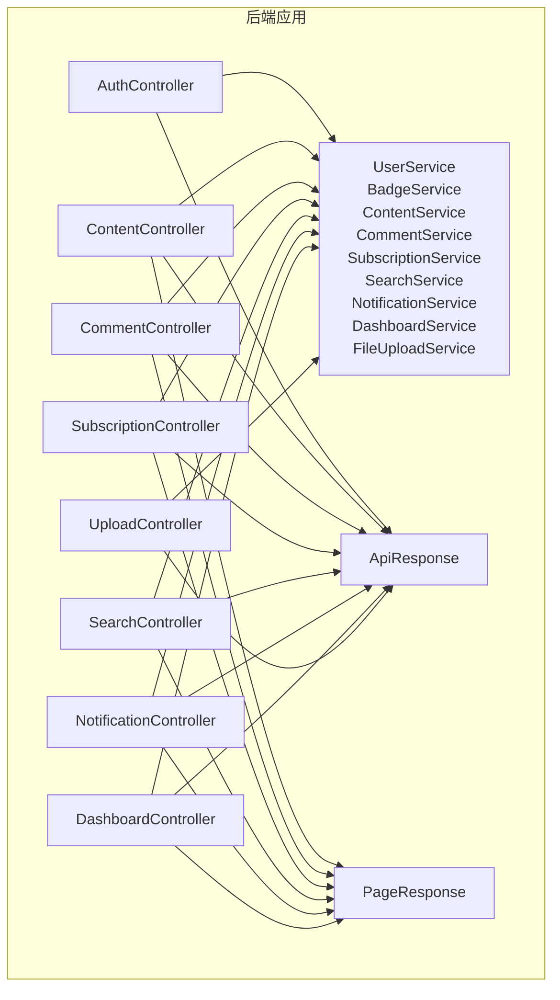
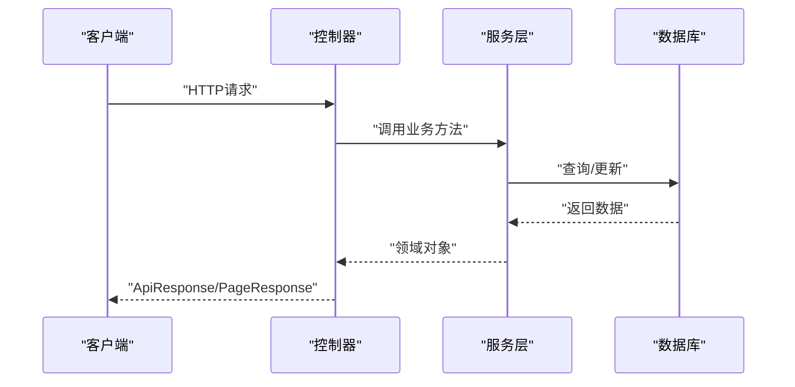
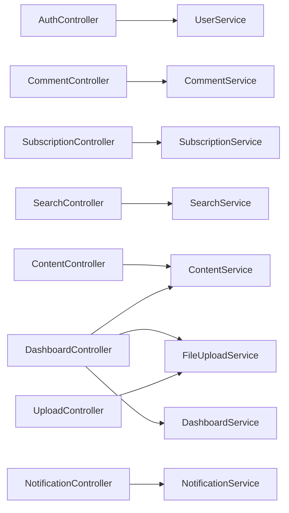

# API接口文档

<cite>
**本文引用的文件**
- [CommunicationApplication.java](file://communication-backend/src/main/java/com/communication/CommunicationApplication.java)
- [application.yml](file://communication-backend/src/main/resources/application.yml)
- [AuthController.java](file://communication-backend/src/main/java/com/communication/controller/AuthController.java)
- [ContentController.java](file://communication-backend/src/main/java/com/communication/controller/ContentController.java)
- [CommentController.java](file://communication-backend/src/main/java/com/communication/controller/CommentController.java)
- [SubscriptionController.java](file://communication-backend/src/main/java/com/communication/controller/SubscriptionController.java)
- [SearchController.java](file://communication-backend/src/main/java/com/communication/controller/SearchController.java)
- [NotificationController.java](file://communication-backend/src/main/java/com/communication/controller/NotificationController.java)
- [DashboardController.java](file://communication-backend/src/main/java/com/communication/controller/DashboardController.java)
- [UploadController.java](file://communication-backend/src/main/java/com/communication/controller/UploadController.java)
- [ApiResponse.java](file://communication-backend/src/main/java/com/communication/dto/ApiResponse.java)
- [PageResponse.java](file://communication-backend/src/main/java/com/communication/dto/PageResponse.java)
- [10-API接口文档.md](file://wiki/10-API接口文档.md)
</cite>

## 目录
1. [简介](#简介)
2. [项目结构](#项目结构)
3. [核心组件](#核心组件)
4. [架构总览](#架构总览)
5. [详细组件分析](#详细组件分析)
6. [依赖分析](#依赖分析)
7. [性能考虑](#性能考虑)
8. [故障排查指南](#故障排查指南)
9. [结论](#结论)
10. [附录](#附录)

## 简介
本文件为通信平台的完整API接口参考手册，覆盖认证、内容管理、评论、订阅、搜索、通知、后台仪表盘与媒体上传等模块。文档统一采用JSON响应封装，提供各接口的HTTP方法、URL模式、请求参数、响应格式、鉴权方式、分页结构、错误码说明，并给出请求/响应示例与调试建议。

- 基础地址：http://localhost:8080/api
- 统一响应封装：ApiResponse<T>；分页响应：PageResponse
- 鉴权方式：Bearer Token（除文件上传外均为application/json）

章节来源
- [10-API接口文档.md:1-53](file://wiki/10-API接口文档.md#L1-L53)

## 项目结构
后端基于Spring Boot，采用分层架构：
- 控制器层：controller 包，负责HTTP路由与参数绑定
- 服务层：service 包，包含业务逻辑与数据访问协调
- DTO 层：dto 包，定义请求/响应数据模型
- 实体与仓库：entity/repository 包，持久化模型与数据访问
- 配置：resources/application.yml，数据库、JPA、JWT、文件上传配置

图表来源
- [AuthController.java:1-47](file://communication-backend/src/main/java/com/communication/controller/AuthController.java#L1-L47)
- [ContentController.java:1-96](file://communication-backend/src/main/java/com/communication/controller/ContentController.java#L1-L96)
- [CommentController.java:1-55](file://communication-backend/src/main/java/com/communication/controller/CommentController.java#L1-L55)
- [SubscriptionController.java:1-77](file://communication-backend/src/main/java/com/communication/controller/SubscriptionController.java#L1-L77)
- [SearchController.java:1-56](file://communication-backend/src/main/java/com/communication/controller/SearchController.java#L1-L56)
- [NotificationController.java:1-47](file://communication-backend/src/main/java/com/communication/controller/NotificationController.java#L1-L47)
- [DashboardController.java:1-65](file://communication-backend/src/main/java/com/communication/controller/DashboardController.java#L1-L65)
- [UploadController.java:1-59](file://communication-backend/src/main/java/com/communication/controller/UploadController.java#L1-L59)
- [ApiResponse.java:1-76](file://communication-backend/src/main/java/com/communication/dto/ApiResponse.java#L1-L76)
- [PageResponse.java:1-65](file://communication-backend/src/main/java/com/communication/dto/PageResponse.java#L1-L65)

章节来源
- [CommunicationApplication.java:1-13](file://communication-backend/src/main/java/com/communication/CommunicationApplication.java#L1-L13)
- [application.yml:1-42](file://communication-backend/src/main/resources/application.yml#L1-L42)

## 核心组件
- 统一响应封装：ApiResponse<T>，包含code、message、data、timestamp，提供success/error静态工厂方法
- 分页响应：PageResponse<T>，包含content、page、size、totalElements、totalPages、first、last
- 配置要点：JWT密钥与过期时间、文件上传大小与类型限制、数据库连接与Flyway迁移

章节来源
- [ApiResponse.java:1-76](file://communication-backend/src/main/java/com/communication/dto/ApiResponse.java#L1-L76)
- [PageResponse.java:1-65](file://communication-backend/src/main/java/com/communication/dto/PageResponse.java#L1-L65)
- [application.yml:33-42](file://communication-backend/src/main/resources/application.yml#L33-L42)

## 架构总览
下图展示API调用链路与数据流：客户端通过控制器接收请求，控制器调用服务层执行业务逻辑，服务层与实体/仓库交互，最终以ApiResponse或PageResponse封装返回。

图表来源
- [AuthController.java:25-45](file://communication-backend/src/main/java/com/communication/controller/AuthController.java#L25-L45)
- [ContentController.java:27-94](file://communication-backend/src/main/java/com/communication/controller/ContentController.java#L27-L94)
- [CommentController.java:23-53](file://communication-backend/src/main/java/com/communication/controller/CommentController.java#L23-L53)
- [SubscriptionController.java:19-75](file://communication-backend/src/main/java/com/communication/controller/SubscriptionController.java#L19-L75)
- [SearchController.java:23-54](file://communication-backend/src/main/java/com/communication/controller/SearchController.java#L23-L54)
- [NotificationController.java:22-45](file://communication-backend/src/main/java/com/communication/controller/NotificationController.java#L22-L45)
- [DashboardController.java:27-63](file://communication-backend/src/main/java/com/communication/controller/DashboardController.java#L27-L63)
- [UploadController.java:23-57](file://communication-backend/src/main/java/com/communication/controller/UploadController.java#L23-L57)

## 详细组件分析

### 认证接口（/api/auth）
- 注册
  - 方法与路径：POST /api/auth/register
  - 鉴权：无需
  - 请求体：RegisterRequest（用户名、邮箱、密码）
  - 响应：201，包含AuthResponse（token与user）
  - 示例：见“请求示例/响应示例/错误码”
- 登录
  - 方法与路径：POST /api/auth/login
  - 鉴权：无需
  - 请求体：LoginRequest（用户名、密码）
  - 响应：200，包含AuthResponse
  - 示例：见“请求示例/响应示例/错误码”
- 获取当前用户
  - 方法与路径：GET /api/auth/me
  - 鉴权：Bearer Token
  - 响应：UserDto

章节来源
- [AuthController.java:25-45](file://communication-backend/src/main/java/com/communication/controller/AuthController.java#L25-L45)
- [10-API接口文档.md:57-118](file://wiki/10-API接口文档.md#L57-L118)

### 用户接口（/api/users）
- 获取用户信息
  - 方法与路径：GET /api/users/{id}
  - 鉴权：可选
  - 响应：UserDto

章节来源
- [10-API接口文档.md:121-141](file://wiki/10-API接口文档.md#L121-L141)

### 内容接口（/api/contents）
- 创建内容
  - 方法与路径：POST /api/contents
  - 鉴权：Bearer Token
  - 请求体：CreateContentRequest（title、body、mediaUrl、mediaType、status、tags）
  - 响应：201，ContentDto
- 获取内容列表
  - 方法与路径：GET /api/contents?page=&size=
  - 鉴权：可选
  - 响应：分页内容列表（ContentDto）
- 获取内容详情
  - 方法与路径：GET /api/contents/{id}
  - 鉴权：可选
  - 行为：访问时自动增加浏览量；若已登录，记录阅读历史
  - 响应：ContentDto
- 更新内容
  - 方法与路径：PUT /api/contents/{id}
  - 鉴权：Bearer Token
  - 请求体：UpdateContentRequest（全部字段可更新）
  - 响应：ContentDto
- 删除内容
  - 方法与路径：DELETE /api/contents/{id}
  - 鉴权：Bearer Token
  - 响应：200，成功消息
- 获取指定作者内容
  - 方法与路径：GET /api/contents/user/{authorId}?page=&size=
  - 鉴权：可选
  - 响应：分页内容列表
- 获取我的内容
  - 方法与路径：GET /api/contents/my?status=&page=&size=
  - 鉴权：Bearer Token
  - 参数：status可选（PUBLISHED/DRAFT），默认返回全部
  - 响应：分页内容列表

章节来源
- [ContentController.java:27-94](file://communication-backend/src/main/java/com/communication/controller/ContentController.java#L27-L94)
- [10-API接口文档.md:143-222](file://wiki/10-API接口文档.md#L143-L222)

### 评论接口（/api/contents/{contentId}/comments）
- 发表评论
  - 方法与路径：POST /api/contents/{contentId}/comments
  - 鉴权：Bearer Token
  - 请求体：CreateCommentRequest（body、parentId）
  - 响应：CommentDto
- 获取评论列表
  - 方法与路径：GET /api/contents/{contentId}/comments?page=&size=
  - 鉴权：可选
  - 响应：分页评论列表
- 获取单条评论
  - 方法与路径：GET /api/contents/{contentId}/comments/{commentId}
  - 鉴权：可选
  - 响应：CommentDto
- 删除评论
  - 方法与路径：DELETE /api/contents/{contentId}/comments/{commentId}
  - 鉴权：Bearer Token
  - 响应：200，成功消息

章节来源
- [CommentController.java:23-53](file://communication-backend/src/main/java/com/communication/controller/CommentController.java#L23-L53)
- [10-API接口文档.md:224-266](file://wiki/10-API接口文档.md#L224-L266)

### 订阅接口（/api/subscriptions）
- 关注用户
  - 方法与路径：POST /api/subscriptions/{authorId}
  - 鉴权：Bearer Token
  - 响应：SubscriptionDto
- 取消关注
  - 方法与路径：DELETE /api/subscriptions/{authorId}
  - 鉴权：Bearer Token
  - 响应：200，成功消息
- 检查是否已关注
  - 方法与路径：GET /api/subscriptions/check/{authorId}
  - 鉴权：Bearer Token
  - 响应：布尔值
- 我的订阅列表
  - 方法与路径：GET /api/subscriptions/my?page=&size=
  - 鉴权：Bearer Token
  - 响应：分页用户列表
- 粉丝列表
  - 方法与路径：GET /api/subscriptions/followers/{userId}?page=&size=
  - 鉴权：可选
  - 响应：分页用户列表
- 订阅/粉丝数量
  - 方法与路径：GET /api/subscriptions/count/{userId}
  - 鉴权：可选
  - 响应：订阅数与粉丝数
- 订阅Feed流
  - 方法与路径：GET /api/subscriptions/feed?page=&size=
  - 鉴权：Bearer Token
  - 响应：分页内容列表

章节来源
- [SubscriptionController.java:19-75](file://communication-backend/src/main/java/com/communication/controller/SubscriptionController.java#L19-L75)
- [10-API接口文档.md:267-321](file://wiki/10-API接口文档.md#L267-L321)

### 搜索接口（/api/search）
- 搜索内容
  - 方法与路径：GET /api/search/contents?q=&tag=&page=&size=
  - 鉴权：可选
  - 响应：分页内容列表
- 搜索用户
  - 方法与路径：GET /api/search/users?q=&page=&size=
  - 鉴权：可选
  - 响应：分页用户列表
- 热门标签
  - 方法与路径：GET /api/search/tags/popular?limit=
  - 鉴权：可选
  - 响应：标签数组
- 标签建议
  - 方法与路径：GET /api/search/tags/suggest?q=
  - 鉴权：可选
  - 响应：标签建议数组

章节来源
- [SearchController.java:23-54](file://communication-backend/src/main/java/com/communication/controller/SearchController.java#L23-L54)
- [10-API接口文档.md:322-352](file://wiki/10-API接口文档.md#L322-L352)

### 通知接口（/api/notifications）
- 获取通知列表
  - 方法与路径：GET /api/notifications?page=&size=
  - 鉴权：Bearer Token
  - 响应：分页通知列表
- 未读数量
  - 方法与路径：GET /api/notifications/unread-count
  - 鉴权：Bearer Token
  - 响应：未读计数
- 标记为已读
  - 方法与路径：PUT /api/notifications/{id}/read
  - 鉴权：Bearer Token
  - 响应：200，成功消息
- 全部标记为已读
  - 方法与路径：PUT /api/notifications/read-all
  - 鉴权：Bearer Token
  - 响应：200，成功消息

章节来源
- [NotificationController.java:22-45](file://communication-backend/src/main/java/com/communication/controller/NotificationController.java#L22-L45)
- [10-API接口文档.md:354-409](file://wiki/10-API接口文档.md#L354-L409)

### 后台管理接口（/api/dashboard）
- 获取统计数据
  - 方法与路径：GET /api/dashboard/stats
  - 鉴权：Bearer Token
  - 响应：DashboardStatsDto
- 获取我的内容列表
  - 方法与路径：GET /api/dashboard/contents?status=&page=&size=
  - 鉴权：Bearer Token
  - 响应：分页内容列表
- 更新个人资料
  - 方法与路径：PUT /api/dashboard/profile
  - 鉴权：Bearer Token
  - 请求体：UpdateProfileRequest（username、bio）
  - 响应：UserDto
- 上传头像
  - 方法与路径：POST /api/dashboard/avatar
  - 鉴权：Bearer Token
  - 请求：multipart/form-data，字段file
  - 响应：UserDto

章节来源
- [DashboardController.java:27-63](file://communication-backend/src/main/java/com/communication/controller/DashboardController.java#L27-L63)
- [10-API接口文档.md:354-409](file://wiki/10-API接口文档.md#L354-L409)

### 媒体上传接口（/api/upload）
- 上传图片
  - 方法与路径：POST /api/upload/image
  - 鉴权：Bearer Token
  - 请求：multipart/form-data，字段file
  - 支持类型：JPEG、PNG、GIF、WebP
  - 响应：包含url与mediaType
- 上传视频
  - 方法与路径：POST /api/upload/video
  - 鉴权：Bearer Token
  - 请求：multipart/form-data，字段file
  - 支持类型：MP4、WebM、MOV
  - 响应：包含url与mediaType

章节来源
- [UploadController.java:23-57](file://communication-backend/src/main/java/com/communication/controller/UploadController.java#L23-L57)
- [10-API接口文档.md:411-456](file://wiki/10-API接口文档.md#L411-L456)

### 静态资源访问
- 上传文件可通过以下URL直接访问（无需认证）
  - GET /uploads/{type}/{filename}
  - 示例：GET /uploads/images/abc123.jpg

章节来源
- [10-API接口文档.md:459-468](file://wiki/10-API接口文档.md#L459-L468)

## 依赖分析
- 控制器依赖服务层，服务层依赖实体与仓库，统一通过ApiResponse/PageResponse封装返回
- 配置集中于application.yml，包含JWT、数据库、文件上传等关键参数

图表来源
- [AuthController.java:17-23](file://communication-backend/src/main/java/com/communication/controller/AuthController.java#L17-L23)
- [ContentController.java:19-25](file://communication-backend/src/main/java/com/communication/controller/ContentController.java#L19-L25)
- [CommentController.java:17-21](file://communication-backend/src/main/java/com/communication/controller/CommentController.java#L17-L21)
- [SubscriptionController.java:13-17](file://communication-backend/src/main/java/com/communication/controller/SubscriptionController.java#L13-L17)
- [SearchController.java:17-21](file://communication-backend/src/main/java/com/communication/controller/SearchController.java#L17-L21)
- [NotificationController.java:16-20](file://communication-backend/src/main/java/com/communication/controller/NotificationController.java#L16-L20)
- [DashboardController.java:17-25](file://communication-backend/src/main/java/com/communication/controller/DashboardController.java#L17-L25)
- [UploadController.java:17-21](file://communication-backend/src/main/java/com/communication/controller/UploadController.java#L17-L21)

章节来源
- [application.yml:5-42](file://communication-backend/src/main/resources/application.yml#L5-L42)

## 性能考虑
- 分页参数：合理设置page与size，避免一次性加载过多数据
- 文件上传：受max-file-size与max-request-size限制，建议前端预校验文件类型与大小
- JWT过期：根据业务安全需求调整过期时间
- 数据库：Flyway迁移确保schema一致性，避免运行时DDL变更

## 故障排查指南
- 统一错误响应：错误时返回ApiResponse，包含code与message
- 常见问题
  - 400 错误：请求参数无效或文件类型不被允许
  - 401 错误：缺少或无效的Bearer Token
  - 403 错误：权限不足（如删除非本人内容）
  - 404 错误：资源不存在（如内容/评论/用户）
  - 500 错误：服务器内部异常
- 调试建议
  - 使用curl或Postman发送请求，检查响应体中的code/message
  - 对分页接口，确认page与size参数范围
  - 对文件上传，确认Content-Type与allowed-types配置

章节来源
- [ApiResponse.java:50-56](file://communication-backend/src/main/java/com/communication/dto/ApiResponse.java#L50-L56)
- [UploadController.java:27-30](file://communication-backend/src/main/java/com/communication/controller/UploadController.java#L27-L30)
- [application.yml:25-28](file://communication-backend/src/main/resources/application.yml#L25-L28)

## 结论
本API文档提供了从认证到内容、评论、订阅、搜索、通知、仪表盘与媒体上传的完整接口清单，统一的响应封装与分页结构便于前后端协作。建议在生产环境中结合JWT安全策略、文件类型白名单与合理的分页策略，持续优化性能与安全性。

## 附录
- 请求示例与响应示例详见“10-API接口文档.md”对应章节
- 错误码说明：遵循ApiResponse.error(code,message)约定