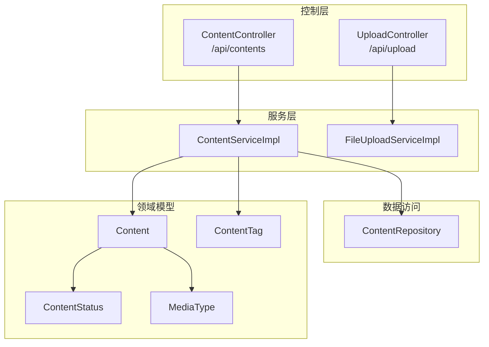
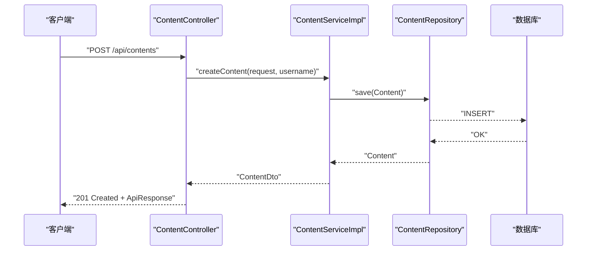
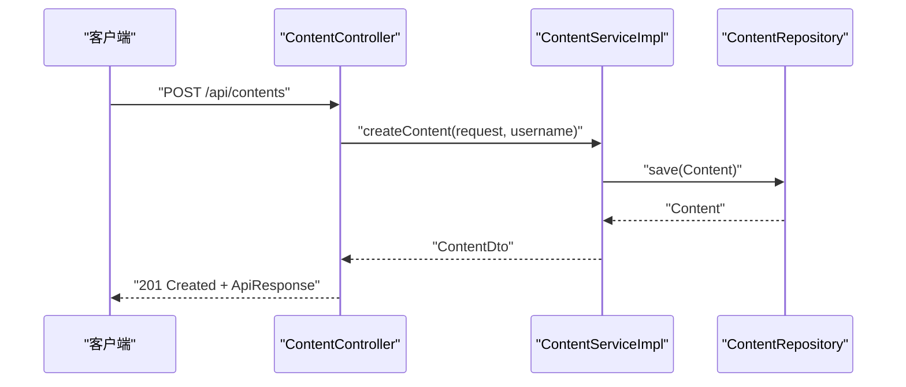
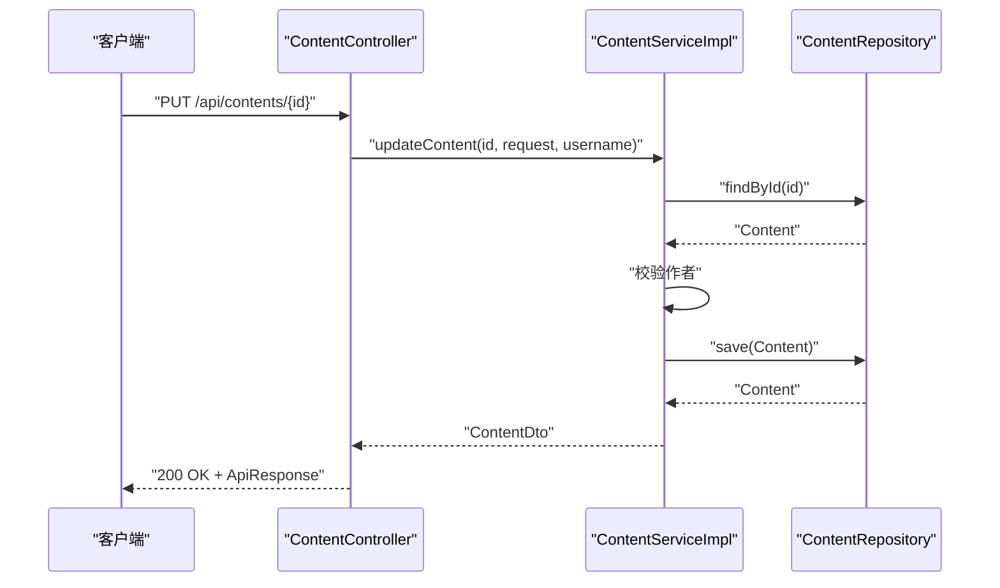
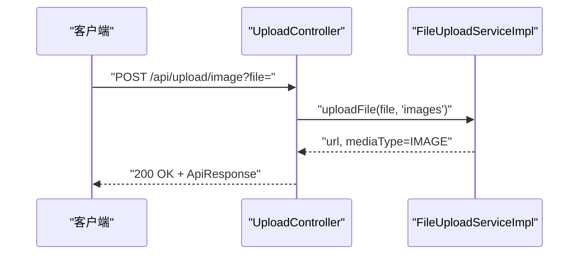
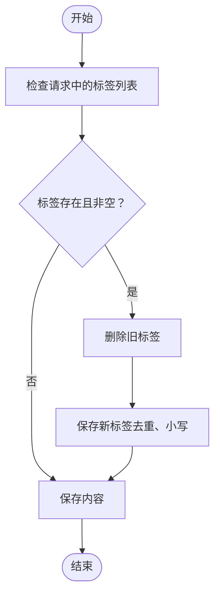
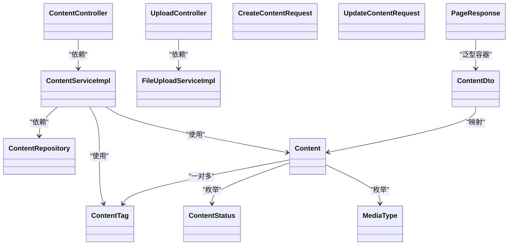

# 内容接口

<cite>
**本文引用的文件**
- [communication-backend/src/main/java/com/communication/controller/ContentController.java](file://communication-backend/src/main/java/com/communication/controller/ContentController.java)
- [communication-backend/src/main/java/com/communication/controller/UploadController.java](file://communication-backend/src/main/java/com/communication/controller/UploadController.java)
- [communication-backend/src/main/java/com/communication/dto/CreateContentRequest.java](file://communication-backend/src/main/java/com/communication/dto/CreateContentRequest.java)
- [communication-backend/src/main/java/com/communication/dto/UpdateContentRequest.java](file://communication-backend/src/main/java/com/communication/dto/UpdateContentRequest.java)
- [communication-backend/src/main/java/com/communication/dto/ContentDto.java](file://communication-backend/src/main/java/com/communication/dto/ContentDto.java)
- [communication-backend/src/main/java/com/communication/dto/PageResponse.java](file://communication-backend/src/main/java/com/communication/dto/PageResponse.java)
- [communication-backend/src/main/java/com/communication/entity/Content.java](file://communication-backend/src/main/java/com/communication/entity/Content.java)
- [communication-backend/src/main/java/com/communication/entity/ContentStatus.java](file://communication-backend/src/main/java/com/communication/entity/ContentStatus.java)
- [communication-backend/src/main/java/com/communication/entity/MediaType.java](file://communication-backend/src/main/java/com/communication/entity/MediaType.java)
- [communication-backend/src/main/java/com/communication/entity/ContentTag.java](file://communication-backend/src/main/java/com/communication/entity/ContentTag.java)
- [communication-backend/src/main/java/com/communication/service/impl/ContentServiceImpl.java](file://communication-backend/src/main/java/com/communication/service/impl/ContentServiceImpl.java)
- [communication-backend/src/main/java/com/communication/service/impl/FileUploadServiceImpl.java](file://communication-backend/src/main/java/com/communication/service/impl/FileUploadServiceImpl.java)
- [communication-backend/src/main/java/com/communication/repository/ContentRepository.java](file://communication-backend/src/main/java/com/communication/repository/ContentRepository.java)
- [communication-backend/src/main/resources/application.yml](file://communication-backend/src/main/resources/application.yml)
</cite>

## 目录
1. [简介](#简介)
2. [项目结构](#项目结构)
3. [核心组件](#核心组件)
4. [架构总览](#架构总览)
5. [详细组件分析](#详细组件分析)
6. [依赖关系分析](#依赖关系分析)
7. [性能考虑](#性能考虑)
8. [故障排查指南](#故障排查指南)
9. [结论](#结论)
10. [附录](#附录)

## 简介
本文件为内容管理模块的完整API接口文档，覆盖内容的创建、查询、更新、删除与草稿管理，以及媒体文件上传、标签设置、分页与排序、状态管理、权限控制与作者验证、相关推荐机制与批量操作建议等。读者可据此对接后端服务，实现内容全生命周期管理。

## 项目结构
内容管理相关的核心文件组织如下：
- 控制层：内容控制器与上传控制器
- DTO：请求与响应数据模型
- 实体与枚举：内容实体、状态与媒体类型
- 服务层：内容服务与文件上传服务
- 数据访问：内容仓库
- 配置：应用配置与文件上传限制

图表来源
- [communication-backend/src/main/java/com/communication/controller/ContentController.java](file://communication-backend/src/main/java/com/communication/controller/ContentController.java#L1-L85)
- [communication-backend/src/main/java/com/communication/controller/UploadController.java](file://communication-backend/src/main/java/com/communication/controller/UploadController.java#L1-L59)
- [communication-backend/src/main/java/com/communication/service/impl/ContentServiceImpl.java](file://communication-backend/src/main/java/com/communication/service/impl/ContentServiceImpl.java#L1-L199)
- [communication-backend/src/main/java/com/communication/service/impl/FileUploadServiceImpl.java](file://communication-backend/src/main/java/com/communication/service/impl/FileUploadServiceImpl.java#L1-L88)
- [communication-backend/src/main/java/com/communication/repository/ContentRepository.java](file://communication-backend/src/main/java/com/communication/repository/ContentRepository.java#L1-L56)
- [communication-backend/src/main/java/com/communication/entity/Content.java](file://communication-backend/src/main/java/com/communication/entity/Content.java#L1-L135)
- [communication-backend/src/main/java/com/communication/entity/ContentTag.java](file://communication-backend/src/main/java/com/communication/entity/ContentTag.java#L1-L66)
- [communication-backend/src/main/java/com/communication/entity/ContentStatus.java](file://communication-backend/src/main/java/com/communication/entity/ContentStatus.java#L1-L7)
- [communication-backend/src/main/java/com/communication/entity/MediaType.java](file://communication-backend/src/main/java/com/communication/entity/MediaType.java#L1-L8)

章节来源
- [communication-backend/src/main/java/com/communication/controller/ContentController.java](file://communication-backend/src/main/java/com/communication/controller/ContentController.java#L1-L85)
- [communication-backend/src/main/java/com/communication/controller/UploadController.java](file://communication-backend/src/main/java/com/communication/controller/UploadController.java#L1-L59)

## 核心组件
- 内容控制器：提供内容的创建、查询、更新、删除、按作者查询、个人内容查询（含草稿过滤）等REST接口。
- 上传控制器：提供图片与视频上传接口，并返回媒体URL与媒体类型。
- 内容服务：封装业务逻辑，包括权限校验、标签保存、分页查询、视图计数递增等。
- 文件上传服务：负责文件类型校验、存储路径生成与文件写入。
- 数据模型：内容实体、标签实体、状态枚举、媒体类型枚举。
- 分页响应：统一的分页返回结构。

章节来源
- [communication-backend/src/main/java/com/communication/controller/ContentController.java](file://communication-backend/src/main/java/com/communication/controller/ContentController.java#L1-L85)
- [communication-backend/src/main/java/com/communication/controller/UploadController.java](file://communication-backend/src/main/java/com/communication/controller/UploadController.java#L1-L59)
- [communication-backend/src/main/java/com/communication/service/impl/ContentServiceImpl.java](file://communication-backend/src/main/java/com/communication/service/impl/ContentServiceImpl.java#L1-L199)
- [communication-backend/src/main/java/com/communication/service/impl/FileUploadServiceImpl.java](file://communication-backend/src/main/java/com/communication/service/impl/FileUploadServiceImpl.java#L1-L88)
- [communication-backend/src/main/java/com/communication/dto/PageResponse.java](file://communication-backend/src/main/java/com/communication/dto/PageResponse.java#L1-L65)
- [communication-backend/src/main/java/com/communication/entity/Content.java](file://communication-backend/src/main/java/com/communication/entity/Content.java#L1-L135)
- [communication-backend/src/main/java/com/communication/entity/ContentTag.java](file://communication-backend/src/main/java/com/communication/entity/ContentTag.java#L1-L66)
- [communication-backend/src/main/java/com/communication/entity/ContentStatus.java](file://communication-backend/src/main/java/com/communication/entity/ContentStatus.java#L1-L7)
- [communication-backend/src/main/java/com/communication/entity/MediaType.java](file://communication-backend/src/main/java/com/communication/entity/MediaType.java#L1-L8)

## 架构总览
内容管理模块遵循典型的分层架构：
- 表现层：Spring MVC 控制器接收HTTP请求，返回统一响应包装。
- 应用层：服务实现处理业务规则，进行权限校验与数据转换。
- 基础设施层：JPA仓库访问数据库，文件上传服务处理本地文件系统。

图表来源
- [communication-backend/src/main/java/com/communication/controller/ContentController.java](file://communication-backend/src/main/java/com/communication/controller/ContentController.java#L23-L31)
- [communication-backend/src/main/java/com/communication/service/impl/ContentServiceImpl.java](file://communication-backend/src/main/java/com/communication/service/impl/ContentServiceImpl.java#L36-L58)
- [communication-backend/src/main/java/com/communication/repository/ContentRepository.java](file://communication-backend/src/main/java/com/communication/repository/ContentRepository.java#L17-L21)

## 详细组件分析

### 接口定义与行为

- 创建内容
  - 方法与路径：POST /api/contents
  - 认证：需要登录用户上下文
  - 请求体：CreateContentRequest
  - 返回：创建成功的内容DTO
  - 权限：仅允许创建者本人内容
  - 草稿：请求中可指定状态，默认发布
  - 标签：最多10个，自动去重并转小写

- 查询内容列表（公开）
  - 方法与路径：GET /api/contents?page=&size=
  - 参数：page（默认0）、size（默认10）
  - 过滤：仅返回已发布内容
  - 排序：按创建时间倒序
  - 返回：分页响应对象

- 查询内容详情
  - 方法与路径：GET /api/contents/{id}
  - 返回：内容DTO
  - 行为：读取后增加一次浏览量

- 更新内容
  - 方法与路径：PUT /api/contents/{id}
  - 认证：需要登录用户上下文
  - 请求体：UpdateContentRequest
  - 权限：仅内容作者可修改
  - 标签：若提供则替换全部标签

- 删除内容
  - 方法与路径：DELETE /api/contents/{id}
  - 认证：需要登录用户上下文
  - 权限：仅内容作者可删除

- 按作者查询内容（公开）
  - 方法与路径：GET /api/contents/user/{authorId}?page=&size=
  - 过滤：仅返回该作者的已发布内容
  - 排序：按创建时间倒序

- 查询个人内容（草稿管理）
  - 方法与路径：GET /api/contents/my?status=&page=&size=
  - 参数：status（可选，过滤草稿或已发布），page，size
  - 权限：仅当前登录用户可见自己的内容

- 上传媒体
  - 图片上传：POST /api/upload/image?file=
    - 允许类型：JPEG、PNG、GIF、WebP
    - 返回：url、mediaType=IMAGE
  - 视频上传：POST /api/upload/video?file=
    - 允许类型：MP4、WebM、MOV
    - 返回：url、mediaType=VIDEO

章节来源
- [communication-backend/src/main/java/com/communication/controller/ContentController.java](file://communication-backend/src/main/java/com/communication/controller/ContentController.java#L23-L83)
- [communication-backend/src/main/java/com/communication/controller/UploadController.java](file://communication-backend/src/main/java/com/communication/controller/UploadController.java#L23-L57)
- [communication-backend/src/main/java/com/communication/service/impl/ContentServiceImpl.java](file://communication-backend/src/main/java/com/communication/service/impl/ContentServiceImpl.java#L119-L154)
- [communication-backend/src/main/java/com/communication/repository/ContentRepository.java](file://communication-backend/src/main/java/com/communication/repository/ContentRepository.java#L19-L26)

### 数据模型与字段说明

- CreateContentRequest
  - 字段：title（必填，长度<=200）、body（可选）、mediaUrl（可选）、mediaType（默认TEXT）、status（默认PUBLISHED）、tags（最多10个）
  - 用途：创建内容时的输入参数

- UpdateContentRequest
  - 字段：title（可选，长度<=200）、body（可选）、mediaUrl（可选）、mediaType（可选）、status（可选）、tags（可选，最多10个）
  - 用途：更新内容时的输入参数

- ContentDto
  - 字段：id、title、body、mediaUrl、mediaType、viewCount、commentCount、status、tags、createdAt、updatedAt、author
  - 用途：对外输出的内容数据传输对象

- 分页响应 PageResponse
  - 字段：content（列表）、page、size、totalElements、totalPages、first、last
  - 用途：统一的分页返回结构

- 内容实体 Content
  - 关键字段：author、title、body、mediaUrl、mediaType、viewCount、commentCount、status、tags、createdAt、updatedAt
  - 用途：持久化内容信息

- 枚举
  - ContentStatus：DRAFT、PUBLISHED
  - MediaType：TEXT、IMAGE、VIDEO

章节来源
- [communication-backend/src/main/java/com/communication/dto/CreateContentRequest.java](file://communication-backend/src/main/java/com/communication/dto/CreateContentRequest.java#L10-L41)
- [communication-backend/src/main/java/com/communication/dto/UpdateContentRequest.java](file://communication-backend/src/main/java/com/communication/dto/UpdateContentRequest.java#L9-L39)
- [communication-backend/src/main/java/com/communication/dto/ContentDto.java](file://communication-backend/src/main/java/com/communication/dto/ContentDto.java#L10-L67)
- [communication-backend/src/main/java/com/communication/dto/PageResponse.java](file://communication-backend/src/main/java/com/communication/dto/PageResponse.java#L5-L41)
- [communication-backend/src/main/java/com/communication/entity/Content.java](file://communication-backend/src/main/java/com/communication/entity/Content.java#L13-L99)
- [communication-backend/src/main/java/com/communication/entity/ContentStatus.java](file://communication-backend/src/main/java/com/communication/entity/ContentStatus.java#L3-L6)
- [communication-backend/src/main/java/com/communication/entity/MediaType.java](file://communication-backend/src/main/java/com/communication/entity/MediaType.java#L3-L7)

### 状态管理与转换规则
- 状态枚举：DRAFT（草稿）、PUBLISHED（已发布）
- 默认状态：创建时默认发布
- 转换规则：
  - 可从草稿改为已发布（通过更新接口设置status=PUBLISHED）
  - 不支持从已发布直接转为草稿（如需撤回，请在前端或业务侧做展示隐藏处理）
- 个人内容查询支持按状态过滤（草稿/已发布）

章节来源
- [communication-backend/src/main/java/com/communication/entity/ContentStatus.java](file://communication-backend/src/main/java/com/communication/entity/ContentStatus.java#L3-L6)
- [communication-backend/src/main/java/com/communication/dto/CreateContentRequest.java](file://communication-backend/src/main/java/com/communication/dto/CreateContentRequest.java#L20-L22)
- [communication-backend/src/main/java/com/communication/service/impl/ContentServiceImpl.java](file://communication-backend/src/main/java/com/communication/service/impl/ContentServiceImpl.java#L141-L154)

### 权限控制与作者验证
- 所有需要认证的接口均通过Spring Security注入UserDetails
- 更新与删除接口会比对内容作者与当前用户名，非作者调用将被拒绝
- 个人内容查询仅返回当前登录用户的全部内容或指定状态的内容

章节来源
- [communication-backend/src/main/java/com/communication/controller/ContentController.java](file://communication-backend/src/main/java/com/communication/controller/ContentController.java#L48-L63)
- [communication-backend/src/main/java/com/communication/service/impl/ContentServiceImpl.java](file://communication-backend/src/main/java/com/communication/service/impl/ContentServiceImpl.java#L74-L76)
- [communication-backend/src/main/java/com/communication/service/impl/ContentServiceImpl.java](file://communication-backend/src/main/java/com/communication/service/impl/ContentServiceImpl.java#L112-L114)

### 标签与媒体类型
- 标签
  - 最多10个，自动去重、转小写
  - 创建时一次性保存；更新时若提供则替换全部标签
- 媒体类型
  - TEXT：文本内容
  - IMAGE：图片
  - VIDEO：视频
  - 上传接口返回对应mediaType

章节来源
- [communication-backend/src/main/java/com/communication/dto/CreateContentRequest.java](file://communication-backend/src/main/java/com/communication/dto/CreateContentRequest.java#L24-L25)
- [communication-backend/src/main/java/com/communication/dto/UpdateContentRequest.java](file://communication-backend/src/main/java/com/communication/dto/UpdateContentRequest.java#L22-L23)
- [communication-backend/src/main/java/com/communication/service/impl/ContentServiceImpl.java](file://communication-backend/src/main/java/com/communication/service/impl/ContentServiceImpl.java#L178-L187)
- [communication-backend/src/main/java/com/communication/controller/UploadController.java](file://communication-backend/src/main/java/com/communication/controller/UploadController.java#L32-L38)
- [communication-backend/src/main/java/com/communication/controller/UploadController.java](file://communication-backend/src/main/java/com/communication/controller/UploadController.java#L50-L56)
- [communication-backend/src/main/java/com/communication/entity/MediaType.java](file://communication-backend/src/main/java/com/communication/entity/MediaType.java#L3-L7)

### 分页参数、筛选条件与排序
- 分页参数：page（默认0）、size（默认10）
- 筛选条件：
  - 公开列表：仅已发布内容
  - 按作者：authorId + 已发布
  - 个人内容：authorId（当前用户）+ 可选status
- 排序：均按createdAt降序

章节来源
- [communication-backend/src/main/java/com/communication/controller/ContentController.java](file://communication-backend/src/main/java/com/communication/controller/ContentController.java#L33-L39)
- [communication-backend/src/main/java/com/communication/controller/ContentController.java](file://communication-backend/src/main/java/com/communication/controller/ContentController.java#L65-L72)
- [communication-backend/src/main/java/com/communication/controller/ContentController.java](file://communication-backend/src/main/java/com/communication/controller/ContentController.java#L74-L83)
- [communication-backend/src/main/java/com/communication/service/impl/ContentServiceImpl.java](file://communication-backend/src/main/java/com/communication/service/impl/ContentServiceImpl.java#L121-L127)
- [communication-backend/src/main/java/com/communication/service/impl/ContentServiceImpl.java](file://communication-backend/src/main/java/com/communication/service/impl/ContentServiceImpl.java#L131-L137)
- [communication-backend/src/main/java/com/communication/service/impl/ContentServiceImpl.java](file://communication-backend/src/main/java/com/communication/service/impl/ContentServiceImpl.java#L141-L154)

### 相关推荐机制
- 当前实现未提供基于标签或关键词的相关推荐接口
- 可通过搜索功能扩展：根据关键词或标签检索内容（见搜索服务相关接口）

章节来源
- [communication-backend/src/main/java/com/communication/repository/ContentRepository.java](file://communication-backend/src/main/java/com/communication/repository/ContentRepository.java#L47-L54)

### 批量操作支持
- 当前未提供批量创建、批量更新、批量删除接口
- 如需批量操作，可在客户端循环调用单条接口或在服务端新增批量接口

章节来源
- [communication-backend/src/main/java/com/communication/controller/ContentController.java](file://communication-backend/src/main/java/com/communication/controller/ContentController.java#L23-L83)

### API调用序列图

#### 创建内容流程

图表来源
- [communication-backend/src/main/java/com/communication/controller/ContentController.java](file://communication-backend/src/main/java/com/communication/controller/ContentController.java#L23-L31)
- [communication-backend/src/main/java/com/communication/service/impl/ContentServiceImpl.java](file://communication-backend/src/main/java/com/communication/service/impl/ContentServiceImpl.java#L36-L58)

#### 更新内容流程

图表来源
- [communication-backend/src/main/java/com/communication/controller/ContentController.java](file://communication-backend/src/main/java/com/communication/controller/ContentController.java#L48-L55)
- [communication-backend/src/main/java/com/communication/service/impl/ContentServiceImpl.java](file://communication-backend/src/main/java/com/communication/service/impl/ContentServiceImpl.java#L68-L104)

#### 上传媒体流程

图表来源
- [communication-backend/src/main/java/com/communication/controller/UploadController.java](file://communication-backend/src/main/java/com/communication/controller/UploadController.java#L23-L39)
- [communication-backend/src/main/java/com/communication/service/impl/FileUploadServiceImpl.java](file://communication-backend/src/main/java/com/communication/service/impl/FileUploadServiceImpl.java#L31-L61)

### 数据流与处理逻辑

#### 标签保存与更新流程

图表来源
- [communication-backend/src/main/java/com/communication/service/impl/ContentServiceImpl.java](file://communication-backend/src/main/java/com/communication/service/impl/ContentServiceImpl.java#L94-L100)
- [communication-backend/src/main/java/com/communication/service/impl/ContentServiceImpl.java](file://communication-backend/src/main/java/com/communication/service/impl/ContentServiceImpl.java#L178-L187)

## 依赖关系分析

图表来源
- [communication-backend/src/main/java/com/communication/controller/ContentController.java](file://communication-backend/src/main/java/com/communication/controller/ContentController.java#L1-L85)
- [communication-backend/src/main/java/com/communication/controller/UploadController.java](file://communication-backend/src/main/java/com/communication/controller/UploadController.java#L1-L59)
- [communication-backend/src/main/java/com/communication/service/impl/ContentServiceImpl.java](file://communication-backend/src/main/java/com/communication/service/impl/ContentServiceImpl.java#L1-L199)
- [communication-backend/src/main/java/com/communication/service/impl/FileUploadServiceImpl.java](file://communication-backend/src/main/java/com/communication/service/impl/FileUploadServiceImpl.java#L1-L88)
- [communication-backend/src/main/java/com/communication/repository/ContentRepository.java](file://communication-backend/src/main/java/com/communication/repository/ContentRepository.java#L1-L56)
- [communication-backend/src/main/java/com/communication/entity/Content.java](file://communication-backend/src/main/java/com/communication/entity/Content.java#L1-L135)
- [communication-backend/src/main/java/com/communication/entity/ContentTag.java](file://communication-backend/src/main/java/com/communication/entity/ContentTag.java#L1-L66)
- [communication-backend/src/main/java/com/communication/entity/ContentStatus.java](file://communication-backend/src/main/java/com/communication/entity/ContentStatus.java#L1-L7)
- [communication-backend/src/main/java/com/communication/entity/MediaType.java](file://communication-backend/src/main/java/com/communication/entity/MediaType.java#L1-L8)
- [communication-backend/src/main/java/com/communication/dto/CreateContentRequest.java](file://communication-backend/src/main/java/com/communication/dto/CreateContentRequest.java#L1-L42)
- [communication-backend/src/main/java/com/communication/dto/UpdateContentRequest.java](file://communication-backend/src/main/java/com/communication/dto/UpdateContentRequest.java#L1-L40)
- [communication-backend/src/main/java/com/communication/dto/ContentDto.java](file://communication-backend/src/main/java/com/communication/dto/ContentDto.java#L1-L118)
- [communication-backend/src/main/java/com/communication/dto/PageResponse.java](file://communication-backend/src/main/java/com/communication/dto/PageResponse.java#L1-L65)

## 性能考虑
- 分页查询：使用PageRequest避免一次性加载大量数据
- 视图计数：采用独立更新语句，减少锁竞争
- 标签处理：批量保存标签，避免逐条插入
- 文件上传：限制文件大小与类型，避免过大资源占用

章节来源
- [communication-backend/src/main/java/com/communication/service/impl/ContentServiceImpl.java](file://communication-backend/src/main/java/com/communication/service/impl/ContentServiceImpl.java#L121-L127)
- [communication-backend/src/main/java/com/communication/repository/ContentRepository.java](file://communication-backend/src/main/java/com/communication/repository/ContentRepository.java#L28-L30)
- [communication-backend/src/main/resources/application.yml](file://communication-backend/src/main/resources/application.yml#L25-L28)

## 故障排查指南
- 401/403：未登录或非内容作者访问更新/删除接口
  - 现象：抛出“仅允许编辑/删除自己的内容”
  - 处理：确认登录状态与内容作者身份
- 404：内容不存在
  - 现象：查询详情或更新/删除时抛出资源不存在异常
  - 处理：检查内容ID是否正确
- 400：请求参数不合法
  - 标题超长、标签过多、文件类型不支持
  - 处理：调整请求参数或文件类型
- 上传失败：文件为空或IO异常
  - 处理：检查文件大小、类型与服务器磁盘权限

章节来源
- [communication-backend/src/main/java/com/communication/service/impl/ContentServiceImpl.java](file://communication-backend/src/main/java/com/communication/service/impl/ContentServiceImpl.java#L74-L76)
- [communication-backend/src/main/java/com/communication/service/impl/ContentServiceImpl.java](file://communication-backend/src/main/java/com/communication/service/impl/ContentServiceImpl.java#L112-L114)
- [communication-backend/src/main/java/com/communication/service/impl/FileUploadServiceImpl.java](file://communication-backend/src/main/java/com/communication/service/impl/FileUploadServiceImpl.java#L33-L40)

## 结论
内容管理模块提供了完整的CRUD能力与草稿管理、媒体上传、标签与分页查询等特性。通过严格的权限控制与清晰的状态管理，确保内容安全与一致性。建议后续扩展批量操作、相关推荐与更丰富的筛选条件以满足复杂业务需求。

## 附录

### 统一响应结构
- 成功响应：包含消息与数据
- 错误响应：包含错误码与消息

章节来源
- [communication-backend/src/main/java/com/communication/controller/ContentController.java](file://communication-backend/src/main/java/com/communication/controller/ContentController.java#L23-L31)
- [communication-backend/src/main/java/com/communication/controller/UploadController.java](file://communication-backend/src/main/java/com/communication/controller/UploadController.java#L28-L29)