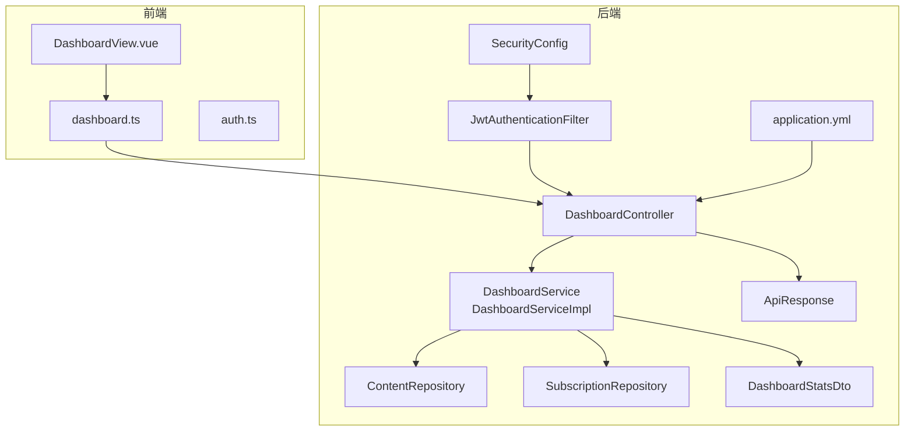
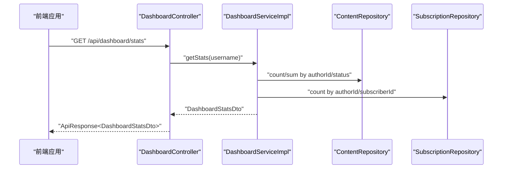
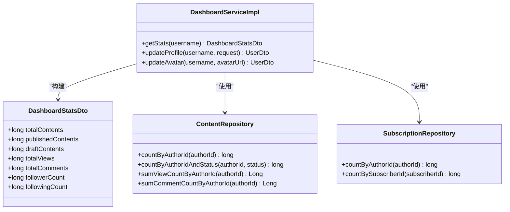
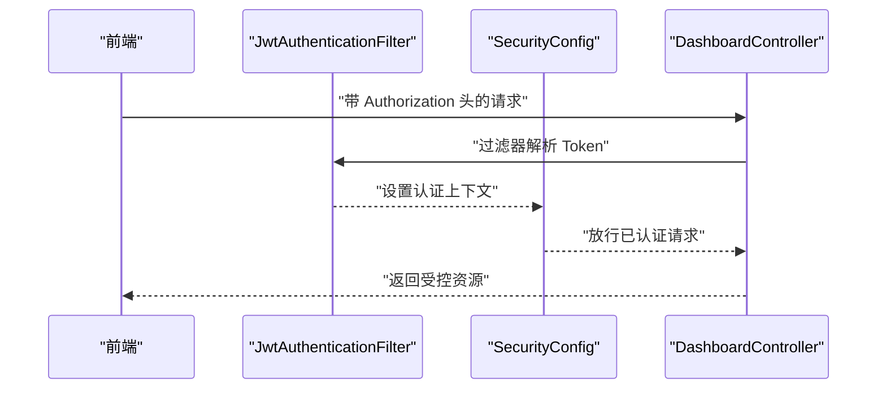
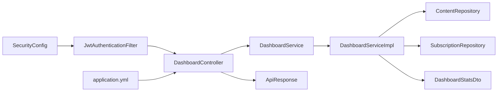

# 后台管理接口

<cite>
**本文引用的文件**
- [DashboardController.java](file://communication-backend/src/main/java/com/communication/controller/DashboardController.java)
- [DashboardService.java](file://communication-backend/src/main/java/com/communication/service/DashboardService.java)
- [DashboardServiceImpl.java](file://communication-backend/src/main/java/com/communication/service/impl/DashboardServiceImpl.java)
- [DashboardStatsDto.java](file://communication-backend/src/main/java/com/communication/dto/DashboardStatsDto.java)
- [ApiResponse.java](file://communication-backend/src/main/java/com/communication/dto/ApiResponse.java)
- [ContentRepository.java](file://communication-backend/src/main/java/com/communication/repository/ContentRepository.java)
- [SubscriptionRepository.java](file://communication-backend/src/main/java/com/communication/repository/SubscriptionRepository.java)
- [SecurityConfig.java](file://communication-backend/src/main/java/com/communication/config/SecurityConfig.java)
- [JwtAuthenticationFilter.java](file://communication-backend/src/main/java/com/communication/config/JwtAuthenticationFilter.java)
- [application.yml](file://communication-backend/src/main/resources/application.yml)
- [dashboard.ts](file://communication-frontend/src/api/dashboard.ts)
- [DashboardView.vue](file://communication-frontend/src/views/user/DashboardView.vue)
- [auth.ts](file://communication-frontend/src/stores/auth.ts)
</cite>

## 目录
1. [简介](#简介)
2. [项目结构](#项目结构)
3. [核心组件](#核心组件)
4. [架构总览](#架构总览)
5. [详细组件分析](#详细组件分析)
6. [依赖关系分析](#依赖关系分析)
7. [性能考虑](#性能考虑)
8. [故障排查指南](#故障排查指南)
9. [结论](#结论)
10. [附录](#附录)

## 简介
本文件面向后台管理模块，聚焦数据概览、统计分析与系统监控的完整接口规范。重点覆盖以下方面：
- DashboardStatsDto 数据结构与字段语义
- 不同维度的数据聚合与分页筛选
- 实时数据更新与缓存策略建议
- 管理员权限验证与数据访问控制
- 数据导出与报表生成能力规划
- 系统健康检查与性能监控接口建议
- 用户行为分析与趋势预测能力规划
- 数据可视化图表接口规范与前端集成方案

## 项目结构
后端采用 Spring Boot 分层架构，前端使用 Vue + Pinia 构建。后台管理接口位于后端控制器层，通过服务层聚合仓库层数据，返回统一响应包装。

**图示来源**
- [DashboardController.java](file://communication-backend/src/main/java/com/communication/controller/DashboardController.java#L1-L65)
- [DashboardServiceImpl.java](file://communication-backend/src/main/java/com/communication/service/impl/DashboardServiceImpl.java#L1-L87)
- [ContentRepository.java](file://communication-backend/src/main/java/com/communication/repository/ContentRepository.java#L1-L56)
- [SubscriptionRepository.java](file://communication-backend/src/main/java/com/communication/repository/SubscriptionRepository.java#L1-L34)
- [ApiResponse.java](file://communication-backend/src/main/java/com/communication/dto/ApiResponse.java#L1-L76)
- [DashboardStatsDto.java](file://communication-backend/src/main/java/com/communication/dto/DashboardStatsDto.java#L1-L64)
- [SecurityConfig.java](file://communication-backend/src/main/java/com/communication/config/SecurityConfig.java#L1-L89)
- [JwtAuthenticationFilter.java](file://communication-backend/src/main/java/com/communication/config/JwtAuthenticationFilter.java#L1-L69)
- [application.yml](file://communication-backend/src/main/resources/application.yml#L1-L42)

**章节来源**
- [DashboardController.java](file://communication-backend/src/main/java/com/communication/controller/DashboardController.java#L1-L65)
- [SecurityConfig.java](file://communication-backend/src/main/java/com/communication/config/SecurityConfig.java#L1-L89)

## 核心组件
- 控制器层：提供 /api/dashboard 下的统计、内容查询、个人资料更新与头像上传接口。
- 服务层：聚合用户、内容、评论、订阅数据，构建 DashboardStatsDto。
- 仓储层：基于 JPA 提供按作者、状态、关键字等条件的聚合查询。
- DTO 层：统一响应包装与统计结果模型。
- 安全层：基于 JWT 的无状态认证与授权。

**章节来源**
- [DashboardController.java](file://communication-backend/src/main/java/com/communication/controller/DashboardController.java#L1-L65)
- [DashboardService.java](file://communication-backend/src/main/java/com/communication/service/DashboardService.java#L1-L15)
- [DashboardServiceImpl.java](file://communication-backend/src/main/java/com/communication/service/impl/DashboardServiceImpl.java#L1-L87)
- [DashboardStatsDto.java](file://communication-backend/src/main/java/com/communication/dto/DashboardStatsDto.java#L1-L64)
- [ApiResponse.java](file://communication-backend/src/main/java/com/communication/dto/ApiResponse.java#L1-L76)

## 架构总览
后台管理接口遵循“请求-控制器-服务-仓储-数据库”的调用链路，并通过安全过滤器注入认证上下文。

**图示来源**
- [DashboardController.java](file://communication-backend/src/main/java/com/communication/controller/DashboardController.java#L27-L31)
- [DashboardServiceImpl.java](file://communication-backend/src/main/java/com/communication/service/impl/DashboardServiceImpl.java#L33-L57)
- [ContentRepository.java](file://communication-backend/src/main/java/com/communication/repository/ContentRepository.java#L34-L42)
- [SubscriptionRepository.java](file://communication-backend/src/main/java/com/communication/repository/SubscriptionRepository.java#L25-L27)

## 详细组件分析

### 接口定义与调用流程
- 统计接口
  - 方法：GET
  - 路径：/api/dashboard/stats
  - 认证：需要 JWT
  - 返回：ApiResponse<DashboardStatsDto>
- 内容查询接口
  - 方法：GET
  - 路径：/api/dashboard/contents
  - 查询参数：status（可选）、page（默认0）、size（默认10）
  - 认证：需要 JWT
  - 返回：ApiResponse<PageResponse<ContentDto>>
- 个人资料更新接口
  - 方法：PUT
  - 路径：/api/dashboard/profile
  - 请求体：UpdateProfileRequest（可选字段：bio、avatarUrl）
  - 认证：需要 JWT
  - 返回：ApiResponse<UserDto>
- 头像上传接口
  - 方法：POST
  - 路径：/api/dashboard/avatar
  - 表单参数：file（MultipartFile）
  - 认证：需要 JWT
  - 返回：ApiResponse<UserDto>

**章节来源**
- [DashboardController.java](file://communication-backend/src/main/java/com/communication/controller/DashboardController.java#L27-L63)
- [ApiResponse.java](file://communication-backend/src/main/java/com/communication/dto/ApiResponse.java#L32-L48)

### 数据概览与统计分析（DashboardStatsDto）
- 字段语义
  - totalContents：作者内容总数
  - publishedContents：已发布内容数
  - draftContents：草稿内容数
  - totalViews：作者内容总浏览量（聚合）
  - totalComments：作者内容总评论数（聚合）
  - followerCount：粉丝数（被关注数）
  - followingCount：正在关注数
- 聚合来源
  - 内容计数与聚合：ContentRepository 提供按作者与状态的计数与聚合
  - 订阅计数：SubscriptionRepository 提供按作者/订阅者的计数
- 时间范围筛选
  - 当前实现未内置时间范围参数；如需时间维度，可在服务层扩展日期过滤条件（例如在内容仓储中增加按创建时间范围的聚合查询）

**图示来源**
- [DashboardStatsDto.java](file://communication-backend/src/main/java/com/communication/dto/DashboardStatsDto.java#L3-L63)
- [DashboardServiceImpl.java](file://communication-backend/src/main/java/com/communication/service/impl/DashboardServiceImpl.java#L33-L57)
- [ContentRepository.java](file://communication-backend/src/main/java/com/communication/repository/ContentRepository.java#L34-L42)
- [SubscriptionRepository.java](file://communication-backend/src/main/java/com/communication/repository/SubscriptionRepository.java#L25-L27)

**章节来源**
- [DashboardStatsDto.java](file://communication-backend/src/main/java/com/communication/dto/DashboardStatsDto.java#L1-L64)
- [DashboardServiceImpl.java](file://communication-backend/src/main/java/com/communication/service/impl/DashboardServiceImpl.java#L33-L57)
- [ContentRepository.java](file://communication-backend/src/main/java/com/communication/repository/ContentRepository.java#L34-L42)
- [SubscriptionRepository.java](file://communication-backend/src/main/java/com/communication/repository/SubscriptionRepository.java#L25-L27)

### 权限验证与数据访问控制
- 认证机制
  - 基于 JWT 的无状态认证，过滤器从 Authorization 头解析 Bearer Token 并注入认证上下文
- 授权规则
  - 除公开接口外，其余接口均需认证
  - 控制器方法通过 Spring Security 的 Authentication 参数获取当前用户名，用于数据隔离（仅返回当前用户的统计与内容）
- 前端集成
  - 前端通过 Pinia 状态管理维护 token 与用户信息，接口调用自动携带 Authorization 头

**图示来源**
- [JwtAuthenticationFilter.java](file://communication-backend/src/main/java/com/communication/config/JwtAuthenticationFilter.java#L31-L67)
- [SecurityConfig.java](file://communication-backend/src/main/java/com/communication/config/SecurityConfig.java#L66-L84)
- [DashboardController.java](file://communication-backend/src/main/java/com/communication/controller/DashboardController.java#L27-L31)

**章节来源**
- [JwtAuthenticationFilter.java](file://communication-backend/src/main/java/com/communication/config/JwtAuthenticationFilter.java#L1-L69)
- [SecurityConfig.java](file://communication-backend/src/main/java/com/communication/config/SecurityConfig.java#L1-L89)
- [auth.ts](file://communication-frontend/src/stores/auth.ts#L1-L96)

### 数据导出与报表生成
- 当前后端未提供专门的导出接口
- 建议扩展
  - 新增导出接口：如 GET /api/dashboard/reports（支持格式：CSV/Excel）
  - 支持时间范围与维度参数：如 start、end、group-by（日/周/月）
  - 结合服务层聚合结果进行批量导出
- 前端集成
  - 使用 dashboard.ts 中的现有模式封装导出请求
  - 导出完成后提示下载或跳转至下载页面

[本节为能力规划，不直接分析具体文件，故无章节来源]

### 系统健康检查与性能监控
- 健康检查
  - 建议新增 GET /actuator/health（Spring Boot Actuator）暴露运行状态
- 性能监控
  - 建议新增 GET /api/monitor/stats 返回数据库连接池、JVM、请求耗时等指标
  - 对高频接口（如 /api/dashboard/stats）增加缓存与降级策略
- 日志与追踪
  - 为关键接口添加请求日志与链路追踪 ID，便于定位性能瓶颈

[本节为能力规划，不直接分析具体文件，故无章节来源]

### 用户行为分析与趋势预测
- 当前后端未提供趋势预测接口
- 建议扩展
  - 新增 GET /api/dashboard/trends（支持维度：日/周/月、指标：浏览量、评论数、新增内容）
  - 结合历史数据与简单算法（移动平均、线性回归）输出趋势预测
- 前端集成
  - 在 DashboardView.vue 中渲染折线图/柱状图，按需轮询或推送更新

[本节为能力规划，不直接分析具体文件，故无章节来源]

### 数据可视化图表接口规范与前端集成
- 接口规范
  - GET /api/dashboard/charts?type=daily_views&start=YYYY-MM-DD&end=YYYY-MM-DD
  - 返回：{ labels: string[], datasets: { label: string, data: number[] }[] }
- 前端集成
  - 使用 dashboard.ts 封装请求
  - 在 DashboardView.vue 中渲染图表组件（如 Element Plus 图表或第三方库）

[本节为能力规划，不直接分析具体文件，故无章节来源]

## 依赖关系分析
- 控制器依赖服务层，服务层依赖仓储层与 DTO
- 安全配置与 JWT 过滤器贯穿请求链路
- 应用配置提供文件上传大小限制与 JWT 密钥等参数

**图示来源**
- [DashboardController.java](file://communication-backend/src/main/java/com/communication/controller/DashboardController.java#L1-L65)
- [DashboardServiceImpl.java](file://communication-backend/src/main/java/com/communication/service/impl/DashboardServiceImpl.java#L1-L87)
- [SecurityConfig.java](file://communication-backend/src/main/java/com/communication/config/SecurityConfig.java#L1-L89)
- [JwtAuthenticationFilter.java](file://communication-backend/src/main/java/com/communication/config/JwtAuthenticationFilter.java#L1-L69)
- [application.yml](file://communication-backend/src/main/resources/application.yml#L1-L42)

**章节来源**
- [DashboardController.java](file://communication-backend/src/main/java/com/communication/controller/DashboardController.java#L1-L65)
- [DashboardServiceImpl.java](file://communication-backend/src/main/java/com/communication/service/impl/DashboardServiceImpl.java#L1-L87)
- [SecurityConfig.java](file://communication-backend/src/main/java/com/communication/config/SecurityConfig.java#L1-L89)

## 性能考虑
- 缓存策略
  - 对 /api/dashboard/stats 增加 Redis 缓存，设置合理过期时间（如 5 分钟），热点数据可双写一致性
- 数据库优化
  - 为 author_id、status、created_at 添加索引，提升聚合查询性能
- 分页与限流
  - 对 /api/dashboard/contents 默认分页，避免大页导致内存压力
  - 对高频接口启用限流，防止突发流量击穿
- 文件上传
  - application.yml 已限制上传大小，建议前端预校验与断点续传

[本节提供通用建议，不直接分析具体文件，故无章节来源]

## 故障排查指南
- 认证失败
  - 检查 Authorization 头是否为 Bearer Token
  - 核对 JWT 密钥与过期时间配置
- 数据为空或为 0
  - 确认当前用户是否存在且有对应内容/订阅数据
  - 检查 ContentRepository 与 SubscriptionRepository 的聚合查询是否正确
- 前端无法获取数据
  - 确认 Pinia 状态中 token 是否存在
  - 检查 Nginx 反向代理是否正确转发 /api 与 /uploads

**章节来源**
- [JwtAuthenticationFilter.java](file://communication-backend/src/main/java/com/communication/config/JwtAuthenticationFilter.java#L31-L67)
- [SecurityConfig.java](file://communication-backend/src/main/java/com/communication/config/SecurityConfig.java#L66-L84)
- [auth.ts](file://communication-frontend/src/stores/auth.ts#L1-L96)

## 结论
后台管理模块已具备完善的统计与内容管理能力，通过统一响应包装与严格的认证授权，确保数据安全与一致性。建议后续补充导出、监控、趋势分析与可视化接口，进一步完善后台管理生态。

## 附录

### 接口一览（摘要）
- GET /api/dashboard/stats
  - 认证：是
  - 返回：DashboardStatsDto
- GET /api/dashboard/contents
  - 认证：是
  - 查询参数：status（可选）、page（默认0）、size（默认10）
  - 返回：PageResponse<ContentDto>
- PUT /api/dashboard/profile
  - 认证：是
  - 请求体：UpdateProfileRequest（bio、avatarUrl 可选）
  - 返回：UserDto
- POST /api/dashboard/avatar
  - 认证：是
  - 表单参数：file（MultipartFile）
  - 返回：UserDto

**章节来源**
- [DashboardController.java](file://communication-backend/src/main/java/com/communication/controller/DashboardController.java#L27-L63)
- [ApiResponse.java](file://communication-backend/src/main/java/com/communication/dto/ApiResponse.java#L32-L48)

### 前端集成要点
- 使用 dashboard.ts 中的封装函数发起请求
- 在 DashboardView.vue 中渲染数据概览卡片
- 通过 Pinia 状态管理维护用户登录态与 token

**章节来源**
- [dashboard.ts](file://communication-frontend/src/api/dashboard.ts#L1-L50)
- [DashboardView.vue](file://communication-frontend/src/views/user/DashboardView.vue#L1-L45)
- [auth.ts](file://communication-frontend/src/stores/auth.ts#L1-L96)