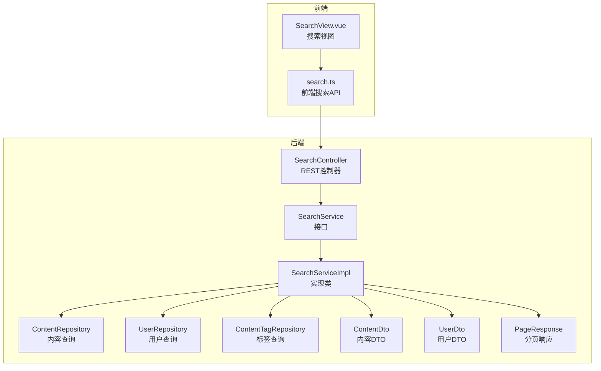
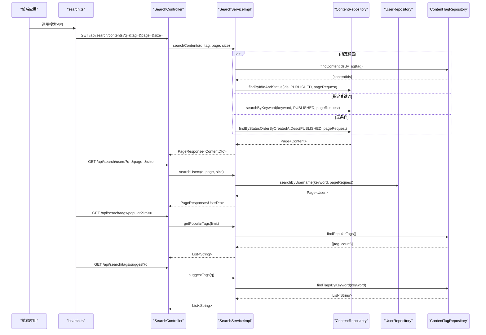
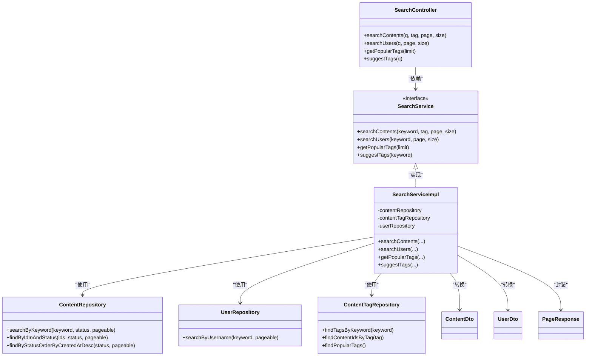

# 搜索接口

<cite>
**本文引用的文件**
- [SearchController.java](file://communication-backend/src/main/java/com/communication/controller/SearchController.java)
- [SearchService.java](file://communication-backend/src/main/java/com/communication/service/SearchService.java)
- [SearchServiceImpl.java](file://communication-backend/src/main/java/com/communication/service/impl/SearchServiceImpl.java)
- [ContentRepository.java](file://communication-backend/src/main/java/com/communication/repository/ContentRepository.java)
- [UserRepository.java](file://communication-backend/src/main/java/com/communication/repository/UserRepository.java)
- [ContentTagRepository.java](file://communication-backend/src/main/java/com/communication/repository/ContentTagRepository.java)
- [ContentDto.java](file://communication-backend/src/main/java/com/communication/dto/ContentDto.java)
- [UserDto.java](file://communication-backend/src/main/java/com/communication/dto/UserDto.java)
- [PageResponse.java](file://communication-backend/src/main/java/com/communication/dto/PageResponse.java)
- [application.yml](file://communication-backend/src/main/resources/application.yml)
- [V2__create_contents.sql](file://communication-backend/src/main/resources/db/migration/V2__create_contents.sql)
- [V4__create_content_tags.sql](file://communication-backend/src/main/resources/db/migration/V4__create_content_tags.sql)
- [search.ts](file://communication-frontend/src/api/search.ts)
- [SearchView.vue](file://communication-frontend/src/views/search/SearchView.vue)
- [SearchServiceTest.java](file://communication-backend/src/test/java/com/communication/service/SearchServiceTest.java)
</cite>

## 目录
1. [简介](#简介)
2. [项目结构](#项目结构)
3. [核心组件](#核心组件)
4. [架构总览](#架构总览)
5. [详细组件分析](#详细组件分析)
6. [依赖关系分析](#依赖关系分析)
7. [性能考虑](#性能考虑)
8. [故障排查指南](#故障排查指南)
9. [结论](#结论)
10. [附录](#附录)

## 简介
本文件为通信平台后端搜索功能模块的完整API接口文档，覆盖内容搜索、用户搜索、标签搜索与热门标签推荐等能力。文档详细说明了各接口的请求参数、响应格式、排序与权重逻辑、分页机制、前端集成方式以及性能优化与索引策略，并对权限控制与可见性过滤进行说明。

## 项目结构
后端采用Spring Boot分层架构：控制器层负责HTTP接口定义，服务层封装业务逻辑，仓库层负责数据访问，DTO用于接口间数据传输，配置文件管理数据库与JPA设置。前端通过独立API模块调用后端搜索接口。

图表来源
- [SearchController.java](file://communication-backend/src/main/java/com/communication/controller/SearchController.java#L1-L56)
- [SearchService.java](file://communication-backend/src/main/java/com/communication/service/SearchService.java#L1-L19)
- [SearchServiceImpl.java](file://communication-backend/src/main/java/com/communication/service/impl/SearchServiceImpl.java#L1-L129)
- [ContentRepository.java](file://communication-backend/src/main/java/com/communication/repository/ContentRepository.java#L1-L56)
- [UserRepository.java](file://communication-backend/src/main/java/com/communication/repository/UserRepository.java#L1-L27)
- [ContentTagRepository.java](file://communication-backend/src/main/java/com/communication/repository/ContentTagRepository.java#L1-L29)
- [ContentDto.java](file://communication-backend/src/main/java/com/communication/dto/ContentDto.java#L1-L118)
- [UserDto.java](file://communication-backend/src/main/java/com/communication/dto/UserDto.java#L1-L72)
- [PageResponse.java](file://communication-backend/src/main/java/com/communication/dto/PageResponse.java#L1-L65)
- [search.ts](file://communication-frontend/src/api/search.ts#L1-L36)
- [SearchView.vue](file://communication-frontend/src/views/search/SearchView.vue#L125-L180)

章节来源
- [SearchController.java](file://communication-backend/src/main/java/com/communication/controller/SearchController.java#L1-L56)
- [SearchService.java](file://communication-backend/src/main/java/com/communication/service/SearchService.java#L1-L19)
- [SearchServiceImpl.java](file://communication-backend/src/main/java/com/communication/service/impl/SearchServiceImpl.java#L1-L129)
- [ContentRepository.java](file://communication-backend/src/main/java/com/communication/repository/ContentRepository.java#L1-L56)
- [UserRepository.java](file://communication-backend/src/main/java/com/communication/repository/UserRepository.java#L1-L27)
- [ContentTagRepository.java](file://communication-backend/src/main/java/com/communication/repository/ContentTagRepository.java#L1-L29)
- [ContentDto.java](file://communication-backend/src/main/java/com/communication/dto/ContentDto.java#L1-L118)
- [UserDto.java](file://communication-backend/src/main/java/com/communication/dto/UserDto.java#L1-L72)
- [PageResponse.java](file://communication-backend/src/main/java/com/communication/dto/PageResponse.java#L1-L65)
- [search.ts](file://communication-frontend/src/api/search.ts#L1-L36)
- [SearchView.vue](file://communication-frontend/src/views/search/SearchView.vue#L125-L180)

## 核心组件
- 控制器层：提供REST接口，接收查询参数并返回统一响应包装。
- 服务层：定义搜索契约，实现内容、用户、标签的搜索逻辑。
- 仓库层：基于JPA与原生查询实现关键词、标签、热门标签等检索。
- DTO层：封装内容、用户、分页响应的数据结构。
- 前端API：封装HTTP请求，支持分页、防抖与标签建议。

章节来源
- [SearchController.java](file://communication-backend/src/main/java/com/communication/controller/SearchController.java#L1-L56)
- [SearchService.java](file://communication-backend/src/main/java/com/communication/service/SearchService.java#L1-L19)
- [SearchServiceImpl.java](file://communication-backend/src/main/java/com/communication/service/impl/SearchServiceImpl.java#L1-L129)
- [ContentRepository.java](file://communication-backend/src/main/java/com/communication/repository/ContentRepository.java#L1-L56)
- [UserRepository.java](file://communication-backend/src/main/java/com/communication/repository/UserRepository.java#L1-L27)
- [ContentTagRepository.java](file://communication-backend/src/main/java/com/communication/repository/ContentTagRepository.java#L1-L29)
- [ContentDto.java](file://communication-backend/src/main/java/com/communication/dto/ContentDto.java#L1-L118)
- [UserDto.java](file://communication-backend/src/main/java/com/communication/dto/UserDto.java#L1-L72)
- [PageResponse.java](file://communication-backend/src/main/java/com/communication/dto/PageResponse.java#L1-L65)
- [search.ts](file://communication-frontend/src/api/search.ts#L1-L36)

## 架构总览
后端搜索流程从控制器接收请求，调用服务层，服务层根据关键词或标签选择不同的仓库查询路径，最终组装分页响应返回给前端；前端通过API模块发起请求并处理分页加载。

图表来源
- [SearchController.java](file://communication-backend/src/main/java/com/communication/controller/SearchController.java#L23-L54)
- [SearchServiceImpl.java](file://communication-backend/src/main/java/com/communication/service/impl/SearchServiceImpl.java#L33-L105)
- [ContentRepository.java](file://communication-backend/src/main/java/com/communication/repository/ContentRepository.java#L46-L54)
- [UserRepository.java](file://communication-backend/src/main/java/com/communication/repository/UserRepository.java#L24-L25)
- [ContentTagRepository.java](file://communication-backend/src/main/java/com/communication/repository/ContentTagRepository.java#L18-L25)
- [search.ts](file://communication-frontend/src/api/search.ts#L11-L35)

## 详细组件分析

### 内容搜索接口
- 接口路径：GET /api/search/contents
- 请求参数
  - q：关键词（可选），用于标题或正文模糊匹配
  - tag：标签名（可选），用于按标签筛选
  - page：页码（从0开始，默认0）
  - size：每页大小（默认10）
- 处理逻辑
  - 若指定tag：先查标签关联的内容ID集合，再按状态筛选并分页
  - 若指定q：按关键词在标题或正文进行模糊匹配并分页
  - 否则：按发布时间倒序返回已发布内容
- 响应
  - PageResponse<ContentDto>，包含内容列表、分页元信息
- 关键实现参考
  - [searchContents](file://communication-backend/src/main/java/com/communication/service/impl/SearchServiceImpl.java#L33-L66)
  - [searchByKeyword](file://communication-backend/src/main/java/com/communication/repository/ContentRepository.java#L46-L51)
  - [findByIdInAndStatus](file://communication-backend/src/main/java/com/communication/repository/ContentRepository.java#L53-L54)

章节来源
- [SearchController.java](file://communication-backend/src/main/java/com/communication/controller/SearchController.java#L23-L31)
- [SearchServiceImpl.java](file://communication-backend/src/main/java/com/communication/service/impl/SearchServiceImpl.java#L33-L66)
- [ContentRepository.java](file://communication-backend/src/main/java/com/communication/repository/ContentRepository.java#L46-L54)
- [ContentDto.java](file://communication-backend/src/main/java/com/communication/dto/ContentDto.java#L1-L118)
- [PageResponse.java](file://communication-backend/src/main/java/com/communication/dto/PageResponse.java#L1-L65)

### 用户搜索接口
- 接口路径：GET /api/search/users
- 请求参数
  - q：用户名关键词（必填）
  - page：页码（从0开始，默认0）
  - size：每页大小（默认10）
- 处理逻辑
  - 关键词为空时返回空分页
  - 否则按用户名模糊匹配并分页
- 响应
  - PageResponse<UserDto>
- 关键实现参考
  - [searchUsers](file://communication-backend/src/main/java/com/communication/service/impl/SearchServiceImpl.java#L68-L89)
  - [searchByUsername](file://communication-backend/src/main/java/com/communication/repository/UserRepository.java#L24-L25)

章节来源
- [SearchController.java](file://communication-backend/src/main/java/com/communication/controller/SearchController.java#L33-L40)
- [SearchServiceImpl.java](file://communication-backend/src/main/java/com/communication/service/impl/SearchServiceImpl.java#L68-L89)
- [UserRepository.java](file://communication-backend/src/main/java/com/communication/repository/UserRepository.java#L24-L25)
- [UserDto.java](file://communication-backend/src/main/java/com/communication/dto/UserDto.java#L1-L72)
- [PageResponse.java](file://communication-backend/src/main/java/com/communication/dto/PageResponse.java#L1-L65)

### 热门标签接口
- 接口路径：GET /api/search/tags/popular
- 请求参数
  - limit：返回数量上限（默认20）
- 处理逻辑
  - 查询标签使用频率并降序排列，取前N个
- 响应
  - List<String> 标签名列表
- 关键实现参考
  - [getPopularTags](file://communication-backend/src/main/java/com/communication/service/impl/SearchServiceImpl.java#L91-L97)
  - [findPopularTags](file://communication-backend/src/main/java/com/communication/repository/ContentTagRepository.java#L24-L25)

章节来源
- [SearchController.java](file://communication-backend/src/main/java/com/communication/controller/SearchController.java#L42-L47)
- [SearchServiceImpl.java](file://communication-backend/src/main/java/com/communication/service/impl/SearchServiceImpl.java#L91-L97)
- [ContentTagRepository.java](file://communication-backend/src/main/java/com/communication/repository/ContentTagRepository.java#L24-L25)

### 标签建议接口
- 接口路径：GET /api/search/tags/suggest
- 请求参数
  - q：关键词（必填）
- 处理逻辑
  - 关键词为空返回空列表
  - 否则返回以关键词开头的标签候选
- 响应
  - List<String> 标签名列表
- 关键实现参考
  - [suggestTags](file://communication-backend/src/main/java/com/communication/service/impl/SearchServiceImpl.java#L99-L105)
  - [findTagsByKeyword](file://communication-backend/src/main/java/com/communication/repository/ContentTagRepository.java#L18-L19)

章节来源
- [SearchController.java](file://communication-backend/src/main/java/com/communication/controller/SearchController.java#L49-L54)
- [SearchServiceImpl.java](file://communication-backend/src/main/java/com/communication/service/impl/SearchServiceImpl.java#L99-L105)
- [ContentTagRepository.java](file://communication-backend/src/main/java/com/communication/repository/ContentTagRepository.java#L18-L19)

### 前端集成与交互
- 前端API封装
  - searchApi.searchContents(q?, tag?, page, size)
  - searchApi.searchUsers(q, page, size)
  - searchApi.getPopularTags(limit)
  - searchApi.suggestTags(q)
- 前端视图行为
  - 输入框变更触发防抖（约300ms）执行搜索
  - 支持切换“内容/用户”标签页时按需触发用户搜索
  - 分页加载：滚动到底部增加页码并追加结果
- 参考实现
  - [search.ts](file://communication-frontend/src/api/search.ts#L11-L35)
  - [SearchView.vue](file://communication-frontend/src/views/search/SearchView.vue#L125-L180)

章节来源
- [search.ts](file://communication-frontend/src/api/search.ts#L1-L36)
- [SearchView.vue](file://communication-frontend/src/views/search/SearchView.vue#L125-L180)

### 参数构建规则与匹配模式
- 关键词匹配
  - 内容：标题或正文包含关键词（不区分大小写）
  - 用户：用户名包含关键词（不区分大小写）
- 模糊搜索
  - 使用LIKE模式进行前缀/中缀匹配
- 精确匹配
  - 标签搜索采用相等匹配（按标签名筛选）
- 无条件搜索
  - 返回已发布内容按时间倒序

章节来源
- [ContentRepository.java](file://communication-backend/src/main/java/com/communication/repository/ContentRepository.java#L46-L51)
- [UserRepository.java](file://communication-backend/src/main/java/com/communication/repository/UserRepository.java#L24-L25)
- [ContentTagRepository.java](file://communication-backend/src/main/java/com/communication/repository/ContentTagRepository.java#L21-L22)
- [SearchServiceImpl.java](file://communication-backend/src/main/java/com/communication/service/impl/SearchServiceImpl.java#L33-L51)

### 排序算法与权重
- 默认排序
  - 无条件或按标签搜索时：按创建时间降序
- 权重说明
  - 当前未实现关键词命中权重排序，仅按时间排序
- 建议
  - 可结合全文索引与自定义评分函数提升相关性

章节来源
- [ContentRepository.java](file://communication-backend/src/main/java/com/communication/repository/ContentRepository.java#L19-L20)
- [ContentRepository.java](file://communication-backend/src/main/java/com/communication/repository/ContentRepository.java#L46-L51)
- [SearchServiceImpl.java](file://communication-backend/src/main/java/com/communication/service/impl/SearchServiceImpl.java#L48-L51)

### 搜索历史记录与搜索建议
- 搜索历史记录
  - 代码库未提供历史记录持久化与查询接口
- 搜索建议
  - 提供热门标签与标签建议接口，便于前端展示下拉建议
- 建议
  - 前端可缓存最近搜索关键词，后端可扩展历史记录接口

章节来源
- [SearchController.java](file://communication-backend/src/main/java/com/communication/controller/SearchController.java#L42-L54)
- [SearchServiceImpl.java](file://communication-backend/src/main/java/com/communication/service/impl/SearchServiceImpl.java#L91-L105)

### 全文搜索与复合搜索
- 全文搜索
  - 数据库为内容表建立了全文索引，可直接用于全文检索
- 复合搜索
  - 支持关键词+标签组合：先按标签筛选，再在结果集内按关键词二次过滤
- 实现参考
  - [全文索引定义](file://communication-backend/src/main/resources/db/migration/V2__create_contents.sql#L17-L17)
  - [标签ID查询](file://communication-backend/src/main/java/com/communication/repository/ContentTagRepository.java#L21-L22)
  - [ID集合查询](file://communication-backend/src/main/java/com/communication/repository/ContentRepository.java#L53-L54)

章节来源
- [V2__create_contents.sql](file://communication-backend/src/main/resources/db/migration/V2__create_contents.sql#L17-L17)
- [ContentTagRepository.java](file://communication-backend/src/main/java/com/communication/repository/ContentTagRepository.java#L21-L22)
- [ContentRepository.java](file://communication-backend/src/main/java/com/communication/repository/ContentRepository.java#L53-L54)
- [SearchServiceImpl.java](file://communication-backend/src/main/java/com/communication/service/impl/SearchServiceImpl.java#L33-L51)

### 分页与高亮显示
- 分页
  - 统一分页响应结构，包含当前页、页大小、总数、总页数、是否首末页
- 高亮显示
  - 代码库未实现关键词高亮返回
- 建议
  - 前端可自行对匹配关键词做高亮处理；后端可扩展返回高亮片段字段

章节来源
- [PageResponse.java](file://communication-backend/src/main/java/com/communication/dto/PageResponse.java#L1-L65)
- [SearchController.java](file://communication-backend/src/main/java/com/communication/controller/SearchController.java#L23-L54)

### 权限控制与内容可见性
- 权限控制
  - 搜索接口未显式校验登录态（控制器未标注安全注解）
- 可见性过滤
  - 内容搜索默认仅返回已发布状态
- 建议
  - 在控制器层增加鉴权与角色校验；对私有内容按作者或订阅关系过滤

章节来源
- [SearchController.java](file://communication-backend/src/main/java/com/communication/controller/SearchController.java#L1-L56)
- [ContentRepository.java](file://communication-backend/src/main/java/com/communication/repository/ContentRepository.java#L46-L51)

### 搜索统计与热门关键词分析
- 现状
  - 提供热门标签接口，未提供内容热度统计或关键词热度分析
- 建议
  - 新增搜索日志表与统计接口，支持热门搜索词排行

章节来源
- [SearchController.java](file://communication-backend/src/main/java/com/communication/controller/SearchController.java#L42-L47)
- [SearchServiceImpl.java](file://communication-backend/src/main/java/com/communication/service/impl/SearchServiceImpl.java#L91-L97)

## 依赖关系分析

图表来源
- [SearchController.java](file://communication-backend/src/main/java/com/communication/controller/SearchController.java#L1-L56)
- [SearchService.java](file://communication-backend/src/main/java/com/communication/service/SearchService.java#L1-L19)
- [SearchServiceImpl.java](file://communication-backend/src/main/java/com/communication/service/impl/SearchServiceImpl.java#L1-L129)
- [ContentRepository.java](file://communication-backend/src/main/java/com/communication/repository/ContentRepository.java#L1-L56)
- [UserRepository.java](file://communication-backend/src/main/java/com/communication/repository/UserRepository.java#L1-L27)
- [ContentTagRepository.java](file://communication-backend/src/main/java/com/communication/repository/ContentTagRepository.java#L1-L29)
- [ContentDto.java](file://communication-backend/src/main/java/com/communication/dto/ContentDto.java#L1-L118)
- [UserDto.java](file://communication-backend/src/main/java/com/communication/dto/UserDto.java#L1-L72)
- [PageResponse.java](file://communication-backend/src/main/java/com/communication/dto/PageResponse.java#L1-L65)

## 性能考虑
- 索引策略
  - 内容表：状态、创建时间、全文索引
  - 标签表：内容ID、标签列索引
  - 用户表：用户名索引
- 查询优化
  - 标签搜索先查ID集合再过滤，避免全表扫描
  - 关键词搜索使用LIKE模式，建议配合全文索引
- 分页与缓存
  - 使用PageRequest限制结果集
  - 前端可缓存热门标签与常用搜索结果
- 配置参考
  - JPA方言与DDL策略配置

章节来源
- [V2__create_contents.sql](file://communication-backend/src/main/resources/db/migration/V2__create_contents.sql#L14-L18)
- [V4__create_content_tags.sql](file://communication-backend/src/main/resources/db/migration/V4__create_content_tags.sql#L8-L13)
- [application.yml](file://communication-backend/src/main/resources/application.yml#L11-L18)
- [SearchServiceImpl.java](file://communication-backend/src/main/java/com/communication/service/impl/SearchServiceImpl.java#L33-L51)

## 故障排查指南
- 常见问题
  - 关键词为空导致用户搜索返回空结果：属于预期行为
  - 按标签搜索无结果：确认标签是否存在且内容已发布
  - 无条件搜索为空：检查内容状态是否为已发布
- 单元测试参考
  - 按关键词/标签搜索、空关键词、热门标签、标签建议等场景
- 建议
  - 增加日志与异常处理，完善边界条件测试

章节来源
- [SearchServiceTest.java](file://communication-backend/src/test/java/com/communication/service/SearchServiceTest.java#L76-L184)

## 结论
该搜索模块提供了基础的内容、用户、标签与热门标签能力，具备良好的分页与索引基础。建议后续增强权限控制、全文检索权重、搜索高亮、搜索历史与统计分析等功能，以进一步提升用户体验与系统可观测性。

## 附录

### API定义汇总
- 内容搜索
  - 方法：GET
  - 路径：/api/search/contents
  - 查询参数：q（关键词，可选）、tag（标签，可选）、page（页码，可选）、size（大小，可选）
  - 响应：PageResponse<ContentDto>
- 用户搜索
  - 方法：GET
  - 路径：/api/search/users
  - 查询参数：q（关键词，必填）、page（页码，可选）、size（大小，可选）
  - 响应：PageResponse<UserDto>
- 热门标签
  - 方法：GET
  - 路径：/api/search/tags/popular
  - 查询参数：limit（数量上限，可选）
  - 响应：List<String>
- 标签建议
  - 方法：GET
  - 路径：/api/search/tags/suggest
  - 查询参数：q（关键词，必填）
  - 响应：List<String>

章节来源
- [SearchController.java](file://communication-backend/src/main/java/com/communication/controller/SearchController.java#L23-L54)
- [PageResponse.java](file://communication-backend/src/main/java/com/communication/dto/PageResponse.java#L1-L65)
- [ContentDto.java](file://communication-backend/src/main/java/com/communication/dto/ContentDto.java#L1-L118)
- [UserDto.java](file://communication-backend/src/main/java/com/communication/dto/UserDto.java#L1-L72)