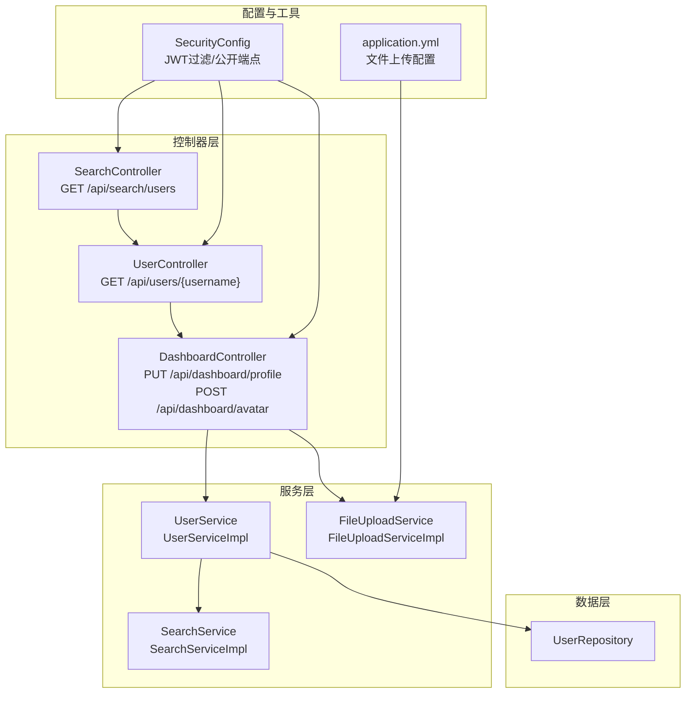
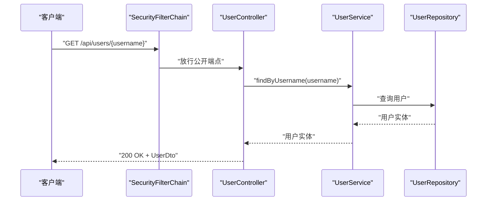
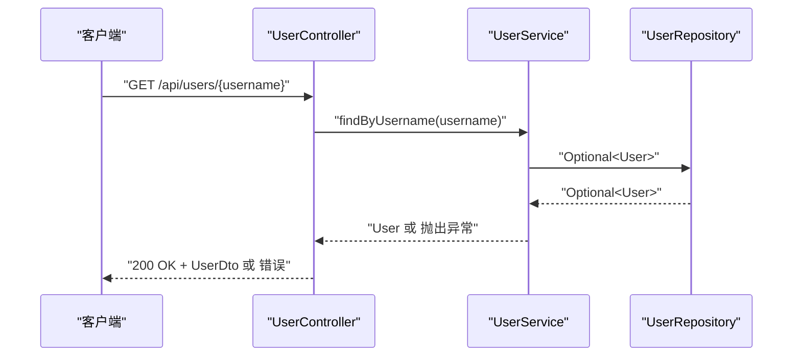
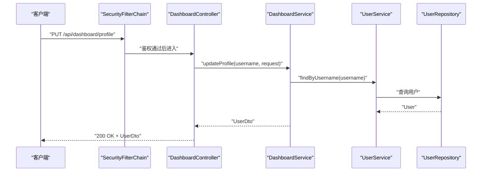
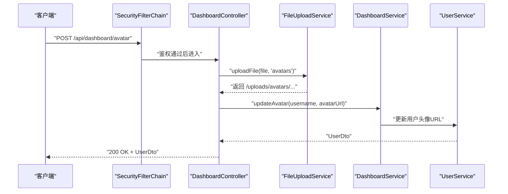
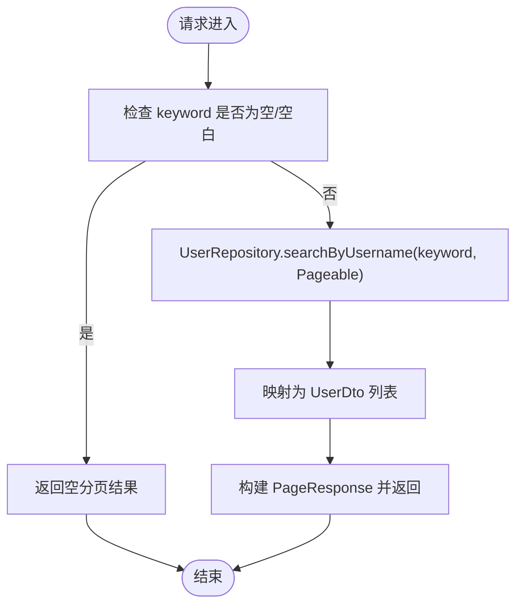
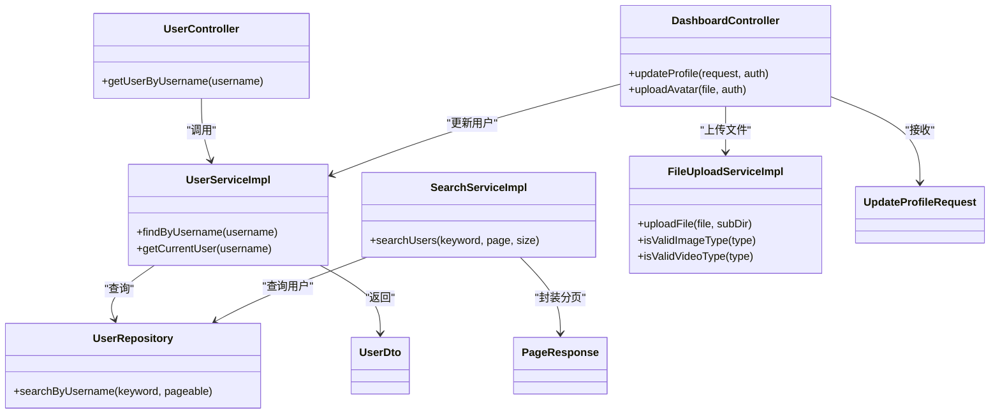

# 用户接口

<cite>
**本文引用的文件**
- [UserController.java](file://communication-backend/src/main/java/com/communication/controller/UserController.java)
- [UserDto.java](file://communication-backend/src/main/java/com/communication/dto/UserDto.java)
- [UpdateProfileRequest.java](file://communication-backend/src/main/java/com/communication/dto/UpdateProfileRequest.java)
- [User.java](file://communication-backend/src/main/java/com/communication/entity/User.java)
- [UserService.java](file://communication-backend/src/main/java/com/communication/service/UserService.java)
- [UserServiceImpl.java](file://communication-backend/src/main/java/com/communication/service/impl/UserServiceImpl.java)
- [DashboardController.java](file://communication-backend/src/main/java/com/communication/controller/DashboardController.java)
- [SearchService.java](file://communication-backend/src/main/java/com/communication/service/SearchService.java)
- [SearchServiceImpl.java](file://communication-backend/src/main/java/com/communication/service/impl/SearchServiceImpl.java)
- [UploadController.java](file://communication-backend/src/main/java/com/communication/controller/UploadController.java)
- [FileUploadServiceImpl.java](file://communication-backend/src/main/java/com/communication/service/impl/FileUploadServiceImpl.java)
- [PageResponse.java](file://communication-backend/src/main/java/com/communication/dto/PageResponse.java)
- [UserRepository.java](file://communication-backend/src/main/java/com/communication/repository/UserRepository.java)
- [application.yml](file://communication-backend/src/main/resources/application.yml)
- [SecurityConfig.java](file://communication-backend/src/main/java/com/communication/config/SecurityConfig.java)
</cite>

## 目录
1. [简介](#简介)
2. [项目结构](#项目结构)
3. [核心组件](#核心组件)
4. [架构总览](#架构总览)
5. [详细组件分析](#详细组件分析)
6. [依赖关系分析](#依赖关系分析)
7. [性能考量](#性能考量)
8. [故障排查指南](#故障排查指南)
9. [结论](#结论)
10. [附录](#附录)

## 简介
本文件为“用户管理模块”的API接口文档，覆盖以下能力：
- 用户资料查询：按用户名获取用户详情
- 个人信息更新：支持部分更新（简介与头像URL）
- 头像上传：基于通用文件上传服务的头像上传流程
- 用户搜索与列表：按关键字分页检索用户
- 权限控制与访问限制：基于Spring Security与JWT的认证授权
- 请求/响应示例与错误处理说明

## 项目结构
用户相关接口主要分布在如下层次：
- 控制器层：用户详情查询、仪表盘（含个人资料更新与头像上传）、搜索
- DTO层：用户数据传输对象、分页响应、更新请求体
- 实体层：用户实体定义
- 服务层：用户服务接口与实现、搜索服务、文件上传服务
- 配置层：安全配置（JWT过滤、跨域、CSRF、会话策略、公开端点）

图表来源
- [UserController.java](file://communication-backend/src/main/java/com/communication/controller/UserController.java#L20-L24)
- [DashboardController.java](file://communication-backend/src/main/java/com/communication/controller/DashboardController.java#L48-L63)
- [SearchServiceImpl.java](file://communication-backend/src/main/java/com/communication/service/impl/SearchServiceImpl.java#L68-L89)
- [UserServiceImpl.java](file://communication-backend/src/main/java/com/communication/service/impl/UserServiceImpl.java#L64-L74)
- [FileUploadServiceImpl.java](file://communication-backend/src/main/java/com/communication/service/impl/FileUploadServiceImpl.java#L31-L61)
- [SecurityConfig.java](file://communication-backend/src/main/java/com/communication/config/SecurityConfig.java#L66-L84)
- [application.yml](file://communication-backend/src/main/resources/application.yml#L25-L41)

章节来源
- [SecurityConfig.java](file://communication-backend/src/main/java/com/communication/config/SecurityConfig.java#L66-L84)
- [application.yml](file://communication-backend/src/main/resources/application.yml#L25-L41)

## 核心组件
- 用户控制器：提供按用户名查询用户详情的只读接口
- 仪表盘控制器：提供个人资料更新与头像上传接口
- 搜索服务：提供用户搜索与分页
- 文件上传服务：提供图片/视频上传校验与存储
- 安全配置：定义公开端点与认证要求

章节来源
- [UserController.java](file://communication-backend/src/main/java/com/communication/controller/UserController.java#L20-L24)
- [DashboardController.java](file://communication-backend/src/main/java/com/communication/controller/DashboardController.java#L48-L63)
- [SearchService.java](file://communication-backend/src/main/java/com/communication/service/SearchService.java#L11-L13)
- [UploadController.java](file://communication-backend/src/main/java/com/communication/controller/UploadController.java#L23-L57)
- [SecurityConfig.java](file://communication-backend/src/main/java/com/communication/config/SecurityConfig.java#L71-L81)

## 架构总览
用户接口遵循REST风格，采用JWT进行无状态认证；公共端点对未登录用户开放，其余端点需携带有效令牌。

图表来源
- [SecurityConfig.java](file://communication-backend/src/main/java/com/communication/config/SecurityConfig.java#L71-L79)
- [UserController.java](file://communication-backend/src/main/java/com/communication/controller/UserController.java#L20-L24)
- [UserServiceImpl.java](file://communication-backend/src/main/java/com/communication/service/impl/UserServiceImpl.java#L70-L74)
- [UserRepository.java](file://communication-backend/src/main/java/com/communication/repository/UserRepository.java#L24-L25)

## 详细组件分析

### 用户详情查询
- 接口路径：GET /api/users/{username}
- 认证要求：无需登录（公开端点）
- 请求参数：
  - 路径变量：username（字符串，必填）
- 响应：
  - 成功：200 OK，响应体为统一包装格式，包含UserDto
  - 异常：当用户不存在时由服务层抛出资源未找到异常，控制器层交由全局异常处理器返回标准错误格式
- 数据模型（UserDto）：
  - 字段：id、username、email、avatarUrl、bio、createdAt
  - 默认值：createdAt由数据库生成时间戳，其他字符串字段可为空（数据库允许空值）
- 分页与排序：该接口不支持分页与排序（单条记录查询）

图表来源
- [UserController.java](file://communication-backend/src/main/java/com/communication/controller/UserController.java#L20-L24)
- [UserServiceImpl.java](file://communication-backend/src/main/java/com/communication/service/impl/UserServiceImpl.java#L70-L74)
- [UserRepository.java](file://communication-backend/src/main/java/com/communication/repository/UserRepository.java#L16)

章节来源
- [UserController.java](file://communication-backend/src/main/java/com/communication/controller/UserController.java#L20-L24)
- [UserDto.java](file://communication-backend/src/main/java/com/communication/dto/UserDto.java#L39-L48)
- [User.java](file://communication-backend/src/main/java/com/communication/entity/User.java#L17-L38)
- [SecurityConfig.java](file://communication-backend/src/main/java/com/communication/config/SecurityConfig.java#L75)

### 个人信息更新（部分更新）
- 接口路径：PUT /api/dashboard/profile
- 认证要求：需要登录（受保护端点）
- 请求体：UpdateProfileRequest（JSON）
  - 字段：
    - bio：字符串，最大长度200（用于简介）
    - avatarUrl：字符串，头像URL（可为空）
- 响应：
  - 成功：200 OK，返回更新后的UserDto
  - 异常：字段校验失败或业务异常将返回相应错误码
- 更新机制：
  - 仅更新传入的字段，未传字段保持不变（部分更新）
  - 服务层根据当前登录用户名定位用户并执行更新

图表来源
- [DashboardController.java](file://communication-backend/src/main/java/com/communication/controller/DashboardController.java#L48-L54)
- [UpdateProfileRequest.java](file://communication-backend/src/main/java/com/communication/dto/UpdateProfileRequest.java#L7-L8)
- [UserServiceImpl.java](file://communication-backend/src/main/java/com/communication/service/impl/UserServiceImpl.java#L70-L74)

章节来源
- [DashboardController.java](file://communication-backend/src/main/java/com/communication/controller/DashboardController.java#L48-L54)
- [UpdateProfileRequest.java](file://communication-backend/src/main/java/com/communication/dto/UpdateProfileRequest.java#L1-L19)
- [UserDto.java](file://communication-backend/src/main/java/com/communication/dto/UserDto.java#L39-L48)

### 头像上传
- 接口路径：POST /api/dashboard/avatar
- 认证要求：需要登录（受保护端点）
- 请求：
  - 表单字段：file（二进制文件）
- 流程：
  - 通过通用文件上传服务校验类型与大小
  - 将文件保存到指定子目录（avatars），返回可访问URL
  - 更新当前用户的avatarUrl并返回UserDto
- 文件类型与大小限制：
  - 类型：由通用上传服务校验（图片与视频类型集合）
  - 大小：由Spring配置限制（最大100MB）
- 存储策略：
  - 服务端保存在配置的上传根目录下，生成UUID命名的新文件名，并返回相对URL前缀

图表来源
- [DashboardController.java](file://communication-backend/src/main/java/com/communication/controller/DashboardController.java#L56-L63)
- [FileUploadServiceImpl.java](file://communication-backend/src/main/java/com/communication/service/impl/FileUploadServiceImpl.java#L31-L61)
- [application.yml](file://communication-backend/src/main/resources/application.yml#L25-L28)

章节来源
- [DashboardController.java](file://communication-backend/src/main/java/com/communication/controller/DashboardController.java#L56-L63)
- [UploadController.java](file://communication-backend/src/main/java/com/communication/controller/UploadController.java#L23-L57)
- [FileUploadServiceImpl.java](file://communication-backend/src/main/java/com/communication/service/impl/FileUploadServiceImpl.java#L23-L29)
- [application.yml](file://communication-backend/src/main/resources/application.yml#L25-L28)

### 用户搜索与列表查询
- 接口路径：GET /api/search/users
- 认证要求：无需登录（公开端点）
- 查询参数：
  - keyword：关键字（必填，非空白才生效）
  - page：页码（从0开始，默认0）
  - size：每页大小（默认10）
- 响应：
  - 成功：200 OK，PageResponse<UserDto>
  - 当keyword为空或空白时，返回空结果页（totalElements=0）
- 排序与分页：
  - 使用JPA分页对象，返回页码、总数、是否首页/末页等元信息

图表来源
- [SearchServiceImpl.java](file://communication-backend/src/main/java/com/communication/service/impl/SearchServiceImpl.java#L68-L89)
- [UserRepository.java](file://communication-backend/src/main/java/com/communication/repository/UserRepository.java#L24-L25)

章节来源
- [SearchService.java](file://communication-backend/src/main/java/com/communication/service/SearchService.java#L13)
- [SearchServiceImpl.java](file://communication-backend/src/main/java/com/communication/service/impl/SearchServiceImpl.java#L68-L89)
- [PageResponse.java](file://communication-backend/src/main/java/com/communication/dto/PageResponse.java#L41-L63)
- [UserRepository.java](file://communication-backend/src/main/java/com/communication/repository/UserRepository.java#L24-L25)

### 权限控制与访问限制
- 公开端点（无需登录）：
  - GET /api/users/**
  - GET /api/contents/**
  - GET /api/search/**
  - GET /api/subscriptions/followers/**
  - GET /api/subscriptions/count/**
  - /uploads/**
- 受保护端点（需登录）：
  - PUT /api/dashboard/profile
  - POST /api/dashboard/avatar
  - 其他未显式声明的端点均需认证
- 会话策略：STATELESS（无状态）
- 认证方式：JWT（在SecurityFilterChain中集成）

章节来源
- [SecurityConfig.java](file://communication-backend/src/main/java/com/communication/config/SecurityConfig.java#L66-L84)

## 依赖关系分析

图表来源
- [UserController.java](file://communication-backend/src/main/java/com/communication/controller/UserController.java#L20-L24)
- [DashboardController.java](file://communication-backend/src/main/java/com/communication/controller/DashboardController.java#L48-L63)
- [SearchServiceImpl.java](file://communication-backend/src/main/java/com/communication/service/impl/SearchServiceImpl.java#L68-L89)
- [UserServiceImpl.java](file://communication-backend/src/main/java/com/communication/service/impl/UserServiceImpl.java#L64-L74)
- [FileUploadServiceImpl.java](file://communication-backend/src/main/java/com/communication/service/impl/FileUploadServiceImpl.java#L31-L61)
- [UserRepository.java](file://communication-backend/src/main/java/com/communication/repository/UserRepository.java#L24-L25)
- [UserDto.java](file://communication-backend/src/main/java/com/communication/dto/UserDto.java#L39-L48)
- [UpdateProfileRequest.java](file://communication-backend/src/main/java/com/communication/dto/UpdateProfileRequest.java#L1-L19)
- [PageResponse.java](file://communication-backend/src/main/java/com/communication/dto/PageResponse.java#L41-L63)

## 性能考量
- 分页参数建议：
  - 合理设置page与size，避免过大size导致内存压力
  - 对高频搜索场景建议增加数据库索引（如username模糊匹配）
- 缓存策略：
  - 对热点用户详情可考虑缓存（需结合失效策略）
- 文件上传：
  - 服务端限制最大文件大小，前端应配合压缩与预检
  - 图片/视频类型校验在服务端完成，避免无效请求

## 故障排查指南
- 常见错误与处理：
  - 用户不存在：服务层抛出资源未找到异常，控制器层交由全局异常处理器返回标准错误
  - 登录态缺失或过期：受保护端点返回未认证/未授权
  - 文件类型不合法：返回400错误，提示允许的类型
  - 文件为空或IO异常：返回400错误，提示上传失败
- 关键配置核对：
  - 上传路径与允许类型：确保与服务端一致
  - Spring文件大小限制：确认未超过最大值
- 排查步骤：
  - 检查请求头Authorization是否携带有效JWT
  - 确认请求体字段类型与长度符合DTO约束
  - 校验文件类型与大小是否满足服务端限制

章节来源
- [UserServiceImpl.java](file://communication-backend/src/main/java/com/communication/service/impl/UserServiceImpl.java#L70-L74)
- [FileUploadServiceImpl.java](file://communication-backend/src/main/java/com/communication/service/impl/FileUploadServiceImpl.java#L33-L40)
- [application.yml](file://communication-backend/src/main/resources/application.yml#L25-L28)

## 结论
本用户接口文档覆盖了用户详情查询、个人信息更新（部分更新）、头像上传以及用户搜索与分页查询的完整链路。通过明确的权限控制、统一的响应包装与严格的参数校验，保障了接口的可用性与安全性。建议在生产环境中结合缓存与监控进一步优化性能与可观测性。

## 附录

### 数据模型与字段说明

- 用户实体（User）
  - 字段：id、username、email、password、avatarUrl、bio、createdAt、updatedAt
  - 约束：username与email唯一，密码不可为空
  - 默认值：createdAt/updatedAt由数据库生成时间戳

- 用户传输对象（UserDto）
  - 字段：id、username、email、avatarUrl、bio、createdAt
  - 默认值：createdAt由实体注入

- 更新请求体（UpdateProfileRequest）
  - 字段：bio（最大200字符）、avatarUrl（字符串）
  - 默认值：未传字段不更新

- 分页响应（PageResponse）
  - 字段：content、page、size、totalElements、totalPages、first、last

章节来源
- [User.java](file://communication-backend/src/main/java/com/communication/entity/User.java#L17-L38)
- [UserDto.java](file://communication-backend/src/main/java/com/communication/dto/UserDto.java#L17-L24)
- [UpdateProfileRequest.java](file://communication-backend/src/main/java/com/communication/dto/UpdateProfileRequest.java#L7-L10)
- [PageResponse.java](file://communication-backend/src/main/java/com/communication/dto/PageResponse.java#L16-L24)

### 请求/响应示例与错误处理

- 获取用户详情
  - 请求：GET /api/users/{username}
  - 成功响应：200 OK，包含UserDto
  - 失败响应：404 Not Found（用户不存在）

- 更新个人资料
  - 请求：PUT /api/dashboard/profile（需要登录）
  - 请求体：JSON（bio与/或avatarUrl）
  - 成功响应：200 OK，返回更新后的UserDto
  - 失败响应：400 Bad Request（字段校验失败）或401/403（认证/授权问题）

- 上传头像
  - 请求：POST /api/dashboard/avatar（需要登录）
  - 请求体：multipart/form-data，字段file
  - 成功响应：200 OK，返回更新后的UserDto
  - 失败响应：400 Bad Request（类型/大小/IO错误）

- 搜索用户
  - 请求：GET /api/search/users?keyword=...&page=0&size=10
  - 成功响应：200 OK，PageResponse<UserDto>
  - 失败响应：当keyword为空时返回空分页

章节来源
- [UserController.java](file://communication-backend/src/main/java/com/communication/controller/UserController.java#L20-L24)
- [DashboardController.java](file://communication-backend/src/main/java/com/communication/controller/DashboardController.java#L48-L63)
- [SearchServiceImpl.java](file://communication-backend/src/main/java/com/communication/service/impl/SearchServiceImpl.java#L68-L89)
- [FileUploadServiceImpl.java](file://communication-backend/src/main/java/com/communication/service/impl/FileUploadServiceImpl.java#L33-L40)