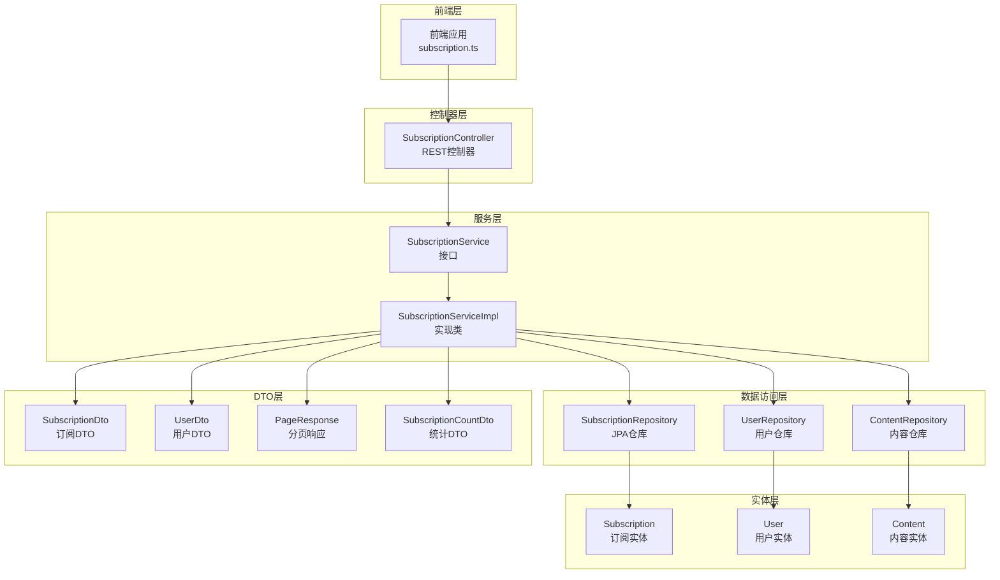
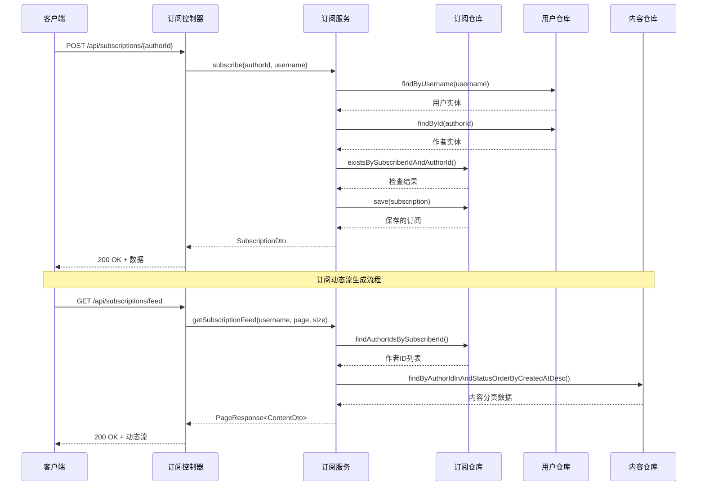
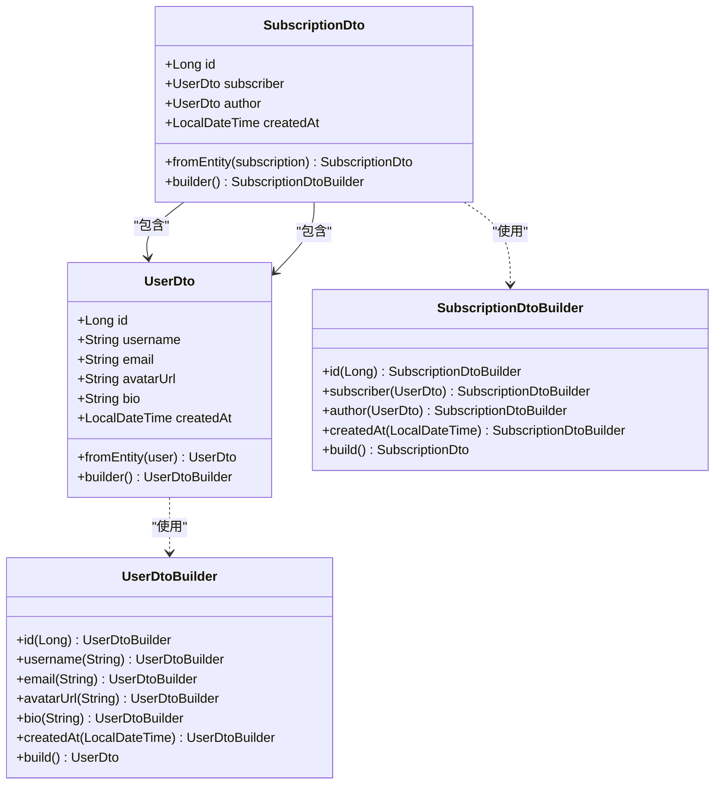
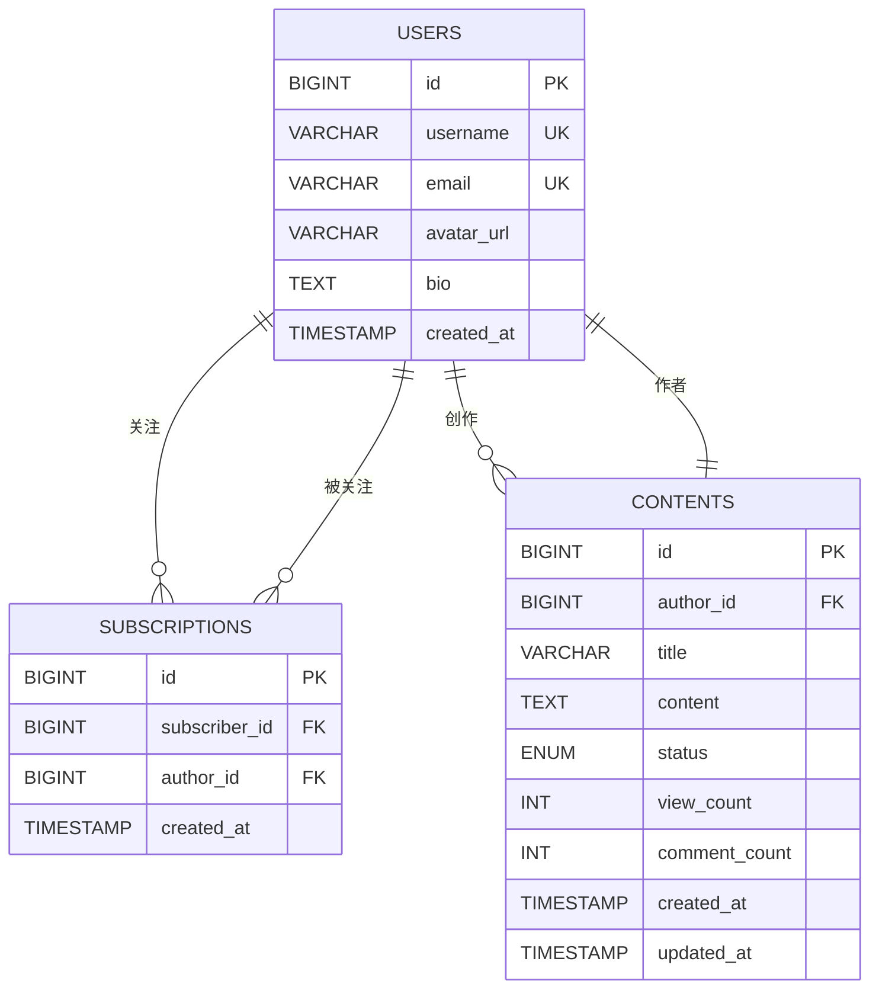
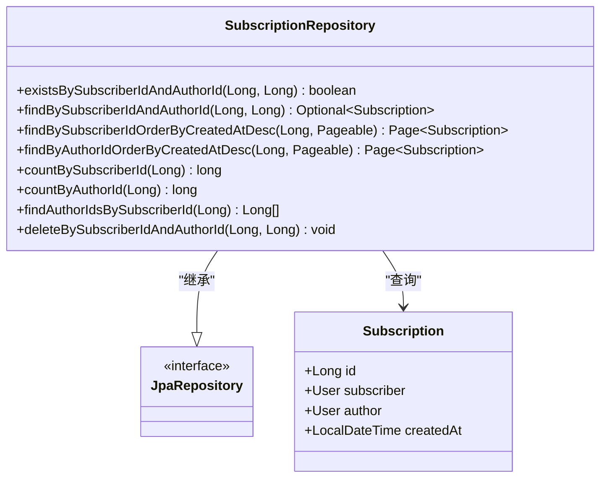
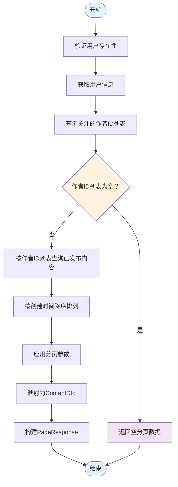
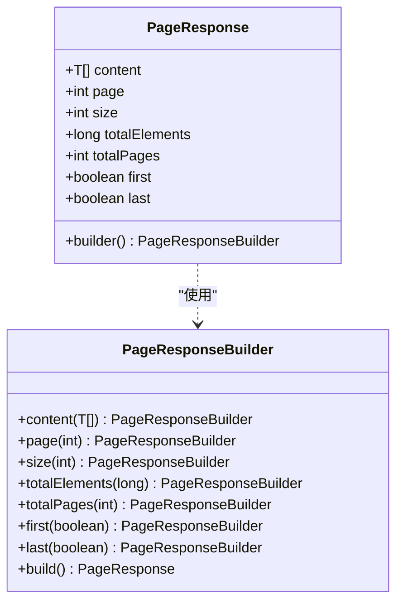
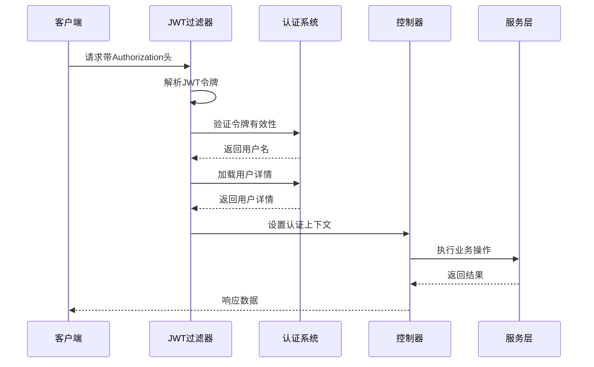
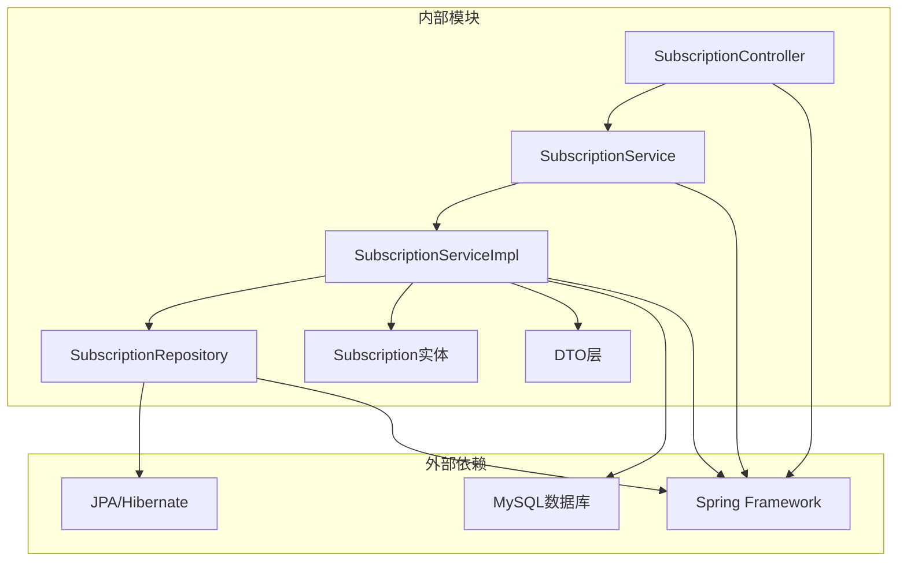

# 订阅接口

<cite>
**本文档引用的文件**
- [SubscriptionController.java](file://communication-backend/src/main/java/com/communication/controller/SubscriptionController.java)
- [SubscriptionService.java](file://communication-backend/src/main/java/com/communication/service/SubscriptionService.java)
- [SubscriptionServiceImpl.java](file://communication-backend/src/main/java/com/communication/service/impl/SubscriptionServiceImpl.java)
- [SubscriptionRepository.java](file://communication-backend/src/main/java/com/communication/repository/SubscriptionRepository.java)
- [SubscriptionDto.java](file://communication-backend/src/main/java/com/communication/dto/SubscriptionDto.java)
- [UserDto.java](file://communication-backend/src/main/java/com/communication/dto/UserDto.java)
- [SubscriptionCountDto.java](file://communication-backend/src/main/java/com/communication/dto/SubscriptionCountDto.java)
- [PageResponse.java](file://communication-backend/src/main/java/com/communication/dto/PageResponse.java)
- [V3__create_comments_subscriptions.sql](file://communication-backend/src/main/resources/db/migration/V3__create_comments_subscriptions.sql)
- [subscription.ts](file://communication-frontend/src/api/subscription.ts)
- [JwtAuthenticationFilter.java](file://communication-backend/src/main/java/com/communication/config/JwtAuthenticationFilter.java)
- [SubscriptionServiceTest.java](file://communication-backend/src/test/java/com/communication/service/SubscriptionServiceTest.java)
</cite>

## 目录
1. [简介](#简介)
2. [项目结构](#项目结构)
3. [核心组件](#核心组件)
4. [架构概览](#架构概览)
5. [详细组件分析](#详细组件分析)
6. [依赖关系分析](#依赖关系分析)
7. [性能考虑](#性能考虑)
8. [故障排除指南](#故障排除指南)
9. [结论](#结论)

## 简介

订阅管理模块是通信平台的核心功能之一，负责处理用户之间的关注关系、订阅动态流生成和相关的统计数据计算。该模块提供了完整的关注/取消关注功能、关注列表查询、粉丝列表管理、订阅动态流生成以及订阅统计信息等功能。

## 项目结构

订阅管理模块采用典型的三层架构设计，包含控制器层、服务层和数据访问层：

**图表来源**
- [SubscriptionController.java](file://communication-backend/src/main/java/com/communication/controller/SubscriptionController.java#L1-L77)
- [SubscriptionServiceImpl.java](file://communication-backend/src/main/java/com/communication/service/impl/SubscriptionServiceImpl.java#L26-L36)

**章节来源**
- [SubscriptionController.java](file://communication-backend/src/main/java/com/communication/controller/SubscriptionController.java#L1-L77)
- [SubscriptionService.java](file://communication-backend/src/main/java/com/communication/service/SubscriptionService.java#L1-L26)

## 核心组件

### 订阅控制器 (SubscriptionController)

订阅控制器提供REST API端点，处理所有订阅相关的HTTP请求。控制器使用Spring Security进行身份验证，并通过Authentication对象获取当前用户的用户名。

主要功能：
- 用户关注/取消关注操作
- 关注状态检查
- 关注列表和粉丝列表查询
- 订阅动态流生成
- 订阅统计信息查询

### 订阅服务接口 (SubscriptionService)

定义了订阅管理的核心业务逻辑接口，包括：
- 订阅和取消订阅操作
- 关注状态查询
- 关注列表和粉丝列表分页查询
- 订阅动态流生成
- 订阅统计信息计算

### 订阅服务实现 (SubscriptionServiceImpl)

实现了SubscriptionService接口，包含完整的业务逻辑：
- 用户身份验证和权限检查
- 订阅关系的创建和删除
- 关注列表和粉丝列表的查询
- 订阅动态流的生成算法
- 统计数据的计算和返回

**章节来源**
- [SubscriptionController.java](file://communication-backend/src/main/java/com/communication/controller/SubscriptionController.java#L19-L75)
- [SubscriptionService.java](file://communication-backend/src/main/java/com/communication/service/SubscriptionService.java#L8-L25)
- [SubscriptionServiceImpl.java](file://communication-backend/src/main/java/com/communication/service/impl/SubscriptionServiceImpl.java#L26-L36)

## 架构概览

订阅管理模块采用分层架构设计，确保关注关系的建立、维护和查询的高效性：

**图表来源**
- [SubscriptionController.java](file://communication-backend/src/main/java/com/communication/controller/SubscriptionController.java#L19-L68)
- [SubscriptionServiceImpl.java](file://communication-backend/src/main/java/com/communication/service/impl/SubscriptionServiceImpl.java#L40-L167)

## 详细组件分析

### 订阅数据传输对象 (SubscriptionDto)

SubscriptionDto是订阅关系的数据传输对象，用于在系统各层之间传递订阅信息：

**图表来源**
- [SubscriptionDto.java](file://communication-backend/src/main/java/com/communication/dto/SubscriptionDto.java#L7-L58)
- [UserDto.java](file://communication-backend/src/main/java/com/communication/dto/UserDto.java#L7-L71)

#### SubscriptionDto 字段说明

| 字段名 | 类型 | 描述 | 必填 |
|--------|------|------|------|
| id | Long | 订阅关系的唯一标识符 | 否 |
| subscriber | UserDto | 订阅者用户信息 | 是 |
| author | UserDto | 被订阅的作者信息 | 是 |
| createdAt | LocalDateTime | 订阅创建时间 | 否 |

### 订阅实体模型

订阅实体使用JPA注解映射到数据库表，建立了用户与用户之间的多对多关系：

**图表来源**
- [V3__create_comments_subscriptions.sql](file://communication-backend/src/main/resources/db/migration/V3__create_comments_subscriptions.sql#L18-L29)

#### 订阅实体字段说明

| 字段名 | 类型 | 约束 | 描述 |
|--------|------|------|------|
| id | Long | 主键, 自增 | 订阅关系的唯一标识符 |
| subscriber | User | 外键, 非空 | 订阅者的用户ID |
| author | User | 外键, 非空 | 被订阅作者的用户ID |
| createdAt | LocalDateTime | 默认当前时间 | 订阅创建时间 |

### 订阅仓库接口

SubscriptionRepository提供专门的查询方法，支持高效的订阅关系查询：

**图表来源**
- [SubscriptionRepository.java](file://communication-backend/src/main/java/com/communication/repository/SubscriptionRepository.java#L14-L33)

### 订阅动态流生成算法

订阅动态流的生成是一个复杂的多步骤过程，涉及多个数据源的整合：

**图表来源**
- [SubscriptionServiceImpl.java](file://communication-backend/src/main/java/com/communication/service/impl/SubscriptionServiceImpl.java#L132-L167)

#### 动态流生成的关键步骤

1. **用户验证**：确保请求的用户存在
2. **作者ID查询**：从订阅关系中提取所有关注作者的ID
3. **空列表处理**：如果用户没有关注任何作者，直接返回空分页
4. **内容查询**：使用作者ID列表查询已发布的文章内容
5. **排序和分页**：按创建时间降序排列并应用分页参数
6. **数据映射**：将实体转换为DTO格式
7. **响应构建**：封装为标准的分页响应格式

**章节来源**
- [SubscriptionServiceImpl.java](file://communication-backend/src/main/java/com/communication/service/impl/SubscriptionServiceImpl.java#L132-L167)
- [SubscriptionServiceTest.java](file://communication-backend/src/test/java/com/communication/service/SubscriptionServiceTest.java#L180-L215)

### 分页参数和排序选项

订阅管理模块支持灵活的分页查询，所有分页查询都遵循统一的参数规范：

#### 分页参数规范

| 参数名 | 类型 | 默认值 | 必填 | 描述 |
|--------|------|--------|------|------|
| page | int | 0 | 否 | 页码，从0开始 |
| size | int | 20 | 否 | 每页大小，默认20条记录 |

#### 排序选项

- **关注列表排序**：按创建时间降序 (`createdAt DESC`)
- **粉丝列表排序**：按创建时间降序 (`createdAt DESC`)
- **动态流排序**：按创建时间降序 (`createdAt DESC`)

#### 分页响应结构

**图表来源**
- [PageResponse.java](file://communication-backend/src/main/java/com/communication/dto/PageResponse.java#L5-L64)

**章节来源**
- [SubscriptionController.java](file://communication-backend/src/main/java/com/communication/controller/SubscriptionController.java#L43-L68)
- [SubscriptionServiceImpl.java](file://communication-backend/src/main/java/com/communication/service/impl/SubscriptionServiceImpl.java#L85-L130)

### 订阅统计信息

订阅统计信息提供了用户关注数量和粉丝数量的实时计算：

#### 统计DTO结构

| 字段名 | 类型 | 描述 |
|--------|------|------|
| subscriptions | long | 用户的关注数量 |
| followers | long | 用户的粉丝数量 |

#### 统计计算逻辑

- **关注数量**：统计用户作为订阅者时的订阅关系总数
- **粉丝数量**：统计用户作为被订阅者时的订阅关系总数

**章节来源**
- [SubscriptionCountDto.java](file://communication-backend/src/main/java/com/communication/dto/SubscriptionCountDto.java#L3-L18)
- [SubscriptionServiceImpl.java](file://communication-backend/src/main/java/com/communication/service/impl/SubscriptionServiceImpl.java#L169-L177)

### 权限控制和安全机制

订阅管理模块采用基于JWT的认证机制，确保只有经过身份验证的用户才能执行订阅操作：

**图表来源**
- [JwtAuthenticationFilter.java](file://communication-backend/src/main/java/com/communication/config/JwtAuthenticationFilter.java#L31-L67)

#### 安全特性

- **JWT令牌验证**：使用JWT过滤器验证请求令牌
- **用户身份获取**：通过Authentication对象获取当前用户名
- **权限检查**：在业务逻辑中进行必要的权限验证
- **异常处理**：对无效操作抛出适当的异常

**章节来源**
- [JwtAuthenticationFilter.java](file://communication-backend/src/main/java/com/communication/config/JwtAuthenticationFilter.java#L20-L68)
- [SubscriptionController.java](file://communication-backend/src/main/java/com/communication/controller/SubscriptionController.java#L20-L32)

## 依赖关系分析

订阅管理模块的依赖关系清晰明确，遵循单一职责原则：

**图表来源**
- [SubscriptionServiceImpl.java](file://communication-backend/src/main/java/com/communication/service/impl/SubscriptionServiceImpl.java#L26-L36)
- [SubscriptionRepository.java](file://communication-backend/src/main/java/com/communication/repository/SubscriptionRepository.java#L14-L33)

### 核心依赖关系

1. **控制器到服务层**：控制器仅依赖服务接口，不直接操作数据
2. **服务层到仓库层**：服务实现依赖JPA仓库进行数据访问
3. **仓库层到实体层**：仓库操作JPA实体进行数据库交互
4. **DTO层到实体层**：DTO提供数据传输和转换功能

**章节来源**
- [SubscriptionController.java](file://communication-backend/src/main/java/com/communication/controller/SubscriptionController.java#L13-L17)
- [SubscriptionServiceImpl.java](file://communication-backend/src/main/java/com/communication/service/impl/SubscriptionServiceImpl.java#L32-L36)

## 性能考虑

订阅管理模块在设计时充分考虑了性能优化：

### 数据库索引优化

- **唯一约束**：防止重复订阅关系
- **复合索引**：优化查询性能
- **外键约束**：保证数据完整性

### 查询优化策略

- **懒加载**：使用LAZY加载避免不必要的关联查询
- **批量查询**：使用IN子句减少查询次数
- **分页查询**：避免一次性加载大量数据

### 缓存策略建议

虽然当前实现未包含缓存，但可以考虑以下优化：
- **热点数据缓存**：缓存热门用户的关注信息
- **查询结果缓存**：缓存常用的统计信息
- **会话级缓存**：缓存当前用户的订阅关系

## 故障排除指南

### 常见错误和解决方案

#### 订阅相关错误

| 错误类型 | 错误代码 | 描述 | 解决方案 |
|----------|----------|------|----------|
| 用户不存在 | 404 | 订阅者或作者用户不存在 | 验证用户ID的有效性 |
| 重复订阅 | 400 | 已经订阅该用户 | 检查订阅状态后再执行订阅 |
| 自己订阅自己 | 400 | 不允许订阅自己 | 在前端进行预检查 |
| 未订阅取消 | 400 | 未订阅该用户就尝试取消 | 先检查订阅状态 |

#### 数据库相关错误

| 错误类型 | 描述 | 解决方案 |
|----------|------|----------|
| 违反唯一约束 | 重复订阅关系 | 使用exists查询避免重复 |
| 外键约束失败 | 用户ID无效 | 验证用户ID的存在性 |
| 索引失效 | 查询性能下降 | 检查数据库索引状态 |

**章节来源**
- [SubscriptionServiceTest.java](file://communication-backend/src/test/java/com/communication/service/SubscriptionServiceTest.java#L94-L137)

### 调试技巧

1. **日志记录**：在关键业务点添加日志输出
2. **单元测试**：编写全面的单元测试覆盖各种场景
3. **数据库监控**：监控慢查询和高负载操作
4. **性能分析**：定期分析查询执行计划

## 结论

订阅管理模块是一个设计良好、功能完整的关注关系管理系统。它提供了完整的关注/取消关注功能、高效的动态流生成算法、灵活的分页查询机制和准确的统计信息计算。

### 主要优势

1. **清晰的架构设计**：采用分层架构，职责分离明确
2. **完善的错误处理**：提供详细的错误信息和异常处理
3. **高性能查询**：优化的数据库查询和索引设计
4. **灵活的分页机制**：支持自定义分页参数和排序选项
5. **安全的权限控制**：基于JWT的身份验证机制

### 改进建议

1. **添加批量操作**：支持批量关注和取消关注功能
2. **增强通知机制**：实现订阅相关的实时通知功能
3. **优化缓存策略**：引入适当的缓存机制提升性能
4. **扩展权限控制**：支持更细粒度的隐私设置

该模块为通信平台的用户互动功能奠定了坚实的基础，为用户提供了一个流畅的关注体验。