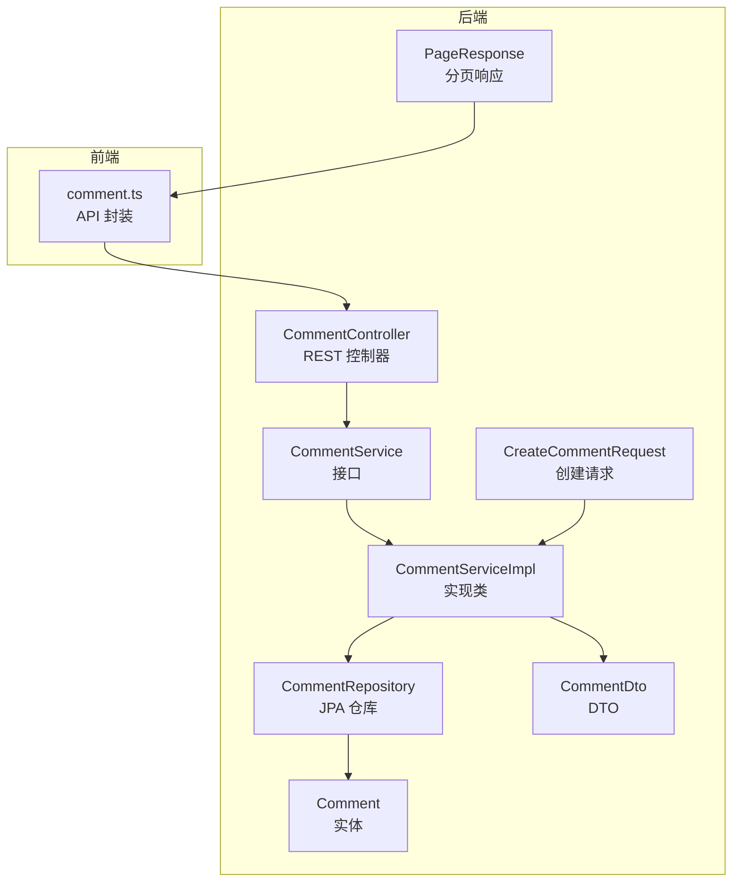
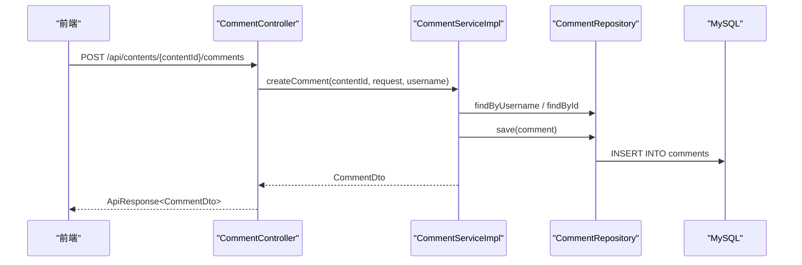
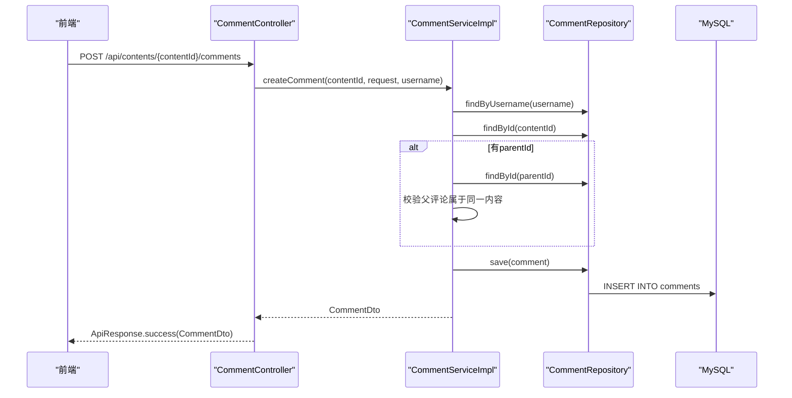
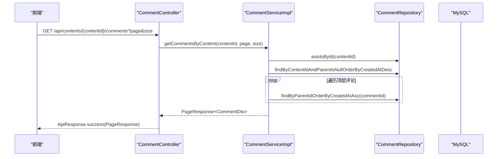
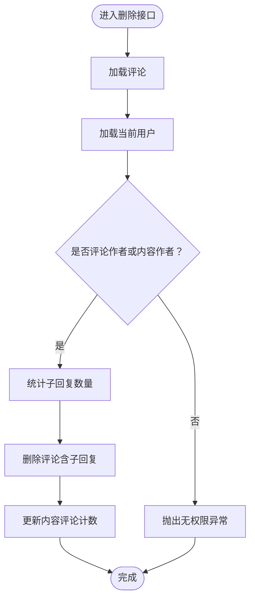
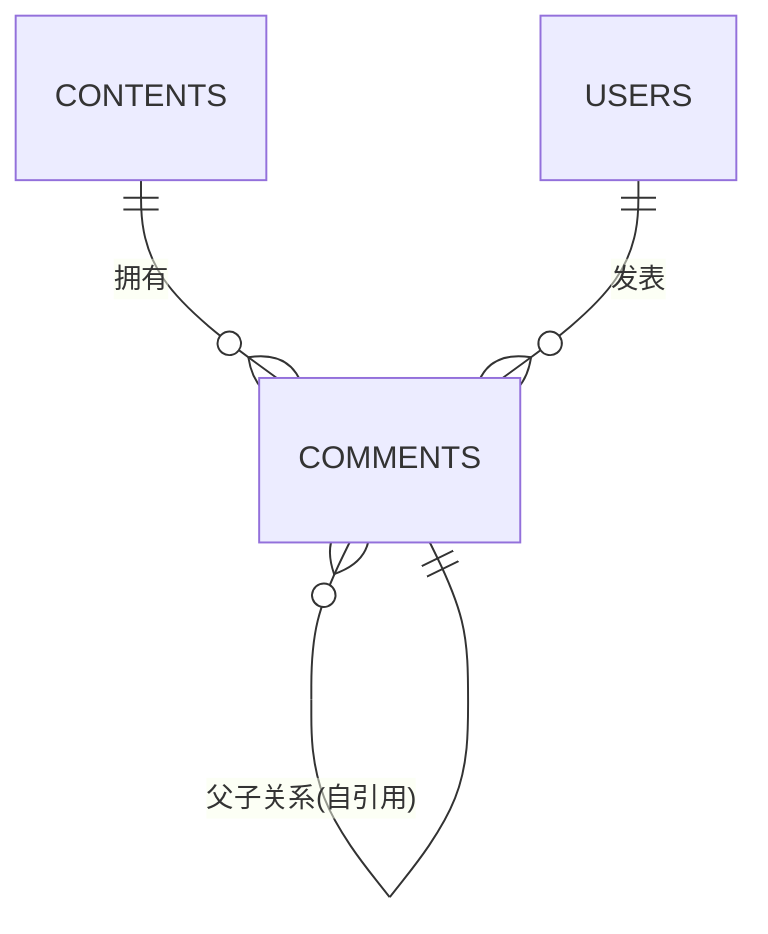
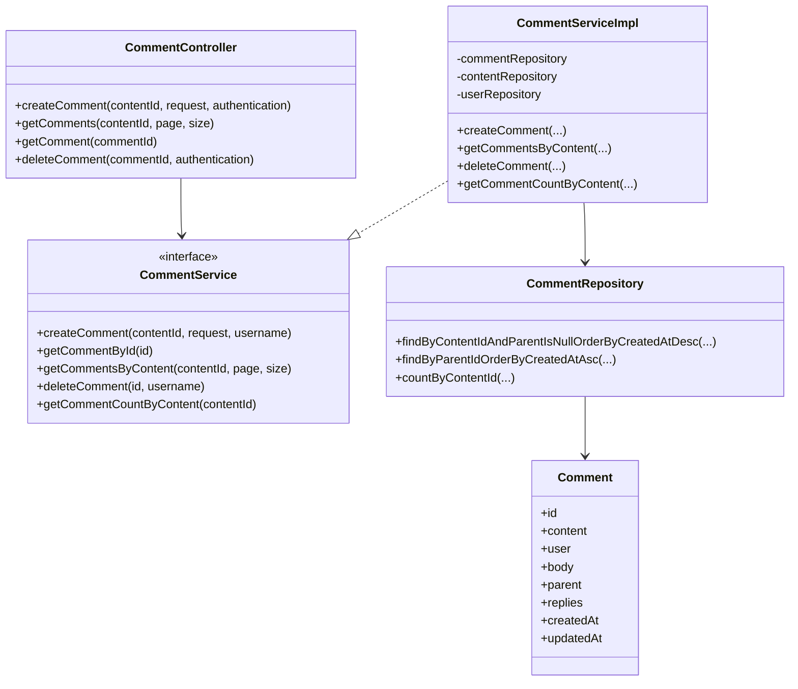

# 评论接口

<cite>
**本文引用的文件**
- [CommentController.java](file://communication-backend/src/main/java/com/communication/controller/CommentController.java)
- [CommentService.java](file://communication-backend/src/main/java/com/communication/service/CommentService.java)
- [CommentServiceImpl.java](file://communication-backend/src/main/java/com/communication/service/impl/CommentServiceImpl.java)
- [CommentRepository.java](file://communication-backend/src/main/java/com/communication/repository/CommentRepository.java)
- [Comment.java](file://communication-backend/src/main/java/com/communication/entity/Comment.java)
- [CommentDto.java](file://communication-backend/src/main/java/com/communication/dto/CommentDto.java)
- [CreateCommentRequest.java](file://communication-backend/src/main/java/com/communication/dto/CreateCommentRequest.java)
- [PageResponse.java](file://communication-backend/src/main/java/com/communication/dto/PageResponse.java)
- [V3__create_comments_subscriptions.sql](file://communication-backend/src/main/resources/db/migration/V3__create_comments_subscriptions.sql)
- [comment.ts](file://communication-frontend/src/api/comment.ts)
- [JwtAuthenticationFilter.java](file://communication-backend/src/main/java/com/communication/config/JwtAuthenticationFilter.java)
- [CommentServiceTest.java](file://communication-backend/src/test/java/com/communication/service/CommentServiceTest.java)
</cite>

## 目录
1. [简介](#简介)
2. [项目结构](#项目结构)
3. [核心组件](#核心组件)
4. [架构总览](#架构总览)
5. [详细组件分析](#详细组件分析)
6. [依赖关系分析](#依赖关系分析)
7. [性能考虑](#性能考虑)
8. [故障排查指南](#故障排查指南)
9. [结论](#结论)
10. [附录](#附录)

## 简介
本文件为评论系统的API接口文档，覆盖评论的创建、查询、删除与嵌套回复的完整流程；说明请求体数据结构、分页机制、权限控制、删除校验策略，并给出评论树形结构示例与实时更新建议。当前后端未实现点赞、举报、审核与内容安全检查等扩展功能，本文在“功能现状”中明确标注并在“后续扩展建议”中提供接口设计思路。

## 项目结构
后端采用Spring Boot三层架构：控制器层负责HTTP路由与鉴权上下文注入；服务层实现业务规则与事务控制；仓储层负责数据访问；实体与DTO用于数据传输与映射。前端通过统一的HTTP封装调用后端接口。



图表来源
- [CommentController.java](file://communication-backend/src/main/java/com/communication/controller/CommentController.java#L14-L54)
- [CommentService.java](file://communication-backend/src/main/java/com/communication/service/CommentService.java#L7-L18)
- [CommentServiceImpl.java](file://communication-backend/src/main/java/com/communication/service/impl/CommentServiceImpl.java#L24-L140)
- [CommentRepository.java](file://communication-backend/src/main/java/com/communication/repository/CommentRepository.java#L14-L32)
- [Comment.java](file://communication-backend/src/main/java/com/communication/entity/Comment.java#L9-L108)
- [CommentDto.java](file://communication-backend/src/main/java/com/communication/dto/CommentDto.java#L9-L98)
- [CreateCommentRequest.java](file://communication-backend/src/main/java/com/communication/dto/CreateCommentRequest.java#L6-L20)
- [PageResponse.java](file://communication-backend/src/main/java/com/communication/dto/PageResponse.java#L5-L64)
- [comment.ts](file://communication-frontend/src/api/comment.ts#L35-L49)

章节来源
- [CommentController.java](file://communication-backend/src/main/java/com/communication/controller/CommentController.java#L1-L55)
- [CommentService.java](file://communication-backend/src/main/java/com/communication/service/CommentService.java#L1-L19)
- [CommentServiceImpl.java](file://communication-backend/src/main/java/com/communication/service/impl/CommentServiceImpl.java#L1-L141)
- [CommentRepository.java](file://communication-backend/src/main/java/com/communication/repository/CommentRepository.java#L1-L33)
- [Comment.java](file://communication-backend/src/main/java/com/communication/entity/Comment.java#L1-L109)
- [CommentDto.java](file://communication-backend/src/main/java/com/communication/dto/CommentDto.java#L1-L99)
- [CreateCommentRequest.java](file://communication-backend/src/main/java/com/communication/dto/CreateCommentRequest.java#L1-L21)
- [PageResponse.java](file://communication-backend/src/main/java/com/communication/dto/PageResponse.java#L1-L65)
- [comment.ts](file://communication-frontend/src/api/comment.ts#L1-L50)

## 核心组件
- 控制器：定义REST路由、参数绑定、鉴权上下文注入与响应包装。
- 服务：实现评论创建、查询、删除与计数统计；处理权限校验与事务。
- 仓储：提供按内容与层级的查询方法，支持分页与排序。
- 实体与DTO：Comment实体支持自引用父子关系；CommentDto支持树形结构序列化。
- 请求与分页：CreateCommentRequest定义创建参数；PageResponse封装分页元信息。

章节来源
- [CommentController.java](file://communication-backend/src/main/java/com/communication/controller/CommentController.java#L13-L54)
- [CommentService.java](file://communication-backend/src/main/java/com/communication/service/CommentService.java#L7-L18)
- [CommentServiceImpl.java](file://communication-backend/src/main/java/com/communication/service/impl/CommentServiceImpl.java#L24-L140)
- [CommentRepository.java](file://communication-backend/src/main/java/com/communication/repository/CommentRepository.java#L14-L32)
- [Comment.java](file://communication-backend/src/main/java/com/communication/entity/Comment.java#L11-L108)
- [CommentDto.java](file://communication-backend/src/main/java/com/communication/dto/CommentDto.java#L9-L98)
- [CreateCommentRequest.java](file://communication-backend/src/main/java/com/communication/dto/CreateCommentRequest.java#L6-L20)
- [PageResponse.java](file://communication-backend/src/main/java/com/communication/dto/PageResponse.java#L5-L64)

## 架构总览
评论模块遵循MVC与分层架构，前端通过HTTP调用后端接口，后端通过JWT过滤器解析认证信息，控制器将请求委派给服务层，服务层协调仓储与实体完成持久化与业务校验。



图表来源
- [CommentController.java](file://communication-backend/src/main/java/com/communication/controller/CommentController.java#L23-L30)
- [CommentServiceImpl.java](file://communication-backend/src/main/java/com/communication/service/impl/CommentServiceImpl.java#L36-L68)
- [CommentRepository.java](file://communication-backend/src/main/java/com/communication/repository/CommentRepository.java#L14-L32)

## 详细组件分析

### 1. 评论创建接口
- 路径：POST /api/contents/{contentId}/comments
- 认证：需要携带Authorization头（Bearer Token），由JWT过滤器解析用户名。
- 请求体：CreateCommentRequest
  - body：必填，长度限制，评论内容。
  - parentId：可选，父评论ID，用于嵌套回复。
- 成功响应：CommentDto（包含用户、正文、时间戳、父ID、回复列表等）。
- 错误处理：
  - 用户不存在或内容不存在时抛出资源未找到异常。
  - 父评论不属于该内容时抛出请求错误。
  - 评论内容长度超限时由请求参数校验触发。



图表来源
- [CommentController.java](file://communication-backend/src/main/java/com/communication/controller/CommentController.java#L23-L30)
- [CommentServiceImpl.java](file://communication-backend/src/main/java/com/communication/service/impl/CommentServiceImpl.java#L36-L68)
- [CreateCommentRequest.java](file://communication-backend/src/main/java/com/communication/dto/CreateCommentRequest.java#L6-L20)
- [JwtAuthenticationFilter.java](file://communication-backend/src/main/java/com/communication/config/JwtAuthenticationFilter.java#L31-L67)

章节来源
- [CommentController.java](file://communication-backend/src/main/java/com/communication/controller/CommentController.java#L23-L30)
- [CommentServiceImpl.java](file://communication-backend/src/main/java/com/communication/service/impl/CommentServiceImpl.java#L36-L68)
- [CreateCommentRequest.java](file://communication-backend/src/main/java/com/communication/dto/CreateCommentRequest.java#L6-L20)
- [CommentServiceTest.java](file://communication-backend/src/test/java/com/communication/service/CommentServiceTest.java#L93-L137)

### 2. 评论列表查询接口
- 路径：GET /api/contents/{contentId}/comments
- 查询参数：
  - page：默认0，分页页码。
  - size：默认20，分页大小。
- 返回：PageResponse<CommentDto>，顶层评论按创建时间倒序，每个顶层评论附带直接子回复（不递归展开）。
- 业务要点：
  - 仅返回顶层评论（parent_id IS NULL）及其直接子回复。
  - 不支持无限层级一次性返回，需前端二次请求加载子回复。



图表来源
- [CommentController.java](file://communication-backend/src/main/java/com/communication/controller/CommentController.java#L32-L39)
- [CommentServiceImpl.java](file://communication-backend/src/main/java/com/communication/service/impl/CommentServiceImpl.java#L77-L108)
- [CommentRepository.java](file://communication-backend/src/main/java/com/communication/repository/CommentRepository.java#L16-L18)

章节来源
- [CommentController.java](file://communication-backend/src/main/java/com/communication/controller/CommentController.java#L32-L39)
- [CommentServiceImpl.java](file://communication-backend/src/main/java/com/communication/service/impl/CommentServiceImpl.java#L77-L108)
- [PageResponse.java](file://communication-backend/src/main/java/com/communication/dto/PageResponse.java#L5-L64)

### 3. 单条评论详情接口
- 路径：GET /api/contents/{contentId}/comments/{commentId}
- 行为：返回指定评论的DTO，包含其直接子回复列表（不递归展开）。
- 用途：用于详情页或展开某条评论的回复。

章节来源
- [CommentController.java](file://communication-backend/src/main/java/com/communication/controller/CommentController.java#L41-L45)
- [CommentServiceImpl.java](file://communication-backend/src/main/java/com/communication/service/impl/CommentServiceImpl.java#L70-L75)
- [CommentDto.java](file://communication-backend/src/main/java/com/communication/dto/CommentDto.java#L63-L71)

### 4. 评论删除接口
- 路径：DELETE /api/contents/{contentId}/comments/{commentId}
- 权限校验：
  - 仅评论作者或内容作者可删除。
  - 若存在子回复，删除会级联影响内容评论计数。
- 删除行为：
  - 删除评论及所有子回复。
  - 更新内容的评论计数（至少为0）。



图表来源
- [CommentController.java](file://communication-backend/src/main/java/com/communication/controller/CommentController.java#L47-L53)
- [CommentServiceImpl.java](file://communication-backend/src/main/java/com/communication/service/impl/CommentServiceImpl.java#L110-L134)

章节来源
- [CommentController.java](file://communication-backend/src/main/java/com/communication/controller/CommentController.java#L47-L53)
- [CommentServiceImpl.java](file://communication-backend/src/main/java/com/communication/service/impl/CommentServiceImpl.java#L110-L134)
- [CommentServiceTest.java](file://communication-backend/src/test/java/com/communication/service/CommentServiceTest.java#L207-L242)

### 5. 嵌套回复与树形结构
- 当前实现：
  - 列表查询仅返回顶层评论及其直接子回复，不进行递归展开。
  - DTO中包含replies字段，但服务层仅填充直接子节点。
- 建议的树形结构示例（概念示意）：
  ```
  顶层评论A
    ├─ 子回复A1
    │   ├─ 孙回复A1a
    │   └─ 孙回复A1b
    └─ 子回复A2
  顶层评论B
    └─ 子回复B1
  ```
- 前端建议：
  - 对于深层级回复，建议在用户点击“展开更多”时再发起子回复查询，避免一次性加载过多数据。

章节来源
- [CommentServiceImpl.java](file://communication-backend/src/main/java/com/communication/service/impl/CommentServiceImpl.java#L86-L97)
- [CommentDto.java](file://communication-backend/src/main/java/com/communication/dto/CommentDto.java#L15-L18)

### 6. 权限控制与鉴权
- 鉴权机制：JWT过滤器从Authorization头提取Bearer Token，解析用户名并注入到SecurityContext。
- 评论创建：使用当前用户名作为创建者。
- 评论删除：仅允许评论作者或内容作者删除。

章节来源
- [JwtAuthenticationFilter.java](file://communication-backend/src/main/java/com/communication/config/JwtAuthenticationFilter.java#L31-L67)
- [CommentController.java](file://communication-backend/src/main/java/com/communication/controller/CommentController.java#L26-L52)
- [CommentServiceImpl.java](file://communication-backend/src/main/java/com/communication/service/impl/CommentServiceImpl.java#L112-L124)

### 7. 分页机制
- 参数：
  - page：从0开始的页码。
  - size：每页条数，默认20。
- 返回：
  - content：当前页评论列表。
  - totalElements、totalPages、first、last：分页元信息。
- 数据库索引：
  - 评论表对content_id、user_id、parent_id建立索引，支持高效分页与层级查询。

章节来源
- [CommentController.java](file://communication-backend/src/main/java/com/communication/controller/CommentController.java#L35-L38)
- [CommentServiceImpl.java](file://communication-backend/src/main/java/com/communication/service/impl/CommentServiceImpl.java#L77-L108)
- [PageResponse.java](file://communication-backend/src/main/java/com/communication/dto/PageResponse.java#L5-L64)
- [V3__create_comments_subscriptions.sql](file://communication-backend/src/main/resources/db/migration/V3__create_comments_subscriptions.sql#L13-L16)

### 8. 数据模型与关系


图表来源
- [Comment.java](file://communication-backend/src/main/java/com/communication/entity/Comment.java#L17-L33)
- [V3__create_comments_subscriptions.sql](file://communication-backend/src/main/resources/db/migration/V3__create_comments_subscriptions.sql#L2-L16)

章节来源
- [Comment.java](file://communication-backend/src/main/java/com/communication/entity/Comment.java#L9-L108)
- [V3__create_comments_subscriptions.sql](file://communication-backend/src/main/resources/db/migration/V3__create_comments_subscriptions.sql#L1-L33)

### 9. 前端对接与示例
- 前端API封装：
  - 获取评论列表：GET /contents/{contentId}/comments?page&size
  - 创建评论：POST /contents/{contentId}/comments
  - 删除评论：DELETE /contents/{contentId}/comments/{commentId}
- 前端数据结构：
  - Comment：包含id、contentId、user、body、parentId、replies、createdAt、updatedAt。
  - CreateCommentRequest：body、parentId。

章节来源
- [comment.ts](file://communication-frontend/src/api/comment.ts#L35-L49)
- [CommentDto.java](file://communication-backend/src/main/java/com/communication/dto/CommentDto.java#L9-L49)
- [CreateCommentRequest.java](file://communication-backend/src/main/java/com/communication/dto/CreateCommentRequest.java#L6-L20)

## 依赖关系分析
- 控制器依赖服务接口，服务实现依赖仓储与实体。
- 服务层在事务边界内执行创建与删除操作，确保一致性。
- 仓储提供按内容与层级的查询方法，配合分页与排序。



图表来源
- [CommentController.java](file://communication-backend/src/main/java/com/communication/controller/CommentController.java#L17-L21)
- [CommentService.java](file://communication-backend/src/main/java/com/communication/service/CommentService.java#L7-L18)
- [CommentServiceImpl.java](file://communication-backend/src/main/java/com/communication/service/impl/CommentServiceImpl.java#L24-L34)
- [CommentRepository.java](file://communication-backend/src/main/java/com/communication/repository/CommentRepository.java#L14-L32)
- [Comment.java](file://communication-backend/src/main/java/com/communication/entity/Comment.java#L11-L81)

章节来源
- [CommentController.java](file://communication-backend/src/main/java/com/communication/controller/CommentController.java#L1-L55)
- [CommentService.java](file://communication-backend/src/main/java/com/communication/service/CommentService.java#L1-L19)
- [CommentServiceImpl.java](file://communication-backend/src/main/java/com/communication/service/impl/CommentServiceImpl.java#L1-L141)
- [CommentRepository.java](file://communication-backend/src/main/java/com/communication/repository/CommentRepository.java#L1-L33)
- [Comment.java](file://communication-backend/src/main/java/com/communication/entity/Comment.java#L1-L109)

## 性能考虑
- 索引优化：评论表对content_id、user_id、parent_id建立索引，有利于分页与层级查询。
- 分页策略：列表查询使用分页，避免一次性加载大量数据。
- 层级展开：当前仅返回直接子回复，避免深度递归导致N+1问题。
- 事务边界：创建与删除在事务中执行，保证一致性与原子性。

章节来源
- [V3__create_comments_subscriptions.sql](file://communication-backend/src/main/resources/db/migration/V3__create_comments_subscriptions.sql#L13-L16)
- [CommentServiceImpl.java](file://communication-backend/src/main/java/com/communication/service/impl/CommentServiceImpl.java#L77-L108)

## 故障排查指南
- 评论创建失败
  - 用户名无效：确认JWT有效且用户存在。
  - 内容不存在：确认contentId正确。
  - 父评论不属于该内容：确认parentId对应内容一致。
- 评论列表为空
  - 确认contentId存在且有顶层评论。
  - 检查page/size参数是否合理。
- 删除失败
  - 无权限：确认当前用户为评论作者或内容作者。
  - 评论不存在：确认commentId正确。

章节来源
- [CommentServiceTest.java](file://communication-backend/src/test/java/com/communication/service/CommentServiceTest.java#L93-L137)
- [CommentServiceTest.java](file://communication-backend/src/test/java/com/communication/service/CommentServiceTest.java#L191-L205)
- [CommentServiceTest.java](file://communication-backend/src/test/java/com/communication/service/CommentServiceTest.java#L207-L242)

## 结论
评论模块提供了基础的创建、查询、删除能力，并支持嵌套回复的层级结构。当前未实现点赞、举报、审核与内容安全检查等扩展功能，可在现有架构基础上平滑扩展。建议在前端按需加载子回复，在后端保持事务与权限校验的一致性。

## 附录

### A. 接口清单与规范
- 创建评论
  - 方法：POST
  - 路径：/api/contents/{contentId}/comments
  - 认证：Bearer Token
  - 请求体：CreateCommentRequest（body、parentId）
  - 响应：CommentDto
- 获取评论列表
  - 方法：GET
  - 路径：/api/contents/{contentId}/comments?page&size
  - 查询参数：page（默认0）、size（默认20）
  - 响应：PageResponse<CommentDto>
- 获取单条评论
  - 方法：GET
  - 路径：/api/contents/{contentId}/comments/{commentId}
  - 响应：CommentDto
- 删除评论
  - 方法：DELETE
  - 路径：/api/contents/{contentId}/comments/{commentId}
  - 认证：Bearer Token
  - 权限：评论作者或内容作者
  - 响应：空

章节来源
- [CommentController.java](file://communication-backend/src/main/java/com/communication/controller/CommentController.java#L23-L53)
- [CommentServiceImpl.java](file://communication-backend/src/main/java/com/communication/service/impl/CommentServiceImpl.java#L77-L134)
- [PageResponse.java](file://communication-backend/src/main/java/com/communication/dto/PageResponse.java#L5-L64)

### B. 数据结构定义
- CreateCommentRequest
  - body：字符串，必填，最大长度2000
  - parentId：长整型，可选
- CommentDto
  - id、contentId、user、body、parentId、replies、createdAt、updatedAt
- PageResponse
  - content、page、size、totalElements、totalPages、first、last

章节来源
- [CreateCommentRequest.java](file://communication-backend/src/main/java/com/communication/dto/CreateCommentRequest.java#L6-L20)
- [CommentDto.java](file://communication-backend/src/main/java/com/communication/dto/CommentDto.java#L9-L98)
- [PageResponse.java](file://communication-backend/src/main/java/com/communication/dto/PageResponse.java#L5-L64)

### C. 功能现状与扩展建议
- 已实现
  - 评论创建、查询、删除
  - 嵌套回复（列表仅显示直接子回复）
  - 权限控制（评论作者/内容作者）
  - 分页与索引优化
- 待实现（建议）
  - 点赞/取消点赞：新增点赞表与接口
  - 举报：新增举报记录与管理员审核流程
  - 审核与内容安全：集成内容审核服务或规则引擎
  - 实时更新：WebSocket推送评论状态变更
  - 通知与提醒：评论提及、回复提醒等消息队列集成

章节来源
- [CommentServiceImpl.java](file://communication-backend/src/main/java/com/communication/service/impl/CommentServiceImpl.java#L36-L68)
- [CommentRepository.java](file://communication-backend/src/main/java/com/communication/repository/CommentRepository.java#L14-L32)