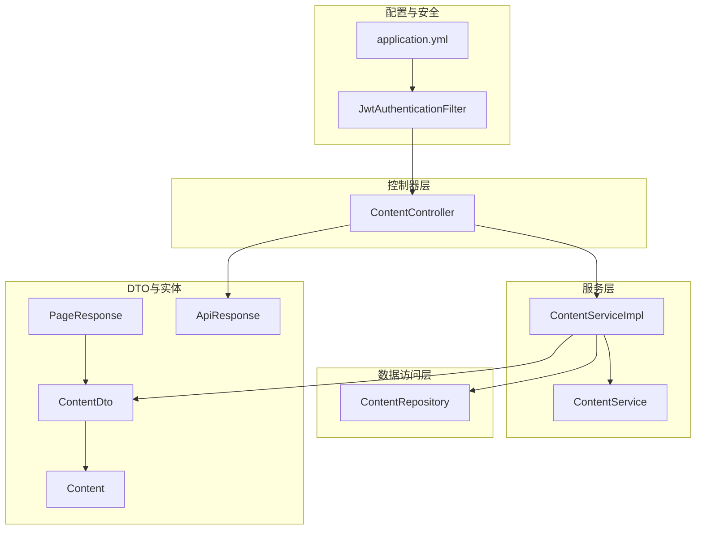
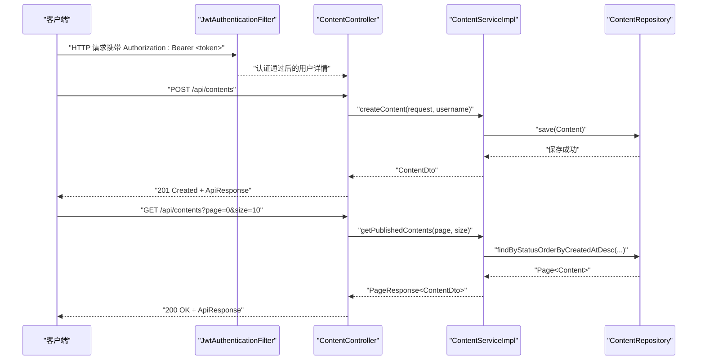
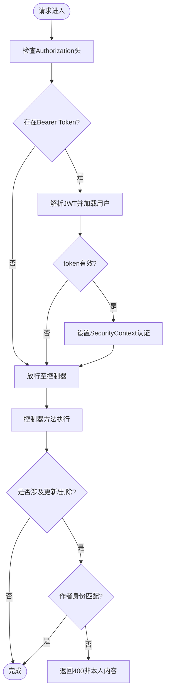
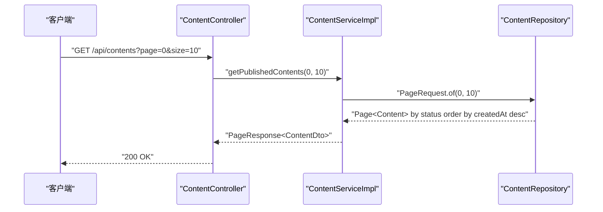
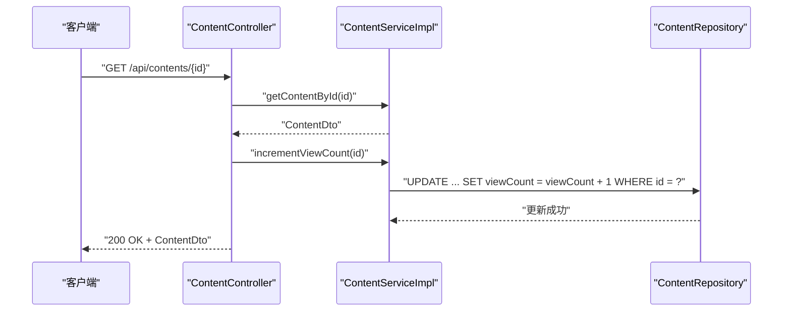
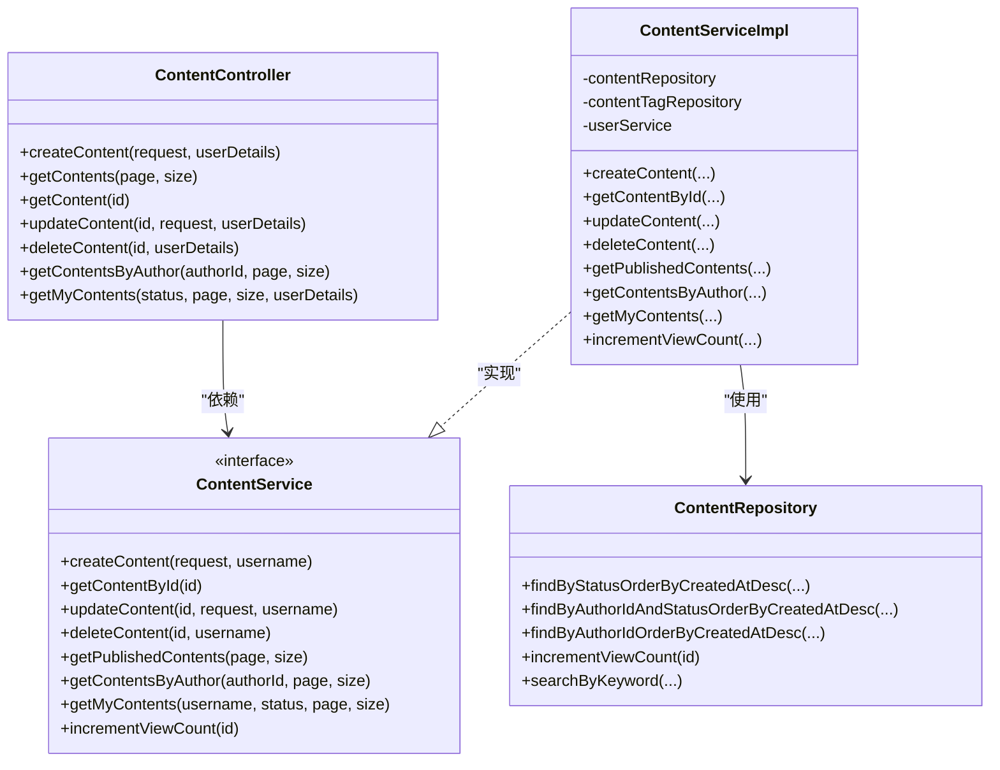

# 内容CRUD操作

<cite>
**本文档引用的文件**
- [ContentController.java](file://communication-backend/src/main/java/com/communication/controller/ContentController.java)
- [ContentService.java](file://communication-backend/src/main/java/com/communication/service/ContentService.java)
- [ContentServiceImpl.java](file://communication-backend/src/main/java/com/communication/service/impl/ContentServiceImpl.java)
- [ContentRepository.java](file://communication-backend/src/main/java/com/communication/repository/ContentRepository.java)
- [CreateContentRequest.java](file://communication-backend/src/main/java/com/communication/dto/CreateContentRequest.java)
- [UpdateContentRequest.java](file://communication-backend/src/main/java/com/communication/dto/UpdateContentRequest.java)
- [ContentDto.java](file://communication-backend/src/main/java/com/communication/dto/ContentDto.java)
- [PageResponse.java](file://communication-backend/src/main/java/com/communication/dto/PageResponse.java)
- [ApiResponse.java](file://communication-backend/src/main/java/com/communication/dto/ApiResponse.java)
- [Content.java](file://communication-backend/src/main/java/com/communication/entity/Content.java)
- [ContentStatus.java](file://communication-backend/src/main/java/com/communication/entity/ContentStatus.java)
- [MediaType.java](file://communication-backend/src/main/java/com/communication/entity/MediaType.java)
- [JwtAuthenticationFilter.java](file://communication-backend/src/main/java/com/communication/config/JwtAuthenticationFilter.java)
- [application.yml](file://communication-backend/src/main/resources/application.yml)
- [GlobalExceptionHandler.java](file://communication-backend/src/main/java/com/communication/exception/GlobalExceptionHandler.java)
</cite>

## 目录
1. [简介](#简介)
2. [项目结构](#项目结构)
3. [核心组件](#核心组件)
4. [架构总览](#架构总览)
5. [详细组件分析](#详细组件分析)
6. [依赖关系分析](#依赖关系分析)
7. [性能考虑](#性能考虑)
8. [故障排除指南](#故障排除指南)
9. [结论](#结论)

## 简介
本文件为内容CRUD操作的完整API文档，覆盖以下端点：
- POST /api/contents：创建内容
- GET /api/contents：获取已发布内容列表（分页）
- GET /api/contents/{id}：获取单个内容（含视图计数递增）
- PUT /api/contents/{id}：更新内容
- DELETE /api/contents/{id}：删除内容
- GET /api/contents/user/{authorId}：按作者获取内容列表（分页）
- GET /api/contents/my：获取自己的内容列表（分页，可选状态过滤）

文档详细说明了每个端点的HTTP方法、URL模式、请求参数与响应格式；解释了CreateContentRequest与UpdateContentRequest的数据验证规则与字段要求；阐述鉴权机制与权限控制（作者身份验证与内容所有权检查）；提供完整的请求/响应示例（成功与错误场景）；描述分页机制与排序选项，以及视图计数的实现逻辑。

## 项目结构
后端采用Spring Boot分层架构：
- 控制器层：ContentController负责REST接口
- 服务层：ContentService定义业务契约，ContentServiceImpl实现业务逻辑
- 数据访问层：ContentRepository基于JPA提供数据查询与更新
- DTO与实体：ContentDto用于对外传输，Content为数据库实体
- 配置与安全：JwtAuthenticationFilter进行JWT鉴权过滤

**图表来源**
- [ContentController.java](file://communication-backend/src/main/java/com/communication/controller/ContentController.java#L1-L85)
- [ContentService.java](file://communication-backend/src/main/java/com/communication/service/ContentService.java#L1-L24)
- [ContentServiceImpl.java](file://communication-backend/src/main/java/com/communication/service/impl/ContentServiceImpl.java#L1-L199)
- [ContentRepository.java](file://communication-backend/src/main/java/com/communication/repository/ContentRepository.java#L1-L56)
- [ContentDto.java](file://communication-backend/src/main/java/com/communication/dto/ContentDto.java#L1-L118)
- [Content.java](file://communication-backend/src/main/java/com/communication/entity/Content.java#L1-L135)
- [PageResponse.java](file://communication-backend/src/main/java/com/communication/dto/PageResponse.java#L1-L65)
- [ApiResponse.java](file://communication-backend/src/main/java/com/communication/dto/ApiResponse.java#L1-L76)
- [JwtAuthenticationFilter.java](file://communication-backend/src/main/java/com/communication/config/JwtAuthenticationFilter.java#L1-L69)
- [application.yml](file://communication-backend/src/main/resources/application.yml#L1-L42)

**章节来源**
- [ContentController.java](file://communication-backend/src/main/java/com/communication/controller/ContentController.java#L1-L85)
- [ContentService.java](file://communication-backend/src/main/java/com/communication/service/ContentService.java#L1-L24)
- [ContentServiceImpl.java](file://communication-backend/src/main/java/com/communication/service/impl/ContentServiceImpl.java#L1-L199)
- [ContentRepository.java](file://communication-backend/src/main/java/com/communication/repository/ContentRepository.java#L1-L56)
- [ContentDto.java](file://communication-backend/src/main/java/com/communication/dto/ContentDto.java#L1-L118)
- [Content.java](file://communication-backend/src/main/java/com/communication/entity/Content.java#L1-L135)
- [PageResponse.java](file://communication-backend/src/main/java/com/communication/dto/PageResponse.java#L1-L65)
- [ApiResponse.java](file://communication-backend/src/main/java/com/communication/dto/ApiResponse.java#L1-L76)
- [JwtAuthenticationFilter.java](file://communication-backend/src/main/java/com/communication/config/JwtAuthenticationFilter.java#L1-L69)
- [application.yml](file://communication-backend/src/main/resources/application.yml#L1-L42)

## 核心组件
- ContentController：暴露REST API，接收请求参数，调用ContentService，并通过ApiResponse封装统一响应。
- ContentService/Impl：实现内容创建、读取、更新、删除、分页查询与视图计数递增等业务逻辑。
- ContentRepository：提供JPA查询方法，包含分页、搜索、统计与视图计数更新。
- DTO与实体：CreateContentRequest/UpdateContentRequest定义输入校验规则；ContentDto用于对外输出；Content为数据库实体。
- 鉴权与异常：JwtAuthenticationFilter从Authorization头解析JWT并注入认证上下文；GlobalExceptionHandler统一处理异常并返回标准响应。

**章节来源**
- [ContentController.java](file://communication-backend/src/main/java/com/communication/controller/ContentController.java#L1-L85)
- [ContentService.java](file://communication-backend/src/main/java/com/communication/service/ContentService.java#L1-L24)
- [ContentServiceImpl.java](file://communication-backend/src/main/java/com/communication/service/impl/ContentServiceImpl.java#L1-L199)
- [ContentRepository.java](file://communication-backend/src/main/java/com/communication/repository/ContentRepository.java#L1-L56)
- [CreateContentRequest.java](file://communication-backend/src/main/java/com/communication/dto/CreateContentRequest.java#L1-L42)
- [UpdateContentRequest.java](file://communication-backend/src/main/java/com/communication/dto/UpdateContentRequest.java#L1-L40)
- [ContentDto.java](file://communication-backend/src/main/java/com/communication/dto/ContentDto.java#L1-L118)
- [Content.java](file://communication-backend/src/main/java/com/communication/entity/Content.java#L1-L135)
- [JwtAuthenticationFilter.java](file://communication-backend/src/main/java/com/communication/config/JwtAuthenticationFilter.java#L1-L69)
- [GlobalExceptionHandler.java](file://communication-backend/src/main/java/com/communication/exception/GlobalExceptionHandler.java#L1-L63)

## 架构总览
下图展示内容CRUD的端到端流程：客户端请求经JwtAuthenticationFilter鉴权，由ContentController接收，调用ContentServiceImpl执行业务逻辑，持久化至数据库并通过ContentRepository更新视图计数或查询分页结果，最终以ApiResponse统一返回。

**图表来源**
- [JwtAuthenticationFilter.java](file://communication-backend/src/main/java/com/communication/config/JwtAuthenticationFilter.java#L31-L67)
- [ContentController.java](file://communication-backend/src/main/java/com/communication/controller/ContentController.java#L23-L39)
- [ContentServiceImpl.java](file://communication-backend/src/main/java/com/communication/service/impl/ContentServiceImpl.java#L36-L58)
- [ContentRepository.java](file://communication-backend/src/main/java/com/communication/repository/ContentRepository.java#L19-L26)

## 详细组件分析

### API端点定义与行为

- POST /api/contents
  - 方法：POST
  - 路径：/api/contents
  - 认证：需要JWT（Authorization: Bearer <token>）
  - 请求体：CreateContentRequest
  - 响应：201 Created，数据为ContentDto
  - 行为：创建新内容，默认状态为已发布，媒体类型默认文本，支持标签（最多10个），标题限制长度
  - 权限：仅认证用户可创建
  - 错误：400（校验失败）、401（未认证）、500（服务器异常）

- GET /api/contents
  - 方法：GET
  - 路径：/api/contents
  - 查询参数：page（默认0）、size（默认10）
  - 响应：200 OK，数据为PageResponse<ContentDto>
  - 行为：获取已发布内容列表，按创建时间倒序
  - 分页：PageResponse包含content、page、size、totalElements、totalPages、first、last

- GET /api/contents/{id}
  - 方法：GET
  - 路径：/api/contents/{id}
  - 路径参数：id（Long）
  - 响应：200 OK，数据为ContentDto
  - 行为：获取指定内容并递增视图计数
  - 视图计数：通过ContentRepository.incrementViewCount实现原子递增

- PUT /api/contents/{id}
  - 方法：PUT
  - 路径：/api/contents/{id}
  - 路径参数：id（Long）
  - 认证：需要JWT
  - 请求体：UpdateContentRequest
  - 响应：200 OK，数据为ContentDto
  - 行为：更新内容（仅允许内容作者），可部分更新字段；标签会先清空再重新保存
  - 权限：内容作者身份验证与所有权检查
  - 错误：400（非本人内容或校验失败）、404（内容不存在）、401（未认证）

- DELETE /api/contents/{id}
  - 方法：DELETE
  - 路径：/api/contents/{id}
  - 路径参数：id（Long）
  - 认证：需要JWT
  - 响应：200 OK，数据为空
  - 行为：删除内容（仅允许内容作者）
  - 错误：400（非本人内容）、404（内容不存在）、401（未认证）

- GET /api/contents/user/{authorId}
  - 方法：GET
  - 路径：/api/contents/user/{authorId}
  - 路径参数：authorId（Long）
  - 查询参数：page（默认0）、size（默认10）
  - 响应：200 OK，数据为PageResponse<ContentDto>
  - 行为：按作者获取已发布内容列表，按创建时间倒序

- GET /api/contents/my
  - 方法：GET
  - 路径：/api/contents/my
  - 认证：需要JWT
  - 查询参数：status（可选，Draft/Published）、page（默认0）、size（默认10）
  - 响应：200 OK，数据为PageResponse<ContentDto>
  - 行为：获取当前登录用户的全部内容（可按状态过滤），按创建时间倒序

**章节来源**
- [ContentController.java](file://communication-backend/src/main/java/com/communication/controller/ContentController.java#L23-L83)
- [ContentServiceImpl.java](file://communication-backend/src/main/java/com/communication/service/impl/ContentServiceImpl.java#L119-L154)
- [ContentRepository.java](file://communication-backend/src/main/java/com/communication/repository/ContentRepository.java#L19-L44)

### 数据模型与验证规则

- CreateContentRequest
  - 字段：title（必填，最大200字符）、body（可选）、mediaUrl（可选）、mediaType（可选，默认TEXT）、status（可选，默认PUBLISHED）、tags（可选，最多10个）
  - 验证：使用Jakarta Bean Validation注解进行约束
  - 默认值：mediaType=TEXT、status=PUBLISHED

- UpdateContentRequest
  - 字段：title（最大200字符）、body（可选）、mediaUrl（可选）、mediaType（可选）、status（可选）、tags（可选，最多10个）
  - 验证：仅对title与tags进行长度限制，其他字段可部分更新

- ContentDto
  - 字段：id、title、body、mediaUrl、mediaType、viewCount、commentCount、status、tags、createdAt、updatedAt、author
  - 用途：对外传输内容信息，包含作者信息

- Content（数据库实体）
  - 字段：id、author（外键）、title（最大200）、body（TEXT）、mediaUrl（最大500）、mediaType、viewCount、commentCount、status、tags、createdAt、updatedAt
  - 约束：非空字段、默认值与枚举类型

- 枚举
  - ContentStatus：DRAFT、PUBLISHED
  - MediaType：TEXT、IMAGE、VIDEO

**章节来源**
- [CreateContentRequest.java](file://communication-backend/src/main/java/com/communication/dto/CreateContentRequest.java#L10-L41)
- [UpdateContentRequest.java](file://communication-backend/src/main/java/com/communication/dto/UpdateContentRequest.java#L9-L39)
- [ContentDto.java](file://communication-backend/src/main/java/com/communication/dto/ContentDto.java#L10-L82)
- [Content.java](file://communication-backend/src/main/java/com/communication/entity/Content.java#L13-L99)
- [ContentStatus.java](file://communication-backend/src/main/java/com/communication/entity/ContentStatus.java#L3-L6)
- [MediaType.java](file://communication-backend/src/main/java/com/communication/entity/MediaType.java#L3-L7)

### 鉴权机制与权限控制

- 鉴权流程
  - 客户端在请求头中携带Authorization: Bearer <token>
  - JwtAuthenticationFilter从请求头提取JWT，解析用户名
  - 若token有效且未过期，则在SecurityContextHolder中设置认证信息
  - 控制器方法通过@AuthenticationPrincipal获取当前用户

- 权限控制
  - 创建内容：仅认证用户可创建
  - 更新/删除内容：仅内容作者可操作，服务层进行用户名匹配校验
  - 获取他人内容：无需认证，但仅返回已发布内容

**图表来源**
- [JwtAuthenticationFilter.java](file://communication-backend/src/main/java/com/communication/config/JwtAuthenticationFilter.java#L31-L67)
- [ContentController.java](file://communication-backend/src/main/java/com/communication/controller/ContentController.java#L23-L63)
- [ContentServiceImpl.java](file://communication-backend/src/main/java/com/communication/service/impl/ContentServiceImpl.java#L68-L117)

**章节来源**
- [JwtAuthenticationFilter.java](file://communication-backend/src/main/java/com/communication/config/JwtAuthenticationFilter.java#L1-L69)
- [ContentController.java](file://communication-backend/src/main/java/com/communication/controller/ContentController.java#L1-L85)
- [ContentServiceImpl.java](file://communication-backend/src/main/java/com/communication/service/impl/ContentServiceImpl.java#L68-L117)

### 分页机制与排序

- 分页参数
  - page：页码（从0开始，默认0）
  - size：每页大小（默认10）
- 排序规则
  - 已发布内容列表：按createdAt降序
  - 作者内容列表：按createdAt降序
- 响应结构
  - PageResponse包含content、page、size、totalElements、totalPages、first、last

**图表来源**
- [ContentController.java](file://communication-backend/src/main/java/com/communication/controller/ContentController.java#L33-L39)
- [ContentServiceImpl.java](file://communication-backend/src/main/java/com/communication/service/impl/ContentServiceImpl.java#L119-L127)
- [ContentRepository.java](file://communication-backend/src/main/java/com/communication/repository/ContentRepository.java#L19-L26)

**章节来源**
- [ContentController.java](file://communication-backend/src/main/java/com/communication/controller/ContentController.java#L33-L39)
- [ContentServiceImpl.java](file://communication-backend/src/main/java/com/communication/service/impl/ContentServiceImpl.java#L119-L127)
- [ContentRepository.java](file://communication-backend/src/main/java/com/communication/repository/ContentRepository.java#L19-L26)
- [PageResponse.java](file://communication-backend/src/main/java/com/communication/dto/PageResponse.java#L5-L41)

### 视图计数实现逻辑

- 访问内容详情时，服务层调用Repository.incrementViewCount(id)进行原子递增
- Repository使用原生SQL更新viewCount字段
- Content实体维护viewCount字段并在DTO中暴露

**图表来源**
- [ContentController.java](file://communication-backend/src/main/java/com/communication/controller/ContentController.java#L41-L46)
- [ContentServiceImpl.java](file://communication-backend/src/main/java/com/communication/service/impl/ContentServiceImpl.java#L156-L160)
- [ContentRepository.java](file://communication-backend/src/main/java/com/communication/repository/ContentRepository.java#L28-L30)

**章节来源**
- [ContentController.java](file://communication-backend/src/main/java/com/communication/controller/ContentController.java#L41-L46)
- [ContentServiceImpl.java](file://communication-backend/src/main/java/com/communication/service/impl/ContentServiceImpl.java#L156-L160)
- [ContentRepository.java](file://communication-backend/src/main/java/com/communication/repository/ContentRepository.java#L28-L30)
- [Content.java](file://communication-backend/src/main/java/com/communication/entity/Content.java#L36-L40)

### 统一响应与错误处理

- 响应结构
  - ApiResponse包含code、message、data、timestamp
  - 成功响应：code=200，message="Success"或自定义消息
  - 失败响应：根据错误类型设置相应code与message
- 异常处理
  - BadRequestException：400
  - ResourceNotFoundException：404
  - BadCredentialsException：401
  - MethodArgumentNotValidException：400（返回字段级错误映射）
  - 其他异常：500

**章节来源**
- [ApiResponse.java](file://communication-backend/src/main/java/com/communication/dto/ApiResponse.java#L8-L56)
- [GlobalExceptionHandler.java](file://communication-backend/src/main/java/com/communication/exception/GlobalExceptionHandler.java#L18-L61)

## 依赖关系分析

**图表来源**
- [ContentController.java](file://communication-backend/src/main/java/com/communication/controller/ContentController.java#L13-L21)
- [ContentService.java](file://communication-backend/src/main/java/com/communication/service/ContentService.java#L6-L23)
- [ContentServiceImpl.java](file://communication-backend/src/main/java/com/communication/service/impl/ContentServiceImpl.java#L24-L34)
- [ContentRepository.java](file://communication-backend/src/main/java/com/communication/repository/ContentRepository.java#L17-L55)

**章节来源**
- [ContentController.java](file://communication-backend/src/main/java/com/communication/controller/ContentController.java#L1-L85)
- [ContentService.java](file://communication-backend/src/main/java/com/communication/service/ContentService.java#L1-L24)
- [ContentServiceImpl.java](file://communication-backend/src/main/java/com/communication/service/impl/ContentServiceImpl.java#L1-L199)
- [ContentRepository.java](file://communication-backend/src/main/java/com/communication/repository/ContentRepository.java#L1-L56)

## 性能考虑
- 分页查询：使用PageRequest避免一次性加载大量数据，降低内存压力
- 原子更新：视图计数通过原生SQL原子递增，减少并发冲突
- 标签管理：更新内容时先删除旧标签再批量保存，保证一致性
- 排序索引：按createdAt降序查询，建议在数据库层面建立相应索引以提升性能

[本节为通用指导，不直接分析具体文件]

## 故障排除指南
- 400 校验失败：检查CreateContentRequest/UpdateContentRequest字段长度与必填约束
- 400 非本人内容：确认当前登录用户与内容作者一致
- 401 未认证：确保请求头包含有效的Bearer token
- 404 内容不存在：确认id是否存在且状态为已发布（或访问权限范围内）
- 500 服务器异常：查看服务端日志定位具体异常

**章节来源**
- [GlobalExceptionHandler.java](file://communication-backend/src/main/java/com/communication/exception/GlobalExceptionHandler.java#L18-L61)
- [ContentServiceImpl.java](file://communication-backend/src/main/java/com/communication/service/impl/ContentServiceImpl.java#L68-L117)
- [ContentRepository.java](file://communication-backend/src/main/java/com/communication/repository/ContentRepository.java#L25-L26)

## 结论
本API文档完整覆盖内容CRUD操作的所有端点，明确了鉴权与权限控制策略、数据验证规则、分页与排序机制以及视图计数实现逻辑。通过统一的ApiResponse与全局异常处理，确保前后端交互的一致性与可靠性。建议在生产环境中结合数据库索引优化与缓存策略进一步提升性能。