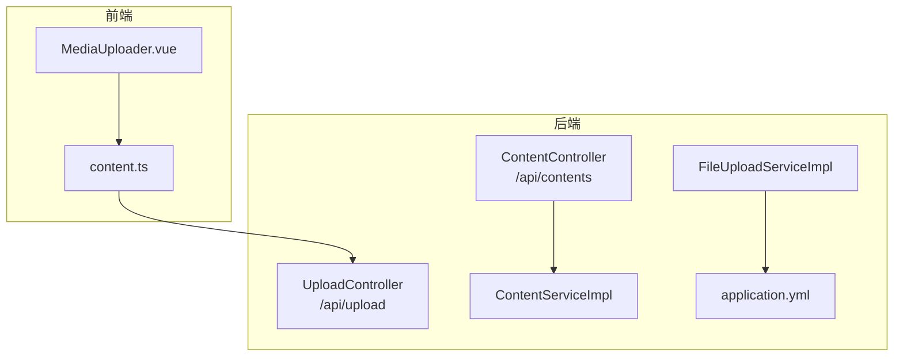
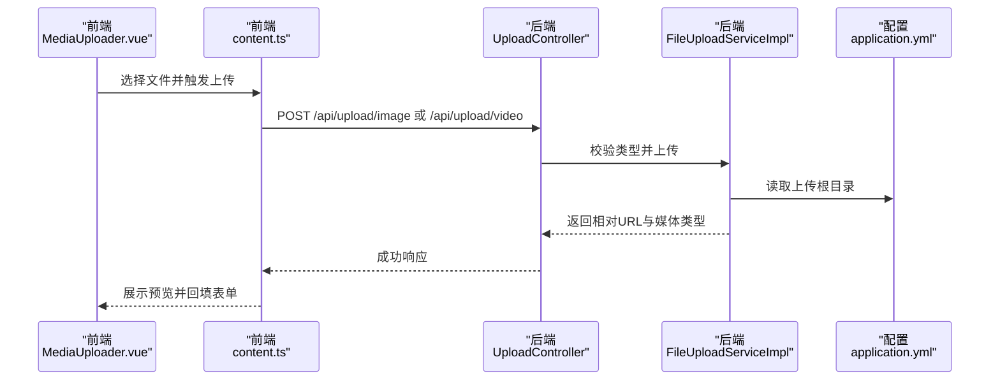
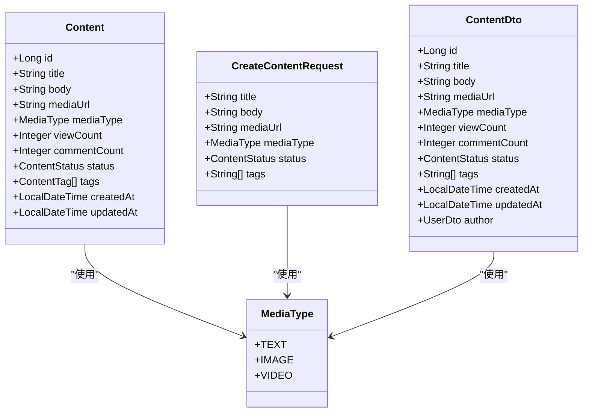
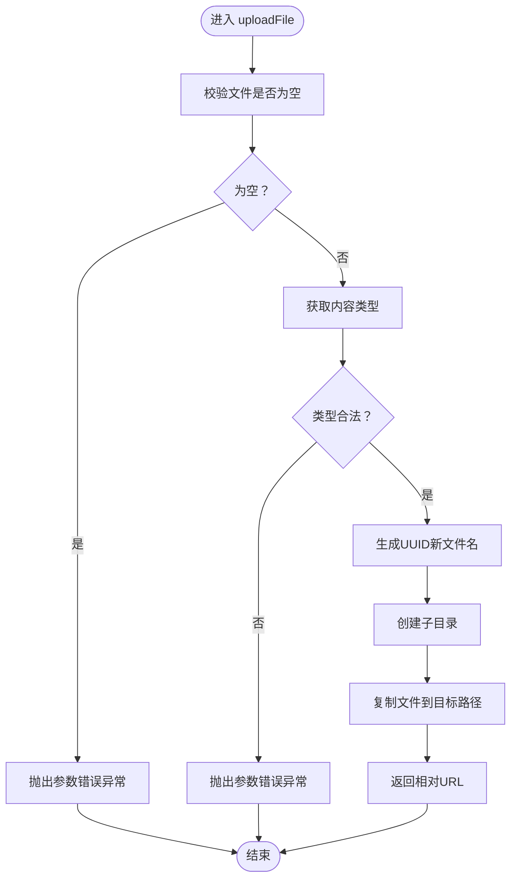
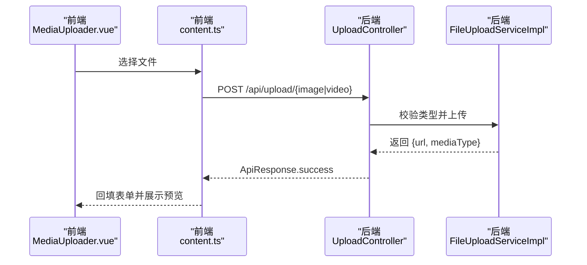
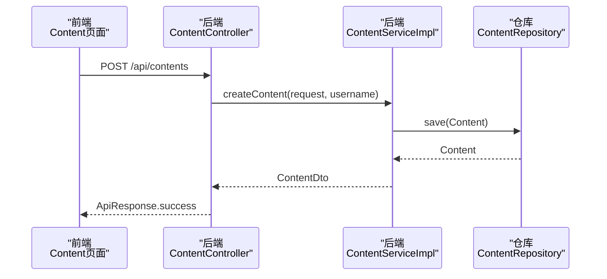
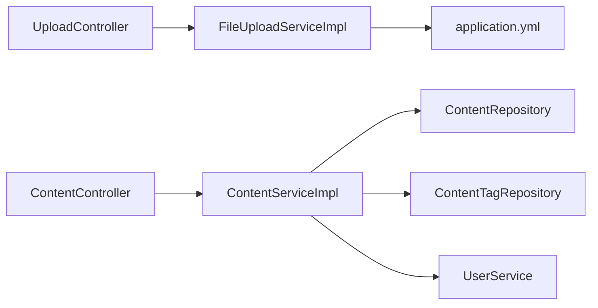

# 内容媒体处理

<cite>
**本文引用的文件**
- [MediaType.java](file://communication-backend/src/main/java/com/communication/entity/MediaType.java)
- [UploadController.java](file://communication-backend/src/main/java/com/communication/controller/UploadController.java)
- [FileUploadService.java](file://communication-backend/src/main/java/com/communication/service/FileUploadService.java)
- [FileUploadServiceImpl.java](file://communication-backend/src/main/java/com/communication/service/impl/FileUploadServiceImpl.java)
- [Content.java](file://communication-backend/src/main/java/com/communication/entity/Content.java)
- [CreateContentRequest.java](file://communication-backend/src/main/java/com/communication/dto/CreateContentRequest.java)
- [ContentDto.java](file://communication-backend/src/main/java/com/communication/dto/ContentDto.java)
- [application.yml](file://communication-backend/src/main/resources/application.yml)
- [ContentService.java](file://communication-backend/src/main/java/com/communication/service/ContentService.java)
- [ContentServiceImpl.java](file://communication-backend/src/main/java/com/communication/service/impl/ContentServiceImpl.java)
- [ContentController.java](file://communication-backend/src/main/java/com/communication/controller/ContentController.java)
- [MediaUploader.vue](file://communication-frontend/src/components/content/MediaUploader.vue)
- [content.ts](file://communication-frontend/src/api/content.ts)
- [BadRequestException.java](file://communication-backend/src/main/java/com/communication/exception/BadRequestException.java)
- [GlobalExceptionHandler.java](file://communication-backend/src/main/java/com/communication/exception/GlobalExceptionHandler.java)
</cite>

## 目录
1. [简介](#简介)
2. [项目结构](#项目结构)
3. [核心组件](#核心组件)
4. [架构总览](#架构总览)
5. [详细组件分析](#详细组件分析)
6. [依赖关系分析](#依赖关系分析)
7. [性能考量](#性能考量)
8. [故障排查指南](#故障排查指南)
9. [结论](#结论)
10. [附录](#附录)

## 简介
本技术文档围绕内容媒体处理子系统展开，重点覆盖以下方面：
- MediaType 枚举对不同媒体类型（文本、图片、视频）的支持与处理逻辑
- 文件上传服务的实现：验证、大小限制、格式检查、存储策略
- 媒体文件命名规则与存储路径管理
- 文件上传安全机制：恶意文件检测与访问控制
- 媒体文件预览与缩略图生成能力现状与扩展建议
- 文件清理与垃圾回收的自动化机制
- 媒体文件的版本管理与备份策略
- 完整的 API 接口文档与使用示例

## 项目结构
后端采用 Spring Boot 分层架构，前端基于 Vue 3 + TypeScript。媒体处理涉及控制器、服务、实体与 DTO、配置以及前端上传组件与 API 封装。

图表来源
- [UploadController.java](file://communication-backend/src/main/java/com/communication/controller/UploadController.java#L1-L59)
- [ContentController.java](file://communication-backend/src/main/java/com/communication/controller/ContentController.java#L1-L85)
- [FileUploadServiceImpl.java](file://communication-backend/src/main/java/com/communication/service/impl/FileUploadServiceImpl.java#L1-L88)
- [ContentServiceImpl.java](file://communication-backend/src/main/java/com/communication/service/impl/ContentServiceImpl.java#L1-L199)
- [application.yml](file://communication-backend/src/main/resources/application.yml#L1-L42)
- [MediaUploader.vue](file://communication-frontend/src/components/content/MediaUploader.vue#L1-L201)
- [content.ts](file://communication-frontend/src/api/content.ts#L1-L114)

章节来源
- [UploadController.java](file://communication-backend/src/main/java/com/communication/controller/UploadController.java#L1-L59)
- [ContentController.java](file://communication-backend/src/main/java/com/communication/controller/ContentController.java#L1-L85)
- [FileUploadServiceImpl.java](file://communication-backend/src/main/java/com/communication/service/impl/FileUploadServiceImpl.java#L1-L88)
- [ContentServiceImpl.java](file://communication-backend/src/main/java/com/communication/service/impl/ContentServiceImpl.java#L1-L199)
- [application.yml](file://communication-backend/src/main/resources/application.yml#L1-L42)
- [MediaUploader.vue](file://communication-frontend/src/components/content/MediaUploader.vue#L1-L201)
- [content.ts](file://communication-frontend/src/api/content.ts#L1-L114)

## 核心组件
- MediaType 枚举：定义媒体类型常量（TEXT、IMAGE、VIDEO），用于内容模型与 DTO 的统一表达。
- UploadController：提供 /api/upload/image 与 /api/upload/video 两个端点，负责接收前端上传的文件并返回 URL 与媒体类型。
- FileUploadService/Impl：封装文件上传、删除、类型校验与存储路径管理。
- ContentController/Service：负责内容的增删改查与视图计数，内容实体中包含 mediaUrl 与 mediaType 字段。
- 前端 MediaUploader.vue 与 content.ts：封装上传 UI、文件选择、进度提示与调用后端上传接口。

章节来源
- [MediaType.java](file://communication-backend/src/main/java/com/communication/entity/MediaType.java#L1-L8)
- [UploadController.java](file://communication-backend/src/main/java/com/communication/controller/UploadController.java#L1-L59)
- [FileUploadService.java](file://communication-backend/src/main/java/com/communication/service/FileUploadService.java#L1-L15)
- [FileUploadServiceImpl.java](file://communication-backend/src/main/java/com/communication/service/impl/FileUploadServiceImpl.java#L1-L88)
- [ContentController.java](file://communication-backend/src/main/java/com/communication/controller/ContentController.java#L1-L85)
- [ContentService.java](file://communication-backend/src/main/java/com/communication/service/ContentService.java#L1-L24)
- [ContentServiceImpl.java](file://communication-backend/src/main/java/com/communication/service/impl/ContentServiceImpl.java#L1-L199)
- [MediaUploader.vue](file://communication-frontend/src/components/content/MediaUploader.vue#L1-L201)
- [content.ts](file://communication-frontend/src/api/content.ts#L1-L114)

## 架构总览
后端通过 UploadController 接收前端上传请求，委托 FileUploadServiceImpl 执行文件校验与落盘；上传成功后返回相对 URL 与媒体类型；前端在创建内容时将 mediaUrl 与 mediaType 一并提交到 ContentController/Service，最终持久化至数据库。

图表来源
- [MediaUploader.vue](file://communication-frontend/src/components/content/MediaUploader.vue#L25-L58)
- [content.ts](file://communication-frontend/src/api/content.ts#L98-L112)
- [UploadController.java](file://communication-backend/src/main/java/com/communication/controller/UploadController.java#L23-L57)
- [FileUploadServiceImpl.java](file://communication-backend/src/main/java/com/communication/service/impl/FileUploadServiceImpl.java#L31-L61)
- [application.yml](file://communication-backend/src/main/resources/application.yml#L38-L42)

## 详细组件分析

### MediaType 枚举与内容模型
- 枚举定义了三种媒体类型：TEXT、IMAGE、VIDEO，作为内容模型与 DTO 的统一标识。
- Content 实体包含 mediaUrl 与 mediaType 字段，支持内容与媒体资源的解耦。
- CreateContentRequest 与 ContentDto 支持设置/获取 mediaType，默认为 TEXT。

图表来源
- [MediaType.java](file://communication-backend/src/main/java/com/communication/entity/MediaType.java#L1-L8)
- [Content.java](file://communication-backend/src/main/java/com/communication/entity/Content.java#L1-L135)
- [CreateContentRequest.java](file://communication-backend/src/main/java/com/communication/dto/CreateContentRequest.java#L1-L42)
- [ContentDto.java](file://communication-backend/src/main/java/com/communication/dto/ContentDto.java#L1-L118)

章节来源
- [MediaType.java](file://communication-backend/src/main/java/com/communication/entity/MediaType.java#L1-L8)
- [Content.java](file://communication-backend/src/main/java/com/communication/entity/Content.java#L1-L135)
- [CreateContentRequest.java](file://communication-backend/src/main/java/com/communication/dto/CreateContentRequest.java#L1-L42)
- [ContentDto.java](file://communication-backend/src/main/java/com/communication/dto/ContentDto.java#L1-L118)

### 文件上传服务实现
- 类型校验：分别维护允许的图片与视频 MIME 类型集合，提供 isValidImageType 与 isValidVideoType 方法。
- 上传流程：校验空文件、类型合法性；生成 UUID 新文件名；按子目录(images/videos)创建上传路径；复制文件到目标位置；返回相对 URL。
- 删除策略：根据以 /uploads/ 开头的 URL 计算相对路径并删除，异常静默处理（不抛出）。
- 大小限制：Spring 配置中限制单文件与请求总大小均为 100MB。

图表来源
- [FileUploadServiceImpl.java](file://communication-backend/src/main/java/com/communication/service/impl/FileUploadServiceImpl.java#L31-L61)
- [application.yml](file://communication-backend/src/main/resources/application.yml#L25-L28)

章节来源
- [FileUploadService.java](file://communication-backend/src/main/java/com/communication/service/FileUploadService.java#L1-L15)
- [FileUploadServiceImpl.java](file://communication-backend/src/main/java/com/communication/service/impl/FileUploadServiceImpl.java#L1-L88)
- [application.yml](file://communication-backend/src/main/resources/application.yml#L25-L42)

### 上传控制器与前端集成
- 控制器端点：
  - POST /api/upload/image：校验图片类型，调用服务上传，返回 {url, mediaType}。
  - POST /api/upload/video：校验视频类型，调用服务上传，返回 {url, mediaType}。
- 前端组件：
  - MediaUploader.vue：支持图片/视频选择、预览、上传进度与错误提示；根据文件类型调用对应上传接口。
  - content.ts：封装 uploadImage 与 uploadVideo 请求，使用 FormData 提交。

图表来源
- [MediaUploader.vue](file://communication-frontend/src/components/content/MediaUploader.vue#L25-L58)
- [content.ts](file://communication-frontend/src/api/content.ts#L98-L112)
- [UploadController.java](file://communication-backend/src/main/java/com/communication/controller/UploadController.java#L23-L57)
- [FileUploadServiceImpl.java](file://communication-backend/src/main/java/com/communication/service/impl/FileUploadServiceImpl.java#L31-L61)

章节来源
- [UploadController.java](file://communication-backend/src/main/java/com/communication/controller/UploadController.java#L1-L59)
- [MediaUploader.vue](file://communication-frontend/src/components/content/MediaUploader.vue#L1-L201)
- [content.ts](file://communication-frontend/src/api/content.ts#L1-L114)

### 内容创建与媒体关联
- ContentController 暴露创建内容接口，接收 CreateContentRequest，其中包含 mediaUrl 与 mediaType。
- ContentServiceImpl 创建 Content 实体并持久化，同时处理标签保存与查询。
- Content 实体的 mediaUrl 与 mediaType 字段用于记录媒体资源与类型。

图表来源
- [ContentController.java](file://communication-backend/src/main/java/com/communication/controller/ContentController.java#L23-L31)
- [ContentServiceImpl.java](file://communication-backend/src/main/java/com/communication/service/impl/ContentServiceImpl.java#L36-L58)
- [CreateContentRequest.java](file://communication-backend/src/main/java/com/communication/dto/CreateContentRequest.java#L10-L42)
- [Content.java](file://communication-backend/src/main/java/com/communication/entity/Content.java#L11-L48)

章节来源
- [ContentController.java](file://communication-backend/src/main/java/com/communication/controller/ContentController.java#L1-L85)
- [ContentServiceImpl.java](file://communication-backend/src/main/java/com/communication/service/impl/ContentServiceImpl.java#L1-L199)
- [CreateContentRequest.java](file://communication-backend/src/main/java/com/communication/dto/CreateContentRequest.java#L1-L42)
- [Content.java](file://communication-backend/src/main/java/com/communication/entity/Content.java#L1-L135)

### 媒体文件命名规则与存储路径管理
- 命名规则：使用 UUID 生成唯一文件名，保留原扩展名，避免冲突与路径遍历风险。
- 存储路径：基于配置 upload.path 与子目录(images/videos)拼接绝对路径，自动创建目录。
- 返回 URL：统一返回 /uploads/{subDir}/{filename} 相对路径，便于前后端一致解析。

章节来源
- [FileUploadServiceImpl.java](file://communication-backend/src/main/java/com/communication/service/impl/FileUploadServiceImpl.java#L42-L57)
- [application.yml](file://communication-backend/src/main/resources/application.yml#L38-L42)

### 文件上传安全机制
- 恶意文件检测：
  - 基于 MIME 类型白名单进行严格校验，拒绝未知或非允许类型。
  - 未实现文件内容深度扫描（如魔数校验、AV 扫描），建议后续增强。
- 访问控制：
  - 上传接口未做鉴权校验，建议在 UploadController 上增加 @PreAuthorize 或过滤器。
  - 内容更新/删除接口基于作者身份校验，防止越权操作。
- 异常处理：
  - 参数错误统一由 BadRequestException 抛出，全局异常处理器转换为标准 ApiResponse。

章节来源
- [UploadController.java](file://communication-backend/src/main/java/com/communication/controller/UploadController.java#L23-L57)
- [FileUploadServiceImpl.java](file://communication-backend/src/main/java/com/communication/service/impl/FileUploadServiceImpl.java#L78-L86)
- [ContentServiceImpl.java](file://communication-backend/src/main/java/com/communication/service/impl/ContentServiceImpl.java#L74-L76)
- [BadRequestException.java](file://communication-backend/src/main/java/com/communication/exception/BadRequestException.java#L1-L13)
- [GlobalExceptionHandler.java](file://communication-backend/src/main/java/com/communication/exception/GlobalExceptionHandler.java#L1-L63)

### 媒体文件预览与缩略图生成
- 预览能力现状：
  - 前端 MediaUploader.vue 支持图片与视频的简单预览（img/video 标签）。
  - 后端未提供缩略图生成接口或服务。
- 建议扩展：
  - 后端新增缩略图生成服务（基于图片库处理），提供 /api/media/thumbnail 接口。
  - 前端在上传完成后请求缩略图并缓存，提升首屏渲染速度。

章节来源
- [MediaUploader.vue](file://communication-frontend/src/components/content/MediaUploader.vue#L68-L81)

### 文件清理与垃圾回收
- 已实现能力：
  - FileUploadServiceImpl.deleteFile 可根据 /uploads/ 前缀删除文件，异常静默处理。
- 自动化机制建议：
  - 结合内容生命周期与删除事件，建立定时任务扫描无引用文件并清理。
  - 建立“软删除”与“回收站”策略，避免误删。

章节来源
- [FileUploadServiceImpl.java](file://communication-backend/src/main/java/com/communication/service/impl/FileUploadServiceImpl.java#L63-L76)

### 版本管理与备份策略
- 当前实现：
  - 未发现版本化存储或备份策略。
- 建议方案：
  - 使用对象存储（如 S3）并开启多版本控制与生命周期策略。
  - 对关键媒体资源建立快照与异地备份，结合 CDN 缓存与回源策略。

## 依赖关系分析
后端组件之间的依赖关系如下：

图表来源
- [UploadController.java](file://communication-backend/src/main/java/com/communication/controller/UploadController.java#L1-L59)
- [FileUploadServiceImpl.java](file://communication-backend/src/main/java/com/communication/service/impl/FileUploadServiceImpl.java#L1-L88)
- [ContentController.java](file://communication-backend/src/main/java/com/communication/controller/ContentController.java#L1-L85)
- [ContentServiceImpl.java](file://communication-backend/src/main/java/com/communication/service/impl/ContentServiceImpl.java#L1-L199)

章节来源
- [UploadController.java](file://communication-backend/src/main/java/com/communication/controller/UploadController.java#L1-L59)
- [ContentController.java](file://communication-backend/src/main/java/com/communication/controller/ContentController.java#L1-L85)
- [FileUploadServiceImpl.java](file://communication-backend/src/main/java/com/communication/service/impl/FileUploadServiceImpl.java#L1-L88)
- [ContentServiceImpl.java](file://communication-backend/src/main/java/com/communication/service/impl/ContentServiceImpl.java#L1-L199)

## 性能考量
- 上传性能：
  - Spring 配置限制单文件与请求大小为 100MB，适合中小文件场景。
  - 建议启用断点续传与分片上传，提升大文件稳定性。
- 存储性能：
  - 建议使用高性能文件系统或对象存储，配合 CDN 加速静态资源访问。
- 并发与线程：
  - 文件上传为 IO 密集型操作，注意线程池与阻塞队列配置，避免阻塞 Web 线程。

## 故障排查指南
- 常见问题与定位：
  - 400 参数错误：通常由空文件或类型不被允许触发，检查前端类型判断与后端白名单。
  - 500 服务器错误：IO 异常导致上传失败，检查 upload.path 权限与磁盘空间。
  - 401 未授权：上传接口未鉴权，需补充安全拦截。
- 日志与监控：
  - 建议在 FileUploadServiceImpl 中增加上传耗时与失败原因日志。
  - 结合全局异常处理器输出统一错误码与消息。

章节来源
- [BadRequestException.java](file://communication-backend/src/main/java/com/communication/exception/BadRequestException.java#L1-L13)
- [GlobalExceptionHandler.java](file://communication-backend/src/main/java/com/communication/exception/GlobalExceptionHandler.java#L1-L63)
- [FileUploadServiceImpl.java](file://communication-backend/src/main/java/com/communication/service/impl/FileUploadServiceImpl.java#L58-L60)

## 结论
该媒体处理子系统以简洁清晰的方式实现了图片与视频的上传、存储与内容关联。MediaType 枚举与 Content 模型提供了良好的扩展性。当前实现具备基础的类型校验与命名规范，但在安全鉴权、缩略图生成、版本与备份策略等方面仍有改进空间。建议优先补齐上传鉴权、缩略图服务与自动化清理策略，以满足生产环境的可靠性与可用性要求。

## 附录

### API 接口文档

- 上传图片
  - 方法与路径：POST /api/upload/image
  - 请求体：multipart/form-data，字段 file
  - 成功响应：{ code: 200, message: "成功", data: { url: string, mediaType: "IMAGE" } }
  - 错误响应：{ code: 400, message: "错误信息" }

- 上传视频
  - 方法与路径：POST /api/upload/video
  - 请求体：multipart/form-data，字段 file
  - 成功响应：{ code: 200, message: "成功", data: { url: string, mediaType: "VIDEO" } }
  - 错误响应：{ code: 400, message: "错误信息" }

- 创建内容
  - 方法与路径：POST /api/contents
  - 请求体：CreateContentRequest（含 title、body、mediaUrl、mediaType、status、tags）
  - 成功响应：{ code: 201, message: "成功", data: ContentDto }

- 获取内容详情
  - 方法与路径：GET /api/contents/{id}
  - 成功响应：{ code: 200, message: "成功", data: ContentDto }

- 更新内容
  - 方法与路径：PUT /api/contents/{id}
  - 请求体：UpdateContentRequest（可选字段同上）
  - 成功响应：{ code: 200, message: "成功", data: ContentDto }

- 删除内容
  - 方法与路径：DELETE /api/contents/{id}
  - 成功响应：{ code: 200, message: "成功", data: null }

章节来源
- [UploadController.java](file://communication-backend/src/main/java/com/communication/controller/UploadController.java#L23-L57)
- [ContentController.java](file://communication-backend/src/main/java/com/communication/controller/ContentController.java#L23-L83)
- [content.ts](file://communication-frontend/src/api/content.ts#L98-L112)

### 使用示例（前端）
- 选择文件并上传图片/视频
  - 在 MediaUploader.vue 中选择文件，组件会根据类型调用 content.ts 的 uploadImage 或 uploadVideo。
  - 成功后回填表单并显示预览。

章节来源
- [MediaUploader.vue](file://communication-frontend/src/components/content/MediaUploader.vue#L25-L58)
- [content.ts](file://communication-frontend/src/api/content.ts#L98-L112)