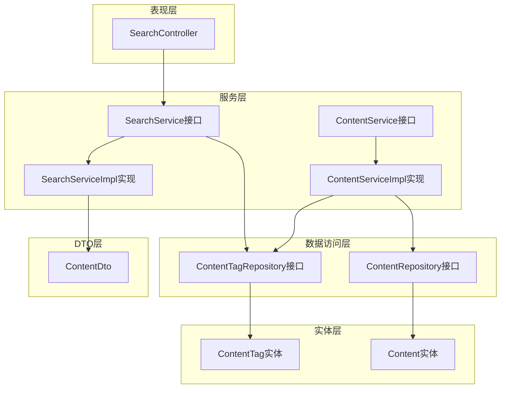
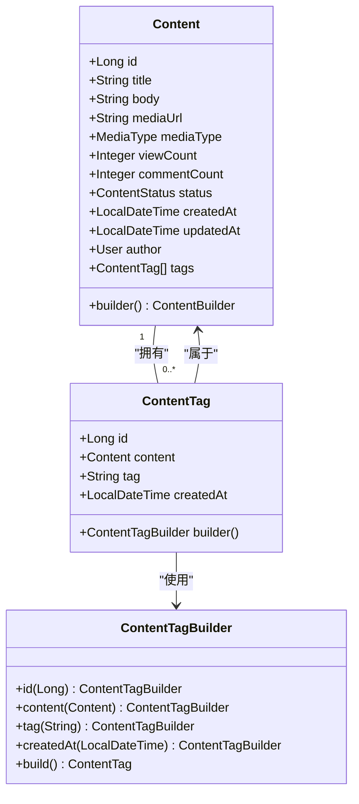
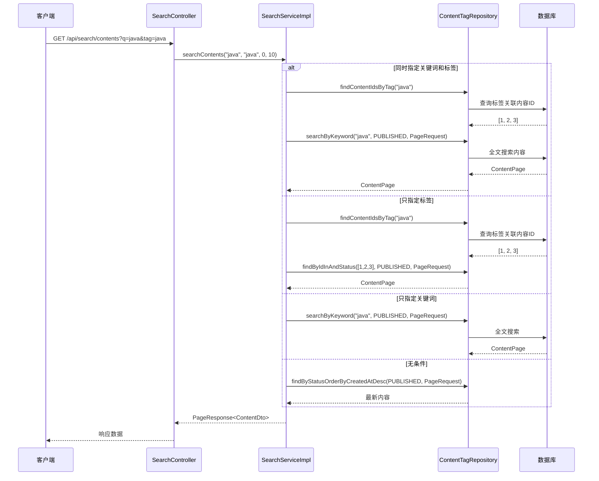
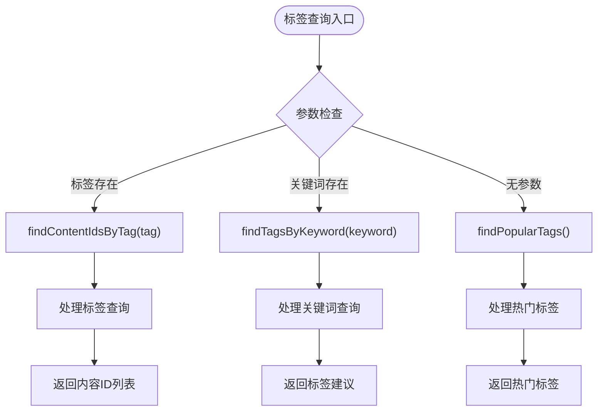
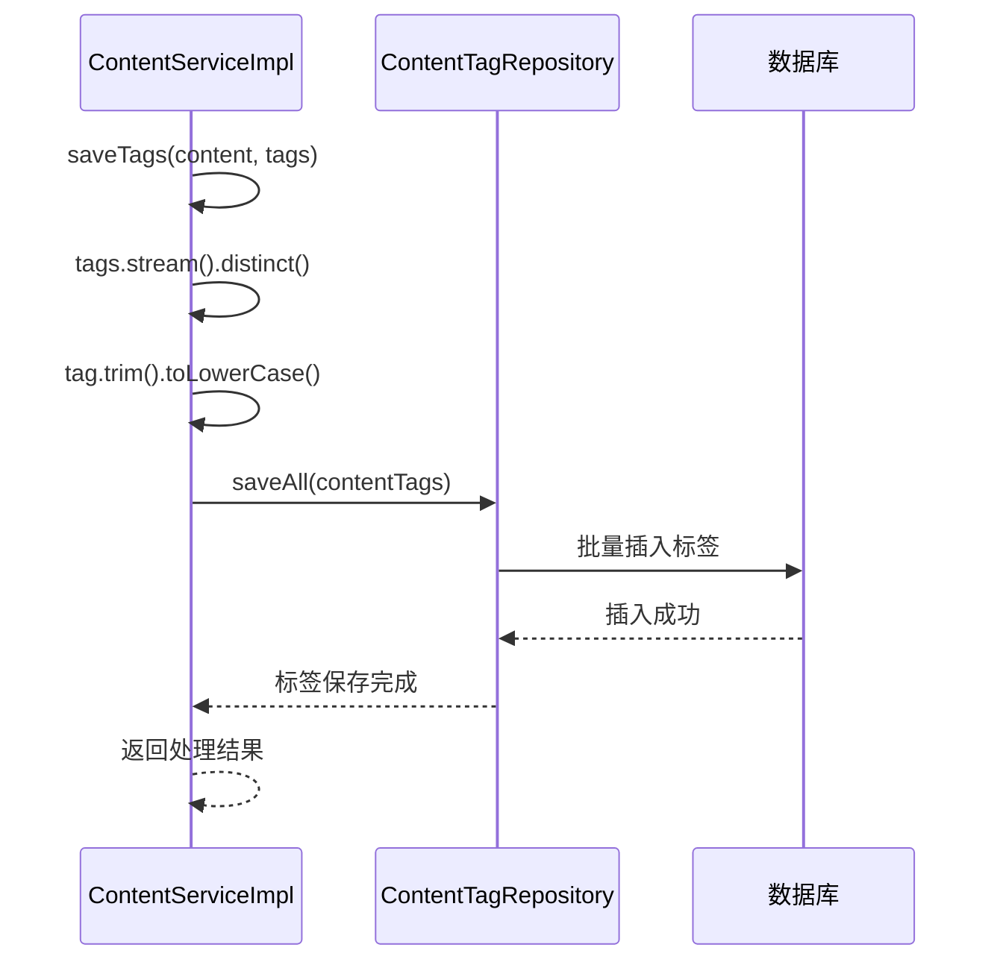
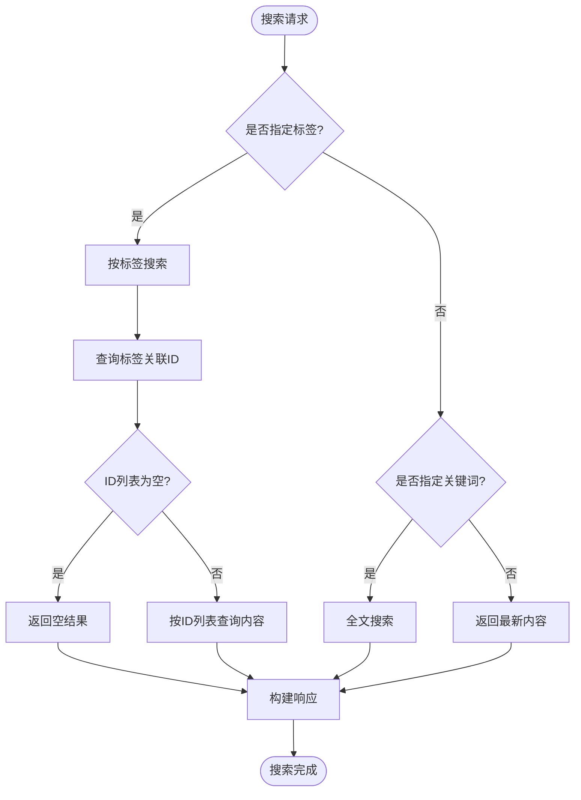
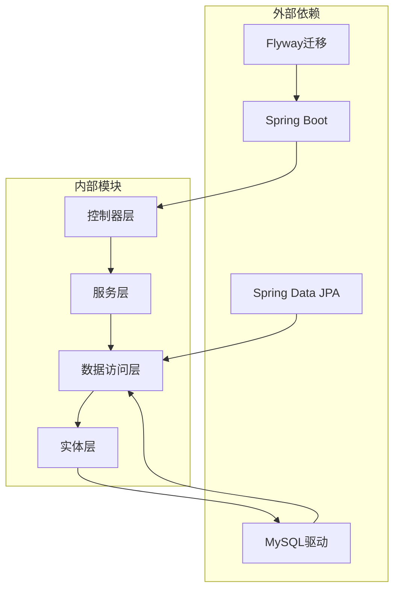
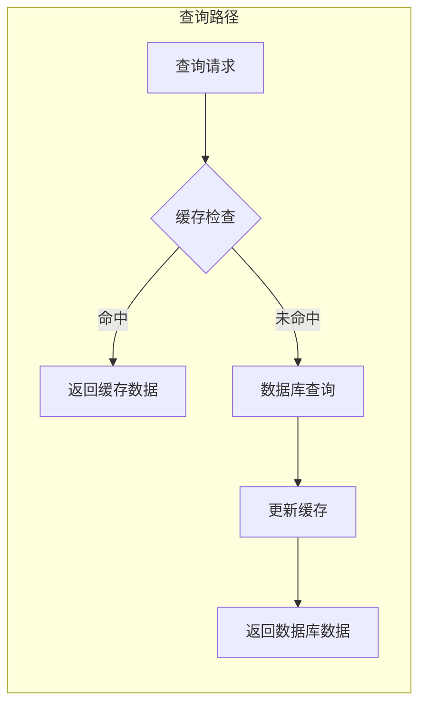

# 内容标签系统

<cite>
**本文档引用的文件**
- [ContentTag.java](file://communication-backend/src/main/java/com/communication/entity/ContentTag.java)
- [Content.java](file://communication-backend/src/main/java/com/communication/entity/Content.java)
- [ContentTagRepository.java](file://communication-backend/src/main/java/com/communication/repository/ContentTagRepository.java)
- [ContentRepository.java](file://communication-backend/src/main/java/com/communication/repository/ContentRepository.java)
- [ContentServiceImpl.java](file://communication-backend/src/main/java/com/communication/service/impl/ContentServiceImpl.java)
- [SearchServiceImpl.java](file://communication-backend/src/main/java/com/communication/service/impl/SearchServiceImpl.java)
- [SearchService.java](file://communication-backend/src/main/java/com/communication/service/SearchService.java)
- [SearchController.java](file://communication-backend/src/main/java/com/communication/controller/SearchController.java)
- [ContentDto.java](file://communication-backend/src/main/java/com/communication/dto/ContentDto.java)
- [V4__create_content_tags.sql](file://communication-backend/src/main/resources/db/migration/V4__create_content_tags.sql)
- [application.yml](file://communication-backend/src/main/resources/application.yml)
</cite>

## 目录
1. [简介](#简介)
2. [项目结构](#项目结构)
3. [核心组件](#核心组件)
4. [架构概览](#架构概览)
5. [详细组件分析](#详细组件分析)
6. [依赖关系分析](#依赖关系分析)
7. [性能考虑](#性能考虑)
8. [故障排除指南](#故障排除指南)
9. [结论](#结论)

## 简介

内容标签系统是通信平台的核心功能模块，负责为内容提供结构化的分类和检索能力。该系统实现了标签与内容之间的一对多关系映射，支持标签的创建、分配、管理和检索功能。系统通过数据库层面的索引优化和业务逻辑层的去重处理，确保了标签系统的高效运行和数据完整性。

## 项目结构

内容标签系统采用典型的分层架构设计，主要包含以下层次：

**图表来源**
- [SearchController.java](file://communication-backend/src/main/java/com/communication/controller/SearchController.java#L1-L56)
- [SearchServiceImpl.java](file://communication-backend/src/main/java/com/communication/service/impl/SearchServiceImpl.java#L1-L129)
- [ContentServiceImpl.java](file://communication-backend/src/main/java/com/communication/service/impl/ContentServiceImpl.java#L1-L199)

**章节来源**
- [SearchController.java](file://communication-backend/src/main/java/com/communication/controller/SearchController.java#L1-L56)
- [SearchServiceImpl.java](file://communication-backend/src/main/java/com/communication/service/impl/SearchServiceImpl.java#L1-L129)
- [ContentServiceImpl.java](file://communication-backend/src/main/java/com/communication/service/impl/ContentServiceImpl.java#L1-L199)

## 核心组件

### 实体模型设计

内容标签系统的核心由两个实体组成：Content（内容）和ContentTag（标签）。这两个实体通过JPA注解建立了清晰的一对多关系映射。

**图表来源**
- [Content.java](file://communication-backend/src/main/java/com/communication/entity/Content.java#L11-L135)
- [ContentTag.java](file://communication-backend/src/main/java/com/communication/entity/ContentTag.java#L7-L66)

### 数据库表结构

系统使用MySQL作为数据存储，通过Flyway进行数据库迁移管理。标签表的设计充分考虑了查询性能和数据完整性。

**章节来源**
- [ContentTag.java](file://communication-backend/src/main/java/com/communication/entity/ContentTag.java#L1-L66)
- [Content.java](file://communication-backend/src/main/java/com/communication/entity/Content.java#L1-L135)
- [V4__create_content_tags.sql](file://communication-backend/src/main/resources/db/migration/V4__create_content_tags.sql#L1-L14)

## 架构概览

内容标签系统采用分层架构，每层都有明确的职责分工：

**图表来源**
- [SearchController.java](file://communication-backend/src/main/java/com/communication/controller/SearchController.java#L23-L31)
- [SearchServiceImpl.java](file://communication-backend/src/main/java/com/communication/service/impl/SearchServiceImpl.java#L34-L66)

**章节来源**
- [SearchController.java](file://communication-backend/src/main/java/com/communication/controller/SearchController.java#L1-L56)
- [SearchServiceImpl.java](file://communication-backend/src/main/java/com/communication/service/impl/SearchServiceImpl.java#L1-L129)

## 详细组件分析

### 标签实体设计

ContentTag实体类实现了标签的核心功能，具有以下特点：

#### 关键属性和约束
- **主键标识**：自增ID确保每个标签记录的唯一性
- **内容关联**：通过外键与Content实体建立一对多关系
- **标签值**：限制长度为50字符，确保标签的简洁性
- **时间戳**：自动记录创建时间，便于统计分析

#### 构建器模式
系统采用Builder模式简化对象创建过程，提供了类型安全的构建方式。

**章节来源**
- [ContentTag.java](file://communication-backend/src/main/java/com/communication/entity/ContentTag.java#L1-L66)

### 标签仓库层

ContentTagRepository接口定义了标签相关的数据访问方法：

#### 核心查询方法

**图表来源**
- [ContentTagRepository.java](file://communication-backend/src/main/java/com/communication/repository/ContentTagRepository.java#L18-L28)

#### 查询优化策略
- **标签搜索**：使用精确匹配查询关联的内容ID
- **关键词建议**：支持模糊匹配的标签建议功能
- **热门标签**：通过GROUP BY和ORDER BY实现高效的统计查询

**章节来源**
- [ContentTagRepository.java](file://communication-backend/src/main/java/com/communication/repository/ContentTagRepository.java#L1-L29)

### 内容服务层

ContentServiceImpl类负责处理内容和标签的业务逻辑：

#### 标签创建和管理流程

**图表来源**
- [ContentServiceImpl.java](file://communication-backend/src/main/java/com/communication/service/impl/ContentServiceImpl.java#L178-L187)

#### 标签去重机制
系统通过Java Stream API的distinct()方法实现标签去重，同时进行字符串标准化处理：
- **去重处理**：使用Stream.distinct()消除重复标签
- **格式标准化**：trim()去除空白字符，toLowerCase()转换为小写
- **持久化存储**：统一格式存储，确保查询一致性

**章节来源**
- [ContentServiceImpl.java](file://communication-backend/src/main/java/com/communication/service/impl/ContentServiceImpl.java#L178-L187)

### 搜索服务层

SearchServiceImpl类实现了标签相关的搜索功能：

#### 多维度搜索策略

**图表来源**
- [SearchServiceImpl.java](file://communication-backend/src/main/java/com/communication/service/impl/SearchServiceImpl.java#L34-L66)

#### 热门标签统计

系统通过SQL聚合查询实现热门标签的实时统计：

**章节来源**
- [SearchServiceImpl.java](file://communication-backend/src/main/java/com/communication/service/impl/SearchServiceImpl.java#L91-L97)

### API接口设计

SearchController提供了完整的标签系统API接口：

#### 核心API端点

| 方法 | 路径 | 参数 | 功能 |
|------|------|------|------|
| GET | `/api/search/contents` | `q`(可选), `tag`(可选), `page`(默认0), `size`(默认10) | 内容搜索，支持关键词和标签过滤 |
| GET | `/api/search/users` | `q`(必需), `page`(默认0), `size`(默认10) | 用户搜索 |
| GET | `/api/search/tags/popular` | `limit`(默认20) | 获取热门标签 |
| GET | `/api/search/tags/suggest` | `q`(必需) | 标签建议 |

**章节来源**
- [SearchController.java](file://communication-backend/src/main/java/com/communication/controller/SearchController.java#L1-L56)

## 依赖关系分析

内容标签系统的依赖关系体现了清晰的分层架构：

**图表来源**
- [application.yml](file://communication-backend/src/main/resources/application.yml#L5-L23)

**章节来源**
- [application.yml](file://communication-backend/src/main/resources/application.yml#L1-L42)

## 性能考虑

### 数据库索引优化

系统通过合理的索引设计提升查询性能：

#### 核心索引策略
- **content_id索引**：加速标签到内容的反向查询
- **tag索引**：优化标签搜索和建议功能
- **组合索引**：为常用查询模式建立优化索引

#### 查询性能优化
- **批量操作**：使用saveAll()减少数据库往返次数
- **懒加载**：ContentTag使用LAZY加载避免不必要的关联查询
- **分页查询**：所有查询都支持分页，防止大数据集查询

### 缓存策略

虽然当前实现未实现应用层缓存，但系统设计已为缓存集成预留了空间：

**章节来源**
- [V4__create_content_tags.sql](file://communication-backend/src/main/resources/db/migration/V4__create_content_tags.sql#L8-L9)

## 故障排除指南

### 常见问题及解决方案

#### 标签重复问题
**症状**：同一标签被重复创建
**原因**：前端未进行去重处理
**解决方案**：系统已在服务层实现去重逻辑，无需前端额外处理

#### 查询性能问题
**症状**：搜索响应缓慢
**可能原因**：
- 缺少必要的数据库索引
- 查询参数不当
- 数据量过大

**解决方案**：
- 确认数据库索引已正确创建
- 使用适当的分页参数
- 考虑添加查询限制

#### 权限验证失败
**症状**：用户无法编辑或删除他人的内容
**原因**：权限检查逻辑
**解决方案**：确保用户身份验证正确传递

**章节来源**
- [ContentServiceImpl.java](file://communication-backend/src/main/java/com/communication/service/impl/ContentServiceImpl.java#L74-L76)

## 结论

内容标签系统通过精心设计的实体关系、完善的业务逻辑和优化的数据库结构，实现了高效的内容分类和检索功能。系统的主要优势包括：

### 设计优势
- **清晰的分层架构**：各层职责明确，便于维护和扩展
- **强类型设计**：使用Builder模式和枚举类型提升代码质量
- **性能优化**：合理的索引设计和查询策略
- **数据完整性**：通过外键约束和业务逻辑确保数据一致性

### 扩展性考虑
- **模块化设计**：易于添加新的标签功能
- **接口抽象**：Repository接口便于替换实现
- **配置灵活**：通过application.yml支持环境配置

### 维护性特点
- **代码规范**：遵循Java最佳实践
- **测试覆盖**：单元测试确保功能稳定性
- **文档完整**：清晰的注释和架构说明

该系统为通信平台提供了坚实的内容组织基础，能够有效支持未来的功能扩展和性能优化需求。