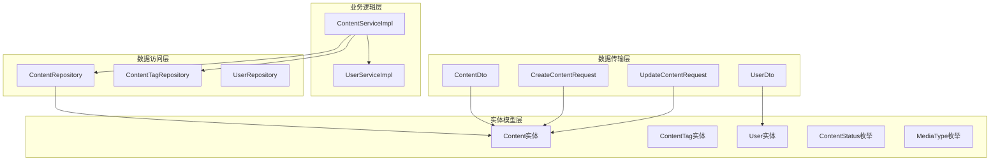
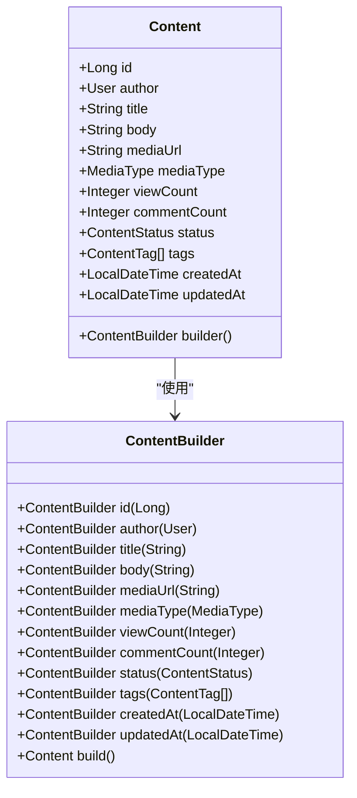
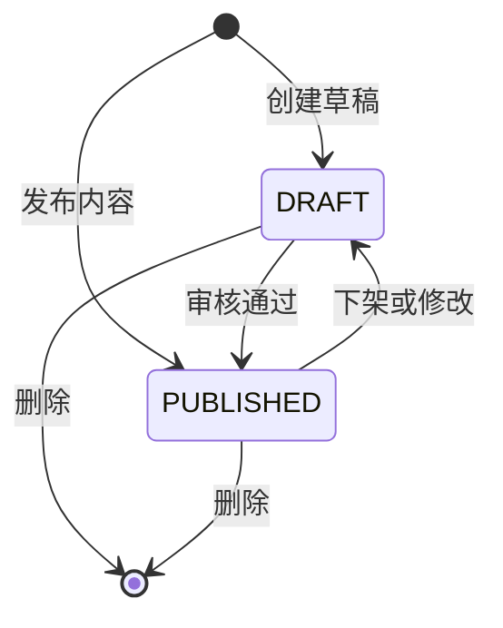
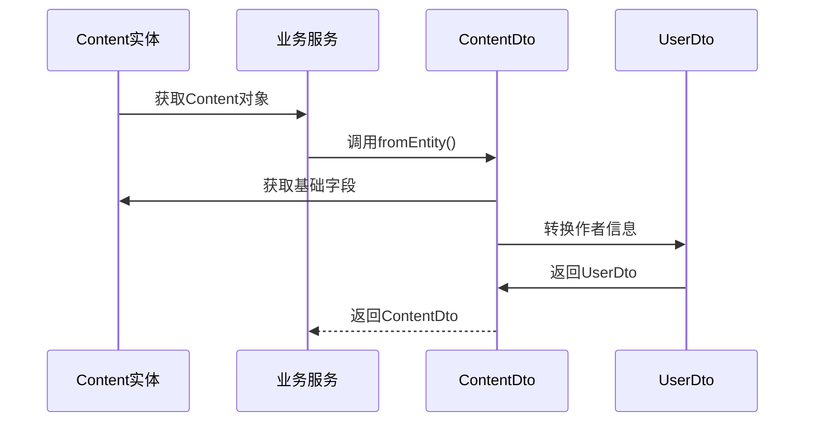
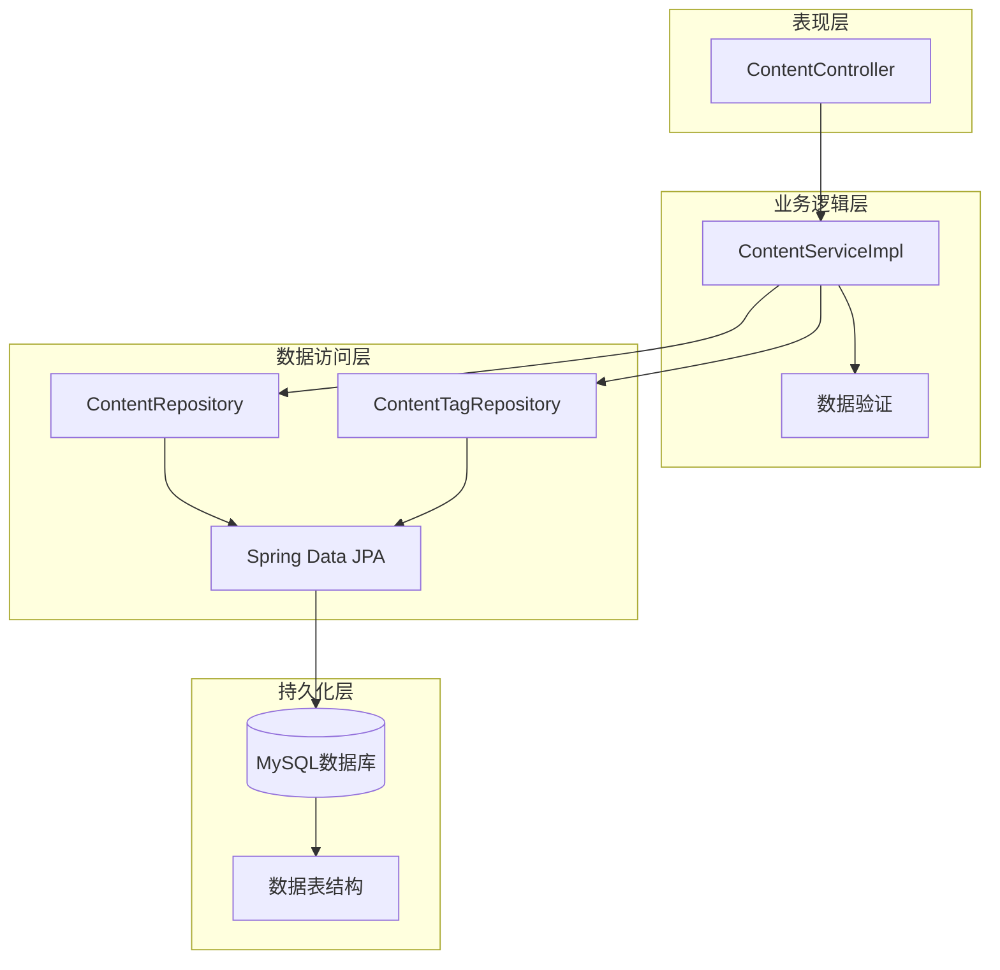
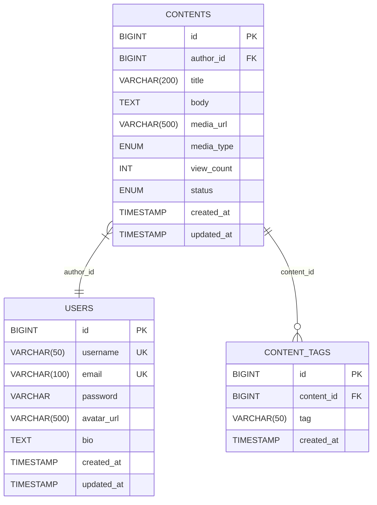
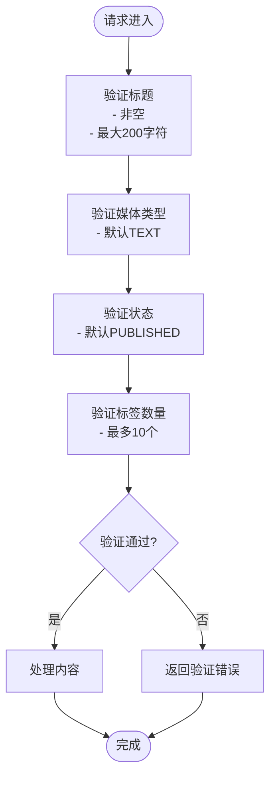
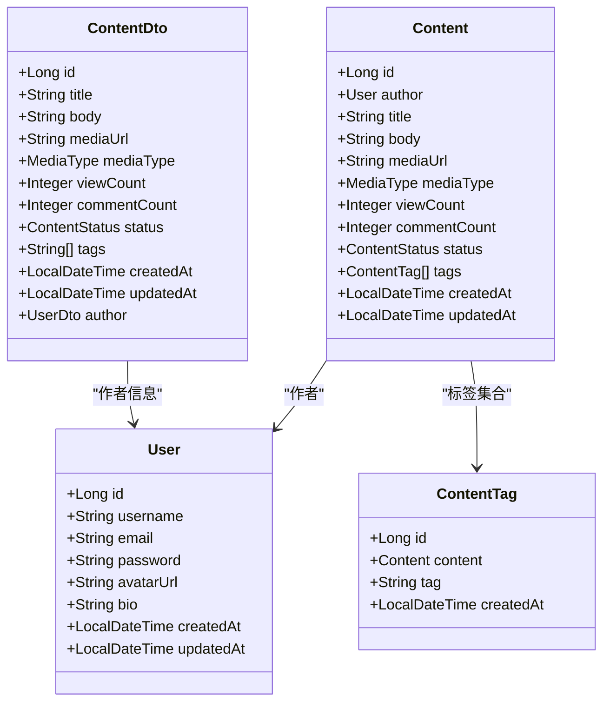
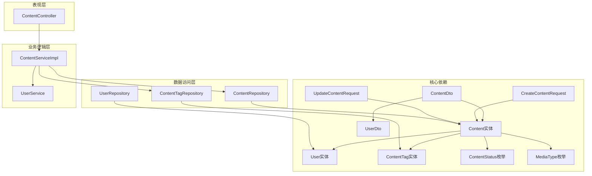

# 内容模型设计

<cite>
**本文档引用的文件**
- [Content.java](file://communication-backend/src/main/java/com/communication/entity/Content.java)
- [ContentStatus.java](file://communication-backend/src/main/java/com/communication/entity/ContentStatus.java)
- [MediaType.java](file://communication-backend/src/main/java/com/communication/entity/MediaType.java)
- [ContentDto.java](file://communication-backend/src/main/java/com/communication/dto/ContentDto.java)
- [User.java](file://communication-backend/src/main/java/com/communication/entity/User.java)
- [ContentTag.java](file://communication-backend/src/main/java/com/communication/entity/ContentTag.java)
- [ContentRepository.java](file://communication-backend/src/main/java/com/communication/repository/ContentRepository.java)
- [V2__create_contents.sql](file://communication-backend/src/main/resources/db/migration/V2__create_contents.sql)
- [V4__create_content_tags.sql](file://communication-backend/src/main/resources/db/migration/V4__create_content_tags.sql)
- [ContentServiceImpl.java](file://communication-backend/src/main/java/com/communication/service/impl/ContentServiceImpl.java)
- [CreateContentRequest.java](file://communication-backend/src/main/java/com/communication/dto/CreateContentRequest.java)
- [UpdateContentRequest.java](file://communication-backend/src/main/java/com/communication/dto/UpdateContentRequest.java)
- [UserDto.java](file://communication-backend/src/main/java/com/communication/dto/UserDto.java)
</cite>

## 目录
1. [简介](#简介)
2. [项目结构](#项目结构)
3. [核心组件](#核心组件)
4. [架构概览](#架构概览)
5. [详细组件分析](#详细组件分析)
6. [依赖关系分析](#依赖关系分析)
7. [性能考虑](#性能考虑)
8. [故障排除指南](#故障排除指南)
9. [结论](#结论)

## 简介

本文件为内容模型设计的详细数据模型文档，深入分析了内容系统的实体设计、状态管理和数据传输对象。内容模型涵盖了文本、图片、视频等多种媒体类型的统一管理，支持标签系统、作者关联和全文搜索功能。本文档将详细说明Content实体类的设计、ContentStatus枚举的状态管理机制、MediaType枚举的多媒体内容分类支持，以及ContentDto数据传输对象的设计规范。

## 项目结构

内容模型位于通信应用的后端模块中，采用标准的分层架构设计：

**图表来源**
- [Content.java](file://communication-backend/src/main/java/com/communication/entity/Content.java#L11-L135)
- [ContentRepository.java](file://communication-backend/src/main/java/com/communication/repository/ContentRepository.java#L16-L55)
- [ContentServiceImpl.java](file://communication-backend/src/main/java/com/communication/service/impl/ContentServiceImpl.java#L24-L34)

**章节来源**
- [Content.java](file://communication-backend/src/main/java/com/communication/entity/Content.java#L1-L135)
- [ContentRepository.java](file://communication-backend/src/main/java/com/communication/repository/ContentRepository.java#L1-L56)

## 核心组件

### Content实体类设计

Content实体是内容管理系统的核心，负责存储文章、图片、视频等各种类型的内容信息。

#### 字段定义与数据类型

| 字段名 | 类型 | 约束条件 | 描述 |
|--------|------|----------|------|
| id | Long | 主键, 自增 | 内容唯一标识符 |
| author | User | 外键, 非空 | 作者关联 |
| title | String | 非空, 最大200字符 | 内容标题 |
| body | String | TEXT类型 | 内容正文 |
| mediaUrl | String | 最大500字符 | 媒体资源URL |
| mediaType | MediaType | 非空, 默认TEXT | 媒体类型枚举 |
| viewCount | Integer | 默认0 | 浏览计数 |
| commentCount | Integer | 默认0 | 评论计数 |
| status | ContentStatus | 非空, 默认PUBLISHED | 内容状态 |
| tags | List<ContentTag> | 关联集合 | 标签列表 |
| createdAt | LocalDateTime | 只读 | 创建时间 |
| updatedAt | LocalDateTime | 更新时间戳 |

#### 构建器模式设计

Content类实现了Builder模式，提供链式配置能力：

**图表来源**
- [Content.java](file://communication-backend/src/main/java/com/communication/entity/Content.java#L103-L133)

**章节来源**
- [Content.java](file://communication-backend/src/main/java/com/communication/entity/Content.java#L13-L135)

### ContentStatus枚举状态管理

ContentStatus枚举定义了内容的生命周期状态：

**图表来源**
- [ContentStatus.java](file://communication-backend/src/main/java/com/communication/entity/ContentStatus.java#L3-L6)

#### 状态业务含义

- **DRAFT（草稿）**：内容处于编辑状态，仅作者可见，不参与公开展示
- **PUBLISHED（已发布）**：内容已审核通过，对所有用户开放

**章节来源**
- [ContentStatus.java](file://communication-backend/src/main/java/com/communication/entity/ContentStatus.java#L1-L7)

### MediaType枚举多媒体分类

MediaType枚举支持三种基本媒体类型：

| 枚举值 | 描述 | 使用场景 |
|--------|------|----------|
| TEXT | 文本内容 | 纯文字文章 |
| IMAGE | 图片内容 | 图片上传和展示 |
| VIDEO | 视频内容 | 视频文件处理 |

**章节来源**
- [MediaType.java](file://communication-backend/src/main/java/com/communication/entity/MediaType.java#L1-L8)

### ContentDto数据传输对象

ContentDto作为数据传输对象，负责在不同层之间传递内容信息：

#### 字段映射关系

| DTO字段 | 实体字段 | 映射方式 |
|---------|----------|----------|
| id | Content.id | 直接映射 |
| title | Content.title | 直接映射 |
| body | Content.body | 直接映射 |
| mediaUrl | Content.mediaUrl | 直接映射 |
| mediaType | Content.mediaType | 直接映射 |
| viewCount | Content.viewCount | 直接映射 |
| commentCount | Content.commentCount | 直接映射 |
| status | Content.status | 直接映射 |
| tags | ContentTag.tag | 聚合查询 |
| createdAt | Content.createdAt | 直接映射 |
| updatedAt | Content.updatedAt | 直接映射 |
| author | User | UserDto转换 |

#### 序列化规则

ContentDto实现了fromEntity静态方法，用于从实体对象转换为DTO对象：

**图表来源**
- [ContentDto.java](file://communication-backend/src/main/java/com/communication/dto/ContentDto.java#L68-L82)

**章节来源**
- [ContentDto.java](file://communication-backend/src/main/java/com/communication/dto/ContentDto.java#L10-L118)

## 架构概览

内容模型采用经典的三层架构设计，确保关注点分离和代码可维护性：

**图表来源**
- [ContentServiceImpl.java](file://communication-backend/src/main/java/com/communication/service/impl/ContentServiceImpl.java#L24-L34)
- [ContentRepository.java](file://communication-backend/src/main/java/com/communication/repository/ContentRepository.java#L16-L55)

## 详细组件分析

### 数据库表结构设计

#### contents表结构

基于Flyway迁移脚本，contents表具有以下设计特点：

**图表来源**
- [V2__create_contents.sql](file://communication-backend/src/main/resources/db/migration/V2__create_contents.sql#L2-L18)
- [V4__create_content_tags.sql](file://communication-backend/src/main/resources/db/migration/V4__create_content_tags.sql#L2-L10)

#### 索引设计策略

数据库为提高查询性能设计了多种索引：

| 索引类型 | 字段组合 | 用途 | 性能影响 |
|----------|----------|------|----------|
| 主键索引 | id | 唯一标识 | O(log n) |
| 外键索引 | author_id | 作者查询 | O(log n) |
| 单列索引 | status | 状态过滤 | O(log n) |
| 单列索引 | created_at | 时间排序 | O(log n) |
| 全文索引 | title, body | 搜索功能 | O(n) |
| 复合索引 | (content_id, tag) | 标签查询 | O(log n) |

**章节来源**
- [V2__create_contents.sql](file://communication-backend/src/main/resources/db/migration/V2__create_contents.sql#L13-L18)
- [V4__create_content_tags.sql](file://communication-backend/src/main/resources/db/migration/V4__create_content_tags.sql#L7-L10)

### 业务规则与验证

#### 数据验证规则

CreateContentRequest和UpdateContentRequest提供了完整的输入验证：

**图表来源**
- [CreateContentRequest.java](file://communication-backend/src/main/java/com/communication/dto/CreateContentRequest.java#L12-L25)
- [UpdateContentRequest.java](file://communication-backend/src/main/java/com/communication/dto/UpdateContentRequest.java#L11-L23)

#### 业务规则实现

ContentServiceImpl实现了关键的业务逻辑：

1. **权限控制**：只允许内容作者修改或删除自己的内容
2. **标签管理**：支持标签的创建、更新和删除操作
3. **状态管理**：根据请求动态更新内容状态
4. **视图计数**：提供独立的视图计数递增功能

**章节来源**
- [ContentServiceImpl.java](file://communication-backend/src/main/java/com/communication/service/impl/ContentServiceImpl.java#L74-L76)
- [ContentServiceImpl.java](file://communication-backend/src/main/java/com/communication/service/impl/ContentServiceImpl.java#L94-L100)

### 关系映射分析

#### 实体关系图

**图表来源**
- [Content.java](file://communication-backend/src/main/java/com/communication/entity/Content.java#L19-L47)
- [User.java](file://communication-backend/src/main/java/com/communication/entity/User.java#L13-L51)
- [ContentTag.java](file://communication-backend/src/main/java/com/communication/entity/ContentTag.java#L15-L20)
- [ContentDto.java](file://communication-backend/src/main/java/com/communication/dto/ContentDto.java#L22-L81)

#### 查询接口设计

ContentRepository提供了丰富的查询接口：

| 方法名 | 功能描述 | 查询条件 | 返回类型 |
|--------|----------|----------|----------|
| findByStatusOrderByCreatedAtDesc | 按状态查询并按时间排序 | status | Page<Content> |
| findByAuthorIdAndStatusOrderByCreatedAtDesc | 按作者和状态查询 | authorId, status | Page<Content> |
| findByIdAndStatus | 按ID和状态查询 | id, status | Optional<Content> |
| searchByKeyword | 关键词搜索 | keyword, status | Page<Content> |
| incrementViewCount | 视图计数递增 | id | void |

**章节来源**
- [ContentRepository.java](file://communication-backend/src/main/java/com/communication/repository/ContentRepository.java#L19-L54)

## 依赖关系分析

### 组件耦合度分析

**图表来源**
- [Content.java](file://communication-backend/src/main/java/com/communication/entity/Content.java#L19-L47)
- [ContentDto.java](file://communication-backend/src/main/java/com/communication/dto/ContentDto.java#L22-L81)
- [ContentServiceImpl.java](file://communication-backend/src/main/java/com/communication/service/impl/ContentServiceImpl.java#L30-L34)

### 循环依赖检测

经过分析，系统中不存在循环依赖：
- 实体层相互引用但无循环
- DTO层仅作为数据传输对象
- 服务层通过接口解耦
- 控制器层依赖服务接口

**章节来源**
- [Content.java](file://communication-backend/src/main/java/com/communication/entity/Content.java#L1-L135)
- [ContentDto.java](file://communication-backend/src/main/java/com/communication/dto/ContentDto.java#L1-L118)

## 性能考虑

### 查询性能优化

1. **索引策略**
   - 在author_id上建立索引以支持作者查询
   - 在status上建立索引以支持状态过滤
   - 在created_at上建立索引以支持时间排序
   - 使用全文索引支持标题和正文的快速搜索

2. **查询优化**
   - 使用分页查询避免大量数据加载
   - 通过投影查询减少不必要的字段传输
   - 合理使用JOIN操作避免N+1查询问题

3. **缓存策略**
   - 对热门内容设置适当的缓存策略
   - 使用Redis缓存热点数据
   - 实现缓存失效机制

### 存储优化

1. **数据类型选择**
   - 使用VARCHAR(200)存储标题，平衡空间和性能
   - 使用TEXT类型存储正文内容
   - 使用ENUM类型存储状态和媒体类型，节省存储空间

2. **索引设计**
   - 复合索引优化常用查询模式
   - 全文索引提升搜索性能
   - 外键索引保证数据完整性

## 故障排除指南

### 常见问题及解决方案

#### 数据验证错误

**问题**：创建内容时出现验证错误
**原因**：标题为空或超过长度限制
**解决方案**：检查CreateContentRequest的验证注解配置

#### 权限验证失败

**问题**：更新或删除内容时报错
**原因**：当前用户不是内容作者
**解决方案**：确认用户认证状态和内容所有权

#### 数据库约束冲突

**问题**：插入数据时出现约束错误
**原因**：外键约束或唯一约束冲突
**解决方案**：检查关联实体是否存在且唯一性约束

#### 查询性能问题

**问题**：查询响应时间过长
**原因**：缺少必要的索引或查询条件不当
**解决方案**：分析执行计划，添加适当索引

**章节来源**
- [ContentServiceImpl.java](file://communication-backend/src/main/java/com/communication/service/impl/ContentServiceImpl.java#L74-L76)
- [ContentRepository.java](file://communication-backend/src/main/java/com/communication/repository/ContentRepository.java#L25-L26)

## 结论

内容模型设计遵循了良好的软件工程原则，具有以下特点：

1. **清晰的职责分离**：实体、DTO、Repository和服务层职责明确
2. **灵活的扩展性**：枚举类型支持未来状态和媒体类型的扩展
3. **完善的验证机制**：从输入到业务逻辑的多层次验证
4. **高性能的数据库设计**：合理的索引策略和查询优化
5. **安全的权限控制**：基于用户身份的内容访问控制

该设计为内容管理系统提供了坚实的基础，能够支持文本、图片、视频等多种媒体类型的统一管理，并具备良好的可维护性和扩展性。