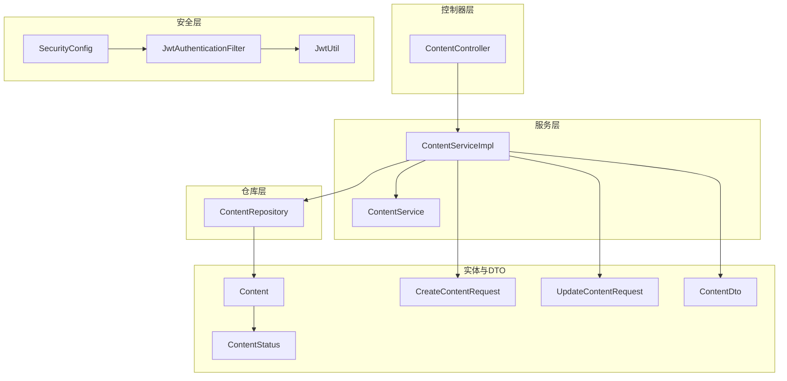
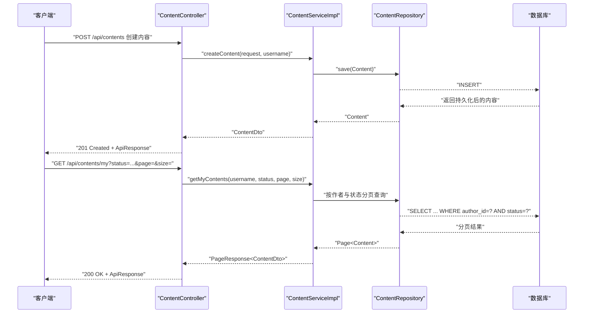
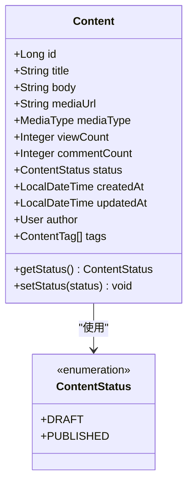
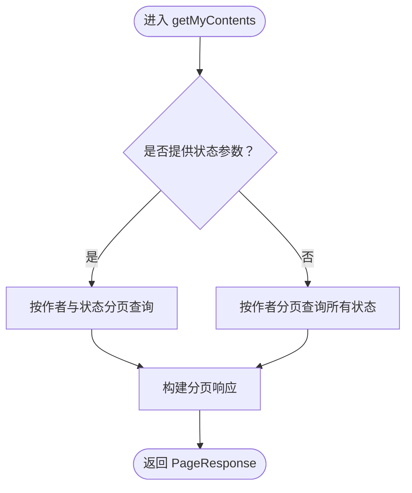
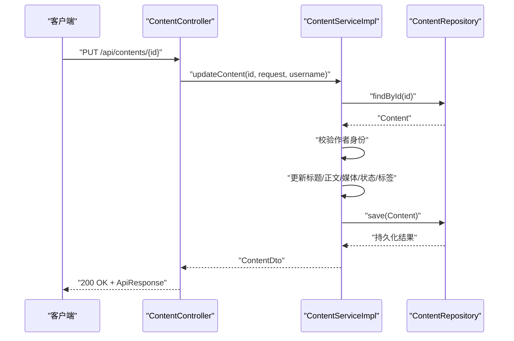
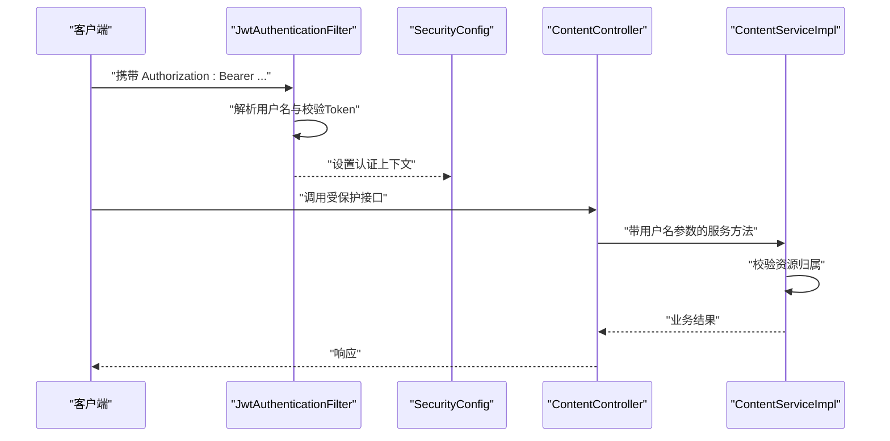
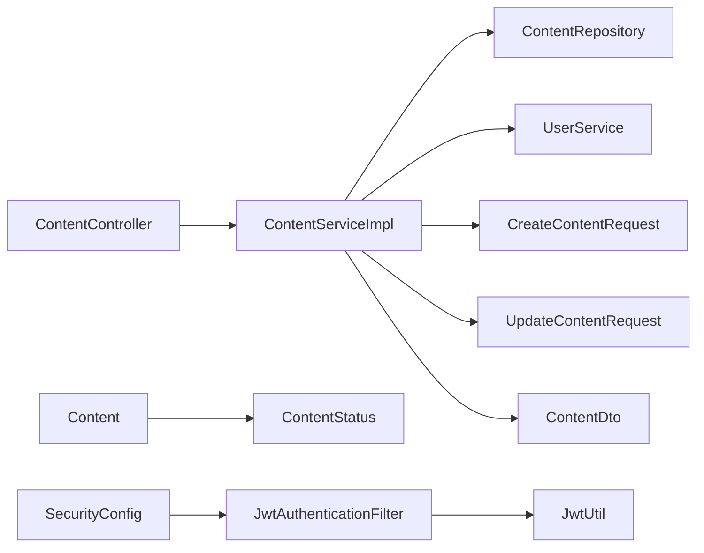

# 内容状态管理

<cite>
**本文档引用的文件**
- [ContentStatus.java](file://communication-backend/src/main/java/com/communication/entity/ContentStatus.java)
- [Content.java](file://communication-backend/src/main/java/com/communication/entity/Content.java)
- [ContentController.java](file://communication-backend/src/main/java/com/communication/controller/ContentController.java)
- [ContentService.java](file://communication-backend/src/main/java/com/communication/service/ContentService.java)
- [ContentServiceImpl.java](file://communication-backend/src/main/java/com/communication/service/impl/ContentServiceImpl.java)
- [ContentRepository.java](file://communication-backend/src/main/java/com/communication/repository/ContentRepository.java)
- [CreateContentRequest.java](file://communication-backend/src/main/java/com/communication/dto/CreateContentRequest.java)
- [UpdateContentRequest.java](file://communication-backend/src/main/java/com/communication/dto/UpdateContentRequest.java)
- [ContentDto.java](file://communication-backend/src/main/java/com/communication/dto/ContentDto.java)
- [V2__create_contents.sql](file://communication-backend/src/main/resources/db/migration/V2__create_contents.sql)
- [SecurityConfig.java](file://communication-backend/src/main/java/com/communication/config/SecurityConfig.java)
- [JwtAuthenticationFilter.java](file://communication-backend/src/main/java/com/communication/config/JwtAuthenticationFilter.java)
- [JwtUtil.java](file://communication-backend/src/main/java/com/communication/util/JwtUtil.java)
</cite>

## 目录
1. [简介](#简介)
2. [项目结构](#项目结构)
3. [核心组件](#核心组件)
4. [架构总览](#架构总览)
5. [详细组件分析](#详细组件分析)
6. [依赖关系分析](#依赖关系分析)
7. [性能考量](#性能考量)
8. [故障排查指南](#故障排查指南)
9. [结论](#结论)
10. [附录](#附录)

## 简介
本文件聚焦于内容状态管理功能，围绕 ContentStatus 枚举及其在系统中的业务含义、状态流转规则、查询与筛选能力、权限控制与安全性保障进行深入解析。当前系统支持两种内容状态：草稿（DRAFT）与已发布（PUBLISHED）。系统通过控制器、服务层与仓库层协作，实现内容的创建、更新、删除、查询以及按作者与状态筛选的能力，并在安全配置中确保只有认证用户可访问受保护接口。

## 项目结构
后端采用分层架构，状态管理涉及以下关键模块：
- 实体层：定义内容实体与状态枚举
- DTO 层：封装请求与响应数据结构
- 控制器层：对外暴露 REST 接口
- 服务层：编排业务逻辑与权限校验
- 仓库层：数据库访问与查询
- 安全层：基于 JWT 的认证与授权配置

**图表来源**
- [ContentController.java](file://communication-backend/src/main/java/com/communication/controller/ContentController.java#L1-L85)
- [ContentServiceImpl.java](file://communication-backend/src/main/java/com/communication/service/impl/ContentServiceImpl.java#L1-L199)
- [ContentRepository.java](file://communication-backend/src/main/java/com/communication/repository/ContentRepository.java#L1-L56)
- [Content.java](file://communication-backend/src/main/java/com/communication/entity/Content.java#L1-L135)
- [ContentStatus.java](file://communication-backend/src/main/java/com/communication/entity/ContentStatus.java#L1-L7)
- [CreateContentRequest.java](file://communication-backend/src/main/java/com/communication/dto/CreateContentRequest.java#L1-L42)
- [UpdateContentRequest.java](file://communication-backend/src/main/java/com/communication/dto/UpdateContentRequest.java#L1-L40)
- [ContentDto.java](file://communication-backend/src/main/java/com/communication/dto/ContentDto.java#L1-L118)
- [SecurityConfig.java](file://communication-backend/src/main/java/com/communication/config/SecurityConfig.java#L1-L89)
- [JwtAuthenticationFilter.java](file://communication-backend/src/main/java/com/communication/config/JwtAuthenticationFilter.java#L1-L69)
- [JwtUtil.java](file://communication-backend/src/main/java/com/communication/util/JwtUtil.java#L1-L67)

**章节来源**
- [ContentController.java](file://communication-backend/src/main/java/com/communication/controller/ContentController.java#L1-L85)
- [ContentServiceImpl.java](file://communication-backend/src/main/java/com/communication/service/impl/ContentServiceImpl.java#L1-L199)
- [ContentRepository.java](file://communication-backend/src/main/java/com/communication/repository/ContentRepository.java#L1-L56)
- [Content.java](file://communication-backend/src/main/java/com/communication/entity/Content.java#L1-L135)
- [ContentStatus.java](file://communication-backend/src/main/java/com/communication/entity/ContentStatus.java#L1-L7)
- [CreateContentRequest.java](file://communication-backend/src/main/java/com/communication/dto/CreateContentRequest.java#L1-L42)
- [UpdateContentRequest.java](file://communication-backend/src/main/java/com/communication/dto/UpdateContentRequest.java#L1-L40)
- [ContentDto.java](file://communication-backend/src/main/java/com/communication/dto/ContentDto.java#L1-L118)
- [SecurityConfig.java](file://communication-backend/src/main/java/com/communication/config/SecurityConfig.java#L1-L89)
- [JwtAuthenticationFilter.java](file://communication-backend/src/main/java/com/communication/config/JwtAuthenticationFilter.java#L1-L69)
- [JwtUtil.java](file://communication-backend/src/main/java/com/communication/util/JwtUtil.java#L1-L67)

## 核心组件
- 状态枚举：定义内容状态集合，当前包含草稿与已发布两类。
- 内容实体：持久化存储内容信息，包含状态字段与时间戳。
- 控制器：提供内容创建、查询、更新、删除与按作者/状态筛选的接口。
- 服务实现：执行业务逻辑、权限校验与状态更新；提供分页查询与视图计数递增。
- 仓库接口：基于 Spring Data JPA 提供按状态、作者与关键词搜索等查询方法。
- 请求与响应 DTO：封装创建、更新与返回的数据结构，包含状态字段。
- 安全配置：基于 JWT 的无状态认证，限制受保护接口需要认证。

**章节来源**
- [ContentStatus.java](file://communication-backend/src/main/java/com/communication/entity/ContentStatus.java#L1-L7)
- [Content.java](file://communication-backend/src/main/java/com/communication/entity/Content.java#L1-L135)
- [ContentController.java](file://communication-backend/src/main/java/com/communication/controller/ContentController.java#L1-L85)
- [ContentServiceImpl.java](file://communication-backend/src/main/java/com/communication/service/impl/ContentServiceImpl.java#L1-L199)
- [ContentRepository.java](file://communication-backend/src/main/java/com/communication/repository/ContentRepository.java#L1-L56)
- [CreateContentRequest.java](file://communication-backend/src/main/java/com/communication/dto/CreateContentRequest.java#L1-L42)
- [UpdateContentRequest.java](file://communication-backend/src/main/java/com/communication/dto/UpdateContentRequest.java#L1-L40)
- [ContentDto.java](file://communication-backend/src/main/java/com/communication/dto/ContentDto.java#L1-L118)
- [SecurityConfig.java](file://communication-backend/src/main/java/com/communication/config/SecurityConfig.java#L1-L89)

## 架构总览
下图展示了内容状态管理在系统中的整体交互流程：客户端通过控制器发起请求，服务层进行权限校验与业务处理，仓库层访问数据库，最终返回结果。

**图表来源**
- [ContentController.java](file://communication-backend/src/main/java/com/communication/controller/ContentController.java#L23-L83)
- [ContentServiceImpl.java](file://communication-backend/src/main/java/com/communication/service/impl/ContentServiceImpl.java#L36-L154)
- [ContentRepository.java](file://communication-backend/src/main/java/com/communication/repository/ContentRepository.java#L19-L26)

**章节来源**
- [ContentController.java](file://communication-backend/src/main/java/com/communication/controller/ContentController.java#L1-L85)
- [ContentServiceImpl.java](file://communication-backend/src/main/java/com/communication/service/impl/ContentServiceImpl.java#L1-L199)
- [ContentRepository.java](file://communication-backend/src/main/java/com/communication/repository/ContentRepository.java#L1-L56)

## 详细组件分析

### 状态枚举与实体映射
- 状态枚举：定义了 DRAFT 与 PUBLISHED 两个状态值。
- 实体映射：内容实体使用字符串形式存储状态，默认值为已发布。
- 数据库迁移：contents 表中 status 字段为枚类型，默认值为已发布，并建立索引以优化查询。

**图表来源**
- [ContentStatus.java](file://communication-backend/src/main/java/com/communication/entity/ContentStatus.java#L3-L6)
- [Content.java](file://communication-backend/src/main/java/com/communication/entity/Content.java#L42-L44)

**章节来源**
- [ContentStatus.java](file://communication-backend/src/main/java/com/communication/entity/ContentStatus.java#L1-L7)
- [Content.java](file://communication-backend/src/main/java/com/communication/entity/Content.java#L1-L135)
- [V2__create_contents.sql](file://communication-backend/src/main/resources/db/migration/V2__create_contents.sql#L10-L10)

### 状态查询与筛选
- 已发布内容列表：控制器提供公开接口，服务层按已发布状态进行分页查询。
- 按作者筛选：服务层提供按作者 ID 与状态查询的方法。
- 个人内容筛选：控制器支持传入状态参数，服务层根据是否提供状态决定查询策略。
- 关键词搜索：仓库层提供基于标题与正文的全文检索，限定状态参与过滤。

**图表来源**
- [ContentController.java](file://communication-backend/src/main/java/com/communication/controller/ContentController.java#L74-L83)
- [ContentServiceImpl.java](file://communication-backend/src/main/java/com/communication/service/impl/ContentServiceImpl.java#L139-L154)
- [ContentRepository.java](file://communication-backend/src/main/java/com/communication/repository/ContentRepository.java#L19-L26)

**章节来源**
- [ContentController.java](file://communication-backend/src/main/java/com/communication/controller/ContentController.java#L33-L83)
- [ContentServiceImpl.java](file://communication-backend/src/main/java/com/communication/service/impl/ContentServiceImpl.java#L119-L154)
- [ContentRepository.java](file://communication-backend/src/main/java/com/communication/repository/ContentRepository.java#L19-L54)

### 状态变更与业务逻辑
- 创建内容：请求 DTO 支持设置状态，默认值为已发布；服务层保存内容并处理标签。
- 更新内容：请求 DTO 支持更新状态；服务层校验内容归属，仅作者本人可修改。
- 删除内容：服务层校验归属，仅作者本人可删除。
- 视图计数：服务层提供视图计数递增方法，仓库层通过原生 SQL 执行更新。

**图表来源**
- [ContentController.java](file://communication-backend/src/main/java/com/communication/controller/ContentController.java#L48-L55)
- [ContentServiceImpl.java](file://communication-backend/src/main/java/com/communication/service/impl/ContentServiceImpl.java#L68-L104)
- [UpdateContentRequest.java](file://communication-backend/src/main/java/com/communication/dto/UpdateContentRequest.java#L20-L20)

**章节来源**
- [CreateContentRequest.java](file://communication-backend/src/main/java/com/communication/dto/CreateContentRequest.java#L22-L22)
- [UpdateContentRequest.java](file://communication-backend/src/main/java/com/communication/dto/UpdateContentRequest.java#L1-L40)
- [ContentServiceImpl.java](file://communication-backend/src/main/java/com/communication/service/impl/ContentServiceImpl.java#L36-L104)
- [ContentRepository.java](file://communication-backend/src/main/java/com/communication/repository/ContentRepository.java#L28-L30)

### 权限控制与安全性
- 认证机制：基于 JWT 的无状态认证，过滤器从 Authorization 头提取 Bearer Token 并注入安全上下文。
- 授权策略：安全配置中，公开接口允许未认证访问，其余接口均需认证；控制器通过 @AuthenticationPrincipal 获取当前用户名。
- 资源访问控制：服务层在更新与删除时校验内容作者身份，防止越权操作。

**图表来源**
- [JwtAuthenticationFilter.java](file://communication-backend/src/main/java/com/communication/config/JwtAuthenticationFilter.java#L32-L67)
- [SecurityConfig.java](file://communication-backend/src/main/java/com/communication/config/SecurityConfig.java#L66-L84)
- [ContentController.java](file://communication-backend/src/main/java/com/communication/controller/ContentController.java#L23-L63)
- [ContentServiceImpl.java](file://communication-backend/src/main/java/com/communication/service/impl/ContentServiceImpl.java#L74-L116)

**章节来源**
- [JwtAuthenticationFilter.java](file://communication-backend/src/main/java/com/communication/config/JwtAuthenticationFilter.java#L1-L69)
- [SecurityConfig.java](file://communication-backend/src/main/java/com/communication/config/SecurityConfig.java#L1-L89)
- [ContentController.java](file://communication-backend/src/main/java/com/communication/controller/ContentController.java#L1-L85)
- [ContentServiceImpl.java](file://communication-backend/src/main/java/com/communication/service/impl/ContentServiceImpl.java#L68-L116)

### 日志记录与审计
- 当前代码库未发现专门的状态变更日志或审计表结构。建议在状态变更处增加审计记录（如创建审计事件、写入审计表），以便追踪状态变化的时间、操作者与原因。
- 可结合现有实体与仓库层扩展审计能力，例如在服务层的状态更新前后记录变更详情。

**章节来源**
- [ContentServiceImpl.java](file://communication-backend/src/main/java/com/communication/service/impl/ContentServiceImpl.java#L90-L92)
- [ContentRepository.java](file://communication-backend/src/main/java/com/communication/repository/ContentRepository.java#L25-L26)

## 依赖关系分析
- 控制器依赖服务接口，服务实现依赖仓库接口与用户服务。
- 实体与 DTO 之间通过静态工厂方法相互转换，避免直接耦合。
- 仓库接口基于 Spring Data JPA，提供多种按状态与作者的查询方法。
- 安全配置与 JWT 过滤器共同保证接口访问的安全性。

**图表来源**
- [ContentController.java](file://communication-backend/src/main/java/com/communication/controller/ContentController.java#L17-L21)
- [ContentServiceImpl.java](file://communication-backend/src/main/java/com/communication/service/impl/ContentServiceImpl.java#L26-L34)
- [ContentRepository.java](file://communication-backend/src/main/java/com/communication/repository/ContentRepository.java#L1-L16)
- [Content.java](file://communication-backend/src/main/java/com/communication/entity/Content.java#L1-L135)
- [ContentStatus.java](file://communication-backend/src/main/java/com/communication/entity/ContentStatus.java#L1-L7)
- [SecurityConfig.java](file://communication-backend/src/main/java/com/communication/config/SecurityConfig.java#L66-L84)
- [JwtAuthenticationFilter.java](file://communication-backend/src/main/java/com/communication/config/JwtAuthenticationFilter.java#L20-L29)
- [JwtUtil.java](file://communication-backend/src/main/java/com/communication/util/JwtUtil.java#L14-L26)

**章节来源**
- [ContentController.java](file://communication-backend/src/main/java/com/communication/controller/ContentController.java#L1-L85)
- [ContentServiceImpl.java](file://communication-backend/src/main/java/com/communication/service/impl/ContentServiceImpl.java#L1-L199)
- [ContentRepository.java](file://communication-backend/src/main/java/com/communication/repository/ContentRepository.java#L1-L56)
- [Content.java](file://communication-backend/src/main/java/com/communication/entity/Content.java#L1-L135)
- [ContentStatus.java](file://communication-backend/src/main/java/com/communication/entity/ContentStatus.java#L1-L7)
- [SecurityConfig.java](file://communication-backend/src/main/java/com/communication/config/SecurityConfig.java#L1-L89)
- [JwtAuthenticationFilter.java](file://communication-backend/src/main/java/com/communication/config/JwtAuthenticationFilter.java#L1-L69)
- [JwtUtil.java](file://communication-backend/src/main/java/com/communication/util/JwtUtil.java#L1-L67)

## 性能考量
- 查询索引：数据库表为 status、author_id、created_at 建立了索引，有利于按状态与作者分页查询。
- 分页查询：服务层统一使用 PageRequest 进行分页，避免一次性加载大量数据。
- 视图计数：通过原生 SQL 原子更新，减少读取-计算-写回的开销。
- DTO 转换：批量转换时使用流式处理，降低内存占用。

**章节来源**
- [V2__create_contents.sql](file://communication-backend/src/main/resources/db/migration/V2__create_contents.sql#L14-L17)
- [ContentServiceImpl.java](file://communication-backend/src/main/java/com/communication/service/impl/ContentServiceImpl.java#L162-L176)
- [ContentRepository.java](file://communication-backend/src/main/java/com/communication/repository/ContentRepository.java#L28-L30)

## 故障排查指南
- 无法更新/删除他人内容：检查服务层的作者校验逻辑，确认当前用户与内容作者一致。
- 查询不到草稿内容：确认查询接口是否传入了状态参数，或是否使用了按作者与状态的查询方法。
- JWT 认证失败：检查请求头 Authorization 是否为 Bearer Token，Token 是否有效且未过期。
- 状态不生效：确认请求 DTO 中 status 字段是否正确传递，服务层是否更新了实体状态。

**章节来源**
- [ContentServiceImpl.java](file://communication-backend/src/main/java/com/communication/service/impl/ContentServiceImpl.java#L74-L116)
- [ContentController.java](file://communication-backend/src/main/java/com/communication/controller/ContentController.java#L74-L83)
- [JwtAuthenticationFilter.java](file://communication-backend/src/main/java/com/communication/config/JwtAuthenticationFilter.java#L37-L67)

## 结论
当前系统实现了基础的内容状态管理：草稿与已发布两种状态，支持按作者与状态筛选、按作者分页查询、以及基于 JWT 的认证与授权。状态变更通过请求 DTO 传入并在服务层应用，但缺少专门的状态变更审计记录。建议后续补充审计能力与更完善的权限控制策略，以满足生产环境对合规与安全的要求。

## 附录
- 状态枚举与默认值：DRAFT 与 PUBLISHED；实体默认值为已发布。
- 公开接口：GET /api/contents/**、GET /api/search/** 等无需认证。
- 受保护接口：除公开接口外，其余接口需认证。
- 最佳实践：在状态变更处增加审计记录；对状态参数进行严格校验；在高并发场景下优化数据库索引与分页查询。

**章节来源**
- [ContentStatus.java](file://communication-backend/src/main/java/com/communication/entity/ContentStatus.java#L1-L7)
- [Content.java](file://communication-backend/src/main/java/com/communication/entity/Content.java#L42-L44)
- [SecurityConfig.java](file://communication-backend/src/main/java/com/communication/config/SecurityConfig.java#L71-L81)