# 内容管理系统

<cite>
**本文档引用的文件**
- [CommunicationApplication.java](file://communication-backend/src/main/java/com/communication/CommunicationApplication.java)
- [Content.java](file://communication-backend/src/main/java/com/communication/entity/Content.java)
- [ContentService.java](file://communication-backend/src/main/java/com/communication/service/ContentService.java)
- [ContentController.java](file://communication-backend/src/main/java/com/communication/controller/ContentController.java)
- [ContentRepository.java](file://communication-backend/src/main/java/com/communication/repository/ContentRepository.java)
- [ContentDTO.java](file://communication-backend/src/main/java/com/communication/dto/ContentDTO.java)
- [User.java](file://communication-backend/src/main/java/com/communication/entity/User.java)
- [Category.java](file://communication-backend/src/main/java/com/communication/entity/Category.java)
- [ContentTag.java](file://communication-backend/src/main/java/com/communication/entity/ContentTag.java)
- [MediaType.java](file://communication-backend/src/main/java/com/communication/entity/MediaType.java)
- [ContentStatus.java](file://communication-backend/src/main/java/com/communication/entity/ContentStatus.java)
- [ContentServiceImpl.java](file://communication-backend/src/main/java/com/communication/service/impl/ContentServiceImpl.java)
- [ContentCard.vue](file://communication-frontend/src/components/content/ContentCard.vue)
- [content.ts](file://communication-frontend/src/stores/content.ts)
- [content.ts（API）](file://communication-frontend/src/api/content.ts)
- [CreateContentView.vue](file://communication-frontend/src/views/content/CreateContentView.vue)
- [EditContentView.vue](file://communication-frontend/src/views/content/EditContentView.vue)
- [MediaUploader.vue](file://communication-frontend/src/components/content/MediaUploader.vue)
</cite>

## 目录
1. [简介](#简介)
2. [项目结构](#项目结构)
3. [核心组件](#核心组件)
4. [架构总览](#架构总览)
5. [详细组件分析](#详细组件分析)
6. [依赖关系分析](#依赖关系分析)
7. [性能考虑](#性能考虑)
8. [故障排除指南](#故障排除指南)
9. [结论](#结论)
10. [附录](#附录)

## 简介
本项目是一个基于 Spring Boot 后端与 Vue 前端的现代化内容管理系统，支持文本、图片、视频等多格式内容的创建、编辑、删除与状态管理；提供标签系统、全文检索、趋势推荐、阅读历史记录与媒体上传能力。系统采用分层架构：控制器层负责请求处理与鉴权，服务层封装业务逻辑，仓储层访问数据库，前端通过 Pinia 状态管理与 Element Plus 组件构建交互界面。

## 项目结构
后端采用标准的 Spring Boot 分层结构，前端使用 Vue 3 + TypeScript + Vite 构建，Pinia 进行状态管理，Element Plus 提供 UI 组件库。

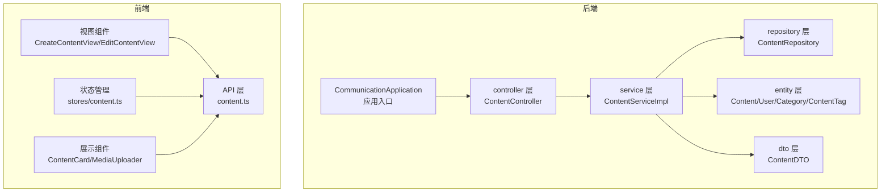

**图表来源**
- [CommunicationApplication.java:1-13](file://communication-backend/src/main/java/com/communication/CommunicationApplication.java#L1-L13)
- [ContentController.java:1-96](file://communication-backend/src/main/java/com/communication/controller/ContentController.java#L1-L96)
- [ContentServiceImpl.java:1-217](file://communication-backend/src/main/java/com/communication/service/impl/ContentServiceImpl.java#L1-L217)
- [ContentRepository.java:1-68](file://communication-backend/src/main/java/com/communication/repository/ContentRepository.java#L1-L68)
- [Content.java:1-153](file://communication-backend/src/main/java/com/communication/entity/Content.java#L1-L153)
- [ContentDTO.java:1-140](file://communication-backend/src/main/java/com/communication/dto/ContentDTO.java#L1-L140)
- [content.ts（API）:1-120](file://communication-frontend/src/api/content.ts#L1-L120)
- [content.ts:1-150](file://communication-frontend/src/stores/content.ts#L1-L150)
- [CreateContentView.vue:1-258](file://communication-frontend/src/views/content/CreateContentView.vue#L1-L258)
- [ContentCard.vue:1-376](file://communication-frontend/src/components/content/ContentCard.vue#L1-L376)
- [MediaUploader.vue:1-212](file://communication-frontend/src/components/content/MediaUploader.vue#L1-L212)

**章节来源**
- [CommunicationApplication.java:1-13](file://communication-backend/src/main/java/com/communication/CommunicationApplication.java#L1-L13)
- [ContentController.java:1-96](file://communication-backend/src/main/java/com/communication/controller/ContentController.java#L1-L96)
- [ContentServiceImpl.java:1-217](file://communication-backend/src/main/java/com/communication/service/impl/ContentServiceImpl.java#L1-L217)
- [ContentRepository.java:1-68](file://communication-backend/src/main/java/com/communication/repository/ContentRepository.java#L1-L68)
- [Content.java:1-153](file://communication-backend/src/main/java/com/communication/entity/Content.java#L1-L153)
- [ContentDTO.java:1-140](file://communication-backend/src/main/java/com/communication/dto/ContentDTO.java#L1-L140)
- [content.ts（API）:1-120](file://communication-frontend/src/api/content.ts#L1-L120)
- [content.ts:1-150](file://communication-frontend/src/stores/content.ts#L1-L150)
- [CreateContentView.vue:1-258](file://communication-frontend/src/views/content/CreateContentView.vue#L1-L258)
- [ContentCard.vue:1-376](file://communication-frontend/src/components/content/ContentCard.vue#L1-L376)
- [MediaUploader.vue:1-212](file://communication-frontend/src/components/content/MediaUploader.vue#L1-L212)

## 核心组件
- 内容实体与 DTO：定义内容字段、媒体类型、状态、作者、分类、标签与统计信息，并提供实体到 DTO 的转换。
- 控制器：暴露 REST 接口，处理内容的创建、查询、更新、删除与分页列表。
- 服务层：实现业务规则（如作者校验、标签保存、统计计数），协调仓储与用户服务。
- 仓储层：提供 JPA 查询方法，包括按状态、作者、关键词搜索、趋势排序等。
- 前端组件：内容卡片、媒体上传器、创建/编辑页面与 Pinia 状态管理，实现数据绑定与交互。

**章节来源**
- [Content.java:1-153](file://communication-backend/src/main/java/com/communication/entity/Content.java#L1-L153)
- [ContentDTO.java:1-140](file://communication-backend/src/main/java/com/communication/dto/ContentDTO.java#L1-L140)
- [ContentController.java:1-96](file://communication-backend/src/main/java/com/communication/controller/ContentController.java#L1-L96)
- [ContentServiceImpl.java:1-217](file://communication-backend/src/main/java/com/communication/service/impl/ContentServiceImpl.java#L1-L217)
- [ContentRepository.java:1-68](file://communication-backend/src/main/java/com/communication/repository/ContentRepository.java#L1-L68)
- [ContentCard.vue:1-376](file://communication-frontend/src/components/content/ContentCard.vue#L1-L376)
- [content.ts:1-150](file://communication-frontend/src/stores/content.ts#L1-L150)
- [content.ts（API）:1-120](file://communication-frontend/src/api/content.ts#L1-L120)
- [CreateContentView.vue:1-258](file://communication-frontend/src/views/content/CreateContentView.vue#L1-L258)
- [MediaUploader.vue:1-212](file://communication-frontend/src/components/content/MediaUploader.vue#L1-L212)

## 架构总览
系统采用经典的三层架构，前后端分离，后端通过 Spring MVC 暴露 REST API，前端通过 Axios 风格的封装进行调用，状态管理集中于 Pinia，UI 组件统一使用 Element Plus。

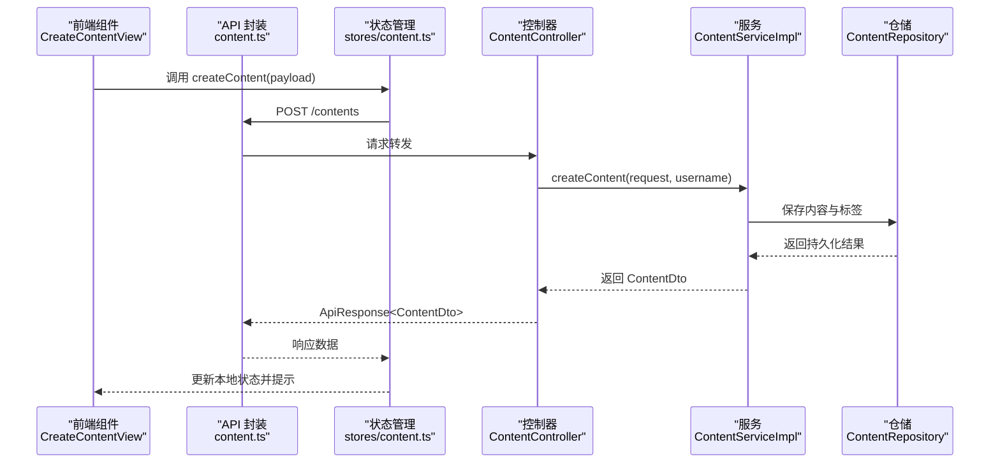

**图表来源**
- [CreateContentView.vue:1-258](file://communication-frontend/src/views/content/CreateContentView.vue#L1-L258)
- [content.ts:1-150](file://communication-frontend/src/stores/content.ts#L1-L150)
- [content.ts（API）:1-120](file://communication-frontend/src/api/content.ts#L1-L120)
- [ContentController.java:1-96](file://communication-backend/src/main/java/com/communication/controller/ContentController.java#L1-L96)
- [ContentServiceImpl.java:1-217](file://communication-backend/src/main/java/com/communication/service/impl/ContentServiceImpl.java#L1-L217)
- [ContentRepository.java:1-68](file://communication-backend/src/main/java/com/communication/repository/ContentRepository.java#L1-L68)

## 详细组件分析

### 数据模型与实体设计
内容实体包含标题、正文、媒体链接与类型、浏览/评论/点赞计数、状态、作者、分类与标签集合；枚举定义媒体类型与内容状态；标签以独立实体存储并由内容实体关联。

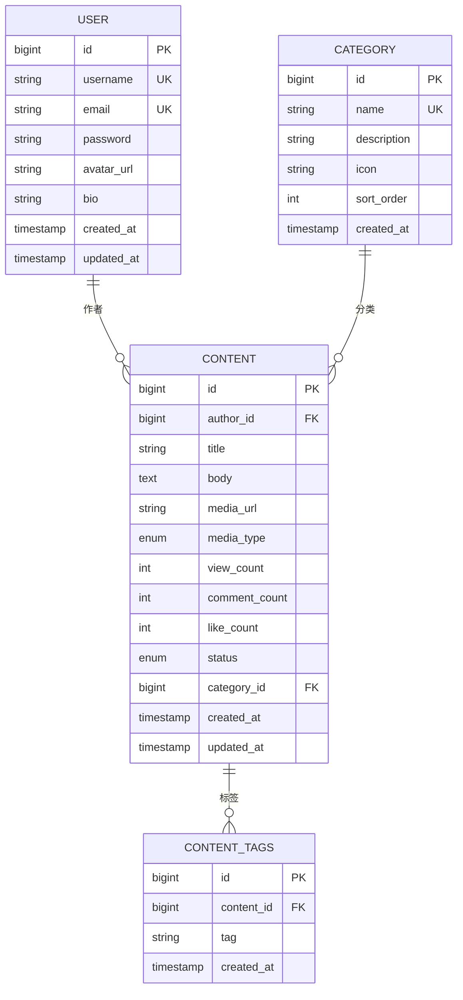

**图表来源**
- [User.java:1-96](file://communication-backend/src/main/java/com/communication/entity/User.java#L1-L96)
- [Category.java:1-50](file://communication-backend/src/main/java/com/communication/entity/Category.java#L1-L50)
- [Content.java:1-153](file://communication-backend/src/main/java/com/communication/entity/Content.java#L1-L153)
- [ContentTag.java:1-66](file://communication-backend/src/main/java/com/communication/entity/ContentTag.java#L1-L66)

**章节来源**
- [Content.java:1-153](file://communication-backend/src/main/java/com/communication/entity/Content.java#L1-L153)
- [User.java:1-96](file://communication-backend/src/main/java/com/communication/entity/User.java#L1-L96)
- [Category.java:1-50](file://communication-backend/src/main/java/com/communication/entity/Category.java#L1-L50)
- [ContentTag.java:1-66](file://communication-backend/src/main/java/com/communication/entity/ContentTag.java#L1-L66)
- [MediaType.java:1-8](file://communication-backend/src/main/java/com/communication/entity/MediaType.java#L1-L8)
- [ContentStatus.java:1-7](file://communication-backend/src/main/java/com/communication/entity/ContentStatus.java#L1-L7)

### CRUD 实现流程
- 创建：控制器接收请求体，服务层根据用户名解析作者，设置分类与标签，保存后返回 DTO。
- 查询：支持公开列表、作者列表、个人内容（含状态过滤）、详情页（同时增加浏览计数与记录阅读历史）。
- 更新：校验作者身份，允许更新标题、正文、媒体、状态、分类与标签，标签变更时先清理再写入。
- 删除：校验作者身份后删除内容。

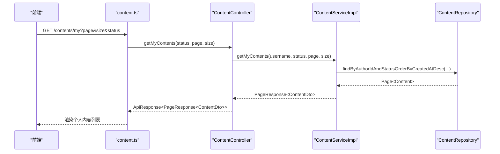

**图表来源**
- [ContentController.java:85-94](file://communication-backend/src/main/java/com/communication/controller/ContentController.java#L85-L94)
- [ContentServiceImpl.java:157-172](file://communication-backend/src/main/java/com/communication/service/impl/ContentServiceImpl.java#L157-L172)
- [ContentRepository.java:22-24](file://communication-backend/src/main/java/com/communication/repository/ContentRepository.java#L22-L24)

**章节来源**
- [ContentController.java:1-96](file://communication-backend/src/main/java/com/communication/controller/ContentController.java#L1-L96)
- [ContentServiceImpl.java:1-217](file://communication-backend/src/main/java/com/communication/service/impl/ContentServiceImpl.java#L1-L217)
- [ContentRepository.java:1-68](file://communication-backend/src/main/java/com/communication/repository/ContentRepository.java#L1-L68)

### 媒体文件处理机制
- 前端 MediaUploader 支持图片与视频上传，自动识别 MIME 类型，调用对应上传接口，返回媒体 URL 与类型。
- 后端提供上传接口（在前端 API 中体现），内容实体支持媒体 URL 与类型字段，卡片组件根据类型渲染图片或视频预览。

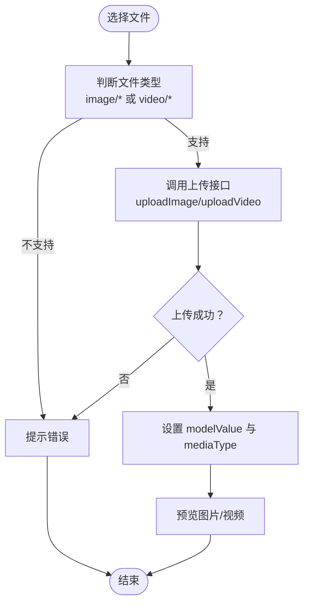

**图表来源**
- [MediaUploader.vue:1-212](file://communication-frontend/src/components/content/MediaUploader.vue#L1-L212)
- [content.ts（API）:104-118](file://communication-frontend/src/api/content.ts#L104-L118)
- [ContentCard.vue:91-103](file://communication-frontend/src/components/content/ContentCard.vue#L91-L103)

**章节来源**
- [MediaUploader.vue:1-212](file://communication-frontend/src/components/content/MediaUploader.vue#L1-L212)
- [content.ts（API）:1-120](file://communication-frontend/src/api/content.ts#L1-L120)
- [ContentCard.vue:1-376](file://communication-frontend/src/components/content/ContentCard.vue#L1-L376)

### 标签系统设计与实现
- 标签以独立实体存储，内容与标签为一对多关系；创建/更新时先清理旧标签，再写入新标签，保证一致性。
- 前端创建/编辑表单支持标签输入与展示，服务端统一转小写并去重。

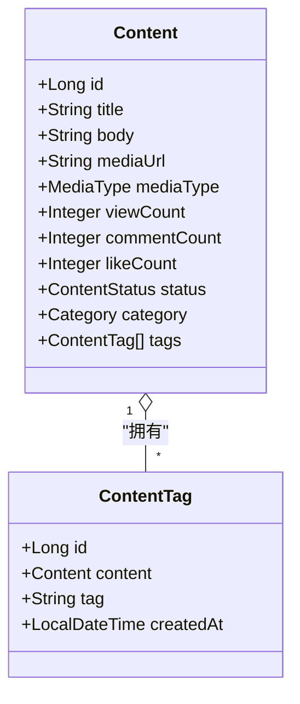

**图表来源**
- [Content.java:53-54](file://communication-backend/src/main/java/com/communication/entity/Content.java#L53-L54)
- [ContentTag.java:1-66](file://communication-backend/src/main/java/com/communication/entity/ContentTag.java#L1-L66)
- [ContentServiceImpl.java:196-205](file://communication-backend/src/main/java/com/communication/service/impl/ContentServiceImpl.java#L196-L205)

**章节来源**
- [Content.java:1-153](file://communication-backend/src/main/java/com/communication/entity/Content.java#L1-L153)
- [ContentTag.java:1-66](file://communication-backend/src/main/java/com/communication/entity/ContentTag.java#L1-L66)
- [ContentServiceImpl.java:196-205](file://communication-backend/src/main/java/com/communication/service/impl/ContentServiceImpl.java#L196-L205)

### 内容搜索与索引策略
- 后端提供关键词搜索接口，按标题与正文模糊匹配并按创建时间倒序。
- 建议在生产环境对标题与正文建立全文索引（如 PostgreSQL 全文检索或 Elasticsearch），以提升检索性能与相关性排序。

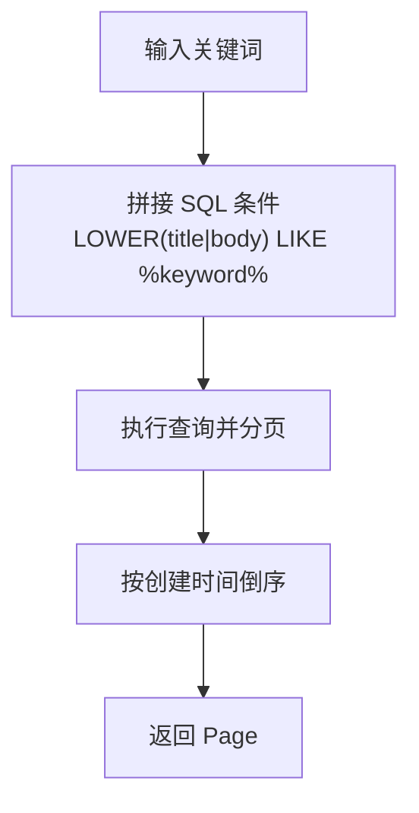

**图表来源**
- [ContentRepository.java:50-55](file://communication-backend/src/main/java/com/communication/repository/ContentRepository.java#L50-L55)

**章节来源**
- [ContentRepository.java:1-68](file://communication-backend/src/main/java/com/communication/repository/ContentRepository.java#L1-L68)

### 内容权限控制与审核机制
- 权限控制：更新/删除接口会校验当前登录用户是否为内容作者，非作者不可操作。
- 审核机制：内容状态枚举包含草稿与已发布两种状态，创建/更新时可指定状态，默认发布。

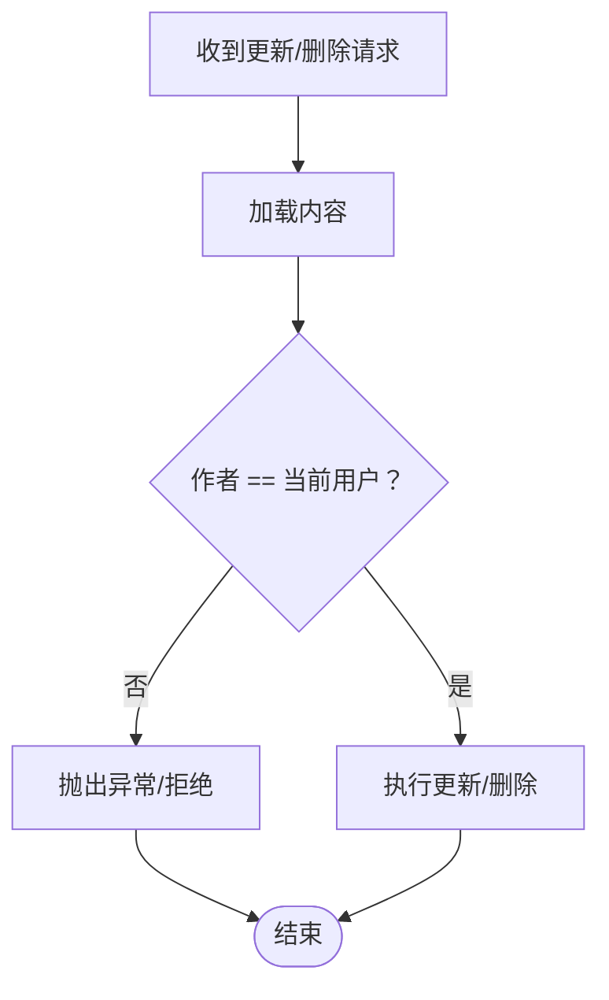

**图表来源**
- [ContentServiceImpl.java:80-135](file://communication-backend/src/main/java/com/communication/service/impl/ContentServiceImpl.java#L80-L135)
- [ContentStatus.java:1-7](file://communication-backend/src/main/java/com/communication/entity/ContentStatus.java#L1-L7)

**章节来源**
- [ContentServiceImpl.java:1-217](file://communication-backend/src/main/java/com/communication/service/impl/ContentServiceImpl.java#L1-L217)
- [ContentStatus.java:1-7](file://communication-backend/src/main/java/com/communication/entity/ContentStatus.java#L1-L7)

### 内容推荐算法
- 后端提供趋势内容查询，按浏览量、点赞数与评论数加权排序；可结合最近时间段筛选热门内容。
- 前端可基于该接口实现“热门”“近期热门”等推荐位。

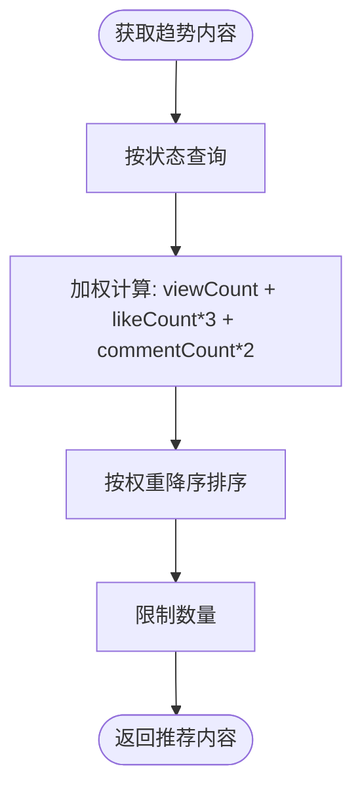

**图表来源**
- [ContentRepository.java:62-66](file://communication-backend/src/main/java/com/communication/repository/ContentRepository.java#L62-L66)

**章节来源**
- [ContentRepository.java:1-68](file://communication-backend/src/main/java/com/communication/repository/ContentRepository.java#L1-L68)

### 前端内容展示组件与数据绑定
- ContentCard：展示标题、摘要、媒体图标、标签、分类、作者信息与统计数据，支持点击跳转与标签路由。
- MediaUploader：封装上传逻辑，支持预览与移除。
- stores/content：集中管理内容列表、当前内容、分页与加载状态，提供增删改查方法。
- Create/Edit 页面：表单驱动，联动分类、标签、媒体上传器与状态切换。

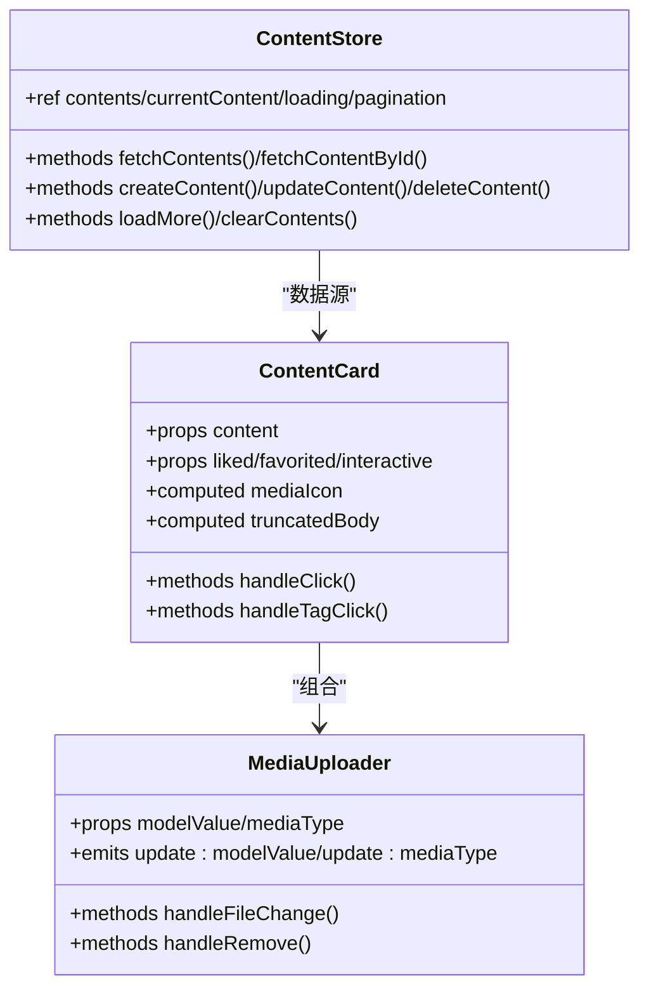

**图表来源**
- [ContentCard.vue:1-376](file://communication-frontend/src/components/content/ContentCard.vue#L1-L376)
- [MediaUploader.vue:1-212](file://communication-frontend/src/components/content/MediaUploader.vue#L1-L212)
- [content.ts:1-150](file://communication-frontend/src/stores/content.ts#L1-L150)

**章节来源**
- [ContentCard.vue:1-376](file://communication-frontend/src/components/content/ContentCard.vue#L1-L376)
- [MediaUploader.vue:1-212](file://communication-frontend/src/components/content/MediaUploader.vue#L1-L212)
- [content.ts:1-150](file://communication-frontend/src/stores/content.ts#L1-L150)
- [CreateContentView.vue:1-258](file://communication-frontend/src/views/content/CreateContentView.vue#L1-L258)
- [EditContentView.vue:1-227](file://communication-frontend/src/views/content/EditContentView.vue#L1-L227)

## 依赖关系分析
- 控制器依赖服务层；服务层依赖仓储层与用户服务；仓储层依赖 JPA 与数据库。
- 前端 API 封装依赖后端接口路径；Pinia Store 依赖 API；视图组件依赖 Store 与组件库。

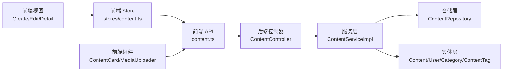

**图表来源**
- [ContentController.java:1-96](file://communication-backend/src/main/java/com/communication/controller/ContentController.java#L1-L96)
- [ContentServiceImpl.java:1-217](file://communication-backend/src/main/java/com/communication/service/impl/ContentServiceImpl.java#L1-L217)
- [ContentRepository.java:1-68](file://communication-backend/src/main/java/com/communication/repository/ContentRepository.java#L1-L68)
- [content.ts（API）:1-120](file://communication-frontend/src/api/content.ts#L1-L120)
- [content.ts:1-150](file://communication-frontend/src/stores/content.ts#L1-L150)
- [CreateContentView.vue:1-258](file://communication-frontend/src/views/content/CreateContentView.vue#L1-L258)
- [ContentCard.vue:1-376](file://communication-frontend/src/components/content/ContentCard.vue#L1-L376)
- [MediaUploader.vue:1-212](file://communication-frontend/src/components/content/MediaUploader.vue#L1-L212)

**章节来源**
- [ContentController.java:1-96](file://communication-backend/src/main/java/com/communication/controller/ContentController.java#L1-L96)
- [ContentServiceImpl.java:1-217](file://communication-backend/src/main/java/com/communication/service/impl/ContentServiceImpl.java#L1-L217)
- [ContentRepository.java:1-68](file://communication-backend/src/main/java/com/communication/repository/ContentRepository.java#L1-L68)
- [content.ts（API）:1-120](file://communication-frontend/src/api/content.ts#L1-L120)
- [content.ts:1-150](file://communication-frontend/src/stores/content.ts#L1-L150)
- [CreateContentView.vue:1-258](file://communication-frontend/src/views/content/CreateContentView.vue#L1-L258)
- [ContentCard.vue:1-376](file://communication-frontend/src/components/content/ContentCard.vue#L1-L376)
- [MediaUploader.vue:1-212](file://communication-frontend/src/components/content/MediaUploader.vue#L1-L212)

## 性能考虑
- 数据库层面：为标题与正文建立全文索引；对常用查询字段（作者、状态、创建时间）建立复合索引；趋势查询可考虑物化视图或缓存热点数据。
- 应用层面：分页参数合理设置默认值与上限；批量写入标签时避免 N+1 查询；缓存热门内容与分类列表。
- 前端层面：虚拟滚动与懒加载；图片懒加载与缩略图；减少不必要的响应式更新与重复渲染。

## 故障排除指南
- 无权限操作：当更新/删除内容时报错，检查当前登录用户与内容作者是否一致。
- 资源不存在：查询或更新时抛出资源未找到异常，确认 ID 是否正确。
- 上传失败：检查文件类型与大小限制，确保前端正确识别 image/* 或 video/* 并设置正确的 Content-Type。
- 分页异常：确认 page/size 参数范围与后端默认值，避免过大页码或过大的 size 导致内存压力。

**章节来源**
- [ContentServiceImpl.java:80-135](file://communication-backend/src/main/java/com/communication/service/impl/ContentServiceImpl.java#L80-L135)
- [content.ts（API）:104-118](file://communication-frontend/src/api/content.ts#L104-L118)

## 结论
本内容管理系统在数据模型、业务流程与前端交互方面实现了清晰的职责划分与良好的扩展性。通过标签系统、全文检索与趋势推荐，满足了内容发现与运营需求；通过媒体上传与多格式支持，提升了内容表达能力。建议在生产环境中进一步完善数据库索引、缓存策略与监控告警体系，以保障高并发场景下的稳定性与性能。

## 附录
- 关键接口路径与方法
  - GET /api/contents?page&size：获取公开内容列表
  - GET /api/contents/{id}：获取内容详情并增加浏览计数
  - POST /api/contents：创建内容
  - PUT /api/contents/{id}：更新内容
  - DELETE /api/contents/{id}：删除内容
  - GET /api/contents/user/{authorId}：按作者获取内容
  - GET /api/contents/my：获取个人内容（可带状态过滤）
  - POST /upload/image：上传图片
  - POST /upload/video：上传视频

**章节来源**
- [ContentController.java:1-96](file://communication-backend/src/main/java/com/communication/controller/ContentController.java#L1-L96)
- [content.ts（API）:69-118](file://communication-frontend/src/api/content.ts#L69-L118)