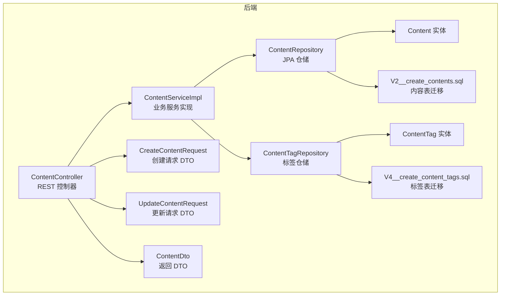
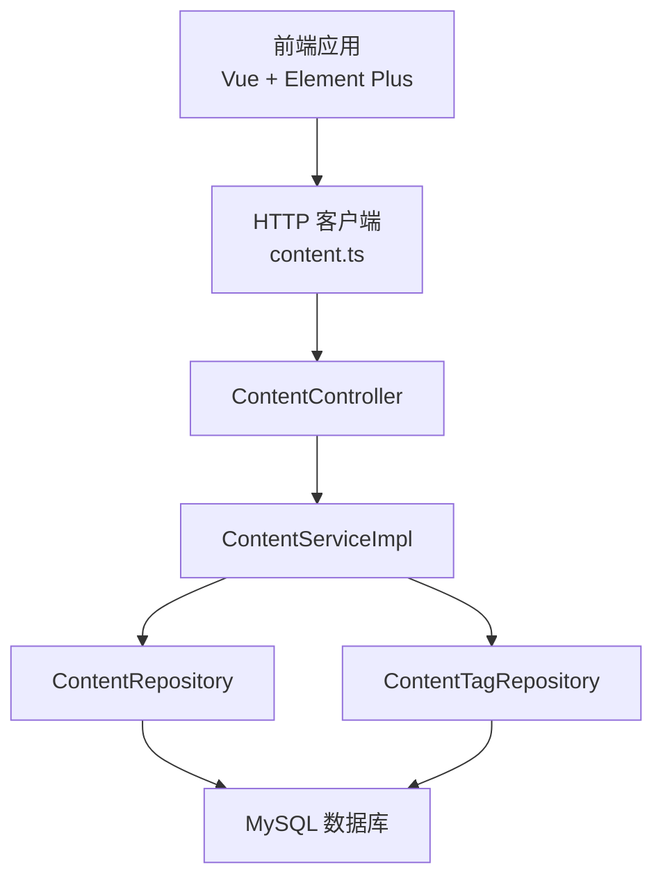
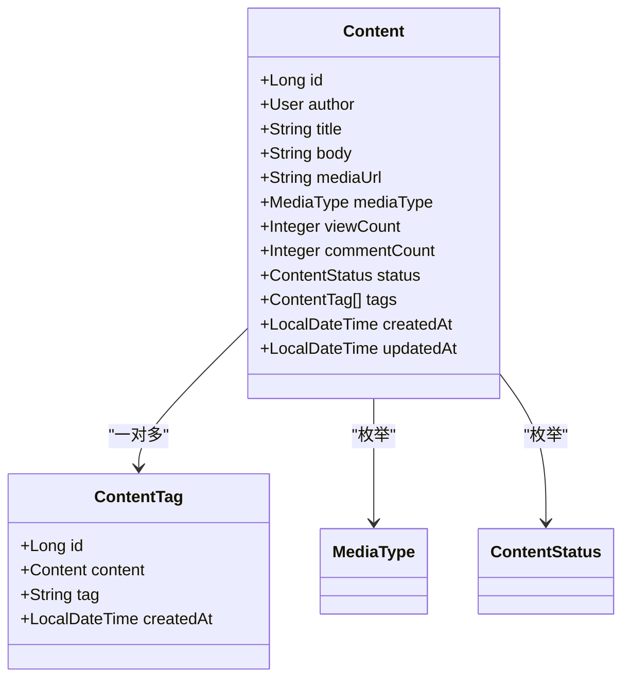
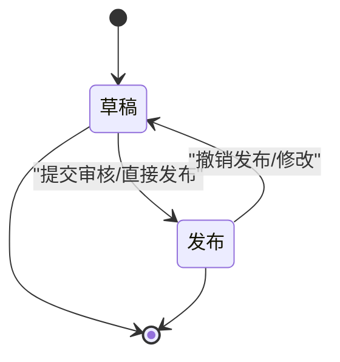
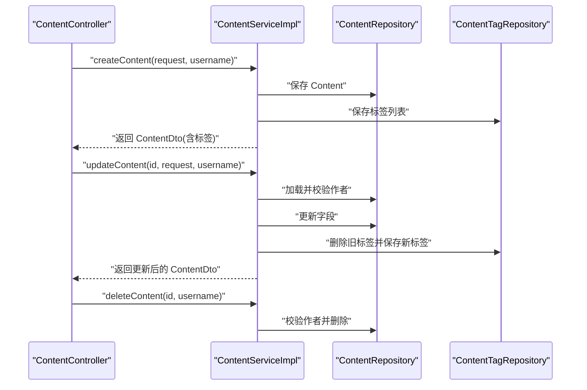
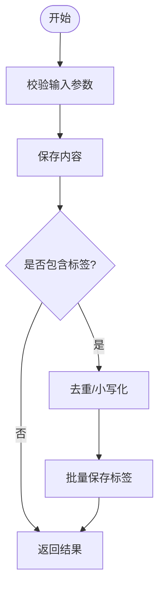
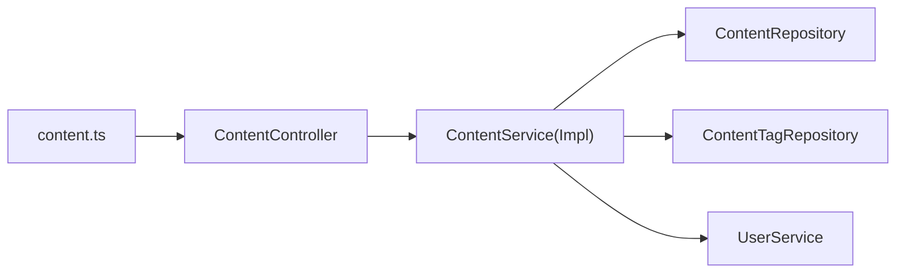

# 内容管理系统

<cite>
**本文引用的文件**
- [Content.java](file://communication-backend/src/main/java/com/communication/entity/Content.java)
- [ContentStatus.java](file://communication-backend/src/main/java/com/communication/entity/ContentStatus.java)
- [MediaType.java](file://communication-backend/src/main/java/com/communication/entity/MediaType.java)
- [ContentTag.java](file://communication-backend/src/main/java/com/communication/entity/ContentTag.java)
- [CreateContentRequest.java](file://communication-backend/src/main/java/com/communication/dto/CreateContentRequest.java)
- [UpdateContentRequest.java](file://communication-backend/src/main/java/com/communication/dto/UpdateContentRequest.java)
- [ContentDto.java](file://communication-backend/src/main/java/com/communication/dto/ContentDto.java)
- [ContentController.java](file://communication-backend/src/main/java/com/communication/controller/ContentController.java)
- [ContentService.java](file://communication-backend/src/main/java/com/communication/service/ContentService.java)
- [ContentServiceImpl.java](file://communication-backend/src/main/java/com/communication/service/impl/ContentServiceImpl.java)
- [ContentRepository.java](file://communication-backend/src/main/java/com/communication/repository/ContentRepository.java)
- [ContentTagRepository.java](file://communication-backend/src/main/java/com/communication/repository/ContentTagRepository.java)
- [V2__create_contents.sql](file://communication-backend/src/main/resources/db/migration/V2__create_contents.sql)
- [V4__create_content_tags.sql](file://communication-backend/src/main/resources/db/migration/V4__create_content_tags.sql)
- [content.ts](file://communication-frontend/src/api/content.ts)
</cite>

## 更新摘要
**所做更改**
- 更新了内容实体模型设计，包含完整的字段说明和默认值
- 新增了内容状态管理机制的详细说明
- 补充了标签系统的完整实现逻辑
- 完善了媒体文件处理与存储方案
- 更新了API接口文档，包含所有CRUD操作
- 增强了性能考虑和故障排查指南

## 目录
1. [简介](#简介)
2. [项目结构](#项目结构)
3. [核心组件](#核心组件)
4. [架构总览](#架构总览)
5. [详细组件分析](#详细组件分析)
6. [依赖关系分析](#依赖关系分析)
7. [性能考虑](#性能考虑)
8. [故障排查指南](#故障排查指南)
9. [结论](#结论)
10. [附录](#附录)

## 简介
本项目是一个基于 Spring Boot 的内容管理系统，提供内容的创建、查询、更新、删除与草稿管理能力，并支持文本、图片、视频等多媒体内容类型。系统通过标签体系实现内容分类与检索，采用分页查询与全文索引提升性能与可扩展性。后端提供 REST API，前端通过 Vue 组件完成媒体上传与展示。

## 项目结构
后端采用分层架构：controller（控制层）、service（服务层）、repository（数据访问层）、entity（领域模型）、dto（数据传输对象）、config（安全与跨域配置）、exception（异常处理）等模块清晰分离。数据库迁移脚本定义了内容与标签表结构及索引策略。

**图表来源**
- [ContentController.java](file://communication-backend/src/main/java/com/communication/controller/ContentController.java#L1-L85)
- [ContentServiceImpl.java](file://communication-backend/src/main/java/com/communication/service/impl/ContentServiceImpl.java#L1-L199)
- [ContentRepository.java](file://communication-backend/src/main/java/com/communication/repository/ContentRepository.java#L1-L56)
- [ContentTagRepository.java](file://communication-backend/src/main/java/com/communication/repository/ContentTagRepository.java#L1-L29)
- [Content.java](file://communication-backend/src/main/java/com/communication/entity/Content.java#L1-L135)
- [ContentTag.java](file://communication-backend/src/main/java/com/communication/entity/ContentTag.java#L1-L66)
- [CreateContentRequest.java](file://communication-backend/src/main/java/com/communication/dto/CreateContentRequest.java#L1-L42)
- [UpdateContentRequest.java](file://communication-backend/src/main/java/com/communication/dto/UpdateContentRequest.java#L1-L40)
- [ContentDto.java](file://communication-backend/src/main/java/com/communication/dto/ContentDto.java#L1-L118)
- [V2__create_contents.sql](file://communication-backend/src/main/resources/db/migration/V2__create_contents.sql#L1-L19)
- [V4__create_content_tags.sql](file://communication-backend/src/main/resources/db/migration/V4__create_content_tags.sql#L1-L14)

**章节来源**
- [ContentController.java](file://communication-backend/src/main/java/com/communication/controller/ContentController.java#L1-L85)
- [ContentServiceImpl.java](file://communication-backend/src/main/java/com/communication/service/impl/ContentServiceImpl.java#L1-L199)
- [ContentRepository.java](file://communication-backend/src/main/java/com/communication/repository/ContentRepository.java#L1-L56)
- [ContentTagRepository.java](file://communication-backend/src/main/java/com/communication/repository/ContentTagRepository.java#L1-L29)
- [Content.java](file://communication-backend/src/main/java/com/communication/entity/Content.java#L1-L135)
- [ContentTag.java](file://communication-backend/src/main/java/com/communication/entity/ContentTag.java#L1-L66)
- [CreateContentRequest.java](file://communication-backend/src/main/java/com/communication/dto/CreateContentRequest.java#L1-L42)
- [UpdateContentRequest.java](file://communication-backend/src/main/java/com/communication/dto/UpdateContentRequest.java#L1-L40)
- [ContentDto.java](file://communication-backend/src/main/java/com/communication/dto/ContentDto.java#L1-L118)
- [V2__create_contents.sql](file://communication-backend/src/main/resources/db/migration/V2__create_contents.sql#L1-L19)
- [V4__create_content_tags.sql](file://communication-backend/src/main/resources/db/migration/V4__create_content_tags.sql#L1-L14)

## 核心组件
- **内容实体**：包含作者、标题、正文、媒体地址与类型、浏览数、评论数、状态、标签、创建与更新时间等字段
- **标签实体**：内容与标签的多对多关联，使用独立表存储，支持按标签检索与热门标签统计
- **请求与响应 DTO**：封装创建、更新与返回的数据结构，确保接口契约清晰
- **控制器**：提供内容的 CRUD、分页查询、个人内容查询与浏览量自增等接口
- **服务层**：实现权限校验、标签保存与更新、分页转换与视图计数逻辑
- **仓储层**：基于 JPA 提供分页查询、全文检索、聚合统计与视图计数更新等方法
- **数据库迁移**：定义内容与标签表结构、索引与全文索引，支撑高性能查询与搜索

**章节来源**
- [Content.java](file://communication-backend/src/main/java/com/communication/entity/Content.java#L1-L135)
- [ContentTag.java](file://communication-backend/src/main/java/com/communication/entity/ContentTag.java#L1-L66)
- [CreateContentRequest.java](file://communication-backend/src/main/java/com/communication/dto/CreateContentRequest.java#L1-L42)
- [UpdateContentRequest.java](file://communication-backend/src/main/java/com/communication/dto/UpdateContentRequest.java#L1-L40)
- [ContentDto.java](file://communication-backend/src/main/java/com/communication/dto/ContentDto.java#L1-L118)
- [ContentController.java](file://communication-backend/src/main/java/com/communication/controller/ContentController.java#L1-L85)
- [ContentServiceImpl.java](file://communication-backend/src/main/java/com/communication/service/impl/ContentServiceImpl.java#L1-L199)
- [ContentRepository.java](file://communication-backend/src/main/java/com/communication/repository/ContentRepository.java#L1-L56)
- [ContentTagRepository.java](file://communication-backend/src/main/java/com/communication/repository/ContentTagRepository.java#L1-L29)
- [V2__create_contents.sql](file://communication-backend/src/main/resources/db/migration/V2__create_contents.sql#L1-L19)
- [V4__create_content_tags.sql](file://communication-backend/src/main/resources/db/migration/V4__create_content_tags.sql#L1-L14)

## 架构总览
系统采用经典的三层架构，前后端分离，后端通过 REST API 提供统一接口，前端通过 Axios 封装的 http 客户端调用后端接口。

**图表来源**
- [content.ts](file://communication-frontend/src/api/content.ts#L1-L114)
- [ContentController.java](file://communication-backend/src/main/java/com/communication/controller/ContentController.java#L1-L85)
- [ContentServiceImpl.java](file://communication-backend/src/main/java/com/communication/service/impl/ContentServiceImpl.java#L1-L199)
- [ContentRepository.java](file://communication-backend/src/main/java/com/communication/repository/ContentRepository.java#L1-L56)
- [ContentTagRepository.java](file://communication-backend/src/main/java/com/communication/repository/ContentTagRepository.java#L1-L29)

## 详细组件分析

### 内容实体模型设计
内容实体支持文本、图片、视频三种媒体类型；状态包含草稿与发布两种；内置浏览数与评论数字段；通过标签集合实现内容与标签的一对多关系。

**图表来源**
- [Content.java](file://communication-backend/src/main/java/com/communication/entity/Content.java#L1-L135)
- [ContentTag.java](file://communication-backend/src/main/java/com/communication/entity/ContentTag.java#L1-L66)
- [MediaType.java](file://communication-backend/src/main/java/com/communication/entity/MediaType.java#L1-L8)
- [ContentStatus.java](file://communication-backend/src/main/java/com/communication/entity/ContentStatus.java#L1-L7)

**章节来源**
- [Content.java](file://communication-backend/src/main/java/com/communication/entity/Content.java#L1-L135)
- [ContentTag.java](file://communication-backend/src/main/java/com/communication/entity/ContentTag.java#L1-L66)
- [MediaType.java](file://communication-backend/src/main/java/com/communication/entity/MediaType.java#L1-L8)
- [ContentStatus.java](file://communication-backend/src/main/java/com/communication/entity/ContentStatus.java#L1-L7)

### 内容状态管理机制
- **状态枚举**：草稿（DRAFT）、发布（PUBLISHED）
- **默认状态**：新建内容默认发布
- **查询过滤**：按状态分页查询，支持仅返回已发布内容或按作者与状态组合查询
- **权限控制**：更新与删除需校验内容作者身份

**图表来源**
- [ContentStatus.java](file://communication-backend/src/main/java/com/communication/entity/ContentStatus.java#L1-L7)
- [ContentServiceImpl.java](file://communication-backend/src/main/java/com/communication/service/impl/ContentServiceImpl.java#L68-L117)
- [ContentRepository.java](file://communication-backend/src/main/java/com/communication/repository/ContentRepository.java#L19-L26)

**章节来源**
- [ContentStatus.java](file://communication-backend/src/main/java/com/communication/entity/ContentStatus.java#L1-L7)
- [ContentServiceImpl.java](file://communication-backend/src/main/java/com/communication/service/impl/ContentServiceImpl.java#L68-L117)
- [ContentRepository.java](file://communication-backend/src/main/java/com/communication/repository/ContentRepository.java#L19-L26)

### 内容服务层实现逻辑
- **创建内容**：解析作者、填充字段、持久化、保存标签、返回带标签的 DTO
- **更新内容**：校验作者、逐项更新、替换标签、保存并返回
- **删除内容**：校验作者后删除
- **分页查询**：按状态、作者、最新时间排序
- **视图计数**：原子性递增浏览数

**图表来源**
- [ContentController.java](file://communication-backend/src/main/java/com/communication/controller/ContentController.java#L23-L83)
- [ContentServiceImpl.java](file://communication-backend/src/main/java/com/communication/service/impl/ContentServiceImpl.java#L36-L117)
- [ContentRepository.java](file://communication-backend/src/main/java/com/communication/repository/ContentRepository.java#L1-L56)
- [ContentTagRepository.java](file://communication-backend/src/main/java/com/communication/repository/ContentTagRepository.java#L1-L29)

**章节来源**
- [ContentController.java](file://communication-backend/src/main/java/com/communication/controller/ContentController.java#L23-L83)
- [ContentServiceImpl.java](file://communication-backend/src/main/java/com/communication/service/impl/ContentServiceImpl.java#L36-L117)
- [ContentRepository.java](file://communication-backend/src/main/java/com/communication/repository/ContentRepository.java#L1-L56)
- [ContentTagRepository.java](file://communication-backend/src/main/java/com/communication/repository/ContentTagRepository.java#L1-L29)

### 内容标签系统设计与实现
- **标签实体**：独立表存储，外键关联内容，带创建时间
- **标签保存**：去重、小写化、批量保存
- **标签查询**：按内容 ID 查询、按关键字模糊匹配、按标签反查内容 ID、统计热门标签
- **标签限制**：最多10个标签，每个标签最多50字符

**图表来源**
- [ContentServiceImpl.java](file://communication-backend/src/main/java/com/communication/service/impl/ContentServiceImpl.java#L178-L187)
- [ContentTagRepository.java](file://communication-backend/src/main/java/com/communication/repository/ContentTagRepository.java#L14-L25)

**章节来源**
- [ContentTag.java](file://communication-backend/src/main/java/com/communication/entity/ContentTag.java#L1-L66)
- [ContentTagRepository.java](file://communication-backend/src/main/java/com/communication/repository/ContentTagRepository.java#L1-L29)
- [ContentServiceImpl.java](file://communication-backend/src/main/java/com/communication/service/impl/ContentServiceImpl.java#L178-L187)

### 媒体文件处理与存储
- **媒体类型**：文本（TEXT）、图片（IMAGE）、视频（VIDEO）
- **默认值**：媒体类型默认为文本，状态默认为发布
- **URL存储**：当前实现将媒体 URL 存入数据库；实际部署中可结合对象存储服务进行扩展
- **前端上传**：支持图片与视频上传，自动设置媒体类型与 URL

**章节来源**
- [MediaType.java](file://communication-backend/src/main/java/com/communication/entity/MediaType.java#L1-L8)
- [CreateContentRequest.java](file://communication-backend/src/main/java/com/communication/dto/CreateContentRequest.java#L20-L22)
- [UpdateContentRequest.java](file://communication-backend/src/main/java/com/communication/dto/UpdateContentRequest.java#L18-L20)
- [content.ts](file://communication-frontend/src/api/content.ts#L98-L112)

### API 接口文档
- **获取公开内容列表**
  - 方法：GET
  - 路径：/api/contents
  - 查询参数：page（默认 0）、size（默认 10）
  - 返回：分页内容列表（仅发布态）
- **获取指定内容详情**
  - 方法：GET
  - 路径：/api/contents/{id}
  - 返回：单条内容详情，同时增加浏览数
- **获取作者内容列表**
  - 方法：GET
  - 路径：/api/contents/user/{authorId}
  - 查询参数：page、size
  - 返回：该作者的已发布内容分页
- **获取我的内容（草稿/发布/全部）**
  - 方法：GET
  - 路径：/api/contents/my
  - 查询参数：status（可选）、page、size
  - 返回：当前登录用户的分页内容
- **创建内容**
  - 方法：POST
  - 路径：/api/contents
  - 请求体：CreateContentRequest（标题必填、媒体类型默认文本、状态默认发布、标签最多 10 个）
  - 返回：创建成功的内容
- **更新内容**
  - 方法：PUT
  - 路径：/api/contents/{id}
  - 请求体：UpdateContentRequest（可部分更新）
  - 返回：更新后的内容
- **删除内容**
  - 方法：DELETE
  - 路径：/api/contents/{id}
  - 返回：删除成功
- **媒体上传**
  - 图片上传：POST /upload/image（multipart/form-data）
  - 视频上传：POST /upload/video（multipart/form-data）
  - 返回：UploadResponse（url、mediaType）

**章节来源**
- [ContentController.java](file://communication-backend/src/main/java/com/communication/controller/ContentController.java#L23-L83)
- [CreateContentRequest.java](file://communication-backend/src/main/java/com/communication/dto/CreateContentRequest.java#L1-L42)
- [UpdateContentRequest.java](file://communication-backend/src/main/java/com/communication/dto/UpdateContentRequest.java#L1-L40)
- [content.ts](file://communication-frontend/src/api/content.ts#L63-L112)

## 依赖关系分析
- 控制器依赖服务接口，服务实现依赖仓储与用户服务
- 仓储基于 JPA，提供分页、全文检索、聚合统计与视图计数更新
- 标签仓储提供标签的增删查与热门统计
- 前端通过统一的 http 客户端封装调用后端接口

**图表来源**
- [ContentController.java](file://communication-backend/src/main/java/com/communication/controller/ContentController.java#L1-L85)
- [ContentServiceImpl.java](file://communication-backend/src/main/java/com/communication/service/impl/ContentServiceImpl.java#L1-L199)
- [ContentRepository.java](file://communication-backend/src/main/java/com/communication/repository/ContentRepository.java#L1-L56)
- [ContentTagRepository.java](file://communication-backend/src/main/java/com/communication/repository/ContentTagRepository.java#L1-L29)
- [content.ts](file://communication-frontend/src/api/content.ts#L1-L114)

**章节来源**
- [ContentController.java](file://communication-backend/src/main/java/com/communication/controller/ContentController.java#L1-L85)
- [ContentServiceImpl.java](file://communication-backend/src/main/java/com/communication/service/impl/ContentServiceImpl.java#L1-L199)
- [ContentRepository.java](file://communication-backend/src/main/java/com/communication/repository/ContentRepository.java#L1-L56)
- [ContentTagRepository.java](file://communication-backend/src/main/java/com/communication/repository/ContentTagRepository.java#L1-L29)
- [content.ts](file://communication-frontend/src/api/content.ts#L1-L114)

## 性能考虑
- **索引优化**：内容表对作者、状态、创建时间建立索引，全文索引用于标题与正文搜索
- **分页查询**：使用 Pageable 进行分页，避免一次性加载大量数据
- **视图计数**：使用原子更新减少并发问题
- **标签查询**：按内容 ID、标签关键词与热门度统计提供高效查询路径
- **建议**：在高并发场景下引入缓存（如 Redis）缓存热点内容与标签，减少数据库压力

**章节来源**
- [V2__create_contents.sql](file://communication-backend/src/main/resources/db/migration/V2__create_contents.sql#L1-L19)
- [V4__create_content_tags.sql](file://communication-backend/src/main/resources/db/migration/V4__create_content_tags.sql#L1-L14)
- [ContentRepository.java](file://communication-backend/src/main/java/com/communication/repository/ContentRepository.java#L28-L51)
- [ContentTagRepository.java](file://communication-backend/src/main/java/com/communication/repository/ContentTagRepository.java#L18-L25)

## 故障排查指南
- **资源不存在**：当查询或操作不存在的内容时，抛出资源未找到异常
- **权限不足**：非作者本人尝试更新或删除内容时，抛出业务异常
- **参数校验失败**：请求 DTO 中的字段长度与数量限制不满足要求时，触发校验错误
- **建议**：在前端捕获异常并提示用户；在后端记录日志以便定位问题

**章节来源**
- [ContentServiceImpl.java](file://communication-backend/src/main/java/com/communication/service/impl/ContentServiceImpl.java#L74-L76)
- [CreateContentRequest.java](file://communication-backend/src/main/java/com/communication/dto/CreateContentRequest.java#L12-L25)
- [UpdateContentRequest.java](file://communication-backend/src/main/java/com/communication/dto/UpdateContentRequest.java#L11-L23)

## 结论
本内容管理系统以清晰的分层架构实现了内容的全生命周期管理，支持多种媒体类型与标签体系，并通过分页与索引保障了良好的性能表现。建议后续增强审核流程、引入媒体存储服务与缓存策略，进一步完善系统的可扩展性与稳定性。

## 附录
- **数据库迁移脚本**
  - 内容表：定义主键、外键、索引与全文索引
  - 标签表：定义主键、外键与索引
- **前端 API 封装**：统一的 HTTP 客户端与媒体上传组件

**章节来源**
- [V2__create_contents.sql](file://communication-backend/src/main/resources/db/migration/V2__create_contents.sql#L1-L19)
- [V4__create_content_tags.sql](file://communication-backend/src/main/resources/db/migration/V4__create_content_tags.sql#L1-L14)
- [content.ts](file://communication-frontend/src/api/content.ts#L1-L114)