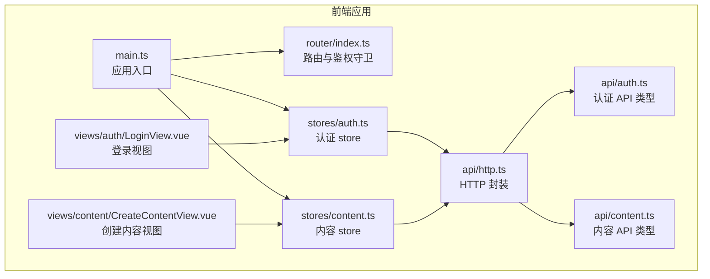
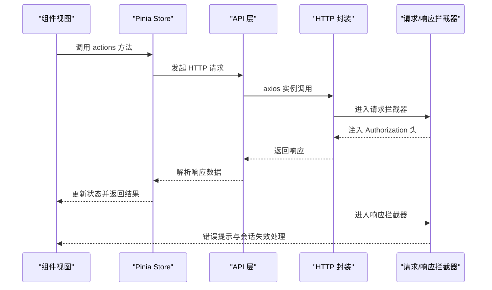
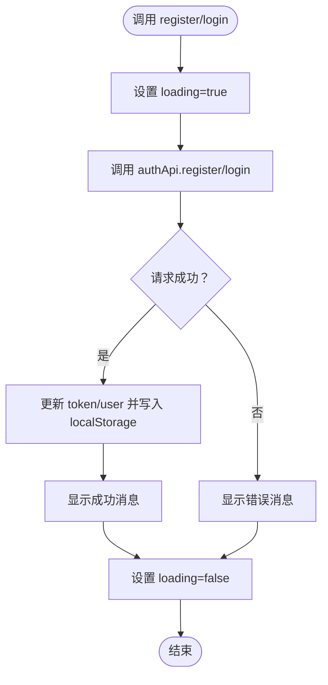
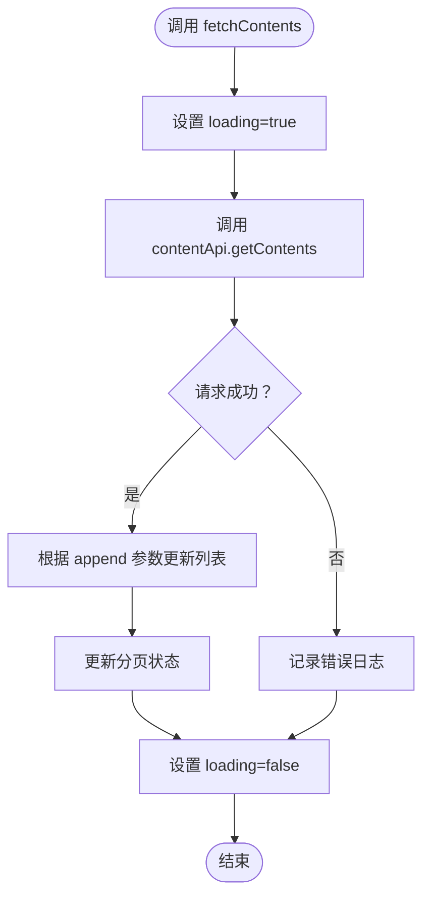
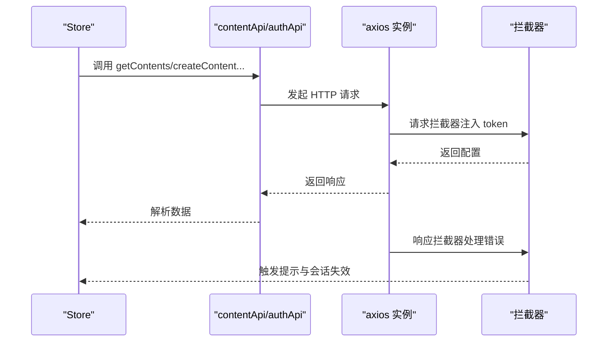
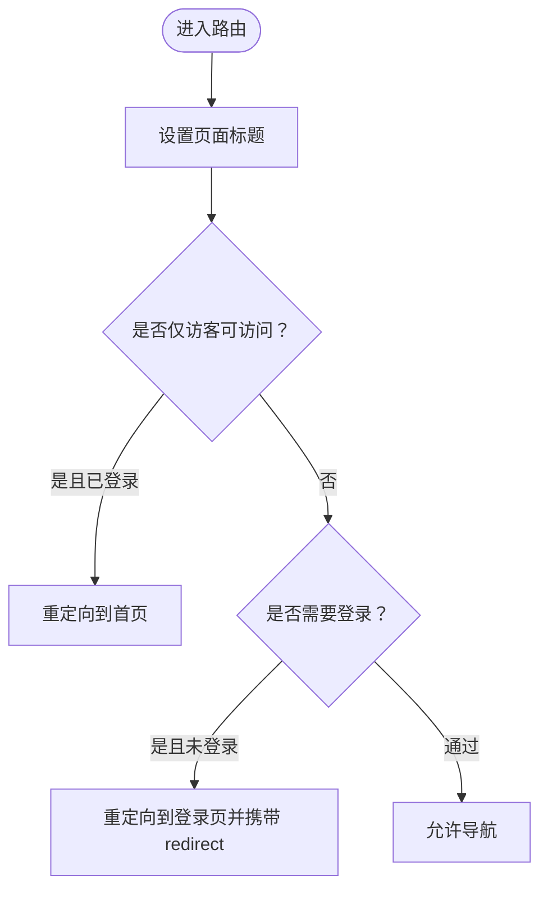
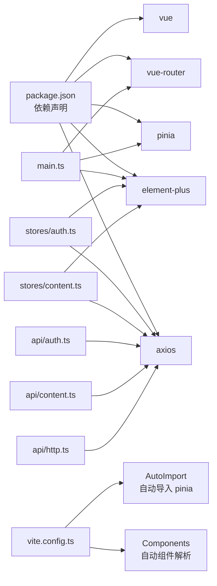

# Pinia 状态管理

<cite>
**本文档引用的文件**
- [main.ts](file://communication-frontend/src/main.ts)
- [vite.config.ts](file://communication-frontend/vite.config.ts)
- [package.json](file://communication-frontend/package.json)
- [auth.ts](file://communication-frontend/src/stores/auth.ts)
- [content.ts](file://communication-frontend/src/stores/content.ts)
- [auth.test.ts](file://communication-frontend/src/stores/__tests__/auth.test.ts)
- [auth.ts](file://communication-frontend/src/api/auth.ts)
- [content.ts](file://communication-frontend/src/api/content.ts)
- [http.ts](file://communication-frontend/src/api/http.ts)
- [index.ts](file://communication-frontend/src/router/index.ts)
- [LoginView.vue](file://communication-frontend/src/views/auth/LoginView.vue)
- [CreateContentView.vue](file://communication-frontend/src/views/content/CreateContentView.vue)
- [vitest.config.ts](file://communication-frontend/vitest.config.ts)
</cite>

## 目录
1. [简介](#简介)
2. [项目结构](#项目结构)
3. [核心组件](#核心组件)
4. [架构总览](#架构总览)
5. [详细组件分析](#详细组件分析)
6. [依赖关系分析](#依赖关系分析)
7. [性能考虑](#性能考虑)
8. [故障排除指南](#故障排除指南)
9. [结论](#结论)
10. [附录](#附录)

## 简介
本项目采用 Vue 3 + Pinia 构建前端应用，通过组合式 API 的 store 模式实现状态管理。本文档系统性地阐述 Pinia 在本项目中的设计理念、实现原理与最佳实践，涵盖：
- store 定义与模块化组织
- state 状态管理、getters 计算属性与 actions 操作方法
- 状态持久化与模块化管理
- 与 Vue 组件的集成方式（Composition API）
- 状态同步机制与路由守卫配合
- 测试策略与单元测试编写方法
- 实际 store 示例：用户认证状态与内容状态管理

## 项目结构
前端项目采用前后端分离架构，前端使用 Vite + Vue 3 + Pinia + Element Plus，后端使用 Spring Boot。前端主要目录结构如下：
- src/api：封装 HTTP 请求与接口类型定义
- src/stores：Pinia store 定义与测试
- src/views：页面级组件
- src/router：路由配置与鉴权守卫
- src/main.ts：应用入口，初始化 Pinia、路由与 UI 库

图表来源
- [main.ts](file://communication-frontend/src/main.ts#L1-L17)
- [index.ts](file://communication-frontend/src/router/index.ts#L1-L98)
- [auth.ts](file://communication-frontend/src/stores/auth.ts#L1-L96)
- [content.ts](file://communication-frontend/src/stores/content.ts#L1-L150)
- [http.ts](file://communication-frontend/src/api/http.ts#L1-L66)
- [auth.ts](file://communication-frontend/src/api/auth.ts#L1-L49)
- [content.ts](file://communication-frontend/src/api/content.ts#L1-L114)

章节来源
- [main.ts](file://communication-frontend/src/main.ts#L1-L17)
- [vite.config.ts](file://communication-frontend/vite.config.ts#L1-L40)
- [package.json](file://communication-frontend/package.json#L1-L36)

## 核心组件
本项目的状态管理核心由两个 store 组成：
- 认证 store（useAuthStore）：负责用户注册、登录、登出、当前用户信息获取与持久化
- 内容 store（useContentStore）：负责内容列表、详情、分页、增删改查与加载更多

两者均使用组合式 API 的 defineStore 定义，返回响应式数据与方法，便于在组件中直接解构使用。

章节来源
- [auth.ts](file://communication-frontend/src/stores/auth.ts#L1-L96)
- [content.ts](file://communication-frontend/src/stores/content.ts#L1-L150)

## 架构总览
下图展示了从组件到 store，再到 API 层的整体调用链路，以及请求拦截器对 token 的自动注入与错误处理。

图表来源
- [LoginView.vue](file://communication-frontend/src/views/auth/LoginView.vue#L1-L113)
- [CreateContentView.vue](file://communication-frontend/src/views/content/CreateContentView.vue#L1-L228)
- [auth.ts](file://communication-frontend/src/stores/auth.ts#L1-L96)
- [content.ts](file://communication-frontend/src/stores/content.ts#L1-L150)
- [http.ts](file://communication-frontend/src/api/http.ts#L1-L66)

## 详细组件分析

### 认证 Store（useAuthStore）
- 设计理念
  - 使用 ref 管理 token、user、loading 等响应式状态
  - 使用 computed 表达派生状态（isAuthenticated）
  - actions 封装异步业务逻辑，统一处理错误与本地存储
- 关键特性
  - 初始化时从 localStorage 加载 token 与 user，支持刷新后状态恢复
  - 登录/注册成功后写入 localStorage，并通过 Element Plus 提示反馈
  - 当获取当前用户失败时自动执行 logout，保证状态一致性
  - 提供 updateUser 手动更新用户信息并持久化
- 与组件集成
  - 在登录视图中通过 store.loading 控制按钮加载态
  - 在路由守卫中读取 store.isAuthenticated 判断访问权限

图表来源
- [auth.ts](file://communication-frontend/src/stores/auth.ts#L13-L57)

章节来源
- [auth.ts](file://communication-frontend/src/stores/auth.ts#L1-L96)
- [LoginView.vue](file://communication-frontend/src/views/auth/LoginView.vue#L1-L113)

### 内容 Store（useContentStore）
- 设计理念
  - 使用 ref 管理内容列表、当前内容、分页信息与加载状态
  - actions 封装内容 CRUD 与分页加载，支持追加加载（loadMore）
  - 在更新/删除后同步更新当前内容与列表，保持 UI 一致
- 关键特性
  - 分页状态包含 page、size、totalElements、totalPages、hasMore
  - 支持 append 模式追加内容，用于无限滚动场景
  - 删除内容后自动清理当前详情，避免脏数据
  - 统一通过 Element Plus 显示操作反馈

图表来源
- [content.ts](file://communication-frontend/src/stores/content.ts#L18-L42)

章节来源
- [content.ts](file://communication-frontend/src/stores/content.ts#L1-L150)
- [CreateContentView.vue](file://communication-frontend/src/views/content/CreateContentView.vue#L1-L228)

### API 层与 HTTP 封装
- HTTP 封装
  - 创建 axios 实例，设置基础路径、超时与默认头
  - 请求拦截器自动从 localStorage 读取 token 并注入 Authorization 头
  - 响应拦截器统一处理 401、403、404、500 等错误码，触发会话过期与提示
- API 类型
  - 定义 RegisterRequest、LoginRequest、User、Content、PageResponse 等接口类型
  - 将 RESTful 接口封装为函数，便于 store 调用

图表来源
- [http.ts](file://communication-frontend/src/api/http.ts#L1-L66)
- [auth.ts](file://communication-frontend/src/api/auth.ts#L1-L49)
- [content.ts](file://communication-frontend/src/api/content.ts#L1-L114)

章节来源
- [http.ts](file://communication-frontend/src/api/http.ts#L1-L66)
- [auth.ts](file://communication-frontend/src/api/auth.ts#L1-L49)
- [content.ts](file://communication-frontend/src/api/content.ts#L1-L114)

### 路由守卫与鉴权
- 守卫逻辑
  - 设置页面标题
  - 对 guest-only 页面（如登录/注册）：已登录用户重定向至首页
  - 对 requiresAuth 页面：未登录用户重定向至登录页并携带 redirect 查询参数
- 与 store 集成
  - 通过 store.isAuthenticated 判断用户状态
  - 结合 Element Plus 的消息提示与浏览器跳转完成用户体验闭环

图表来源
- [index.ts](file://communication-frontend/src/router/index.ts#L76-L95)

章节来源
- [index.ts](file://communication-frontend/src/router/index.ts#L1-L98)

### 组件与 Store 集成（Composition API）
- 在组件中通过 useAuthStore/useContentStore 获取状态与方法
- 在模板中绑定 store 的响应式状态（如 loading），在事件处理器中调用 actions
- 与 Element Plus 表单、按钮等组件结合，实现表单校验与交互反馈

章节来源
- [LoginView.vue](file://communication-frontend/src/views/auth/LoginView.vue#L1-L113)
- [CreateContentView.vue](file://communication-frontend/src/views/content/CreateContentView.vue#L1-L228)

## 依赖关系分析
- 应用入口依赖
  - main.ts 中通过 createPinia() 初始化 Pinia，并挂载到应用实例
  - vite.config.ts 自动导入 Pinia，减少手动引入
- store 依赖
  - auth.ts 与 content.ts 依赖 axios 实例与 Element Plus
  - 两者均依赖 api 层提供的类型与方法
- 测试依赖
  - vitest.config.ts 配置 jsdom 环境与全局测试环境
  - auth.test.ts 使用 createPinia 与 setActivePinia 构造独立测试上下文

图表来源
- [package.json](file://communication-frontend/package.json#L1-L36)
- [main.ts](file://communication-frontend/src/main.ts#L1-L17)
- [vite.config.ts](file://communication-frontend/vite.config.ts#L1-L40)
- [auth.ts](file://communication-frontend/src/stores/auth.ts#L1-L96)
- [content.ts](file://communication-frontend/src/stores/content.ts#L1-L150)
- [auth.ts](file://communication-frontend/src/api/auth.ts#L1-L49)
- [content.ts](file://communication-frontend/src/api/content.ts#L1-L114)
- [http.ts](file://communication-frontend/src/api/http.ts#L1-L66)

章节来源
- [package.json](file://communication-frontend/package.json#L1-L36)
- [vite.config.ts](file://communication-frontend/vite.config.ts#L1-L40)
- [vitest.config.ts](file://communication-frontend/vitest.config.ts#L1-L18)

## 性能考虑
- 响应式粒度控制
  - 将大对象拆分为多个 ref，避免不必要的响应式开销
  - 对于只读派生状态使用 computed，减少重复计算
- 异步操作优化
  - 在 actions 中统一设置 loading，避免频繁渲染
  - 对列表追加加载（append）时使用展开运算符，保持不可变更新
- 缓存与持久化
  - localStorage 用于 token 与用户信息的快速恢复，减少首次请求
  - 注意在敏感操作后及时更新本地缓存，避免状态不一致
- 网络层优化
  - axios 默认超时时间合理，可根据网络环境调整
  - 响应拦截器集中处理错误，减少重复代码

## 故障排除指南
- 登录/注册失败
  - 检查 authApi 返回的错误信息，确认用户名或密码格式
  - 确认 Element Plus 的消息提示是否正确显示
- 会话过期
  - 响应拦截器会在 401 时清除本地 token 并跳转登录页
  - 检查请求拦截器是否正确注入 Authorization 头
- 内容加载异常
  - 确认分页参数 page、size 是否正确传递
  - 检查 append 模式下的列表合并逻辑
- 单元测试失败
  - 确保在测试前调用 setActivePinia(createPinia()) 构造独立上下文
  - 使用 vi.mock 正确模拟 API 与 Element Plus 的消息提示

章节来源
- [http.ts](file://communication-frontend/src/api/http.ts#L32-L62)
- [auth.test.ts](file://communication-frontend/src/stores/__tests__/auth.test.ts#L1-L183)

## 结论
本项目以 Pinia 为核心，结合组合式 API 与 Vue 3 的响应式系统，实现了清晰、可维护的状态管理方案。通过 store 的模块化组织、actions 的统一异步处理、localStorage 的状态持久化以及路由守卫的鉴权控制，构建了完整的前端状态管理闭环。配合完善的单元测试与响应拦截器的错误处理，提升了系统的稳定性与可测试性。

## 附录

### 最佳实践清单
- 状态设计原则
  - 将可变状态集中在 store，避免在组件内直接修改
  - 使用 computed 表达派生状态，减少重复计算
  - 将复杂异步逻辑封装在 actions 中，保持组件简洁
- 命名规范
  - store 使用 useXxxStore 的命名约定
  - actions 使用动词短语（如 login、fetchContents）
  - 状态变量使用名词（如 token、user、loading）
- 调试技巧
  - 在 actions 中打印关键状态变化，便于定位问题
  - 使用浏览器开发者工具观察响应式数据的变化
  - 在测试中使用 vi.mock 模拟外部依赖，隔离测试环境

### 测试策略与编写方法
- 单元测试
  - 使用 Vitest + jsdom 环境运行
  - 通过 createPinia 与 setActivePinia 构造独立 store 上下文
  - 使用 vi.mock 模拟 API 与 UI 组件的消息提示
- 覆盖范围
  - 初始状态加载（localStorage 恢复）
  - 成功与失败分支（注册/登录）
  - 登出与当前用户获取的边界条件
  - 分页加载与追加加载的正确性

章节来源
- [auth.test.ts](file://communication-frontend/src/stores/__tests__/auth.test.ts#L1-L183)
- [vitest.config.ts](file://communication-frontend/vitest.config.ts#L1-L18)