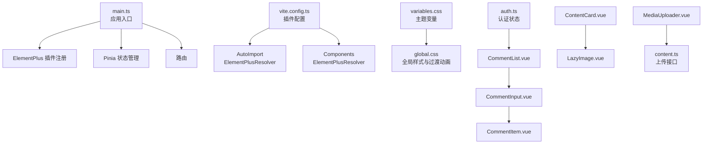
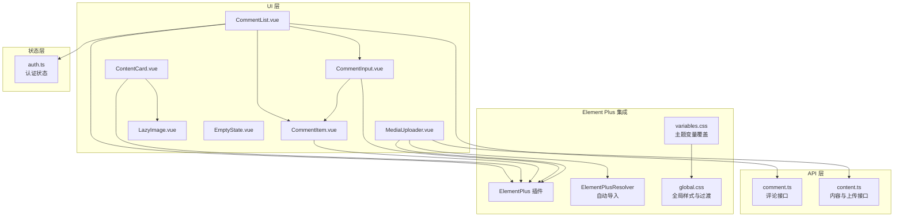
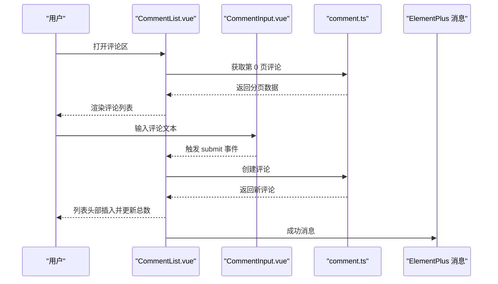
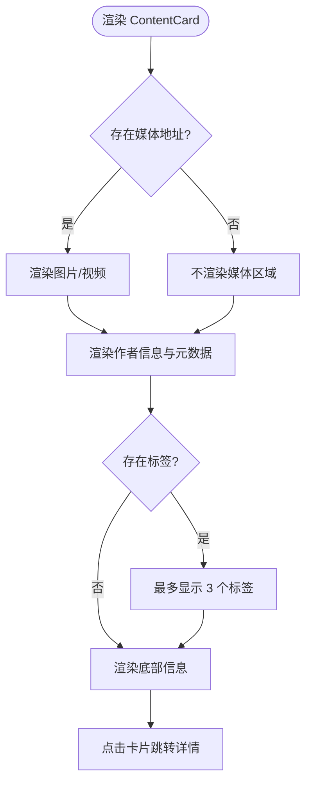
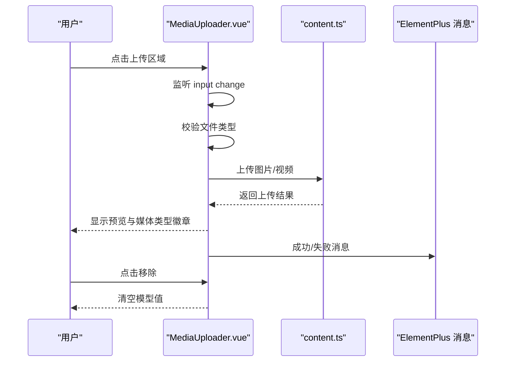
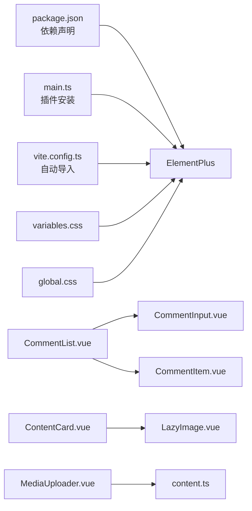

# UI 组件设计

<cite>
**本文引用的文件**
- [package.json](file://communication-frontend/package.json)
- [main.ts](file://communication-frontend/src/main.ts)
- [vite.config.ts](file://communication-frontend/vite.config.ts)
- [variables.css](file://communication-frontend/src/styles/variables.css)
- [global.css](file://communication-frontend/src/styles/global.css)
- [CommentInput.vue](file://communication-frontend/src/components/comment/CommentInput.vue)
- [CommentItem.vue](file://communication-frontend/src/components/comment/CommentItem.vue)
- [CommentList.vue](file://communication-frontend/src/components/comment/CommentList.vue)
- [ContentCard.vue](file://communication-frontend/src/components/content/ContentCard.vue)
- [MediaUploader.vue](file://communication-frontend/src/components/content/MediaUploader.vue)
- [LazyImage.vue](file://communication-frontend/src/components/common/LazyImage.vue)
- [EmptyState.vue](file://communication-frontend/src/components/common/EmptyState.vue)
- [auth.ts](file://communication-frontend/src/stores/auth.ts)
- [comment.ts](file://communication-frontend/src/api/comment.ts)
- [content.ts](file://communication-frontend/src/api/content.ts)
</cite>

## 目录
1. [引言](#引言)
2. [项目结构](#项目结构)
3. [核心组件](#核心组件)
4. [架构总览](#架构总览)
5. [组件详解](#组件详解)
6. [依赖关系分析](#依赖关系分析)
7. [性能考量](#性能考量)
8. [故障排查指南](#故障排查指南)
9. [结论](#结论)
10. [附录](#附录)

## 引言
本设计文档聚焦于前端 UI 组件的设计与实现，系统梳理 Element Plus 在本项目中的集成与定制化使用，阐述业务组件的设计原则（语义化标签、可访问性、响应式设计），总结表单组件的设计模式（输入验证、错误处理、用户体验优化），解释列表组件的实现（无限滚动、虚拟滚动与数据加载策略），并给出组件样式管理方案（CSS 变量、主题定制、样式隔离）。最后通过评论组件、内容卡片与媒体上传组件的实际示例，说明可测试性设计与自动化测试策略。

## 项目结构
前端采用 Vue 3 + Vite 架构，Element Plus 作为基础 UI 库，并通过自动导入与组件解析器按需引入图标与组件，减少样板代码。全局样式通过 CSS 变量统一主题，组件内样式采用作用域隔离，确保样式边界清晰。

**图表来源**
- [main.ts](file://communication-frontend/src/main.ts#L1-L17)
- [vite.config.ts](file://communication-frontend/vite.config.ts#L1-L40)
- [variables.css](file://communication-frontend/src/styles/variables.css#L1-L65)
- [global.css](file://communication-frontend/src/styles/global.css#L1-L298)
- [CommentInput.vue](file://communication-frontend/src/components/comment/CommentInput.vue#L1-L84)
- [CommentItem.vue](file://communication-frontend/src/components/comment/CommentItem.vue#L1-L220)
- [CommentList.vue](file://communication-frontend/src/components/comment/CommentList.vue#L1-L208)
- [ContentCard.vue](file://communication-frontend/src/components/content/ContentCard.vue#L1-L244)
- [LazyImage.vue](file://communication-frontend/src/components/common/LazyImage.vue#L1-L132)
- [MediaUploader.vue](file://communication-frontend/src/components/content/MediaUploader.vue#L1-L201)
- [content.ts](file://communication-frontend/src/api/content.ts#L1-L114)
- [auth.ts](file://communication-frontend/src/stores/auth.ts#L1-L96)

**章节来源**
- [package.json](file://communication-frontend/package.json#L1-L36)
- [main.ts](file://communication-frontend/src/main.ts#L1-L17)
- [vite.config.ts](file://communication-frontend/vite.config.ts#L1-L40)

## 核心组件
- 表单组件：评论输入框（CommentInput）用于用户输入与提交，支持字数限制、禁用态、加载态与清空暴露。
- 列表组件：评论列表（CommentList）负责分页加载、新增评论、回复与删除；评论项（CommentItem）负责渲染与权限控制。
- 内容展示组件：内容卡片（ContentCard）负责标题、摘要、标签、作者信息与元数据展示；懒加载图片（LazyImage）负责占位与延迟加载。
- 媒体上传组件：媒体上传器（MediaUploader）负责图片/视频选择、预览、进度与上传结果反馈。
- 公共组件：空状态（EmptyState）用于无数据场景的统一提示与操作槽位。

**章节来源**
- [CommentInput.vue](file://communication-frontend/src/components/comment/CommentInput.vue#L1-L84)
- [CommentItem.vue](file://communication-frontend/src/components/comment/CommentItem.vue#L1-L220)
- [CommentList.vue](file://communication-frontend/src/components/comment/CommentList.vue#L1-L208)
- [ContentCard.vue](file://communication-frontend/src/components/content/ContentCard.vue#L1-L244)
- [LazyImage.vue](file://communication-frontend/src/components/common/LazyImage.vue#L1-L132)
- [MediaUploader.vue](file://communication-frontend/src/components/content/MediaUploader.vue#L1-L201)
- [EmptyState.vue](file://communication-frontend/src/components/common/EmptyState.vue#L1-L76)

## 架构总览
下图展示了前端 UI 层与状态层、API 层的交互关系，以及 Element Plus 的集成方式与样式覆盖路径。

**图表来源**
- [CommentInput.vue](file://communication-frontend/src/components/comment/CommentInput.vue#L1-L84)
- [CommentItem.vue](file://communication-frontend/src/components/comment/CommentItem.vue#L1-L220)
- [CommentList.vue](file://communication-frontend/src/components/comment/CommentList.vue#L1-L208)
- [ContentCard.vue](file://communication-frontend/src/components/content/ContentCard.vue#L1-L244)
- [LazyImage.vue](file://communication-frontend/src/components/common/LazyImage.vue#L1-L132)
- [MediaUploader.vue](file://communication-frontend/src/components/content/MediaUploader.vue#L1-L201)
- [auth.ts](file://communication-frontend/src/stores/auth.ts#L1-L96)
- [comment.ts](file://communication-frontend/src/api/comment.ts#L1-L50)
- [content.ts](file://communication-frontend/src/api/content.ts#L1-L114)
- [main.ts](file://communication-frontend/src/main.ts#L1-L17)
- [vite.config.ts](file://communication-frontend/vite.config.ts#L1-L40)
- [variables.css](file://communication-frontend/src/styles/variables.css#L1-L65)
- [global.css](file://communication-frontend/src/styles/global.css#L1-L298)

## 组件详解

### 评论组件体系
- 设计原则
  - 语义化标签：使用 header、footer、article 结构化的容器，配合 router-link 提升导航可读性。
  - 可访问性：按钮与链接具备焦点可见轮廓；头像与作者名支持键盘导航；时间格式本地化。
  - 响应式设计：在小屏设备上调整卡片间距、按钮尺寸与文字大小，隐藏移动端不必要元素。
- 输入与提交
  - 支持字数限制与字符数显示；禁用态基于输入是否为空；加载态避免重复提交。
- 权限与删除
  - 仅内容作者或评论作者可删除；删除前二次确认，删除成功后更新总数与列表。
- 回复机制
  - 子组件暴露事件，父组件集中处理，保持数据流清晰。

**图表来源**
- [CommentList.vue](file://communication-frontend/src/components/comment/CommentList.vue#L68-L108)
- [CommentInput.vue](file://communication-frontend/src/components/comment/CommentInput.vue#L25-L58)
- [comment.ts](file://communication-frontend/src/api/comment.ts#L35-L48)

**章节来源**
- [CommentInput.vue](file://communication-frontend/src/components/comment/CommentInput.vue#L1-L84)
- [CommentItem.vue](file://communication-frontend/src/components/comment/CommentItem.vue#L1-L220)
- [CommentList.vue](file://communication-frontend/src/components/comment/CommentList.vue#L1-L208)
- [comment.ts](file://communication-frontend/src/api/comment.ts#L1-L50)

### 内容卡片组件
- 设计原则
  - 语义化：卡片作为可点击容器，内部使用 header、footer 区分结构。
  - 可访问性：头像与作者名支持 hover 与键盘访问；标签点击跳转搜索。
  - 响应式：在小屏设备上缩小内边距与字体，保证可读性。
- 媒体类型与图标：根据媒体类型动态选择图标与标签颜色。
- 截断与展开：正文超过长度时截断并显示省略号，提升信息密度。

**图表来源**
- [ContentCard.vue](file://communication-frontend/src/components/content/ContentCard.vue#L1-L244)

**章节来源**
- [ContentCard.vue](file://communication-frontend/src/components/content/ContentCard.vue#L1-L244)

### 媒体上传组件
- 设计原则
  - 语义化：上传区域为 label，隐藏 input，提升可访问性。
  - 可访问性：禁用态禁用交互；上传中显示进度条与提示。
  - 响应式：在小屏设备上保持足够的点击面积与视觉反馈。
- 功能流程
  - 文件选择：限制图片与视频类型；设置 FormData 并调用上传接口。
  - 预览与移除：根据媒体类型渲染图片或视频；支持一键移除。
  - 错误处理：捕获响应错误并弹出消息提示。

**图表来源**
- [MediaUploader.vue](file://communication-frontend/src/components/content/MediaUploader.vue#L25-L63)
- [content.ts](file://communication-frontend/src/api/content.ts#L98-L112)

**章节来源**
- [MediaUploader.vue](file://communication-frontend/src/components/content/MediaUploader.vue#L1-L201)
- [content.ts](file://communication-frontend/src/api/content.ts#L1-L114)

### 懒加载图片组件
- 设计原则
  - 性能优先：使用 IntersectionObserver 在进入视口时再加载真实图片，降低首屏压力。
  - 可访问性：提供占位与加载动画，错误时显示默认图标。
  - 响应式：通过 aspect-ratio 保持容器比例，避免布局抖动。
- 实现要点
  - 容器计算样式绑定宽高比；加载完成与错误状态切换；卸载时清理观察器。

**章节来源**
- [LazyImage.vue](file://communication-frontend/src/components/common/LazyImage.vue#L1-L132)

### 空状态组件
- 设计原则
  - 一致性：统一图标、标题与描述的排版，支持自定义动作区域。
  - 可扩展：通过插槽与属性组合，适配不同场景（搜索、用户、评论等）。
- 使用建议
  - 在列表为空时统一展示，避免空白页面带来的困惑。

**章节来源**
- [EmptyState.vue](file://communication-frontend/src/components/common/EmptyState.vue#L1-L76)

## 依赖关系分析
- Element Plus 集成
  - 插件注册：在应用入口安装 Element Plus，确保全局可用。
  - 自动导入：通过 AutoImport 与 Components + ElementPlusResolver，自动解析图标与组件，减少手动引入。
- 主题与样式
  - CSS 变量：variables.css 定义品牌色、背景、阴影与圆角，并映射到 Element Plus 主题变量。
  - 全局样式：global.css 统一字体、过渡动画、按钮与表单样式增强，提供通用类名工具。
- 组件间耦合
  - CommentList 与 CommentItem 通过事件与属性解耦；MediaUploader 与 content.ts 通过接口解耦。
  - LazyImage 与 ContentCard 解耦，便于复用。

**图表来源**
- [package.json](file://communication-frontend/package.json#L15-L21)
- [main.ts](file://communication-frontend/src/main.ts#L3-L14)
- [vite.config.ts](file://communication-frontend/vite.config.ts#L11-L19)
- [variables.css](file://communication-frontend/src/styles/variables.css#L52-L64)
- [global.css](file://communication-frontend/src/styles/global.css#L75-L100)
- [CommentList.vue](file://communication-frontend/src/components/comment/CommentList.vue#L50-L53)
- [CommentInput.vue](file://communication-frontend/src/components/comment/CommentInput.vue#L3-L10)
- [CommentItem.vue](file://communication-frontend/src/components/comment/CommentItem.vue#L82-L84)
- [ContentCard.vue](file://communication-frontend/src/components/content/ContentCard.vue#L5-L5)
- [LazyImage.vue](file://communication-frontend/src/components/common/LazyImage.vue#L26-L27)
- [MediaUploader.vue](file://communication-frontend/src/components/content/MediaUploader.vue#L3-L4)
- [content.ts](file://communication-frontend/src/api/content.ts#L1-L114)

**章节来源**
- [package.json](file://communication-frontend/package.json#L1-L36)
- [main.ts](file://communication-frontend/src/main.ts#L1-L17)
- [vite.config.ts](file://communication-frontend/vite.config.ts#L1-L40)
- [variables.css](file://communication-frontend/src/styles/variables.css#L1-L65)
- [global.css](file://communication-frontend/src/styles/global.css#L1-L298)

## 性能考量
- 列表加载策略
  - 无限滚动：CommentList 已实现“加载更多”按钮，适合中小规模数据；对于大规模数据可考虑虚拟滚动（当前未实现，建议后续引入）。
  - 数据缓存：首次加载重置页码与列表，后续追加内容，减少重复请求。
- 图片加载
  - 懒加载：LazyImage 使用 IntersectionObserver 延迟加载，降低初始资源消耗。
  - 占位与骨架：列表加载时使用骨架屏，提升感知性能。
- 主题与样式
  - CSS 变量集中管理，减少重复样式与重绘；Element Plus 主题变量映射避免全量覆盖。
- 组件体积
  - 自动导入与按需解析减少打包体积，避免全局引入导致的冗余。

[本节为通用指导，无需具体文件引用]

## 故障排查指南
- 评论相关
  - 加载失败：检查网络代理与后端接口；查看消息提示与错误日志。
  - 删除异常：确认删除权限与后端返回状态；注意回复与主评论的索引定位。
- 上传相关
  - 类型不符：确保只上传图片或视频；错误时清空 input 并提示。
  - 上传失败：捕获响应消息并弹出提示；重置上传状态。
- 认证相关
  - 登录/注册失败：查看消息提示与后端返回信息；确认本地存储 token 与 user 的同步。
- 可访问性
  - 焦点问题：确保按钮与链接具备可见焦点；避免仅靠颜色区分状态。
  - 屏幕阅读器：为图片提供 alt 文本；为交互元素提供语义化标签。

**章节来源**
- [CommentList.vue](file://communication-frontend/src/components/comment/CommentList.vue#L84-L88)
- [MediaUploader.vue](file://communication-frontend/src/components/content/MediaUploader.vue#L50-L57)
- [auth.ts](file://communication-frontend/src/stores/auth.ts#L27-L33)

## 结论
本项目以 Element Plus 为基础，结合自动导入与主题变量，实现了统一且可扩展的 UI 组件体系。评论组件体现了完整的 CRUD 流程与权限控制，内容卡片与媒体上传组件兼顾了可访问性与响应式设计。未来可在大规模列表场景引入虚拟滚动，在测试方面完善单元测试与端到端测试覆盖率，持续提升用户体验与工程稳定性。

[本节为总结，无需具体文件引用]

## 附录
- 组件样式管理方案
  - CSS 变量：集中定义品牌色、背景、阴影与圆角，映射至 Element Plus 主题变量，确保全局一致。
  - 全局样式：统一字体、过渡动画与按钮增强，提供通用类名工具，简化组件样式编写。
  - 样式隔离：组件内样式使用 scoped，避免跨组件污染；必要时使用深度选择器覆盖第三方组件。
- 表单设计模式
  - 输入验证：结合 Element Plus 表单校验与业务规则；在提交前进行必填与格式校验。
  - 错误处理：统一的消息提示与错误回显；在加载态与禁用态之间切换，避免重复提交。
  - 用户体验：提供字数限制、加载指示、成功反馈与可撤销操作。
- 列表实现策略
  - 无限滚动：通过“加载更多”按钮实现分页加载；在数据量大时考虑虚拟滚动。
  - 虚拟滚动：使用专用库实现长列表高性能渲染（建议后续引入）。
  - 数据加载：首屏骨架屏 + 懒加载图片，提升感知性能。
- 可测试性设计与自动化测试
  - 单元测试：对组件逻辑（如时间格式化、权限判断）进行独立测试。
  - 端到端测试：使用 Playwright 对关键流程（登录、发布内容、上传媒体）进行回归测试。
  - 状态测试：对 Pinia store 的状态变更与副作用进行测试。

[本节为通用指导，无需具体文件引用]