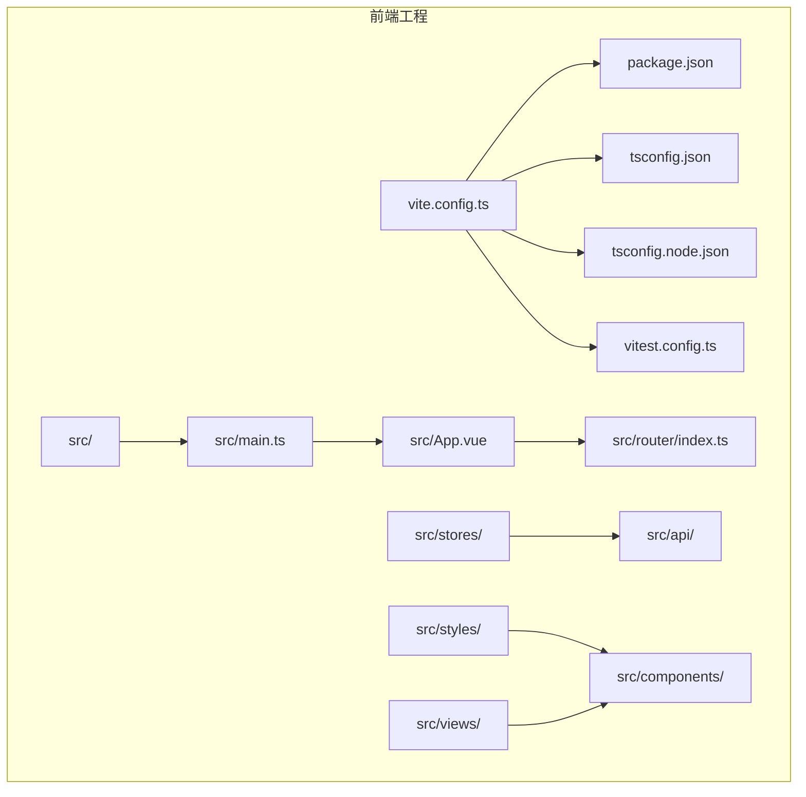
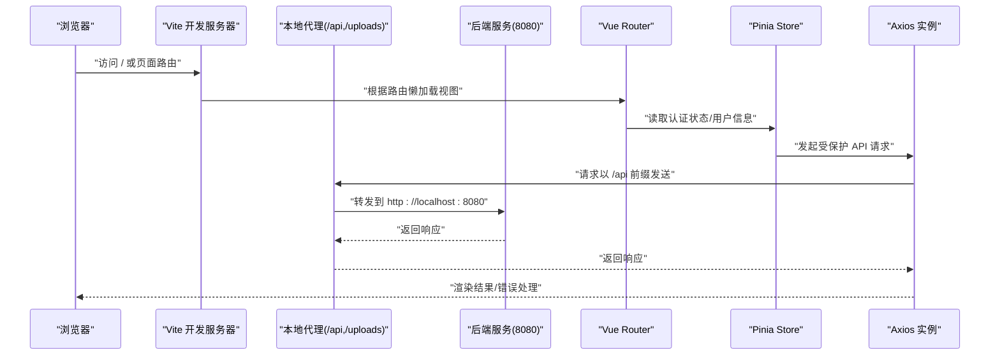
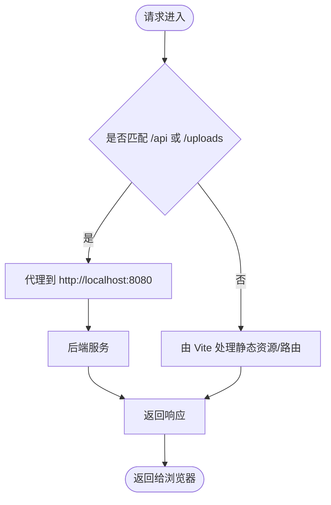
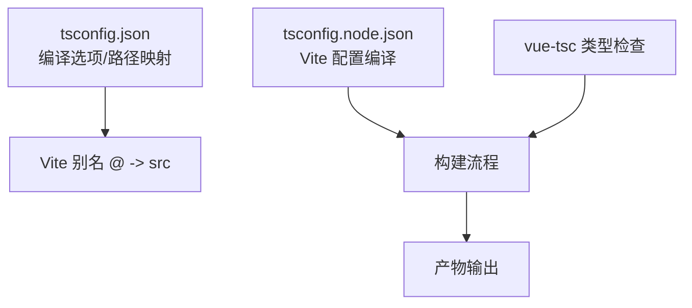
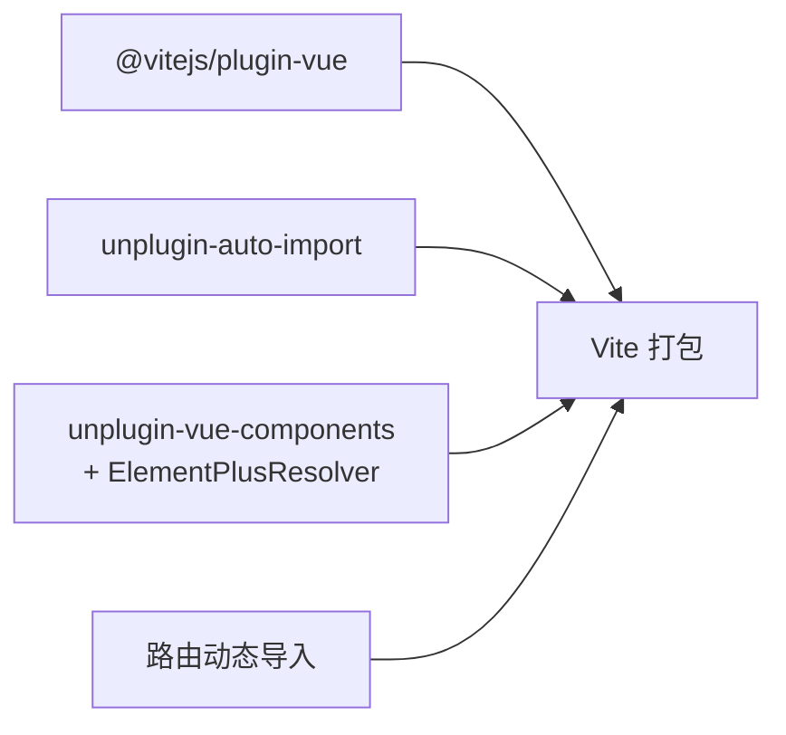
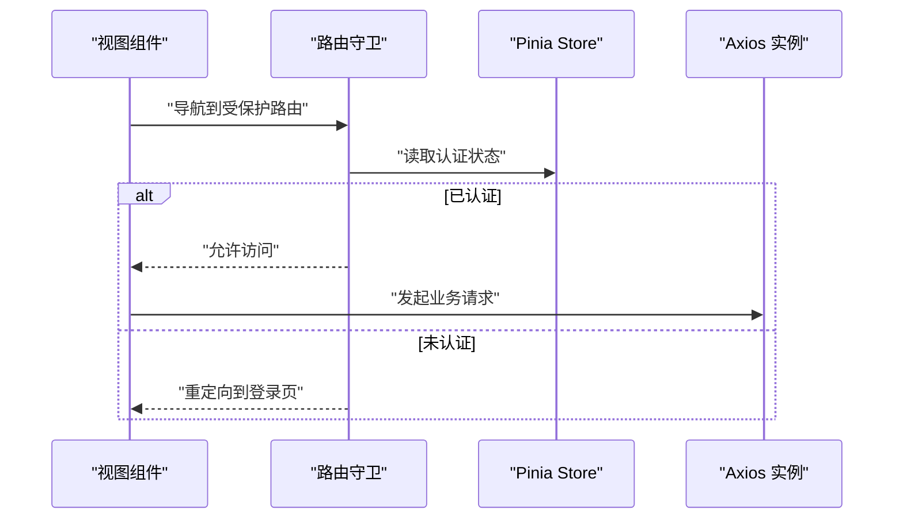
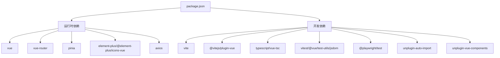

# Vite 构建工具配置

<cite>
**本文引用的文件**
- [vite.config.ts](file://communication-frontend/vite.config.ts)
- [package.json](file://communication-frontend/package.json)
- [tsconfig.json](file://communication-frontend/tsconfig.json)
- [tsconfig.node.json](file://communication-frontend/tsconfig.node.json)
- [vitest.config.ts](file://communication-frontend/vitest.config.ts)
- [main.ts](file://communication-frontend/src/main.ts)
- [App.vue](file://communication-frontend/src/App.vue)
- [router/index.ts](file://communication-frontend/src/router/index.ts)
- [stores/auth.ts](file://communication-frontend/src/stores/auth.ts)
- [api/http.ts](file://communication-frontend/src/api/http.ts)
- [styles/variables.css](file://communication-frontend/src/styles/variables.css)
- [styles/global.css](file://communication-frontend/src/styles/global.css)
- [views/HomeView.vue](file://communication-frontend/src/views/HomeView.vue)
- [components/layout/AppHeader.vue](file://communication-frontend/src/components/layout/AppHeader.vue)
- [api/auth.ts](file://communication-frontend/src/api/auth.ts)
</cite>

## 目录
1. [简介](#简介)
2. [项目结构](#项目结构)
3. [核心组件](#核心组件)
4. [架构总览](#架构总览)
5. [详细组件分析](#详细组件分析)
6. [依赖关系分析](#依赖关系分析)
7. [性能考量](#性能考量)
8. [故障排查指南](#故障排查指南)
9. [结论](#结论)
10. [附录](#附录)

## 简介
本文件面向使用 Vite 的前端团队与个人开发者，系统化梳理该通信平台前端工程的构建配置与优化策略。内容覆盖开发服务器与代理、热模块替换（HMR）、TypeScript 集成、插件体系（Vue 插件、自动导入与组件解析）、构建优化（代码分割、Tree Shaking、资源压缩）以及生产环境最佳实践（打包优化、缓存与 CDN）。同时提供可直接定位到源码的路径指引与常见问题解决方案，帮助提升开发体验与构建性能。

## 项目结构
前端工程位于 communication-frontend 目录，采用 Vue 3 + TypeScript + Vite 技术栈，结合 Pinia 状态管理、Element Plus 组件库与路由懒加载实现单页应用（SPA）。构建配置集中在 vite.config.ts，TypeScript 编译配置在 tsconfig.json 与 tsconfig.node.json 中，测试配置在 vitest.config.ts。

图表来源
- [vite.config.ts](file://communication-frontend/vite.config.ts#L1-L40)
- [package.json](file://communication-frontend/package.json#L1-L36)
- [tsconfig.json](file://communication-frontend/tsconfig.json#L1-L26)
- [tsconfig.node.json](file://communication-frontend/tsconfig.node.json#L1-L12)
- [vitest.config.ts](file://communication-frontend/vitest.config.ts#L1-L18)
- [main.ts](file://communication-frontend/src/main.ts#L1-L17)
- [App.vue](file://communication-frontend/src/App.vue#L1-L30)
- [router/index.ts](file://communication-frontend/src/router/index.ts#L1-L98)
- [stores/auth.ts](file://communication-frontend/src/stores/auth.ts#L1-L96)
- [api/http.ts](file://communication-frontend/src/api/http.ts#L1-L66)
- [styles/variables.css](file://communication-frontend/src/styles/variables.css#L1-L65)
- [styles/global.css](file://communication-frontend/src/styles/global.css#L1-L298)
- [views/HomeView.vue](file://communication-frontend/src/views/HomeView.vue#L1-L96)
- [components/layout/AppHeader.vue](file://communication-frontend/src/components/layout/AppHeader.vue#L1-L347)

章节来源
- [vite.config.ts](file://communication-frontend/vite.config.ts#L1-L40)
- [package.json](file://communication-frontend/package.json#L1-L36)
- [tsconfig.json](file://communication-frontend/tsconfig.json#L1-L26)
- [tsconfig.node.json](file://communication-frontend/tsconfig.node.json#L1-L12)
- [vitest.config.ts](file://communication-frontend/vitest.config.ts#L1-L18)

## 核心组件
- 开发服务器与代理：通过 server 字段配置端口与本地代理规则，将 /api 与 /uploads 请求转发至后端服务，便于前后端联调。
- 插件体系：启用 @vitejs/plugin-vue、unplugin-auto-import 与 unplugin-vue-components，并集成 ElementPlusResolver，实现自动导入与按需组件解析。
- 路径别名：通过 resolve.alias 将 @ 指向 src 目录，简化导入路径。
- TypeScript 配置：严格模式、ESNext 模块解析、bundler 解析器、路径映射等，确保类型安全与模块解析正确性。
- 测试配置：Vitest 使用 jsdom 环境，全局启用并配置别名，保证单元测试与组件测试的一致性。

章节来源
- [vite.config.ts](file://communication-frontend/vite.config.ts#L8-L39)
- [tsconfig.json](file://communication-frontend/tsconfig.json#L1-L26)
- [tsconfig.node.json](file://communication-frontend/tsconfig.node.json#L1-L12)
- [vitest.config.ts](file://communication-frontend/vitest.config.ts#L5-L17)

## 架构总览
下图展示从浏览器请求到后端 API 的典型交互链路，包括开发时的代理转发与运行时的路由守卫、状态管理与 API 调用。

图表来源
- [vite.config.ts](file://communication-frontend/vite.config.ts#L26-L38)
- [router/index.ts](file://communication-frontend/src/router/index.ts#L76-L95)
- [stores/auth.ts](file://communication-frontend/src/stores/auth.ts#L59-L82)
- [api/http.ts](file://communication-frontend/src/api/http.ts#L5-L11)

## 详细组件分析

### 开发服务器与代理配置
- 端口：默认 5173，可通过 server.port 自定义。
- 代理：
  - /api → http://localhost:8080
  - /uploads → http://localhost:8080
- 作用：开发阶段避免跨域，统一后端地址，便于联调。

图表来源
- [vite.config.ts](file://communication-frontend/vite.config.ts#L26-L38)

章节来源
- [vite.config.ts](file://communication-frontend/vite.config.ts#L26-L38)

### 热模块替换（HMR）
- Vite 默认启用 HMR，修改组件、样式或脚本会触发局部刷新，保持应用状态不变。
- 在 Element Plus 主题变量与全局样式变更时，建议观察 HMR 行为，必要时重启开发服务器以确保主题一致性。

章节来源
- [styles/variables.css](file://communication-frontend/src/styles/variables.css#L52-L64)
- [styles/global.css](file://communication-frontend/src/styles/global.css#L1-L298)

### TypeScript 集成配置
- 编译目标与模块：ES2020、ESNext，配合 bundler 解析器与 noEmit，确保 Vite 按需打包。
- 路径映射：baseUrl 与 paths["@/*"] 指向 src/*，与 Vite 别名保持一致。
- 参考 tsconfig.node.json：用于 Vite 配置文件的编译，启用 ESNext 模块解析与严格模式。
- 类型检查：通过 vue-tsc 进行类型检查，构建前执行以提前发现类型问题。

图表来源
- [tsconfig.json](file://communication-frontend/tsconfig.json#L18-L22)
- [tsconfig.node.json](file://communication-frontend/tsconfig.node.json#L2-L10)
- [vite.config.ts](file://communication-frontend/vite.config.ts#L21-L25)

章节来源
- [tsconfig.json](file://communication-frontend/tsconfig.json#L1-L26)
- [tsconfig.node.json](file://communication-frontend/tsconfig.node.json#L1-L12)
- [package.json](file://communication-frontend/package.json#L8-L13)

### 插件系统与 Element Plus 集成
- Vue 插件：@vitejs/plugin-vue 提供 SFC 编译与 HMR 支持。
- 自动导入：unplugin-auto-import 按需导入 vue、vue-router、pinia，生成声明文件，减少样板代码。
- 组件自动解析：unplugin-vue-components 结合 ElementPlusResolver，自动注册 Element Plus 组件，降低手动引入成本。
- 路由懒加载：路由表中使用动态导入实现代码分割，结合 Vite 的动态 import，天然支持 Tree Shaking。

图表来源
- [vite.config.ts](file://communication-frontend/vite.config.ts#L9-L20)
- [router/index.ts](file://communication-frontend/src/router/index.ts#L10-L72)

章节来源
- [vite.config.ts](file://communication-frontend/vite.config.ts#L1-L40)
- [router/index.ts](file://communication-frontend/src/router/index.ts#L1-L98)

### 路由与状态管理
- 路由守卫：在 beforeEach 中更新标题、处理游客页面与认证路由跳转，保障用户体验与安全。
- Pinia 状态：集中管理认证状态、用户信息与加载状态；与 Element Plus 消息提示配合，提供良好的反馈。
- API 层：基于 axios 创建实例，统一拦截器处理鉴权头与错误提示，简化业务层调用。

图表来源
- [router/index.ts](file://communication-frontend/src/router/index.ts#L76-L95)
- [stores/auth.ts](file://communication-frontend/src/stores/auth.ts#L6-L11)
- [api/http.ts](file://communication-frontend/src/api/http.ts#L14-L25)

章节来源
- [router/index.ts](file://communication-frontend/src/router/index.ts#L1-L98)
- [stores/auth.ts](file://communication-frontend/src/stores/auth.ts#L1-L96)
- [api/http.ts](file://communication-frontend/src/api/http.ts#L1-L66)

### 样式与主题
- 全局变量：variables.css 定义品牌色板与 Element Plus 主题变量，统一视觉风格。
- 全局样式：global.css 提供通用排版、动画与响应式断点，确保组件样式一致性。
- 组件样式：scoped 样式与全局样式的协同，避免样式冲突并提升可维护性。

章节来源
- [styles/variables.css](file://communication-frontend/src/styles/variables.css#L1-L65)
- [styles/global.css](file://communication-frontend/src/styles/global.css#L1-L298)
- [components/layout/AppHeader.vue](file://communication-frontend/src/components/layout/AppHeader.vue#L180-L347)
- [views/HomeView.vue](file://communication-frontend/src/views/HomeView.vue#L46-L96)

### 测试配置
- Vitest：使用 jsdom 环境，全局启用，包含别名配置，保证组件与工具函数测试的一致性。
- 单元测试：store 与工具函数可在 jsdom 环境下快速验证。
- 端到端测试：Playwright 配置独立于 Vite，可与 Vite 测试并行运行。

章节来源
- [vitest.config.ts](file://communication-frontend/vitest.config.ts#L5-L17)
- [package.json](file://communication-frontend/package.json#L10-L13)

## 依赖关系分析
- 构建脚本：dev、build、preview、test:unit、test:e2e、lint、type-check。
- 运行时依赖：vue、vue-router、pinia、element-plus、@element-plus/icons-vue、axios。
- 开发依赖：@vitejs/plugin-vue、typescript、vite、vue-tsc、vitest、@vue/test-utils、jsdom、@playwright/test、unplugin-auto-import、unplugin-vue-components。

图表来源
- [package.json](file://communication-frontend/package.json#L15-L34)

章节来源
- [package.json](file://communication-frontend/package.json#L1-L36)

## 性能考量
- 代码分割与 Tree Shaking
  - 路由懒加载：通过动态导入实现按需加载，天然支持 Tree Shaking，减少首屏体积。
  - 插件自动导入：仅导入实际使用的 API，避免冗余代码。
- 资源优化
  - 生产构建时建议开启压缩与资源内联策略，结合 CDN 与缓存头，提升加载速度。
  - CSS 与图片资源建议进行压缩与格式优化（如 WebP），并合理使用懒加载。
- 开发体验
  - 合理配置代理，避免不必要的网络往返。
  - 使用 HMR 与类型检查前置，缩短反馈周期。
- 缓存与 CDN
  - 对静态资源启用长期缓存，对入口 HTML 设置较短缓存或不缓存。
  - CDN 分发静态资源，结合版本号或内容哈希命名，确保缓存失效可控。

## 故障排查指南
- 代理无效或 404
  - 检查代理前缀与后端地址是否一致，确认 /api 与 /uploads 是否命中代理规则。
  - 确认后端 CORS 配置允许本地开发域名。
- 路由跳转异常
  - 检查路由守卫逻辑与 meta 字段，确保受保护路由与游客路由的判断正确。
- 类型错误
  - 使用 vue-tsc --noEmit 进行类型检查，修复编译错误后再进行构建。
- 样式主题不生效
  - 确认 Element Plus 主题变量已在 :root 中正确覆盖，且样式加载顺序正确。
- HMR 不生效
  - 修改组件或样式后观察局部刷新；若异常，尝试清理缓存或重启开发服务器。

章节来源
- [vite.config.ts](file://communication-frontend/vite.config.ts#L26-L38)
- [router/index.ts](file://communication-frontend/src/router/index.ts#L76-L95)
- [tsconfig.json](file://communication-frontend/tsconfig.json#L1-L26)
- [styles/variables.css](file://communication-frontend/src/styles/variables.css#L52-L64)

## 结论
本项目基于 Vite 构建，结合 Vue 3 + TypeScript + Element Plus，形成了清晰的开发与构建体系。通过合理的代理配置、自动导入与组件解析、严格的 TypeScript 编译选项以及路由懒加载，既提升了开发效率，也为生产构建打下了良好基础。建议在生产环境中进一步完善缓存策略与 CDN 分发，并持续关注插件生态与 Vite 版本升级带来的性能改进。

## 附录
- 关键配置路径
  - Vite 配置：[vite.config.ts](file://communication-frontend/vite.config.ts#L1-L40)
  - TypeScript 根配置：[tsconfig.json](file://communication-frontend/tsconfig.json#L1-L26)
  - TypeScript Node 配置：[tsconfig.node.json](file://communication-frontend/tsconfig.node.json#L1-L12)
  - Vitest 配置：[vitest.config.ts](file://communication-frontend/vitest.config.ts#L1-L18)
  - 应用入口：[main.ts](file://communication-frontend/src/main.ts#L1-L17)
  - 根组件：[App.vue](file://communication-frontend/src/App.vue#L1-L30)
  - 路由：[router/index.ts](file://communication-frontend/src/router/index.ts#L1-L98)
  - 认证状态：[stores/auth.ts](file://communication-frontend/src/stores/auth.ts#L1-L96)
  - API 实例：[api/http.ts](file://communication-frontend/src/api/http.ts#L1-L66)
  - 主题变量：[styles/variables.css](file://communication-frontend/src/styles/variables.css#L1-L65)
  - 全局样式：[styles/global.css](file://communication-frontend/src/styles/global.css#L1-L298)
  - 首页视图：[views/HomeView.vue](file://communication-frontend/src/views/HomeView.vue#L1-L96)
  - 顶部导航：[components/layout/AppHeader.vue](file://communication-frontend/src/components/layout/AppHeader.vue#L1-L347)
  - 认证接口定义：[api/auth.ts](file://communication-frontend/src/api/auth.ts#L1-L49)