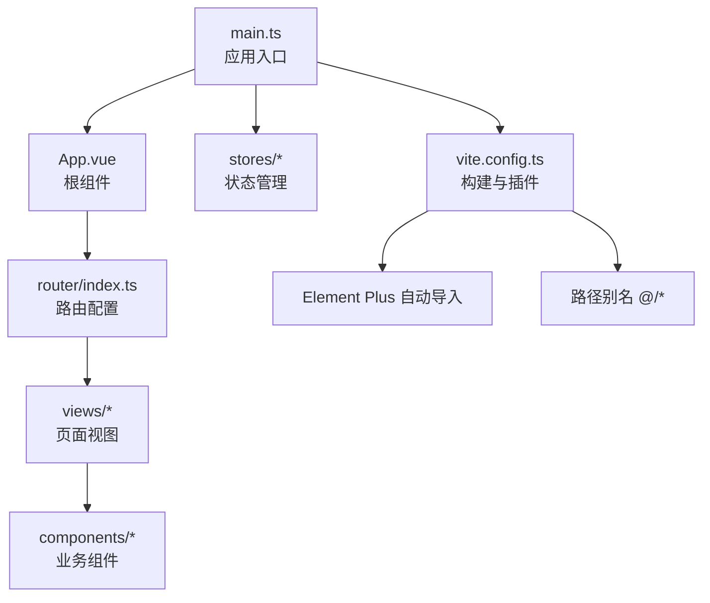
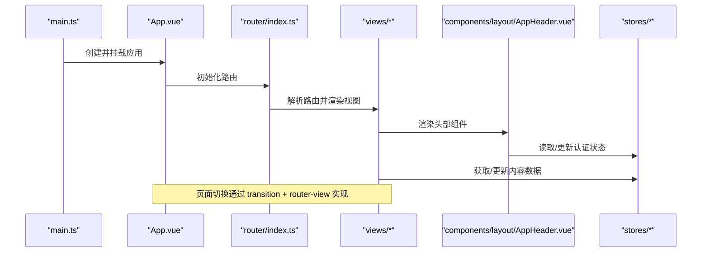
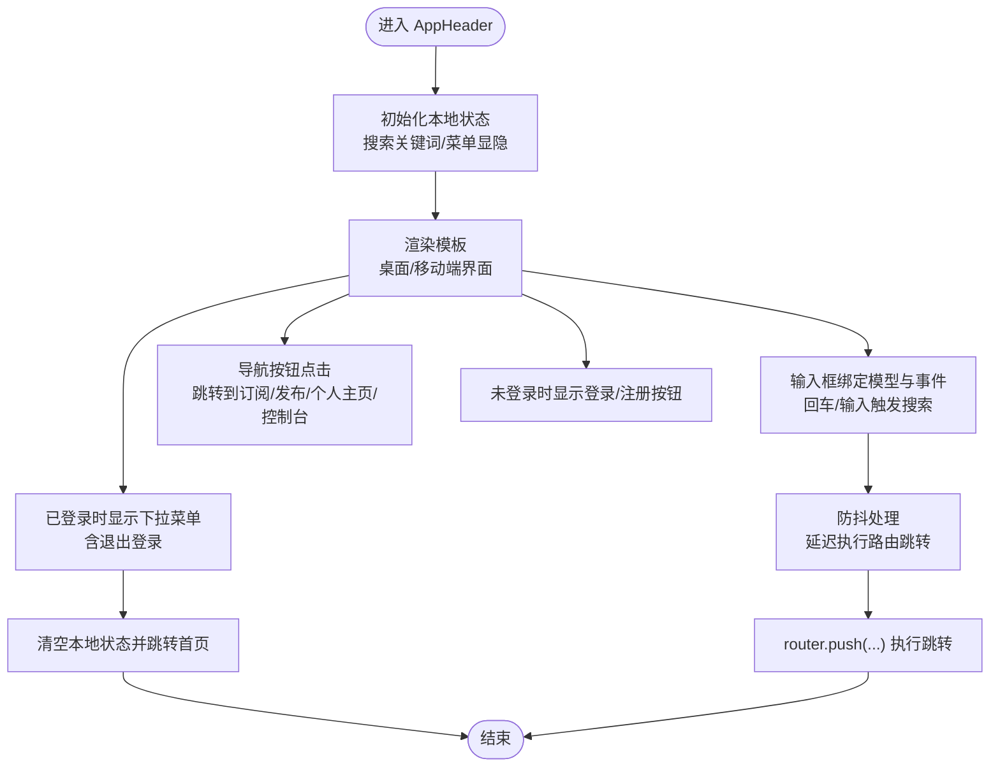
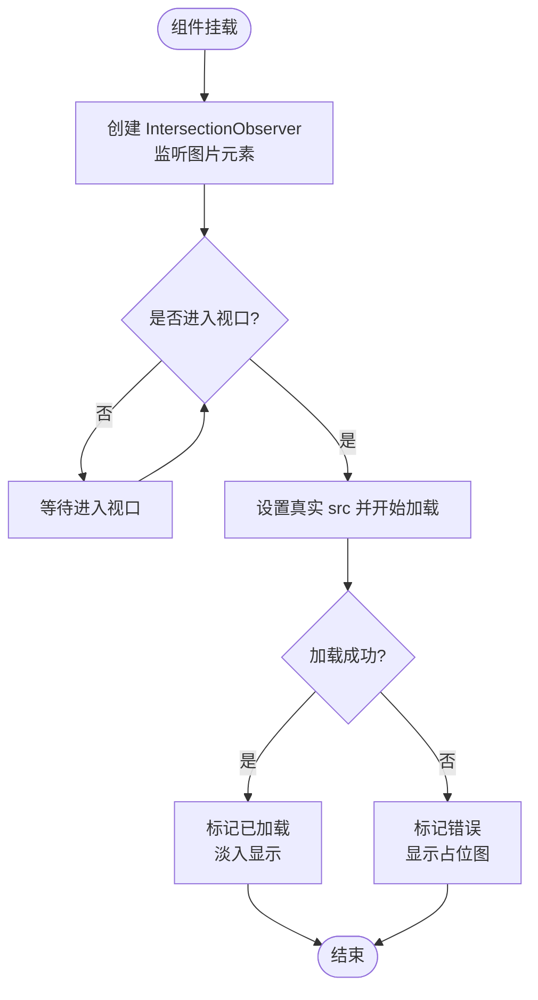
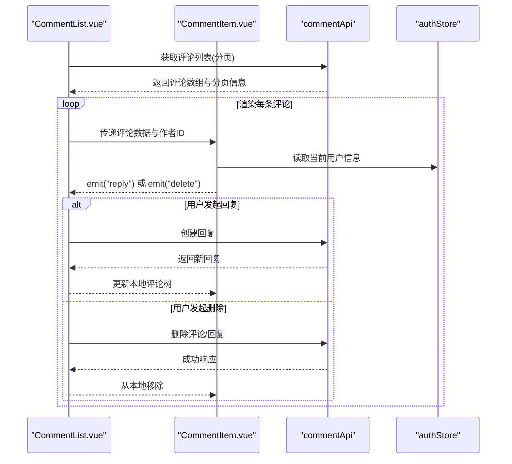
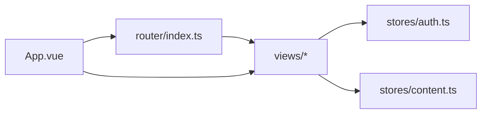
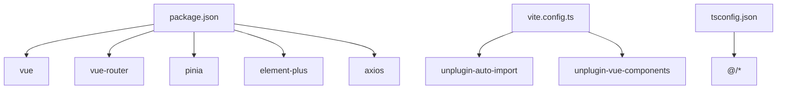

# Vue 3 组件系统

<cite>
**本文引用的文件**
- [App.vue](file://communication-frontend/src/App.vue)
- [main.ts](file://communication-frontend/src/main.ts)
- [package.json](file://communication-frontend/package.json)
- [vite.config.ts](file://communication-frontend/vite.config.ts)
- [tsconfig.json](file://communication-frontend/tsconfig.json)
- [router/index.ts](file://communication-frontend/src/router/index.ts)
- [stores/auth.ts](file://communication-frontend/src/stores/auth.ts)
- [stores/content.ts](file://communication-frontend/src/stores/content.ts)
- [components/layout/AppHeader.vue](file://communication-frontend/src/components/layout/AppHeader.vue)
- [components/common/LazyImage.vue](file://communication-frontend/src/components/common/LazyImage.vue)
- [views/HomeView.vue](file://communication-frontend/src/views/HomeView.vue)
- [components/comment/CommentList.vue](file://communication-frontend/src/components/comment/CommentList.vue)
- [components/comment/CommentItem.vue](file://communication-frontend/src/components/comment/CommentItem.vue)
</cite>

## 目录
1. [简介](#简介)
2. [项目结构](#项目结构)
3. [核心组件](#核心组件)
4. [架构总览](#架构总览)
5. [组件详细分析](#组件详细分析)
6. [依赖关系分析](#依赖关系分析)
7. [性能考虑](#性能考虑)
8. [故障排查指南](#故障排查指南)
9. [结论](#结论)
10. [附录](#附录)

## 简介
本文件面向希望深入理解并应用 Vue 3 组件系统的开发者，围绕 Composition API 的使用模式、组件设计原则、生命周期管理、props 与事件、插槽、组件间通信（父子、兄弟、跨层级）、可复用组件设计与最佳实践、以及性能优化策略（懒加载、虚拟滚动、组件缓存）进行系统化梳理，并结合仓库中的真实组件给出可操作的参考路径与图示。

## 项目结构
前端采用 Vite + Vue 3 + TypeScript + Pinia + Element Plus 技术栈，路由基于 vue-router。项目通过 Vite 插件自动导入 Element Plus 组件与图标，统一别名路径，开发环境代理后端服务。

图表来源
- [main.ts](file://communication-frontend/src/main.ts#L1-L17)
- [App.vue](file://communication-frontend/src/App.vue#L1-L30)
- [router/index.ts](file://communication-frontend/src/router/index.ts#L1-L98)
- [vite.config.ts](file://communication-frontend/vite.config.ts#L1-L40)

章节来源
- [main.ts](file://communication-frontend/src/main.ts#L1-L17)
- [package.json](file://communication-frontend/package.json#L1-L36)
- [vite.config.ts](file://communication-frontend/vite.config.ts#L1-L40)
- [tsconfig.json](file://communication-frontend/tsconfig.json#L1-L26)

## 核心组件
- 应用入口与全局配置：在入口文件中挂载应用、安装路由、状态管理与 UI 框架，统一注入全局样式。
- 根组件：承载页面骨架与路由视图容器，配合过渡动画实现页面切换体验。
- 路由层：集中定义页面路由、鉴权守卫与标题设置。
- 状态层：使用 Pinia 定义认证与内容相关状态，提供数据获取、分页与 CRUD 能力。
- 布局与通用组件：头部导航、图片懒加载等可复用组件。
- 视图与业务组件：首页视图、评论列表与评论项等。

章节来源
- [App.vue](file://communication-frontend/src/App.vue#L1-L30)
- [router/index.ts](file://communication-frontend/src/router/index.ts#L1-L98)
- [stores/auth.ts](file://communication-frontend/src/stores/auth.ts#L1-L96)
- [stores/content.ts](file://communication-frontend/src/stores/content.ts#L1-L150)
- [components/layout/AppHeader.vue](file://communication-frontend/src/components/layout/AppHeader.vue#L1-L347)
- [components/common/LazyImage.vue](file://communication-frontend/src/components/common/LazyImage.vue#L1-L132)
- [views/HomeView.vue](file://communication-frontend/src/views/HomeView.vue#L1-L96)

## 架构总览
下图展示应用启动、路由导航与状态管理之间的交互关系，体现 Composition API 在组件与状态层的协同工作方式。

图表来源
- [main.ts](file://communication-frontend/src/main.ts#L1-L17)
- [App.vue](file://communication-frontend/src/App.vue#L1-L30)
- [router/index.ts](file://communication-frontend/src/router/index.ts#L1-L98)
- [stores/auth.ts](file://communication-frontend/src/stores/auth.ts#L1-L96)
- [stores/content.ts](file://communication-frontend/src/stores/content.ts#L1-L150)

## 组件详细分析

### 头部导航组件（AppHeader）
- 设计要点
  - 使用 Composition API 管理本地状态（搜索关键词、移动端菜单显隐），调用路由与状态模块完成导航与登出。
  - 支持桌面端与移动端两种交互形态，移动端通过抽屉式弹层承载导航与搜索。
  - 搜索功能具备防抖逻辑，避免频繁路由跳转。
- 生命周期与事件
  - 在挂载阶段初始化本地状态；在卸载时清理定时器或观察者（如需）。
  - 通过事件绑定触发路由跳转、登出与搜索提交。
- 插槽与可复用性
  - 作为布局级组件，不暴露复杂插槽，通过属性控制行为（如是否显示发布按钮）。
- 通信机制
  - 与路由模块通信：通过路由实例进行页面跳转。
  - 与状态模块通信：读取认证状态与用户信息，执行登出操作。

图表来源
- [components/layout/AppHeader.vue](file://communication-frontend/src/components/layout/AppHeader.vue#L1-L347)

章节来源
- [components/layout/AppHeader.vue](file://communication-frontend/src/components/layout/AppHeader.vue#L1-L347)

### 图片懒加载组件（LazyImage）
- 设计要点
  - 通过 IntersectionObserver 判断元素进入视口后再加载真实图片，减少首屏资源消耗。
  - 提供占位图、加载动画与错误占位，提升用户体验。
  - 支持通过 props 设置宽高比、占位图与可选的 alt 文本。
- 生命周期与性能
  - 在挂载时建立观察器，在卸载时断开，避免内存泄漏。
  - 图片加载完成后切换透明度，配合 CSS 过渡实现平滑出现。
- 通信机制
  - 作为纯展示型组件，不直接依赖路由或状态，仅消费外部传入的图片地址与样式参数。

图表来源
- [components/common/LazyImage.vue](file://communication-frontend/src/components/common/LazyImage.vue#L1-L132)

章节来源
- [components/common/LazyImage.vue](file://communication-frontend/src/components/common/LazyImage.vue#L1-L132)

### 首页视图（HomeView）
- 设计要点
  - 根据认证状态决定欢迎区与“创建内容”按钮的显示。
  - 引入内容流组件用于展示最新内容。
- 通信机制
  - 与路由模块通信：根据登录状态跳转到注册/登录或创建内容页。
  - 与状态模块通信：读取认证状态以控制 UI 行为。

章节来源
- [views/HomeView.vue](file://communication-frontend/src/views/HomeView.vue#L1-L96)

### 评论列表与评论项（CommentList / CommentItem）
- 设计要点
  - 评论列表支持分页加载、新增评论、删除评论与回复嵌套。
  - 评论项负责渲染单条评论及其回复，计算删除权限并格式化时间。
- 生命周期与事件
  - 列表组件在挂载时拉取第一页评论；支持“加载更多”翻页。
  - 子组件通过自定义事件向上抛出回复与删除请求，父组件统一处理。
- 通信机制
  - 父子通信：列表向子项传递评论数据与作者 ID；子项通过事件向父级上报操作。
  - 与状态模块通信：读取认证状态以决定是否允许评论与删除。
  - 与 API 层通信：通过评论 API 完成增删改查。

图表来源
- [components/comment/CommentList.vue](file://communication-frontend/src/components/comment/CommentList.vue#L1-L208)
- [components/comment/CommentItem.vue](file://communication-frontend/src/components/comment/CommentItem.vue#L1-L220)

章节来源
- [components/comment/CommentList.vue](file://communication-frontend/src/components/comment/CommentList.vue#L1-L208)
- [components/comment/CommentItem.vue](file://communication-frontend/src/components/comment/CommentItem.vue#L1-L220)

### 根组件与路由、状态集成
- 根组件 App.vue
  - 通过 router-view 容器承载页面切换，并使用过渡动画提升体验。
- 路由守卫
  - 在导航前根据 meta 标记与认证状态进行重定向与标题设置。
- 状态管理
  - 认证状态与内容状态分别由 Pinia store 管理，提供异步数据获取与本地持久化能力。

图表来源
- [App.vue](file://communication-frontend/src/App.vue#L1-L30)
- [router/index.ts](file://communication-frontend/src/router/index.ts#L1-L98)
- [stores/auth.ts](file://communication-frontend/src/stores/auth.ts#L1-L96)
- [stores/content.ts](file://communication-frontend/src/stores/content.ts#L1-L150)

章节来源
- [App.vue](file://communication-frontend/src/App.vue#L1-L30)
- [router/index.ts](file://communication-frontend/src/router/index.ts#L1-L98)
- [stores/auth.ts](file://communication-frontend/src/stores/auth.ts#L1-L96)
- [stores/content.ts](file://communication-frontend/src/stores/content.ts#L1-L150)

## 依赖关系分析
- 构建与工具链
  - Vite 插件自动导入 Element Plus 组件与图标，减少手动引入成本。
  - 路径别名 @/* 统一解析，便于跨目录引用。
- 运行时依赖
  - Vue 3、vue-router、pinia、element-plus、axios 等构成前端核心生态。
- 开发与测试
  - Vitest、Playwright、TypeScript 类型检查保障质量。

图表来源
- [package.json](file://communication-frontend/package.json#L1-L36)
- [vite.config.ts](file://communication-frontend/vite.config.ts#L1-L40)
- [tsconfig.json](file://communication-frontend/tsconfig.json#L1-L26)

章节来源
- [package.json](file://communication-frontend/package.json#L1-L36)
- [vite.config.ts](file://communication-frontend/vite.config.ts#L1-L40)
- [tsconfig.json](file://communication-frontend/tsconfig.json#L1-L26)

## 性能考虑
- 懒加载
  - 图片懒加载：通过 IntersectionObserver 延迟加载真实图片，降低首屏压力。
  - 页面懒加载：路由按需加载视图组件，减少初始包体积。
- 组件缓存
  - 对于频繁切换但数据稳定的页面，可在路由层启用 keep-alive 缓存（建议在 router-view 外层包裹 keep-alive）。
- 虚拟滚动
  - 当列表数据量较大时，建议引入虚拟滚动方案（如基于第三方库）以降低 DOM 节点数量。
- 状态与网络
  - 使用 Pinia 管理局部状态，避免重复请求；对高频接口增加节流/防抖。
- 样式与资源
  - 使用 CSS 变量与 scoped 样式，避免全局污染；合理拆分样式文件，按需加载。

## 故障排查指南
- 登录/注册失败提示
  - 认证 store 在异常时会弹出消息提示，检查后端返回字段与本地消息映射。
- 评论加载失败
  - 列表组件在加载失败时弹出错误提示，检查网络请求与接口返回结构。
- 图片加载异常
  - 懒加载组件在错误时显示占位图，检查图片地址与跨域策略。
- 路由跳转异常
  - 检查路由守卫逻辑与 meta 标记，确保登录态与权限校验正确。

章节来源
- [stores/auth.ts](file://communication-frontend/src/stores/auth.ts#L1-L96)
- [components/comment/CommentList.vue](file://communication-frontend/src/components/comment/CommentList.vue#L1-L208)
- [components/common/LazyImage.vue](file://communication-frontend/src/components/common/LazyImage.vue#L1-L132)
- [router/index.ts](file://communication-frontend/src/router/index.ts#L1-L98)

## 结论
该 Vue 3 前端工程以 Composition API 为核心，结合 Pinia 实现清晰的状态管理，借助 Element Plus 与 Vite 插件提升开发效率。组件层面强调职责单一、可复用与可测试，路由与状态层协同保障用户体验与数据一致性。建议在后续迭代中引入 keep-alive 缓存与虚拟滚动等性能优化手段，并持续完善类型约束与单元测试覆盖。

## 附录
- 关键实现路径参考
  - 应用入口与全局配置：[main.ts](file://communication-frontend/src/main.ts#L1-L17)
  - 根组件与页面切换：[App.vue](file://communication-frontend/src/App.vue#L1-L30)
  - 路由与守卫：[router/index.ts](file://communication-frontend/src/router/index.ts#L1-L98)
  - 认证状态管理：[stores/auth.ts](file://communication-frontend/src/stores/auth.ts#L1-L96)
  - 内容状态管理：[stores/content.ts](file://communication-frontend/src/stores/content.ts#L1-L150)
  - 头部导航组件：[components/layout/AppHeader.vue](file://communication-frontend/src/components/layout/AppHeader.vue#L1-L347)
  - 图片懒加载组件：[components/common/LazyImage.vue](file://communication-frontend/src/components/common/LazyImage.vue#L1-L132)
  - 首页视图：[views/HomeView.vue](file://communication-frontend/src/views/HomeView.vue#L1-L96)
  - 评论列表组件：[components/comment/CommentList.vue](file://communication-frontend/src/components/comment/CommentList.vue#L1-L208)
  - 评论项组件：[components/comment/CommentItem.vue](file://communication-frontend/src/components/comment/CommentItem.vue#L1-L220)