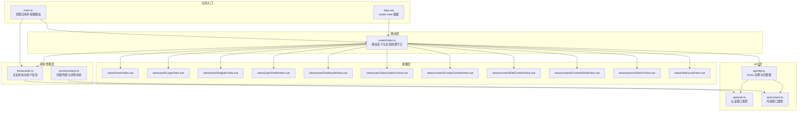
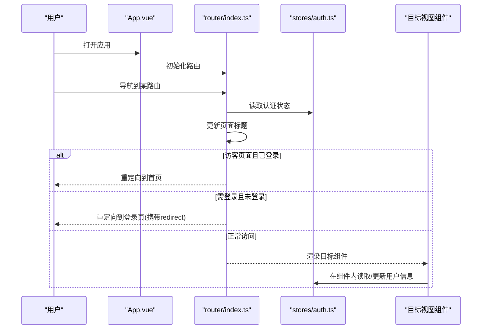
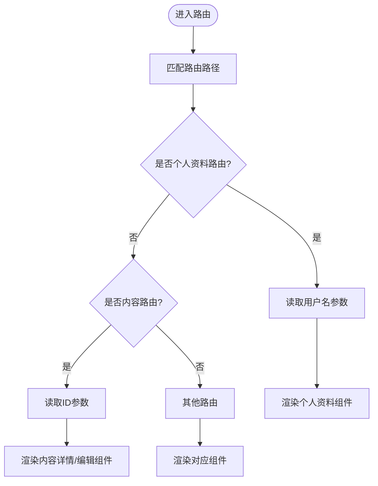
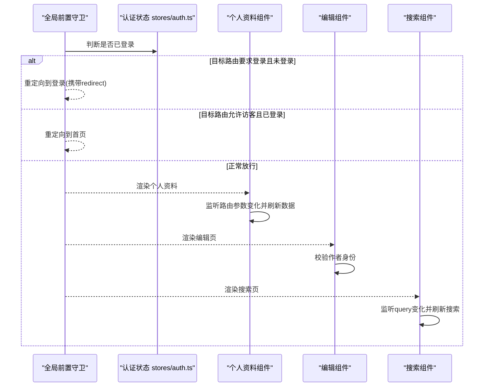
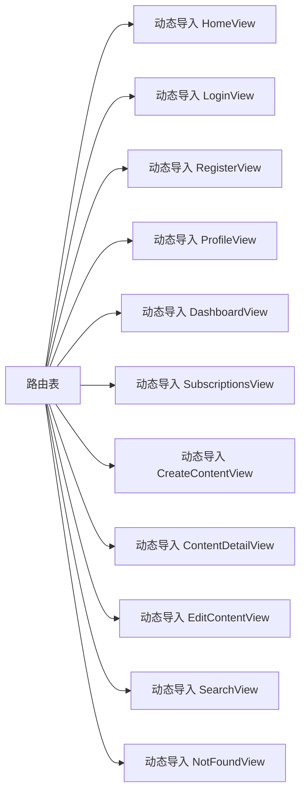
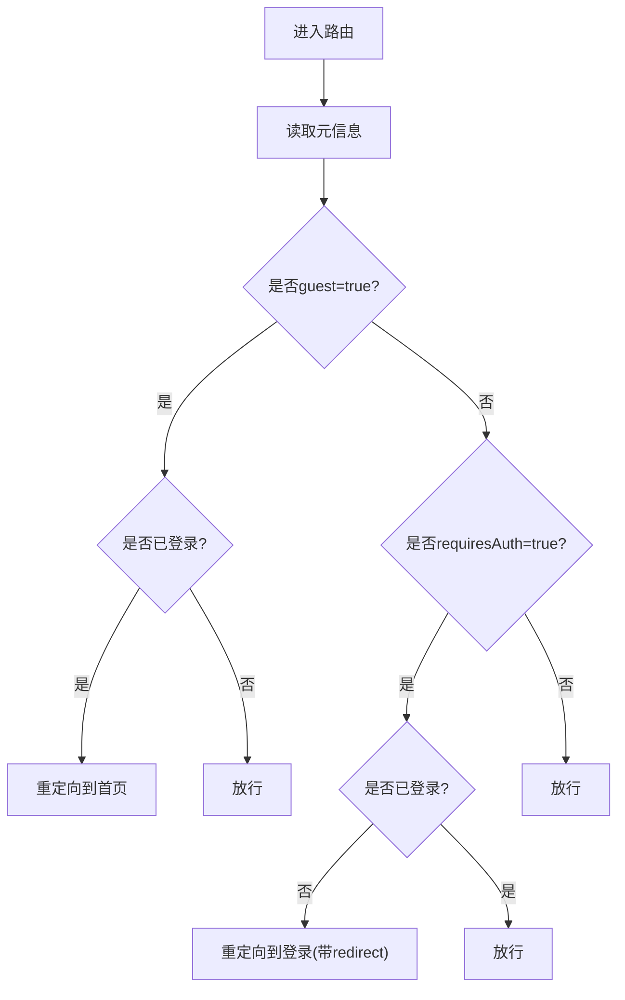
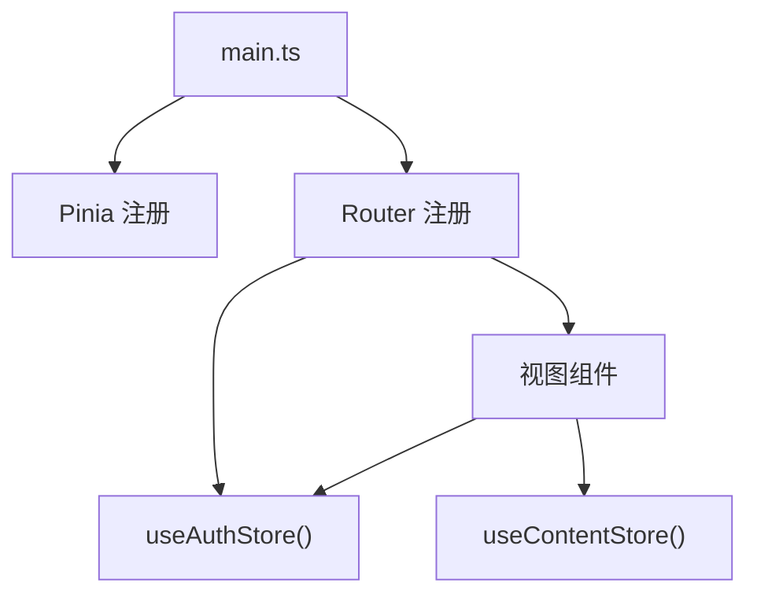
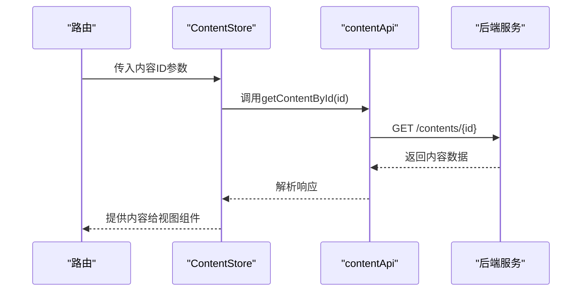
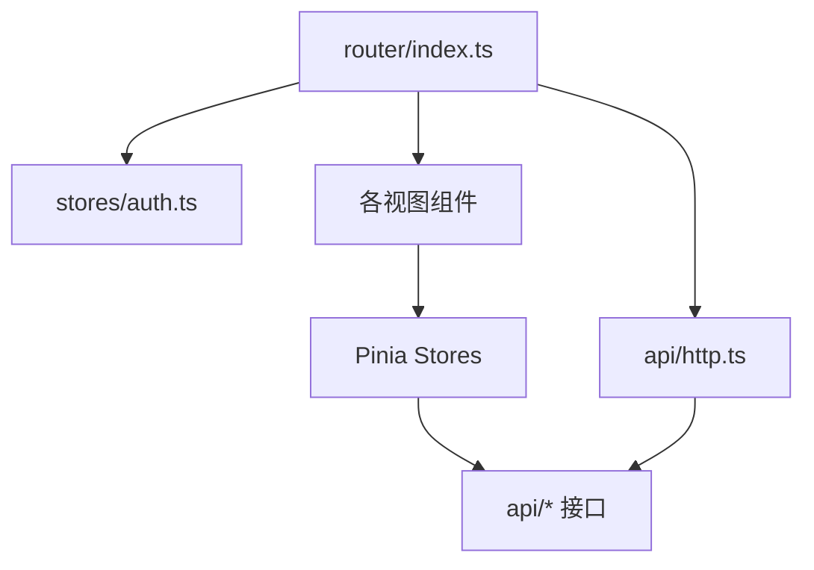

# Vue Router 路由配置

<cite>
**本文引用的文件**
- [router/index.ts](file://communication-frontend/src/router/index.ts)
- [main.ts](file://communication-frontend/src/main.ts)
- [App.vue](file://communication-frontend/src/App.vue)
- [stores/auth.ts](file://communication-frontend/src/stores/auth.ts)
- [views/user/ProfileView.vue](file://communication-frontend/src/views/user/ProfileView.vue)
- [views/content/EditContentView.vue](file://communication-frontend/src/views/content/EditContentView.vue)
- [components/layout/AppHeader.vue](file://communication-frontend/src/components/layout/AppHeader.vue)
- [views/search/SearchView.vue](file://communication-frontend/src/views/search/SearchView.vue)
- [api/auth.ts](file://communication-frontend/src/api/auth.ts)
- [api/http.ts](file://communication-frontend/src/api/http.ts)
- [stores/content.ts](file://communication-frontend/src/stores/content.ts)
- [api/content.ts](file://communication-frontend/src/api/content.ts)
- [vite.config.ts](file://communication-frontend/vite.config.ts)
</cite>

## 目录
1. [简介](#简介)
2. [项目结构](#项目结构)
3. [核心组件](#核心组件)
4. [架构总览](#架构总览)
5. [详细组件分析](#详细组件分析)
6. [依赖关系分析](#依赖关系分析)
7. [性能考量](#性能考量)
8. [故障排查指南](#故障排查指南)
9. [结论](#结论)
10. [附录](#附录)

## 简介
本文件面向 Vue Router 路由系统，围绕路由定义、嵌套路由与动态路由参数、导航守卫（全局前置守卫、路由独享守卫、组件内守卫）、路由懒加载与代码分割、路由元信息与权限控制、最佳实践与常见导航场景进行系统化说明，并结合项目中的真实实现路径进行讲解。

## 项目结构
通信平台前端采用 Vue 3 + TypeScript + Pinia + Element Plus 技术栈，路由系统位于前端工程的 router 目录，配合 Pinia 状态管理与 API 层协作，形成清晰的职责边界：路由负责页面级导航与权限拦截；状态管理负责用户态与业务数据；API 层负责与后端交互并统一处理鉴权头与错误提示。

图表来源
- [main.ts](file://communication-frontend/src/main.ts#L1-L17)
- [App.vue](file://communication-frontend/src/App.vue#L1-L30)
- [router/index.ts](file://communication-frontend/src/router/index.ts#L1-L98)
- [stores/auth.ts](file://communication-frontend/src/stores/auth.ts#L1-L96)
- [stores/content.ts](file://communication-frontend/src/stores/content.ts#L1-L150)
- [api/http.ts](file://communication-frontend/src/api/http.ts#L1-L66)
- [api/auth.ts](file://communication-frontend/src/api/auth.ts#L1-L49)
- [api/content.ts](file://communication-frontend/src/api/content.ts#L1-L114)

章节来源
- [router/index.ts](file://communication-frontend/src/router/index.ts#L1-L98)
- [main.ts](file://communication-frontend/src/main.ts#L1-L17)
- [App.vue](file://communication-frontend/src/App.vue#L1-L30)

## 核心组件
- 路由器实例与历史模式：基于浏览器历史记录的 Web History，支持 BASE_URL 环境变量。
- 路由表：包含首页、登录、注册、个人资料、仪表盘、订阅、内容创建、内容详情、内容编辑、搜索、通配符 404 等路由。
- 全局前置守卫：集中处理页面标题更新、访客页面拦截、登录保护重定向。
- 动态路由参数：个人资料路由使用用户名参数，内容路由使用 ID 参数。
- 查询字符串：搜索页通过 query 参数接收关键词与标签筛选。
- 组件内守卫：在组件内部通过路由参数监听与状态联动实现数据刷新与权限校验。
- 路由懒加载：所有视图组件均采用动态导入，配合 Vite 进行代码分割。
- 权限控制：通过路由元信息与 Pinia 认证状态协同实现“仅访客可访问”和“需登录可见”。

章节来源
- [router/index.ts](file://communication-frontend/src/router/index.ts#L4-L74)
- [router/index.ts](file://communication-frontend/src/router/index.ts#L76-L95)
- [views/user/ProfileView.vue](file://communication-frontend/src/views/user/ProfileView.vue#L95-L296)
- [views/content/EditContentView.vue](file://communication-frontend/src/views/content/EditContentView.vue#L1-L190)
- [views/search/SearchView.vue](file://communication-frontend/src/views/search/SearchView.vue#L95-L229)
- [vite.config.ts](file://communication-frontend/vite.config.ts#L1-L40)

## 架构总览
下图展示从应用启动到路由守卫执行、页面渲染与状态管理的整体流程。

图表来源
- [App.vue](file://communication-frontend/src/App.vue#L1-L30)
- [router/index.ts](file://communication-frontend/src/router/index.ts#L76-L95)
- [stores/auth.ts](file://communication-frontend/src/stores/auth.ts#L1-L96)

## 详细组件分析

### 路由定义与嵌套路由
- 基础路由：首页、登录、注册、搜索、404 等。
- 动态路由：
  - 个人资料：使用用户名参数作为唯一标识。
  - 内容详情与编辑：使用数字 ID 参数。
- 嵌套路由：当前路由表未显式声明子路由，但可通过嵌套布局实现（例如仪表盘与订阅页可作为某个布局下的子路由）。

图表来源
- [router/index.ts](file://communication-frontend/src/router/index.ts#L26-L60)
- [views/user/ProfileView.vue](file://communication-frontend/src/views/user/ProfileView.vue#L141-L166)
- [views/content/EditContentView.vue](file://communication-frontend/src/views/content/EditContentView.vue#L34-L49)

章节来源
- [router/index.ts](file://communication-frontend/src/router/index.ts#L6-L73)
- [views/user/ProfileView.vue](file://communication-frontend/src/views/user/ProfileView.vue#L141-L166)
- [views/content/EditContentView.vue](file://communication-frontend/src/views/content/EditContentView.vue#L34-L49)

### 导航守卫详解
- 全局前置守卫：
  - 页面标题更新：根据路由元信息设置 document.title。
  - 访客保护：若目标路由标记为仅访客可用且当前已登录，则重定向至首页。
  - 登录保护：若目标路由需要登录且未登录，则重定向至登录页并携带 redirect 参数。
- 路由独享守卫：当前项目未使用路由级守卫，权限控制集中在全局守卫与组件内守卫。
- 组件内守卫：
  - 个人资料页：监听路由参数变化，当用户名变更时重新拉取用户信息与统计数据。
  - 编辑页：在 mounted 中拉取内容详情，若非作者则提示并回退到详情页。
  - 搜索页：监听 query 变化，根据关键词或标签触发搜索。

图表来源
- [router/index.ts](file://communication-frontend/src/router/index.ts#L76-L95)
- [stores/auth.ts](file://communication-frontend/src/stores/auth.ts#L1-L96)
- [views/user/ProfileView.vue](file://communication-frontend/src/views/user/ProfileView.vue#L290-L296)
- [views/content/EditContentView.vue](file://communication-frontend/src/views/content/EditContentView.vue#L34-L49)
- [views/search/SearchView.vue](file://communication-frontend/src/views/search/SearchView.vue#L215-L229)

章节来源
- [router/index.ts](file://communication-frontend/src/router/index.ts#L76-L95)
- [views/user/ProfileView.vue](file://communication-frontend/src/views/user/ProfileView.vue#L290-L296)
- [views/content/EditContentView.vue](file://communication-frontend/src/views/content/EditContentView.vue#L34-L49)
- [views/search/SearchView.vue](file://communication-frontend/src/views/search/SearchView.vue#L215-L229)

### 路由懒加载与代码分割
- 所有视图组件均通过动态导入实现懒加载，减少首屏体积。
- Vite 插件自动进行代码分割，按需生成 chunk。
- 与路由懒加载配合，可实现按需加载与缓存优化。

图表来源
- [router/index.ts](file://communication-frontend/src/router/index.ts#L10-L71)
- [vite.config.ts](file://communication-frontend/vite.config.ts#L1-L40)

章节来源
- [router/index.ts](file://communication-frontend/src/router/index.ts#L10-L71)
- [vite.config.ts](file://communication-frontend/vite.config.ts#L1-L40)

### 路由元信息与权限控制
- 元信息字段：
  - title：用于设置页面标题。
  - guest：标记为仅访客可访问。
  - requiresAuth：标记为需登录可见。
- 权限控制流程：
  - 全局守卫根据元信息与认证状态决定放行或重定向。
  - 组件内进一步校验资源归属（如编辑页校验作者身份）。

图表来源
- [router/index.ts](file://communication-frontend/src/router/index.ts#L76-L95)

章节来源
- [router/index.ts](file://communication-frontend/src/router/index.ts#L17-L18)
- [router/index.ts](file://communication-frontend/src/router/index.ts#L35-L36)
- [router/index.ts](file://communication-frontend/src/router/index.ts#L59-L60)

### 路由与状态管理集成
- 应用入口注册路由与 Pinia，确保全局可注入。
- 路由守卫读取认证状态，影响页面渲染与导航。
- 视图组件通过 store 拉取与更新数据，保持状态一致。

图表来源
- [main.ts](file://communication-frontend/src/main.ts#L10-L14)
- [router/index.ts](file://communication-frontend/src/router/index.ts#L76-L95)
- [stores/auth.ts](file://communication-frontend/src/stores/auth.ts#L1-L96)
- [stores/content.ts](file://communication-frontend/src/stores/content.ts#L1-L150)

章节来源
- [main.ts](file://communication-frontend/src/main.ts#L10-L14)
- [router/index.ts](file://communication-frontend/src/router/index.ts#L76-L95)

### API 与路由参数交互
- 认证 API：注册、登录、获取当前用户等，配合 Axios 拦截器自动附加 Authorization 头。
- 内容 API：分页查询、按作者查询、创建、更新、删除等，编辑页通过路由参数获取内容 ID 并进行作者校验。
- 搜索 API：支持关键词与标签查询，搜索页通过 query 参数驱动。

图表来源
- [views/content/EditContentView.vue](file://communication-frontend/src/views/content/EditContentView.vue#L34-L49)
- [stores/content.ts](file://communication-frontend/src/stores/content.ts#L44-L56)
- [api/content.ts](file://communication-frontend/src/api/content.ts#L70-L72)

章节来源
- [api/auth.ts](file://communication-frontend/src/api/auth.ts#L36-L48)
- [api/http.ts](file://communication-frontend/src/api/http.ts#L14-L25)
- [api/content.ts](file://communication-frontend/src/api/content.ts#L70-L72)
- [views/content/EditContentView.vue](file://communication-frontend/src/views/content/EditContentView.vue#L34-L49)

## 依赖关系分析
- 路由对状态管理的依赖：全局守卫依赖认证状态，组件内守卫依赖路由参数与状态。
- 视图组件对 API 的依赖：通过 Store 封装的 API 方法进行数据获取与更新。
- 构建工具对懒加载的支持：Vite 自动进行代码分割，路由动态导入与之天然契合。

图表来源
- [router/index.ts](file://communication-frontend/src/router/index.ts#L1-L98)
- [stores/auth.ts](file://communication-frontend/src/stores/auth.ts#L1-L96)
- [api/http.ts](file://communication-frontend/src/api/http.ts#L1-L66)

章节来源
- [router/index.ts](file://communication-frontend/src/router/index.ts#L1-L98)
- [stores/auth.ts](file://communication-frontend/src/stores/auth.ts#L1-L96)
- [api/http.ts](file://communication-frontend/src/api/http.ts#L1-L66)

## 性能考量
- 路由懒加载：所有视图组件均采用动态导入，降低首屏 JS 体积。
- 代码分割：Vite 自动按路由切分 chunk，提升缓存命中率与加载速度。
- 组件内懒加载：图片组件采用 IntersectionObserver 与占位图，减少首屏压力。
- 请求拦截：统一添加 Token 与错误提示，避免重复逻辑与网络浪费。

章节来源
- [router/index.ts](file://communication-frontend/src/router/index.ts#L10-L71)
- [vite.config.ts](file://communication-frontend/vite.config.ts#L1-L40)
- [api/http.ts](file://communication-frontend/src/api/http.ts#L14-L25)
- [components/common/LazyImage.vue](file://communication-frontend/src/components/common/LazyImage.vue#L58-L76)

## 故障排查指南
- 登录后仍被重定向到登录页
  - 检查全局守卫的 requiresAuth 与认证状态。
  - 确认登录成功后是否正确写入本地存储与 Pinia。
- 访客页面被重定向到首页
  - 检查路由元信息 guest 标记与认证状态。
- 个人资料页不刷新
  - 检查组件内是否监听路由参数变化并重新拉取数据。
- 编辑页权限校验失败
  - 检查编辑页是否正确校验作者身份并进行回退。
- 搜索结果不更新
  - 检查搜索页是否监听 query 变化并触发搜索。

章节来源
- [router/index.ts](file://communication-frontend/src/router/index.ts#L76-L95)
- [stores/auth.ts](file://communication-frontend/src/stores/auth.ts#L71-L77)
- [views/user/ProfileView.vue](file://communication-frontend/src/views/user/ProfileView.vue#L290-L296)
- [views/content/EditContentView.vue](file://communication-frontend/src/views/content/EditContentView.vue#L34-L49)
- [views/search/SearchView.vue](file://communication-frontend/src/views/search/SearchView.vue#L215-L229)

## 结论
本项目通过明确的路由元信息、全局前置守卫与组件内守卫相结合的方式，实现了清晰的权限控制与良好的用户体验。配合路由懒加载与 Vite 的代码分割策略，有效提升了首屏性能与运行效率。建议在后续扩展中引入路由级守卫与嵌套路由布局，进一步完善权限体系与页面组织。

## 附录

### 最佳实践清单
- 路由命名规范
  - 使用语义化名称，如 home、login、register、profile、dashboard、subscriptions、create-content、content-detail、edit-content、search、not-found。
- 动态路由参数
  - 使用明确的参数名（如 :username、:id），并在组件内监听参数变化以刷新数据。
- 查询字符串处理
  - 使用 query 对关键词与标签进行筛选，监听 query 变化并触发搜索。
- 导航场景示例
  - 登录验证：全局守卫拦截未登录访问受保护路由，重定向到登录页并携带 redirect。
  - 权限控制：组件内校验资源归属（如编辑页校验作者身份）。
  - 页面跳转：头部导航通过路由 push 实现跳转，搜索页通过 query 更新搜索条件。
- 路由懒加载
  - 所有视图组件采用动态导入，结合 Vite 自动代码分割。
- 路由元信息
  - 使用 title 设置页面标题，使用 guest 与 requiresAuth 控制访问权限。

章节来源
- [router/index.ts](file://communication-frontend/src/router/index.ts#L6-L73)
- [router/index.ts](file://communication-frontend/src/router/index.ts#L76-L95)
- [components/layout/AppHeader.vue](file://communication-frontend/src/components/layout/AppHeader.vue#L14-L39)
- [views/search/SearchView.vue](file://communication-frontend/src/views/search/SearchView.vue#L132-L138)
- [views/content/EditContentView.vue](file://communication-frontend/src/views/content/EditContentView.vue#L34-L49)