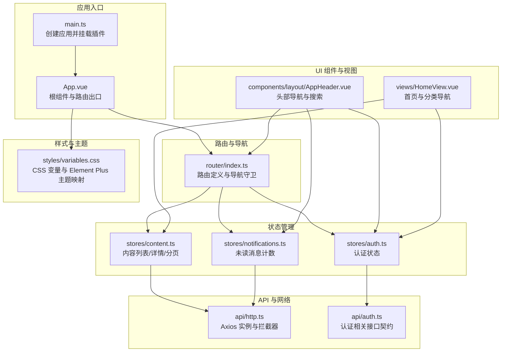
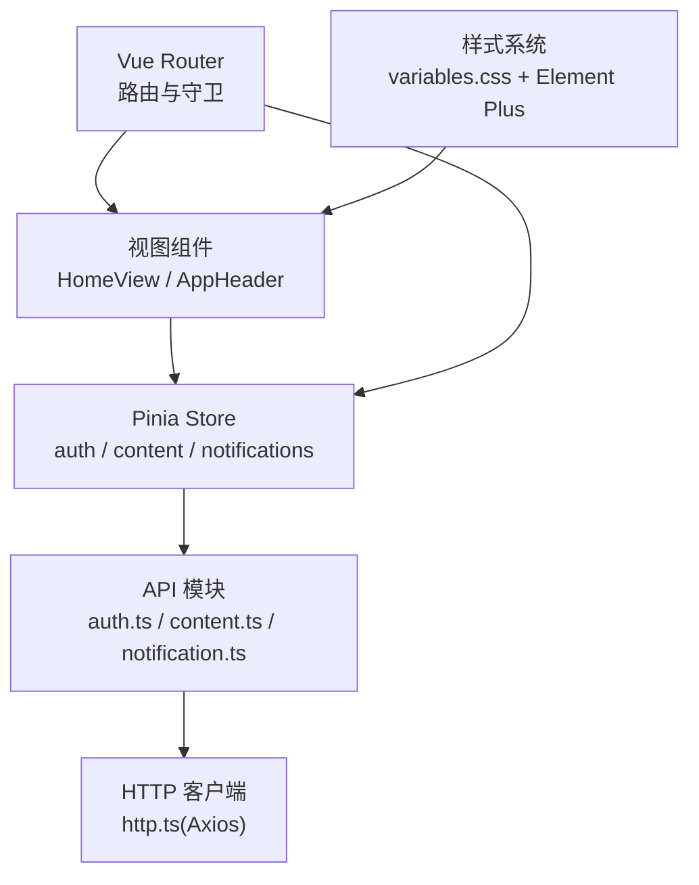
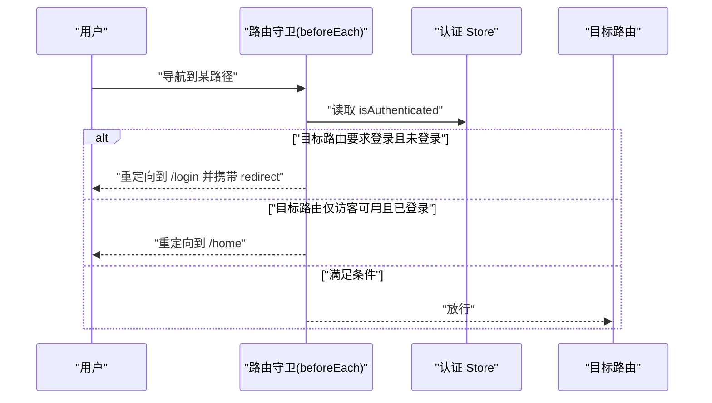
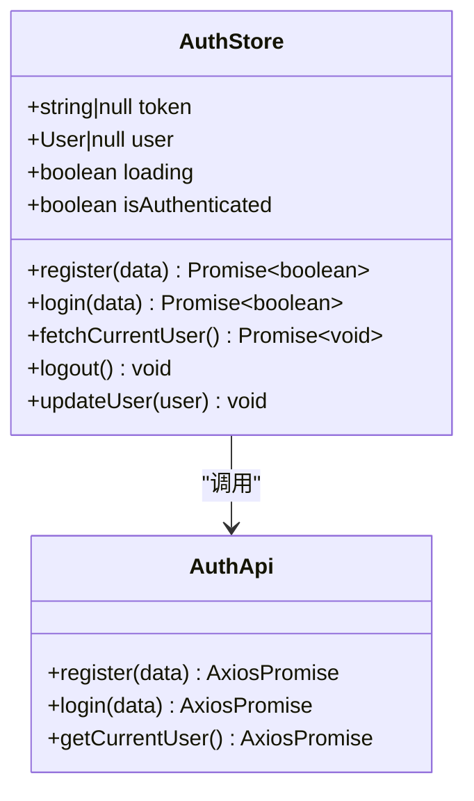
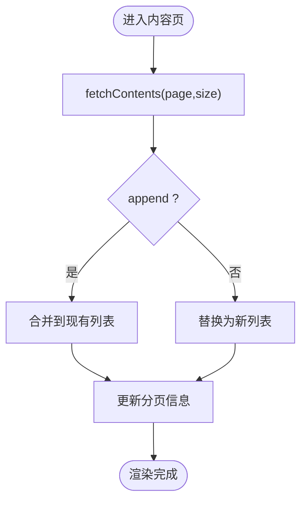
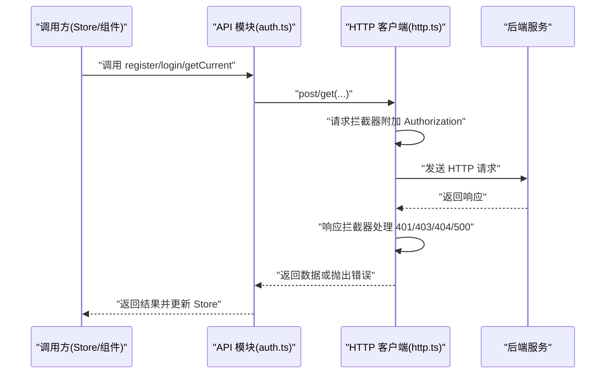
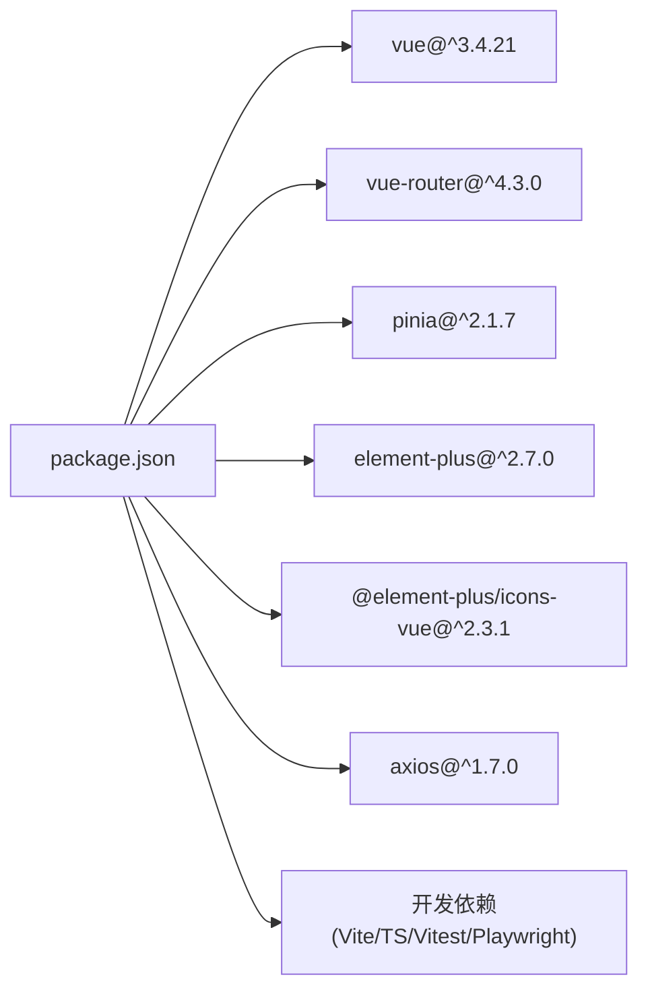

# 前端架构设计

<cite>
**本文引用的文件**
- [package.json](file://communication-frontend/package.json)
- [vite.config.ts](file://communication-frontend/vite.config.ts)
- [main.ts](file://communication-frontend/src/main.ts)
- [App.vue](file://communication-frontend/src/App.vue)
- [router/index.ts](file://communication-frontend/src/router/index.ts)
- [stores/auth.ts](file://communication-frontend/src/stores/auth.ts)
- [api/http.ts](file://communication-frontend/src/api/http.ts)
- [tsconfig.json](file://communication-frontend/tsconfig.json)
- [api/auth.ts](file://communication-frontend/src/api/auth.ts)
- [stores/content.ts](file://communication-frontend/src/stores/content.ts)
- [stores/notifications.ts](file://communication-frontend/src/stores/notifications.ts)
- [components/layout/AppHeader.vue](file://communication-frontend/src/components/layout/AppHeader.vue)
- [views/HomeView.vue](file://communication-frontend/src/views/HomeView.vue)
- [styles/variables.css](file://communication-frontend/src/styles/variables.css)
- [Dockerfile](file://communication-frontend/Dockerfile)
</cite>

## 目录
1. [引言](#引言)
2. [项目结构](#项目结构)
3. [核心组件](#核心组件)
4. [架构总览](#架构总览)
5. [详细组件分析](#详细组件分析)
6. [依赖关系分析](#依赖关系分析)
7. [性能考量](#性能考量)
8. [故障排查指南](#故障排查指南)
9. [结论](#结论)
10. [附录](#附录)

## 引言
本文件面向初学者与高级开发者，系统性梳理该 Vue 3 前端项目的架构设计与实现要点，涵盖 Composition API 设计模式、组件化架构、Pinia 状态管理、Vue Router 路由与导航守卫、API 封装与 HTTP 客户端、错误处理机制、组件设计原则与样式系统、响应式布局、TypeScript 集成与开发工具配置、构建与部署策略等主题。文档以“渐进式复杂度”组织内容，既提供高层概览，也给出代码级图示与来源标注，便于读者按需深入。

## 项目结构
项目采用基于功能域的模块化组织方式：API 层负责网络请求与数据契约；Pinia Store 提供跨组件状态管理；Vue Router 实现页面路由与守卫；组件层拆分通用组件与业务视图；样式系统通过 CSS 变量与 Element Plus 主题统一视觉语言；Vite 作为构建与开发工具链。

图表来源
- [main.ts:1-17](file://communication-frontend/src/main.ts#L1-L17)
- [App.vue:1-31](file://communication-frontend/src/App.vue#L1-L31)
- [router/index.ts:1-128](file://communication-frontend/src/router/index.ts#L1-L128)
- [stores/auth.ts:1-96](file://communication-frontend/src/stores/auth.ts#L1-L96)
- [stores/content.ts:1-150](file://communication-frontend/src/stores/content.ts#L1-L150)
- [stores/notifications.ts:1-23](file://communication-frontend/src/stores/notifications.ts#L1-L23)
- [api/http.ts:1-70](file://communication-frontend/src/api/http.ts#L1-L70)
- [api/auth.ts:1-49](file://communication-frontend/src/api/auth.ts#L1-L49)
- [components/layout/AppHeader.vue:1-391](file://communication-frontend/src/components/layout/AppHeader.vue#L1-L391)
- [views/HomeView.vue:1-172](file://communication-frontend/src/views/HomeView.vue#L1-L172)
- [styles/variables.css:1-67](file://communication-frontend/src/styles/variables.css#L1-L67)

章节来源
- [package.json:1-36](file://communication-frontend/package.json#L1-L36)
- [vite.config.ts:1-40](file://communication-frontend/vite.config.ts#L1-L40)
- [tsconfig.json:1-26](file://communication-frontend/tsconfig.json#L1-L26)

## 核心组件
- 应用入口与插件装配：在入口文件中创建应用实例，安装 Pinia、Vue Router、Element Plus，并引入全局样式变量与全局样式。
- 根组件与路由出口：根组件提供页面容器与过渡动画，通过 router-view 渲染当前路由组件。
- 路由与导航守卫：集中定义路由表与 beforeEach 守卫，实现标题更新、访客限制与登录态校验。
- 状态管理（Pinia）：以组合式 Store 模式组织认证、内容与通知状态，提供加载态、分页与 CRUD 操作。
- API 与 HTTP 客户端：基于 Axios 的实例化与拦截器，统一封装鉴权头、错误提示与异常分支处理。
- UI 组件与视图：头部组件整合搜索、通知徽章、用户下拉菜单与移动端抽屉；首页视图展示分类导航与内容流。
- 样式系统：通过 CSS 变量定义主题色板、阴影与圆角，配合 Element Plus 主题映射，实现一致的视觉语言与响应式布局。

章节来源
- [main.ts:1-17](file://communication-frontend/src/main.ts#L1-L17)
- [App.vue:1-31](file://communication-frontend/src/App.vue#L1-L31)
- [router/index.ts:1-128](file://communication-frontend/src/router/index.ts#L1-L128)
- [stores/auth.ts:1-96](file://communication-frontend/src/stores/auth.ts#L1-L96)
- [stores/content.ts:1-150](file://communication-frontend/src/stores/content.ts#L1-L150)
- [stores/notifications.ts:1-23](file://communication-frontend/src/stores/notifications.ts#L1-L23)
- [api/http.ts:1-70](file://communication-frontend/src/api/http.ts#L1-L70)
- [components/layout/AppHeader.vue:1-391](file://communication-frontend/src/components/layout/AppHeader.vue#L1-L391)
- [views/HomeView.vue:1-172](file://communication-frontend/src/views/HomeView.vue#L1-L172)
- [styles/variables.css:1-67](file://communication-frontend/src/styles/variables.css#L1-L67)

## 架构总览
该架构遵循“关注点分离”与“可测试性优先”的原则：
- 视图层：组件职责单一，通过 props 与 emits 与父组件通信，避免直接访问全局状态。
- 状态层：Pinia Store 仅暴露方法与计算属性，内部封装副作用与持久化逻辑。
- 数据层：API 模块集中定义请求契约与调用封装，HTTP 客户端统一处理鉴权与错误。
- 路由层：集中声明路由与守卫，确保安全与用户体验一致性。
- 工具链：Vite 插件自动导入与组件解析，提升开发效率；TypeScript 提供静态类型保障。

图表来源
- [router/index.ts:1-128](file://communication-frontend/src/router/index.ts#L1-L128)
- [stores/auth.ts:1-96](file://communication-frontend/src/stores/auth.ts#L1-L96)
- [stores/content.ts:1-150](file://communication-frontend/src/stores/content.ts#L1-L150)
- [stores/notifications.ts:1-23](file://communication-frontend/src/stores/notifications.ts#L1-L23)
- [api/auth.ts:1-49](file://communication-frontend/src/api/auth.ts#L1-L49)
- [api/http.ts:1-70](file://communication-frontend/src/api/http.ts#L1-L70)
- [styles/variables.css:1-67](file://communication-frontend/src/styles/variables.css#L1-L67)

## 详细组件分析

### 路由与导航守卫
- 路由表：采用动态导入视图组件，减少首屏体积；meta 字段承载页面标题与权限标记。
- 导航守卫：在 beforeEach 中根据 meta 标记与认证状态进行跳转或阻止，统一设置 document.title。
- 典型流程：登录/注册页仅允许未登录用户访问；受保护路由在未登录时携带 redirect 参数跳转至登录页；登录过期时清理本地存储并跳转登录页。

图表来源
- [router/index.ts:106-125](file://communication-frontend/src/router/index.ts#L106-L125)
- [stores/auth.ts:11](file://communication-frontend/src/stores/auth.ts#L11)

章节来源
- [router/index.ts:1-128](file://communication-frontend/src/router/index.ts#L1-L128)
- [stores/auth.ts:1-96](file://communication-frontend/src/stores/auth.ts#L1-L96)

### Pinia 状态管理（认证）
- Store 设计：使用组合式 defineStore，集中管理 token、用户信息、加载态与计算属性 isAuthenticated。
- 持久化：登录/注册成功后写入 localStorage，并在登出时清除。
- 错误处理：捕获异常并使用 Element Plus 提示，finally 中统一关闭 loading。
- 方法职责：register、login、fetchCurrentUser、logout、updateUser。

图表来源
- [stores/auth.ts:1-96](file://communication-frontend/src/stores/auth.ts#L1-L96)
- [api/auth.ts:1-49](file://communication-frontend/src/api/auth.ts#L1-L49)

章节来源
- [stores/auth.ts:1-96](file://communication-frontend/src/stores/auth.ts#L1-L96)
- [api/auth.ts:1-49](file://communication-frontend/src/api/auth.ts#L1-L49)

### 内容状态管理（内容列表/详情/分页）
- 数据模型：内容数组、当前内容、分页信息与加载态。
- 功能覆盖：分页加载、追加加载、详情获取、创建、更新、删除、清空。
- 交互反馈：使用 Element Plus 提示成功/失败消息。
- 性能注意：loadMore 在无更多数据或正在加载时短路。

图表来源
- [stores/content.ts:18-42](file://communication-frontend/src/stores/content.ts#L18-L42)

章节来源
- [stores/content.ts:1-150](file://communication-frontend/src/stores/content.ts#L1-L150)

### 通知状态管理（未读消息）
- 简单 Store：仅维护未读计数，提供获取与手动设置方法。
- 使用场景：头部组件在登录态变化时刷新未读数量。

章节来源
- [stores/notifications.ts:1-23](file://communication-frontend/src/stores/notifications.ts#L1-L23)
- [components/layout/AppHeader.vue:43-51](file://communication-frontend/src/components/layout/AppHeader.vue#L43-L51)

### API 封装与 HTTP 客户端
- Axios 实例：baseURL 指向 /api，统一超时与 Content-Type。
- 请求拦截：自动附加 Authorization 头（Bearer token）。
- 响应拦截：根据状态码与请求路径进行统一错误提示与行为（如 401 登录过期跳转）。
- 类型安全：所有 API 返回值使用泛型约束，确保调用方获得正确数据结构。

图表来源
- [api/auth.ts:36-47](file://communication-frontend/src/api/auth.ts#L36-L47)
- [api/http.ts:14-67](file://communication-frontend/src/api/http.ts#L14-L67)

章节来源
- [api/http.ts:1-70](file://communication-frontend/src/api/http.ts#L1-L70)
- [api/auth.ts:1-49](file://communication-frontend/src/api/auth.ts#L1-L49)

### 组件设计原则与响应式布局
- 组件职责：头部组件聚合搜索、通知、用户菜单与移动端抽屉；首页视图负责分类导航与内容流入口。
- 响应式设计：媒体查询控制桌面/移动显示差异；移动端抽屉替代桌面导航。
- 样式系统：CSS 变量统一主题色、阴影与圆角；Element Plus 主题变量映射保持 UI 一致性。

章节来源
- [components/layout/AppHeader.vue:1-391](file://communication-frontend/src/components/layout/AppHeader.vue#L1-L391)
- [views/HomeView.vue:1-172](file://communication-frontend/src/views/HomeView.vue#L1-L172)
- [styles/variables.css:1-67](file://communication-frontend/src/styles/variables.css#L1-L67)

### TypeScript 集成与开发工具
- 编译选项：严格模式、禁用 emit、启用 JSX 保留、路径别名 @/* 指向 src。
- 构建脚本：Vite + vue-tsc 双轨校验，保证类型安全与产物质量。
- 开发体验：Vite 插件自动导入与组件解析，减少样板代码。

章节来源
- [tsconfig.json:1-26](file://communication-frontend/tsconfig.json#L1-L26)
- [package.json:6-14](file://communication-frontend/package.json#L6-L14)
- [vite.config.ts:1-40](file://communication-frontend/vite.config.ts#L1-L40)

## 依赖关系分析
- 运行时依赖：Vue 3、Vue Router、Pinia、Element Plus、Axios。
- 开发依赖：Vite、TypeScript、Vue TSC、Vitest、Playwright、自动导入与组件解析插件。
- 代理与端口：开发服务器默认端口 5173，代理 /api 与 /uploads 到后端 8080。

图表来源
- [package.json:15-34](file://communication-frontend/package.json#L15-L34)

章节来源
- [package.json:1-36](file://communication-frontend/package.json#L1-L36)
- [vite.config.ts:26-38](file://communication-frontend/vite.config.ts#L26-L38)

## 性能考量
- 代码分割：路由视图采用动态导入，降低首屏包体。
- 懒加载与虚拟滚动：可在内容列表组件进一步扩展以优化长列表性能。
- 缓存策略：Store 内部缓存与 localStorage 结合，减少重复请求。
- 构建优化：Vite 默认开启压缩与模块预构建；生产环境由 Nginx 提供静态资源服务。
- 网络优化：统一超时与错误提示，避免阻塞 UI；401 自动登出与跳转，防止无效重试。

## 故障排查指南
- 登录过期：响应拦截器检测 401 且非登录请求时，清理本地存储并跳转登录页。
- 权限不足：403 统一提示“没有权限执行此操作”。
- 资源不存在：404 提示“资源不存在”，并回退到默认行为。
- 服务器错误：500 统一提示“服务器错误，请稍后重试”。
- 网络异常：无 response 时提示“网络异常，请检查连接”。

章节来源
- [api/http.ts:32-67](file://communication-frontend/src/api/http.ts#L32-L67)

## 结论
该前端架构以 Composition API 与 Pinia 为核心，结合 Vue Router 的路由守卫与导航策略，实现了清晰的职责划分与良好的可维护性。通过 Axios 统一拦截器与 API 模块化封装，提升了网络层的稳定性与可测试性。样式系统与响应式布局确保了跨设备的一致体验。开发工具链与 TypeScript 配置提供了高质量的开发体验与类型安全保障。建议后续在长列表、图片懒加载、国际化与服务端渲染等方面持续演进。

## 附录
- 构建与部署：Dockerfile 采用多阶段构建，先在 Node 环境安装 pnpm 与依赖，再使用 Nginx 提供静态资源服务，暴露 80 端口。
- 开发命令：dev、build、preview、test:unit、test:e2e、lint、type-check。

章节来源
- [Dockerfile:1-33](file://communication-frontend/Dockerfile#L1-L33)
- [package.json:6-14](file://communication-frontend/package.json#L6-L14)