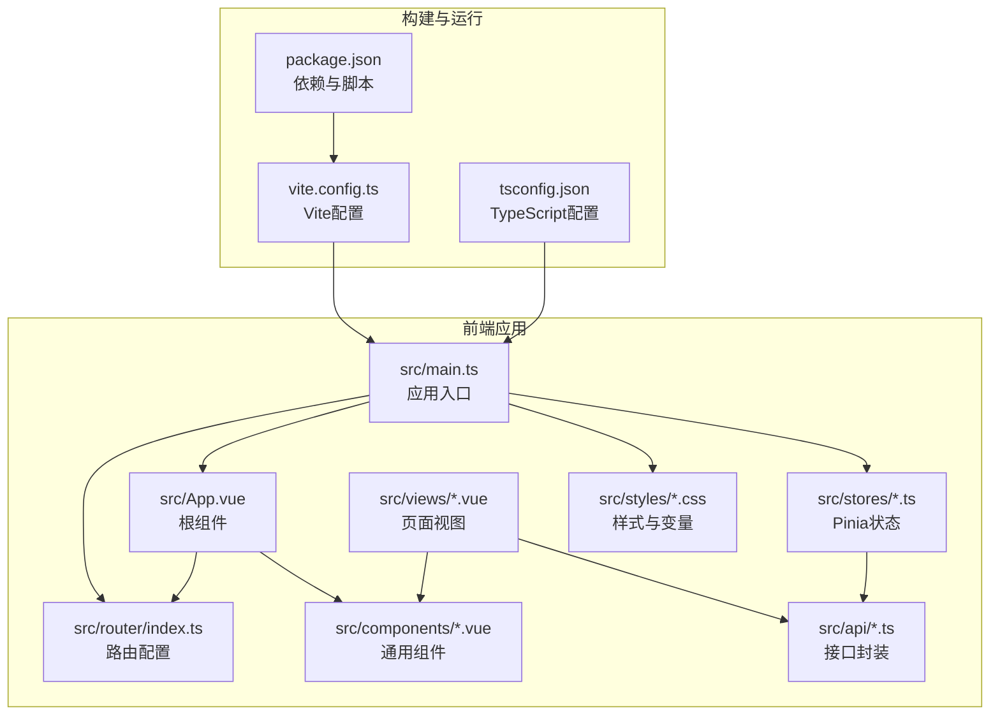
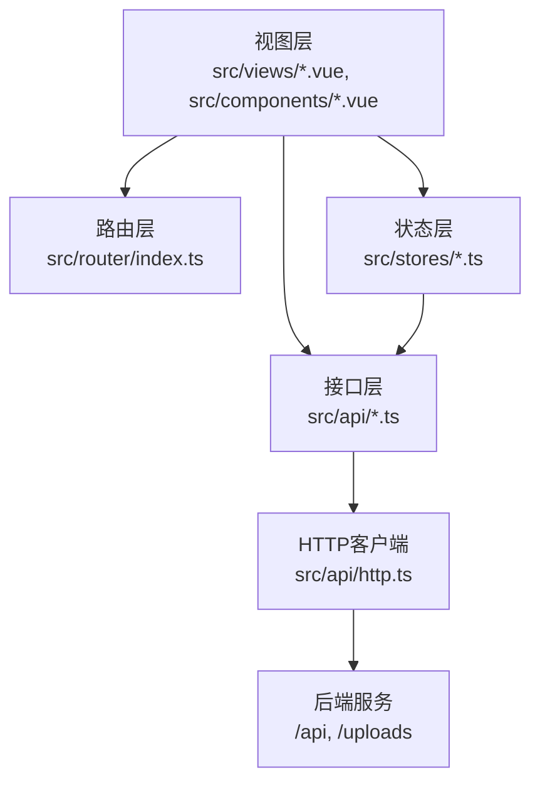
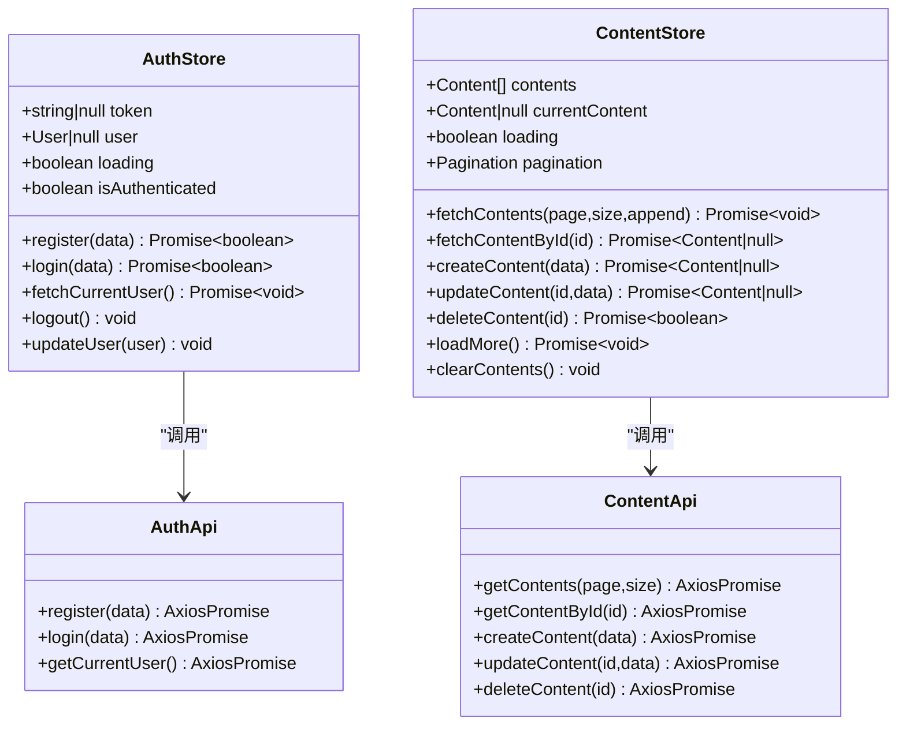
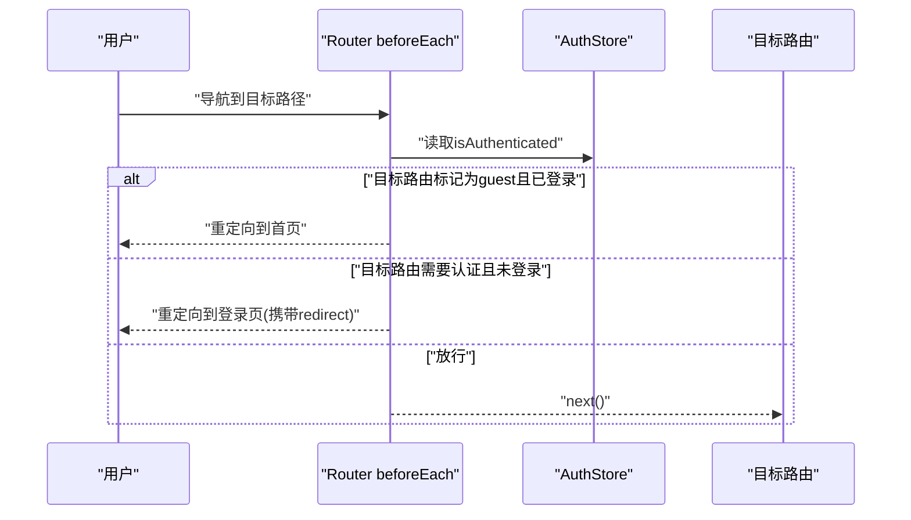
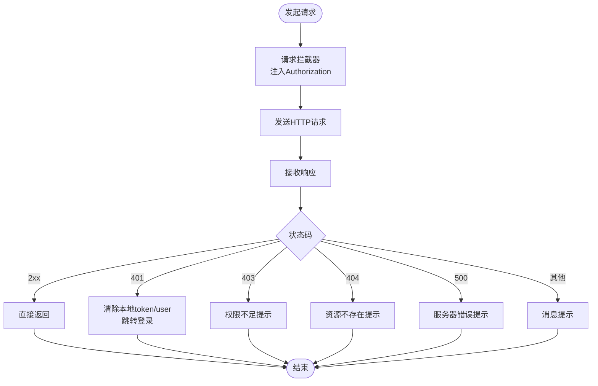
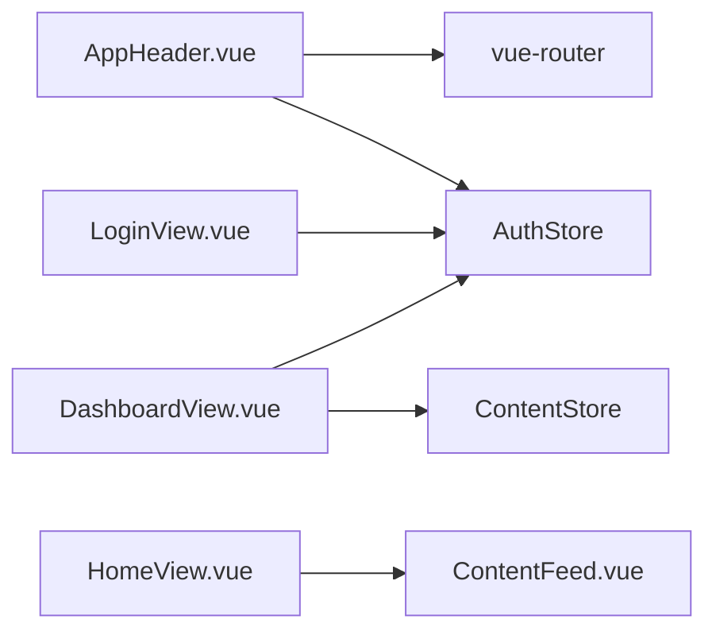
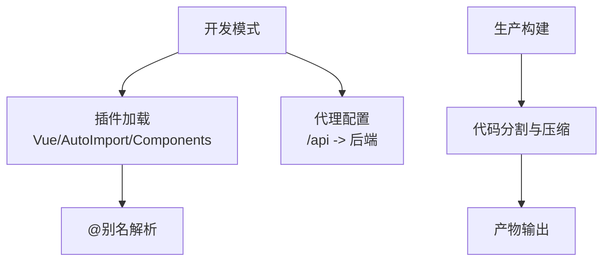
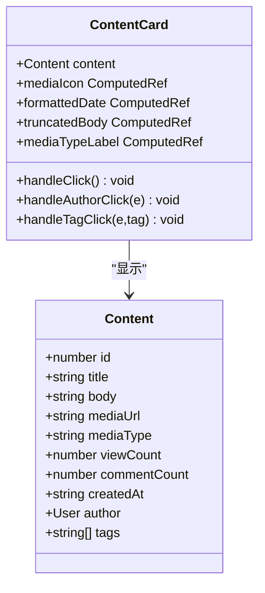
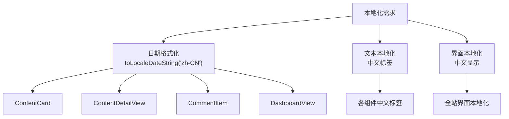
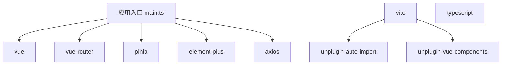

# 前端架构设计

<cite>
**本文档引用的文件**
- [main.ts](file://communication-frontend/src/main.ts)
- [App.vue](file://communication-frontend/src/App.vue)
- [router/index.ts](file://communication-frontend/src/router/index.ts)
- [stores/auth.ts](file://communication-frontend/src/stores/auth.ts)
- [stores/content.ts](file://communication-frontend/src/stores/content.ts)
- [api/http.ts](file://communication-frontend/src/api/http.ts)
- [api/auth.ts](file://communication-frontend/src/api/auth.ts)
- [api/content.ts](file://communication-frontend/src/api/content.ts)
- [components/layout/AppHeader.vue](file://communication-frontend/src/components/layout/AppHeader.vue)
- [components/content/ContentCard.vue](file://communication-frontend/src/components/content/ContentCard.vue)
- [components/content/ContentFeed.vue](file://communication-frontend/src/components/content/ContentFeed.vue)
- [components/content/MediaUploader.vue](file://communication-frontend/src/components/content/MediaUploader.vue)
- [components/common/EmptyState.vue](file://communication-frontend/src/components/common/EmptyState.vue)
- [components/common/LazyImage.vue](file://communication-frontend/src/components/common/LazyImage.vue)
- [components/comment/CommentItem.vue](file://communication-frontend/src/components/comment/CommentItem.vue)
- [views/HomeView.vue](file://communication-frontend/src/views/HomeView.vue)
- [views/auth/LoginView.vue](file://communication-frontend/src/views/auth/LoginView.vue)
- [views/user/DashboardView.vue](file://communication-frontend/src/views/user/DashboardView.vue)
- [views/content/ContentDetailView.vue](file://communication-frontend/src/views/content/ContentDetailView.vue)
- [styles/global.css](file://communication-frontend/src/styles/global.css)
- [vite.config.ts](file://communication-frontend/vite.config.ts)
- [package.json](file://communication-frontend/package.json)
- [tsconfig.json](file://communication-frontend/tsconfig.json)
</cite>

## 更新摘要
**所做更改**
- 新增了UI组件重大增强的详细分析：ContentCard、ContentFeed、MediaUploader的样式改进和功能增强
- 补充了整体国际化改进的实现细节，包括日期格式化和本地化显示
- 更新了组件设计模式和最佳实践章节，反映最新的UI增强
- 增强了前端性能优化策略，包含新的懒加载和骨架屏实现
- 完善了组件关系图和架构图表，展示增强后的UI组件体系

## 目录
1. [引言](#引言)
2. [项目结构](#项目结构)
3. [核心组件](#核心组件)
4. [架构总览](#架构总览)
5. [详细组件分析](#详细组件分析)
6. [UI组件重大增强](#ui组件重大增强)
7. [国际化改进](#国际化改进)
8. [依赖分析](#依赖分析)
9. [性能考虑](#性能考虑)
10. [故障排除指南](#故障排除指南)
11. [结论](#结论)
12. [附录](#附录)

## 引言
本文件为通信平台前端架构的系统性文档，面向Vue 3 + TypeScript单页应用（SPA）的整体设计与实现。重点覆盖以下方面：
- 组件化架构与视图层组织
- 状态管理（Pinia）的设计与实现（状态定义、actions与getters）
- 路由配置与导航守卫机制
- 构建工具（Vite）配置与优化策略
- 可复用组件设计模式与最佳实践
- 前端性能优化与代码分割方案
- 架构图表与组件关系图，帮助开发者快速理解整体架构

**更新** 本次更新重点关注UI组件的重大增强，包括ContentCard、ContentFeed、MediaUploader等核心组件的样式改进和功能增强，以及整体的国际化改进实现。

## 项目结构
前端采用典型的Vue 3 + TypeScript工程结构，核心目录与职责如下：
- src/api：统一的HTTP客户端与后端接口封装
- src/stores：Pinia状态管理模块
- src/router：Vue Router路由配置
- src/components：可复用UI组件与布局组件
- src/views：页面级视图组件
- src/styles：全局样式与CSS变量
- public：静态资源与入口HTML
- 根目录：构建配置、类型声明与脚本

**图表来源**
- [main.ts:1-17](file://communication-frontend/src/main.ts#L1-L17)
- [App.vue:1-30](file://communication-frontend/src/App.vue#L1-L30)
- [router/index.ts:1-98](file://communication-frontend/src/router/index.ts#L1-L98)
- [stores/auth.ts:1-96](file://communication-frontend/src/stores/auth.ts#L1-L96)
- [stores/content.ts:1-150](file://communication-frontend/src/stores/content.ts#L1-L150)
- [api/http.ts:1-66](file://communication-frontend/src/api/http.ts#L1-L66)
- [api/auth.ts:1-49](file://communication-frontend/src/api/auth.ts#L1-L49)
- [api/content.ts:1-114](file://communication-frontend/src/api/content.ts#L1-L114)
- [styles/global.css:1-298](file://communication-frontend/src/styles/global.css#L1-L298)
- [vite.config.ts:1-40](file://communication-frontend/vite.config.ts#L1-L40)
- [package.json:1-36](file://communication-frontend/package.json#L1-L36)
- [tsconfig.json:1-26](file://communication-frontend/tsconfig.json#L1-L26)

**章节来源**
- [main.ts:1-17](file://communication-frontend/src/main.ts#L1-L17)
- [App.vue:1-30](file://communication-frontend/src/App.vue#L1-L30)
- [vite.config.ts:1-40](file://communication-frontend/vite.config.ts#L1-L40)
- [package.json:1-36](file://communication-frontend/package.json#L1-L36)
- [tsconfig.json:1-26](file://communication-frontend/tsconfig.json#L1-L26)

## 核心组件
- 应用入口与挂载：在入口文件中初始化Pinia、路由与UI库，并挂载根组件。
- 根组件：负责页面切换动画与主内容区域渲染。
- 路由系统：基于history模式的动态路由，支持按需加载与导航守卫。
- 状态管理：Pinia组合式store，分别处理认证与内容相关状态。
- 接口层：统一的HTTP客户端，内置请求/响应拦截器与错误处理。
- 视图与组件：页面视图与通用组件解耦，通过props与事件进行交互。

**章节来源**
- [main.ts:1-17](file://communication-frontend/src/main.ts#L1-L17)
- [App.vue:1-30](file://communication-frontend/src/App.vue#L1-L30)
- [router/index.ts:1-98](file://communication-frontend/src/router/index.ts#L1-L98)
- [stores/auth.ts:1-96](file://communication-frontend/src/stores/auth.ts#L1-L96)
- [stores/content.ts:1-150](file://communication-frontend/src/stores/content.ts#L1-L150)
- [api/http.ts:1-66](file://communication-frontend/src/api/http.ts#L1-L66)

## 架构总览
前端采用"视图层-状态层-接口层"的分层架构，结合Vue 3的Composition API与TypeScript，确保类型安全与开发体验。路由与状态管理均采用现代化方案，构建工具使用Vite，具备热更新与快速打包能力。

**图表来源**
- [router/index.ts:1-98](file://communication-frontend/src/router/index.ts#L1-L98)
- [stores/auth.ts:1-96](file://communication-frontend/src/stores/auth.ts#L1-L96)
- [stores/content.ts:1-150](file://communication-frontend/src/stores/content.ts#L1-L150)
- [api/http.ts:1-66](file://communication-frontend/src/api/http.ts#L1-L66)
- [api/auth.ts:1-49](file://communication-frontend/src/api/auth.ts#L1-L49)
- [api/content.ts:1-114](file://communication-frontend/src/api/content.ts#L1-L114)

## 详细组件分析

### Pinia状态管理设计与实现
- 认证状态（auth.ts）
  - 状态：token、user、loading、isAuthenticated
  - Actions：register、login、fetchCurrentUser、logout、updateUser
  - 特性：本地存储持久化、错误消息提示、用户信息同步
- 内容状态（content.ts）
  - 状态：contents、currentContent、loading、pagination
  - Actions：fetchContents、fetchContentById、createContent、updateContent、deleteContent、loadMore、clearContents
  - 特性：分页、追加加载、错误日志与消息提示

**图表来源**
- [stores/auth.ts:1-96](file://communication-frontend/src/stores/auth.ts#L1-L96)
- [stores/content.ts:1-150](file://communication-frontend/src/stores/content.ts#L1-L150)
- [api/auth.ts:1-49](file://communication-frontend/src/api/auth.ts#L1-L49)
- [api/content.ts:1-114](file://communication-frontend/src/api/content.ts#L1-L114)

**章节来源**
- [stores/auth.ts:1-96](file://communication-frontend/src/stores/auth.ts#L1-L96)
- [stores/content.ts:1-150](file://communication-frontend/src/stores/content.ts#L1-L150)
- [api/auth.ts:1-49](file://communication-frontend/src/api/auth.ts#L1-L49)
- [api/content.ts:1-114](file://communication-frontend/src/api/content.ts#L1-L114)

### Vue Router配置与导航守卫
- 路由定义：首页、登录、注册、个人主页、仪表盘、订阅、内容详情、编辑、搜索、404等
- 懒加载：所有页面组件均使用动态导入实现按需加载
- 导航守卫：beforeEach中根据meta字段与认证状态执行跳转或阻止
  - guest仅允许未登录访问
  - requiresAuth要求登录态
  - 自动设置页面标题

**图表来源**
- [router/index.ts:76-95](file://communication-frontend/src/router/index.ts#L76-L95)
- [stores/auth.ts:11-11](file://communication-frontend/src/stores/auth.ts#L11-L11)

**章节来源**
- [router/index.ts:1-98](file://communication-frontend/src/router/index.ts#L1-L98)

### HTTP客户端与错误处理
- 基础配置：baseURL指向/api，超时15秒，JSON头
- 请求拦截：自动注入Authorization头
- 响应拦截：统一错误处理与消息提示，401自动登出并跳转登录

**图表来源**
- [api/http.ts:1-66](file://communication-frontend/src/api/http.ts#L1-L66)

**章节来源**
- [api/http.ts:1-66](file://communication-frontend/src/api/http.ts#L1-L66)

### 组件设计模式与最佳实践
- 可复用组件：AppHeader作为头部导航，支持桌面与移动端两套交互，内含搜索、下拉菜单、登录/登出流程
- 视图组件：HomeView、LoginView、DashboardView等页面组件，职责单一，通过store与api协作
- 设计原则：
  - 单一职责：每个store只负责一个领域（认证/内容）
  - 明确边界：组件间通过props与事件通信
  - 类型安全：TypeScript接口定义API响应结构
  - 可测试性：store与api分离，便于单元测试

**图表来源**
- [components/layout/AppHeader.vue:1-349](file://communication-frontend/src/components/layout/AppHeader.vue#L1-L349)
- [views/auth/LoginView.vue:1-113](file://communication-frontend/src/views/auth/LoginView.vue#L1-L113)
- [views/user/DashboardView.vue:1-462](file://communication-frontend/src/views/user/DashboardView.vue#L1-L462)
- [views/HomeView.vue:1-96](file://communication-frontend/src/views/HomeView.vue#L1-L96)
- [stores/auth.ts:1-96](file://communication-frontend/src/stores/auth.ts#L1-L96)
- [stores/content.ts:1-150](file://communication-frontend/src/stores/content.ts#L1-L150)

**章节来源**
- [components/layout/AppHeader.vue:1-349](file://communication-frontend/src/components/layout/AppHeader.vue#L1-L349)
- [views/auth/LoginView.vue:1-113](file://communication-frontend/src/views/auth/LoginView.vue#L1-L113)
- [views/user/DashboardView.vue:1-462](file://communication-frontend/src/views/user/DashboardView.vue#L1-L462)
- [views/HomeView.vue:1-96](file://communication-frontend/src/views/HomeView.vue#L1-L96)

### 构建工具与优化策略（Vite）
- 插件生态：Vue、自动导入、组件自动注册、Element Plus解析器
- 路径别名：@指向src，提升导入可读性
- 开发服务器：端口5173，代理/api与/uploads至后端
- 类型检查：TypeScript类型校验与构建分离

**图表来源**
- [vite.config.ts:1-40](file://communication-frontend/vite.config.ts#L1-L40)
- [package.json:6-14](file://communication-frontend/package.json#L6-L14)

**章节来源**
- [vite.config.ts:1-40](file://communication-frontend/vite.config.ts#L1-L40)
- [package.json:1-36](file://communication-frontend/package.json#L1-L36)

## UI组件重大增强

### ContentCard组件增强
ContentCard组件经过重大样式改进，提供了更加美观和用户友好的内容卡片展示：

- **媒体展示优化**：支持图片和视频的自适应显示，使用object-fit: cover确保内容完整显示
- **标签系统增强**：动态媒体类型标签，支持视频（危险色）、图片（成功色）、文字（信息色）的视觉区分
- **交互效果提升**：悬停时的阴影变化和边框动画，提供更好的用户体验
- **内容截断**：长文本自动截断，保持卡片布局的一致性
- **标签交互**：支持标签点击跳转到搜索结果

**图表来源**
- [components/content/ContentCard.vue:1-293](file://communication-frontend/src/components/content/ContentCard.vue#L1-L293)

**章节来源**
- [components/content/ContentCard.vue:1-293](file://communication-frontend/src/components/content/ContentCard.vue#L1-L293)

### ContentFeed组件增强
ContentFeed组件提供了更加灵活的内容流展示机制：

- **双模式支持**：既支持从store获取的全局内容流，也支持父组件传入的局部内容
- **智能加载控制**：根据内容来源自动判断是否显示加载更多按钮
- **空状态处理**：针对不同场景提供合适的空状态提示
- **骨架屏优化**：首次加载时显示骨架屏，提升感知性能
- **响应式网格**：使用CSS Grid实现自适应的卡片布局

**章节来源**
- [components/content/ContentFeed.vue:1-148](file://communication-frontend/src/components/content/ContentFeed.vue#L1-L148)

### MediaUploader组件增强
MediaUploader组件提供了完整的媒体上传解决方案：

- **多格式支持**：支持图片（JPEG、PNG、GIF）和视频（MP4、WebM）上传
- **预览功能**：上传前后都提供媒体预览，包括图片和视频的实时预览
- **进度指示**：上传过程中的进度条显示，提升用户体验
- **移除功能**：支持移除已选择的媒体文件
- **类型标识**：自动识别并显示媒体类型标签

**章节来源**
- [components/content/MediaUploader.vue:1-212](file://communication-frontend/src/components/content/MediaUploader.vue#L1-L212)

### 通用组件增强
- **EmptyState组件**：提供统一的空状态展示，支持多种图标类型和自定义内容
- **LazyImage组件**：实现智能的图片懒加载，包含占位符和错误处理机制
- **CommentItem组件**：增强的评论展示，支持回复功能和时间格式化

**章节来源**
- [components/common/EmptyState.vue:1-76](file://communication-frontend/src/components/common/EmptyState.vue#L1-L76)
- [components/common/LazyImage.vue:1-132](file://communication-frontend/src/components/common/LazyImage.vue#L1-L132)
- [components/comment/CommentItem.vue:1-220](file://communication-frontend/src/components/comment/CommentItem.vue#L1-L220)

## 国际化改进

### 本地化日期格式化
项目中多处实现了本地化的日期格式化，确保用户界面的本地化体验：

- **ContentCard组件**：使用`toLocaleDateString('zh-CN', {...})`格式化创建日期
- **ContentDetailView组件**：详细内容页面使用更详细的本地化格式
- **CommentItem组件**：评论时间使用本地化格式，支持"刚刚"、"分钟前"等人性化显示
- **DashboardView组件**：仪表盘中的时间显示使用本地化格式

### 本地化文本内容
- **ContentCard组件**：媒体类型标签使用中文显示（图片、视频、文字）
- **MediaUploader组件**：上传提示文本使用中文
- **ContentFeed组件**：空状态描述使用中文
- **AppHeader组件**：导航菜单项使用中文

**图表来源**
- [components/content/ContentCard.vue:21-28](file://communication-frontend/src/components/content/ContentCard.vue#L21-L28)
- [views/content/ContentDetailView.vue:27-37](file://communication-frontend/src/views/content/ContentDetailView.vue#L27-L37)
- [components/comment/CommentItem.vue:123-138](file://communication-frontend/src/components/comment/CommentItem.vue#L123-L138)
- [views/user/DashboardView.vue:206-214](file://communication-frontend/src/views/user/DashboardView.vue#L206-L214)

**章节来源**
- [components/content/ContentCard.vue:21-46](file://communication-frontend/src/components/content/ContentCard.vue#L21-L46)
- [views/content/ContentDetailView.vue:27-37](file://communication-frontend/src/views/content/ContentDetailView.vue#L27-L37)
- [components/comment/CommentItem.vue:123-138](file://communication-frontend/src/components/comment/CommentItem.vue#L123-L138)
- [views/user/DashboardView.vue:206-214](file://communication-frontend/src/views/user/DashboardView.vue#L206-L214)

## 依赖分析
- 运行时依赖：Vue 3、Vue Router 4、Pinia、Element Plus、Axios
- 开发依赖：Vite、Vue TS、自动导入与组件解析插件、测试工具链
- 类型系统：严格TS配置，路径映射@/*，保证导入一致性

**图表来源**
- [main.ts:1-17](file://communication-frontend/src/main.ts#L1-L17)
- [package.json:15-34](file://communication-frontend/package.json#L15-L34)
- [vite.config.ts:1-40](file://communication-frontend/vite.config.ts#L1-L40)

**章节来源**
- [package.json:1-36](file://communication-frontend/package.json#L1-L36)
- [tsconfig.json:1-26](file://communication-frontend/tsconfig.json#L1-L26)

## 性能考虑
- 代码分割：路由懒加载减少首屏体积
- 图片与骨架屏：全局样式提供骨架与占位动画，改善感知性能
- 本地存储：认证信息持久化，避免重复登录
- 请求缓存：建议在store中增加轻量缓存策略（如按ID缓存内容详情）
- 防抖搜索：头部搜索输入防抖，降低请求频率
- 渐进增强：过渡动画与可访问性焦点可见性
- **新增** 智能懒加载：LazyImage组件实现IntersectionObserver优化图片加载
- **新增** 骨架屏优化：ContentFeed组件的骨架屏加载体验

**章节来源**
- [router/index.ts:10-12](file://communication-frontend/src/router/index.ts#L10-L12)
- [components/layout/AppHeader.vue:14-28](file://communication-frontend/src/components/layout/AppHeader.vue#L14-L28)
- [styles/global.css:132-198](file://communication-frontend/src/styles/global.css#L132-L198)
- [components/common/LazyImage.vue:58-80](file://communication-frontend/src/components/common/LazyImage.vue#L58-L80)
- [components/content/ContentFeed.vue:89-94](file://communication-frontend/src/components/content/ContentFeed.vue#L89-L94)

## 故障排除指南
- 登录/注册失败：检查表单校验与错误消息提示；确认后端接口可用
- 401未授权：检查本地token是否过期或被清理；确认响应拦截器逻辑
- 路由跳转异常：检查meta字段与导航守卫逻辑；确认路由名称与参数
- 构建报错：核对TS配置与路径别名；确保插件版本兼容
- **新增** 媒体上传失败：检查文件类型限制和上传接口；确认网络连接
- **新增** 日期显示异常：检查本地化格式化函数；确认浏览器支持

**章节来源**
- [views/auth/LoginView.vue:26-38](file://communication-frontend/src/views/auth/LoginView.vue#L26-L38)
- [api/http.ts:32-62](file://communication-frontend/src/api/http.ts#L32-L62)
- [router/index.ts:76-95](file://communication-frontend/src/router/index.ts#L76-L95)
- [tsconfig.json:18-22](file://communication-frontend/tsconfig.json#L18-L22)
- [components/content/MediaUploader.vue:44-68](file://communication-frontend/src/components/content/MediaUploader.vue#L44-L68)
- [components/content/ContentCard.vue:21-28](file://communication-frontend/src/components/content/ContentCard.vue#L21-L28)

## 结论
该前端架构以Vue 3 + TypeScript为基础，结合Pinia与Vue Router，形成清晰的分层与职责划分。通过Vite的现代化构建与插件体系，配合统一的HTTP客户端与可复用组件，实现了高可维护性与良好的开发体验。

**更新** 本次UI组件重大增强进一步提升了用户体验，包括：
- ContentCard的精美卡片设计和交互效果
- ContentFeed的灵活内容流展示
- MediaUploader的完整媒体上传解决方案
- 全面的国际化本地化实现
- 智能的懒加载和骨架屏优化

建议后续在store层面引入更细粒度的缓存与并发控制，在路由层面完善权限与面包屑，持续提升用户体验与可扩展性。

## 附录
- 全局样式与主题变量：集中于global.css，提供过渡动画、骨架屏与响应式断点
- TypeScript路径别名：@/*映射src，提升导入一致性与可读性
- **新增** 组件样式系统：基于CSS变量的主题系统，支持深色模式和响应式设计

**章节来源**
- [styles/global.css:1-298](file://communication-frontend/src/styles/global.css#L1-L298)
- [tsconfig.json:18-22](file://communication-frontend/tsconfig.json#L18-L22)