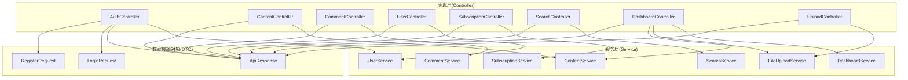
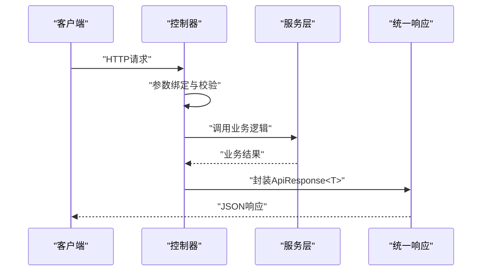
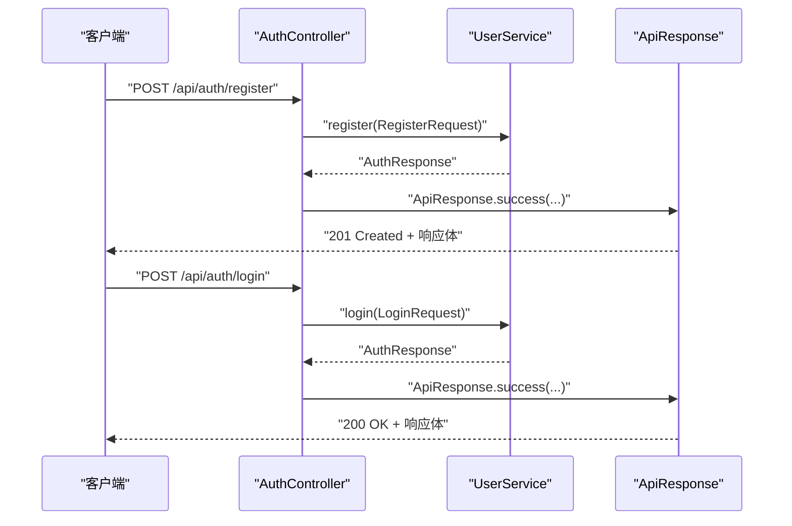
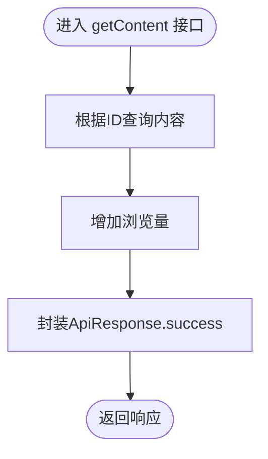

# 控制器层设计

<cite>
**本文档引用的文件**
- [AuthController.java](file://communication-backend/src/main/java/com/communication/controller/AuthController.java)
- [ContentController.java](file://communication-backend/src/main/java/com/communication/controller/ContentController.java)
- [CommentController.java](file://communication-backend/src/main/java/com/communication/controller/CommentController.java)
- [UserController.java](file://communication-backend/src/main/java/com/communication/controller/UserController.java)
- [SubscriptionController.java](file://communication-backend/src/main/java/com/communication/controller/SubscriptionController.java)
- [SearchController.java](file://communication-backend/src/main/java/com/communication/controller/SearchController.java)
- [DashboardController.java](file://communication-backend/src/main/java/com/communication/controller/DashboardController.java)
- [UploadController.java](file://communication-backend/src/main/java/com/communication/controller/UploadController.java)
- [ApiResponse.java](file://communication-backend/src/main/java/com/communication/dto/ApiResponse.java)
- [LoginRequest.java](file://communication-backend/src/main/java/com/communication/dto/LoginRequest.java)
- [RegisterRequest.java](file://communication-backend/src/main/java/com/communication/dto/RegisterRequest.java)
- [JwtAuthenticationFilter.java](file://communication-backend/src/main/java/com/communication/config/JwtAuthenticationFilter.java)
- [SecurityConfig.java](file://communication-backend/src/main/java/com/communication/config/SecurityConfig.java)
- [GlobalExceptionHandler.java](file://communication-backend/src/main/java/com/communication/exception/GlobalExceptionHandler.java)
- [UserService.java](file://communication-backend/src/main/java/com/communication/service/UserService.java)
- [UserServiceImpl.java](file://communication-backend/src/main/java/com/communication/service/impl/UserServiceImpl.java)
- [application.yml](file://communication-backend/src/main/resources/application.yml)
</cite>

## 目录
1. [简介](#简介)
2. [项目结构](#项目结构)
3. [核心组件](#核心组件)
4. [架构总览](#架构总览)
5. [详细组件分析](#详细组件分析)
6. [依赖关系分析](#依赖关系分析)
7. [性能考虑](#性能考虑)
8. [故障排除指南](#故障排除指南)
9. [结论](#结论)

## 简介
本文件为通信平台的Controller层设计提供系统化、可操作的技术文档。重点阐述RESTful控制器的设计原则与实现方式，包括：
- 使用@RestController与@RequestMapping进行路径映射与HTTP方法映射
- 各核心控制器的职责边界与接口设计
- 请求参数接收、参数校验、调用Service层业务逻辑、统一响应封装
- 异常处理机制、参数验证与安全控制（基于Spring Security与JWT）

## 项目结构
后端采用标准的分层架构，Controller层位于表现层，负责接收HTTP请求、参数绑定与校验、调用Service层并返回统一响应格式。各控制器通过依赖注入使用对应Service接口，确保高内聚低耦合。

图表来源
- [AuthController.java](file://communication-backend/src/main/java/com/communication/controller/AuthController.java#L12-L41)
- [ContentController.java](file://communication-backend/src/main/java/com/communication/controller/ContentController.java#L13-L84)
- [CommentController.java](file://communication-backend/src/main/java/com/communication/controller/CommentController.java#L13-L54)
- [UserController.java](file://communication-backend/src/main/java/com/communication/controller/UserController.java#L10-L25)
- [SubscriptionController.java](file://communication-backend/src/main/java/com/communication/controller/SubscriptionController.java#L9-L76)
- [SearchController.java](file://communication-backend/src/main/java/com/communication/controller/SearchController.java#L13-L55)
- [DashboardController.java](file://communication-backend/src/main/java/com/communication/controller/DashboardController.java#L13-L64)
- [UploadController.java](file://communication-backend/src/main/java/com/communication/controller/UploadController.java#L13-L58)
- [ApiResponse.java](file://communication-backend/src/main/java/com/communication/dto/ApiResponse.java#L8-L75)
- [LoginRequest.java](file://communication-backend/src/main/java/com/communication/dto/LoginRequest.java#L5-L19)
- [RegisterRequest.java](file://communication-backend/src/main/java/com/communication/dto/RegisterRequest.java#L7-L29)

章节来源
- [AuthController.java](file://communication-backend/src/main/java/com/communication/controller/AuthController.java#L12-L41)
- [ContentController.java](file://communication-backend/src/main/java/com/communication/controller/ContentController.java#L13-L84)
- [CommentController.java](file://communication-backend/src/main/java/com/communication/controller/CommentController.java#L13-L54)
- [UserController.java](file://communication-backend/src/main/java/com/communication/controller/UserController.java#L10-L25)
- [SubscriptionController.java](file://communication-backend/src/main/java/com/communication/controller/SubscriptionController.java#L9-L76)
- [SearchController.java](file://communication-backend/src/main/java/com/communication/controller/SearchController.java#L13-L55)
- [DashboardController.java](file://communication-backend/src/main/java/com/communication/controller/DashboardController.java#L13-L64)
- [UploadController.java](file://communication-backend/src/main/java/com/communication/controller/UploadController.java#L13-L58)

## 核心组件
- 统一响应封装：所有控制器返回值均包装在ApiResponse<T>中，包含状态码、消息、时间戳与数据体，便于前端统一处理。
- 参数校验：使用Jakarta Validation对请求体与路径/查询参数进行约束校验，结合全局异常处理器返回结构化错误。
- 安全控制：基于Spring Security与JWT过滤器，实现无状态认证；通过SecurityConfig定义公开与受保护端点。
- 依赖注入：控制器通过构造函数注入Service接口，遵循面向接口编程与依赖倒置原则。

章节来源
- [ApiResponse.java](file://communication-backend/src/main/java/com/communication/dto/ApiResponse.java#L8-L75)
- [GlobalExceptionHandler.java](file://communication-backend/src/main/java/com/communication/exception/GlobalExceptionHandler.java#L15-L62)
- [JwtAuthenticationFilter.java](file://communication-backend/src/main/java/com/communication/config/JwtAuthenticationFilter.java#L21-L67)
- [SecurityConfig.java](file://communication-backend/src/main/java/com/communication/config/SecurityConfig.java#L26-L87)

## 架构总览
控制器层通过RESTful接口对外提供能力，内部通过依赖注入调用Service层，最终由统一响应封装返回。安全层在过滤器链中完成JWT解析与认证设置，授权策略在SecurityConfig中集中配置。

图表来源
- [AuthController.java](file://communication-backend/src/main/java/com/communication/controller/AuthController.java#L22-L40)
- [ContentController.java](file://communication-backend/src/main/java/com/communication/controller/ContentController.java#L23-L62)
- [ApiResponse.java](file://communication-backend/src/main/java/com/communication/dto/ApiResponse.java#L32-L56)

## 详细组件分析

### 认证控制器 AuthController
- 职责：用户注册、登录、获取当前用户信息
- 关键接口
  - POST /api/auth/register：注册，返回令牌与用户信息
  - POST /api/auth/login：登录，返回令牌与用户信息
  - GET /api/auth/me：获取当前登录用户信息
- 设计要点
  - 使用@RequestBody接收请求体，@Valid触发参数校验
  - 使用@AuthenticationPrincipal从Security上下文获取当前用户名
  - 返回ApiResponse.success，状态码按语义设置（创建/成功）
- 安全与异常
  - 登录失败抛出凭据异常，由全局异常处理器转换为401响应
  - 注册时重复用户名/邮箱抛出业务异常，转换为400响应

图表来源
- [AuthController.java](file://communication-backend/src/main/java/com/communication/controller/AuthController.java#L22-L40)
- [UserService.java](file://communication-backend/src/main/java/com/communication/service/UserService.java#L6-L19)
- [UserServiceImpl.java](file://communication-backend/src/main/java/com/communication/service/impl/UserServiceImpl.java#L28-L62)
- [ApiResponse.java](file://communication-backend/src/main/java/com/communication/dto/ApiResponse.java#L32-L56)

章节来源
- [AuthController.java](file://communication-backend/src/main/java/com/communication/controller/AuthController.java#L12-L41)
- [LoginRequest.java](file://communication-backend/src/main/java/com/communication/dto/LoginRequest.java#L5-L19)
- [RegisterRequest.java](file://communication-backend/src/main/java/com/communication/dto/RegisterRequest.java#L7-L29)
- [UserService.java](file://communication-backend/src/main/java/com/communication/service/UserService.java#L6-L19)
- [UserServiceImpl.java](file://communication-backend/src/main/java/com/communication/service/impl/UserServiceImpl.java#L28-L62)

### 内容控制器 ContentController
- 职责：内容的创建、分页查询、详情查看、更新、删除、作者筛选、个人内容查询
- 关键接口
  - POST /api/contents：创建内容
  - GET /api/contents：分页查询已发布内容
  - GET /api/contents/{id}：获取内容详情并增加浏览量
  - PUT /api/contents/{id}：更新内容
  - DELETE /api/contents/{id}：删除内容
  - GET /api/contents/user/{authorId}：按作者分页查询
  - GET /api/contents/my：查询个人内容（支持状态筛选）
- 设计要点
  - 使用@AuthenticationPrincipal传递当前用户名，用于权限校验与归属判断
  - 分页参数默认值在@RequestParam中定义，保证接口健壮性
  - 浏览量统计在获取详情后异步或同步递增（视具体实现而定）

图表来源
- [ContentController.java](file://communication-backend/src/main/java/com/communication/controller/ContentController.java#L41-L46)

章节来源
- [ContentController.java](file://communication-backend/src/main/java/com/communication/controller/ContentController.java#L13-L84)

### 评论控制器 CommentController
- 职责：针对内容的评论创建、分页查询、详情查询、删除
- 关键接口
  - POST /api/contents/{contentId}/comments：创建评论
  - GET /api/contents/{contentId}/comments：按内容分页查询评论
  - GET /api/contents/{contentId}/comments/{commentId}：查询评论详情
  - DELETE /api/contents/{contentId}/comments/{commentId}：删除评论
- 设计要点
  - 使用@PathVariable绑定contentId，确保评论与内容关联
  - 使用Authentication获取当前用户名，用于评论归属与删除权限校验

章节来源
- [CommentController.java](file://communication-backend/src/main/java/com/communication/controller/CommentController.java#L13-L54)

### 用户控制器 UserController
- 职责：按用户名查询用户信息
- 关键接口
  - GET /api/users/{username}：查询用户详情（返回UserDto）
- 设计要点
  - 使用@PathVariable接收字符串类型的username
  - 通过UserService查询用户并转换为DTO返回

章节来源
- [UserController.java](file://communication-backend/src/main/java/com/communication/controller/UserController.java#L10-L25)

### 订阅控制器 SubscriptionController
- 职责：关注/取消关注、检查关注状态、查询我的关注/粉丝、订阅内容流、统计关注/粉丝数
- 关键接口
  - POST /api/subscriptions/{authorId}：关注作者
  - DELETE /api/subscriptions/{authorId}：取消关注
  - GET /api/subscriptions/check/{authorId}：检查是否已关注
  - GET /api/subscriptions/my：查询我的关注列表
  - GET /api/subscriptions/followers/{userId}：查询某用户的粉丝
  - GET /api/subscriptions/feed：获取订阅内容流
  - GET /api/subscriptions/count/{userId}：获取关注/粉丝数量
- 设计要点
  - 使用Authentication获取当前用户名，避免硬编码用户标识
  - 分页参数默认值在@RequestParam中定义

章节来源
- [SubscriptionController.java](file://communication-backend/src/main/java/com/communication/controller/SubscriptionController.java#L9-L76)

### 搜索控制器 SearchController
- 职责：内容搜索、用户搜索、热门标签、标签建议
- 关键接口
  - GET /api/search/contents：搜索内容（支持关键词与标签）
  - GET /api/search/users：搜索用户
  - GET /api/search/tags/popular：热门标签
  - GET /api/search/tags/suggest：标签建议
- 设计要点
  - 查询参数支持可选与默认值，提升易用性
  - 返回PageResponse封装分页结果

章节来源
- [SearchController.java](file://communication-backend/src/main/java/com/communication/controller/SearchController.java#L13-L55)

### 仪表盘控制器 DashboardController
- 职责：获取统计数据、查询个人内容、更新个人资料、上传头像
- 关键接口
  - GET /api/dashboard/stats：获取统计信息
  - GET /api/dashboard/contents：查询个人内容（支持状态筛选）
  - PUT /api/dashboard/profile：更新个人资料
  - POST /api/dashboard/avatar：上传头像
- 设计要点
  - 通过Authentication获取当前用户名，避免跨用户操作
  - 头像上传使用MultipartFile，调用FileUploadService完成存储并回写用户头像URL

章节来源
- [DashboardController.java](file://communication-backend/src/main/java/com/communication/controller/DashboardController.java#L13-L64)

### 文件上传控制器 UploadController
- 职责：图片与视频上传，类型校验与结果封装
- 关键接口
  - POST /api/upload/image：上传图片（限制类型）
  - POST /api/upload/video：上传视频（限制类型）
- 设计要点
  - 对文件类型进行显式校验，非法类型直接返回400
  - 返回包含URL与媒体类型的结构化结果

章节来源
- [UploadController.java](file://communication-backend/src/main/java/com/communication/controller/UploadController.java#L13-L58)

## 依赖关系分析
- 控制器到服务层：每个控制器通过构造函数注入对应的Service接口，实现松耦合
- 服务层到仓储层：Service实现类依赖Repository进行数据访问
- 统一响应：所有控制器返回值统一包装为ApiResponse<T>，保持响应一致性
- 全局异常：GlobalExceptionHandler集中处理业务异常、参数校验异常与通用异常，返回标准化错误响应

```mermaid
classDiagram
class AuthController
class ContentController
class CommentController
class UserController
class SubscriptionController
class SearchController
class DashboardController
class UploadController
class UserService
class ContentService
class CommentService
class SubscriptionService
class SearchService
class DashboardService
class FileUploadService
class ApiResponse_T_
class LoginRequest
class RegisterRequest
AuthController --> UserService : "依赖"
ContentController --> ContentService : "依赖"
CommentController --> CommentService : "依赖"
UserController --> UserService : "依赖"
SubscriptionController --> SubscriptionService : "依赖"
SearchController --> SearchService : "依赖"
DashboardController --> DashboardService : "依赖"
DashboardController --> ContentService : "依赖"
DashboardController --> FileUploadService : "依赖"
UploadController --> FileUploadService : "依赖"
AuthController --> ApiResponse_T_ : "返回"
ContentController --> ApiResponse_T_ : "返回"
CommentController --> ApiResponse_T_ : "返回"
UserController --> ApiResponse_T_ : "返回"
SubscriptionController --> ApiResponse_T_ : "返回"
SearchController --> ApiResponse_T_ : "返回"
DashboardController --> ApiResponse_T_ : "返回"
UploadController --> ApiResponse_T_ : "返回"
AuthController --> LoginRequest : "参数"
AuthController --> RegisterRequest : "参数"
```

图表来源
- [AuthController.java](file://communication-backend/src/main/java/com/communication/controller/AuthController.java#L16-L20)
- [ContentController.java](file://communication-backend/src/main/java/com/communication/controller/ContentController.java#L17-L21)
- [CommentController.java](file://communication-backend/src/main/java/com/communication/controller/CommentController.java#L17-L21)
- [UserController.java](file://communication-backend/src/main/java/com/communication/controller/UserController.java#L14-L18)
- [SubscriptionController.java](file://communication-backend/src/main/java/com/communication/controller/SubscriptionController.java#L13-L17)
- [SearchController.java](file://communication-backend/src/main/java/com/communication/controller/SearchController.java#L17-L21)
- [DashboardController.java](file://communication-backend/src/main/java/com/communication/controller/DashboardController.java#L17-L25)
- [UploadController.java](file://communication-backend/src/main/java/com/communication/controller/UploadController.java#L17-L21)
- [ApiResponse.java](file://communication-backend/src/main/java/com/communication/dto/ApiResponse.java#L8-L75)
- [LoginRequest.java](file://communication-backend/src/main/java/com/communication/dto/LoginRequest.java#L5-L19)
- [RegisterRequest.java](file://communication-backend/src/main/java/com/communication/dto/RegisterRequest.java#L7-L29)

## 性能考虑
- 分页查询：所有列表接口均支持page与size参数，默认值降低客户端负担
- 统一响应：减少重复字段，便于网络传输与前端解析
- 无状态认证：JWT过滤器避免会话开销，提高横向扩展能力
- 文件上传：配置了合理的最大文件大小与请求大小，避免内存溢出

## 故障排除指南
- 参数校验失败：全局异常处理器将MethodArgumentNotValidException转换为包含字段级错误的400响应
- 凭据错误：登录失败抛出凭据异常，统一返回401与明确提示
- 资源不存在：ResourceNotFoundException统一返回404
- 通用异常：未捕获异常统一返回500与通用错误消息
- 文件类型错误：UploadController对非法类型直接返回400并给出允许类型说明

章节来源
- [GlobalExceptionHandler.java](file://communication-backend/src/main/java/com/communication/exception/GlobalExceptionHandler.java#L18-L61)
- [UploadController.java](file://communication-backend/src/main/java/com/communication/controller/UploadController.java#L27-L30)
- [application.yml](file://communication-backend/src/main/resources/application.yml#L25-L41)

## 结论
本Controller层设计遵循RESTful最佳实践，通过统一响应、参数校验、安全过滤与异常处理形成闭环，既保证了接口的一致性与可维护性，又提升了系统的安全性与用户体验。建议后续持续优化：
- 在高频接口上引入缓存策略（如热门内容、标签建议）
- 对大文件上传增加进度反馈与断点续传能力
- 扩展审计日志，记录关键操作（关注、评论、内容变更等）