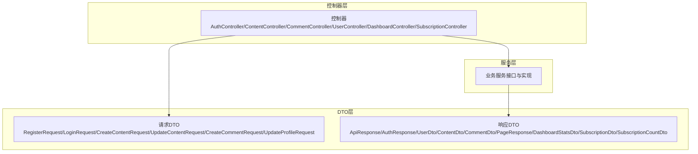
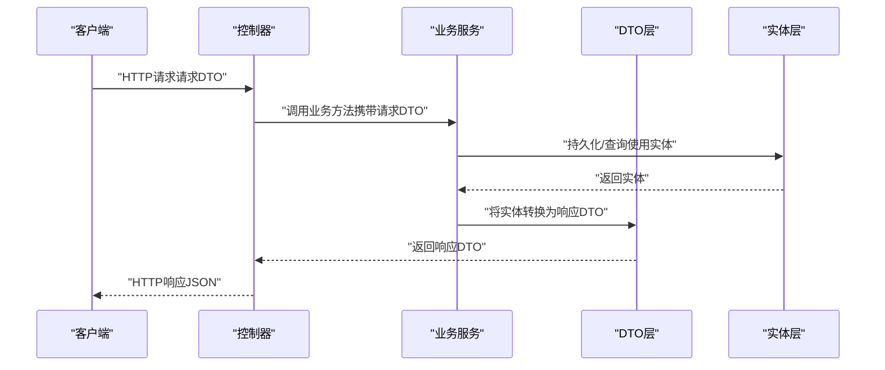
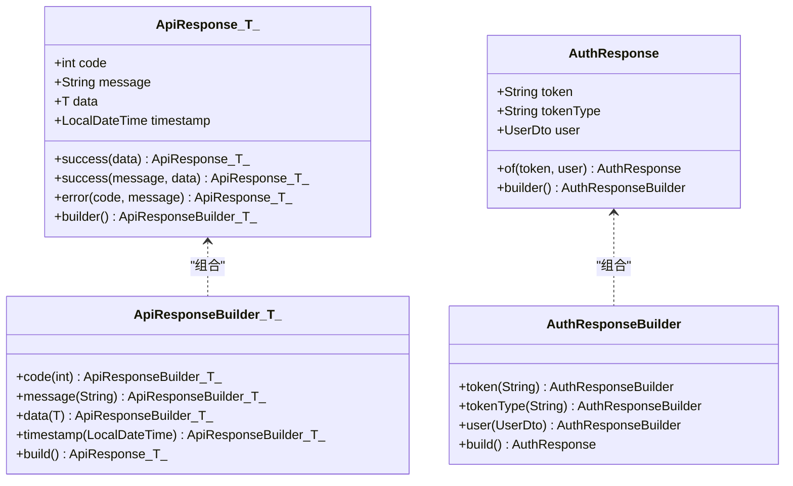
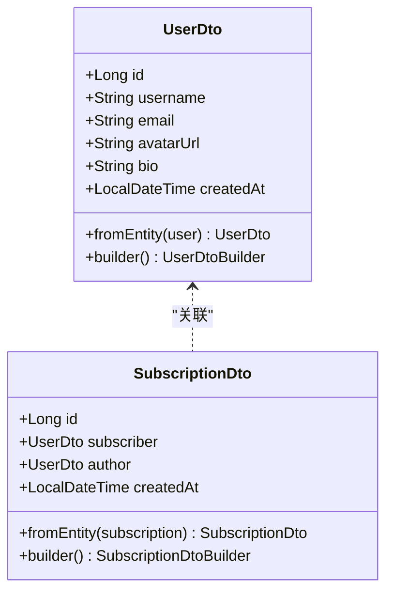
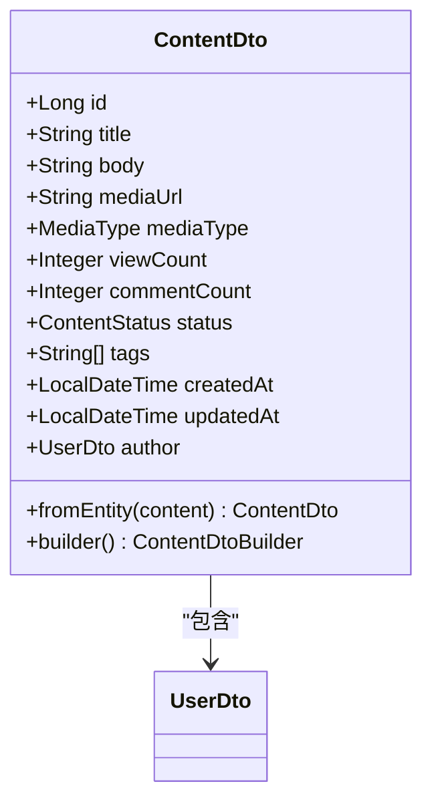
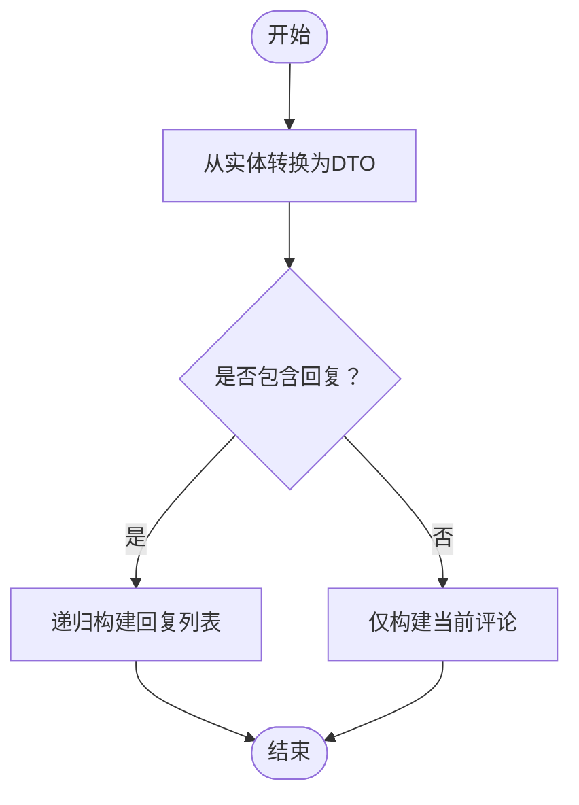
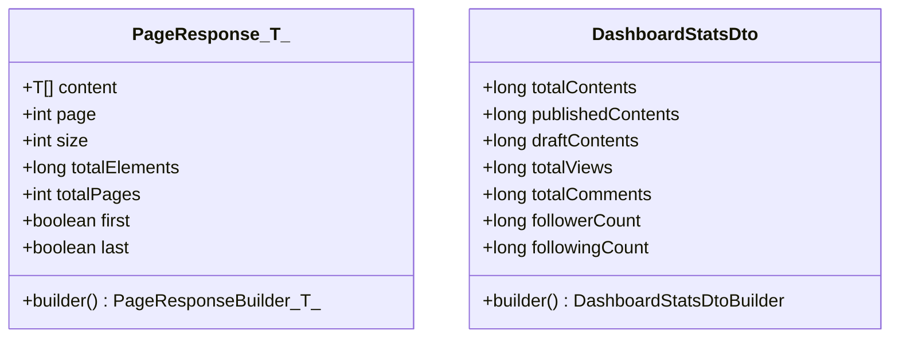
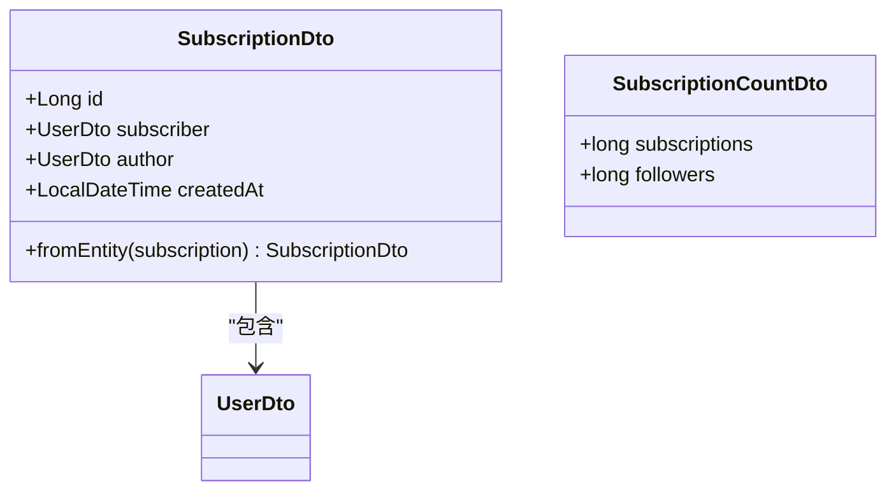
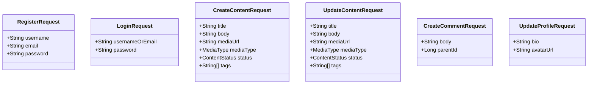
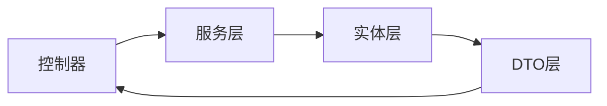

# DTO模式设计

<cite>
**本文档引用的文件**
- [ApiResponse.java](file://communication-backend/src/main/java/com/communication/dto/ApiResponse.java)
- [AuthResponse.java](file://communication-backend/src/main/java/com/communication/dto/AuthResponse.java)
- [UserDto.java](file://communication-backend/src/main/java/com/communication/dto/UserDto.java)
- [ContentDto.java](file://communication-backend/src/main/java/com/communication/dto/ContentDto.java)
- [CommentDto.java](file://communication-backend/src/main/java/com/communication/dto/CommentDto.java)
- [RegisterRequest.java](file://communication-backend/src/main/java/com/communication/dto/RegisterRequest.java)
- [LoginRequest.java](file://communication-backend/src/main/java/com/communication/dto/LoginRequest.java)
- [CreateContentRequest.java](file://communication-backend/src/main/java/com/communication/dto/CreateContentRequest.java)
- [UpdateContentRequest.java](file://communication-backend/src/main/java/com/communication/dto/UpdateContentRequest.java)
- [CreateCommentRequest.java](file://communication-backend/src/main/java/com/communication/dto/CreateCommentRequest.java)
- [PageResponse.java](file://communication-backend/src/main/java/com/communication/dto/PageResponse.java)
- [DashboardStatsDto.java](file://communication-backend/src/main/java/com/communication/dto/DashboardStatsDto.java)
- [SubscriptionDto.java](file://communication-backend/src/main/java/com/communication/dto/SubscriptionDto.java)
- [SubscriptionCountDto.java](file://communication-backend/src/main/java/com/communication/dto/SubscriptionCountDto.java)
- [UpdateProfileRequest.java](file://communication-backend/src/main/java/com/communication/dto/UpdateProfileRequest.java)
</cite>

## 目录
1. [引言](#引言)
2. [项目结构](#项目结构)
3. [核心组件](#核心组件)
4. [架构总览](#架构总览)
5. [详细组件分析](#详细组件分析)
6. [依赖关系分析](#依赖关系分析)
7. [性能考量](#性能考量)
8. [故障排查指南](#故障排查指南)
9. [结论](#结论)
10. [附录](#附录)

## 引言
本文件系统性阐述通信平台的DTO（数据传输对象）模式设计，覆盖DTO与实体（Entity）的边界、在MVC架构中的职责分工、数据封装策略、序列化/反序列化与字段映射、校验注解的使用、版本管理与向后兼容性、性能优化与最佳实践。通过对响应DTO（如 ApiResponse、AuthResponse、UserDto、ContentDto、CommentDto）、请求DTO（如 RegisterRequest、LoginRequest、CreateContentRequest、UpdateContentRequest、CreateCommentRequest）以及分页DTO（PageResponse）等的深入分析，帮助开发者在保持接口稳定与安全的同时，提升系统的可维护性与扩展性。

## 项目结构
通信平台采用典型的后端分层架构，DTO位于业务层与控制器之间，承担对外输出与输入的数据封装职责。DTO包内按功能域划分，包含用户、内容、评论、订阅、仪表盘等领域的响应与请求对象，配合服务层进行数据转换与业务处理。

**章节来源**
- file://communication-backend/src/main/java/com/communication/dto/ApiResponse.java#L1-L76
- file://communication-backend/src/main/java/com/communication/dto/AuthResponse.java#L1-L47
- file://communication-backend/src/main/java/com/communication/dto/UserDto.java#L1-L72
- file://communication-backend/src/main/java/com/communication/dto/ContentDto.java#L1-L118
- file://communication-backend/src/main/java/com/communication/dto/CommentDto.java#L1-L99
- file://communication-backend/src/main/java/com/communication/dto/RegisterRequest.java#L1-L30
- file://communication-backend/src/main/java/com/communication/dto/LoginRequest.java#L1-L20
- file://communication-backend/src/main/java/com/communication/dto/CreateContentRequest.java#L1-L42
- file://communication-backend/src/main/java/com/communication/dto/UpdateContentRequest.java#L1-L40
- file://communication-backend/src/main/java/com/communication/dto/CreateCommentRequest.java#L1-L21
- file://communication-backend/src/main/java/com/communication/dto/PageResponse.java#L1-L65
- file://communication-backend/src/main/java/com/communication/dto/DashboardStatsDto.java#L1-L64
- file://communication-backend/src/main/java/com/communication/dto/SubscriptionDto.java#L1-L59
- file://communication-backend/src/main/java/com/communication/dto/SubscriptionCountDto.java#L1-L19
- file://communication-backend/src/main/java/com/communication/dto/UpdateProfileRequest.java#L1-L19

## 核心组件
- 响应DTO
  - ApiResponse：统一API响应包装，支持泛型数据承载、时间戳与状态码封装，提供静态工厂方法快速构建成功/错误响应。
  - AuthResponse：认证响应，包含访问令牌、令牌类型与用户信息。
  - UserDto：用户信息封装，提供从实体转换的静态工厂方法与构建器。
  - ContentDto：内容信息封装，包含媒体类型、状态、标签、作者等，并提供从实体转换的方法。
  - CommentDto：评论信息封装，支持树形回复结构的转换与构建。
  - PageResponse：分页响应封装，包含分页元数据与内容列表。
  - DashboardStatsDto：仪表盘统计聚合DTO。
  - SubscriptionDto：订阅关系DTO，包含订阅者与作者信息。
  - SubscriptionCountDto：订阅数量聚合DTO。
- 请求DTO
  - RegisterRequest：注册请求，包含用户名、邮箱、密码的校验约束。
  - LoginRequest：登录请求，包含用户名或邮箱、密码的校验约束。
  - CreateContentRequest：创建内容请求，包含标题、正文、媒体、状态、标签等字段与默认值。
  - UpdateContentRequest：更新内容请求，包含可选字段与标签限制。
  - CreateCommentRequest：创建评论请求，包含评论内容与父评论ID。
  - UpdateProfileRequest：更新个人资料请求，包含简介与头像URL。

**章节来源**
- file://communication-backend/src/main/java/com/communication/dto/ApiResponse.java#L1-L76
- file://communication-backend/src/main/java/com/communication/dto/AuthResponse.java#L1-L47
- file://communication-backend/src/main/java/com/communication/dto/UserDto.java#L1-L72
- file://communication-backend/src/main/java/com/communication/dto/ContentDto.java#L1-L118
- file://communication-backend/src/main/java/com/communication/dto/CommentDto.java#L1-L99
- file://communication-backend/src/main/java/com/communication/dto/PageResponse.java#L1-L65
- file://communication-backend/src/main/java/com/communication/dto/DashboardStatsDto.java#L1-L64
- file://communication-backend/src/main/java/com/communication/dto/SubscriptionDto.java#L1-L59
- file://communication-backend/src/main/java/com/communication/dto/SubscriptionCountDto.java#L1-L19
- file://communication-backend/src/main/java/com/communication/dto/RegisterRequest.java#L1-L30
- file://communication-backend/src/main/java/com/communication/dto/LoginRequest.java#L1-L20
- file://communication-backend/src/main/java/com/communication/dto/CreateContentRequest.java#L1-L42
- file://communication-backend/src/main/java/com/communication/dto/UpdateContentRequest.java#L1-L40
- file://communication-backend/src/main/java/com/communication/dto/CreateCommentRequest.java#L1-L21
- file://communication-backend/src/main/java/com/communication/dto/UpdateProfileRequest.java#L1-L19

## 架构总览
DTO在MVC中的定位与流转如下：

**图表来源**
- file://communication-backend/src/main/java/com/communication/dto/ApiResponse.java#L1-L76
- file://communication-backend/src/main/java/com/communication/dto/AuthResponse.java#L1-L47
- file://communication-backend/src/main/java/com/communication/dto/UserDto.java#L1-L72
- file://communication-backend/src/main/java/com/communication/dto/ContentDto.java#L1-L118
- file://communication-backend/src/main/java/com/communication/dto/CommentDto.java#L1-L99
- file://communication-backend/src/main/java/com/communication/dto/RegisterRequest.java#L1-L30
- file://communication-backend/src/main/java/com/communication/dto/LoginRequest.java#L1-L20
- file://communication-backend/src/main/java/com/communication/dto/CreateContentRequest.java#L1-L42
- file://communication-backend/src/main/java/com/communication/dto/UpdateContentRequest.java#L1-L40
- file://communication-backend/src/main/java/com/communication/dto/CreateCommentRequest.java#L1-L21

## 详细组件分析

### 响应DTO：ApiResponse 与 AuthResponse
- ApiResponse
  - 统一响应结构：包含状态码、消息、数据体与时间戳。
  - 泛型支持：通过泛型承载任意数据类型，便于不同接口复用。
  - 静态工厂与构建器：提供成功/错误响应的便捷构造方式，减少样板代码。
  - 序列化策略：通过注解控制空字段不参与序列化，降低响应体积。
- AuthResponse
  - 认证结果封装：包含访问令牌、令牌类型与用户信息。
  - 构建器与静态工厂：提供便捷的构建方式，保证字段一致性。

**图表来源**
- file://communication-backend/src/main/java/com/communication/dto/ApiResponse.java#L1-L76
- file://communication-backend/src/main/java/com/communication/dto/AuthResponse.java#L1-L47

**章节来源**
- file://communication-backend/src/main/java/com/communication/dto/ApiResponse.java#L1-L76
- file://communication-backend/src/main/java/com/communication/dto/AuthResponse.java#L1-L47

### 用户领域：UserDto 与 SubscriptionDto
- UserDto
  - 字段映射：从用户实体抽取必要字段，避免直接暴露持久层细节。
  - 转换方法：提供从实体转换的静态方法，集中处理字段映射逻辑。
  - 构建器：支持链式构建，便于测试与装配。
- SubscriptionDto
  - 关系封装：封装订阅者与作者的用户信息，便于前端展示。
  - 实体转换：提供从订阅实体转换的静态方法，确保DTO一致性。

**图表来源**
- file://communication-backend/src/main/java/com/communication/dto/UserDto.java#L1-L72
- file://communication-backend/src/main/java/com/communication/dto/SubscriptionDto.java#L1-L59

**章节来源**
- file://communication-backend/src/main/java/com/communication/dto/UserDto.java#L1-L72
- file://communication-backend/src/main/java/com/communication/dto/SubscriptionDto.java#L1-L59

### 内容领域：ContentDto
- 字段设计：标题、正文、媒体URL/类型、浏览量、评论数、状态、标签、创建/更新时间、作者。
- 实体转换：从内容实体转换时，同时转换作者信息，保证DTO完整性。
- 可扩展性：通过枚举类型（媒体类型、状态）与列表标签，支持未来扩展。

**图表来源**
- file://communication-backend/src/main/java/com/communication/dto/ContentDto.java#L1-L118
- file://communication-backend/src/main/java/com/communication/dto/UserDto.java#L1-L72

**章节来源**
- file://communication-backend/src/main/java/com/communication/dto/ContentDto.java#L1-L118

### 评论领域：CommentDto
- 层级结构：支持父子评论与回复列表，适合树形展示。
- 实体转换：从评论实体转换时，可选择是否包含回复列表，以控制深度与性能。
- 空值处理：父评论为空时，parentId为null，避免冗余数据。

**图表来源**
- file://communication-backend/src/main/java/com/communication/dto/CommentDto.java#L1-L99

**章节来源**
- file://communication-backend/src/main/java/com/communication/dto/CommentDto.java#L1-L99

### 分页与统计：PageResponse 与 DashboardStatsDto
- PageResponse
  - 分页元数据：页码、大小、总数、总页数、是否首页/末页。
  - 泛型支持：对任意内容类型进行分页封装。
  - 构建器：便于组装分页响应。
- DashboardStatsDto
  - 统计聚合：内容总数、已发布/草稿、总浏览量、总评论数、关注/粉丝数。
  - 构建器：便于聚合统计结果。

**图表来源**
- file://communication-backend/src/main/java/com/communication/dto/PageResponse.java#L1-L65
- file://communication-backend/src/main/java/com/communication/dto/DashboardStatsDto.java#L1-L64

**章节来源**
- file://communication-backend/src/main/java/com/communication/dto/PageResponse.java#L1-L65
- file://communication-backend/src/main/java/com/communication/dto/DashboardStatsDto.java#L1-L64

### 订阅与计数：SubscriptionDto 与 SubscriptionCountDto
- SubscriptionDto：封装订阅关系，包含订阅者与作者信息。
- SubscriptionCountDto：封装订阅数量与粉丝数量，便于前端展示。

**图表来源**
- file://communication-backend/src/main/java/com/communication/dto/SubscriptionDto.java#L1-L59
- file://communication-backend/src/main/java/com/communication/dto/SubscriptionCountDto.java#L1-L19
- file://communication-backend/src/main/java/com/communication/dto/UserDto.java#L1-L72

**章节来源**
- file://communication-backend/src/main/java/com/communication/dto/SubscriptionDto.java#L1-L59
- file://communication-backend/src/main/java/com/communication/dto/SubscriptionCountDto.java#L1-L19

### 请求DTO：RegisterRequest、LoginRequest、CreateContentRequest、UpdateContentRequest、CreateCommentRequest、UpdateProfileRequest
- RegisterRequest
  - 校验规则：用户名长度、邮箱格式、密码长度。
  - 用途：用户注册时的输入校验。
- LoginRequest
  - 校验规则：用户名或邮箱非空、密码非空。
  - 用途：用户登录时的输入校验。
- CreateContentRequest
  - 默认值：媒体类型与状态设置默认值，简化调用方。
  - 标签限制：最多10个标签，防止过度标签化。
  - 用途：创建内容时的输入校验与传输。
- UpdateContentRequest
  - 可选字段：允许部分字段更新。
  - 标签限制：最多10个标签。
  - 用途：更新内容时的输入校验与传输。
- CreateCommentRequest
  - 校验规则：评论内容长度限制、父评论ID可选。
  - 用途：创建评论时的输入校验与传输。
- UpdateProfileRequest
  - 校验规则：简介长度限制、头像URL可选。
  - 用途：更新个人资料时的输入校验与传输。

**图表来源**
- file://communication-backend/src/main/java/com/communication/dto/RegisterRequest.java#L1-L30
- file://communication-backend/src/main/java/com/communication/dto/LoginRequest.java#L1-L20
- file://communication-backend/src/main/java/com/communication/dto/CreateContentRequest.java#L1-L42
- file://communication-backend/src/main/java/com/communication/dto/UpdateContentRequest.java#L1-L40
- file://communication-backend/src/main/java/com/communication/dto/CreateCommentRequest.java#L1-L21
- file://communication-backend/src/main/java/com/communication/dto/UpdateProfileRequest.java#L1-L19

**章节来源**
- file://communication-backend/src/main/java/com/communication/dto/RegisterRequest.java#L1-L30
- file://communication-backend/src/main/java/com/communication/dto/LoginRequest.java#L1-L20
- file://communication-backend/src/main/java/com/communication/dto/CreateContentRequest.java#L1-L42
- file://communication-backend/src/main/java/com/communication/dto/UpdateContentRequest.java#L1-L40
- file://communication-backend/src/main/java/com/communication/dto/CreateCommentRequest.java#L1-L21
- file://communication-backend/src/main/java/com/communication/dto/UpdateProfileRequest.java#L1-L19

## 依赖关系分析
- 控制器到服务：控制器接收请求DTO，调用服务层执行业务逻辑；服务层返回实体，再由DTO层转换为响应DTO。
- DTO到实体：UserDto、ContentDto、CommentDto、SubscriptionDto均提供fromEntity方法，集中处理实体到DTO的映射。
- 分页与统计：PageResponse与DashboardStatsDto分别服务于分页查询与统计展示场景。

**图表来源**
- file://communication-backend/src/main/java/com/communication/dto/UserDto.java#L1-L72
- file://communication-backend/src/main/java/com/communication/dto/ContentDto.java#L1-L118
- file://communication-backend/src/main/java/com/communication/dto/CommentDto.java#L1-L99
- file://communication-backend/src/main/java/com/communication/dto/SubscriptionDto.java#L1-L59
- file://communication-backend/src/main/java/com/communication/dto/PageResponse.java#L1-L65
- file://communication-backend/src/main/java/com/communication/dto/DashboardStatsDto.java#L1-L64

**章节来源**
- file://communication-backend/src/main/java/com/communication/dto/UserDto.java#L1-L72
- file://communication-backend/src/main/java/com/communication/dto/ContentDto.java#L1-L118
- file://communication-backend/src/main/java/com/communication/dto/CommentDto.java#L1-L99
- file://communication-backend/src/main/java/com/communication/dto/SubscriptionDto.java#L1-L59
- file://communication-backend/src/main/java/com/communication/dto/PageResponse.java#L1-L65
- file://communication-backend/src/main/java/com/communication/dto/DashboardStatsDto.java#L1-L64

## 性能考量
- 序列化优化
  - 使用统一响应包装（ApiResponse）与空字段排除策略，减少不必要的字段传输，降低带宽占用。
  - 分页响应（PageResponse）仅返回必要元数据与内容列表，避免一次性加载过多数据。
- 映射效率
  - DTO提供fromEntity方法，集中处理映射逻辑，避免在多处重复编写映射代码，提升可维护性与性能一致性。
  - 对于树形结构（评论），提供“仅主信息”与“包含回复”的两种转换方式，按需选择以平衡性能与功能。
- 默认值与约束
  - 请求DTO中为媒体类型与状态设置默认值，减少前端传参复杂度；同时通过校验注解保证输入质量，降低后续处理成本。
- 缓存与懒加载
  - 对频繁访问的统计信息（DashboardStatsDto）可结合缓存策略，减少数据库压力。

[本节为通用性能建议，无需特定文件引用]

## 故障排查指南
- 常见问题
  - 字段缺失或类型不匹配：检查请求DTO的校验注解与控制器绑定是否正确。
  - 响应格式异常：确认统一响应包装（ApiResponse）是否正确使用，以及空字段排除策略是否符合预期。
  - 树形评论未展开：确认调用的是包含回复的转换方法还是仅主信息的转换方法。
- 排查步骤
  - 检查控制器入参绑定与校验异常。
  - 检查服务层返回实体是否完整，DTO转换方法是否正确。
  - 检查分页参数与排序条件，确保PageResponse的元数据正确。
- 相关实现参考
  - 统一响应包装与构建器：ApiResponse
  - 认证响应封装：AuthResponse
  - 实体转换方法：UserDto.fromEntity、ContentDto.fromEntity、CommentDto.fromEntity、SubscriptionDto.fromEntity
  - 分页响应：PageResponse

**章节来源**
- file://communication-backend/src/main/java/com/communication/dto/ApiResponse.java#L1-L76
- file://communication-backend/src/main/java/com/communication/dto/AuthResponse.java#L1-L47
- file://communication-backend/src/main/java/com/communication/dto/UserDto.java#L1-L72
- file://communication-backend/src/main/java/com/communication/dto/ContentDto.java#L1-L118
- file://communication-backend/src/main/java/com/communication/dto/CommentDto.java#L1-L99
- file://communication-backend/src/main/java/com/communication/dto/SubscriptionDto.java#L1-L59
- file://communication-backend/src/main/java/com/communication/dto/PageResponse.java#L1-L65

## 结论
通信平台的DTO模式通过清晰的职责划分与统一的封装策略，在保障接口稳定性与安全性的同时，提升了系统的可维护性与扩展性。响应DTO提供一致的返回格式，请求DTO通过校验注解确保输入质量，分页与统计DTO满足常见的展示需求。遵循本文的最佳实践与注意事项，可在长期演进中保持良好的向后兼容性与性能表现。

[本节为总结性内容，无需特定文件引用]

## 附录
- 版本管理与向后兼容性
  - 使用统一响应包装（ApiResponse）作为协议契约，新增字段时优先在data中扩展，避免破坏现有字段结构。
  - 对于请求DTO，新增可选字段并提供合理默认值，确保旧客户端仍可正常工作。
  - 对于实体变更，通过DTO的fromEntity方法集中适配，避免直接暴露实体变化给外部。
- 最佳实践
  - 所有对外响应统一使用ApiResponse包装。
  - DTO提供fromEntity与builder，集中映射与构建逻辑。
  - 请求DTO使用校验注解，明确字段约束与默认值。
  - 树形结构按需展开，避免不必要的深度遍历。
  - 分页响应仅返回必要元数据，控制单页大小与总条数。
- 常见陷阱
  - 忽略空字段排除导致响应过大。
  - 在多处重复编写实体映射逻辑，增加维护成本。
  - 忽视请求DTO的校验注解，导致运行期错误。
  - 过度展开树形结构，引发性能问题。

[本节为通用指导，无需特定文件引用]