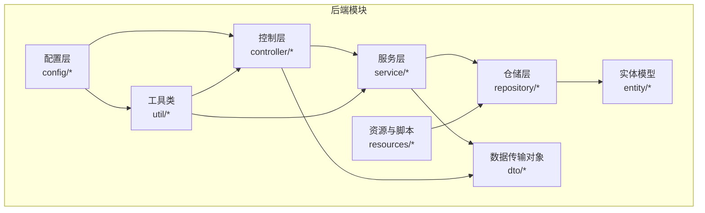
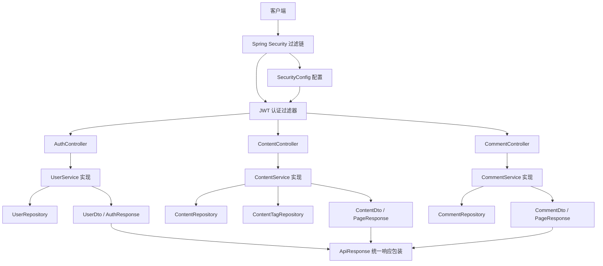
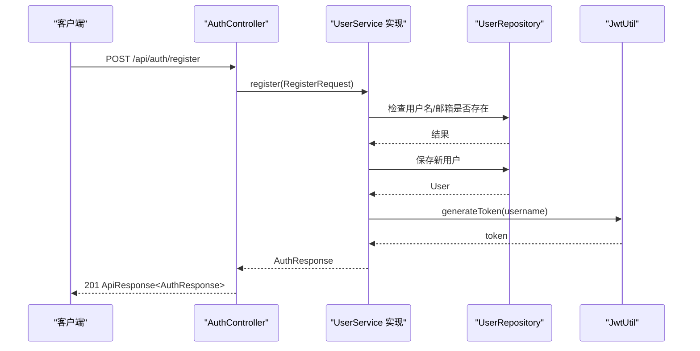
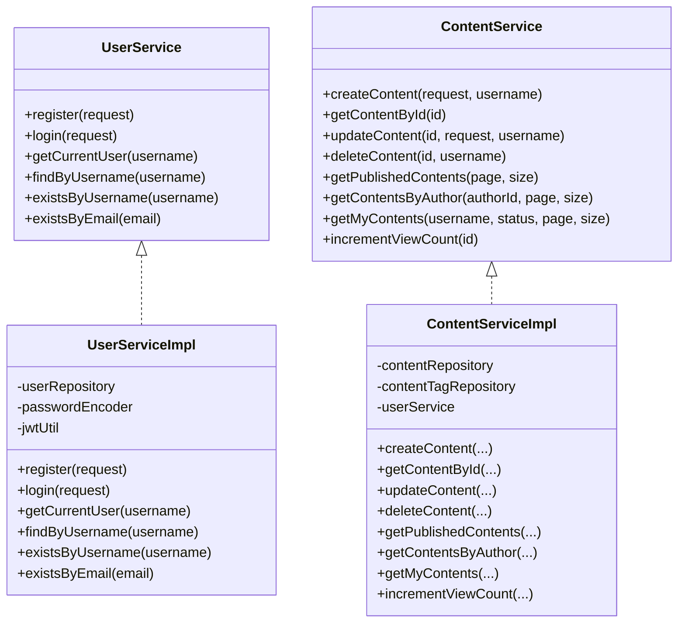
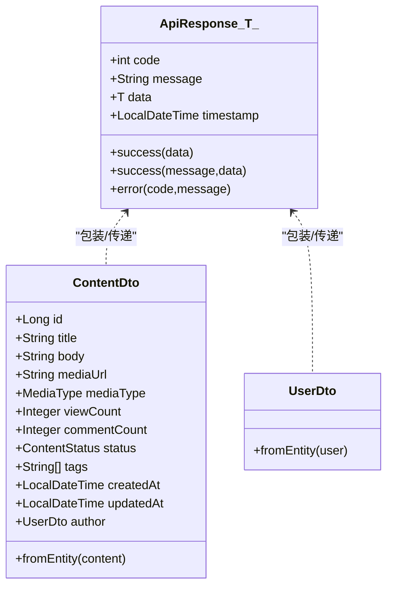
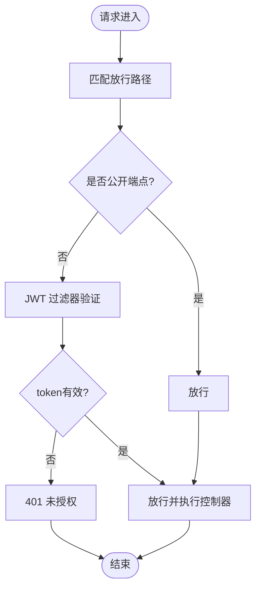
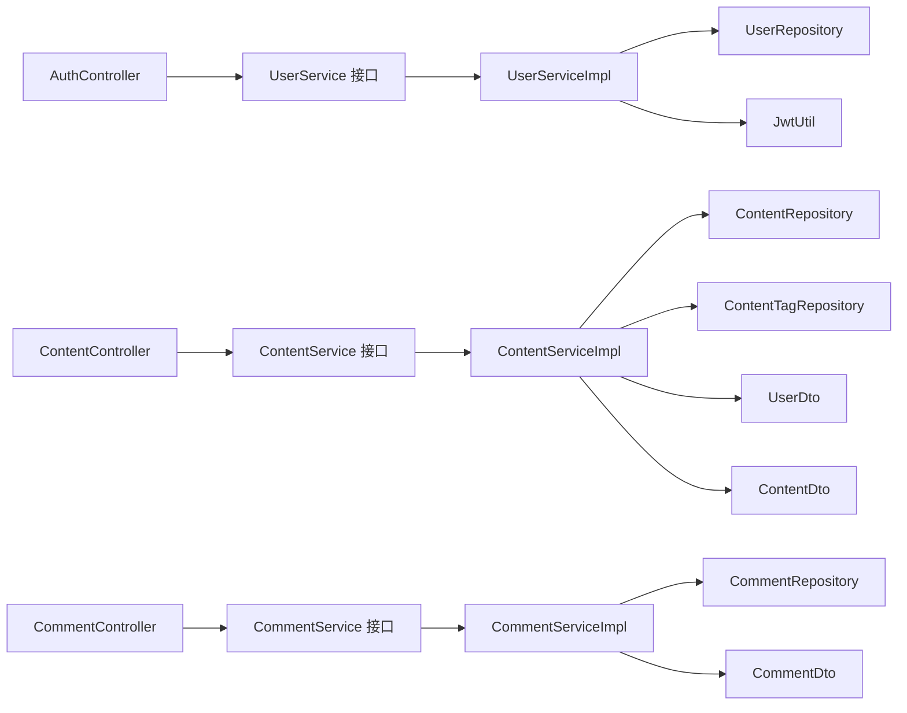

# MVC架构设计

<cite>
**本文引用的文件**
- [CommunicationApplication.java](file://communication-backend/src/main/java/com/communication/CommunicationApplication.java)
- [AuthController.java](file://communication-backend/src/main/java/com/communication/controller/AuthController.java)
- [ContentController.java](file://communication-backend/src/main/java/com/communication/controller/ContentController.java)
- [CommentController.java](file://communication-backend/src/main/java/com/communication/controller/CommentController.java)
- [UserService.java](file://communication-backend/src/main/java/com/communication/service/UserService.java)
- [UserServiceImpl.java](file://communication-backend/src/main/java/com/communication/service/impl/UserServiceImpl.java)
- [ContentService.java](file://communication-backend/src/main/java/com/communication/service/ContentService.java)
- [ContentServiceImpl.java](file://communication-backend/src/main/java/com/communication/service/impl/ContentServiceImpl.java)
- [CommentService.java](file://communication-backend/src/main/java/com/communication/service/CommentService.java)
- [CommentServiceImpl.java](file://communication-backend/src/main/java/com/communication/service/impl/CommentServiceImpl.java)
- [ApiResponse.java](file://communication-backend/src/main/java/com/communication/dto/ApiResponse.java)
- [ContentDto.java](file://communication-backend/src/main/java/com/communication/dto/ContentDto.java)
- [UserDto.java](file://communication-backend/src/main/java/com/communication/dto/UserDto.java)
- [SecurityConfig.java](file://communication-backend/src/main/java/com/communication/config/SecurityConfig.java)
- [JwtUtil.java](file://communication-backend/src/main/java/com/communication/util/JwtUtil.java)
- [UserRepository.java](file://communication-backend/src/main/java/com/communication/repository/UserRepository.java)
- [ContentRepository.java](file://communication-backend/src/main/java/com/communication/repository/ContentRepository.java)
- [application.yml](file://communication-backend/src/main/resources/application.yml)
- [pom.xml](file://communication-backend/pom.xml)
</cite>

## 目录
1. [引言](#引言)
2. [项目结构](#项目结构)
3. [核心组件](#核心组件)
4. [架构总览](#架构总览)
5. [详细组件分析](#详细组件分析)
6. [依赖关系分析](#依赖关系分析)
7. [性能考量](#性能考量)
8. [故障排查指南](#故障排查指南)
9. [结论](#结论)
10. [附录](#附录)

## 引言
本文件面向通信平台后端的MVC架构设计，系统化阐述Controller层、Service层与Repository层的职责划分与协作机制；深入解析AuthController、ContentController、CommentController等核心控制器的设计模式与RESTful API设计原则；说明DTO模式在数据传输中的应用；并给出扩展性建议、测试策略与调试技巧，帮助开发者高效理解与维护该架构。

## 项目结构
后端采用标准Spring Boot工程结构，按关注点分层组织代码：
- config：安全配置、CORS、Web配置
- controller：REST接口层（MVC的C）
- service：业务逻辑层（MVC的S），含接口与实现类
- repository：数据访问层（MVC的R），基于Spring Data JPA
- dto：数据传输对象（DTO）
- entity：JPA实体
- util：工具类（如JWT）
- exception：异常处理与全局异常映射
- resources：数据库迁移脚本、配置文件

图表来源
- [CommunicationApplication.java](file://communication-backend/src/main/java/com/communication/CommunicationApplication.java#L1-L13)
- [SecurityConfig.java](file://communication-backend/src/main/java/com/communication/config/SecurityConfig.java#L1-L89)
- [AuthController.java](file://communication-backend/src/main/java/com/communication/controller/AuthController.java#L1-L42)
- [ContentController.java](file://communication-backend/src/main/java/com/communication/controller/ContentController.java#L1-L85)
- [CommentController.java](file://communication-backend/src/main/java/com/communication/controller/CommentController.java#L1-L55)
- [UserServiceImpl.java](file://communication-backend/src/main/java/com/communication/service/impl/UserServiceImpl.java#L1-L86)
- [ContentServiceImpl.java](file://communication-backend/src/main/java/com/communication/service/impl/ContentServiceImpl.java#L1-L199)
- [CommentServiceImpl.java](file://communication-backend/src/main/java/com/communication/service/impl/CommentServiceImpl.java#L1-L200)
- [ApiResponse.java](file://communication-backend/src/main/java/com/communication/dto/ApiResponse.java#L1-L76)
- [ContentDto.java](file://communication-backend/src/main/java/com/communication/dto/ContentDto.java#L1-L118)
- [UserDto.java](file://communication-backend/src/main/java/com/communication/dto/UserDto.java#L1-L200)
- [JwtUtil.java](file://communication-backend/src/main/java/com/communication/util/JwtUtil.java#L1-L67)
- [UserRepository.java](file://communication-backend/src/main/java/com/communication/repository/UserRepository.java#L1-L27)
- [ContentRepository.java](file://communication-backend/src/main/java/com/communication/repository/ContentRepository.java#L1-L200)
- [application.yml](file://communication-backend/src/main/resources/application.yml#L1-L42)

章节来源
- [CommunicationApplication.java](file://communication-backend/src/main/java/com/communication/CommunicationApplication.java#L1-L13)
- [application.yml](file://communication-backend/src/main/resources/application.yml#L1-L42)

## 核心组件
- 控制器层（Controller）：负责接收HTTP请求、参数校验、调用服务层、封装响应。典型控制器包括AuthController、ContentController、CommentController等。
- 服务层（Service）：封装业务规则与流程编排，事务边界管理，跨仓储协调。例如UserService、ContentService、CommentService及其实现类。
- 仓储层（Repository）：基于Spring Data JPA的数据访问抽象，提供查询与持久化操作。
- 数据传输对象（DTO）：统一前后端交互的数据结构，避免直接暴露实体模型。
- 安全与认证：通过Spring Security + JWT实现无状态认证授权，配置细粒度的放行与保护路径。

章节来源
- [AuthController.java](file://communication-backend/src/main/java/com/communication/controller/AuthController.java#L1-L42)
- [ContentController.java](file://communication-backend/src/main/java/com/communication/controller/ContentController.java#L1-L85)
- [CommentController.java](file://communication-backend/src/main/java/com/communication/controller/CommentController.java#L1-L55)
- [UserService.java](file://communication-backend/src/main/java/com/communication/service/UserService.java#L1-L20)
- [UserServiceImpl.java](file://communication-backend/src/main/java/com/communication/service/impl/UserServiceImpl.java#L1-L86)
- [ContentService.java](file://communication-backend/src/main/java/com/communication/service/ContentService.java#L1-L200)
- [ContentServiceImpl.java](file://communication-backend/src/main/java/com/communication/service/impl/ContentServiceImpl.java#L1-L199)
- [CommentService.java](file://communication-backend/src/main/java/com/communication/service/CommentService.java#L1-L200)
- [CommentServiceImpl.java](file://communication-backend/src/main/java/com/communication/service/impl/CommentServiceImpl.java#L1-L200)
- [ApiResponse.java](file://communication-backend/src/main/java/com/communication/dto/ApiResponse.java#L1-L76)
- [ContentDto.java](file://communication-backend/src/main/java/com/communication/dto/ContentDto.java#L1-L118)
- [UserDto.java](file://communication-backend/src/main/java/com/communication/dto/UserDto.java#L1-L200)
- [SecurityConfig.java](file://communication-backend/src/main/java/com/communication/config/SecurityConfig.java#L1-L89)
- [JwtUtil.java](file://communication-backend/src/main/java/com/communication/util/JwtUtil.java#L1-L67)
- [UserRepository.java](file://communication-backend/src/main/java/com/communication/repository/UserRepository.java#L1-L27)
- [ContentRepository.java](file://communication-backend/src/main/java/com/communication/repository/ContentRepository.java#L1-L200)

## 架构总览
下图展示MVC分层与关键组件交互关系，以及安全过滤链对请求的拦截与放行策略。

图表来源
- [SecurityConfig.java](file://communication-backend/src/main/java/com/communication/config/SecurityConfig.java#L66-L87)
- [JwtUtil.java](file://communication-backend/src/main/java/com/communication/util/JwtUtil.java#L28-L35)
- [AuthController.java](file://communication-backend/src/main/java/com/communication/controller/AuthController.java#L22-L40)
- [ContentController.java](file://communication-backend/src/main/java/com/communication/controller/ContentController.java#L23-L83)
- [CommentController.java](file://communication-backend/src/main/java/com/communication/controller/CommentController.java#L23-L53)
- [UserServiceImpl.java](file://communication-backend/src/main/java/com/communication/service/impl/UserServiceImpl.java#L28-L68)
- [ContentServiceImpl.java](file://communication-backend/src/main/java/com/communication/service/impl/ContentServiceImpl.java#L36-L104)
- [CommentServiceImpl.java](file://communication-backend/src/main/java/com/communication/service/impl/CommentServiceImpl.java#L1-L200)
- [UserRepository.java](file://communication-backend/src/main/java/com/communication/repository/UserRepository.java#L14-L26)
- [ContentRepository.java](file://communication-backend/src/main/java/com/communication/repository/ContentRepository.java#L1-L200)
- [ApiResponse.java](file://communication-backend/src/main/java/com/communication/dto/ApiResponse.java#L32-L56)

## 详细组件分析

### 控制器层职责与RESTful设计
- AuthController
  - 职责：用户注册、登录、获取当前用户信息
  - 设计要点：使用@RequestMapping("/api/auth")统一前缀；使用@AuthenticationPrincipal注入当前用户；返回统一响应包装ApiResponse
  - 状态码：注册成功返回201，登录与查询返回200
- ContentController
  - 职责：内容创建、分页查询公开内容、按ID读取与浏览量递增、按作者筛选、按作者与状态筛选、更新与删除
  - 设计要点：REST路径"/api/contents"；分页参数page/size默认值；浏览量独立增量以避免并发竞争
  - 状态码：创建返回201，其余返回200
- CommentController
  - 职责：为指定内容创建评论、分页查询评论、按ID读取、删除评论
  - 设计要点：嵌套路径"/api/contents/{contentId}/comments"；删除时校验评论作者身份

图表来源
- [AuthController.java](file://communication-backend/src/main/java/com/communication/controller/AuthController.java#L22-L28)
- [UserServiceImpl.java](file://communication-backend/src/main/java/com/communication/service/impl/UserServiceImpl.java#L28-L48)
- [UserRepository.java](file://communication-backend/src/main/java/com/communication/repository/UserRepository.java#L16-L22)
- [JwtUtil.java](file://communication-backend/src/main/java/com/communication/util/JwtUtil.java#L28-L35)

章节来源
- [AuthController.java](file://communication-backend/src/main/java/com/communication/controller/AuthController.java#L1-L42)
- [ContentController.java](file://communication-backend/src/main/java/com/communication/controller/ContentController.java#L1-L85)
- [CommentController.java](file://communication-backend/src/main/java/com/communication/controller/CommentController.java#L1-L55)

### 服务层与业务编排
- UserService/Impl
  - 校验重复、密码加密、JWT签发、按用户名查找与存在性检查
- ContentService/Impl
  - 内容创建/更新/删除的权限校验（仅作者可改删）
  - 分页查询公开内容、按作者筛选、按作者与状态筛选
  - 标签保存与去重、标签同步更新
  - 浏览量递增（独立SQL语句）
- CommentService/Impl
  - 评论创建、按内容分页查询、按ID读取、删除时校验作者身份

图表来源
- [UserService.java](file://communication-backend/src/main/java/com/communication/service/UserService.java#L6-L19)
- [UserServiceImpl.java](file://communication-backend/src/main/java/com/communication/service/impl/UserServiceImpl.java#L15-L86)
- [ContentService.java](file://communication-backend/src/main/java/com/communication/service/ContentService.java#L1-L200)
- [ContentServiceImpl.java](file://communication-backend/src/main/java/com/communication/service/impl/ContentServiceImpl.java#L23-L199)

章节来源
- [UserServiceImpl.java](file://communication-backend/src/main/java/com/communication/service/impl/UserServiceImpl.java#L1-L86)
- [ContentServiceImpl.java](file://communication-backend/src/main/java/com/communication/service/impl/ContentServiceImpl.java#L1-L199)
- [CommentServiceImpl.java](file://communication-backend/src/main/java/com/communication/service/impl/CommentServiceImpl.java#L1-L200)

### DTO模式与数据传输
- ApiResponse<T>：统一响应结构，包含状态码、消息、时间戳与数据体；提供success/error静态工厂方法
- ContentDto：内容领域对象到传输对象的映射，包含作者信息、标签列表、统计字段
- UserDto：用户领域对象到传输对象的映射
- 其他请求/响应DTO：RegisterRequest/LoginRequest/CreateContentRequest/UpdateContentRequest/CreateCommentRequest等

图表来源
- [ApiResponse.java](file://communication-backend/src/main/java/com/communication/dto/ApiResponse.java#L8-L56)
- [ContentDto.java](file://communication-backend/src/main/java/com/communication/dto/ContentDto.java#L10-L82)
- [UserDto.java](file://communication-backend/src/main/java/com/communication/dto/UserDto.java#L1-L200)

章节来源
- [ApiResponse.java](file://communication-backend/src/main/java/com/communication/dto/ApiResponse.java#L1-L76)
- [ContentDto.java](file://communication-backend/src/main/java/com/communication/dto/ContentDto.java#L1-L118)
- [UserDto.java](file://communication-backend/src/main/java/com/communication/dto/UserDto.java#L1-L200)

### 安全与认证
- Spring Security配置：禁用CSRF，开启CORS，会话策略STATELESS；对公开端点放行，其余均需认证
- JWT：生成与解析、用户名提取、过期判断；在SecurityConfig中注入过滤器，拦截请求进行鉴权

图表来源
- [SecurityConfig.java](file://communication-backend/src/main/java/com/communication/config/SecurityConfig.java#L66-L87)
- [JwtUtil.java](file://communication-backend/src/main/java/com/communication/util/JwtUtil.java#L37-L65)

章节来源
- [SecurityConfig.java](file://communication-backend/src/main/java/com/communication/config/SecurityConfig.java#L1-L89)
- [JwtUtil.java](file://communication-backend/src/main/java/com/communication/util/JwtUtil.java#L1-L67)

## 依赖关系分析
- 控制器依赖服务接口，通过构造函数注入，体现依赖倒置原则
- 服务实现依赖仓储接口与工具类，事务边界明确
- DTO作为跨层契约，避免实体泄露
- 安全配置与JWT工具解耦于业务逻辑，便于替换与扩展

图表来源
- [AuthController.java](file://communication-backend/src/main/java/com/communication/controller/AuthController.java#L16-L20)
- [ContentController.java](file://communication-backend/src/main/java/com/communication/controller/ContentController.java#L17-L21)
- [CommentController.java](file://communication-backend/src/main/java/com/communication/controller/CommentController.java#L17-L21)
- [UserService.java](file://communication-backend/src/main/java/com/communication/service/UserService.java#L6-L19)
- [UserServiceImpl.java](file://communication-backend/src/main/java/com/communication/service/impl/UserServiceImpl.java#L18-L26)
- [ContentService.java](file://communication-backend/src/main/java/com/communication/service/ContentService.java#L1-L200)
- [ContentServiceImpl.java](file://communication-backend/src/main/java/com/communication/service/impl/ContentServiceImpl.java#L26-L34)
- [CommentService.java](file://communication-backend/src/main/java/com/communication/service/CommentService.java#L1-L200)
- [CommentServiceImpl.java](file://communication-backend/src/main/java/com/communication/service/impl/CommentServiceImpl.java#L1-L200)

章节来源
- [pom.xml](file://communication-backend/pom.xml#L25-L94)

## 性能考量
- 分页查询：ContentController与相关服务均采用Pageable分页，避免一次性加载大量数据
- 浏览量递增：独立SQL递增，减少实体读写竞争
- 标签去重：创建内容时对标签做去重与小写规范化，降低存储冗余
- 安全策略：无状态会话（STATELESS）降低服务器状态维护成本
- 文件上传：配置了较大的文件与请求大小限制，满足多媒体内容上传需求

章节来源
- [ContentController.java](file://communication-backend/src/main/java/com/communication/controller/ContentController.java#L33-L83)
- [ContentServiceImpl.java](file://communication-backend/src/main/java/com/communication/service/impl/ContentServiceImpl.java#L120-L160)
- [application.yml](file://communication-backend/src/main/resources/application.yml#L25-L28)

## 故障排查指南
- 认证失败
  - 现象：登录或受保护接口返回401
  - 排查：确认JWT密钥与过期配置、token是否过期、用户名是否存在
- 资源不存在
  - 现象：查询内容/评论返回404
  - 排查：确认ID是否存在、作者身份校验是否通过
- 参数校验失败
  - 现象：请求被拒绝并返回错误信息
  - 排查：检查请求体字段、长度与格式是否符合DTO定义
- 权限不足
  - 现象：更新/删除内容或评论被拒绝
  - 排查：确认当前用户是否为内容或评论作者
- 统一响应结构
  - 使用ApiResponse统一包装，便于前端一致处理错误与成功场景

章节来源
- [SecurityConfig.java](file://communication-backend/src/main/java/com/communication/config/SecurityConfig.java#L66-L87)
- [JwtUtil.java](file://communication-backend/src/main/java/com/communication/util/JwtUtil.java#L58-L65)
- [UserServiceImpl.java](file://communication-backend/src/main/java/com/communication/service/impl/UserServiceImpl.java#L50-L62)
- [ContentServiceImpl.java](file://communication-backend/src/main/java/com/communication/service/impl/ContentServiceImpl.java#L106-L117)
- [CommentServiceImpl.java](file://communication-backend/src/main/java/com/communication/service/impl/CommentServiceImpl.java#L1-L200)
- [ApiResponse.java](file://communication-backend/src/main/java/com/communication/dto/ApiResponse.java#L32-L56)

## 结论
该通信平台后端遵循清晰的MVC分层架构：Controller专注接口与响应封装，Service聚焦业务编排与事务边界，Repository负责数据存取。结合DTO统一响应、JWT无状态认证与Spring Security细粒度放行策略，整体具备良好的可维护性与扩展性。建议在后续迭代中持续完善测试覆盖、引入缓存与异步任务优化热点读写，并保持DTO与实体分离以增强演进能力。

## 附录
- 扩展性建议
  - 引入缓存：热点内容与标签可加入Redis缓存
  - 异步任务：评论通知、索引重建等可异步化
  - 监控与日志：集成指标与链路追踪
- 最佳实践
  - DTO与实体分离，避免直接暴露实体字段
  - 统一异常处理与响应包装
  - 明确事务边界，避免长事务阻塞
  - 对外接口版本化，保证向后兼容