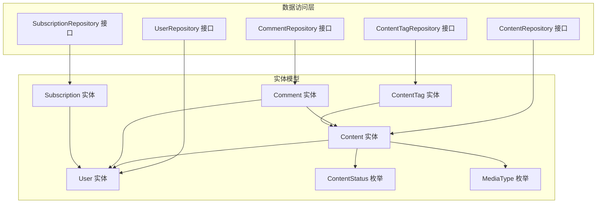
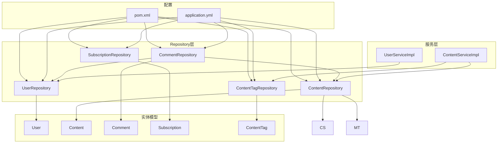
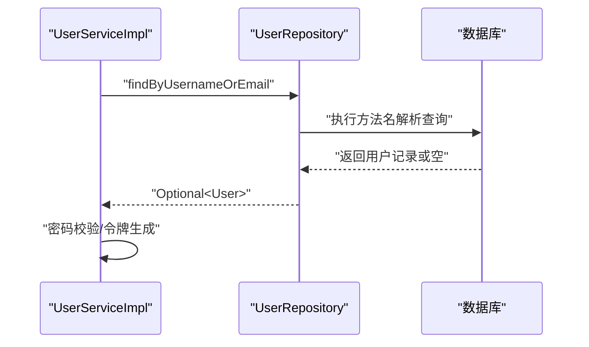
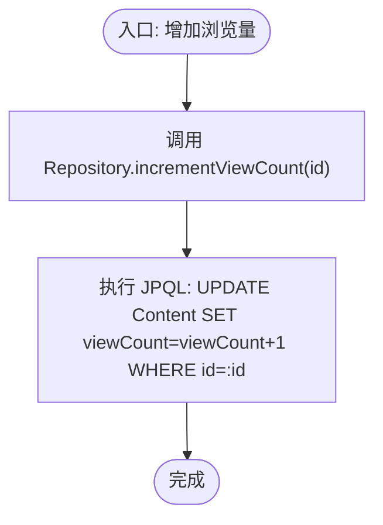
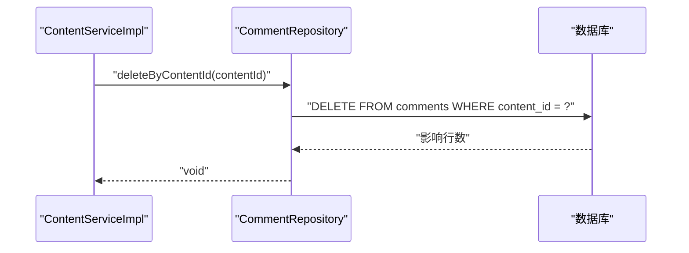
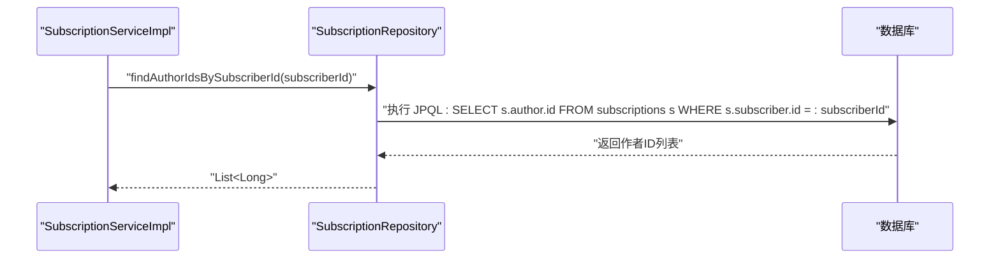
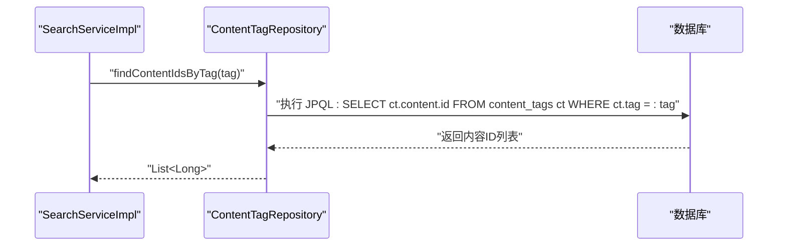
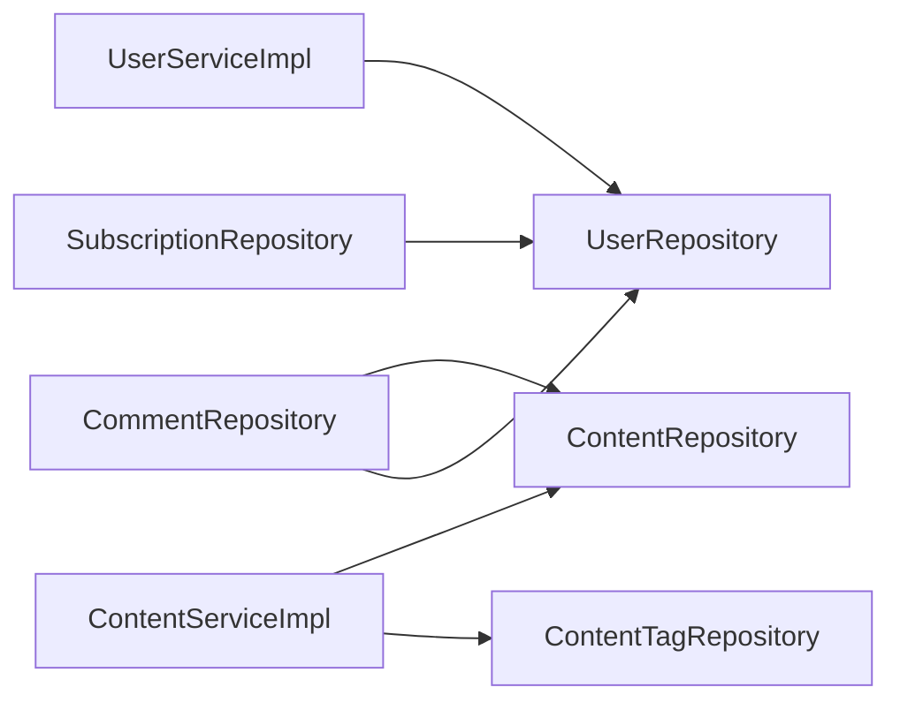
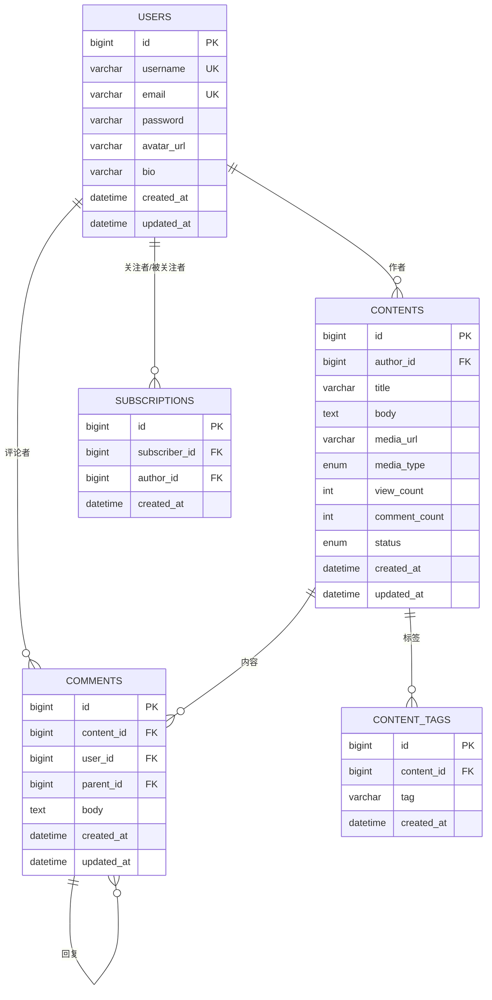

# Repository层设计

<cite>
**本文引用的文件**
- [UserRepository.java](file://communication-backend/src/main/java/com/communication/repository/UserRepository.java)
- [ContentRepository.java](file://communication-backend/src/main/java/com/communication/repository/ContentRepository.java)
- [CommentRepository.java](file://communication-backend/src/main/java/com/communication/repository/CommentRepository.java)
- [SubscriptionRepository.java](file://communication-backend/src/main/java/com/communication/repository/SubscriptionRepository.java)
- [ContentTagRepository.java](file://communication-backend/src/main/java/com/communication/repository/ContentTagRepository.java)
- [User.java](file://communication-backend/src/main/java/com/communication/entity/User.java)
- [Content.java](file://communication-backend/src/main/java/com/communication/entity/Content.java)
- [Comment.java](file://communication-backend/src/main/java/com/communication/entity/Comment.java)
- [Subscription.java](file://communication-backend/src/main/java/com/communication/entity/Subscription.java)
- [ContentTag.java](file://communication-backend/src/main/java/com/communication/entity/ContentTag.java)
- [ContentStatus.java](file://communication-backend/src/main/java/com/communication/entity/ContentStatus.java)
- [MediaType.java](file://communication-backend/src/main/java/com/communication/entity/MediaType.java)
- [UserServiceImpl.java](file://communication-backend/src/main/java/com/communication/service/impl/UserServiceImpl.java)
- [ContentServiceImpl.java](file://communication-backend/src/main/java/com/communication/service/impl/ContentServiceImpl.java)
- [application.yml](file://communication-backend/src/main/resources/application.yml)
- [pom.xml](file://communication-backend/pom.xml)
- [UserServiceTest.java](file://communication-backend/src/test/java/com/communication/service/UserServiceTest.java)
</cite>

## 目录
1. [引言](#引言)
2. [项目结构](#项目结构)
3. [核心组件](#核心组件)
4. [架构总览](#架构总览)
5. [详细组件分析](#详细组件分析)
6. [依赖分析](#依赖分析)
7. [性能考虑](#性能考虑)
8. [故障排查指南](#故障排查指南)
9. [结论](#结论)
10. [附录](#附录)

## 引言
本文件面向通信平台的数据访问层（Repository层），系统性阐述基于Spring Data JPA的Repository设计与实现原理，覆盖以下主题：
- Repository接口定义与命名规范
- JPA实体映射与关系建模
- 查询方法自动生成机制（方法名解析、JPQL与原生SQL）
- 各数据访问职责划分：用户、内容、评论、订阅、标签
- CRUD与复杂查询、分页、批量操作与性能优化
- 单元测试与Mock策略

## 项目结构
Repository层位于后端模块communication-backend中，采用按领域分层的组织方式：
- repository包：定义各领域的Repository接口
- entity包：定义JPA实体及枚举
- service.impl包：服务层实现，展示Repository的典型用法
- resources/application.yml：JPA/Hibernate/Flyway配置
- pom.xml：依赖声明（Spring Data JPA、MySQL、Flyway等）

图表来源
- [UserRepository.java](file://communication-backend/src/main/java/com/communication/repository/UserRepository.java#L1-L27)
- [ContentRepository.java](file://communication-backend/src/main/java/com/communication/repository/ContentRepository.java#L1-L56)
- [CommentRepository.java](file://communication-backend/src/main/java/com/communication/repository/CommentRepository.java#L1-L33)
- [SubscriptionRepository.java](file://communication-backend/src/main/java/com/communication/repository/SubscriptionRepository.java#L1-L34)
- [ContentTagRepository.java](file://communication-backend/src/main/java/com/communication/repository/ContentTagRepository.java#L1-L29)
- [User.java](file://communication-backend/src/main/java/com/communication/entity/User.java#L1-L96)
- [Content.java](file://communication-backend/src/main/java/com/communication/entity/Content.java#L1-L135)
- [Comment.java](file://communication-backend/src/main/java/com/communication/entity/Comment.java#L1-L109)
- [Subscription.java](file://communication-backend/src/main/java/com/communication/entity/Subscription.java#L1-L67)
- [ContentTag.java](file://communication-backend/src/main/java/com/communication/entity/ContentTag.java#L1-L66)
- [ContentStatus.java](file://communication-backend/src/main/java/com/communication/entity/ContentStatus.java#L1-L7)
- [MediaType.java](file://communication-backend/src/main/java/com/communication/entity/MediaType.java#L1-L8)

章节来源
- [application.yml](file://communication-backend/src/main/resources/application.yml#L1-L42)
- [pom.xml](file://communication-backend/pom.xml#L1-L114)

## 核心组件
本节概述各Repository接口的职责与关键方法，体现Spring Data JPA的自动查询生成能力。

- UserRepository
  - 职责：用户注册/登录、唯一性校验、用户名模糊搜索
  - 关键方法：按字段查找、存在性检查、分页关键词搜索
  - 查询机制：方法名解析（findByXxx、existsByXxx）+ JPQL参数化查询

- ContentRepository
  - 职责：内容发布、作者筛选、状态过滤、浏览量递增、统计聚合、关键词搜索、批量ID筛选
  - 关键方法：按状态/作者/时间排序分页；JPQL更新语句；聚合统计；IN子句分页
  - 查询机制：方法名解析 + 复杂JPQL + 原生SQL风格的JPQL

- CommentRepository
  - 职责：评论树形结构（父子关系）、按内容/用户分页、计数、批量删除
  - 关键方法：顶层评论分页、回复排序、按父ID查询、按内容/用户计数、按用户分页、存在性校验
  - 查询机制：方法名解析 + JPQL聚合与条件组合

- SubscriptionRepository
  - 职责：关注关系建立/取消、关注者/被关注者列表、计数、作者ID集合查询
  - 关键方法：存在性检查、按关注者/被关注者分页、计数、作者ID集合、删除
  - 查询机制：方法名解析 + JPQL投影

- ContentTagRepository
  - 职责：标签与内容关联、标签检索、热门标签、存在性检查
  - 关键方法：按内容ID查询、按标签关键字检索、按标签反查内容ID、标签热度排行、存在性检查
  - 查询机制：方法名解析 + JPQL分组与投影

章节来源
- [UserRepository.java](file://communication-backend/src/main/java/com/communication/repository/UserRepository.java#L1-L27)
- [ContentRepository.java](file://communication-backend/src/main/java/com/communication/repository/ContentRepository.java#L1-L56)
- [CommentRepository.java](file://communication-backend/src/main/java/com/communication/repository/CommentRepository.java#L1-L33)
- [SubscriptionRepository.java](file://communication-backend/src/main/java/com/communication/repository/SubscriptionRepository.java#L1-L34)
- [ContentTagRepository.java](file://communication-backend/src/main/java/com/communication/repository/ContentTagRepository.java#L1-L29)

## 架构总览
下图展示了Repository层与实体模型、服务层以及配置的关系：

图表来源
- [UserServiceImpl.java](file://communication-backend/src/main/java/com/communication/service/impl/UserServiceImpl.java#L1-L86)
- [ContentServiceImpl.java](file://communication-backend/src/main/java/com/communication/service/impl/ContentServiceImpl.java#L1-L199)
- [UserRepository.java](file://communication-backend/src/main/java/com/communication/repository/UserRepository.java#L1-L27)
- [ContentRepository.java](file://communication-backend/src/main/java/com/communication/repository/ContentRepository.java#L1-L56)
- [CommentRepository.java](file://communication-backend/src/main/java/com/communication/repository/CommentRepository.java#L1-L33)
- [SubscriptionRepository.java](file://communication-backend/src/main/java/com/communication/repository/SubscriptionRepository.java#L1-L34)
- [ContentTagRepository.java](file://communication-backend/src/main/java/com/communication/repository/ContentTagRepository.java#L1-L29)
- [User.java](file://communication-backend/src/main/java/com/communication/entity/User.java#L1-L96)
- [Content.java](file://communication-backend/src/main/java/com/communication/entity/Content.java#L1-L135)
- [Comment.java](file://communication-backend/src/main/java/com/communication/entity/Comment.java#L1-L109)
- [Subscription.java](file://communication-backend/src/main/java/com/communication/entity/Subscription.java#L1-L67)
- [ContentTag.java](file://communication-backend/src/main/java/com/communication/entity/ContentTag.java#L1-L66)
- [ContentStatus.java](file://communication-backend/src/main/java/com/communication/entity/ContentStatus.java#L1-L7)
- [MediaType.java](file://communication-backend/src/main/java/com/communication/entity/MediaType.java#L1-L8)
- [application.yml](file://communication-backend/src/main/resources/application.yml#L1-L42)
- [pom.xml](file://communication-backend/pom.xml#L1-L114)

## 详细组件分析

### UserRepository 分析
- 设计要点
  - 继承JpaRepository，天然具备CRUD与分页能力
  - 方法名解析：findByXxx、existsByXxx，支持Optional返回
  - JPQL参数化查询：关键词模糊匹配，大小写不敏感
- 典型查询流程（登录/注册）

图表来源
- [UserServiceImpl.java](file://communication-backend/src/main/java/com/communication/service/impl/UserServiceImpl.java#L50-L62)
- [UserRepository.java](file://communication-backend/src/main/java/com/communication/repository/UserRepository.java#L16-L25)

章节来源
- [UserRepository.java](file://communication-backend/src/main/java/com/communication/repository/UserRepository.java#L1-L27)
- [UserServiceImpl.java](file://communication-backend/src/main/java/com/communication/service/impl/UserServiceImpl.java#L1-L86)

### ContentRepository 分析
- 设计要点
  - 多种分页查询：按状态、作者、作者+状态、作者ID集合
  - JPQL更新：浏览量自增
  - 聚合统计：作者总浏览量、评论数
  - 关键词搜索：标题/正文模糊匹配，按创建时间倒序
- 典型流程（内容浏览计数）

图表来源
- [ContentRepository.java](file://communication-backend/src/main/java/com/communication/repository/ContentRepository.java#L28-L30)

章节来源
- [ContentRepository.java](file://communication-backend/src/main/java/com/communication/repository/ContentRepository.java#L1-L56)
- [ContentServiceImpl.java](file://communication-backend/src/main/java/com/communication/service/impl/ContentServiceImpl.java#L156-L160)

### CommentRepository 分析
- 设计要点
  - 评论树：父子关系，顶层评论分页、回复按创建时间升序
  - 计数：按内容/用户计数，存在性校验
  - 批量删除：按内容ID删除
- 典型流程（删除内容时级联清理评论）

图表来源
- [CommentRepository.java](file://communication-backend/src/main/java/com/communication/repository/CommentRepository.java#L24-L24)
- [ContentServiceImpl.java](file://communication-backend/src/main/java/com/communication/service/impl/ContentServiceImpl.java#L108-L117)

章节来源
- [CommentRepository.java](file://communication-backend/src/main/java/com/communication/repository/CommentRepository.java#L1-L33)
- [ContentServiceImpl.java](file://communication-backend/src/main/java/com/communication/service/impl/ContentServiceImpl.java#L106-L117)

### SubscriptionRepository 分析
- 设计要点
  - 关注/取消关注：存在性检查、删除
  - 关注者/被关注者列表：按创建时间倒序分页
  - 统计：关注数/粉丝数
  - 投影：仅返回作者ID集合
- 典型流程（获取关注者ID列表）

图表来源
- [SubscriptionRepository.java](file://communication-backend/src/main/java/com/communication/repository/SubscriptionRepository.java#L29-L30)

章节来源
- [SubscriptionRepository.java](file://communication-backend/src/main/java/com/communication/repository/SubscriptionRepository.java#L1-L34)

### ContentTagRepository 分析
- 设计要点
  - 标签与内容多对多中间表：ContentTag
  - 标签检索：关键字匹配、热门标签（分组聚合）
  - 存在性检查：内容+标签组合
- 典型流程（按标签检索内容）

图表来源
- [ContentTagRepository.java](file://communication-backend/src/main/java/com/communication/repository/ContentTagRepository.java#L21-L22)

章节来源
- [ContentTagRepository.java](file://communication-backend/src/main/java/com/communication/repository/ContentTagRepository.java#L1-L29)

## 依赖分析
- 组件耦合
  - 服务层通过构造函数注入多个Repository，体现高内聚低耦合
  - 内容与标签、评论、订阅均通过外键关联User/Content，形成清晰的领域边界
- 外部依赖
  - JPA/Hibernate：实体映射与查询执行
  - MySQL + Flyway：数据库迁移与版本控制
  - Spring Data JPA：方法名解析与动态查询生成

图表来源
- [UserServiceImpl.java](file://communication-backend/src/main/java/com/communication/service/impl/UserServiceImpl.java#L1-L86)
- [ContentServiceImpl.java](file://communication-backend/src/main/java/com/communication/service/impl/ContentServiceImpl.java#L1-L199)
- [CommentRepository.java](file://communication-backend/src/main/java/com/communication/repository/CommentRepository.java#L1-L33)
- [SubscriptionRepository.java](file://communication-backend/src/main/java/com/communication/repository/SubscriptionRepository.java#L1-L34)
- [ContentTagRepository.java](file://communication-backend/src/main/java/com/communication/repository/ContentTagRepository.java#L1-L29)

章节来源
- [pom.xml](file://communication-backend/pom.xml#L25-L94)
- [application.yml](file://communication-backend/src/main/resources/application.yml#L1-L42)

## 性能考虑
- 查询优化
  - 使用方法名解析的精确字段匹配，避免全表扫描
  - 对高频查询（如按作者、状态、创建时间）建立合适索引（建议在数据库层配合）
- 分页查询
  - 使用Pageable进行分页，避免一次性加载大量数据
  - 在服务层统一构建PageRequest，确保分页参数一致性
- 批量操作
  - 使用saveAll进行批量保存标签，减少往返次数
  - 使用deleteByContentId进行批量删除评论
- JPQL与原生SQL
  - 优先使用JPQL，保持可移植性；必要时使用原生SQL（通过@Query声明）
- 缓存与统计
  - 浏览量/评论数等统计字段可结合业务缓存，降低频繁聚合查询压力
- 配置建议
  - 开启SQL日志（开发环境）以便分析慢查询
  - 合理设置连接池与超时参数

## 故障排查指南
- 常见问题
  - 查询结果为空：确认方法名解析是否正确（字段名大小写、枚举值）
  - 分页异常：检查PageRequest参数（页码从0开始）
  - JPQL语法错误：核对参数占位符与实体属性名
- 单元测试与Mock策略
  - 使用Mockito对Repository进行Mock，隔离数据库依赖
  - 在测试中验证Repository方法的调用次数与参数
  - 示例：UserServiceTest中对UserRepository的Mock与断言
- 测试示例路径
  - [UserServiceTest.java](file://communication-backend/src/test/java/com/communication/service/UserServiceTest.java#L1-L159)

章节来源
- [UserServiceTest.java](file://communication-backend/src/test/java/com/communication/service/UserServiceTest.java#L1-L159)

## 结论
本Repository层设计遵循Spring Data JPA最佳实践，通过方法名解析与JPQL实现高效的数据访问。各Repository职责明确，与实体模型紧密耦合，配合服务层实现复杂的业务逻辑。通过合理的分页、批量操作与查询优化策略，可在保证可维护性的同时满足性能要求。建议在生产环境中配合数据库索引、连接池与监控工具，持续优化查询性能。

## 附录
- 实体关系图（ER）

图表来源
- [User.java](file://communication-backend/src/main/java/com/communication/entity/User.java#L1-L96)
- [Content.java](file://communication-backend/src/main/java/com/communication/entity/Content.java#L1-L135)
- [Comment.java](file://communication-backend/src/main/java/com/communication/entity/Comment.java#L1-L109)
- [Subscription.java](file://communication-backend/src/main/java/com/communication/entity/Subscription.java#L1-L67)
- [ContentTag.java](file://communication-backend/src/main/java/com/communication/entity/ContentTag.java#L1-L66)