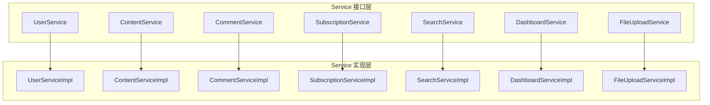
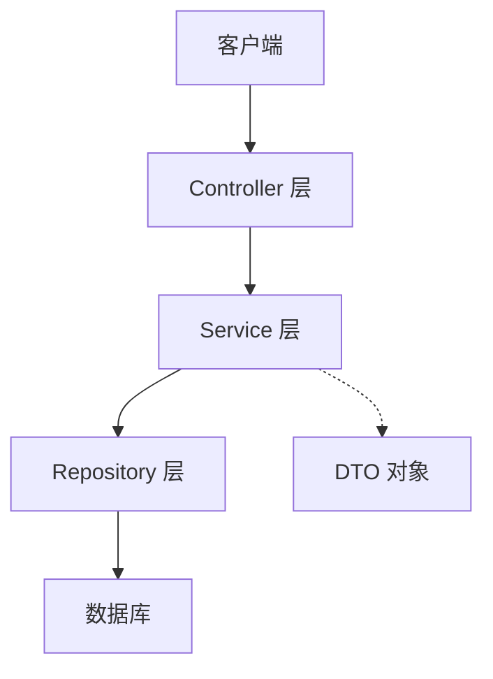
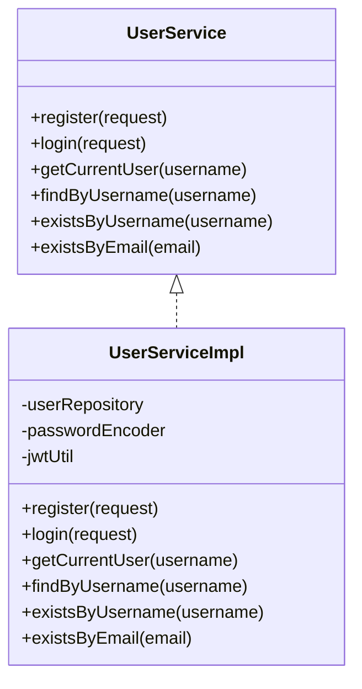
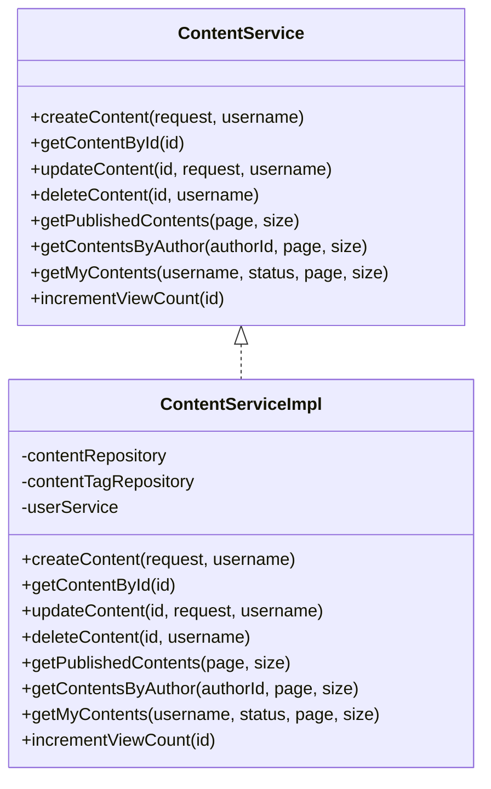
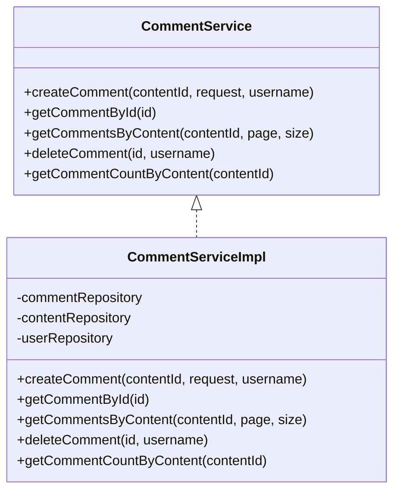
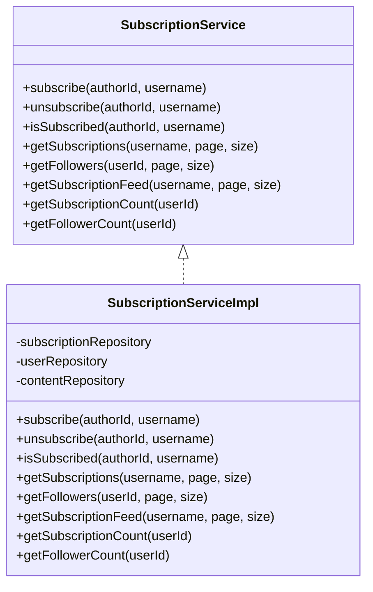
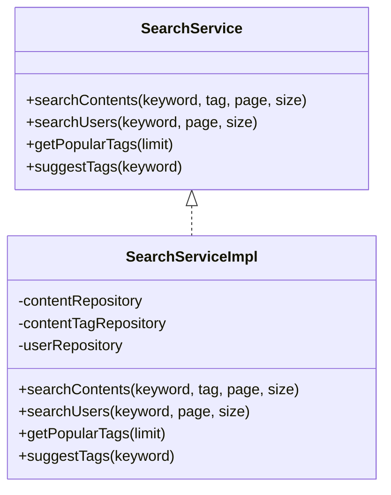
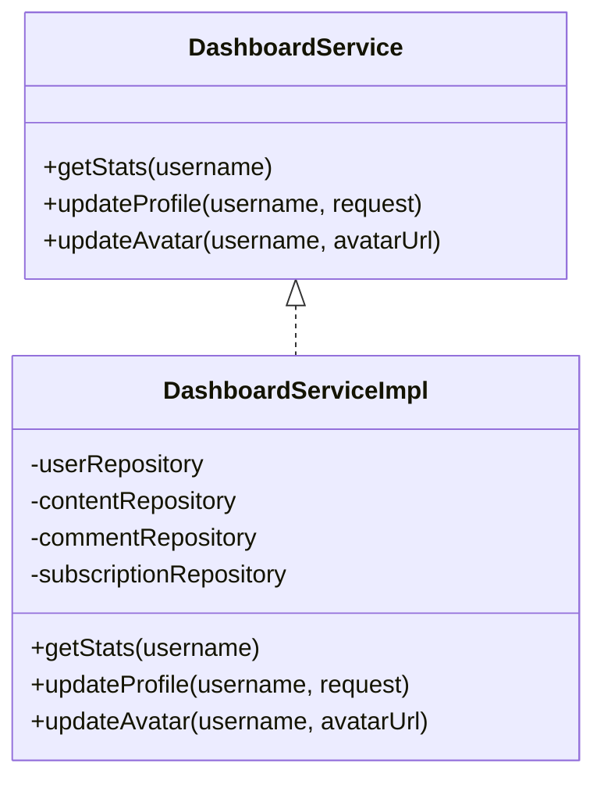
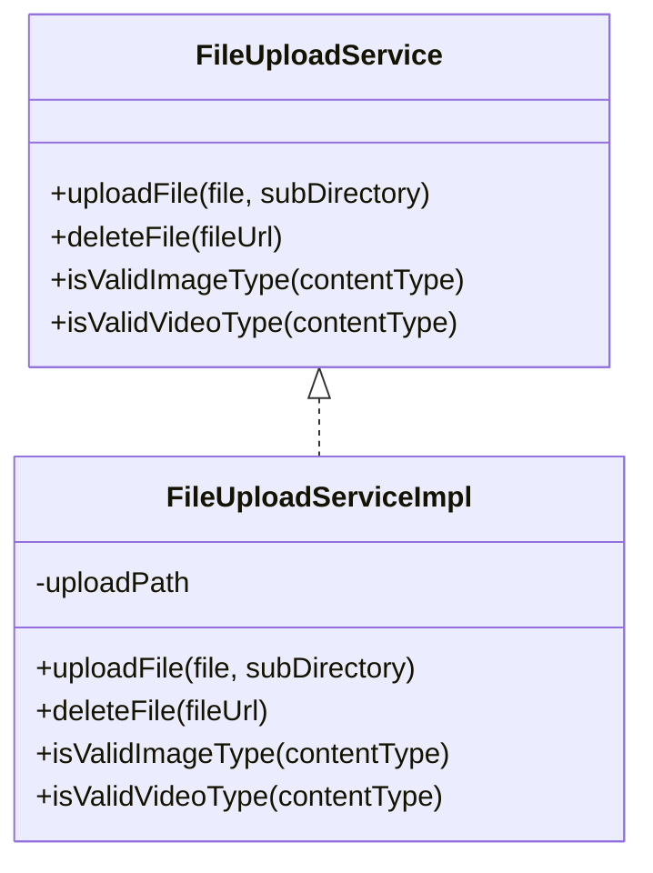
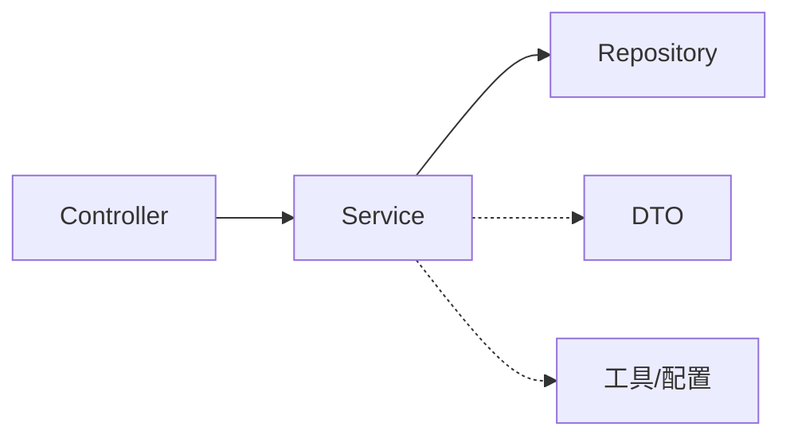

# Service层设计

<cite>
**本文引用的文件**
- [UserService.java](file://communication-backend/src/main/java/com/communication/service/UserService.java)
- [UserServiceImpl.java](file://communication-backend/src/main/java/com/communication/service/impl/UserServiceImpl.java)
- [ContentService.java](file://communication-backend/src/main/java/com/communication/service/ContentService.java)
- [ContentServiceImpl.java](file://communication-backend/src/main/java/com/communication/service/impl/ContentServiceImpl.java)
- [CommentService.java](file://communication-backend/src/main/java/com/communication/service/CommentService.java)
- [CommentServiceImpl.java](file://communication-backend/src/main/java/com/communication/service/impl/CommentServiceImpl.java)
- [SubscriptionService.java](file://communication-backend/src/main/java/com/communication/service/SubscriptionService.java)
- [SubscriptionServiceImpl.java](file://communication-backend/src/main/java/com/communication/service/impl/SubscriptionServiceImpl.java)
- [SearchService.java](file://communication-backend/src/main/java/com/communication/service/SearchService.java)
- [SearchServiceImpl.java](file://communication-backend/src/main/java/com/communication/service/impl/SearchServiceImpl.java)
- [DashboardService.java](file://communication-backend/src/main/java/com/communication/service/DashboardService.java)
- [DashboardServiceImpl.java](file://communication-backend/src/main/java/com/communication/service/impl/DashboardServiceImpl.java)
- [FileUploadService.java](file://communication-backend/src/main/java/com/communication/service/FileUploadService.java)
- [FileUploadServiceImpl.java](file://communication-backend/src/main/java/com/communication/service/impl/FileUploadServiceImpl.java)
- [application.yml](file://communication-backend/src/main/resources/application.yml)
</cite>

## 目录
1. [引言](#引言)
2. [项目结构](#项目结构)
3. [核心组件](#核心组件)
4. [架构总览](#架构总览)
5. [详细组件分析](#详细组件分析)
6. [依赖分析](#依赖分析)
7. [性能考虑](#性能考虑)
8. [故障排查指南](#故障排查指南)
9. [结论](#结论)

## 引言
本文件系统化阐述通信平台后端的Service层设计与实现，聚焦以下目标：
- 明确Service接口与实现类的职责边界与协作方式
- 解释事务管理策略与异常传播机制
- 分析各业务服务（用户、内容、评论、关注、搜索、仪表盘、文件上传）的业务规则与数据流
- 总结Service层与Repository层的交互、依赖注入与AOP实践
- 提供性能优化建议与常见问题排查路径

## 项目结构
Service层位于包 com.communication.service 及其 impl 子包中，采用“接口 + 实现类”的分层设计；每个实现类通过构造器注入所需Repository或其它Service，统一由Spring容器管理。

图表来源
- [UserService.java](file://communication-backend/src/main/java/com/communication/service/UserService.java#L1-L20)
- [UserServiceImpl.java](file://communication-backend/src/main/java/com/communication/service/impl/UserServiceImpl.java#L1-L86)
- [ContentService.java](file://communication-backend/src/main/java/com/communication/service/ContentService.java#L1-L24)
- [ContentServiceImpl.java](file://communication-backend/src/main/java/com/communication/service/impl/ContentServiceImpl.java#L1-L199)
- [CommentService.java](file://communication-backend/src/main/java/com/communication/service/CommentService.java#L1-L19)
- [CommentServiceImpl.java](file://communication-backend/src/main/java/com/communication/service/impl/CommentServiceImpl.java#L1-L141)
- [SubscriptionService.java](file://communication-backend/src/main/java/com/communication/service/SubscriptionService.java#L1-L26)
- [SubscriptionServiceImpl.java](file://communication-backend/src/main/java/com/communication/service/impl/SubscriptionServiceImpl.java#L1-L179)
- [SearchService.java](file://communication-backend/src/main/java/com/communication/service/SearchService.java#L1-L19)
- [SearchServiceImpl.java](file://communication-backend/src/main/java/com/communication/service/impl/SearchServiceImpl.java#L1-L129)
- [DashboardService.java](file://communication-backend/src/main/java/com/communication/service/DashboardService.java#L1-L15)
- [DashboardServiceImpl.java](file://communication-backend/src/main/java/com/communication/service/impl/DashboardServiceImpl.java#L1-L87)
- [FileUploadService.java](file://communication-backend/src/main/java/com/communication/service/FileUploadService.java#L1-L15)
- [FileUploadServiceImpl.java](file://communication-backend/src/main/java/com/communication/service/impl/FileUploadServiceImpl.java#L1-L88)

章节来源
- [application.yml](file://communication-backend/src/main/resources/application.yml#L1-L42)

## 核心组件
- 接口定义：以方法签名明确业务能力与参数约束，如用户注册/登录、内容增删改查、评论创建/删除、关注/取关、搜索、统计、文件上传等。
- 实现类：集中业务规则校验、跨实体关联、事务边界控制与DTO转换。
- 依赖注入：通过构造器注入Repository与其它Service，保证不可变性与可测试性。
- 事务策略：围绕业务操作使用@Transactional标注，区分只读与读写场景，确保一致性与隔离性。
- 异常处理：对资源不存在与业务违规抛出特定异常，便于上层统一处理与响应。

章节来源
- [UserService.java](file://communication-backend/src/main/java/com/communication/service/UserService.java#L1-L20)
- [UserServiceImpl.java](file://communication-backend/src/main/java/com/communication/service/impl/UserServiceImpl.java#L1-L86)
- [ContentService.java](file://communication-backend/src/main/java/com/communication/service/ContentService.java#L1-L24)
- [ContentServiceImpl.java](file://communication-backend/src/main/java/com/communication/service/impl/ContentServiceImpl.java#L1-L199)
- [CommentService.java](file://communication-backend/src/main/java/com/communication/service/CommentService.java#L1-L19)
- [CommentServiceImpl.java](file://communication-backend/src/main/java/com/communication/service/impl/CommentServiceImpl.java#L1-L141)
- [SubscriptionService.java](file://communication-backend/src/main/java/com/communication/service/SubscriptionService.java#L1-L26)
- [SubscriptionServiceImpl.java](file://communication-backend/src/main/java/com/communication/service/impl/SubscriptionServiceImpl.java#L1-L179)
- [SearchService.java](file://communication-backend/src/main/java/com/communication/service/SearchService.java#L1-L19)
- [SearchServiceImpl.java](file://communication-backend/src/main/java/com/communication/service/impl/SearchServiceImpl.java#L1-L129)
- [DashboardService.java](file://communication-backend/src/main/java/com/communication/service/DashboardService.java#L1-L15)
- [DashboardServiceImpl.java](file://communication-backend/src/main/java/com/communication/service/impl/DashboardServiceImpl.java#L1-L87)
- [FileUploadService.java](file://communication-backend/src/main/java/com/communication/service/FileUploadService.java#L1-L15)
- [FileUploadServiceImpl.java](file://communication-backend/src/main/java/com/communication/service/impl/FileUploadServiceImpl.java#L1-L88)

## 架构总览
Service层在整体架构中的定位：Controller负责HTTP请求接入与参数解析，Service封装业务规则与流程编排，Repository负责数据持久化，DTO用于跨层传输与序列化。

图表来源
- [UserServiceImpl.java](file://communication-backend/src/main/java/com/communication/service/impl/UserServiceImpl.java#L1-L86)
- [ContentServiceImpl.java](file://communication-backend/src/main/java/com/communication/service/impl/ContentServiceImpl.java#L1-L199)
- [CommentServiceImpl.java](file://communication-backend/src/main/java/com/communication/service/impl/CommentServiceImpl.java#L1-L141)
- [SubscriptionServiceImpl.java](file://communication-backend/src/main/java/com/communication/service/impl/SubscriptionServiceImpl.java#L1-L179)
- [SearchServiceImpl.java](file://communication-backend/src/main/java/com/communication/service/impl/SearchServiceImpl.java#L1-L129)
- [DashboardServiceImpl.java](file://communication-backend/src/main/java/com/communication/service/impl/DashboardServiceImpl.java#L1-L87)
- [FileUploadServiceImpl.java](file://communication-backend/src/main/java/com/communication/service/impl/FileUploadServiceImpl.java#L1-L88)

## 详细组件分析

### 用户服务（UserService/Impl）
- 职责范围
  - 用户注册：校验用户名/邮箱唯一性，密码加密，签发JWT令牌，返回用户信息DTO。
  - 用户登录：按用户名或邮箱查找用户，校验密码，签发JWT令牌。
  - 查询当前用户：根据用户名获取用户并映射为DTO。
  - 基础查询：按用户名/邮箱存在性检查。
- 关键点
  - 注册使用事务，确保写入与令牌生成的一致性。
  - 登录不开启事务，仅读取与计算。
  - 统一异常：资源不存在与业务错误分别抛出不同异常类型。
- 依赖关系
  - UserRepository：持久化与查询。
  - PasswordEncoder：密码编码。
  - JwtUtil：令牌生成。

图表来源
- [UserService.java](file://communication-backend/src/main/java/com/communication/service/UserService.java#L1-L20)
- [UserServiceImpl.java](file://communication-backend/src/main/java/com/communication/service/impl/UserServiceImpl.java#L1-L86)

章节来源
- [UserServiceImpl.java](file://communication-backend/src/main/java/com/communication/service/impl/UserServiceImpl.java#L28-L84)

### 内容服务（ContentService/Impl）
- 职责范围
  - 创建内容：绑定作者、标题、正文、媒体信息、状态与标签。
  - 查询内容：按ID查询并附带标签列表。
  - 更新内容：仅作者可更新；支持增量字段更新与标签重置。
  - 删除内容：仅作者可删除。
  - 分页查询：公开内容、作者内容、个人内容（含状态过滤）。
  - 浏览量递增：独立计数更新。
- 关键点
  - 标签去重与保存，更新时先清后存。
  - 权限校验：非作者本人禁止修改/删除。
  - 分页封装：统一返回PageResponse。
- 依赖关系
  - ContentRepository、ContentTagRepository、UserService。

图表来源
- [ContentService.java](file://communication-backend/src/main/java/com/communication/service/ContentService.java#L1-L24)
- [ContentServiceImpl.java](file://communication-backend/src/main/java/com/communication/service/impl/ContentServiceImpl.java#L1-L199)

章节来源
- [ContentServiceImpl.java](file://communication-backend/src/main/java/com/communication/service/impl/ContentServiceImpl.java#L36-L160)

### 评论服务（CommentService/Impl）
- 职责范围
  - 创建评论：支持父子评论（回复），校验内容存在性与父子归属一致性。
  - 查询评论：按ID查询并附带直接子回复树。
  - 分页查询：按内容ID查询顶层评论并加载回复。
  - 删除评论：仅评论作者或内容作者可删除；级联减少内容评论计数。
  - 评论计数：按内容统计评论数量。
- 关键点
  - 父子评论归属校验，防止跨内容回复。
  - 删除时计算回复数量并同步更新内容计数。
- 依赖关系
  - CommentRepository、ContentRepository、UserRepository。

图表来源
- [CommentService.java](file://communication-backend/src/main/java/com/communication/service/CommentService.java#L1-L19)
- [CommentServiceImpl.java](file://communication-backend/src/main/java/com/communication/service/impl/CommentServiceImpl.java#L1-L141)

章节来源
- [CommentServiceImpl.java](file://communication-backend/src/main/java/com/communication/service/impl/CommentServiceImpl.java#L36-L134)

### 关注服务（SubscriptionService/Impl）
- 职责范围
  - 订阅/取消订阅：避免自订阅与重复订阅。
  - 查询关注/粉丝：分页返回用户信息。
  - 订阅源动态：基于关注作者集合查询已发布内容。
  - 计数查询：关注数与粉丝数。
- 关键点
  - 订阅关系唯一性校验。
  - 动态流按作者ID集合查询，空集合快速返回。
- 依赖关系
  - SubscriptionRepository、UserRepository、ContentRepository。

图表来源
- [SubscriptionService.java](file://communication-backend/src/main/java/com/communication/service/SubscriptionService.java#L1-L26)
- [SubscriptionServiceImpl.java](file://communication-backend/src/main/java/com/communication/service/impl/SubscriptionServiceImpl.java#L1-L179)

章节来源
- [SubscriptionServiceImpl.java](file://communication-backend/src/main/java/com/communication/service/impl/SubscriptionServiceImpl.java#L38-L167)

### 搜索服务（SearchService/Impl）
- 职责范围
  - 内容搜索：按标签精确匹配或关键词模糊匹配，否则返回最新内容。
  - 用户搜索：按用户名关键字分页检索。
  - 标签功能：热门标签与标签建议。
- 关键点
  - 多条件分支与空输入保护。
  - 标签建议与热门标签基于Repository聚合查询。
- 依赖关系
  - ContentRepository、ContentTagRepository、UserRepository。

图表来源
- [SearchService.java](file://communication-backend/src/main/java/com/communication/service/SearchService.java#L1-L19)
- [SearchServiceImpl.java](file://communication-backend/src/main/java/com/communication/service/impl/SearchServiceImpl.java#L1-L129)

章节来源
- [SearchServiceImpl.java](file://communication-backend/src/main/java/com/communication/service/impl/SearchServiceImpl.java#L33-L105)

### 仪表盘服务（DashboardService/Impl）
- 职责范围
  - 统计数据：内容总数、已发布/草稿数、总浏览量、总评论数、粉丝数、关注数。
  - 个人资料更新：生物简介与头像URL更新。
- 关键点
  - 统计聚合使用Repository聚合查询，空值安全处理。
  - 更新操作使用事务保障一致性。
- 依赖关系
  - UserRepository、ContentRepository、CommentRepository、SubscriptionRepository。

图表来源
- [DashboardService.java](file://communication-backend/src/main/java/com/communication/service/DashboardService.java#L1-L15)
- [DashboardServiceImpl.java](file://communication-backend/src/main/java/com/communication/service/impl/DashboardServiceImpl.java#L1-L87)

章节来源
- [DashboardServiceImpl.java](file://communication-backend/src/main/java/com/communication/service/impl/DashboardServiceImpl.java#L33-L85)

### 文件上传服务（FileUploadService/Impl）
- 职责范围
  - 文件上传：校验类型（图片/视频）、生成唯一文件名、落盘存储、返回访问路径。
  - 文件删除：安全路径前缀校验，避免误删。
  - 类型校验：白名单限制。
- 关键点
  - 配置项来自application.yml，支持自定义上传目录。
  - IO异常转为业务异常，保证调用方可控。
- 依赖关系
  - Spring Multipart（隐式），本地文件系统。

图表来源
- [FileUploadService.java](file://communication-backend/src/main/java/com/communication/service/FileUploadService.java#L1-L15)
- [FileUploadServiceImpl.java](file://communication-backend/src/main/java/com/communication/service/impl/FileUploadServiceImpl.java#L1-L88)

章节来源
- [application.yml](file://communication-backend/src/main/resources/application.yml#L38-L42)
- [FileUploadServiceImpl.java](file://communication-backend/src/main/java/com/communication/service/impl/FileUploadServiceImpl.java#L31-L76)

## 依赖分析
- 控制器到Service：Controller通过构造器注入对应Service，保持无状态与可测试。
- Service到Repository：各ServiceImpl通过构造器注入Repository，遵循单一职责与依赖倒置。
- Service间协作：ContentServiceImpl依赖UserService进行作者校验；SubscriptionServiceImpl依赖UserRepository与ContentRepository；SearchServiceImpl依赖多个Repository进行多维查询。
- 事务边界：围绕业务操作（创建、更新、删除、统计更新）设置事务，区分只读与读写，避免长事务与不必要的锁竞争。
- 异常传播：ResourceNotFoundException与BadRequestException在Service层抛出，Controller层统一捕获并映射为HTTP响应。

图表来源
- [UserServiceImpl.java](file://communication-backend/src/main/java/com/communication/service/impl/UserServiceImpl.java#L1-L86)
- [ContentServiceImpl.java](file://communication-backend/src/main/java/com/communication/service/impl/ContentServiceImpl.java#L1-L199)
- [CommentServiceImpl.java](file://communication-backend/src/main/java/com/communication/service/impl/CommentServiceImpl.java#L1-L141)
- [SubscriptionServiceImpl.java](file://communication-backend/src/main/java/com/communication/service/impl/SubscriptionServiceImpl.java#L1-L179)
- [SearchServiceImpl.java](file://communication-backend/src/main/java/com/communication/service/impl/SearchServiceImpl.java#L1-L129)
- [DashboardServiceImpl.java](file://communication-backend/src/main/java/com/communication/service/impl/DashboardServiceImpl.java#L1-L87)
- [FileUploadServiceImpl.java](file://communication-backend/src/main/java/com/communication/service/impl/FileUploadServiceImpl.java#L1-L88)

## 性能考虑
- 分页查询：所有列表查询均使用PageRequest分页，避免一次性加载全量数据。
- 聚合统计：Dashboard与Search使用Repository聚合查询，减少多次往返。
- 标签处理：ContentServiceImpl对标签去重与批量保存，降低重复写入。
- 事务粒度：仅在必要范围内开启事务，避免长时间持有数据库连接。
- IO与上传：FileUploadServiceImpl使用UUID命名与目录分层，便于清理与CDN缓存。
- 配置优化：application.yml中设置合理的文件大小限制与JPA/Hibernate参数，平衡吞吐与稳定性。

## 故障排查指南
- 资源不存在
  - 现象：抛出资源不存在异常。
  - 定位：检查Repository查询结果与异常抛出位置（如用户、内容、评论、标签）。
  - 处理：确认ID有效性与软删除状态。
- 权限不足
  - 现象：业务异常提示无权操作。
  - 定位：关注ServiceImpl中的权限校验（如内容作者校验、订阅自已、重复订阅）。
  - 处理：确保鉴权上下文正确传递至Service层。
- 事务回滚
  - 现象：更新失败或部分写入。
  - 定位：检查@Transactional标注范围与异常是否被吞没。
  - 处理：确保异常向上抛出，避免静默处理。
- 文件上传失败
  - 现象：文件类型不合法或IO异常。
  - 定位：FileUploadServiceImpl类型校验与IO处理。
  - 处理：核对上传目录权限与MIME类型白名单。

章节来源
- [UserServiceImpl.java](file://communication-backend/src/main/java/com/communication/service/impl/UserServiceImpl.java#L50-L61)
- [ContentServiceImpl.java](file://communication-backend/src/main/java/com/communication/service/impl/ContentServiceImpl.java#L74-L76)
- [SubscriptionServiceImpl.java](file://communication-backend/src/main/java/com/communication/service/impl/SubscriptionServiceImpl.java#L47-L53)
- [CommentServiceImpl.java](file://communication-backend/src/main/java/com/communication/service/impl/CommentServiceImpl.java#L122-L124)
- [FileUploadServiceImpl.java](file://communication-backend/src/main/java/com/communication/service/impl/FileUploadServiceImpl.java#L38-L40)

## 结论
Service层通过清晰的接口划分、严格的事务边界与完善的异常处理，有效隔离了业务规则与数据访问细节。配合Repository层的分页与聚合查询，以及FileUploadService的文件治理，形成了高内聚、低耦合且易于扩展的服务体系。建议在后续迭代中持续关注热点查询的索引优化与缓存策略，并完善日志与监控埋点以提升可观测性。