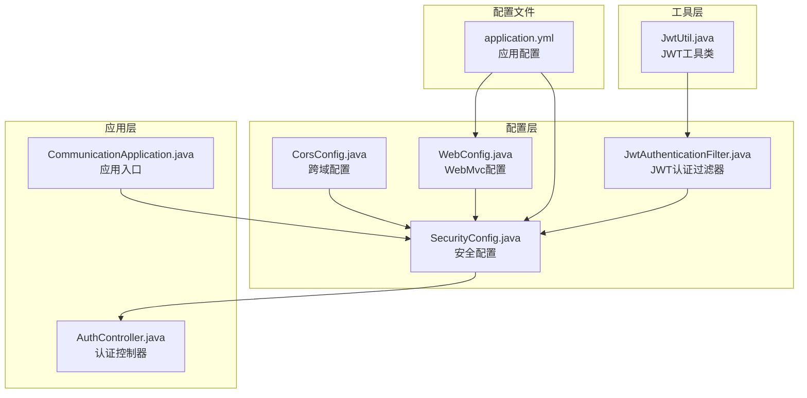
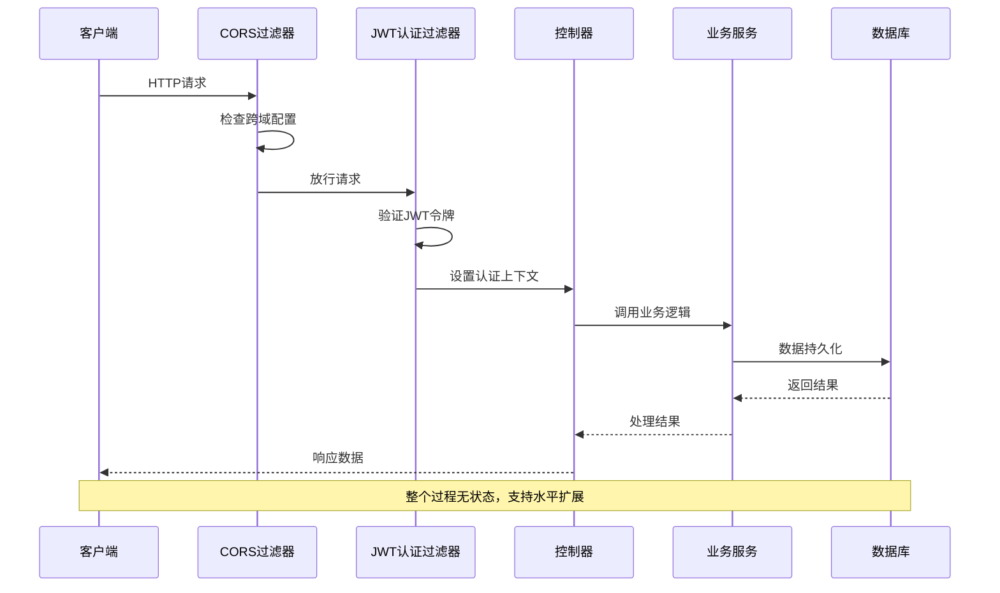
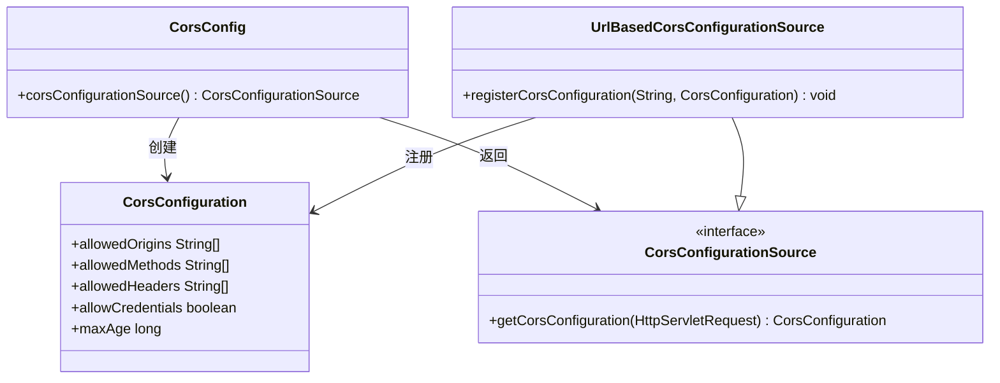
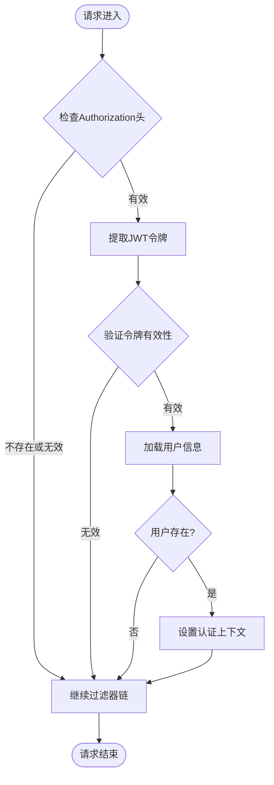
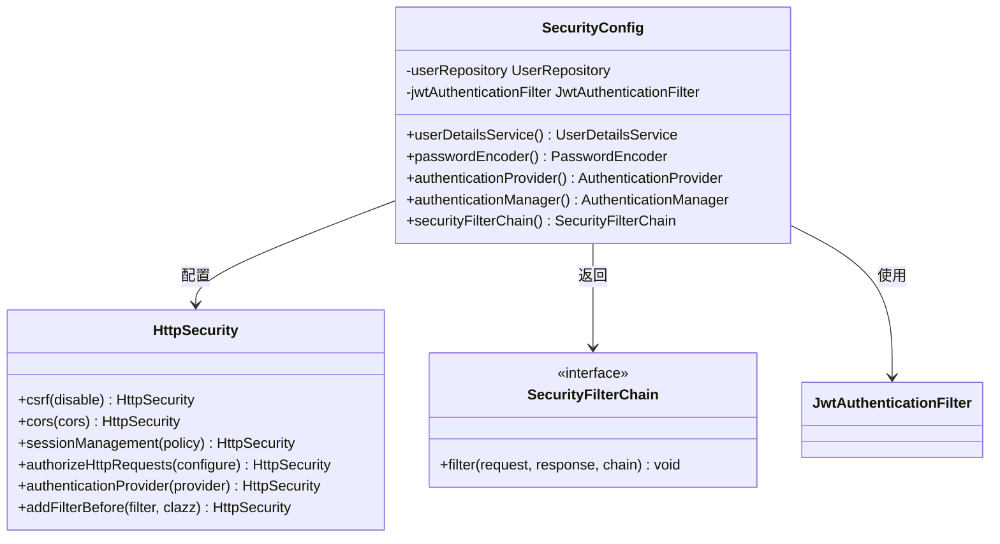
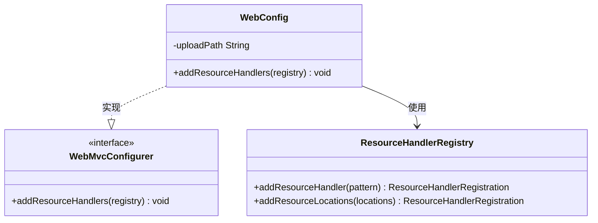
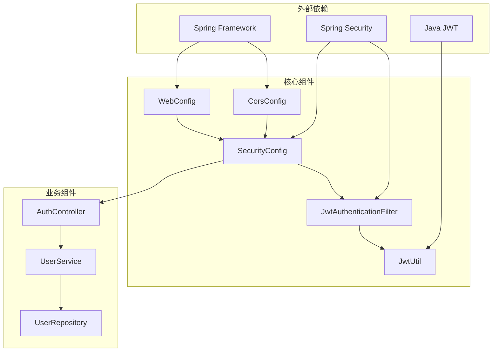

# Web配置与过滤器

<cite>
**本文档引用的文件**
- [CorsConfig.java](file://communication-backend/src/main/java/com/communication/config/CorsConfig.java)
- [WebConfig.java](file://communication-backend/src/main/java/com/communication/config/WebConfig.java)
- [JwtAuthenticationFilter.java](file://communication-backend/src/main/java/com/communication/config/JwtAuthenticationFilter.java)
- [SecurityConfig.java](file://communication-backend/src/main/java/com/communication/config/SecurityConfig.java)
- [JwtUtil.java](file://communication-backend/src/main/java/com/communication/util/JwtUtil.java)
- [application.yml](file://communication-backend/src/main/resources/application.yml)
- [CommunicationApplication.java](file://communication-backend/src/main/java/com/communication/CommunicationApplication.java)
- [AuthController.java](file://communication-backend/src/main/java/com/communication/controller/AuthController.java)
</cite>

## 目录
1. [简介](#简介)
2. [项目结构](#项目结构)
3. [核心组件](#核心组件)
4. [架构概览](#架构概览)
5. [详细组件分析](#详细组件分析)
6. [依赖关系分析](#依赖关系分析)
7. [性能考虑](#性能考虑)
8. [故障排除指南](#故障排除指南)
9. [结论](#结论)

## 简介

本技术文档深入解析通信平台的Web配置与过滤器系统，重点涵盖CORS（跨域资源共享）配置、WebMvcConfigurer配置选项、安全过滤器链工作机制以及跨域问题排查和性能优化策略。该系统采用Spring Boot框架构建，实现了基于JWT的安全认证机制和灵活的跨域资源共享配置。

## 项目结构

通信平台采用标准的Spring Boot项目结构，核心配置位于`communication-backend/src/main/java/com/communication/config/`目录下，包含以下关键配置文件：

**图表来源**
- [CorsConfig.java](file://communication-backend/src/main/java/com/communication/config/CorsConfig.java#L1-L29)
- [WebConfig.java](file://communication-backend/src/main/java/com/communication/config/WebConfig.java#L1-L20)
- [SecurityConfig.java](file://communication-backend/src/main/java/com/communication/config/SecurityConfig.java#L1-L89)
- [JwtAuthenticationFilter.java](file://communication-backend/src/main/java/com/communication/config/JwtAuthenticationFilter.java#L1-L69)

**章节来源**
- [CommunicationApplication.java](file://communication-backend/src/main/java/com/communication/CommunicationApplication.java#L1-L13)
- [application.yml](file://communication-backend/src/main/resources/application.yml#L1-L42)

## 核心组件

### CORS（跨域资源共享）配置

系统通过`CorsConfig`类实现了全面的跨域资源共享配置，支持开发环境下的多端口调试需求。

**跨域配置要点：**
- **允许的源**：配置了本地开发服务器端口（5173和3000）
- **允许的方法**：支持GET、POST、PUT、DELETE、OPTIONS等HTTP方法
- **允许的头部**：使用通配符允许所有自定义头部
- **凭证处理**：启用凭据传递，支持Cookie和认证头部
- **缓存时间**：预检请求缓存时间为3600秒

### WebMvcConfigurer配置

`WebConfig`类实现了Spring MVC的WebMvcConfigurer接口，主要负责静态资源处理配置。

**静态资源处理：**
- **路径映射**：/uploads/** 请求映射到文件系统
- **存储位置**：通过配置文件动态指定上传目录
- **文件类型**：支持图片和视频等多种媒体格式

### 安全过滤器链

系统采用Spring Security构建安全过滤器链，实现了基于JWT的无状态认证机制。

**过滤器链组成：**
- **JWT认证过滤器**：处理JWT令牌验证
- **CSRF禁用**：由于使用JWT，禁用传统的CSRF保护
- **会话管理**：设置为STATELESS无状态模式
- **授权规则**：区分公共端点和受保护端点

**章节来源**
- [CorsConfig.java](file://communication-backend/src/main/java/com/communication/config/CorsConfig.java#L15-L27)
- [WebConfig.java](file://communication-backend/src/main/java/com/communication/config/WebConfig.java#L14-L18)
- [SecurityConfig.java](file://communication-backend/src/main/java/com/communication/config/SecurityConfig.java#L66-L84)

## 架构概览

系统采用分层架构设计，各组件职责明确，通过依赖注入实现松耦合：

**图表来源**
- [SecurityConfig.java](file://communication-backend/src/main/java/com/communication/config/SecurityConfig.java#L66-L84)
- [JwtAuthenticationFilter.java](file://communication-backend/src/main/java/com/communication/config/JwtAuthenticationFilter.java#L31-L67)

## 详细组件分析

### CORS配置组件分析

`CorsConfig`类提供了完整的跨域资源共享解决方案：

**图表来源**
- [CorsConfig.java](file://communication-backend/src/main/java/com/communication/config/CorsConfig.java#L15-L27)

**配置特性：**
- **动态源配置**：支持运行时配置多个允许的源
- **灵活方法配置**：可根据API需求调整允许的HTTP方法
- **安全头部控制**：精确控制允许的自定义头部
- **凭据支持**：启用withCredentials支持

**章节来源**
- [CorsConfig.java](file://communication-backend/src/main/java/com/communication/config/CorsConfig.java#L1-L29)

### JWT认证过滤器分析

`JwtAuthenticationFilter`实现了基于JWT的认证机制：

**图表来源**
- [JwtAuthenticationFilter.java](file://communication-backend/src/main/java/com/communication/config/JwtAuthenticationFilter.java#L31-L67)

**认证流程：**
1. **令牌提取**：从Authorization头部提取Bearer令牌
2. **令牌验证**：使用JWT工具类验证令牌签名和有效期
3. **用户加载**：通过UserDetailsService加载用户详情
4. **上下文设置**：将认证信息写入SecurityContextHolder

**章节来源**
- [JwtAuthenticationFilter.java](file://communication-backend/src/main/java/com/communication/config/JwtAuthenticationFilter.java#L1-L69)

### 安全配置组件分析

`SecurityConfig`类集中管理所有安全相关的配置：

**图表来源**
- [SecurityConfig.java](file://communication-backend/src/main/java/com/communication/config/SecurityConfig.java#L26-L87)

**安全策略：**
- **无状态会话**：设置为STATELESS，不使用Session
- **公共端点**：开放认证、搜索、内容浏览等公共API
- **受保护端点**：其他所有API都需要认证
- **JWT集成**：在UsernamePasswordAuthenticationFilter之前添加JWT过滤器

**章节来源**
- [SecurityConfig.java](file://communication-backend/src/main/java/com/communication/config/SecurityConfig.java#L1-L89)

### Web配置组件分析

`WebConfig`类实现了WebMvcConfigurer接口，提供MVC相关的配置能力：

**图表来源**
- [WebConfig.java](file://communication-backend/src/main/java/com/communication/config/WebConfig.java#L8-L19)

**静态资源处理：**
- **路径映射**：/uploads/** 映射到文件系统
- **存储策略**：支持外部存储和容器部署
- **安全性**：结合安全配置确保访问控制

**章节来源**
- [WebConfig.java](file://communication-backend/src/main/java/com/communication/config/WebConfig.java#L1-L20)

## 依赖关系分析

系统各组件之间的依赖关系清晰，遵循依赖倒置原则：

**图表来源**
- [CorsConfig.java](file://communication-backend/src/main/java/com/communication/config/CorsConfig.java#L1-L29)
- [SecurityConfig.java](file://communication-backend/src/main/java/com/communication/config/SecurityConfig.java#L1-L89)
- [JwtAuthenticationFilter.java](file://communication-backend/src/main/java/com/communication/config/JwtAuthenticationFilter.java#L1-L69)

**依赖特点：**
- **低耦合高内聚**：各组件职责单一，便于测试和维护
- **依赖注入**：通过构造函数注入，确保对象完整性
- **接口隔离**：大量使用接口，支持Mock和替换

**章节来源**
- [application.yml](file://communication-backend/src/main/resources/application.yml#L33-L42)

## 性能考虑

### 跨域性能优化

**预检请求缓存：**
- CORS预检请求缓存时间设置为3600秒，减少重复预检请求
- 合理配置允许的头部和方法，避免频繁的预检请求

**静态资源优化：**
- 使用CDN加速静态资源访问
- 启用Gzip压缩和缓存策略
- 图片和视频资源进行适当的压缩和格式优化

### 过滤器性能优化

**JWT令牌验证优化：**
- 使用内存缓存存储已验证的令牌
- 异步验证机制，避免阻塞请求线程
- 合理设置令牌过期时间，平衡安全性和性能

**会话管理优化：**
- 无状态设计避免Session存储开销
- 使用连接池管理数据库连接
- 缓存常用查询结果

### 数据库性能优化

**查询优化：**
- 为常用查询字段建立索引
- 使用分页查询避免大数据量返回
- 优化复杂查询的执行计划

**连接池配置：**
- 合理配置最大连接数和超时时间
- 使用连接池监控工具跟踪性能指标

## 故障排除指南

### CORS相关问题

**常见问题及解决方案：**

1. **跨域请求被拒绝**
   - 检查CORS配置中的allowedOrigins是否包含前端域名
   - 确认Authorization头部是否在allowedHeaders中
   - 验证是否正确设置了Access-Control-Allow-Credentials

2. **预检请求失败**
   - 检查OPTIONS方法是否在allowedMethods中
   - 确认预检请求缓存时间设置是否合理
   - 验证CORS配置是否正确应用到所有路径

3. **凭据传递问题**
   - 确认客户端是否正确设置withCredentials: true
   - 检查服务器端是否正确处理Cookie
   - 验证CORS配置中的allowCredentials设置

### JWT认证问题

**常见问题及解决方案：**

1. **令牌验证失败**
   - 检查JWT密钥是否正确配置
   - 验证令牌签名算法是否匹配
   - 确认令牌过期时间设置是否合理

2. **用户信息加载失败**
   - 检查UserDetailsService实现是否正确
   - 验证数据库连接是否正常
   - 确认用户表结构和数据完整性

3. **认证上下文丢失**
   - 检查过滤器链顺序是否正确
   - 验证SecurityContext是否正确传播
   - 确认无状态会话配置是否生效

### 静态资源访问问题

**常见问题及解决方案：**

1. **文件无法访问**
   - 检查upload.path配置是否正确
   - 验证文件权限设置
   - 确认文件系统路径是否存在

2. **文件上传失败**
   - 检查文件大小限制配置
   - 验证文件类型白名单设置
   - 确认磁盘空间是否充足

**章节来源**
- [CorsConfig.java](file://communication-backend/src/main/java/com/communication/config/CorsConfig.java#L15-L27)
- [JwtAuthenticationFilter.java](file://communication-backend/src/main/java/com/communication/config/JwtAuthenticationFilter.java#L31-L67)
- [application.yml](file://communication-backend/src/main/resources/application.yml#L38-L42)

## 结论

通信平台的Web配置与过滤器系统展现了现代Spring Boot应用的最佳实践。通过精心设计的CORS配置、基于JWT的安全认证机制和灵活的静态资源处理方案，系统实现了高性能、可扩展且易于维护的Web服务架构。

**主要优势：**
- **安全性**：基于JWT的无状态认证，支持分布式部署
- **灵活性**：可配置的CORS设置，适应不同部署环境
- **可维护性**：清晰的分层架构和依赖注入设计
- **性能**：无状态设计和合理的缓存策略

**改进建议：**
- 添加更详细的日志记录和监控
- 实现更细粒度的权限控制
- 增加API版本管理和向后兼容性
- 优化错误处理和用户体验

该系统为构建企业级通信平台提供了坚实的技术基础，能够支持未来的功能扩展和性能优化需求。