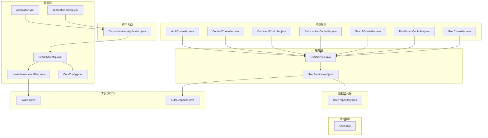
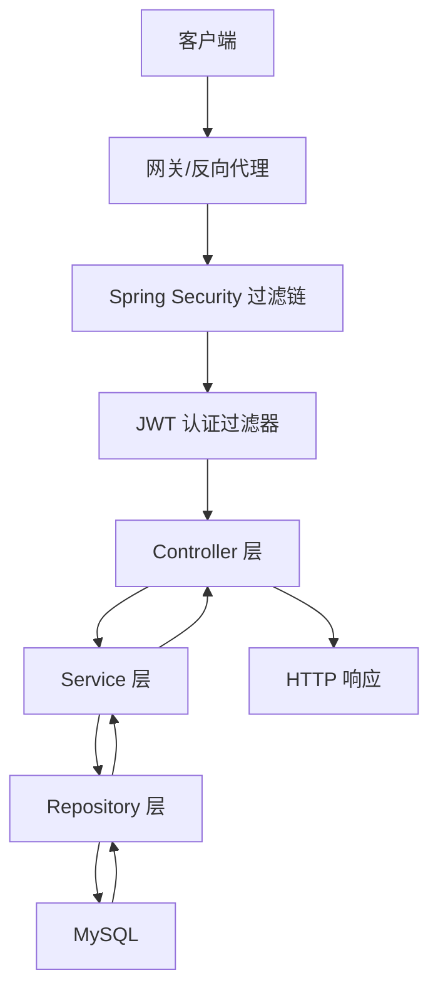
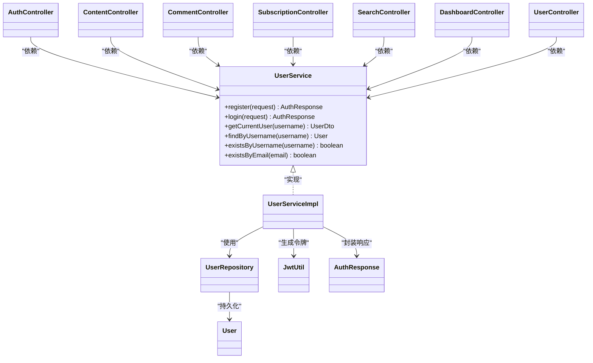
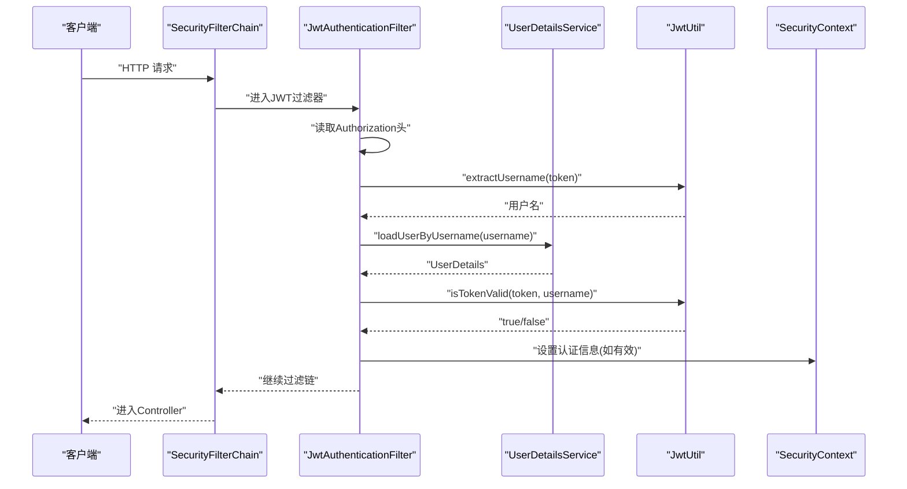
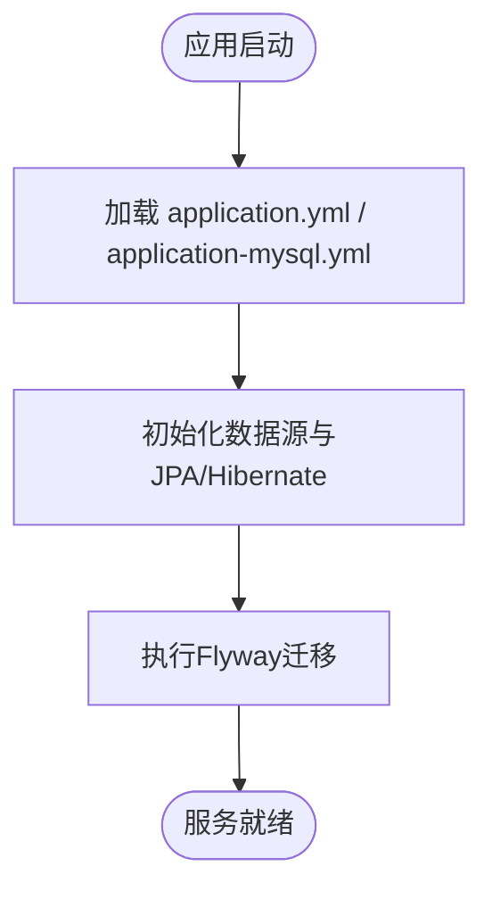
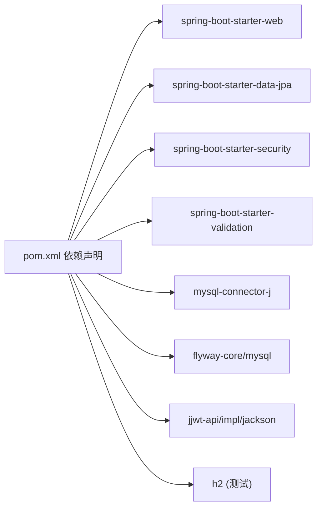

# 后端架构设计

<cite>
**本文引用的文件**
- [CommunicationApplication.java](file://communication-backend/src/main/java/com/communication/CommunicationApplication.java)
- [pom.xml](file://communication-backend/pom.xml)
- [SecurityConfig.java](file://communication-backend/src/main/java/com/communication/config/SecurityConfig.java)
- [JwtAuthenticationFilter.java](file://communication-backend/src/main/java/com/communication/config/JwtAuthenticationFilter.java)
- [CorsConfig.java](file://communication-backend/src/main/java/com/communication/config/CorsConfig.java)
- [application.yml](file://communication-backend/src/main/resources/application.yml)
- [application-mysql.yml](file://communication-backend/src/main/resources/application-mysql.yml)
- [UserService.java](file://communication-backend/src/main/java/com/communication/service/UserService.java)
- [UserServiceImpl.java](file://communication-backend/src/main/java/com/communication/service/impl/UserServiceImpl.java)
- [User.java](file://communication-backend/src/main/java/com/communication/entity/User.java)
- [UserRepository.java](file://communication-backend/src/main/java/com/communication/repository/UserRepository.java)
- [JwtUtil.java](file://communication-backend/src/main/java/com/communication/util/JwtUtil.java)
- [AuthResponse.java](file://communication-backend/src/main/java/com/communication/dto/AuthResponse.java)
- [AuthController.java](file://communication-backend/src/main/java/com/communication/controller/AuthController.java)
- [ContentController.java](file://communication-backend/src/main/java/com/communication/controller/ContentController.java)
- [CommentController.java](file://communication-backend/src/main/java/com/communication/controller/CommentController.java)
- [SubscriptionController.java](file://communication-backend/src/main/java/com/communication/controller/SubscriptionController.java)
- [SearchController.java](file://communication-backend/src/main/java/com/communication/controller/SearchController.java)
- [DashboardController.java](file://communication-backend/src/main/java/com/communication/controller/DashboardController.java)
- [UserController.java](file://communication-backend/src/main/java/com/communication/controller/UserController.java)
- [docker-compose.yml](file://docker-compose.yml)
- [init.sql](file://init.sql)
</cite>

## 目录
1. [引言](#引言)
2. [项目结构](#项目结构)
3. [核心组件](#核心组件)
4. [架构总览](#架构总览)
5. [详细组件分析](#详细组件分析)
6. [依赖分析](#依赖分析)
7. [性能考虑](#性能考虑)
8. [故障排查指南](#故障排查指南)
9. [结论](#结论)
10. [附录](#附录)

## 引言
本文件面向Spring Boot后端架构，系统性阐述分层架构（Controller-Service-Repository-Entity）、安全配置（Spring Security + JWT）、数据库与迁移、RESTful API设计、异常处理与全局错误响应、性能优化与监控等主题。文档以代码为依据，结合架构图与流程图，帮助读者快速理解并高效维护该平台。

## 项目结构
后端采用标准Spring Boot多模块风格，核心源码位于communication-backend模块，按功能域组织为controller、service、repository、entity、dto、config、util等包，配合资源文件与测试用例，形成清晰的分层与职责边界。

图表来源
- [CommunicationApplication.java:1-13](file://communication-backend/src/main/java/com/communication/CommunicationApplication.java#L1-L13)
- [SecurityConfig.java:1-92](file://communication-backend/src/main/java/com/communication/config/SecurityConfig.java#L1-L92)
- [JwtAuthenticationFilter.java:1-69](file://communication-backend/src/main/java/com/communication/config/JwtAuthenticationFilter.java#L1-L69)
- [CorsConfig.java:1-29](file://communication-backend/src/main/java/com/communication/config/CorsConfig.java#L1-L29)
- [application.yml:1-42](file://communication-backend/src/main/resources/application.yml#L1-L42)
- [application-mysql.yml:1-10](file://communication-backend/src/main/resources/application-mysql.yml#L1-L10)
- [AuthController.java](file://communication-backend/src/main/java/com/communication/controller/AuthController.java)
- [ContentController.java](file://communication-backend/src/main/java/com/communication/controller/ContentController.java)
- [CommentController.java](file://communication-backend/src/main/java/com/communication/controller/CommentController.java)
- [SubscriptionController.java](file://communication-backend/src/main/java/com/communication/controller/SubscriptionController.java)
- [SearchController.java](file://communication-backend/src/main/java/com/communication/controller/SearchController.java)
- [DashboardController.java](file://communication-backend/src/main/java/com/communication/controller/DashboardController.java)
- [UserController.java](file://communication-backend/src/main/java/com/communication/controller/UserController.java)
- [UserService.java:1-20](file://communication-backend/src/main/java/com/communication/service/UserService.java#L1-L20)
- [UserServiceImpl.java](file://communication-backend/src/main/java/com/communication/service/impl/UserServiceImpl.java)
- [UserRepository.java:1-27](file://communication-backend/src/main/java/com/communication/repository/UserRepository.java#L1-L27)
- [User.java:1-96](file://communication-backend/src/main/java/com/communication/entity/User.java#L1-L96)
- [JwtUtil.java:1-67](file://communication-backend/src/main/java/com/communication/util/JwtUtil.java#L1-L67)
- [AuthResponse.java:1-47](file://communication-backend/src/main/java/com/communication/dto/AuthResponse.java#L1-L47)

章节来源
- [CommunicationApplication.java:1-13](file://communication-backend/src/main/java/com/communication/CommunicationApplication.java#L1-L13)
- [pom.xml:1-114](file://communication-backend/pom.xml#L1-L114)

## 核心组件
- 应用入口与构建：通过SpringBootApplication注解启动，Maven聚合依赖包含Web、JPA、Security、Validation、MySQL驱动、Flyway、JWT等。
- 配置层：安全过滤链、CORS、数据库与JPA、文件上传、JWT参数等集中于配置与资源文件。
- 控制器层：围绕认证、内容、评论、订阅、搜索、仪表盘、用户等业务域提供REST接口。
- 服务层：定义业务契约与实现，封装业务规则与事务语义。
- 数据访问层：基于JPA Repository进行数据持久化与查询。
- 领域模型：实体映射数据库表结构，含审计字段。
- 工具与DTO：JWT工具、认证响应DTO等。

章节来源
- [pom.xml:25-94](file://communication-backend/pom.xml#L25-L94)
- [application.yml:1-42](file://communication-backend/src/main/resources/application.yml#L1-L42)
- [application-mysql.yml:1-10](file://communication-backend/src/main/resources/application-mysql.yml#L1-L10)
- [UserService.java:1-20](file://communication-backend/src/main/java/com/communication/service/UserService.java#L1-L20)
- [User.java:1-96](file://communication-backend/src/main/java/com/communication/entity/User.java#L1-L96)
- [UserRepository.java:1-27](file://communication-backend/src/main/java/com/communication/repository/UserRepository.java#L1-L27)
- [JwtUtil.java:1-67](file://communication-backend/src/main/java/com/communication/util/JwtUtil.java#L1-L67)
- [AuthResponse.java:1-47](file://communication-backend/src/main/java/com/communication/dto/AuthResponse.java#L1-L47)

## 架构总览
后端采用经典的分层架构，请求自上而下进入Controller，由Service编排业务，Repository访问数据，Entity承载领域模型；安全通过Spring Security + JWT在过滤器中解析与校验令牌，CORS统一跨域策略，JPA/Hibernate负责ORM，Flyway负责数据库迁移。

图表来源
- [SecurityConfig.java:66-90](file://communication-backend/src/main/java/com/communication/config/SecurityConfig.java#L66-L90)
- [JwtAuthenticationFilter.java:31-67](file://communication-backend/src/main/java/com/communication/config/JwtAuthenticationFilter.java#L31-L67)
- [application.yml:33-42](file://communication-backend/src/main/resources/application.yml#L33-L42)

## 详细组件分析

### 分层架构与职责划分
- Controller层：暴露REST接口，接收请求参数，调用Service，返回DTO或响应对象。示例：认证、内容、评论、订阅、搜索、仪表盘、用户等控制器。
- Service层：定义业务接口与实现，封装业务逻辑、事务边界与异常策略。示例：用户服务接口与实现。
- Repository层：继承JPA Repository，提供数据访问方法与自定义查询。示例：用户仓库。
- Entity层：使用JPA注解映射数据库表，包含审计字段与Builder模式辅助构造。
- DTO与工具：认证响应DTO、JWT工具类用于生成与验证令牌。

图表来源
- [AuthController.java](file://communication-backend/src/main/java/com/communication/controller/AuthController.java)
- [ContentController.java](file://communication-backend/src/main/java/com/communication/controller/ContentController.java)
- [CommentController.java](file://communication-backend/src/main/java/com/communication/controller/CommentController.java)
- [SubscriptionController.java](file://communication-backend/src/main/java/com/communication/controller/SubscriptionController.java)
- [SearchController.java](file://communication-backend/src/main/java/com/communication/controller/SearchController.java)
- [DashboardController.java](file://communication-backend/src/main/java/com/communication/controller/DashboardController.java)
- [UserController.java](file://communication-backend/src/main/java/com/communication/controller/UserController.java)
- [UserService.java:1-20](file://communication-backend/src/main/java/com/communication/service/UserService.java#L1-L20)
- [UserServiceImpl.java](file://communication-backend/src/main/java/com/communication/service/impl/UserServiceImpl.java)
- [UserRepository.java:1-27](file://communication-backend/src/main/java/com/communication/repository/UserRepository.java#L1-L27)
- [User.java:1-96](file://communication-backend/src/main/java/com/communication/entity/User.java#L1-L96)
- [JwtUtil.java:1-67](file://communication-backend/src/main/java/com/communication/util/JwtUtil.java#L1-L67)
- [AuthResponse.java:1-47](file://communication-backend/src/main/java/com/communication/dto/AuthResponse.java#L1-L47)

章节来源
- [UserService.java:1-20](file://communication-backend/src/main/java/com/communication/service/UserService.java#L1-L20)
- [UserRepository.java:1-27](file://communication-backend/src/main/java/com/communication/repository/UserRepository.java#L1-L27)
- [User.java:1-96](file://communication-backend/src/main/java/com/communication/entity/User.java#L1-L96)
- [AuthResponse.java:1-47](file://communication-backend/src/main/java/com/communication/dto/AuthResponse.java#L1-L47)

### 安全配置：Spring Security + JWT
- 过滤链配置：禁用CSRF，启用CORS，会话策略为无状态，公开端点白名单，其余均需认证。
- 用户详情加载：从UserRepository按用户名加载用户，不存在抛出异常。
- 密码编码：BCryptPasswordEncoder。
- 认证提供者：DaoAuthenticationProvider，结合UserDetailsService与密码编码器。
- JWT过滤器：从Authorization头提取Bearer令牌，解析用户名，校验有效性，注入SecurityContext。
- CORS配置：允许指定来源、方法、头部与凭证，设置预检缓存时长。
- JWT参数：密钥与过期时间来自配置文件。

图表来源
- [SecurityConfig.java:66-90](file://communication-backend/src/main/java/com/communication/config/SecurityConfig.java#L66-L90)
- [JwtAuthenticationFilter.java:31-67](file://communication-backend/src/main/java/com/communication/config/JwtAuthenticationFilter.java#L31-L67)
- [JwtUtil.java:37-65](file://communication-backend/src/main/java/com/communication/util/JwtUtil.java#L37-L65)

章节来源
- [SecurityConfig.java:1-92](file://communication-backend/src/main/java/com/communication/config/SecurityConfig.java#L1-L92)
- [JwtAuthenticationFilter.java:1-69](file://communication-backend/src/main/java/com/communication/config/JwtAuthenticationFilter.java#L1-L69)
- [CorsConfig.java:1-29](file://communication-backend/src/main/java/com/communication/config/CorsConfig.java#L1-L29)
- [JwtUtil.java:1-67](file://communication-backend/src/main/java/com/communication/util/JwtUtil.java#L1-L67)
- [application.yml:33-42](file://communication-backend/src/main/resources/application.yml#L33-L42)

### 数据库配置、连接池与事务管理
- 数据源：MySQL，支持环境变量覆盖用户名与密码，驱动类名与URL在默认与MySQL配置文件中定义。
- JPA/Hibernate：方言为MySQL，DDL策略为validate，SQL格式化开启。
- Flyway：启用并指定迁移脚本位置，首次迁移自动基线。
- 文件上传：限制单文件与请求总大小，上传路径与允许类型可配置。
- 事务：Spring声明式事务默认传播行为，Service方法内保证一致性；具体事务边界以实现为准。

图表来源
- [application.yml:5-42](file://communication-backend/src/main/resources/application.yml#L5-L42)
- [application-mysql.yml:1-10](file://communication-backend/src/main/resources/application-mysql.yml#L1-L10)

章节来源
- [application.yml:1-42](file://communication-backend/src/main/resources/application.yml#L1-L42)
- [application-mysql.yml:1-10](file://communication-backend/src/main/resources/application-mysql.yml#L1-L10)

### RESTful API 设计原则与全局错误响应
- 设计原则：资源命名使用名词复数，HTTP方法语义明确，状态码与响应体一致；公共接口无需认证，私有接口需要认证。
- 全局错误响应：建议统一包装错误响应体（包含时间戳、状态码、错误信息、路径等），在@ControllerAdvice中实现。当前仓库未见统一异常处理类，建议补充以提升一致性与可观测性。

章节来源
- [SecurityConfig.java:71-84](file://communication-backend/src/main/java/com/communication/config/SecurityConfig.java#L71-L84)

### 性能优化策略、缓存与监控
- 缓存：对热点查询（如分类、趋势、内容详情）引入Redis缓存，减少数据库压力；对写操作采用失效策略。
- 连接池：HikariCP为Spring Boot默认连接池，可通过参数调优最大连接、空闲超时、获取超时等。
- 查询优化：合理使用分页、索引、投影DTO，避免N+1问题；Repository中使用JOIN FETCH或@NamedQueries优化。
- 并发与限流：对高频接口（登录、搜索）增加限流策略，防止突发流量击穿。
- 监控：集成Actuator暴露健康检查、指标端点；Prometheus+Grafana采集JVM与业务指标；日志分级与链路追踪（如Zipkin）。

## 依赖分析
后端依赖以Spring Boot Starter为核心，整合Web、JPA、Security、Validation，并引入MySQL驱动、Flyway、JWT、H2（测试）等。Maven插件负责编译与打包。

图表来源
- [pom.xml:25-94](file://communication-backend/pom.xml#L25-L94)

章节来源
- [pom.xml:1-114](file://communication-backend/pom.xml#L1-L114)

## 性能考虑
- ORM与数据库：合理使用二级缓存与查询缓存；对频繁更新的表谨慎开启；使用合适的锁策略。
- 网络与IO：限制上传文件大小，使用异步上传与CDN；对大结果集分页查询。
- 并发：对高并发场景增加限流与熔断；对热点数据做本地缓存与远程缓存双写。
- 指标：暴露关键业务指标（QPS、P99、错误率、慢查询），结合APM工具定位瓶颈。

## 故障排查指南
- 认证失败：检查Authorization头是否为Bearer Token，确认JWT密钥与过期配置正确，核对UserDetailsService加载用户是否存在。
- 跨域问题：确认CORS配置中的允许来源、方法与头部，以及是否允许凭证。
- 数据库连接：核对数据源URL、用户名、密码，确保MySQL服务可用；查看Flyway迁移状态。
- 文件上传：确认上传路径存在且具备写权限，检查文件类型与大小限制。

章节来源
- [CorsConfig.java:15-28](file://communication-backend/src/main/java/com/communication/config/CorsConfig.java#L15-L28)
- [application.yml:33-42](file://communication-backend/src/main/resources/application.yml#L33-L42)
- [application-mysql.yml:1-10](file://communication-backend/src/main/resources/application-mysql.yml#L1-L10)

## 结论
该后端架构遵循分层与关注点分离原则，结合Spring Security与JWT实现无状态认证，配合JPA/Flyway完成数据建模与演进。建议后续完善统一异常处理、缓存与监控体系，以进一步提升稳定性与可维护性。

## 附录
- 部署与运维：通过docker-compose编排MySQL，初始化SQL脚本与环境变量配置；后端通过不同profile切换数据源。
- 开发指南：使用Maven命令启动，结合测试用例与单元测试保障质量。

章节来源
- [docker-compose.yml](file://docker-compose.yml)
- [init.sql](file://init.sql)