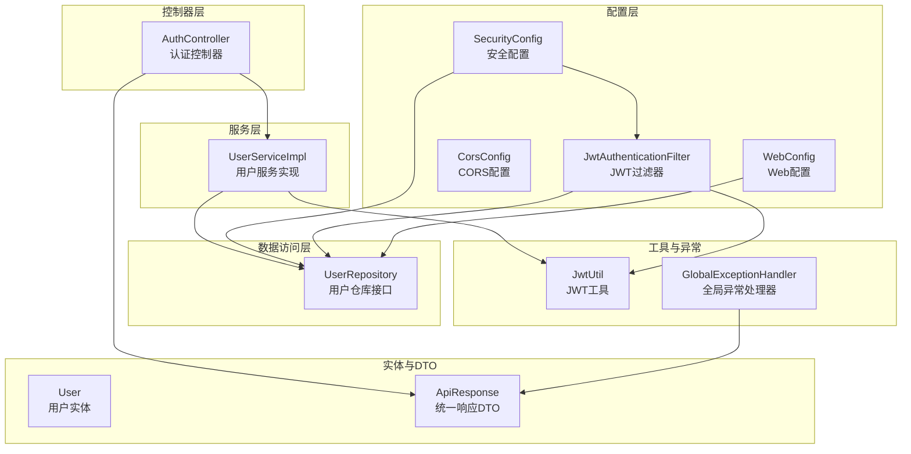
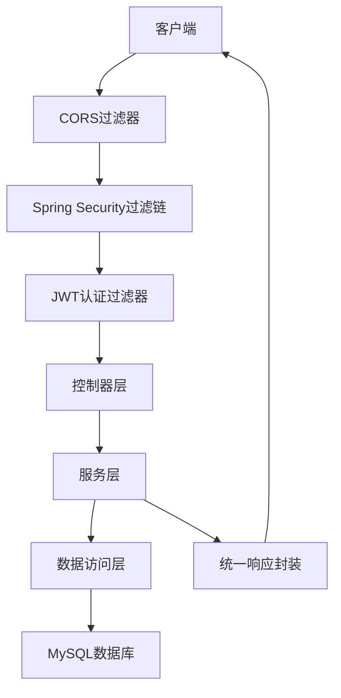
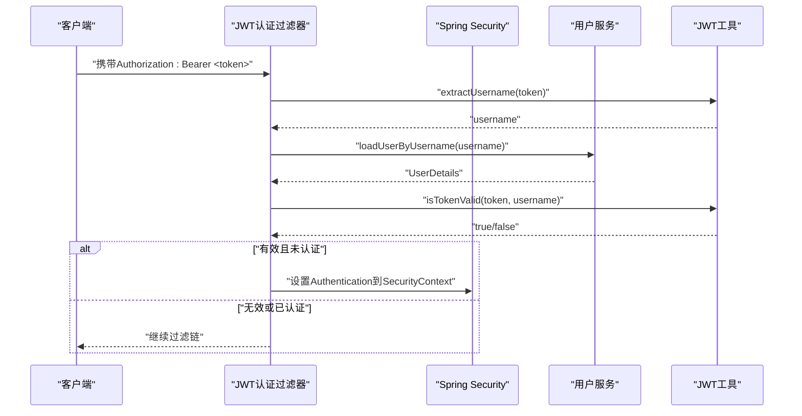
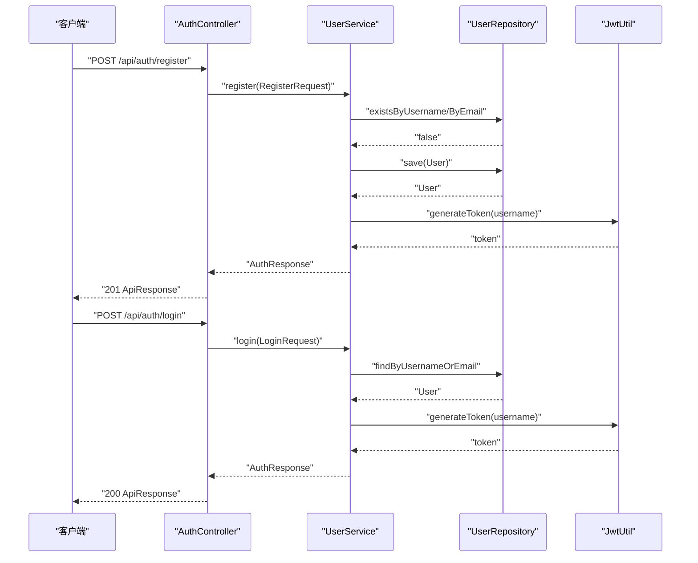
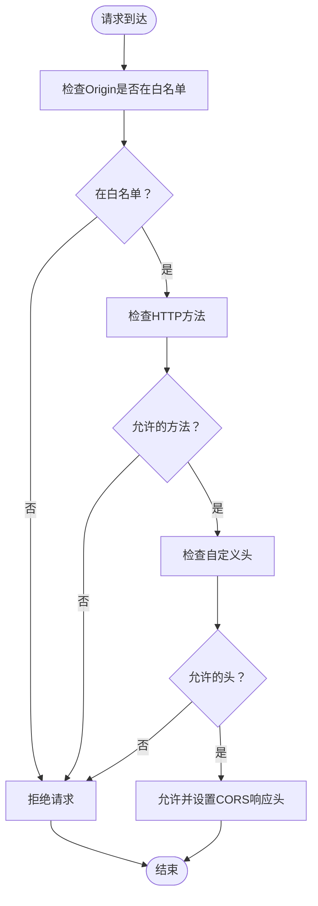
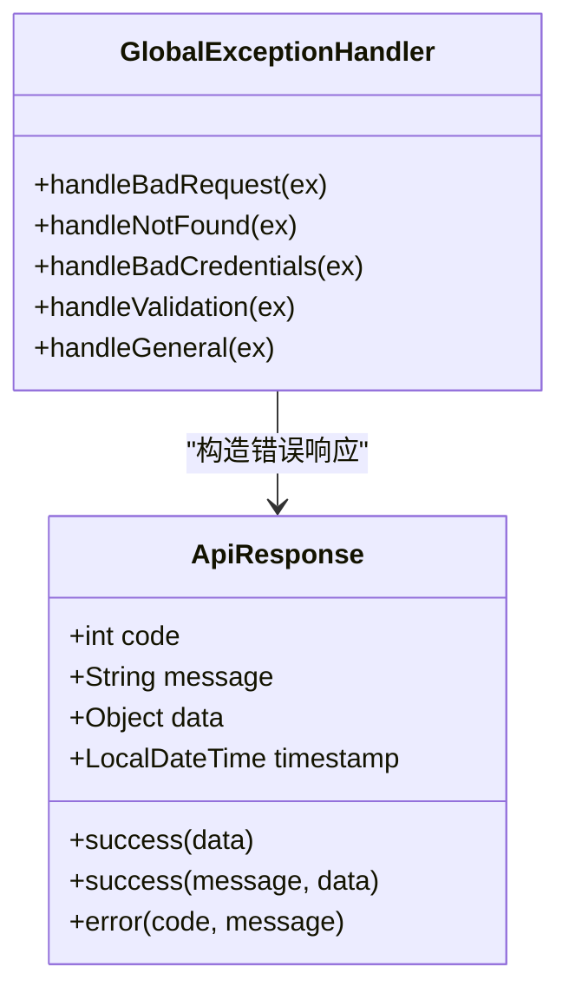
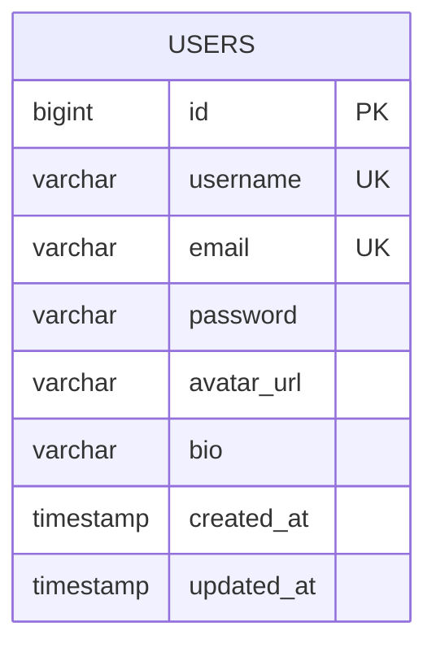
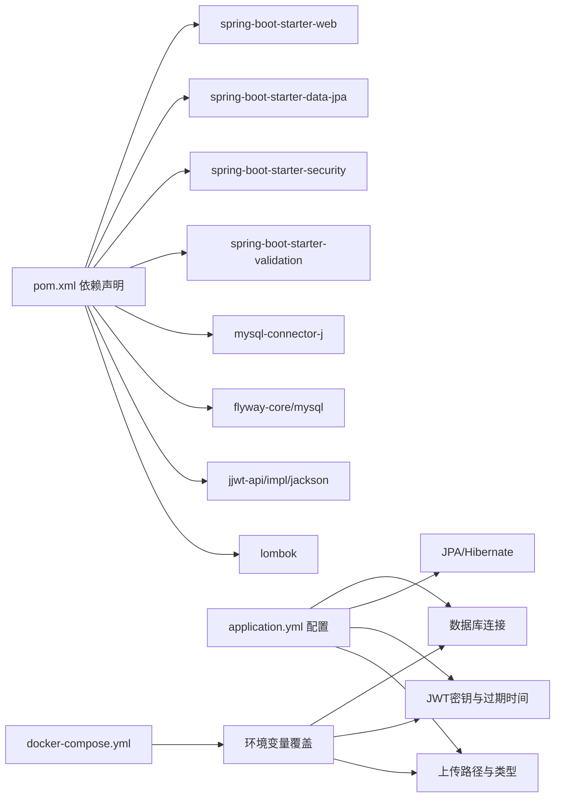

# 后端架构设计

<cite>
**本文档引用的文件**
- [CommunicationApplication.java](file://communication-backend/src/main/java/com/communication/CommunicationApplication.java)
- [SecurityConfig.java](file://communication-backend/src/main/java/com/communication/config/SecurityConfig.java)
- [JwtAuthenticationFilter.java](file://communication-backend/src/main/java/com/communication/config/JwtAuthenticationFilter.java)
- [CorsConfig.java](file://communication-backend/src/main/java/com/communication/config/CorsConfig.java)
- [WebConfig.java](file://communication-backend/src/main/java/com/communication/config/WebConfig.java)
- [JwtUtil.java](file://communication-backend/src/main/java/com/communication/util/JwtUtil.java)
- [AuthController.java](file://communication-backend/src/main/java/com/communication/controller/AuthController.java)
- [UserServiceImpl.java](file://communication-backend/src/main/java/com/communication/service/impl/UserServiceImpl.java)
- [User.java](file://communication-backend/src/main/java/com/communication/entity/User.java)
- [GlobalExceptionHandler.java](file://communication-backend/src/main/java/com/communication/exception/GlobalExceptionHandler.java)
- [ApiResponse.java](file://communication-backend/src/main/java/com/communication/dto/ApiResponse.java)
- [application.yml](file://communication-backend/src/main/resources/application.yml)
- [pom.xml](file://communication-backend/pom.xml)
- [docker-compose.yml](file://docker-compose.yml)
- [V1__init_users.sql](file://communication-backend/src/main/resources/db/migration/V1__init_users.sql)
</cite>

## 更新摘要
**所做更改**
- 新增了完整的MVC架构分层设计说明
- 补充了JWT认证机制的详细实现分析
- 增强了Spring Security配置的安全架构描述
- 完善了CORS跨域处理策略的技术细节
- 添加了统一响应与异常处理的架构设计
- 更新了数据库初始化与Flyway迁移的设计说明
- 补充了Docker容器化部署的架构考虑

## 目录
1. [引言](#引言)
2. [项目结构](#项目结构)
3. [核心组件](#核心组件)
4. [架构总览](#架构总览)
5. [详细组件分析](#详细组件分析)
6. [依赖关系分析](#依赖关系分析)
7. [性能考虑](#性能考虑)
8. [故障排除指南](#故障排除指南)
9. [结论](#结论)

## 引言
本文件为通信平台后端的架构设计文档，面向架构师与高级开发者，系统阐述基于Spring Boot的MVC分层架构、安全配置（Spring Security + JWT）、CORS跨域处理、应用启动与配置加载机制，并提供关键流程的时序图与类图，帮助读者快速理解系统的整体设计与实现细节。

## 项目结构
后端采用标准的Spring Boot多模块结构，按职责划分为配置层、控制器层、服务层、数据访问层、实体与DTO、工具与异常处理等层次。核心特性包括：
- 安全：基于Spring Security的无状态认证，JWT令牌发放与校验
- 跨域：基于CORS的前端域名白名单与凭证支持
- 文件上传：静态资源映射与上传目录配置
- 数据迁移：Flyway数据库版本管理
- 配置：YAML集中配置，支持Docker环境变量覆盖

**图表来源**
- [SecurityConfig.java](file://communication-backend/src/main/java/com/communication/config/SecurityConfig.java#L25-L89)
- [JwtAuthenticationFilter.java](file://communication-backend/src/main/java/com/communication/config/JwtAuthenticationFilter.java#L20-L69)
- [CorsConfig.java](file://communication-backend/src/main/java/com/communication/config/CorsConfig.java#L12-L29)
- [WebConfig.java](file://communication-backend/src/main/java/com/communication/config/WebConfig.java#L8-L20)
- [AuthController.java](file://communication-backend/src/main/java/com/communication/controller/AuthController.java#L13-L42)
- [UserServiceImpl.java](file://communication-backend/src/main/java/com/communication/service/impl/UserServiceImpl.java#L16-L86)
- [JwtUtil.java](file://communication-backend/src/main/java/com/communication/util/JwtUtil.java#L14-L67)
- [GlobalExceptionHandler.java](file://communication-backend/src/main/java/com/communication/exception/GlobalExceptionHandler.java#L15-L63)
- [ApiResponse.java](file://communication-backend/src/main/java/com/communication/dto/ApiResponse.java#L11-L76)

**章节来源**
- [CommunicationApplication.java](file://communication-backend/src/main/java/com/communication/CommunicationApplication.java#L1-L13)
- [application.yml](file://communication-backend/src/main/resources/application.yml#L1-L42)
- [pom.xml](file://communication-backend/pom.xml#L25-L114)

## 核心组件
- 应用入口与启动：通过SpringBootApplication注解启动，主方法负责引导Spring容器。
- 安全配置：定义无状态会话策略、公开端点、认证提供者与JWT过滤器链。
- JWT工具：生成与验证令牌，解析负载信息。
- 控制器：对外暴露REST API，使用统一响应包装。
- 全局异常处理：标准化错误响应码与消息。
- CORS配置：允许指定前端域名、方法与头，支持凭证。
- Web配置：静态资源映射到本地上传目录。

**章节来源**
- [CommunicationApplication.java](file://communication-backend/src/main/java/com/communication/CommunicationApplication.java#L6-L12)
- [SecurityConfig.java](file://communication-backend/src/main/java/com/communication/config/SecurityConfig.java#L36-L87)
- [JwtUtil.java](file://communication-backend/src/main/java/com/communication/util/JwtUtil.java#L28-L66)
- [AuthController.java](file://communication-backend/src/main/java/com/communication/controller/AuthController.java#L22-L40)
- [GlobalExceptionHandler.java](file://communication-backend/src/main/java/com/communication/exception/GlobalExceptionHandler.java#L18-L61)
- [CorsConfig.java](file://communication-backend/src/main/java/com/communication/config/CorsConfig.java#L15-L27)
- [WebConfig.java](file://communication-backend/src/main/java/com/communication/config/WebConfig.java#L14-L18)

## 架构总览
系统采用经典的MVC分层架构，结合Spring Security与JWT实现无状态认证。请求在进入控制器前先经过CORS与JWT过滤器链，完成身份解析后进入业务层，最终返回统一格式的响应。

**图表来源**
- [CorsConfig.java](file://communication-backend/src/main/java/com/communication/config/CorsConfig.java#L15-L27)
- [SecurityConfig.java](file://communication-backend/src/main/java/com/communication/config/SecurityConfig.java#L66-L87)
- [JwtAuthenticationFilter.java](file://communication-backend/src/main/java/com/communication/config/JwtAuthenticationFilter.java#L31-L67)
- [AuthController.java](file://communication-backend/src/main/java/com/communication/controller/AuthController.java#L13-L42)
- [ApiResponse.java](file://communication-backend/src/main/java/com/communication/dto/ApiResponse.java#L22-L76)

## 详细组件分析

### 安全架构与认证流程
- 无状态会话：禁用CSRF，设置SessionCreationPolicy.STATELESS，确保JWT驱动的身份上下文。
- 认证提供者：基于DaoAuthenticationProvider与UserDetailsService，从数据库加载用户并进行密码匹配。
- JWT过滤器：从Authorization头提取Bearer令牌，解析用户名，构建Authentication对象写入SecurityContext。
- 公开端点：认证、内容查询、搜索、订阅计数等端点无需鉴权；其余请求均需认证。

**图表来源**
- [JwtAuthenticationFilter.java](file://communication-backend/src/main/java/com/communication/config/JwtAuthenticationFilter.java#L31-L67)
- [JwtUtil.java](file://communication-backend/src/main/java/com/communication/util/JwtUtil.java#L37-L65)
- [SecurityConfig.java](file://communication-backend/src/main/java/com/communication/config/SecurityConfig.java#L36-L58)

**章节来源**
- [SecurityConfig.java](file://communication-backend/src/main/java/com/communication/config/SecurityConfig.java#L66-L87)
- [JwtAuthenticationFilter.java](file://communication-backend/src/main/java/com/communication/config/JwtAuthenticationFilter.java#L31-L67)
- [JwtUtil.java](file://communication-backend/src/main/java/com/communication/util/JwtUtil.java#L28-L65)

### 认证授权流程（注册/登录）
- 注册：检查用户名与邮箱唯一性，加密密码，持久化用户，签发JWT并返回统一响应。
- 登录：根据用户名或邮箱查找用户，比对密码，签发JWT并返回统一响应。
- 获取当前用户：基于SecurityContext中的UserDetails获取用户信息。

**图表来源**
- [AuthController.java](file://communication-backend/src/main/java/com/communication/controller/AuthController.java#L22-L40)
- [UserServiceImpl.java](file://communication-backend/src/main/java/com/communication/service/impl/UserServiceImpl.java#L28-L62)
- [JwtUtil.java](file://communication-backend/src/main/java/com/communication/util/JwtUtil.java#L28-L35)

**章节来源**
- [AuthController.java](file://communication-backend/src/main/java/com/communication/controller/AuthController.java#L22-L40)
- [UserServiceImpl.java](file://communication-backend/src/main/java/com/communication/service/impl/UserServiceImpl.java#L28-L62)

### CORS跨域处理策略
- 允许来源：开发环境默认允许本地Vue与React示例端口。
- 允许方法：GET、POST、PUT、DELETE、OPTIONS。
- 允许头：通配符。
- 凭证：允许携带Cookie/Authorization头。
- 缓存时间：预检请求缓存1小时。

**图表来源**
- [CorsConfig.java](file://communication-backend/src/main/java/com/communication/config/CorsConfig.java#L15-L27)

**章节来源**
- [CorsConfig.java](file://communication-backend/src/main/java/com/communication/config/CorsConfig.java#L15-L27)

### Web配置与文件上传
- 静态资源映射：/uploads/** 映射到本地上传路径，便于直接访问媒体文件。
- 上传路径：通过配置项upload.path控制，默认为项目根目录下的./uploads。
- 上传限制：multipart大小限制在配置中定义，避免过大请求导致内存压力。

**章节来源**
- [WebConfig.java](file://communication-backend/src/main/java/com/communication/config/WebConfig.java#L11-L18)
- [application.yml](file://communication-backend/src/main/resources/application.yml#L38-L41)

### 统一响应与异常处理
- 统一响应：ApiResponse封装code、message、data与timestamp，支持泛型数据体。
- 异常处理：针对业务异常、资源不存在、凭据错误、参数校验失败与通用异常进行分类处理，返回标准化错误响应。

**图表来源**
- [ApiResponse.java](file://communication-backend/src/main/java/com/communication/dto/ApiResponse.java#L16-L76)
- [GlobalExceptionHandler.java](file://communication-backend/src/main/java/com/communication/exception/GlobalExceptionHandler.java#L18-L61)

**章节来源**
- [ApiResponse.java](file://communication-backend/src/main/java/com/communication/dto/ApiResponse.java#L16-L76)
- [GlobalExceptionHandler.java](file://communication-backend/src/main/java/com/communication/exception/GlobalExceptionHandler.java#L18-L61)

### 数据模型与数据库初始化
- 用户实体：包含id、username、email、password、avatarUrl、bio及时间戳字段。
- Flyway迁移：初始化users表，包含索引以优化查询性能。

**图表来源**
- [User.java](file://communication-backend/src/main/java/com/communication/entity/User.java#L19-L96)
- [V1__init_users.sql](file://communication-backend/src/main/resources/db/migration/V1__init_users.sql#L2-L13)

**章节来源**
- [User.java](file://communication-backend/src/main/java/com/communication/entity/User.java#L19-L96)
- [V1__init_users.sql](file://communication-backend/src/main/resources/db/migration/V1__init_users.sql#L1-L14)

## 依赖关系分析
- 运行时依赖：Spring Web、Data JPA、Security、Validation、MySQL Connector、Flyway、JWT（jjwt）。
- 构建插件：Spring Boot Maven Plugin、Lombok注解处理。
- 环境配置：application.yml集中管理数据库、JPA、JWT、上传路径等；docker-compose提供Docker环境变量覆盖。

**图表来源**
- [pom.xml](file://communication-backend/pom.xml#L25-L114)
- [application.yml](file://communication-backend/src/main/resources/application.yml#L5-L41)
- [docker-compose.yml](file://docker-compose.yml#L31-L37)

**章节来源**
- [pom.xml](file://communication-backend/pom.xml#L25-L114)
- [application.yml](file://communication-backend/src/main/resources/application.yml#L5-L41)
- [docker-compose.yml](file://docker-compose.yml#L31-L37)

## 性能考虑
- 无状态认证：避免服务器端会话存储，提升横向扩展能力。
- 密码加密：使用BCrypt，降低密码泄露风险。
- 数据库索引：Flyway初始化时为username与email建立索引，优化查询。
- 上传限制：合理设置multipart大小，防止内存溢出。
- CORS缓存：预检请求缓存1小时，减少重复OPTIONS请求。

## 故障排除指南
- 认证失败：检查Authorization头格式是否为Bearer <token>，确认JWT密钥与过期时间配置正确。
- 资源不存在：确认URL路径与公开端点规则，核对数据库中是否存在对应记录。
- 参数校验失败：关注400错误返回的字段级错误信息，修正请求体。
- 跨域问题：确认前端端口在CORS白名单中，且允许凭证与相应方法。

**章节来源**
- [JwtAuthenticationFilter.java](file://communication-backend/src/main/java/com/communication/config/JwtAuthenticationFilter.java#L37-L42)
- [GlobalExceptionHandler.java](file://communication-backend/src/main/java/com/communication/exception/GlobalExceptionHandler.java#L39-L54)
- [CorsConfig.java](file://communication-backend/src/main/java/com/communication/config/CorsConfig.java#L18-L21)

## 结论
该后端架构以Spring Boot为核心，采用MVC分层与无状态JWT认证，结合CORS与统一响应/异常处理，形成清晰、可扩展、易维护的系统设计。通过Flyway与Docker编排，实现了数据库版本管理与环境一致性。建议在生产环境中进一步完善权限粒度、审计日志与监控告警体系，持续提升安全性与可观测性。