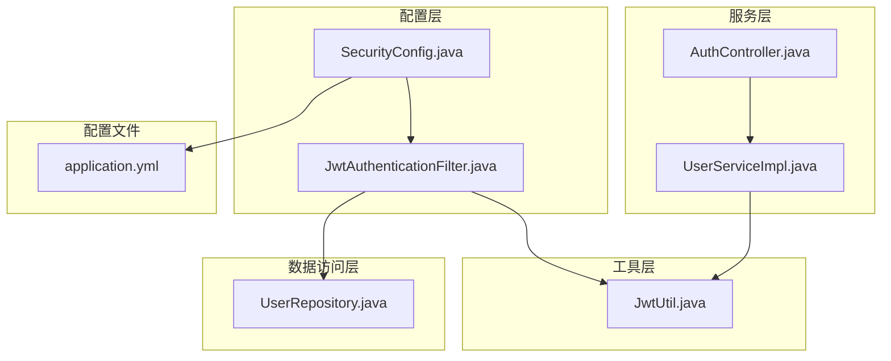
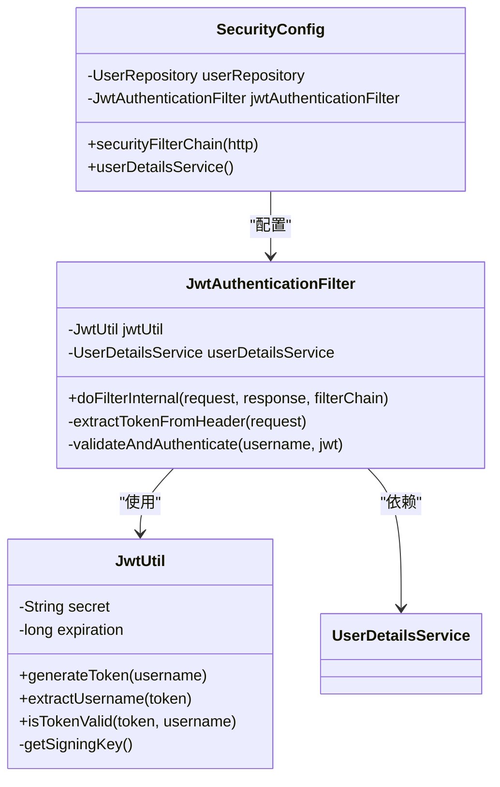
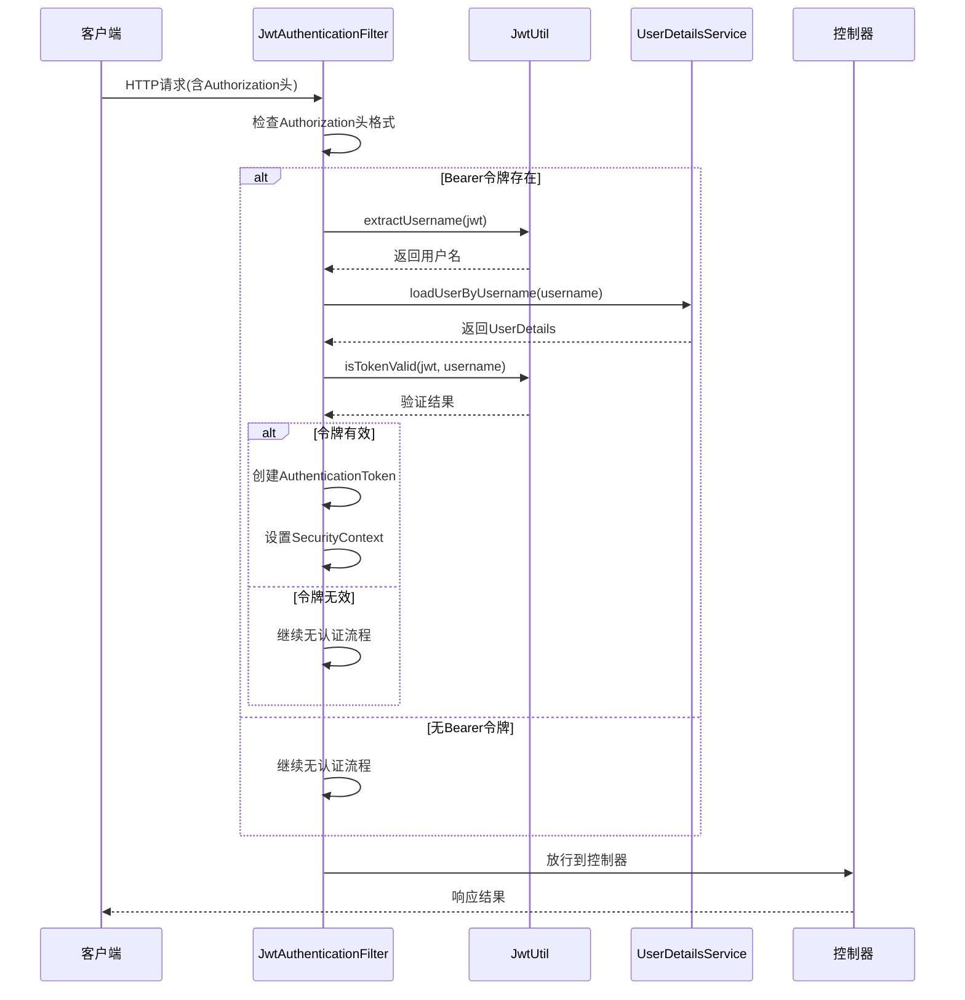
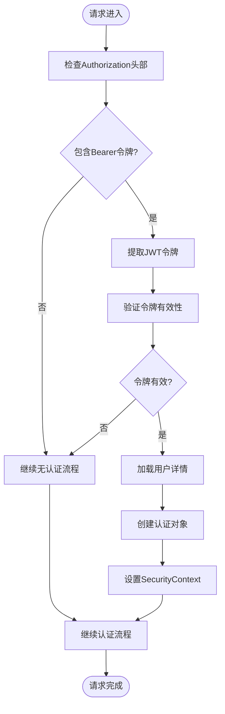
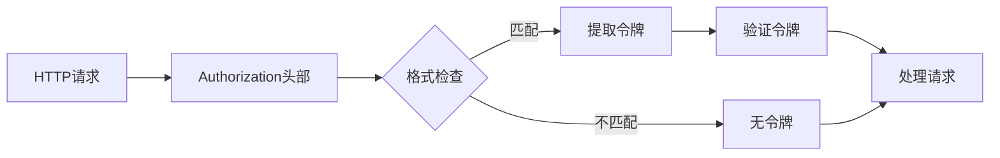
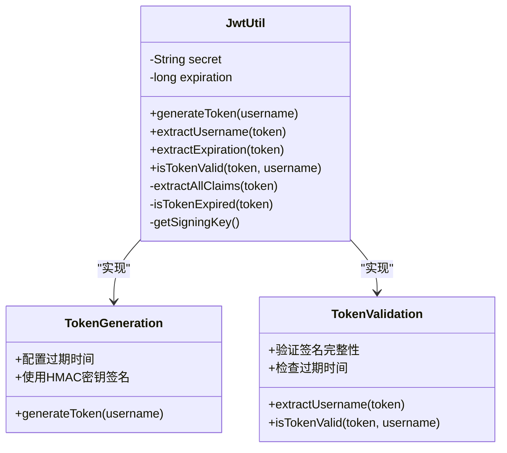
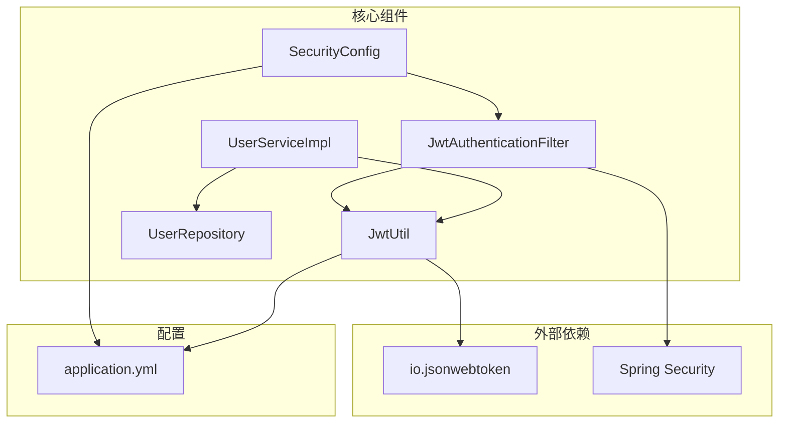

# JWT认证过滤器

<cite>
**本文档引用的文件**
- [JwtAuthenticationFilter.java](file://communication-backend/src/main/java/com/communication/config/JwtAuthenticationFilter.java)
- [JwtUtil.java](file://communication-backend/src/main/java/com/communication/util/JwtUtil.java)
- [SecurityConfig.java](file://communication-backend/src/main/java/com/communication/config/SecurityConfig.java)
- [UserServiceImpl.java](file://communication-backend/src/main/java/com/communication/service/impl/UserServiceImpl.java)
- [AuthController.java](file://communication-backend/src/main/java/com/communication/controller/AuthController.java)
- [application.yml](file://communication-backend/src/main/resources/application.yml)
- [UserRepository.java](file://communication-backend/src/main/java/com/communication/repository/UserRepository.java)
</cite>

## 目录
1. [简介](#简介)
2. [项目结构](#项目结构)
3. [核心组件](#核心组件)
4. [架构概览](#架构概览)
5. [详细组件分析](#详细组件分析)
6. [依赖关系分析](#依赖关系分析)
7. [性能考虑](#性能考虑)
8. [故障排除指南](#故障排除指南)
9. [结论](#结论)

## 简介

JWT认证过滤器是Spring Security安全框架中的关键组件，负责在请求到达控制器之前验证JWT令牌并建立用户身份认证。该过滤器实现了无状态认证机制，通过拦截HTTP请求头中的Authorization字段来提取JWT令牌，并使用JwtUtil工具类进行令牌验证和用户信息解析。

本技术文档将深入分析JwtAuthenticationFilter的工作原理，包括其在安全链中的位置、执行顺序、令牌提取机制、用户认证流程以及与相关组件的协作关系。

## 项目结构

该项目采用标准的Spring Boot分层架构，JWT认证相关的代码主要分布在以下目录：

**图表来源**
- [SecurityConfig.java](file://communication-backend/src/main/java/com/communication/config/SecurityConfig.java#L1-L89)
- [JwtAuthenticationFilter.java](file://communication-backend/src/main/java/com/communication/config/JwtAuthenticationFilter.java#L1-L69)
- [JwtUtil.java](file://communication-backend/src/main/java/com/communication/util/JwtUtil.java#L1-L67)

**章节来源**
- [SecurityConfig.java](file://communication-backend/src/main/java/com/communication/config/SecurityConfig.java#L1-L89)
- [JwtAuthenticationFilter.java](file://communication-backend/src/main/java/com/communication/config/JwtAuthenticationFilter.java#L1-L69)

## 核心组件

### JwtAuthenticationFilter类分析

JwtAuthenticationFilter继承自OncePerRequestFilter，确保每个请求只被过滤一次。该类包含两个主要依赖：

- **JwtUtil**: 负责JWT令牌的生成、验证和解析
- **UserDetailsService**: 提供用户详情信息的服务接口

**图表来源**
- [JwtAuthenticationFilter.java](file://communication-backend/src/main/java/com/communication/config/JwtAuthenticationFilter.java#L20-L69)
- [JwtUtil.java](file://communication-backend/src/main/java/com/communication/util/JwtUtil.java#L14-L67)
- [SecurityConfig.java](file://communication-backend/src/main/java/com/communication/config/SecurityConfig.java#L24-L89)

**章节来源**
- [JwtAuthenticationFilter.java](file://communication-backend/src/main/java/com/communication/config/JwtAuthenticationFilter.java#L20-L69)
- [JwtUtil.java](file://communication-backend/src/main/java/com/communication/util/JwtUtil.java#L14-L67)

## 架构概览

JWT认证过滤器在整个Spring Security安全体系中扮演着前置验证的角色：

**图表来源**
- [JwtAuthenticationFilter.java](file://communication-backend/src/main/java/com/communication/config/JwtAuthenticationFilter.java#L31-L67)
- [JwtUtil.java](file://communication-backend/src/main/java/com/communication/util/JwtUtil.java#L37-L61)

## 详细组件分析

### 过滤器执行流程

JwtAuthenticationFilter的执行流程遵循以下步骤：

1. **请求头检查**: 验证Authorization头部是否存在且以"Bearer "开头
2. **令牌提取**: 从Authorization头部提取JWT令牌字符串
3. **令牌验证**: 使用JwtUtil工具类验证令牌的有效性
4. **用户加载**: 通过UserDetailsService加载用户详情
5. **认证建立**: 创建UsernamePasswordAuthenticationToken并设置到SecurityContext

**图表来源**
- [JwtAuthenticationFilter.java](file://communication-backend/src/main/java/com/communication/config/JwtAuthenticationFilter.java#L37-L67)

### 令牌提取机制

令牌提取过程严格遵循HTTP标准规范：

**图表来源**
- [JwtAuthenticationFilter.java](file://communication-backend/src/main/java/com/communication/config/JwtAuthenticationFilter.java#L37-L44)

### 用户认证流程

认证流程涉及多个组件的协作：

1. **令牌解析**: JwtUtil.extractUsername()从JWT载荷中提取用户名
2. **用户加载**: UserDetailsService.loadUserByUsername()从数据库加载用户
3. **令牌验证**: JwtUtil.isTokenValid()验证令牌签名和有效期
4. **认证对象创建**: UsernamePasswordAuthenticationToken封装用户信息
5. **上下文设置**: SecurityContextHolder.setAuthentication()建立认证状态

**章节来源**
- [JwtAuthenticationFilter.java](file://communication-backend/src/main/java/com/communication/config/JwtAuthenticationFilter.java#L46-L61)
- [JwtUtil.java](file://communication-backend/src/main/java/com/communication/util/JwtUtil.java#L58-L61)

### 认证成功处理机制

当认证成功时，系统会执行以下操作：

1. **认证对象创建**: 使用用户详情信息创建UsernamePasswordAuthenticationToken
2. **详细信息设置**: 通过WebAuthenticationDetailsSource构建请求详细信息
3. **安全上下文设置**: 将认证对象设置到SecurityContextHolder
4. **请求放行**: 继续到后续的控制器处理

### 认证失败处理机制

认证失败时的处理策略：

1. **异常捕获**: 过滤器内部使用try-catch捕获所有异常
2. **无认证继续**: 发生任何异常时，过滤器选择继续无认证流程
3. **后续验证**: 后续的业务逻辑或Spring Security其他组件可以进行进一步验证

**章节来源**
- [JwtAuthenticationFilter.java](file://communication-backend/src/main/java/com/communication/config/JwtAuthenticationFilter.java#L62-L64)

### 与JwtUtil工具类的协作

JwtUtil提供了完整的JWT生命周期管理：

**图表来源**
- [JwtUtil.java](file://communication-backend/src/main/java/com/communication/util/JwtUtil.java#L28-L66)

**章节来源**
- [JwtUtil.java](file://communication-backend/src/main/java/com/communication/util/JwtUtil.java#L28-L66)

## 依赖关系分析

### 组件依赖图

**图表来源**
- [JwtAuthenticationFilter.java](file://communication-backend/src/main/java/com/communication/config/JwtAuthenticationFilter.java#L3-L15)
- [JwtUtil.java](file://communication-backend/src/main/java/com/communication/util/JwtUtil.java#L3-L7)
- [SecurityConfig.java](file://communication-backend/src/main/java/com/communication/config/SecurityConfig.java#L1-L20)

### 关键依赖关系

1. **JwtAuthenticationFilter依赖JwtUtil**: 用于令牌验证和解析
2. **SecurityConfig配置过滤器**: 在UsernamePasswordAuthenticationFilter之前执行
3. **UserServiceImpl依赖JwtUtil**: 用于生成登录令牌
4. **JwtUtil依赖配置文件**: 从application.yml读取JWT配置

**章节来源**
- [SecurityConfig.java](file://communication-backend/src/main/java/com/communication/config/SecurityConfig.java#L84-L84)
- [application.yml](file://communication-backend/src/main/resources/application.yml#L34-L36)

## 性能考虑

### 过滤器性能优化

1. **一次性过滤**: 继承OncePerRequestFilter确保每个请求只处理一次
2. **轻量级验证**: 仅进行必要的令牌验证，避免重复查询
3. **异常处理**: 内部异常捕获避免影响整体性能

### JWT配置优化

1. **令牌过期时间**: 默认24小时，可根据业务需求调整
2. **密钥安全性**: 使用至少256位的密钥长度
3. **内存使用**: 无状态设计避免服务器端存储

## 故障排除指南

### 常见问题及解决方案

1. **令牌格式错误**
   - 症状: Authorization头部格式不正确
   - 解决方案: 确保使用"Bearer {token}"格式

2. **令牌验证失败**
   - 症状: 令牌过期或签名无效
   - 解决方案: 重新生成令牌或检查密钥配置

3. **用户不存在**
   - 症状: UserDetailsService抛出异常
   - 解决方案: 检查用户是否存在于数据库

### 调试建议

1. **启用日志**: 添加适当的日志记录来跟踪认证流程
2. **测试令牌**: 使用JWT调试工具验证令牌格式
3. **监控性能**: 监控认证过滤器的执行时间和错误率

**章节来源**
- [JwtAuthenticationFilter.java](file://communication-backend/src/main/java/com/communication/config/JwtAuthenticationFilter.java#L62-L64)

## 结论

JWT认证过滤器通过简洁而高效的实现，为Spring Security应用提供了强大的无状态认证能力。其设计特点包括：

1. **无状态认证**: 完全基于JWT令牌的认证机制
2. **前置验证**: 在请求到达控制器之前进行认证
3. **异常容错**: 内部异常处理确保系统的稳定性
4. **配置灵活**: 通过application.yml轻松配置JWT参数

该实现为现代Web应用提供了可靠的认证基础，支持高并发场景下的用户身份验证需求。