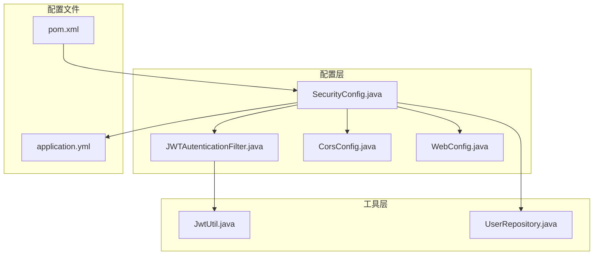
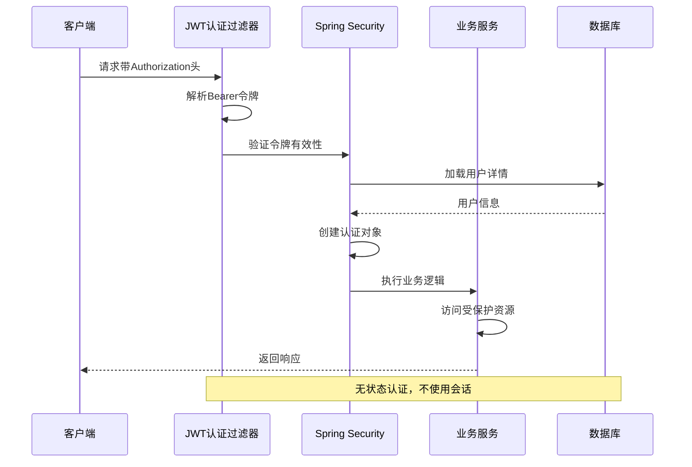
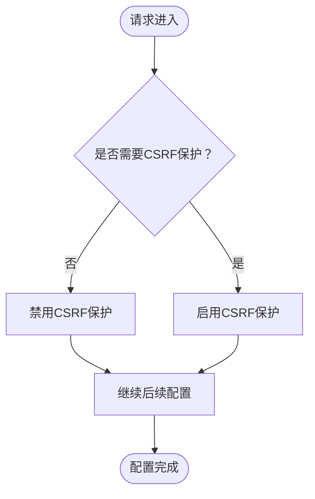
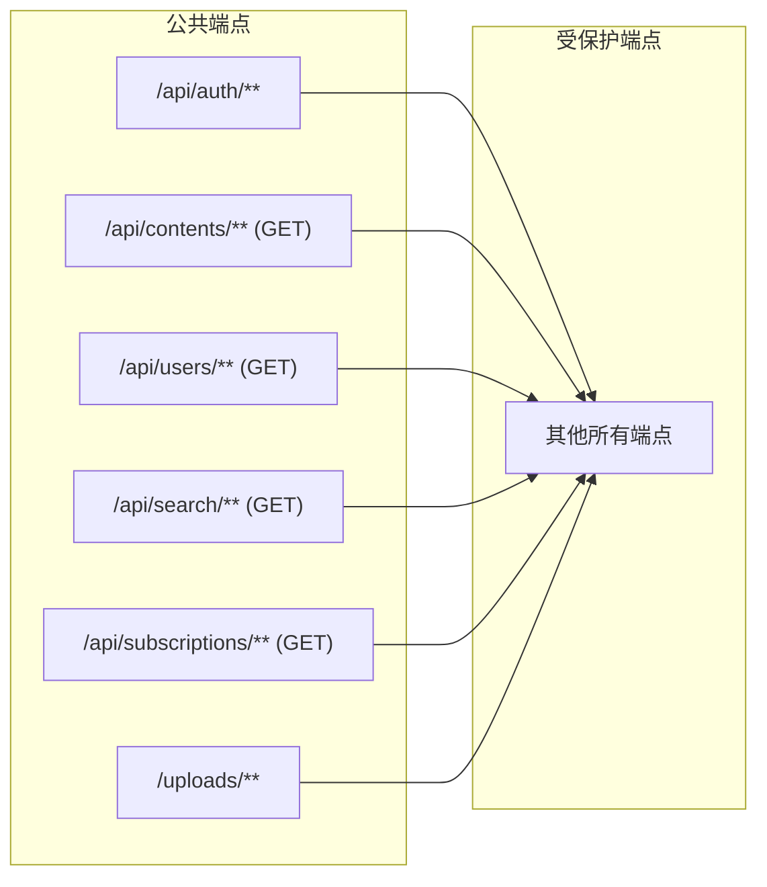
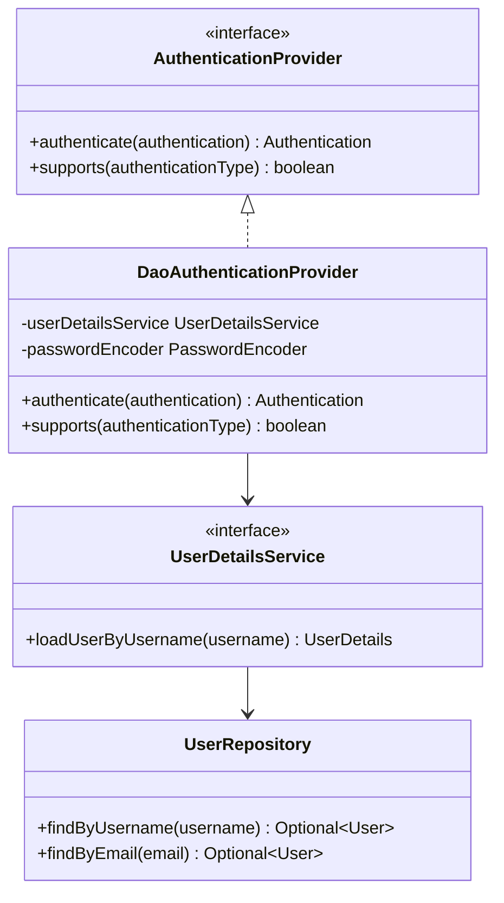
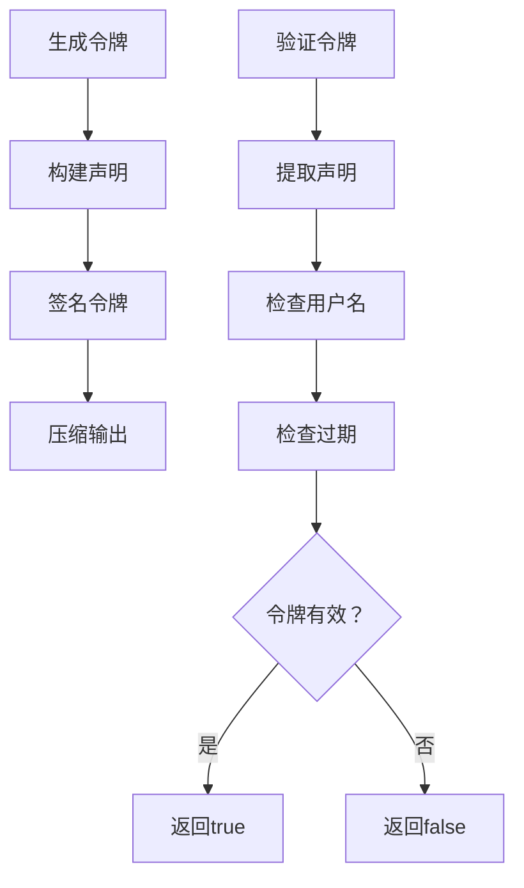
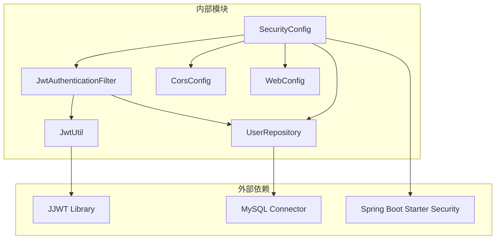

# Spring Security配置

<cite>
**本文档引用的文件**
- [SecurityConfig.java](file://communication-backend/src/main/java/com/communication/config/SecurityConfig.java)
- [JwtAuthenticationFilter.java](file://communication-backend/src/main/java/com/communication/config/JwtAuthenticationFilter.java)
- [CorsConfig.java](file://communication-backend/src/main/java/com/communication/config/CorsConfig.java)
- [WebConfig.java](file://communication-backend/src/main/java/com/communication/config/WebConfig.java)
- [JwtUtil.java](file://communication-backend/src/main/java/com/communication/util/JwtUtil.java)
- [UserRepository.java](file://communication-backend/src/main/java/com/communication/repository/UserRepository.java)
- [application.yml](file://communication-backend/src/main/resources/application.yml)
- [pom.xml](file://communication-backend/pom.xml)
- [AuthController.java](file://communication-backend/src/main/java/com/communication/controller/AuthController.java)
</cite>

## 目录
1. [简介](#简介)
2. [项目结构](#项目结构)
3. [核心组件](#核心组件)
4. [架构概览](#架构概览)
5. [详细组件分析](#详细组件分析)
6. [依赖关系分析](#依赖关系分析)
7. [性能考虑](#性能考虑)
8. [故障排除指南](#故障排除指南)
9. [结论](#结论)

## 简介

本文件详细分析了Spring Security在通信平台后端中的配置实现。该系统采用基于JWT的无状态认证机制，通过自定义过滤器链实现细粒度的请求授权控制。文档重点解释了SecurityConfig类的设计架构、HttpSecurity配置策略、会话管理策略（STATELESS）、请求授权规则配置、CSRF禁用原因以及跨域配置（CORS）的实现。

## 项目结构

Spring Security配置位于后端项目的配置包中，与业务逻辑分离，遵循Spring Boot的标准目录结构：

**图表来源**
- [SecurityConfig.java](file://communication-backend/src/main/java/com/communication/config/SecurityConfig.java#L1-L89)
- [JwtAuthenticationFilter.java](file://communication-backend/src/main/java/com/communication/config/JwtAuthenticationFilter.java#L1-L69)
- [CorsConfig.java](file://communication-backend/src/main/java/com/communication/config/CorsConfig.java#L1-L29)

**章节来源**
- [SecurityConfig.java](file://communication-backend/src/main/java/com/communication/config/SecurityConfig.java#L1-L89)
- [application.yml](file://communication-backend/src/main/resources/application.yml#L1-L42)

## 核心组件

### 安全配置类（SecurityConfig）

SecurityConfig是整个安全系统的中枢，负责：
- 定义用户详情服务（UserDetailsService）
- 配置密码编码器（PasswordEncoder）
- 设置认证提供程序（AuthenticationProvider）
- 构建安全过滤器链（SecurityFilterChain）

该类采用构造函数注入模式，确保依赖关系清晰且可测试性良好。

**章节来源**
- [SecurityConfig.java](file://communication-backend/src/main/java/com/communication/config/SecurityConfig.java#L24-L88)

### JWT认证过滤器（JwtAuthenticationFilter）

JWT认证过滤器实现了基于JWT令牌的无状态认证机制：
- 从Authorization头提取Bearer令牌
- 使用JwtUtil验证令牌有效性
- 在SecurityContext中设置认证信息
- 支持异常处理和令牌过期场景

**章节来源**
- [JwtAuthenticationFilter.java](file://communication-backend/src/main/java/com/communication/config/JwtAuthenticationFilter.java#L20-L69)

### 跨域配置（CorsConfig）

跨域配置支持前端开发环境的本地调试需求：
- 允许特定的前端域名（localhost:5173, localhost:3000）
- 支持常见的HTTP方法（GET, POST, PUT, DELETE, OPTIONS）
- 允许所有请求头和凭证传递
- 设置合理的缓存时间（3600秒）

**章节来源**
- [CorsConfig.java](file://communication-backend/src/main/java/com/communication/config/CorsConfig.java#L12-L29)

## 架构概览

系统采用无状态认证架构，JWT令牌作为用户身份凭证在整个请求生命周期中传递：

**图表来源**
- [SecurityConfig.java](file://communication-backend/src/main/java/com/communication/config/SecurityConfig.java#L66-L87)
- [JwtAuthenticationFilter.java](file://communication-backend/src/main/java/com/communication/config/JwtAuthenticationFilter.java#L31-L67)

## 详细组件分析

### HttpSecurity配置分析

SecurityConfig中的HttpSecurity配置体现了现代RESTful API的安全设计原则：

#### CSRF禁用策略

**图表来源**
- [SecurityConfig.java](file://communication-backend/src/main/java/com/communication/config/SecurityConfig.java#L68)

**禁用CSRF的原因：**
- 基于JWT的无状态认证不需要CSRF保护
- RESTful API通常通过令牌而非会话进行认证
- 减少不必要的安全开销

#### 会话管理策略

会话管理被配置为STATELESS，确保：
- 每个请求都是独立的认证上下文
- 不会在服务器端存储会话状态
- 支持水平扩展和负载均衡
- 提高系统的可伸缩性

**章节来源**
- [SecurityConfig.java](file://communication-backend/src/main/java/com/communication/config/SecurityConfig.java#L70)

#### CORS配置实现

CORS配置通过@Bean方式注册到Spring容器中：
- 使用CorsConfigurationSource接口定义跨域规则
- 支持预检请求（OPTIONS）
- 允许凭证传递（Access-Control-Allow-Credentials）
- 统一的跨域配置源（UrlBasedCorsConfigurationSource）

**章节来源**
- [CorsConfig.java](file://communication-backend/src/main/java/com/communication/config/CorsConfig.java#L15-L27)

### 请求授权规则配置

授权规则采用白名单模式，明确区分公共端点和受保护端点：

**图表来源**
- [SecurityConfig.java](file://communication-backend/src/main/java/com/communication/config/SecurityConfig.java#L71-L82)

**公共端点配置说明：**
- 认证端点：/api/auth/** 允许匿名访问
- 内容浏览：GET /api/contents/** 放行
- 用户信息：GET /api/users/** 放行
- 搜索功能：GET /api/search/** 放行
- 订阅统计：GET /api/subscriptions/** 放行
- 文件上传：/uploads/** 放行

**受保护端点策略：**
- 所有其他端点必须经过身份认证
- 确保API的完整性和数据安全性

**章节来源**
- [SecurityConfig.java](file://communication-backend/src/main/java/com/communication/config/SecurityConfig.java#L71-L82)

### 认证提供程序配置

认证提供程序采用DAO模式实现：
- 使用UserDetailsService加载用户信息
- 通过BCryptPasswordEncoder验证密码
- 支持自定义用户详情转换

**图表来源**
- [SecurityConfig.java](file://communication-backend/src/main/java/com/communication/config/SecurityConfig.java#L52-L58)
- [UserRepository.java](file://communication-backend/src/main/java/com/communication/repository/UserRepository.java#L14-L26)

**章节来源**
- [SecurityConfig.java](file://communication-backend/src/main/java/com/communication/config/SecurityConfig.java#L52-L58)
- [UserRepository.java](file://communication-backend/src/main/java/com/communication/repository/UserRepository.java#L14-L26)

### 用户详情服务实现

用户详情服务通过UserRepository实现：
- 支持按用户名查找用户
- 支持按邮箱查找用户
- 返回Spring Security标准的UserDetails对象
- 处理用户不存在的情况

**章节来源**
- [SecurityConfig.java](file://communication-backend/src/main/java/com/communication/config/SecurityConfig.java#L36-L45)
- [UserRepository.java](file://communication-backend/src/main/java/com/communication/repository/UserRepository.java#L16-L18)

### 密码编码器配置

系统使用BCryptPasswordEncoder：
- 提供安全的密码哈希算法
- 自动生成盐值
- 支持密码强度验证
- 符合安全最佳实践

**章节来源**
- [SecurityConfig.java](file://communication-backend/src/main/java/com/communication/config/SecurityConfig.java#L47-L50)

### JWT工具类分析

JwtUtil提供完整的JWT操作能力：
- 令牌生成：包含用户名、签发时间和过期时间
- 令牌解析：提取用户名和验证令牌有效性
- 令牌验证：检查用户名匹配和过期状态
- 密钥管理：基于配置的密钥生成

**图表来源**
- [JwtUtil.java](file://communication-backend/src/main/java/com/communication/util/JwtUtil.java#L28-L35)
- [JwtUtil.java](file://communication-backend/src/main/java/com/communication/util/JwtUtil.java#L58-L61)

**章节来源**
- [JwtUtil.java](file://communication-backend/src/main/java/com/communication/util/JwtUtil.java#L14-L67)

## 依赖关系分析

系统依赖关系清晰，遵循分层架构原则：

**图表来源**
- [pom.xml](file://communication-backend/pom.xml#L25-L77)
- [SecurityConfig.java](file://communication-backend/src/main/java/com/communication/config/SecurityConfig.java#L1-L25)

**章节来源**
- [pom.xml](file://communication-backend/pom.xml#L25-L77)

## 性能考虑

### 无状态认证的优势

1. **水平扩展友好**：无状态设计支持多实例部署
2. **内存占用优化**：不存储会话状态，减少内存压力
3. **负载均衡支持**：请求可以在任意实例间分配
4. **缓存效率**：可以更有效地利用缓存机制

### JWT令牌优化

1. **令牌大小控制**：仅包含必要的声明信息
2. **过期时间合理设置**：平衡安全性和用户体验
3. **密钥管理安全**：使用环境变量存储密钥
4. **网络传输优化**：避免不必要的令牌重传

### 过滤器链性能

1. **过滤器顺序优化**：将轻量级过滤器放在前面
2. **异常处理优化**：避免重复的异常处理开销
3. **连接池管理**：合理配置数据库连接池
4. **缓存策略**：对频繁访问的数据建立缓存

## 故障排除指南

### 常见配置问题及解决方案

#### 1. JWT令牌验证失败

**问题症状：**
- 用户登录成功但无法访问受保护资源
- 控制台出现令牌解析错误

**解决方案：**
- 检查JWT密钥配置是否正确
- 验证令牌过期时间设置
- 确认客户端正确传递Authorization头

**章节来源**
- [JwtAuthenticationFilter.java](file://communication-backend/src/main/java/com/communication/config/JwtAuthenticationFilter.java#L46-L64)

#### 2. CORS配置问题

**问题症状：**
- 前端请求被浏览器阻止
- 控制台显示跨域错误

**解决方案：**
- 检查允许的源地址配置
- 验证HTTP方法和头设置
- 确认凭证传递配置

**章节来源**
- [CorsConfig.java](file://communication-backend/src/main/java/com/communication/config/CorsConfig.java#L16-L22)

#### 3. 用户认证失败

**问题症状：**
- 用户凭据正确但仍提示认证失败
- 密码验证总是失败

**解决方案：**
- 检查密码编码器配置
- 验证UserRepository查询逻辑
- 确认数据库中用户密码格式

**章节来源**
- [SecurityConfig.java](file://communication-backend/src/main/java/com/communication/config/SecurityConfig.java#L52-L58)

#### 4. 文件上传访问问题

**问题症状：**
- 上传的文件无法访问
- 返回404错误

**解决方案：**
- 检查文件存储路径配置
- 验证WebConfig资源处理器设置
- 确认文件权限和目录存在

**章节来源**
- [WebConfig.java](file://communication-backend/src/main/java/com/communication/config/WebConfig.java#L14-L18)

### 最佳实践建议

1. **安全配置最佳实践**
   - 使用HTTPS协议保护令牌传输
   - 合理设置令牌过期时间
   - 实施适当的速率限制
   - 定期轮换JWT密钥

2. **性能优化建议**
   - 缓存用户权限信息
   - 优化数据库查询
   - 实施适当的日志级别
   - 监控系统性能指标

3. **监控和日志**
   - 记录安全事件和异常
   - 监控认证成功率
   - 跟踪API使用模式
   - 实施告警机制

## 结论

该Spring Security配置实现了现代化的无状态认证架构，具有以下特点：

1. **设计简洁**：采用最小化配置实现核心安全功能
2. **扩展性强**：支持灵活的授权规则和认证机制
3. **性能优异**：无状态设计支持高并发场景
4. **易于维护**：清晰的代码结构和配置分离

通过JWT令牌、无状态会话管理和细粒度的授权控制，系统为通信平台提供了可靠的安全保障。建议在生产环境中进一步加强安全措施，如实施多因素认证、增强日志审计和定期进行安全评估。