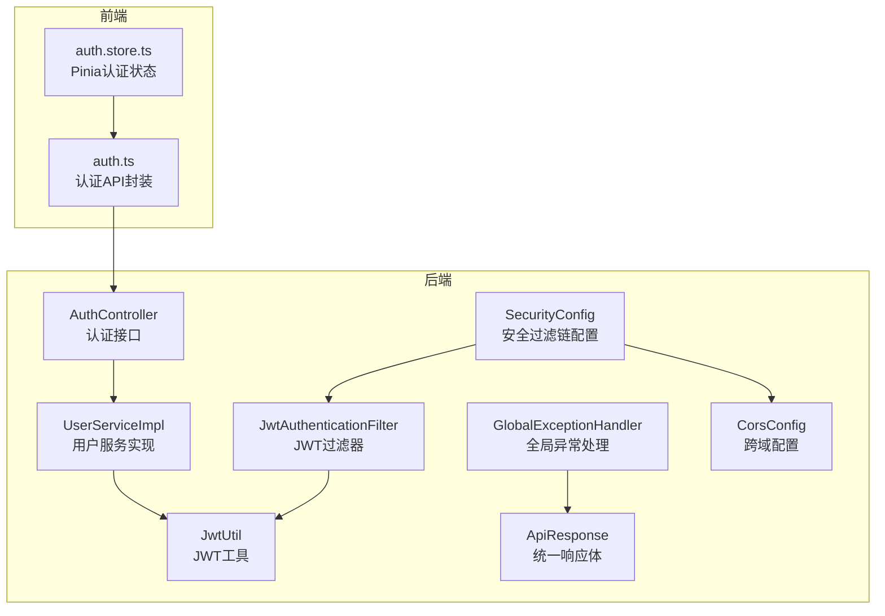
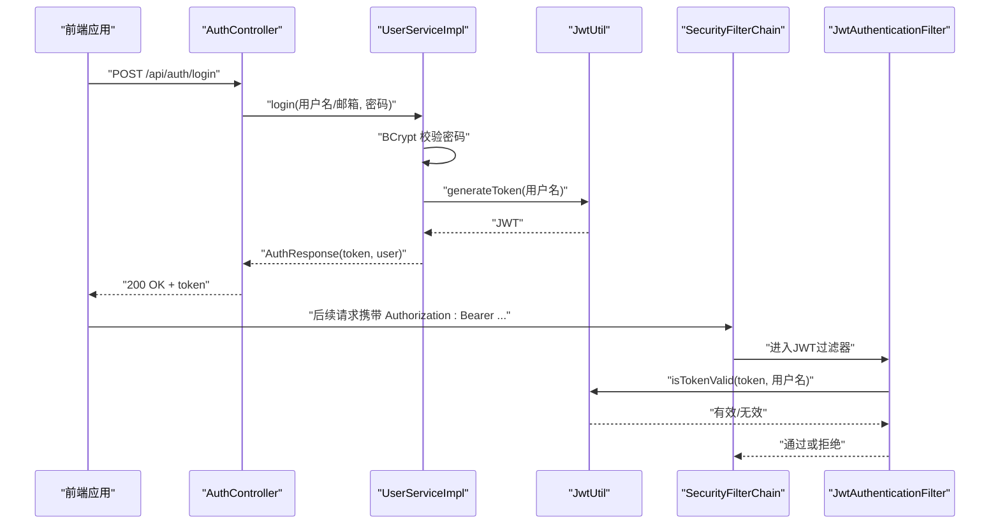
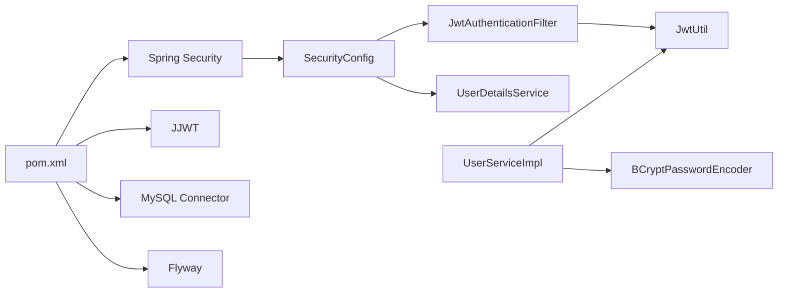
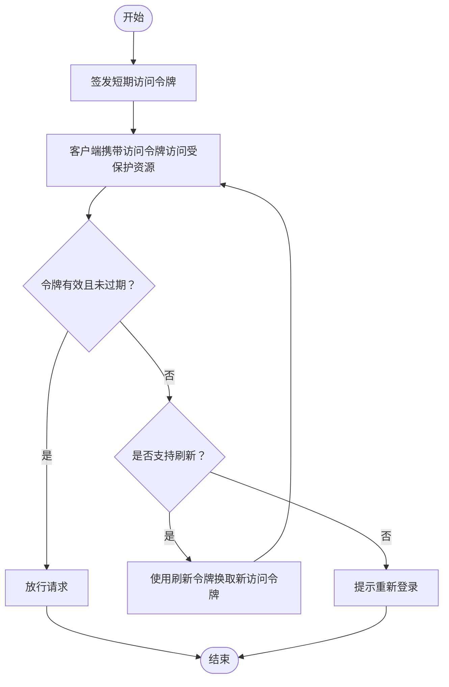

# 安全最佳实践

<cite>
**本文引用的文件**
- [SecurityConfig.java](file://communication-backend/src/main/java/com/communication/config/SecurityConfig.java)
- [JwtAuthenticationFilter.java](file://communication-backend/src/main/java/com/communication/config/JwtAuthenticationFilter.java)
- [JwtUtil.java](file://communication-backend/src/main/java/com/communication/util/JwtUtil.java)
- [AuthController.java](file://communication-backend/src/main/java/com/communication/controller/AuthController.java)
- [UserServiceImpl.java](file://communication-backend/src/main/java/com/communication/service/impl/UserServiceImpl.java)
- [application.yml](file://communication-backend/src/main/resources/application.yml)
- [pom.xml](file://communication-backend/pom.xml)
- [CorsConfig.java](file://communication-backend/src/main/java/com/communication/config/CorsConfig.java)
- [GlobalExceptionHandler.java](file://communication-backend/src/main/java/com/communication/exception/GlobalExceptionHandler.java)
- [auth.ts](file://communication-frontend/src/api/auth.ts)
- [auth.store.ts](file://communication-frontend/src/stores/auth.ts)
- [ApiResponse.java](file://communication-backend/src/main/java/com/communication/dto/ApiResponse.java)
- [LoginRequest.java](file://communication-backend/src/main/java/com/communication/dto/LoginRequest.java)
- [RegisterRequest.java](file://communication-backend/src/main/java/com/communication/dto/RegisterRequest.java)
</cite>

## 目录
1. 引言
2. 项目结构
3. 核心组件
4. 架构总览
5. 详细组件分析
6. 依赖关系分析
7. 性能与监控考量
8. 故障排查指南
9. 结论
10. 附录

## 引言
本指南围绕通信平台后端的安全实现进行系统性梳理，重点覆盖以下方面：
- JWT 安全配置：过期时间、签名密钥管理、刷新策略
- 常见安全漏洞与防护：注入、XSS、CSRF
- 会话与状态管理（STATELESS）优势
- 密码安全存储与验证
- 安全审计与日志记录
- 性能与监控建议
- 第三方安全库集成与安全测试策略

## 项目结构
后端采用 Spring Boot + Spring Security + JJWT 实现无状态认证；前端使用 Pinia 管理本地状态与令牌持久化。

图示来源
- [SecurityConfig.java](file://communication-backend/src/main/java/com/communication/config/SecurityConfig.java#L66-L87)
- [JwtAuthenticationFilter.java](file://communication-backend/src/main/java/com/communication/config/JwtAuthenticationFilter.java#L31-L67)
- [JwtUtil.java](file://communication-backend/src/main/java/com/communication/util/JwtUtil.java#L28-L35)
- [AuthController.java](file://communication-backend/src/main/java/com/communication/controller/AuthController.java#L22-L40)
- [UserServiceImpl.java](file://communication-backend/src/main/java/com/communication/service/impl/UserServiceImpl.java#L30-L62)
- [ApiResponse.java](file://communication-backend/src/main/java/com/communication/dto/ApiResponse.java#L32-L56)
- [GlobalExceptionHandler.java](file://communication-backend/src/main/java/com/communication/exception/GlobalExceptionHandler.java#L18-L54)
- [CorsConfig.java](file://communication-backend/src/main/java/com/communication/config/CorsConfig.java#L15-L27)
- [auth.ts](file://communication-frontend/src/api/auth.ts#L36-L48)
- [auth.store.ts](file://communication-frontend/src/stores/auth.ts#L6-L96)

章节来源
- [SecurityConfig.java](file://communication-backend/src/main/java/com/communication/config/SecurityConfig.java#L1-L89)
- [CorsConfig.java](file://communication-backend/src/main/java/com/communication/config/CorsConfig.java#L1-L29)
- [application.yml](file://communication-backend/src/main/resources/application.yml#L33-L42)

## 核心组件
- 安全过滤链与无状态策略：禁用 CSRF，启用 CORS，设置 SessionCreationPolicy 为 STATELESS，仅对认证相关端点放行。
- JWT 过滤器：从 Authorization 头解析 Bearer Token，校验有效性并写入 SecurityContext。
- JWT 工具：基于对称密钥生成与验证，支持过期时间控制。
- 认证控制器与服务：注册/登录流程中使用 BCrypt 存储密码，返回 JWT。
- 统一响应与异常处理：标准化错误响应，避免信息泄露。
- 前端状态管理：使用 localStorage 持久化 token 与用户信息。

章节来源
- [SecurityConfig.java](file://communication-backend/src/main/java/com/communication/config/SecurityConfig.java#L66-L87)
- [JwtAuthenticationFilter.java](file://communication-backend/src/main/java/com/communication/config/JwtAuthenticationFilter.java#L31-L67)
- [JwtUtil.java](file://communication-backend/src/main/java/com/communication/util/JwtUtil.java#L28-L65)
- [AuthController.java](file://communication-backend/src/main/java/com/communication/controller/AuthController.java#L22-L40)
- [UserServiceImpl.java](file://communication-backend/src/main/java/com/communication/service/impl/UserServiceImpl.java#L30-L62)
- [ApiResponse.java](file://communication-backend/src/main/java/com/communication/dto/ApiResponse.java#L32-L56)
- [GlobalExceptionHandler.java](file://communication-backend/src/main/java/com/communication/exception/GlobalExceptionHandler.java#L18-L54)
- [auth.store.ts](file://communication-frontend/src/stores/auth.ts#L6-L96)

## 架构总览
下图展示认证与授权的关键交互流程。

图示来源
- [AuthController.java](file://communication-backend/src/main/java/com/communication/controller/AuthController.java#L30-L34)
- [UserServiceImpl.java](file://communication-backend/src/main/java/com/communication/service/impl/UserServiceImpl.java#L50-L62)
- [JwtUtil.java](file://communication-backend/src/main/java/com/communication/util/JwtUtil.java#L28-L35)
- [SecurityConfig.java](file://communication-backend/src/main/java/com/communication/config/SecurityConfig.java#L66-L87)
- [JwtAuthenticationFilter.java](file://communication-backend/src/main/java/com/communication/config/JwtAuthenticationFilter.java#L31-L67)

## 详细组件分析

### JWT 安全配置与最佳实践
- 过期时间设置
  - 配置项位于后端配置文件，单位为毫秒，默认 24 小时。
  - 建议：移动端短期令牌（如 15-60 分钟），Web 端可适度延长但需结合刷新策略。
- 签名密钥管理
  - 使用对称密钥（HMAC），密钥来自环境变量，长度至少 256 位。
  - 建议：密钥轮换、KMS 管理、最小权限访问。
- 刷新策略
  - 当前实现未提供刷新端点；建议引入“刷新令牌”（Refresh Token）配合安全存储与黑名单机制，实现更细粒度的生命周期控制。
- 令牌传输与存储
  - 前端使用 localStorage 存储 token，存在 XSS 风险；建议改用 HttpOnly Cookie 或短期内存存储，结合 CSP 降低风险。

章节来源
- [application.yml](file://communication-backend/src/main/resources/application.yml#L33-L42)
- [JwtUtil.java](file://communication-backend/src/main/java/com/communication/util/JwtUtil.java#L17-L26)
- [auth.store.ts](file://communication-frontend/src/stores/auth.ts#L7-L23)

### 会话管理与状态（STATELESS）
- 无状态策略优势
  - 易于水平扩展，无需共享会话存储。
  - 降低会话劫持与固定会话攻击的风险（依赖短期 JWT）。
- 实施要点
  - 所有受保护资源均需携带有效 JWT。
  - 合理设置过期时间，避免长期有效令牌。
  - 对关键操作（如修改密码）增加二次验证或缩短令牌有效期。

章节来源
- [SecurityConfig.java](file://communication-backend/src/main/java/com/communication/config/SecurityConfig.java#L66-L87)

### 密码安全存储与验证
- 存储
  - 使用 BCrypt 对密码进行哈希存储，具备自适应回调机制，抗彩虹表与暴力破解。
- 验证
  - 登录时使用匹配函数进行验证，失败抛出凭证错误。
- 建议
  - 引入密码强度规则与历史密码检查。
  - 账户锁定与速率限制，防止爆破。

章节来源
- [SecurityConfig.java](file://communication-backend/src/main/java/com/communication/config/SecurityConfig.java#L48-L50)
- [UserServiceImpl.java](file://communication-backend/src/main/java/com/communication/service/impl/UserServiceImpl.java#L50-L62)

### 常见安全漏洞与防护

#### 注入攻击（SQL/命令注入）
- 现状
  - 数据访问通过 JPA/Hibernate，使用参数化查询；数据库连接配置在配置文件中。
- 防护建议
  - 严格输入校验与白名单；对上传文件类型与大小进行限制；避免动态拼接 SQL。
  - 文件上传路径与类型已在配置中限制，建议进一步限制上传目录权限与只读策略。

章节来源
- [application.yml](file://communication-backend/src/main/resources/application.yml#L38-L42)
- [UserServiceImpl.java](file://communication-backend/src/main/java/com/communication/service/impl/UserServiceImpl.java#L30-L48)

#### XSS（跨站脚本攻击）
- 现状
  - 前端使用模板渲染，数据通过 API 获取；后端未直接输出用户输入到 HTML。
- 防护建议
  - 前端：对输出内容进行转义；使用 CSP 头限制脚本执行。
  - 后端：对富文本输入进行白名单过滤与标签剥离；对上传内容进行安全扫描。

章节来源
- [auth.store.ts](file://communication-frontend/src/stores/auth.ts#L13-L56)

#### CSRF（跨站请求伪造）
- 现状
  - 安全配置中已禁用 CSRF；同时启用了 CORS。
- 防护建议
  - 若保留无状态 API，继续禁用 CSRF 即可；若引入表单提交场景，应启用 CSRF 保护并使用 SameSite Cookie。
  - CORS 配置允许凭据时，需明确允许源列表，避免通配符带来的风险。

章节来源
- [SecurityConfig.java](file://communication-backend/src/main/java/com/communication/config/SecurityConfig.java#L68-L69)
- [CorsConfig.java](file://communication-backend/src/main/java/com/communication/config/CorsConfig.java#L15-L27)

### 统一响应与异常处理
- 统一响应体包含状态码、消息、数据与时间戳，便于前端与监控系统消费。
- 全局异常处理器对常见异常进行分类处理，避免敏感信息泄露。

章节来源
- [ApiResponse.java](file://communication-backend/src/main/java/com/communication/dto/ApiResponse.java#L32-L56)
- [GlobalExceptionHandler.java](file://communication-backend/src/main/java/com/communication/exception/GlobalExceptionHandler.java#L18-L54)

### 前端安全与状态管理
- 令牌与用户信息存入 localStorage，存在 XSS 风险；建议：
  - 使用 HttpOnly Cookie 存储短期令牌；
  - 在内存中保存令牌，仅在必要时持久化；
  - 设置严格的 CSP 与 SameSite 属性。
- 登录/注册成功后更新本地状态并提示用户。

章节来源
- [auth.ts](file://communication-frontend/src/api/auth.ts#L36-L48)
- [auth.store.ts](file://communication-frontend/src/stores/auth.ts#L13-L56)

## 依赖关系分析
- 安全框架与组件
  - Spring Security 提供认证与授权基础设施；
  - JJWT 用于 JWT 的签发与校验；
  - BCrypt 用于密码编码与匹配；
  - Flyway 与 MySQL 用于数据迁移与持久化。
- 关键耦合点
  - SecurityFilterChain 依赖 JwtAuthenticationFilter；
  - JwtAuthenticationFilter 依赖 JwtUtil 与 UserDetailsService；
  - UserServiceImpl 依赖 JwtUtil 与 PasswordEncoder。

图示来源
- [pom.xml](file://communication-backend/pom.xml#L25-L77)
- [SecurityConfig.java](file://communication-backend/src/main/java/com/communication/config/SecurityConfig.java#L66-L87)
- [JwtAuthenticationFilter.java](file://communication-backend/src/main/java/com/communication/config/JwtAuthenticationFilter.java#L23-L29)
- [JwtUtil.java](file://communication-backend/src/main/java/com/communication/util/JwtUtil.java#L17-L26)
- [UserServiceImpl.java](file://communication-backend/src/main/java/com/communication/service/impl/UserServiceImpl.java#L18-L26)

章节来源
- [pom.xml](file://communication-backend/pom.xml#L25-L77)

## 性能与监控考量
- 性能
  - 无状态设计降低会话同步开销，适合高并发场景。
  - JWT 解析与密钥验证为轻量操作，建议缓存密钥派生结果（由 JJWT 内部处理）。
  - 合理设置令牌过期时间，平衡安全性与重试成本。
- 监控
  - 建议在网关或过滤器层记录认证失败次数、IP 速率、异常堆栈等指标。
  - 对关键操作（注册、登录、修改密码）记录审计日志，包含用户标识、时间、IP、UA、结果。
  - 使用 APM 工具追踪认证链路延迟与错误率。

[本节为通用指导，不直接分析具体文件]

## 故障排查指南
- 认证失败
  - 检查用户名/邮箱与密码是否正确；确认 BCrypt 匹配逻辑。
  - 查看全局异常处理器对凭证错误的统一响应。
- 令牌无效
  - 核对 Authorization 头格式（Bearer）与令牌内容；
  - 检查密钥一致性与过期时间；
  - 确认 SecurityFilterChain 是否正确加载 JwtAuthenticationFilter。
- 前端无法登录
  - 检查本地存储中的 token 与用户信息；
  - 确认 API 返回的响应体结构与字段映射。

章节来源
- [GlobalExceptionHandler.java](file://communication-backend/src/main/java/com/communication/exception/GlobalExceptionHandler.java#L32-L37)
- [JwtAuthenticationFilter.java](file://communication-backend/src/main/java/com/communication/config/JwtAuthenticationFilter.java#L37-L44)
- [JwtUtil.java](file://communication-backend/src/main/java/com/communication/util/JwtUtil.java#L58-L65)
- [auth.store.ts](file://communication-frontend/src/stores/auth.ts#L36-L56)

## 结论
该通信平台后端以 Spring Security + JJWT 实现了无状态认证，配合 BCrypt 密码存储与统一响应/异常处理，满足基础安全需求。为进一步提升安全性与可运维性，建议引入刷新令牌、HttpOnly Cookie、CSP、速率限制与审计日志，并完善安全测试与监控体系。

[本节为总结性内容，不直接分析具体文件]

## 附录

### JWT 生命周期与刷新策略（概念流程）

[本图为概念流程，不对应具体代码文件]

### 第三方安全库与测试策略
- 安全库
  - Spring Security：认证与授权
  - JJWT：JWT 签发与校验
  - Flyway：数据库迁移与基线
- 测试策略
  - 单元测试：覆盖密码编码、JWT 生成与校验、异常分支
  - 集成测试：端到端认证流程、CORS/CSRF 场景
  - 安全测试：OWASP ZAP/Postman 等工具进行注入与会话测试

章节来源
- [pom.xml](file://communication-backend/pom.xml#L25-L77)
- [UserServiceImpl.java](file://communication-backend/src/main/java/com/communication/service/impl/UserServiceImpl.java#L30-L62)
- [JwtUtil.java](file://communication-backend/src/main/java/com/communication/util/JwtUtil.java#L28-L35)