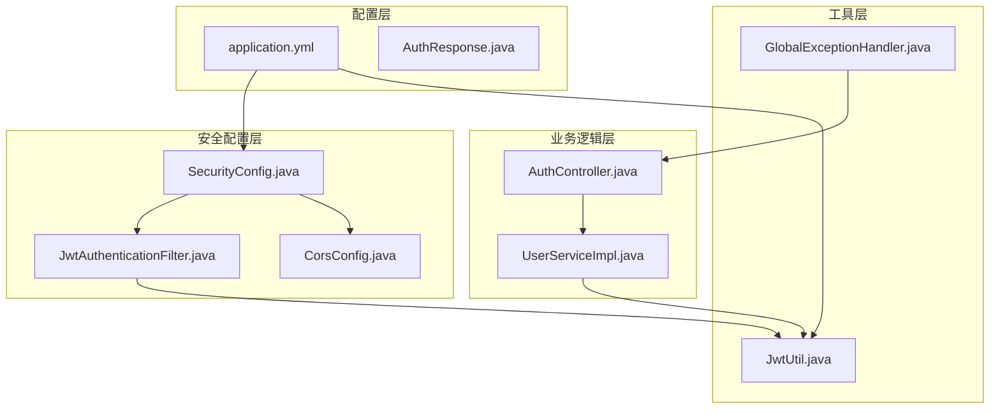
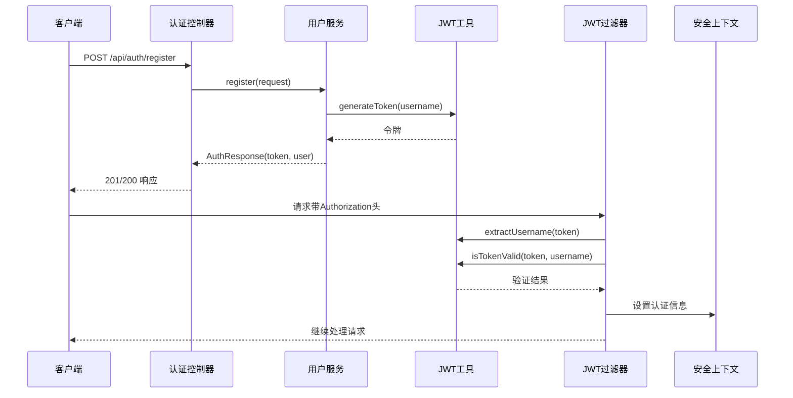
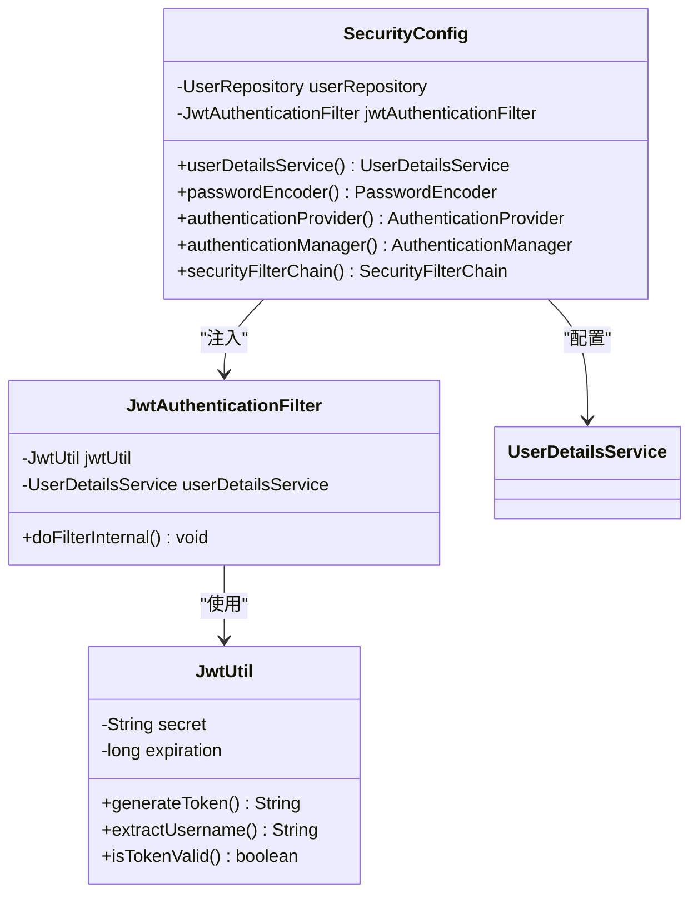
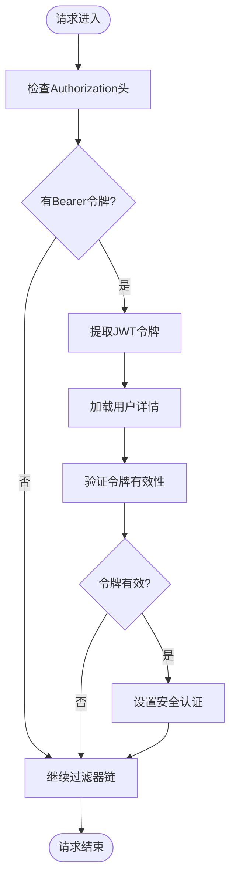
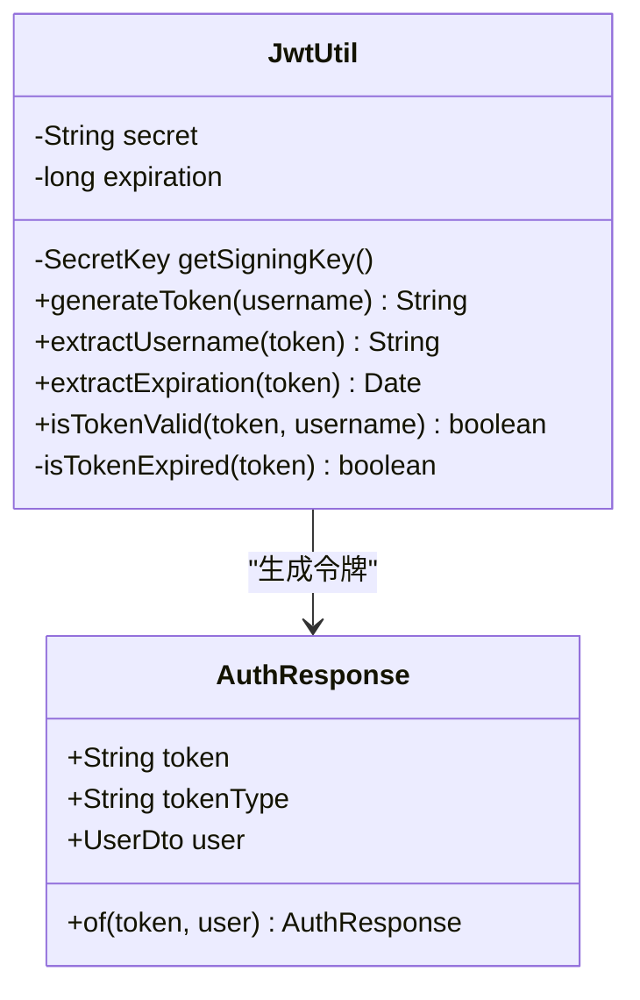
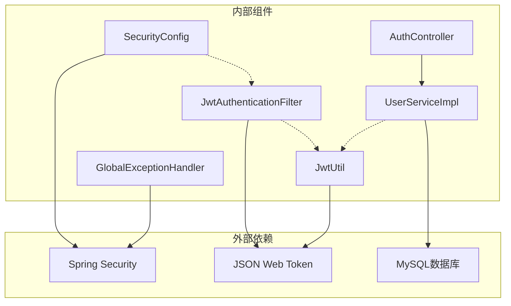
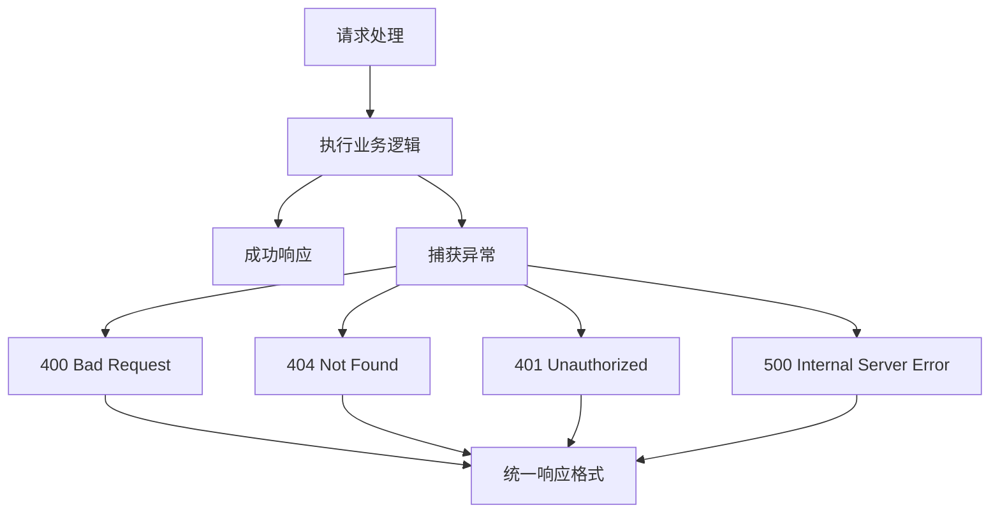

# 安全架构设计

<cite>
**本文档引用的文件**
- [SecurityConfig.java](file://communication-backend/src/main/java/com/communication/config/SecurityConfig.java)
- [JwtAuthenticationFilter.java](file://communication-backend/src/main/java/com/communication/config/JwtAuthenticationFilter.java)
- [JwtUtil.java](file://communication-backend/src/main/java/com/communication/util/JwtUtil.java)
- [AuthController.java](file://communication-backend/src/main/java/com/communication/controller/AuthController.java)
- [UserServiceImpl.java](file://communication-backend/src/main/java/com/communication/service/impl/UserServiceImpl.java)
- [GlobalExceptionHandler.java](file://communication-backend/src/main/java/com/communication/exception/GlobalExceptionHandler.java)
- [CorsConfig.java](file://communication-backend/src/main/java/com/communication/config/CorsConfig.java)
- [application.yml](file://communication-backend/src/main/resources/application.yml)
- [AuthResponse.java](file://communication-backend/src/main/java/com/communication/dto/AuthResponse.java)
- [LoginRequest.java](file://communication-backend/src/main/java/com/communication/dto/LoginRequest.java)
- [RegisterRequest.java](file://communication-backend/src/main/java/com/communication/dto/RegisterRequest.java)
</cite>

## 目录
1. [引言](#引言)
2. [项目结构](#项目结构)
3. [核心组件](#核心组件)
4. [架构概览](#架构概览)
5. [详细组件分析](#详细组件分析)
6. [依赖关系分析](#依赖关系分析)
7. [性能考虑](#性能考虑)
8. [故障排除指南](#故障排除指南)
9. [结论](#结论)

## 引言

本文件为通信平台的安全架构设计文档，专注于Spring Security配置、JWT认证机制、安全过滤器链以及相关的安全最佳实践。该系统采用无状态JWT认证模式，通过自定义过滤器实现令牌验证，并结合Spring Security的配置实现细粒度的访问控制。

## 项目结构

通信平台后端采用标准的Spring Boot项目结构，安全相关的核心文件分布如下：

**图表来源**
- [SecurityConfig.java](file://communication-backend/src/main/java/com/communication/config/SecurityConfig.java#L24-L88)
- [JwtAuthenticationFilter.java](file://communication-backend/src/main/java/com/communication/config/JwtAuthenticationFilter.java#L20-L68)
- [JwtUtil.java](file://communication-backend/src/main/java/com/communication/util/JwtUtil.java#L14-L66)

**章节来源**
- [SecurityConfig.java](file://communication-backend/src/main/java/com/communication/config/SecurityConfig.java#L1-L89)
- [application.yml](file://communication-backend/src/main/resources/application.yml#L1-L42)

## 核心组件

### Spring Security配置设计

系统采用基于Java的Spring Security配置，实现了以下核心安全特性：

#### 安全过滤器链
- **无状态会话管理**：配置为STATELESS，不使用服务器端会话存储
- **自定义JWT过滤器**：在用户名密码过滤器之前执行，优先处理JWT令牌
- **CSRF禁用**：由于是无状态API，禁用CSRF保护
- **CORS配置**：支持前端开发环境的跨域请求

#### HTTP安全配置
- **公共端点**：认证、内容浏览、搜索等公开访问
- **受保护端点**：所有其他API需要认证
- **静态资源**：上传文件目录完全开放

**章节来源**
- [SecurityConfig.java](file://communication-backend/src/main/java/com/communication/config/SecurityConfig.java#L66-L87)

### JWT认证机制

#### JWT生成与验证
- **密钥管理**：从配置文件读取JWT密钥，支持环境变量覆盖
- **过期时间**：默认24小时（86400000毫秒）
- **签名算法**：HMAC-SHA256
- **令牌结构**：包含用户名主体信息

#### 认证流程
1. 用户注册或登录获取JWT令牌
2. 后续请求在Authorization头中携带Bearer令牌
3. 自定义过滤器解析并验证令牌有效性
4. 验证通过后设置安全上下文

**章节来源**
- [JwtUtil.java](file://communication-backend/src/main/java/com/communication/util/JwtUtil.java#L17-L35)
- [application.yml](file://communication-backend/src/main/resources/application.yml#L33-L36)

## 架构概览

**图表来源**
- [AuthController.java](file://communication-backend/src/main/java/com/communication/controller/AuthController.java#L22-L40)
- [UserServiceImpl.java](file://communication-backend/src/main/java/com/communication/service/impl/UserServiceImpl.java#L30-L48)
- [JwtAuthenticationFilter.java](file://communication-backend/src/main/java/com/communication/config/JwtAuthenticationFilter.java#L31-L67)

## 详细组件分析

### SecurityConfig组件分析

SecurityConfig是整个安全体系的核心配置类，负责：

#### 用户详情服务配置
- **数据源**：从UserRepository获取用户信息
- **异常处理**：用户不存在时抛出UsernameNotFoundException
- **权限结构**：当前实现返回空权限列表

#### 认证提供程序
- **DAO认证**：基于数据库的用户名密码认证
- **密码编码器**：使用BCryptPasswordEncoder
- **认证流程**：与UserDetailsService配合工作

#### 过滤器链配置
- **CSRF禁用**：适用于无状态API
- **CORS配置**：支持开发环境跨域
- **会话管理**：STATELESS模式
- **授权规则**：分层访问控制

**图表来源**
- [SecurityConfig.java](file://communication-backend/src/main/java/com/communication/config/SecurityConfig.java#L28-L63)
- [JwtAuthenticationFilter.java](file://communication-backend/src/main/java/com/communication/config/JwtAuthenticationFilter.java#L23-L29)
- [JwtUtil.java](file://communication-backend/src/main/java/com/communication/util/JwtUtil.java#L17-L21)

**章节来源**
- [SecurityConfig.java](file://communication-backend/src/main/java/com/communication/config/SecurityConfig.java#L36-L63)

### JwtAuthenticationFilter组件分析

JwtAuthenticationFilter是JWT认证的核心过滤器，实现以下功能：

#### 请求处理流程
1. **头部检查**：验证Authorization头是否以"Bearer "开头
2. **令牌提取**：从Authorization头中提取JWT令牌
3. **用户加载**：通过UserDetailsService加载用户详情
4. **令牌验证**：使用JwtUtil验证令牌有效性
5. **安全上下文设置**：验证通过后设置认证信息

#### 错误处理机制
- **异常捕获**：过滤器内部捕获所有异常，避免中断请求链
- **优雅降级**：令牌无效时继续执行后续过滤器
- **日志记录**：建议添加适当的日志记录

**图表来源**
- [JwtAuthenticationFilter.java](file://communication-backend/src/main/java/com/communication/config/JwtAuthenticationFilter.java#L31-L67)

**章节来源**
- [JwtAuthenticationFilter.java](file://communication-backend/src/main/java/com/communication/config/JwtAuthenticationFilter.java#L31-L67)

### JwtUtil组件分析

JwtUtil提供JWT令牌的完整生命周期管理：

#### 令牌生成
- **主题设置**：用户名作为JWT主题
- **签发时间**：当前时间戳
- **过期时间**：基于配置的过期时长
- **签名算法**：HMAC-SHA256

#### 令牌解析
- **用户名提取**：从JWT主题字段获取
- **过期时间验证**：检查令牌是否过期
- **完整性验证**：使用密钥验证签名

**图表来源**
- [JwtUtil.java](file://communication-backend/src/main/java/com/communication/util/JwtUtil.java#L15-L66)
- [AuthResponse.java](file://communication-backend/src/main/java/com/communication/dto/AuthResponse.java#L3-L29)

**章节来源**
- [JwtUtil.java](file://communication-backend/src/main/java/com/communication/util/JwtUtil.java#L23-L66)

### 认证控制器分析

AuthController提供完整的认证API接口：

#### 注册流程
1. **输入验证**：使用JSR-303注解进行参数验证
2. **重复检查**：检查用户名和邮箱唯一性
3. **密码加密**：使用BCrypt加密用户密码
4. **令牌生成**：为新用户生成JWT令牌
5. **响应构建**：返回包含令牌和用户信息的响应

#### 登录流程
1. **凭据查找**：支持用户名或邮箱登录
2. **密码验证**：使用BCrypt验证密码
3. **令牌发放**：为认证用户生成JWT令牌
4. **异常处理**：凭据无效时抛出认证异常

**章节来源**
- [AuthController.java](file://communication-backend/src/main/java/com/communication/controller/AuthController.java#L22-L40)
- [UserServiceImpl.java](file://communication-backend/src/main/java/com/communication/service/impl/UserServiceImpl.java#L30-L62)

## 依赖关系分析

**图表来源**
- [SecurityConfig.java](file://communication-backend/src/main/java/com/communication/config/SecurityConfig.java#L1-L25)
- [JwtAuthenticationFilter.java](file://communication-backend/src/main/java/com/communication/config/JwtAuthenticationFilter.java#L1-L16)
- [JwtUtil.java](file://communication-backend/src/main/java/com/communication/util/JwtUtil.java#L1-L12)

### 组件耦合度分析

系统采用松耦合设计：
- **配置层**：SecurityConfig独立于业务逻辑
- **过滤器层**：JwtAuthenticationFilter专注于令牌验证
- **服务层**：UserServiceImpl封装业务逻辑
- **工具层**：JwtUtil提供可重用的JWT功能

## 性能考虑

### JWT认证性能优化

1. **令牌缓存**：可以考虑实现令牌黑名单缓存
2. **异步验证**：对于高并发场景可考虑异步令牌验证
3. **连接池**：确保数据库连接池配置合理
4. **内存管理**：避免在令牌中存储大量用户信息

### 安全配置优化

1. **会话超时**：虽然使用无状态设计，但仍需考虑令牌过期策略
2. **并发控制**：限制同一用户的并发登录数量
3. **速率限制**：对认证端点实施速率限制
4. **监控指标**：添加认证相关的性能监控

## 故障排除指南

### 常见认证问题

#### 令牌验证失败
- **原因**：令牌格式错误或签名验证失败
- **解决方案**：检查Authorization头格式，确认密钥配置正确

#### 用户认证失败
- **原因**：用户名不存在或密码错误
- **解决方案**：验证用户凭据，检查密码编码器配置

#### CORS配置问题
- **原因**：前端域名未在允许列表中
- **解决方案**：更新CORS配置中的允许域名

### 异常处理机制

系统提供了完善的全局异常处理：

**图表来源**
- [GlobalExceptionHandler.java](file://communication-backend/src/main/java/com/communication/exception/GlobalExceptionHandler.java#L18-L61)

**章节来源**
- [GlobalExceptionHandler.java](file://communication-backend/src/main/java/com/communication/exception/GlobalExceptionHandler.java#L15-L62)

## 结论

该通信平台的安全架构采用了现代的无状态JWT认证模式，具有以下特点：

### 安全优势
- **无状态设计**：JWT令牌包含所有必要信息，无需服务器端会话存储
- **细粒度控制**：基于路径的访问控制，精确到API端点级别
- **标准化协议**：使用业界标准的JWT协议
- **异常处理**：完善的错误处理和响应格式化

### 改进建议
1. **CSRF保护**：虽然禁用了CSRF，但需要确保API的无状态特性
2. **令牌刷新**：考虑实现短期访问令牌和长期刷新令牌机制
3. **审计日志**：添加详细的认证和授权审计日志
4. **安全监控**：集成安全事件监控和告警机制

该架构为通信平台提供了坚实的安全基础，能够有效防止常见的Web应用攻击，同时保持了良好的性能和可维护性。