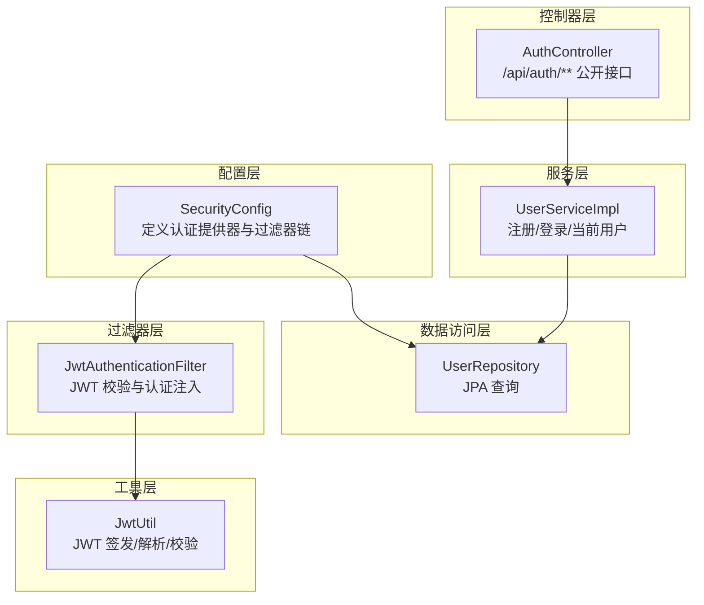
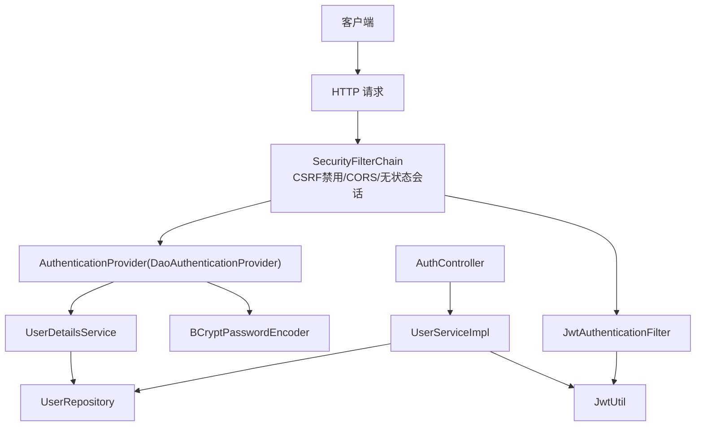
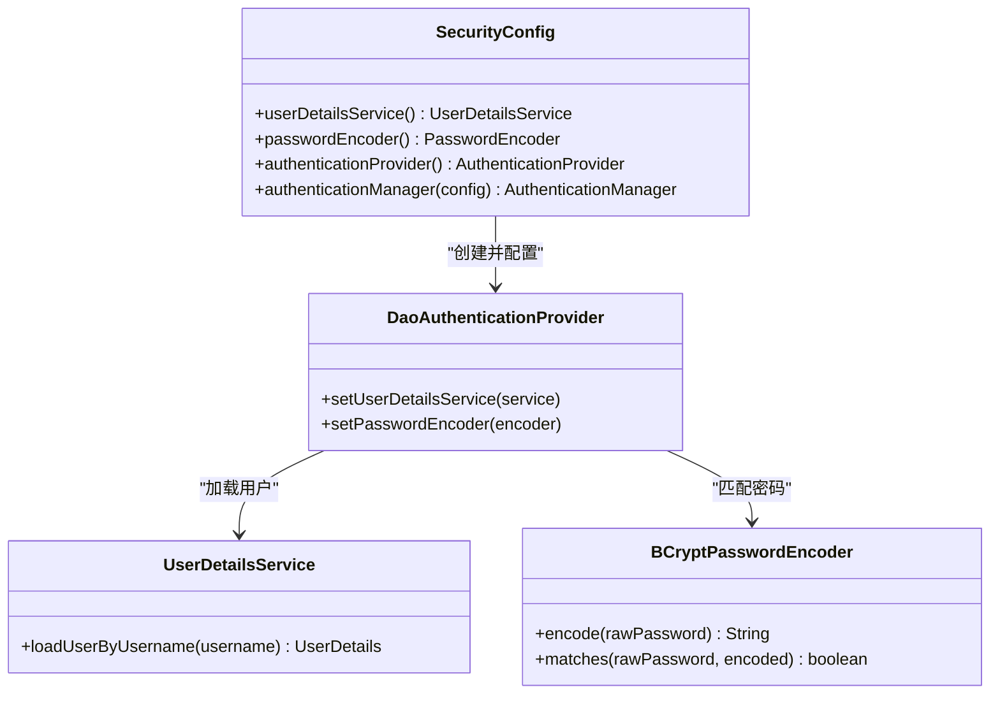
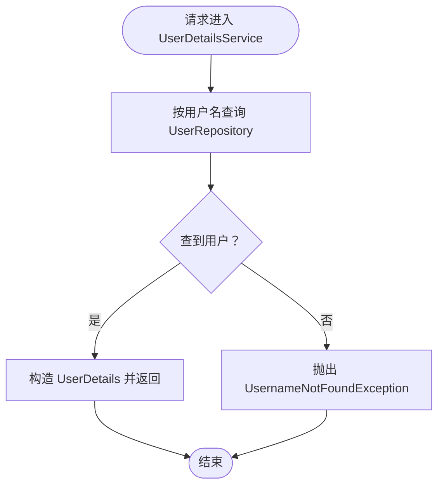
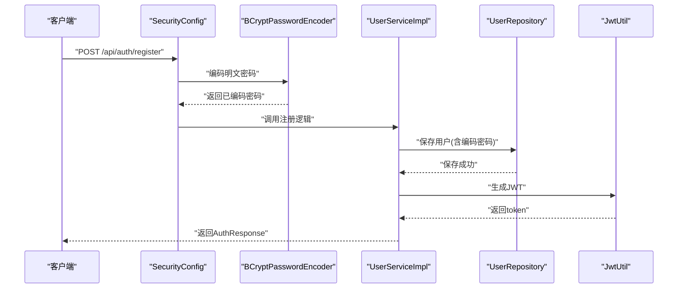
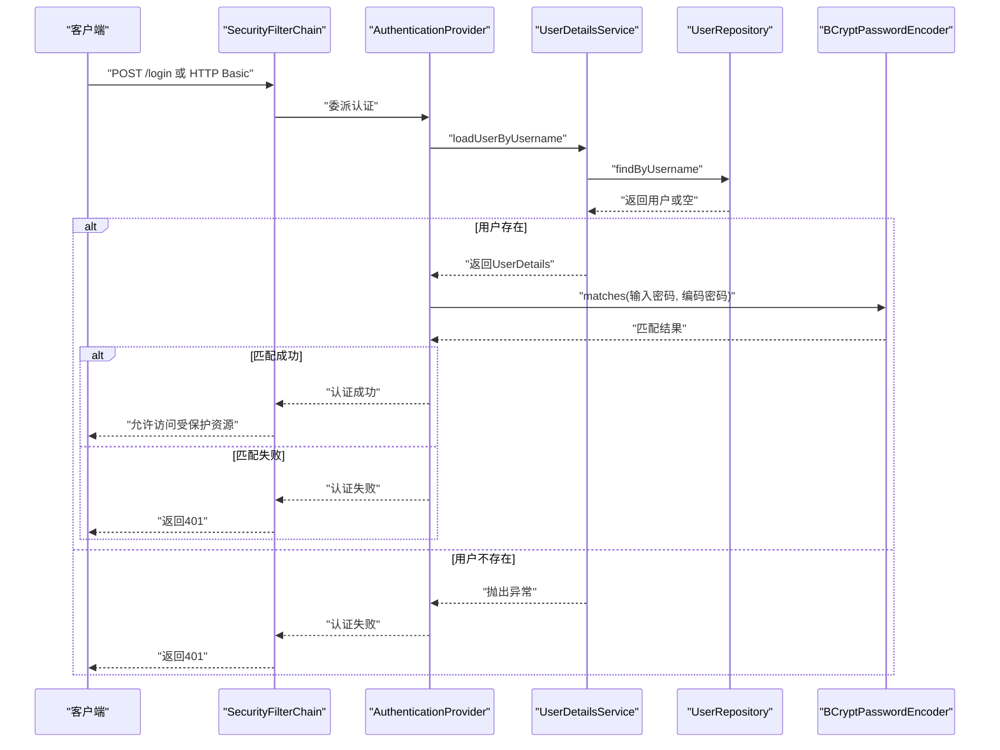
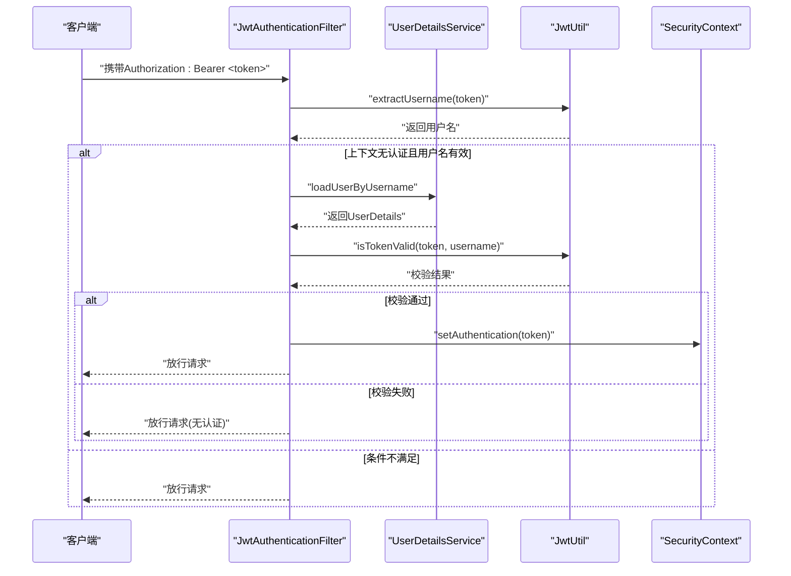
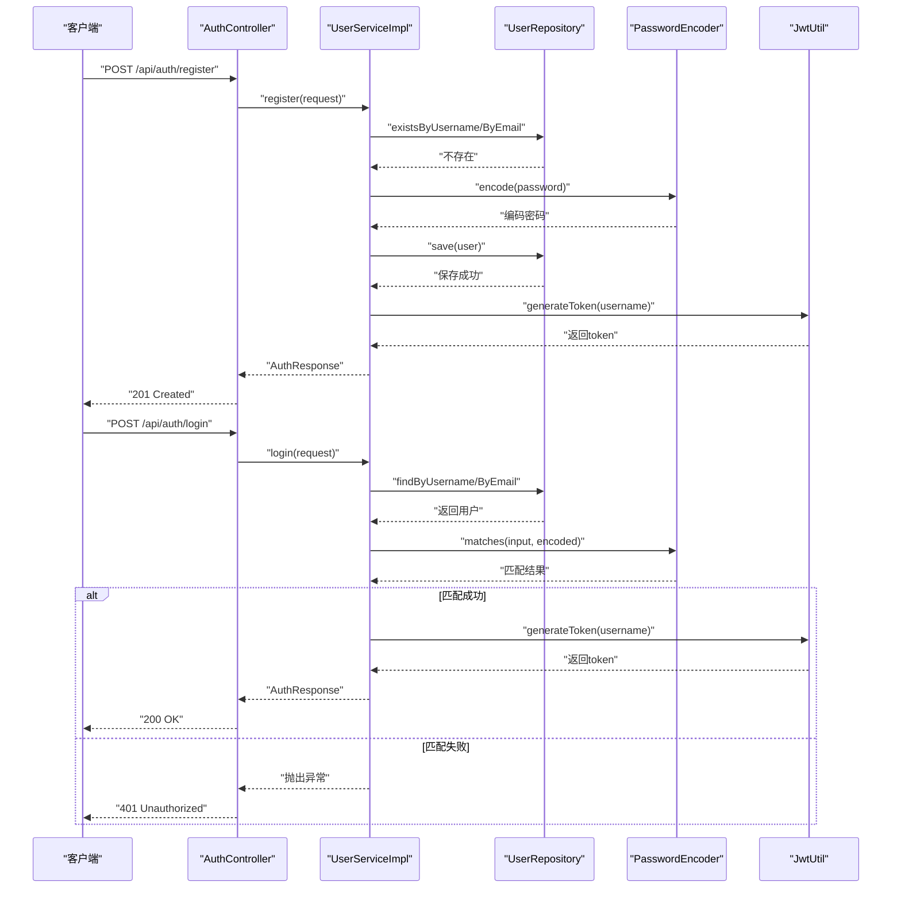
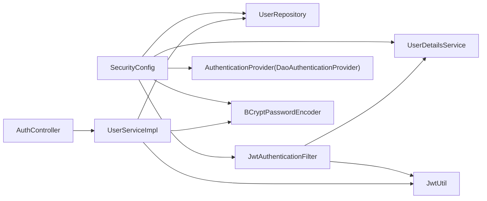

# 认证提供器

<cite>
**本文引用的文件**
- [SecurityConfig.java](file://communication-backend/src/main/java/com/communication/config/SecurityConfig.java)
- [AuthController.java](file://communication-backend/src/main/java/com/communication/controller/AuthController.java)
- [UserRepository.java](file://communication-backend/src/main/java/com/communication/repository/UserRepository.java)
- [UserServiceImpl.java](file://communication-backend/src/main/java/com/communication/service/impl/UserServiceImpl.java)
- [JwtAuthenticationFilter.java](file://communication-backend/src/main/java/com/communication/config/JwtAuthenticationFilter.java)
- [JwtUtil.java](file://communication-backend/src/main/java/com/communication/util/JwtUtil.java)
- [LoginRequest.java](file://communication-backend/src/main/java/com/communication/dto/LoginRequest.java)
- [RegisterRequest.java](file://communication-backend/src/main/java/com/communication/dto/RegisterRequest.java)
- [UserServiceTest.java](file://communication-backend/src/test/java/com/communication/service/UserServiceTest.java)
- [application.yml](file://communication-backend/src/main/resources/application.yml)
- [application-docker.yml](file://communication-backend/src/main/resources/application-docker.yml)
</cite>

## 目录
1. [简介](#简介)
2. [项目结构](#项目结构)
3. [核心组件](#核心组件)
4. [架构总览](#架构总览)
5. [详细组件分析](#详细组件分析)
6. [依赖关系分析](#依赖关系分析)
7. [性能考虑](#性能考虑)
8. [故障排除指南](#故障排除指南)
9. [结论](#结论)

## 简介
本文件围绕认证提供器（Authentication Provider）展开，重点解析以下内容：
- DaoAuthenticationProvider 的配置与使用，以及与 UserDetailsService 的集成方式
- 密码编码器（BCryptPasswordEncoder）的配置与密码加密策略
- 用户详情服务（UserDetailsService）的实现细节，包括从 UserRepository 获取用户信息及用户不存在时的异常处理
- 完整认证流程：从用户名/密码验证到认证成功后的处理
- 认证提供器在 Spring Security 体系中的作用及其与过滤器链、控制器等组件的协作关系
- 认证配置的性能优化建议与安全最佳实践

## 项目结构
后端采用 Spring Boot + Spring Security 架构，认证相关代码集中在配置类、控制器、服务层、数据访问层与工具类中。关键路径如下：
- 配置层：SecurityConfig 负责构建 SecurityFilterChain、注册 AuthenticationProvider、UserDetailsService、PasswordEncoder
- 控制器层：AuthController 提供 /api/auth/** 的公开接口（注册、登录、当前用户）
- 服务层：UserServiceImpl 实现注册与登录逻辑，并与 JWT 工具交互生成令牌
- 数据访问层：UserRepository 提供基于用户名/邮箱的查询能力
- 过滤器层：JwtAuthenticationFilter 在请求进入业务层前进行 JWT 校验并注入认证上下文
- 工具层：JwtUtil 提供 JWT 的签发、解析与校验

图表来源
- [SecurityConfig.java](file://communication-backend/src/main/java/com/communication/config/SecurityConfig.java#L26-L88)
- [AuthController.java](file://communication-backend/src/main/java/com/communication/controller/AuthController.java#L14-L41)
- [UserServiceImpl.java](file://communication-backend/src/main/java/com/communication/service/impl/UserServiceImpl.java#L16-L85)
- [UserRepository.java](file://communication-backend/src/main/java/com/communication/repository/UserRepository.java#L14-L26)
- [JwtAuthenticationFilter.java](file://communication-backend/src/main/java/com/communication/config/JwtAuthenticationFilter.java#L21-L68)
- [JwtUtil.java](file://communication-backend/src/main/java/com/communication/util/JwtUtil.java#L15-L66)

章节来源
- [SecurityConfig.java](file://communication-backend/src/main/java/com/communication/config/SecurityConfig.java#L26-L88)
- [AuthController.java](file://communication-backend/src/main/java/com/communication/controller/AuthController.java#L14-L41)

## 核心组件
- DaoAuthenticationProvider：基于数据库的用户名/密码认证提供器，通过 UserDetailsService 加载用户，用 PasswordEncoder 匹配密码
- UserDetailsService：自定义实现，从 UserRepository 按用户名查找用户，不存在则抛出 UsernameNotFoundException
- BCryptPasswordEncoder：密码编码器，用于注册时加密与登录时匹配
- JwtAuthenticationFilter：拦截请求，解析 Authorization 头中的 Bearer Token，校验有效性后向 SecurityContext 注入认证信息
- JwtUtil：负责 JWT 的签发、提取与校验
- AuthController：对外暴露注册、登录与当前用户接口，内部委托 UserService 完成业务逻辑

章节来源
- [SecurityConfig.java](file://communication-backend/src/main/java/com/communication/config/SecurityConfig.java#L36-L58)
- [JwtAuthenticationFilter.java](file://communication-backend/src/main/java/com/communication/config/JwtAuthenticationFilter.java#L21-L68)
- [JwtUtil.java](file://communication-backend/src/main/java/com/communication/util/JwtUtil.java#L15-L66)
- [AuthController.java](file://communication-backend/src/main/java/com/communication/controller/AuthController.java#L14-L41)

## 架构总览
下图展示认证提供器在 Spring Security 中的角色与各组件协作关系：

图表来源
- [SecurityConfig.java](file://communication-backend/src/main/java/com/communication/config/SecurityConfig.java#L66-L87)
- [SecurityConfig.java](file://communication-backend/src/main/java/com/communication/config/SecurityConfig.java#L52-L58)
- [SecurityConfig.java](file://communication-backend/src/main/java/com/communication/config/SecurityConfig.java#L36-L45)
- [JwtAuthenticationFilter.java](file://communication-backend/src/main/java/com/communication/config/JwtAuthenticationFilter.java#L31-L67)
- [JwtUtil.java](file://communication-backend/src/main/java/com/communication/util/JwtUtil.java#L28-L35)
- [AuthController.java](file://communication-backend/src/main/java/com/communication/controller/AuthController.java#L22-L34)

## 详细组件分析

### DaoAuthenticationProvider 配置与使用
- 在 SecurityConfig 中创建 DaoAuthenticationProvider，设置其使用的 UserDetailsService 与 PasswordEncoder
- 该提供器负责接收来自表单或 HTTP Basic 的用户名/密码，调用 UserDetailsService 加载用户，再用 PasswordEncoder 校验密码
- 当认证成功时，提供器返回包含用户详情与权限的认证对象；失败则抛出异常（由 Spring Security 统一处理）

图表来源
- [SecurityConfig.java](file://communication-backend/src/main/java/com/communication/config/SecurityConfig.java#L52-L58)
- [SecurityConfig.java](file://communication-backend/src/main/java/com/communication/config/SecurityConfig.java#L36-L50)

章节来源
- [SecurityConfig.java](file://communication-backend/src/main/java/com/communication/config/SecurityConfig.java#L52-L58)

### UserDetailsService 实现与异常处理
- 自定义 UserDetailsService 通过 UserRepository.findByUsername 查找用户
- 若用户存在，构造 UserDetails 返回；若不存在，抛出 UsernameNotFoundException
- 该异常会被 Spring Security 捕获并转换为认证失败响应

图表来源
- [SecurityConfig.java](file://communication-backend/src/main/java/com/communication/config/SecurityConfig.java#L36-L45)
- [UserRepository.java](file://communication-backend/src/main/java/com/communication/repository/UserRepository.java#L16)

章节来源
- [SecurityConfig.java](file://communication-backend/src/main/java/com/communication/config/SecurityConfig.java#L36-L45)
- [UserRepository.java](file://communication-backend/src/main/java/com/communication/repository/UserRepository.java#L16)

### 密码编码器（BCryptPasswordEncoder）配置与策略
- 在 SecurityConfig 中注册 BCryptPasswordEncoder Bean
- 注册时对明文密码进行编码存储；登录时使用 matches 进行密码比对
- 登录成功后，服务层使用 JwtUtil 生成 JWT 令牌返回给客户端

图表来源
- [SecurityConfig.java](file://communication-backend/src/main/java/com/communication/config/SecurityConfig.java#L47-L50)
- [UserServiceImpl.java](file://communication-backend/src/main/java/com/communication/service/impl/UserServiceImpl.java#L30-L48)
- [JwtUtil.java](file://communication-backend/src/main/java/com/communication/util/JwtUtil.java#L28-L35)

章节来源
- [SecurityConfig.java](file://communication-backend/src/main/java/com/communication/config/SecurityConfig.java#L47-L50)
- [UserServiceImpl.java](file://communication-backend/src/main/java/com/communication/service/impl/UserServiceImpl.java#L30-L48)

### 认证流程：从用户名/密码到认证成功
- 表单提交用户名/密码，进入 Spring Security 过滤器链
- SecurityConfig 中的 AuthenticationProvider（DaoAuthenticationProvider）接管认证
- UserDetailsService 从数据库加载用户，不存在则抛出异常
- PasswordEncoder 对比输入密码与数据库中编码密码
- 认证成功后，返回包含用户信息的认证对象；失败则抛出异常

图表来源
- [SecurityConfig.java](file://communication-backend/src/main/java/com/communication/config/SecurityConfig.java#L52-L58)
- [SecurityConfig.java](file://communication-backend/src/main/java/com/communication/config/SecurityConfig.java#L36-L45)
- [UserRepository.java](file://communication-backend/src/main/java/com/communication/repository/UserRepository.java#L16)
- [SecurityConfig.java](file://communication-backend/src/main/java/com/communication/config/SecurityConfig.java#L47-L50)

章节来源
- [SecurityConfig.java](file://communication-backend/src/main/java/com/communication/config/SecurityConfig.java#L52-L58)

### JWT 认证注入与后续访问控制
- JwtAuthenticationFilter 在请求到达业务层之前执行
- 从 Authorization 头解析 Bearer Token，使用 JwtUtil 提取用户名并校验有效性
- 若有效且上下文中尚无认证信息，则构造 UsernamePasswordAuthenticationToken 注入 SecurityContext
- 后续业务层可使用 @AuthenticationPrincipal 获取当前用户信息

图表来源
- [JwtAuthenticationFilter.java](file://communication-backend/src/main/java/com/communication/config/JwtAuthenticationFilter.java#L31-L67)
- [JwtUtil.java](file://communication-backend/src/main/java/com/communication/util/JwtUtil.java#L37-L61)
- [SecurityConfig.java](file://communication-backend/src/main/java/com/communication/config/SecurityConfig.java#L65-L84)

章节来源
- [JwtAuthenticationFilter.java](file://communication-backend/src/main/java/com/communication/config/JwtAuthenticationFilter.java#L31-L67)
- [JwtUtil.java](file://communication-backend/src/main/java/com/communication/util/JwtUtil.java#L37-L61)

### 控制器与服务层协作
- AuthController 暴露注册、登录与当前用户接口
- 注册时，服务层先检查用户名/邮箱是否已存在，再对密码进行编码并保存用户，最后生成 JWT
- 登录时，服务层支持用户名或邮箱登录，使用 PasswordEncoder.matches 校验密码，成功后生成 JWT

图表来源
- [AuthController.java](file://communication-backend/src/main/java/com/communication/controller/AuthController.java#L22-L34)
- [UserServiceImpl.java](file://communication-backend/src/main/java/com/communication/service/impl/UserServiceImpl.java#L28-L62)
- [UserRepository.java](file://communication-backend/src/main/java/com/communication/repository/UserRepository.java#L16-L22)
- [LoginRequest.java](file://communication-backend/src/main/java/com/communication/dto/LoginRequest.java#L5-L19)
- [RegisterRequest.java](file://communication-backend/src/main/java/com/communication/dto/RegisterRequest.java#L7-L29)

章节来源
- [AuthController.java](file://communication-backend/src/main/java/com/communication/controller/AuthController.java#L22-L34)
- [UserServiceImpl.java](file://communication-backend/src/main/java/com/communication/service/impl/UserServiceImpl.java#L28-L62)

## 依赖关系分析
- SecurityConfig 依赖 UserRepository、JwtAuthenticationFilter，提供 UserDetailsService、PasswordEncoder、AuthenticationProvider、AuthenticationManager 与 SecurityFilterChain
- JwtAuthenticationFilter 依赖 JwtUtil 与 UserDetailsService，负责在请求进入业务层前完成 JWT 校验与认证注入
- UserServiceImpl 依赖 UserRepository、PasswordEncoder、JwtUtil，实现注册与登录逻辑
- AuthController 依赖 UserService，提供对外接口

图表来源
- [SecurityConfig.java](file://communication-backend/src/main/java/com/communication/config/SecurityConfig.java#L28-L58)
- [JwtAuthenticationFilter.java](file://communication-backend/src/main/java/com/communication/config/JwtAuthenticationFilter.java#L23-L29)
- [UserServiceImpl.java](file://communication-backend/src/main/java/com/communication/service/impl/UserServiceImpl.java#L18-L26)
- [AuthController.java](file://communication-backend/src/main/java/com/communication/controller/AuthController.java#L16-L20)

章节来源
- [SecurityConfig.java](file://communication-backend/src/main/java/com/communication/config/SecurityConfig.java#L28-L58)

## 性能考虑
- 密码编码成本：BCrypt 默认迭代次数较高，建议在生产环境保持默认值以确保安全性；如需优化，可在系统负载评估后调整，但应避免过度降低迭代次数
- 数据库查询：UserDetailsService 使用 findByUsername，建议在 username 字段建立唯一索引以提升查询性能
- 连接池与事务：生产环境建议使用连接池参数（如最大连接数、最小空闲、连接超时）进行调优，避免高并发下的连接争用
- JWT 解析：JwtUtil 使用 HMAC 校验，计算量较小；建议将密钥长度足够长（至少 256 位），并避免在日志中输出密钥
- 过滤器链：SecurityFilterChain 已禁用 CSRF、启用 CORS、设置无状态会话，有助于减少不必要的开销

章节来源
- [application.yml](file://communication-backend/src/main/resources/application.yml#L34-L36)
- [application-docker.yml](file://communication-backend/src/main/resources/application-docker.yml#L8-L11)

## 故障排除指南
- 用户名不存在：UserDetailsService 抛出 UsernameNotFoundException，导致认证失败
- 密码错误：UserServiceImpl 使用 PasswordEncoder.matches 校验失败，抛出 BadCredentialsException
- JWT 无效：JwtAuthenticationFilter 捕获异常并忽略认证，请求继续放行
- 登录接口返回 401：检查用户名/邮箱是否正确、密码是否匹配、JWT 是否过期或被篡改
- 注册接口返回 400：检查用户名/邮箱是否已存在，或请求体字段是否符合校验规则

章节来源
- [SecurityConfig.java](file://communication-backend/src/main/java/com/communication/config/SecurityConfig.java#L36-L45)
- [UserServiceImpl.java](file://communication-backend/src/main/java/com/communication/service/impl/UserServiceImpl.java#L50-L62)
- [JwtAuthenticationFilter.java](file://communication-backend/src/main/java/com/communication/config/JwtAuthenticationFilter.java#L62-L64)
- [UserServiceTest.java](file://communication-backend/src/test/java/com/communication/service/UserServiceTest.java#L140-L157)

## 结论
本项目通过 DaoAuthenticationProvider 与 UserDetailsService 的组合实现了基于数据库的用户名/密码认证，并结合 BCryptPasswordEncoder 确保密码安全存储。JwtAuthenticationFilter 与 JwtUtil 协作，在请求进入业务层前完成 JWT 校验与认证注入，形成完整的认证与授权闭环。整体设计遵循 Spring Security 最佳实践，具备良好的扩展性与安全性。建议在生产环境中强化密钥管理、数据库索引与连接池配置，并持续监控认证性能指标。