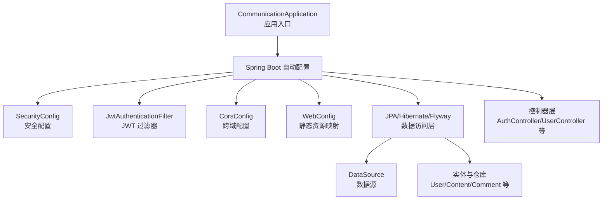
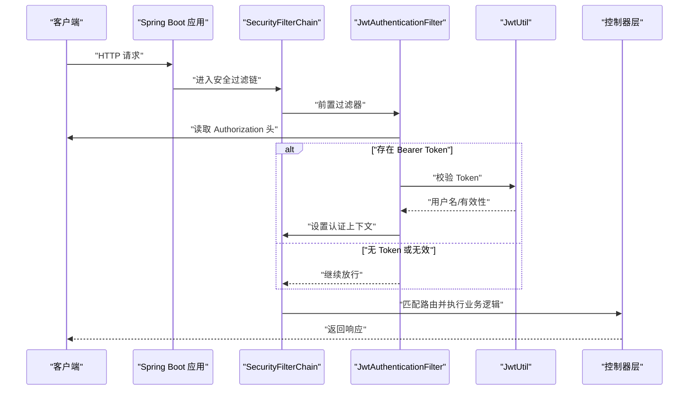
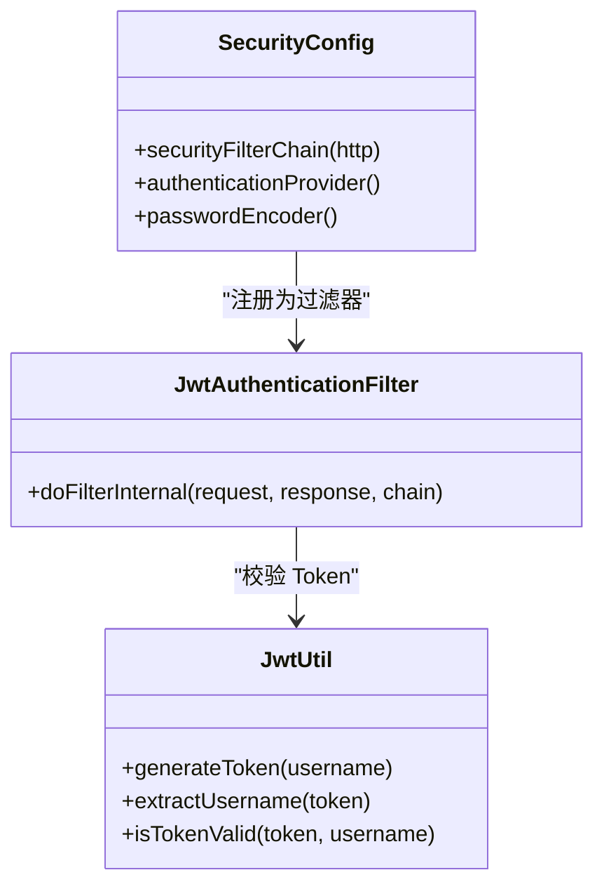
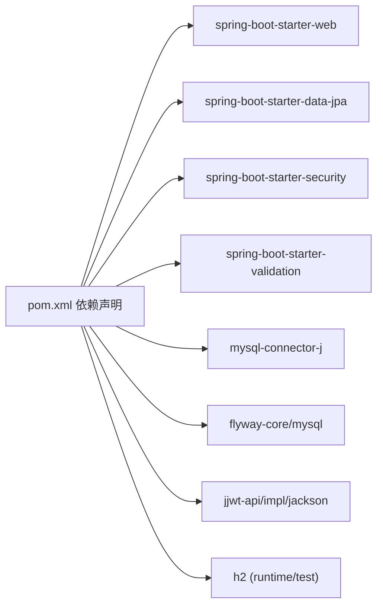

# 应用启动与配置

<cite>
**本文引用的文件**
- [CommunicationApplication.java](file://communication-backend/src/main/java/com/communication/CommunicationApplication.java)
- [application.yml](file://communication-backend/src/main/resources/application.yml)
- [application-docker.yml](file://communication-backend/src/main/resources/application-docker.yml)
- [application-h2.yml](file://communication-backend/src/main/resources/application-h2.yml)
- [application-test.yml](file://communication-backend/src/test/resources/application-test.yml)
- [pom.xml](file://communication-backend/pom.xml)
- [Dockerfile](file://communication-backend/Dockerfile)
- [docker-compose.yml](file://docker-compose.yml)
- [SecurityConfig.java](file://communication-backend/src/main/java/com/communication/config/SecurityConfig.java)
- [JwtAuthenticationFilter.java](file://communication-backend/src/main/java/com/communication/config/JwtAuthenticationFilter.java)
- [JwtUtil.java](file://communication-backend/src/main/java/com/communication/util/JwtUtil.java)
- [CorsConfig.java](file://communication-backend/src/main/java/com/communication/config/CorsConfig.java)
- [WebConfig.java](file://communication-backend/src/main/java/com/communication/config/WebConfig.java)
- [AuthController.java](file://communication-backend/src/main/java/com/communication/controller/AuthController.java)
- [UserController.java](file://communication-backend/src/main/java/com/communication/controller/UserController.java)
</cite>

## 目录
1. [简介](#简介)
2. [项目结构](#项目结构)
3. [核心组件](#核心组件)
4. [架构总览](#架构总览)
5. [详细组件分析](#详细组件分析)
6. [依赖分析](#依赖分析)
7. [性能考虑](#性能考虑)
8. [故障排查指南](#故障排查指南)
9. [结论](#结论)
10. [附录](#附录)

## 简介
本文件面向通信平台后端应用的启动与配置，系统性阐述 Spring Boot 启动流程（含 @SpringBootApplication 注解、自动配置与组件扫描）、多环境配置文件（application.yml、application-docker.yml、application-h2.yml）及环境变量管理策略，并结合安全过滤链、JWT 鉴权与文件上传配置，给出启动日志分析与常见问题排查建议。

## 项目结构
后端采用标准 Spring Boot 结构，核心入口类位于 com.communication 包下，资源文件集中于 resources 目录，按环境拆分配置文件；Dockerfile 和 docker-compose.yml 提供容器化部署支持。

图表来源
- [CommunicationApplication.java](file://communication-backend/src/main/java/com/communication/CommunicationApplication.java#L1-L13)
- [SecurityConfig.java](file://communication-backend/src/main/java/com/communication/config/SecurityConfig.java#L1-L89)
- [JwtAuthenticationFilter.java](file://communication-backend/src/main/java/com/communication/config/JwtAuthenticationFilter.java#L1-L68)
- [CorsConfig.java](file://communication-backend/src/main/java/com/communication/config/CorsConfig.java#L1-L29)
- [WebConfig.java](file://communication-backend/src/main/java/com/communication/config/WebConfig.java#L1-L20)

章节来源
- [CommunicationApplication.java](file://communication-backend/src/main/java/com/communication/CommunicationApplication.java#L1-L13)
- [application.yml](file://communication-backend/src/main/resources/application.yml#L1-L42)
- [application-docker.yml](file://communication-backend/src/main/resources/application-docker.yml#L1-L43)
- [application-h2.yml](file://communication-backend/src/main/resources/application-h2.yml#L1-L42)
- [docker-compose.yml](file://docker-compose.yml#L1-L60)
- [Dockerfile](file://communication-backend/Dockerfile#L1-L32)

## 核心组件
- 应用入口与启动
  - @SpringBootApplication 聚合了组件扫描、自动配置与条件判断，确保在运行时加载所有必要的配置与 Bean。
  - 入口类通过 SpringApplication.run 启动内嵌 Web 容器，默认监听端口由 server.port 指定。
- 安全与认证
  - SecurityConfig 基于状态无关的会话策略，开放部分公开接口，其余请求需认证。
  - JwtAuthenticationFilter 从 Authorization 请求头解析 Bearer Token，调用 JwtUtil 校验并注入认证上下文。
  - JwtUtil 使用对称密钥（基于配置项 jwt.secret）生成与验证签名。
- 文件上传与静态资源
  - WebConfig 将 /uploads/** 映射到本地磁盘路径（由 upload.path 指定），实现静态资源访问。
- 数据访问与迁移
  - JPA/Hibernate 与 Flyway 配置用于实体校验与数据库版本迁移，支持 MySQL 与 H2 内存库两种模式。

章节来源
- [CommunicationApplication.java](file://communication-backend/src/main/java/com/communication/CommunicationApplication.java#L1-L13)
- [SecurityConfig.java](file://communication-backend/src/main/java/com/communication/config/SecurityConfig.java#L1-L89)
- [JwtAuthenticationFilter.java](file://communication-backend/src/main/java/com/communication/config/JwtAuthenticationFilter.java#L1-L68)
- [JwtUtil.java](file://communication-backend/src/main/java/com/communication/util/JwtUtil.java#L1-L67)
- [WebConfig.java](file://communication-backend/src/main/java/com/communication/config/WebConfig.java#L1-L20)
- [application.yml](file://communication-backend/src/main/resources/application.yml#L1-L42)
- [application-h2.yml](file://communication-backend/src/main/resources/application-h2.yml#L1-L42)

## 架构总览
下图展示应用启动与请求处理的关键交互：Spring Boot 启动、加载配置、构建安全过滤链、处理业务请求并返回响应。

图表来源
- [SecurityConfig.java](file://communication-backend/src/main/java/com/communication/config/SecurityConfig.java#L66-L87)
- [JwtAuthenticationFilter.java](file://communication-backend/src/main/java/com/communication/config/JwtAuthenticationFilter.java#L30-L66)
- [JwtUtil.java](file://communication-backend/src/main/java/com/communication/util/JwtUtil.java#L23-L65)
- [AuthController.java](file://communication-backend/src/main/java/com/communication/controller/AuthController.java#L1-L42)
- [UserController.java](file://communication-backend/src/main/java/com/communication/controller/UserController.java#L1-L26)

## 详细组件分析

### 启动流程与自动配置
- @SpringBootApplication 的作用
  - 组件扫描：默认扫描入口类所在包及其子包，注册控制器、服务、配置类等 Bean。
  - 自动配置：根据类路径与配置项启用 Web、JPA、Security、Validation 等自动配置。
  - 条件判断：依据 profile 与外部配置决定是否加载特定 Bean。
- 控制器与安全链路
  - 控制器层通过 @RestController 与 @RequestMapping 提供 REST 接口。
  - SecurityFilterChain 在请求到达控制器前进行 CSRF 关闭、跨域配置、无状态会话与鉴权规则判定。

章节来源
- [CommunicationApplication.java](file://communication-backend/src/main/java/com/communication/CommunicationApplication.java#L1-L13)
- [SecurityConfig.java](file://communication-backend/src/main/java/com/communication/config/SecurityConfig.java#L24-L89)
- [AuthController.java](file://communication-backend/src/main/java/com/communication/controller/AuthController.java#L1-L42)
- [UserController.java](file://communication-backend/src/main/java/com/communication/controller/UserController.java#L1-L26)

### 配置文件与环境差异
- application.yml（开发默认）
  - 数据源：本地 MySQL，凭据来自环境变量（未设置则回退默认值）。
  - JPA：校验模式、方言与 SQL 格式化。
  - Flyway：启用迁移，定位 classpath:db/migration。
  - 服务器端口：8080。
  - JWT：密钥与过期时间来自环境变量。
  - 上传：本地目录与允许类型。
- application-docker.yml（容器化）
  - 数据源：指向 mysql 服务，连接池参数优化。
  - JPA：关闭 SQL 输出，DDL 由 Flyway 控制。
  - JWT/上传：使用容器内路径与环境变量。
  - 日志：统一 INFO 级别。
- application-h2.yml（内存测试）
  - 数据源：H2 内存库，开启控制台。
  - JPA：建表/删表模式，SQL 输出开启。
  - Flyway：禁用。
  - 日志：调试级别提升。
- application-test.yml（测试专用）
  - 数据源：H2 内存库，测试数据库 URL。
  - JWT：测试密钥。
  - Flyway：禁用。

章节来源
- [application.yml](file://communication-backend/src/main/resources/application.yml#L1-L42)
- [application-docker.yml](file://communication-backend/src/main/resources/application-docker.yml#L1-L43)
- [application-h2.yml](file://communication-backend/src/main/resources/application-h2.yml#L1-L42)
- [application-test.yml](file://communication-backend/src/test/resources/application-test.yml#L1-L19)

### 安全与认证组件
- JwtAuthenticationFilter
  - 从请求头提取 Bearer Token，调用 JwtUtil 解析用户名并校验有效性。
  - 若有效且当前上下文未认证，则注入 UsernamePasswordAuthenticationToken。
- JwtUtil
  - 从配置项读取 jwt.secret 与 jwt.expiration，使用 HMAC 签名生成与验证 Token。
- SecurityConfig
  - 禁用 CSRF，启用 CORS，无状态会话。
  - 公开端点白名单（如登录、内容查询、搜索、订阅统计、上传资源）。
  - 其余请求必须认证，使用自定义认证提供者与密码编码器。

图表来源
- [JwtAuthenticationFilter.java](file://communication-backend/src/main/java/com/communication/config/JwtAuthenticationFilter.java#L1-L68)
- [JwtUtil.java](file://communication-backend/src/main/java/com/communication/util/JwtUtil.java#L1-L67)
- [SecurityConfig.java](file://communication-backend/src/main/java/com/communication/config/SecurityConfig.java#L1-L89)

章节来源
- [JwtAuthenticationFilter.java](file://communication-backend/src/main/java/com/communication/config/JwtAuthenticationFilter.java#L1-L68)
- [JwtUtil.java](file://communication-backend/src/main/java/com/communication/util/JwtUtil.java#L1-L67)
- [SecurityConfig.java](file://communication-backend/src/main/java/com/communication/config/SecurityConfig.java#L1-L89)

### 文件上传与静态资源
- WebConfig
  - 将 /uploads/** 映射到 upload.path 指定的本地目录，实现静态资源访问。
- application.yml 与 application-docker.yml
  - 开发默认使用本地 ./uploads，容器化使用 /app/uploads 并在镜像中预创建目录。
- 上传大小限制
  - multipart.max-file-size 与 max-request-size 在各环境配置中有所差异，需按场景调整。

章节来源
- [WebConfig.java](file://communication-backend/src/main/java/com/communication/config/WebConfig.java#L1-L20)
- [application.yml](file://communication-backend/src/main/resources/application.yml#L25-L41)
- [application-docker.yml](file://communication-backend/src/main/resources/application-docker.yml#L27-L37)

### 数据库与迁移
- 数据源与驱动
  - application.yml 使用 MySQL Connector，application-h2.yml 使用 H2。
- JPA/Hibernate
  - 方言、SQL 输出、DDL 策略在不同环境有差异。
- Flyway
  - 默认启用，迁移脚本位于 classpath:db/migration；H2 环境禁用以避免冲突。

章节来源
- [application.yml](file://communication-backend/src/main/resources/application.yml#L5-L23)
- [application-h2.yml](file://communication-backend/src/main/resources/application-h2.yml#L1-L23)
- [pom.xml](file://communication-backend/pom.xml#L44-L57)

### 容器化与环境变量
- Dockerfile
  - 多阶段构建：先下载依赖与编译，再复制可执行 JAR 到运行时镜像。
  - 预创建 /app/uploads 目录，暴露 8080 端口。
- docker-compose.yml
  - 启动 mysql、backend、frontend 三个服务，backend 设置 SPRING_PROFILES_ACTIVE=docker。
  - 通过环境变量传递数据库连接、JWT 密钥与上传路径。
- 环境变量优先级
  - application.yml 中的 ${VAR:default} 语法表示：若未设置 VAR 则使用 default。
  - docker-compose.yml 的 environment 字段覆盖默认值，适合生产或容器化环境。

章节来源
- [Dockerfile](file://communication-backend/Dockerfile#L1-L32)
- [docker-compose.yml](file://docker-compose.yml#L25-L45)
- [application.yml](file://communication-backend/src/main/resources/application.yml#L6-L8)
- [application-docker.yml](file://communication-backend/src/main/resources/application-docker.yml#L4-L6)

## 依赖分析
- Maven 依赖
  - Web、JPA、Security、Validation、MySQL Connector、Flyway、JWT（jjwt）与 H2 测试库。
- 运行时插件
  - spring-boot-maven-plugin 用于打包可执行 JAR。

图表来源
- [pom.xml](file://communication-backend/pom.xml#L25-L94)

章节来源
- [pom.xml](file://communication-backend/pom.xml#L1-L114)

## 性能考虑
- 连接池与超时
  - 容器化环境提供最大连接数、最小空闲与连接超时配置，建议根据并发与数据库性能调优。
- SQL 输出与日志
  - 生产环境建议关闭 show-sql 与 Hibernate SQL 日志，降低开销。
- 上传大小与并发
  - 合理设置 multipart 限制，避免单请求过大导致内存压力。
- JWT 过期时间
  - 适当缩短过期时间可减少无效 Token 占用，同时平衡用户体验。

章节来源
- [application-docker.yml](file://communication-backend/src/main/resources/application-docker.yml#L8-L11)
- [application.yml](file://communication-backend/src/main/resources/application.yml#L11-L18)
- [application-h2.yml](file://communication-backend/src/main/resources/application-h2.yml#L13-L20)

## 故障排查指南
- 启动失败（无法连接数据库）
  - 检查 application.yml 中的数据库 URL、用户名与密码（支持环境变量覆盖）。
  - 容器化环境确认 docker-compose 中的环境变量已正确注入。
- JWT 校验失败
  - 确认前端携带的 Authorization 头格式为 Bearer <token>。
  - 核对 jwt.secret 是否一致，过期时间是否合理。
- 上传资源 404
  - 确认 upload.path 指向的目录存在且权限可读。
  - 容器化环境需挂载卷或预创建 /app/uploads。
- CORS 跨域问题
  - 检查 CorsConfig 中允许的源、方法与头部是否满足前端需求。
- 控制台与日志
  - H2 环境可通过 /h2-console 访问数据库控制台；生产环境建议开启 INFO 级别日志。

章节来源
- [application.yml](file://communication-backend/src/main/resources/application.yml#L5-L41)
- [application-docker.yml](file://communication-backend/src/main/resources/application-docker.yml#L39-L42)
- [application-h2.yml](file://communication-backend/src/main/resources/application-h2.yml#L8-L11)
- [docker-compose.yml](file://docker-compose.yml#L31-L44)
- [CorsConfig.java](file://communication-backend/src/main/java/com/communication/config/CorsConfig.java#L15-L27)
- [WebConfig.java](file://communication-backend/src/main/java/com/communication/config/WebConfig.java#L14-L18)

## 结论
本项目通过 @SpringBootApplication 快速装配 Web、JPA、Security 与 Validation 等能力，配合多环境配置文件与容器化部署，实现了灵活的开发、测试与生产运行模式。建议在生产环境中严格管理环境变量与密钥，合理设置连接池与日志级别，并持续完善监控与可观测性。

## 附录

### 配置项一览与最佳实践
- 数据库连接
  - 使用环境变量覆盖敏感信息；容器化环境通过 docker-compose 注入。
  - 建议在生产环境启用连接池参数与只读副本策略。
- 服务器端口
  - 默认 8080，容器化时与 Dockerfile EXPOSE 保持一致。
- JWT 密钥与过期
  - 使用足够长度的随机密钥；过期时间按业务风险调整。
  - 不同环境使用独立密钥，避免交叉污染。
- 上传路径与类型
  - 本地开发与容器化分别设置路径；限制允许类型并校验文件大小。
- 日志级别
  - 开发/测试使用 DEBUG/INFO；生产使用 INFO 并避免泄露敏感信息。

章节来源
- [application.yml](file://communication-backend/src/main/resources/application.yml#L5-L41)
- [application-docker.yml](file://communication-backend/src/main/resources/application-docker.yml#L32-L42)
- [application-h2.yml](file://communication-backend/src/main/resources/application-h2.yml#L30-L41)
- [docker-compose.yml](file://docker-compose.yml#L31-L37)