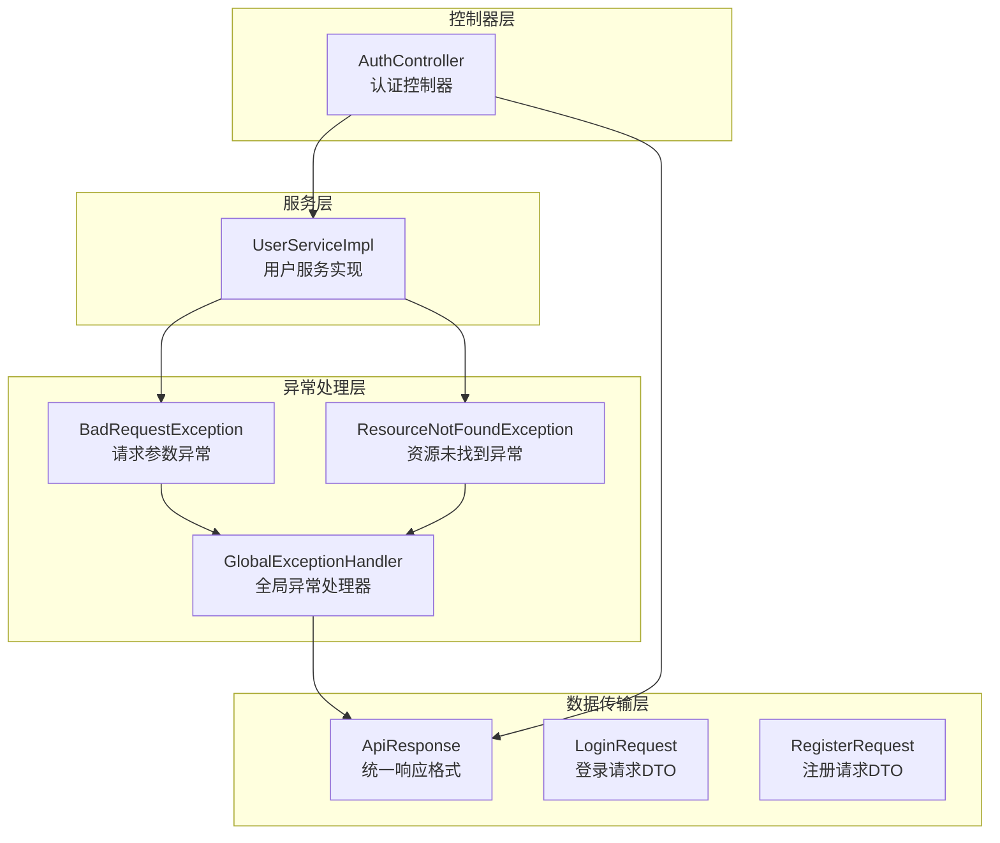
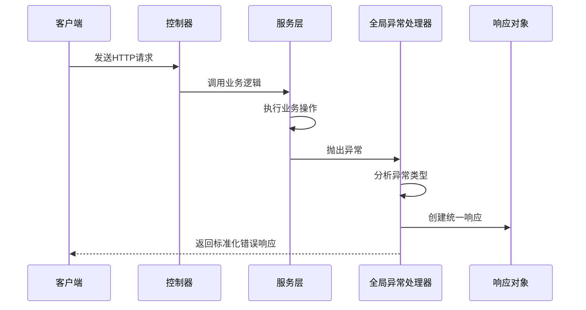
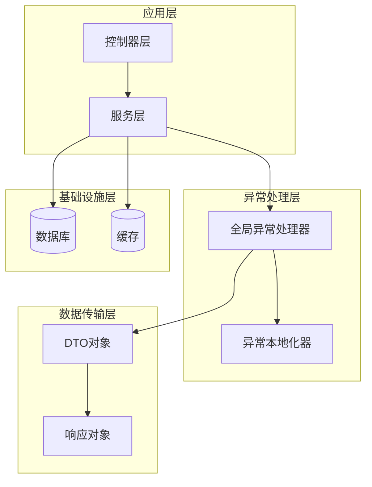
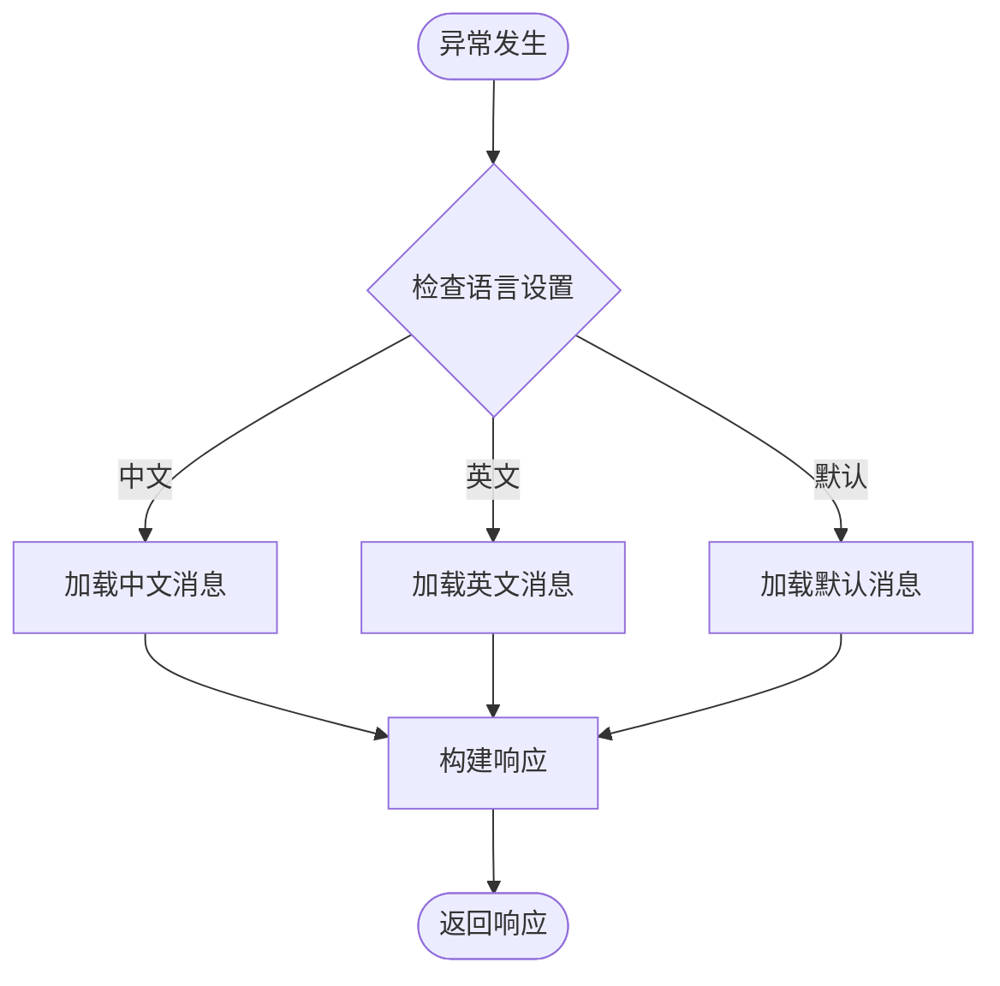
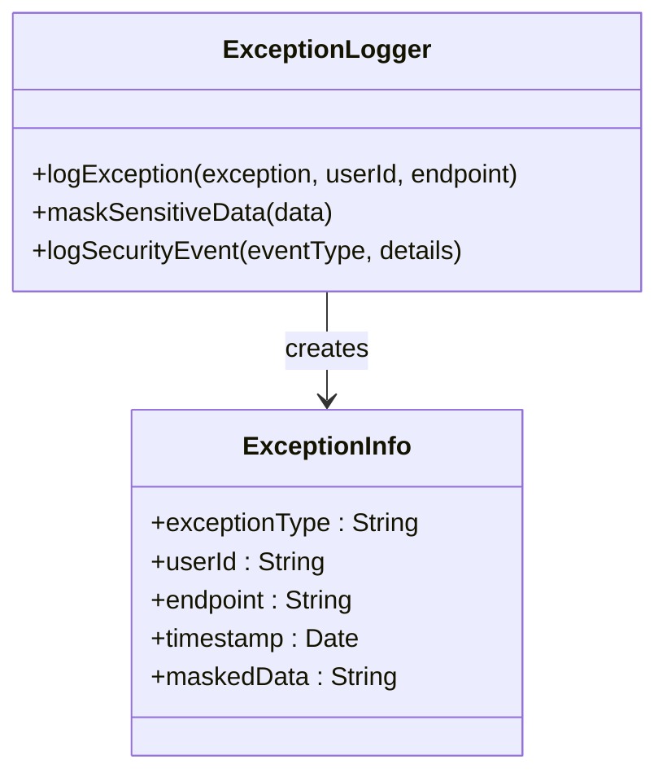
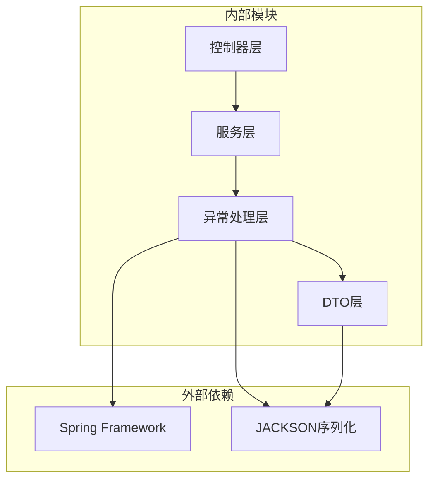
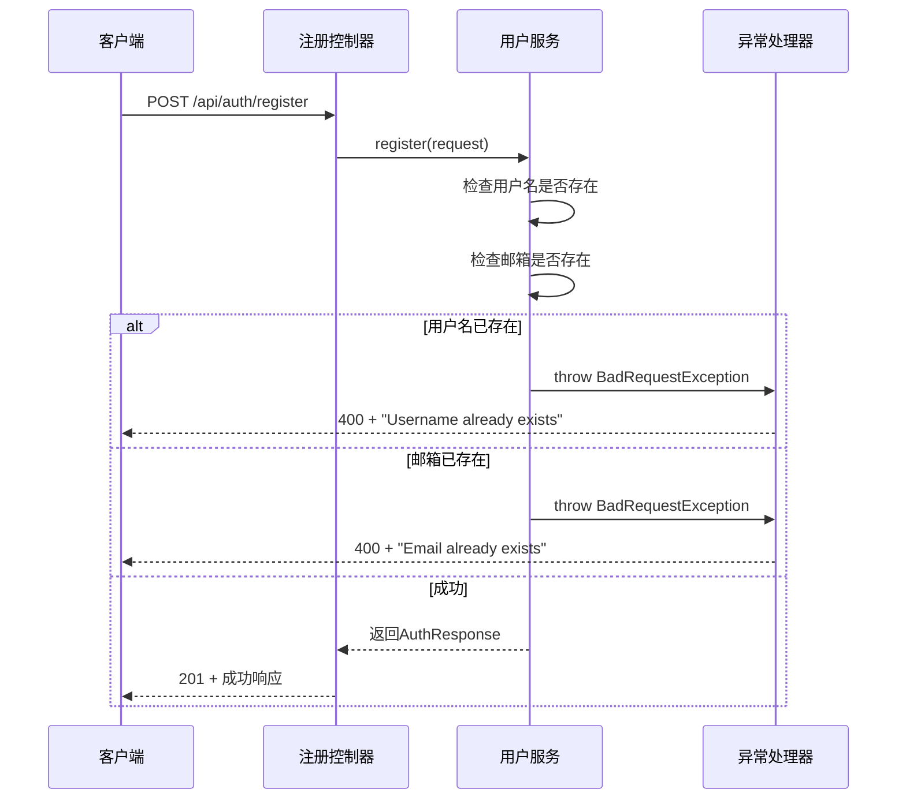
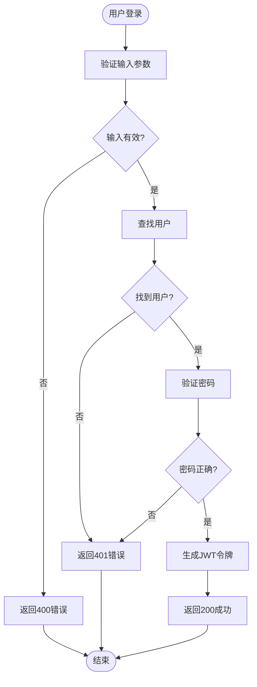

# 异常处理机制

<cite>
**本文档引用的文件**
- [GlobalExceptionHandler.java](file://communication-backend/src/main/java/com/communication/exception/GlobalExceptionHandler.java)
- [BadRequestException.java](file://communication-backend/src/main/java/com/communication/exception/BadRequestException.java)
- [ResourceNotFoundException.java](file://communication-backend/src/main/java/com/communication/exception/ResourceNotFoundException.java)
- [ApiResponse.java](file://communication-backend/src/main/java/com/communication/dto/ApiResponse.java)
- [application.yml](file://communication-backend/src/main/resources/application.yml)
- [AuthController.java](file://communication-backend/src/main/java/com/communication/controller/AuthController.java)
- [UserServiceImpl.java](file://communication-backend/src/main/java/com/communication/service/impl/UserServiceImpl.java)
- [UserServiceTest.java](file://communication-backend/src/test/java/com/communication/service/UserServiceTest.java)
- [application-test.yml](file://communication-backend/src/test/resources/application-test.yml)
</cite>

## 目录
1. [简介](#简介)
2. [项目结构](#项目结构)
3. [核心组件](#核心组件)
4. [架构概览](#架构概览)
5. [详细组件分析](#详细组件分析)
6. [依赖关系分析](#依赖关系分析)
7. [性能考虑](#性能考虑)
8. [故障排除指南](#故障排除指南)
9. [结论](#结论)

## 简介

通信平台采用统一的异常处理机制，通过全局异常处理器提供一致的错误响应格式和HTTP状态码映射。该机制涵盖了业务异常、验证异常、认证异常等多种异常类型，确保客户端能够获得清晰、标准化的错误信息。

## 项目结构

异常处理机制在通信平台中的组织结构如下：



**图表来源**
- [GlobalExceptionHandler.java](file://communication-backend/src/main/java/com/communication/exception/GlobalExceptionHandler.java#L15-L62)
- [ApiResponse.java](file://communication-backend/src/main/java/com/communication/dto/ApiResponse.java#L8-L75)

**章节来源**
- [GlobalExceptionHandler.java](file://communication-backend/src/main/java/com/communication/exception/GlobalExceptionHandler.java#L1-L63)
- [application.yml](file://communication-backend/src/main/resources/application.yml#L1-L42)

## 核心组件

### 全局异常处理器

全局异常处理器是异常处理机制的核心组件，负责捕获和处理系统中抛出的各种异常。

#### 主要功能特性

1. **异常类型分类处理**：针对不同类型的异常提供专门的处理逻辑
2. **标准化响应格式**：所有异常都返回统一的JSON响应格式
3. **HTTP状态码映射**：根据异常类型自动映射到相应的HTTP状态码
4. **错误信息本地化支持**：为后续的国际化改造预留接口

#### 异常处理流程



**图表来源**
- [GlobalExceptionHandler.java](file://communication-backend/src/main/java/com/communication/exception/GlobalExceptionHandler.java#L18-L61)

**章节来源**
- [GlobalExceptionHandler.java](file://communication-backend/src/main/java/com/communication/exception/GlobalExceptionHandler.java#L15-L62)

### 统一响应格式

ApiResponse类提供了统一的响应格式，确保所有API响应具有一致的结构。

#### 数据结构设计

| 字段名 | 类型 | 描述 | 必填 |
|--------|------|------|------|
| code | Integer | HTTP状态码 | 是 |
| message | String | 错误消息或成功消息 | 是 |
| data | T | 响应数据 | 否 |
| timestamp | LocalDateTime | 时间戳 | 是 |

#### 响应格式示例

成功的响应格式：
```json
{
  "code": 200,
  "message": "Success",
  "data": {},
  "timestamp": "2024-01-01T12:00:00"
}
```

错误的响应格式：
```json
{
  "code": 404,
  "message": "User not found with username: 'john'",
  "timestamp": "2024-01-01T12:00:00"
}
```

**章节来源**
- [ApiResponse.java](file://communication-backend/src/main/java/com/communication/dto/ApiResponse.java#L8-L75)

## 架构概览

异常处理机制的整体架构设计体现了分层处理的原则：



**图表来源**
- [GlobalExceptionHandler.java](file://communication-backend/src/main/java/com/communication/exception/GlobalExceptionHandler.java#L15-L62)
- [ApiResponse.java](file://communication-backend/src/main/java/com/communication/dto/ApiResponse.java#L8-L75)

## 详细组件分析

### 自定义异常类设计

#### BadRequestException（请求参数异常）

BadRequestException用于处理客户端提交的无效请求参数或业务逻辑错误。

##### 设计特点

1. **继承关系**：继承自RuntimeException，属于非检查异常
2. **HTTP映射**：通过@ResponseStatus注解映射到400状态码
3. **构造函数**：支持自定义错误消息的构造方式

##### 使用场景

- 用户名已存在
- 邮箱已被注册  
- 密码不符合安全要求
- 业务规则违反

**章节来源**
- [BadRequestException.java](file://communication-backend/src/main/java/com/communication/exception/BadRequestException.java#L6-L12)

#### ResourceNotFoundException（资源未找到异常）

ResourceNotFoundException用于处理请求的资源不存在的情况。

##### 设计特点

1. **双重构造函数**：支持通用消息和特定资源查询的构造方式
2. **HTTP映射**：映射到404状态码
3. **资源定位**：提供资源名称、字段和值的组合消息

##### 使用场景

- 用户不存在
- 内容不存在
- 订阅关系不存在
- 文件不存在

**章节来源**
- [ResourceNotFoundException.java](file://communication-backend/src/main/java/com/communication/exception/ResourceNotFoundException.java#L6-L16)

### 异常处理最佳实践

#### 异常信息国际化

虽然当前实现使用固定英文消息，但可以通过以下方式实现国际化：



#### 敏感信息脱敏处理

在异常处理过程中，需要特别注意保护敏感信息：

1. **密码脱敏**：避免在错误消息中暴露密码信息
2. **令牌处理**：不要在日志中记录完整的访问令牌
3. **用户隐私**：避免泄露用户的个人敏感信息

#### 日志记录策略

建议采用结构化日志记录：



**图表来源**
- [GlobalExceptionHandler.java](file://communication-backend/src/main/java/com/communication/exception/GlobalExceptionHandler.java#L56-L61)

### HTTP状态码映射

全局异常处理器实现了标准的HTTP状态码映射：

| 异常类型 | HTTP状态码 | 用途 |
|----------|------------|------|
| BadRequestException | 400 | 客户端请求参数错误 |
| ResourceNotFoundException | 404 | 请求的资源不存在 |
| BadCredentialsException | 401 | 认证失败 |
| MethodArgumentNotValidException | 400 | 参数验证失败 |
| Exception | 500 | 服务器内部错误 |

**章节来源**
- [GlobalExceptionHandler.java](file://communication-backend/src/main/java/com/communication/exception/GlobalExceptionHandler.java#L18-L61)

## 依赖关系分析

异常处理机制的依赖关系体现了清晰的分层架构：



**图表来源**
- [GlobalExceptionHandler.java](file://communication-backend/src/main/java/com/communication/exception/GlobalExceptionHandler.java#L1-L14)
- [ApiResponse.java](file://communication-backend/src/main/java/com/communication/dto/ApiResponse.java#L3-L7)

### 关键依赖链

1. **控制器依赖服务层**：控制器调用服务层执行业务逻辑
2. **服务层抛出异常**：服务层在遇到问题时抛出自定义异常
3. **异常处理器捕获**：全局异常处理器捕获并处理各种异常
4. **统一响应输出**：异常处理器返回标准化的响应格式

**章节来源**
- [AuthController.java](file://communication-backend/src/main/java/com/communication/controller/AuthController.java#L12-L41)
- [UserServiceImpl.java](file://communication-backend/src/main/java/com/communication/service/impl/UserServiceImpl.java#L28-L74)

## 性能考虑

### 异常处理性能优化

1. **异常栈追踪控制**：在生产环境中可以禁用异常栈追踪以减少开销
2. **日志级别优化**：合理设置日志级别，避免过度记录异常信息
3. **响应时间监控**：监控异常处理的响应时间，及时发现性能瓶颈

### 内存使用优化

1. **对象池化**：对于频繁出现的异常类型，可以考虑对象池化
2. **字符串常量**：使用字符串常量池减少内存占用
3. **流式处理**：对于大数据量的异常信息，采用流式处理方式

## 故障排除指南

### 常见异常场景处理

#### 用户注册异常处理



**图表来源**
- [UserServiceImpl.java](file://communication-backend/src/main/java/com/communication/service/impl/UserServiceImpl.java#L30-L48)
- [GlobalExceptionHandler.java](file://communication-backend/src/main/java/com/communication/exception/GlobalExceptionHandler.java#L18-L23)

#### 登录认证异常处理



**图表来源**
- [UserServiceImpl.java](file://communication-backend/src/main/java/com/communication/service/impl/UserServiceImpl.java#L50-L62)
- [GlobalExceptionHandler.java](file://communication-backend/src/main/java/com/communication/exception/GlobalExceptionHandler.java#L32-L37)

### 测试方法和调试技巧

#### 单元测试策略

基于现有的测试框架，可以采用以下测试策略：

1. **异常类型测试**：验证每个异常类型都能正确抛出
2. **响应格式测试**：验证异常响应符合统一格式
3. **HTTP状态码测试**：验证正确的HTTP状态码映射
4. **边界条件测试**：测试各种边界情况和异常场景

#### 调试技巧

1. **日志级别调整**：在开发环境中使用DEBUG级别，在生产环境使用ERROR级别
2. **断点调试**：在异常处理器的关键位置设置断点
3. **单元测试**：编写针对性的单元测试来验证异常处理逻辑
4. **集成测试**：通过端到端测试验证完整的异常处理流程

**章节来源**
- [UserServiceTest.java](file://communication-backend/src/test/java/com/communication/service/UserServiceTest.java#L84-L107)
- [application-test.yml](file://communication-backend/src/test/resources/application-test.yml#L1-L19)

## 结论

通信平台的异常处理机制设计合理，具有以下优势：

1. **统一性**：所有异常都通过统一的处理器进行处理，确保响应格式的一致性
2. **可扩展性**：基于Spring的异常处理机制，易于添加新的异常类型和处理逻辑
3. **可维护性**：清晰的分层架构使得异常处理逻辑易于理解和维护
4. **标准化**：实现了标准的HTTP状态码映射和响应格式

### 改进建议

1. **国际化支持**：实现多语言错误消息支持
2. **日志增强**：增加结构化日志记录和审计功能
3. **性能监控**：添加异常处理的性能指标监控
4. **安全加固**：加强敏感信息的保护和脱敏处理

该异常处理机制为通信平台提供了稳定可靠的错误处理基础，能够有效提升系统的可用性和用户体验。