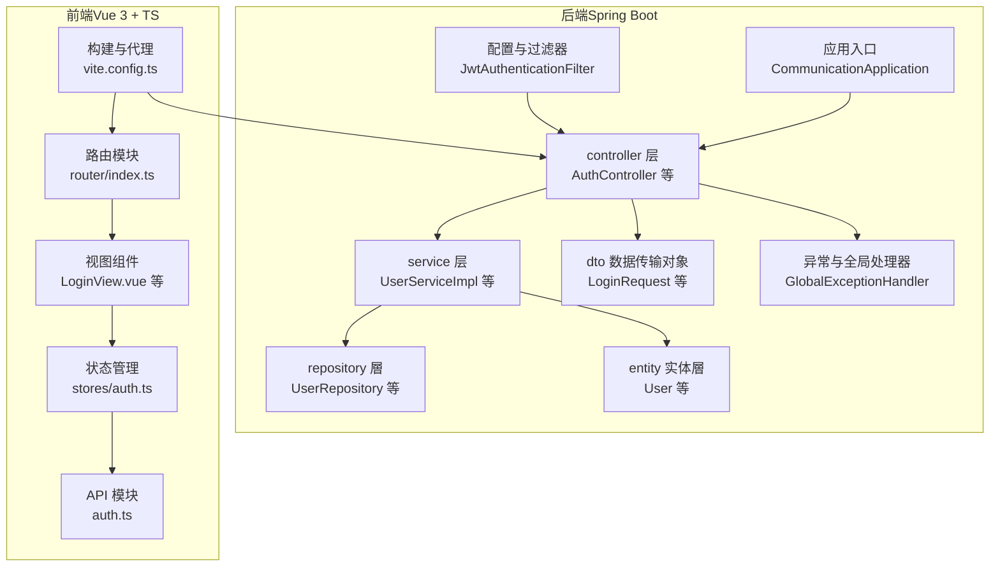
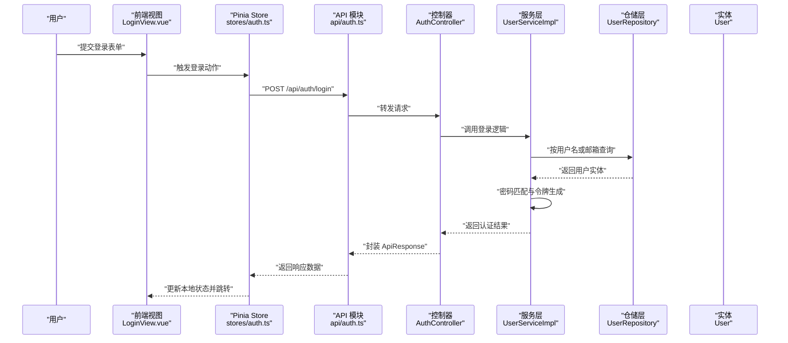
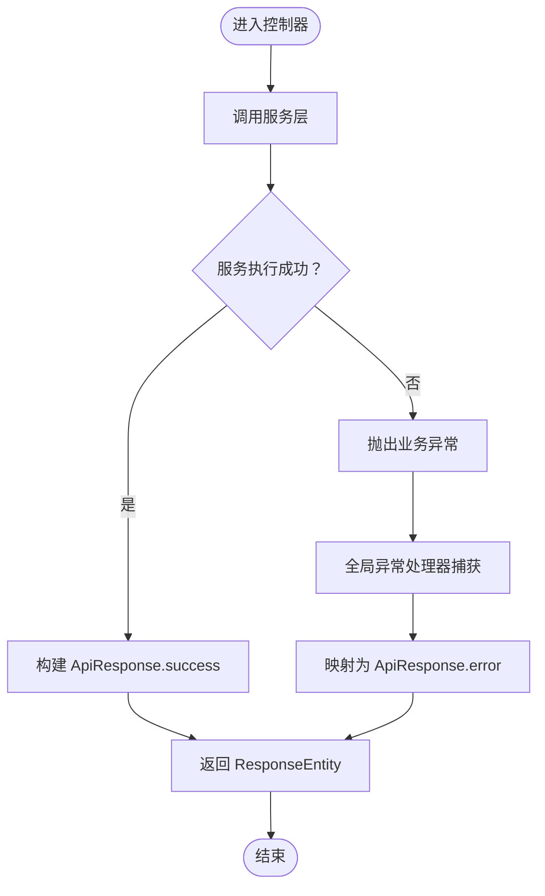
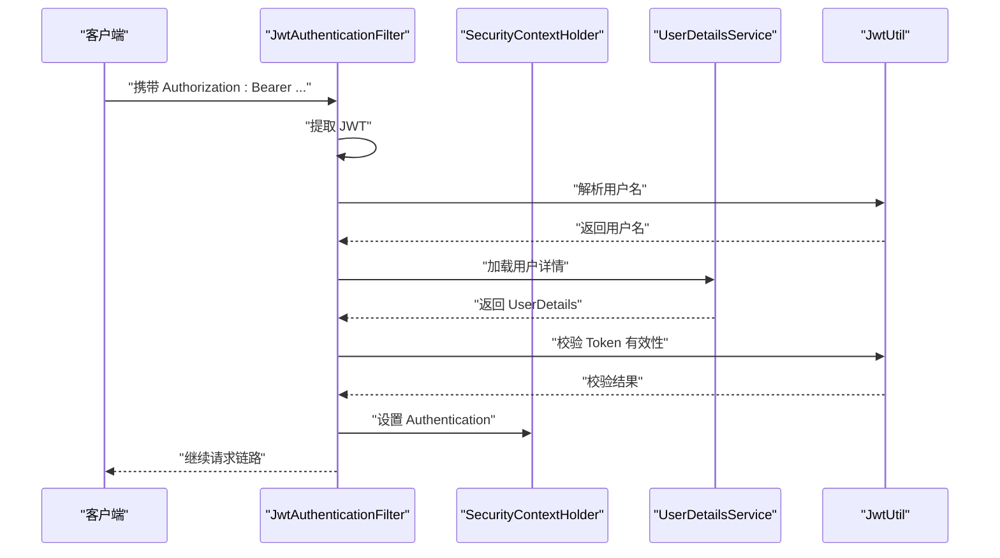
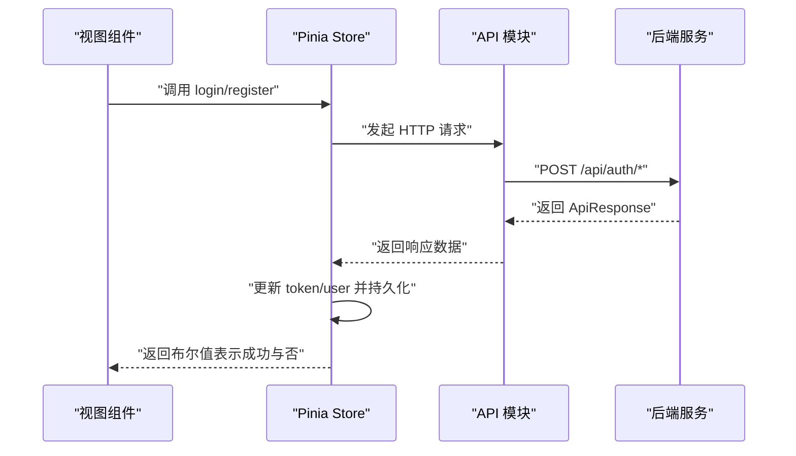
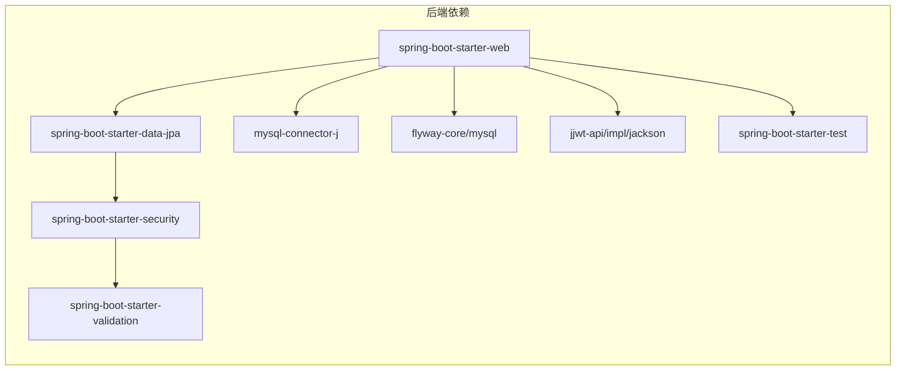

# 代码规范

<cite>
**本文引用的文件**
- [CommunicationApplication.java](file://communication-backend/src/main/java/com/communication/CommunicationApplication.java)
- [pom.xml](file://communication-backend/pom.xml)
- [application.yml](file://communication-backend/src/main/resources/application.yml)
- [AuthController.java](file://communication-backend/src/main/java/com/communication/controller/AuthController.java)
- [ApiResponse.java](file://communication-backend/src/main/java/com/communication/dto/ApiResponse.java)
- [LoginRequest.java](file://communication-backend/src/main/java/com/communication/dto/LoginRequest.java)
- [User.java](file://communication-backend/src/main/java/com/communication/entity/User.java)
- [UserServiceImpl.java](file://communication-backend/src/main/java/com/communication/service/impl/UserServiceImpl.java)
- [JwtAuthenticationFilter.java](file://communication-backend/src/main/java/com/communication/config/JwtAuthenticationFilter.java)
- [GlobalExceptionHandler.java](file://communication-backend/src/main/java/com/communication/exception/GlobalExceptionHandler.java)
- [package.json（前端）](file://communication-frontend/package.json)
- [tsconfig.json（前端）](file://communication-frontend/tsconfig.json)
- [vite.config.ts（前端）](file://communication-frontend/vite.config.ts)
- [auth.ts（前端API）](file://communication-frontend/src/api/auth.ts)
- [auth.ts（前端Pinia Store）](file://communication-frontend/src/stores/auth.ts)
- [LoginView.vue（前端视图）](file://communication-frontend/src/views/auth/LoginView.vue)
- [index.ts（前端路由）](file://communication-frontend/src/router/index.ts)
</cite>

## 目录
1. [引言](#引言)
2. [项目结构](#项目结构)
3. [核心组件](#核心组件)
4. [架构总览](#架构总览)
5. [详细组件分析](#详细组件分析)
6. [依赖分析](#依赖分析)
7. [性能考虑](#性能考虑)
8. [故障排查指南](#故障排查指南)
9. [结论](#结论)
10. [附录：代码审查检查清单与质量标准](#附录代码审查检查清单与质量标准)

## 引言
本文件为通信平台的代码规范文档，面向 Java 后端与 TypeScript 前端团队，提供统一的命名约定、代码格式化、注释规范、异常处理策略、包结构组织与 Lombok 使用建议。文档以现有仓库代码为依据，提炼出可落地的工程实践，并给出正误对比与可视化流程图，帮助团队在开发过程中保持一致性与高质量。

## 项目结构
后端采用 Spring Boot 标准分层：controller/dto/entity/repository/service/config/util 等；前端采用 Vue 3 + TypeScript + Pinia + Vue Router 的现代前端架构，配合 Vite 构建与 ESLint 自动修复。

图表来源
- [AuthController.java](file://communication-backend/src/main/java/com/communication/controller/AuthController.java#L1-L42)
- [UserServiceImpl.java](file://communication-backend/src/main/java/com/communication/service/impl/UserServiceImpl.java#L1-L86)
- [User.java](file://communication-backend/src/main/java/com/communication/entity/User.java#L1-L96)
- [LoginRequest.java](file://communication-backend/src/main/java/com/communication/dto/LoginRequest.java#L1-L20)
- [GlobalExceptionHandler.java](file://communication-backend/src/main/java/com/communication/exception/GlobalExceptionHandler.java#L1-L63)
- [JwtAuthenticationFilter.java](file://communication-backend/src/main/java/com/communication/config/JwtAuthenticationFilter.java#L1-L69)
- [CommunicationApplication.java](file://communication-backend/src/main/java/com/communication/CommunicationApplication.java#L1-L13)
- [auth.ts（前端API）](file://communication-frontend/src/api/auth.ts#L1-L49)
- [auth.ts（前端Pinia Store）](file://communication-frontend/src/stores/auth.ts#L1-L96)
- [LoginView.vue（前端视图）](file://communication-frontend/src/views/auth/LoginView.vue#L1-L113)
- [index.ts（前端路由）](file://communication-frontend/src/router/index.ts#L1-L98)
- [vite.config.ts（前端）](file://communication-frontend/vite.config.ts#L1-L40)

章节来源
- [pom.xml](file://communication-backend/pom.xml#L1-L114)
- [application.yml](file://communication-backend/src/main/resources/application.yml#L1-L42)
- [package.json（前端）](file://communication-frontend/package.json#L1-L36)
- [tsconfig.json（前端）](file://communication-frontend/tsconfig.json#L1-L26)

## 核心组件
- 后端核心：控制器负责请求映射与响应封装；服务层实现业务逻辑与事务控制；实体与 DTO 负责数据模型与传输；全局异常处理器统一返回结构；JWT 过滤器负责鉴权上下文注入。
- 前端核心：API 模块封装 HTTP 请求与响应类型；Pinia Store 管理认证状态与本地持久化；路由守卫控制访问权限；视图组件承载表单校验与交互。

章节来源
- [AuthController.java](file://communication-backend/src/main/java/com/communication/controller/AuthController.java#L1-L42)
- [ApiResponse.java](file://communication-backend/src/main/java/com/communication/dto/ApiResponse.java#L1-L76)
- [UserServiceImpl.java](file://communication-backend/src/main/java/com/communication/service/impl/UserServiceImpl.java#L1-L86)
- [GlobalExceptionHandler.java](file://communication-backend/src/main/java/com/communication/exception/GlobalExceptionHandler.java#L1-L63)
- [JwtAuthenticationFilter.java](file://communication-backend/src/main/java/com/communication/config/JwtAuthenticationFilter.java#L1-L69)
- [auth.ts（前端API）](file://communication-frontend/src/api/auth.ts#L1-L49)
- [auth.ts（前端Pinia Store）](file://communication-frontend/src/stores/auth.ts#L1-L96)
- [index.ts（前端路由）](file://communication-frontend/src/router/index.ts#L1-L98)

## 架构总览
后端通过控制器接收请求，调用服务层执行业务，使用 JPA 访问数据库，统一通过 ApiResponse 返回结果；前端通过 API 模块发起请求，使用 Pinia Store 维护用户态，路由守卫进行权限控制，Vite 提供开发与代理能力。

图表来源
- [LoginView.vue（前端视图）](file://communication-frontend/src/views/auth/LoginView.vue#L1-L113)
- [auth.ts（前端Pinia Store）](file://communication-frontend/src/stores/auth.ts#L1-L96)
- [auth.ts（前端API）](file://communication-frontend/src/api/auth.ts#L1-L49)
- [AuthController.java](file://communication-backend/src/main/java/com/communication/controller/AuthController.java#L1-L42)
- [UserServiceImpl.java](file://communication-backend/src/main/java/com/communication/service/impl/UserServiceImpl.java#L1-L86)
- [User.java](file://communication-backend/src/main/java/com/communication/entity/User.java#L1-L96)

## 详细组件分析

### Java 后端：包结构与命名约定
- 包名：com.communication 下按功能域划分 controller、service、repository、entity、dto、exception、config、util。
- 类命名：采用帕斯卡命名法；控制器以 Controller 结尾；服务接口以 Service 结尾，实现类以 Impl 结尾；异常类以 Exception 结尾；工具类以 Util 结尾。
- 方法命名：遵循动宾结构，如 register、login、findByUsername；布尔方法以 is/has 开头。
- 常量定义：使用全大写下划线命名，置于独立常量类或配置文件中。
- 注释规范：类与公共方法需 Javadoc；复杂逻辑添加行内注释；DTO 字段使用注解约束时补充说明。

章节来源
- [CommunicationApplication.java](file://communication-backend/src/main/java/com/communication/CommunicationApplication.java#L1-L13)
- [AuthController.java](file://communication-backend/src/main/java/com/communication/controller/AuthController.java#L1-L42)
- [UserServiceImpl.java](file://communication-backend/src/main/java/com/communication/service/impl/UserServiceImpl.java#L1-L86)
- [User.java](file://communication-backend/src/main/java/com/communication/entity/User.java#L1-L96)
- [LoginRequest.java](file://communication-backend/src/main/java/com/communication/dto/LoginRequest.java#L1-L20)
- [ApiResponse.java](file://communication-backend/src/main/java/com/communication/dto/ApiResponse.java#L1-L76)
- [GlobalExceptionHandler.java](file://communication-backend/src/main/java/com/communication/exception/GlobalExceptionHandler.java#L1-L63)
- [JwtAuthenticationFilter.java](file://communication-backend/src/main/java/com/communication/config/JwtAuthenticationFilter.java#L1-L69)

### Java 后端：代码格式化与注释规范
- 格式化：使用 Spring Boot 默认风格；缩进 4 空格；每行不超过 120 字符；空行分隔逻辑块；括号独占一行。
- 注释：类与公共方法必须有 Javadoc；字段与复杂分支添加行内注释；DTO 字段验证注解需说明约束含义。
- 日志与调试：避免使用 System.out；使用日志框架记录关键路径与异常栈。

章节来源
- [ApiResponse.java](file://communication-backend/src/main/java/com/communication/dto/ApiResponse.java#L1-L76)
- [GlobalExceptionHandler.java](file://communication-backend/src/main/java/com/communication/exception/GlobalExceptionHandler.java#L1-L63)

### Java 后端：异常处理与统一响应
- 统一响应：ApiResponse 封装 code、message、data、timestamp；提供 success/error 静态工厂方法。
- 全局异常：GlobalExceptionHandler 将业务异常、参数校验异常、凭据错误、通用异常映射为标准响应。
- 控制器：控制器返回 ResponseEntity<ApiResponse<T>>，明确 HTTP 状态码与业务状态码。

图表来源
- [AuthController.java](file://communication-backend/src/main/java/com/communication/controller/AuthController.java#L1-L42)
- [ApiResponse.java](file://communication-backend/src/main/java/com/communication/dto/ApiResponse.java#L1-L76)
- [GlobalExceptionHandler.java](file://communication-backend/src/main/java/com/communication/exception/GlobalExceptionHandler.java#L1-L63)

章节来源
- [AuthController.java](file://communication-backend/src/main/java/com/communication/controller/AuthController.java#L1-L42)
- [ApiResponse.java](file://communication-backend/src/main/java/com/communication/dto/ApiResponse.java#L1-L76)
- [GlobalExceptionHandler.java](file://communication-backend/src/main/java/com/communication/exception/GlobalExceptionHandler.java#L1-L63)

### Java 后端：JWT 鉴权与安全过滤器
- 过滤器职责：从 Authorization 头解析 Bearer Token，解析用户名，加载用户详情，校验有效性，注入到 SecurityContext。
- 安全配置：结合 Spring Security 使用；过滤器在异常时静默忽略，保证不影响正常请求链路。

图表来源
- [JwtAuthenticationFilter.java](file://communication-backend/src/main/java/com/communication/config/JwtAuthenticationFilter.java#L1-L69)

章节来源
- [JwtAuthenticationFilter.java](file://communication-backend/src/main/java/com/communication/config/JwtAuthenticationFilter.java#L1-L69)

### Java 后端：Lombok 最佳实践与注意事项
- 推荐使用：lombok.Builder、lombok.Data（谨慎）、lombok.AllArgsConstructor、lombok.NoArgsConstructor。
- 不推荐：直接在实体类上使用 @Data，避免无界 getter/setter 导致不可控修改；优先使用 Builder 或显式构造函数。
- 注意事项：与 JPA 配合时，确保至少保留一个无参构造函数；避免在 DTO 上滥用 Lombok 注解导致序列化问题。

章节来源
- [User.java](file://communication-backend/src/main/java/com/communication/entity/User.java#L1-L96)
- [ApiResponse.java](file://communication-backend/src/main/java/com/communication/dto/ApiResponse.java#L1-L76)

### TypeScript 前端：命名约定与类型约束
- 文件与目录：组件以 PascalCase 命名；API 模块以小驼峰命名；Store 使用小驼峰；路由文件 index.ts。
- 组件命名：视图组件以 View 结尾，通用组件以首字母大写；目录按功能划分。
- 属性与接口：接口以大写 I 前缀或名词形式（如 User），属性使用小驼峰；枚举使用大写。
- 类型约束：API 返回统一使用 ApiResponse<T> 泛型；表单校验使用 Element Plus FormRules；Pinia Store 使用 ref/computed。

章节来源
- [auth.ts（前端API）](file://communication-frontend/src/api/auth.ts#L1-L49)
- [auth.ts（前端Pinia Store）](file://communication-frontend/src/stores/auth.ts#L1-L96)
- [LoginView.vue（前端视图）](file://communication-frontend/src/views/auth/LoginView.vue#L1-L113)
- [index.ts（前端路由）](file://communication-frontend/src/router/index.ts#L1-L98)

### TypeScript 前端：代码格式化与注释规范
- 格式化：ESLint + Prettier；启用 --fix 脚本；严格模式开启；禁止未使用变量与参数。
- 注释：公共函数与接口需 JSDoc；复杂逻辑添加行内注释；组件 props 与 emits 明确用途。
- 路由与状态：路由元信息 meta 包含标题与权限标记；Store 中的异步操作统一 try/catch + finally 更新 loading 状态。

章节来源
- [package.json（前端）](file://communication-frontend/package.json#L1-L36)
- [tsconfig.json（前端）](file://communication-frontend/tsconfig.json#L1-L26)
- [auth.ts（前端Pinia Store）](file://communication-frontend/src/stores/auth.ts#L1-L96)

### TypeScript 前端：API 与状态管理
- API 设计：统一导出 authApi 对象，使用 axios 封装；接口定义与后端 ApiResponse 对齐；错误处理统一读取响应消息。
- 状态管理：Pinia Store 使用组合式 API；token 与 user 存入 localStorage；提供 fetchCurrentUser 与 logout 清理逻辑。

图表来源
- [LoginView.vue（前端视图）](file://communication-frontend/src/views/auth/LoginView.vue#L1-L113)
- [auth.ts（前端Pinia Store）](file://communication-frontend/src/stores/auth.ts#L1-L96)
- [auth.ts（前端API）](file://communication-frontend/src/api/auth.ts#L1-L49)

章节来源
- [auth.ts（前端API）](file://communication-frontend/src/api/auth.ts#L1-L49)
- [auth.ts（前端Pinia Store）](file://communication-frontend/src/stores/auth.ts#L1-L96)

### TypeScript 前端：路由守卫与页面标题
- 守卫逻辑：根据 meta.guest 与 requiresAuth 控制访问；已登录用户禁止访问登录/注册页；未登录用户重定向至登录页并携带 redirect 参数；动态设置 document.title。
- 页面标题：路由 meta.title 与固定后缀组合形成完整标题。

章节来源
- [index.ts（前端路由）](file://communication-frontend/src/router/index.ts#L1-L98)

## 依赖分析
- 后端依赖：Spring Web、Data JPA、Security、Validation、MySQL Connector、Flyway、jjwt、测试依赖。
- 前端依赖：Vue 3、Vue Router、Pinia、Element Plus、Axios、Vitest、Playwright、ESLint 插件自动导入与组件解析。

图表来源
- [pom.xml](file://communication-backend/pom.xml#L1-L114)

章节来源
- [pom.xml](file://communication-backend/pom.xml#L1-L114)
- [package.json（前端）](file://communication-frontend/package.json#L1-L36)

## 性能考虑
- 后端：合理使用缓存（如 Redis）减少重复查询；避免 N+1 查询，使用 JOIN 或批量加载；控制响应体大小，必要时分页与投影。
- 前端：组件懒加载与路由懒加载；图片与媒体资源按需加载；Pinia 状态粒度控制，避免不必要的响应式更新。
- 构建：生产环境启用压缩与 Tree-shaking；Vite 预构建第三方库；CDN 加速静态资源。

## 故障排查指南
- 后端常见问题：参数校验失败返回 400 且包含字段错误；凭据错误统一返回 401；其他异常返回 500；检查 application.yml 中数据库与 JWT 配置。
- 前端常见问题：跨域与代理：确认 vite.config.ts 中 /api 与 /uploads 代理目标；路由守卫：检查 meta 标记与鉴权状态；状态同步：确认 localStorage 与 Store 同步逻辑。

章节来源
- [application.yml](file://communication-backend/src/main/resources/application.yml#L1-L42)
- [vite.config.ts（前端）](file://communication-frontend/vite.config.ts#L1-L40)
- [index.ts（前端路由）](file://communication-frontend/src/router/index.ts#L1-L98)

## 结论
本规范以现有代码为蓝本，明确了 Java 后端与 TypeScript 前端的命名、格式、注释、异常与统一响应、JWT 鉴权、路由守卫与状态管理等关键实践。建议在团队内推广并纳入 CI 校验，持续提升代码一致性与可维护性。

## 附录：代码审查检查清单与质量标准
- 命名与结构
  - 包与类命名是否符合约定？
  - DTO/实体/接口是否清晰分离职责？
  - 路由与组件命名是否一致？
- 格式与注释
  - 是否启用并遵守格式化规则？
  - 是否提供必要的 Javadoc/注释？
  - 是否存在过长行或不必要空行？
- 异常与响应
  - 是否统一使用 ApiResponse？
  - 是否覆盖常见异常场景？
  - 控制器是否返回正确的 HTTP 状态码？
- 安全与鉴权
  - JWT 过滤器是否正确注入用户上下文？
  - 路由守卫是否正确拦截未授权访问？
- 前端交互
  - 表单校验是否完善？
  - 错误提示是否友好？
  - 状态更新是否幂等且可追踪？