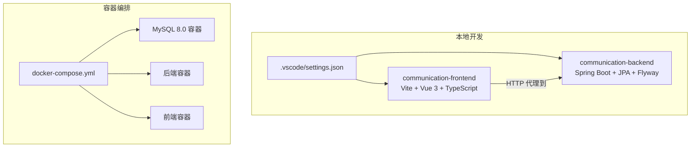
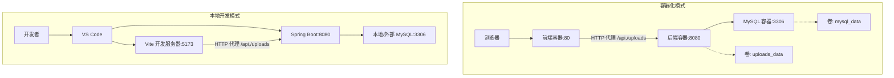
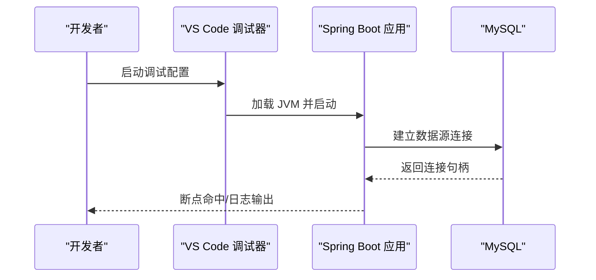
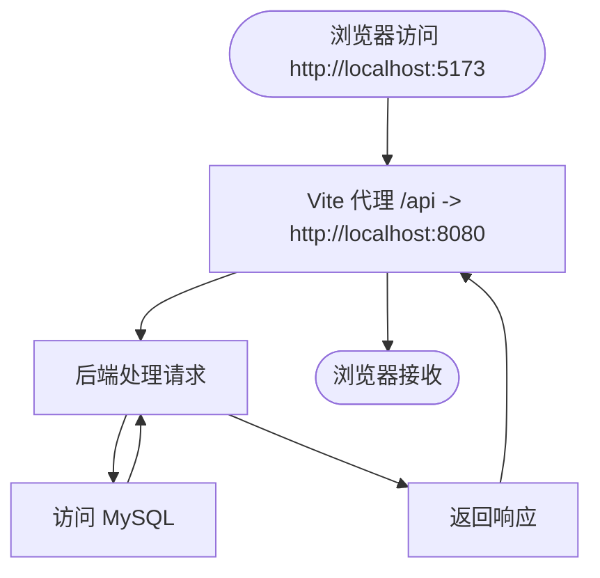
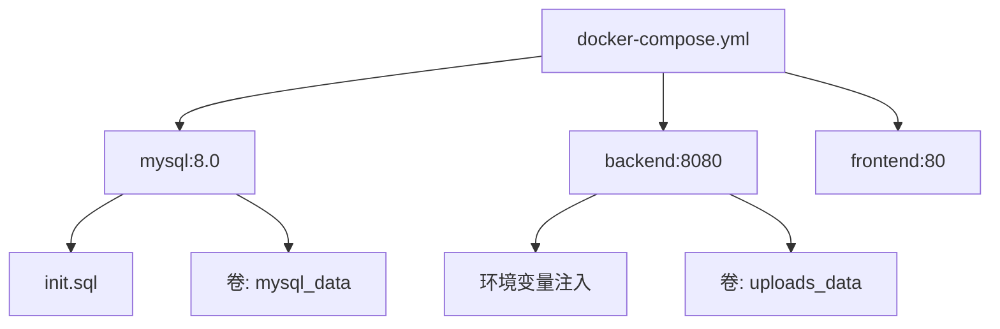
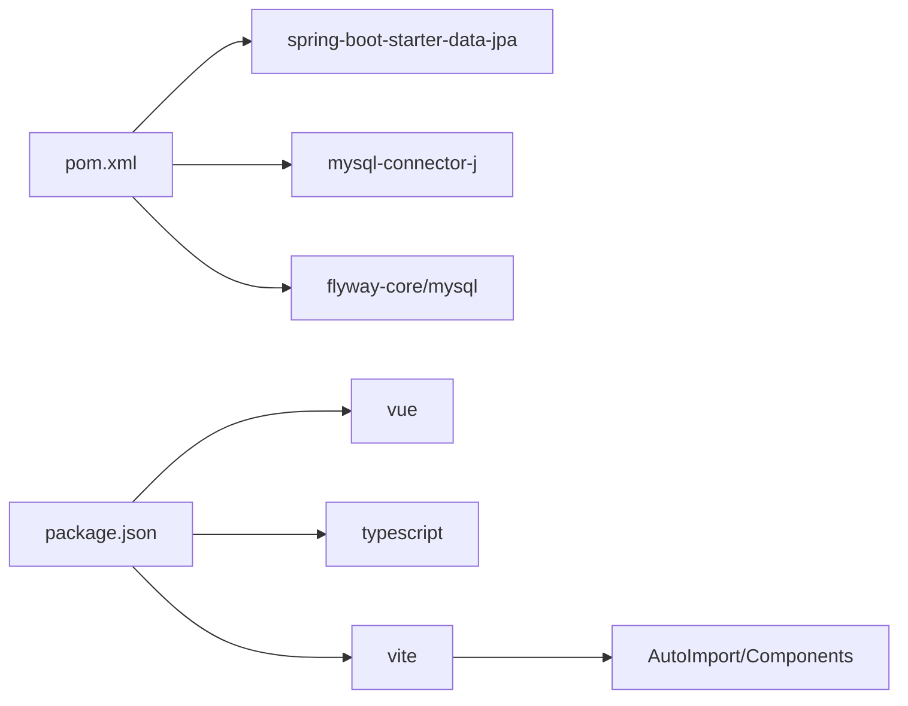

# 开发工具配置

<cite>
**本文档引用的文件**
- [.vscode/settings.json](file://.vscode/settings.json)
- [docker-compose.yml](file://docker-compose.yml)
- [init.sql](file://init.sql)
- [communication-backend/pom.xml](file://communication-backend/pom.xml)
- [communication-backend/src/main/resources/application.yml](file://communication-backend/src/main/resources/application.yml)
- [communication-backend/src/main/resources/application-docker.yml](file://communication-backend/src/main/resources/application-docker.yml)
- [communication-backend/Dockerfile](file://communication-backend/Dockerfile)
- [communication-frontend/package.json](file://communication-frontend/package.json)
- [communication-frontend/vite.config.ts](file://communication-frontend/vite.config.ts)
- [communication-frontend/tsconfig.json](file://communication-frontend/tsconfig.json)
</cite>

## 目录
1. [简介](#简介)
2. [项目结构](#项目结构)
3. [核心组件](#核心组件)
4. [架构总览](#架构总览)
5. [详细组件分析](#详细组件分析)
6. [依赖关系分析](#依赖关系分析)
7. [性能考虑](#性能考虑)
8. [故障排除指南](#故障排除指南)
9. [结论](#结论)
10. [附录](#附录)

## 简介
本指南面向通信平台项目的开发团队，提供从 VS Code 到数据库与 API 测试、代码质量工具、Docker 容器化以及性能分析的完整开发工具配置方案。文档基于仓库中现有的配置文件进行解读，并给出可操作的建议与最佳实践，帮助开发者快速搭建一致且高效的本地与容器化开发环境。

## 项目结构
项目采用前后端分离架构，根目录包含：
- 后端：Spring Boot 应用，使用 Maven 构建，集成 JPA、Flyway、JWT、MySQL 等
- 前端：Vue 3 + TypeScript + Vite 应用，使用 Pinia、Element Plus、Axios
- 运维：Docker Compose 编排 MySQL、后端服务与前端 Nginx（通过 Dockerfile 构建）
- 配置：VS Code 工作区设置、应用配置文件、初始化 SQL 脚本

图表来源
- [docker-compose.yml](file://docker-compose.yml#L1-L60)
- [.vscode/settings.json](file://.vscode/settings.json#L1-L4)
- [communication-frontend/vite.config.ts](file://communication-frontend/vite.config.ts#L26-L38)
- [communication-backend/src/main/resources/application.yml](file://communication-backend/src/main/resources/application.yml#L5-L31)

章节来源
- [docker-compose.yml](file://docker-compose.yml#L1-L60)
- [.vscode/settings.json](file://.vscode/settings.json#L1-L4)

## 核心组件
- VS Code 工作区设置：启用 Java 空指针分析与构建更新提示
- 前端工程：Vite + Vue 3 + TypeScript，内置 ESLint 脚本与自动导入组件
- 后端工程：Spring Boot + JPA + Flyway + JWT + MySQL，支持多环境配置
- 容器编排：MySQL、后端、前端三服务，健康检查与持久卷
- 初始化脚本：确保数据库存在与字符集设置

章节来源
- [.vscode/settings.json](file://.vscode/settings.json#L1-L4)
- [communication-frontend/package.json](file://communication-frontend/package.json#L6-L14)
- [communication-backend/pom.xml](file://communication-backend/pom.xml#L20-L23)
- [docker-compose.yml](file://docker-compose.yml#L1-L60)
- [init.sql](file://init.sql#L1-L3)

## 架构总览
下图展示本地与容器化两种运行模式下的交互关系：

图表来源
- [docker-compose.yml](file://docker-compose.yml#L3-L56)
- [communication-frontend/vite.config.ts](file://communication-frontend/vite.config.ts#L26-L38)
- [communication-backend/src/main/resources/application.yml](file://communication-backend/src/main/resources/application.yml#L5-L31)

## 详细组件分析

### VS Code 推荐插件与配置
- Java 开发
  - 插件：Language Support for Java(TM) by Red Hat、Apache Maven for Java、Spring Boot Extension Pack
  - 设置要点：空指针分析模式、构建配置更新策略
- TypeScript/Vue 开发
  - 插件：Vue Language Features (Volar)、TypeScript Vue Plugin、ESLint、Prettier
  - 设置要点：启用 Volar 的类型预检、TS 路径别名、ESLint 自动修复
- 快捷键与工作流
  - 建议：为常用任务绑定快捷键（如运行前端、启动后端、打开终端）
  - 统一格式化：在工作区设置中指定默认格式化程序为 Prettier 或 ESLint

章节来源
- [.vscode/settings.json](file://.vscode/settings.json#L1-L4)

### 代码格式化与质量工具
- ESLint（前端）
  - 已在前端 package.json 中定义 lint 脚本，覆盖 .vue、.ts 等扩展
  - 建议：在 VS Code 中安装 ESLint 插件并启用保存时自动修复
- Prettier（通用）
  - 建议：在项目根目录添加 .prettierrc，统一缩进、引号、尾逗号等风格
- SonarQube（后端）
  - 建议：在 CI 中集成 SonarQube 分析，扫描覆盖率与代码异味
  - 可结合 Maven 插件生成报告并在 SonarQube 服务器上查看

章节来源
- [communication-frontend/package.json](file://communication-frontend/package.json#L12-L12)

### 数据库工具配置
- MySQL Workbench/Navicat
  - 连接参数（容器模式）：
    - 主机：localhost
    - 端口：3306
    - 用户名：communication
    - 密码：comm123
    - 默认数据库：communication
  - 初始化脚本：首次启动会执行 init.sql 创建数据库
- 连接验证
  - 健康检查由 docker-compose 提供，确保数据库可用后再启动后端

章节来源
- [docker-compose.yml](file://docker-compose.yml#L8-L18)
- [init.sql](file://init.sql#L1-L3)

### API 测试工具 Postman
- 环境变量建议
  - 基础 URL：http://localhost:8080
  - 上传路径：/uploads
  - 认证：登录接口返回 JWT 后，在后续请求头中携带 Authorization: Bearer <token>
- 收藏集合
  - 建议按模块分组：认证、内容、评论、用户、订阅、搜索
- 预设脚本
  - Pre-request Script：刷新时间戳、生成随机数据
  - Tests：断言状态码、响应结构、JWT 过期时间

[本节为概念性指导，不直接分析具体文件，故无“章节来源”]

### 后端调试配置
- VS Code Launch 配置（后端）
  - 使用 Java Debugger，选择主类（CommunicationApplication）
  - VM 参数：设置 Spring 配置文件激活与日志级别
- 应用配置
  - 本地：application.yml 指向本地 MySQL
  - 容器：application-docker.yml 通过环境变量注入数据库连接

图表来源
- [communication-backend/src/main/resources/application.yml](file://communication-backend/src/main/resources/application.yml#L5-L9)
- [communication-backend/src/main/resources/application-docker.yml](file://communication-backend/src/main/resources/application-docker.yml#L1-L50)

章节来源
- [communication-backend/src/main/resources/application.yml](file://communication-backend/src/main/resources/application.yml#L5-L31)
- [communication-backend/src/main/resources/application-docker.yml](file://communication-backend/src/main/resources/application-docker.yml#L1-L50)

### 前端调试与代理
- Vite 开发服务器
  - 端口：5173
  - 代理规则：将 /api 与 /uploads 代理至后端 8080 端口
- VS Code 调试配置（前端）
  - 使用 Chrome/Edge 扩展，配置 launch.json 指向 Vite dev server
  - 建议开启自动刷新与断点映射

图表来源
- [communication-frontend/vite.config.ts](file://communication-frontend/vite.config.ts#L26-L38)

章节来源
- [communication-frontend/vite.config.ts](file://communication-frontend/vite.config.ts#L26-L38)

### Docker 与数据库容器配置
- 服务编排
  - mysql：设置 root 密码、数据库名、用户名与密码；挂载初始化脚本与数据卷
  - backend：基于多阶段构建，暴露 8080 端口，依赖 mysql 健康检查
  - frontend：暴露 80 端口，依赖后端服务
- 多环境配置
  - 本地：application.yml
  - 容器：application-docker.yml（通过环境变量注入）

图表来源
- [docker-compose.yml](file://docker-compose.yml#L3-L56)
- [communication-backend/Dockerfile](file://communication-backend/Dockerfile#L1-L32)

章节来源
- [docker-compose.yml](file://docker-compose.yml#L1-L60)
- [communication-backend/Dockerfile](file://communication-backend/Dockerfile#L1-L32)

### 代码质量与测试
- 前端
  - 单元测试：vitest
  - 端到端测试：Playwright
  - 类型检查：vue-tsc
- 后端
  - Spring Boot Test、Spring Security Test、H2 内存数据库用于测试环境
  - 建议在 CI 中集成 SonarQube 与覆盖率工具

章节来源
- [communication-frontend/package.json](file://communication-frontend/package.json#L10-L13)
- [communication-backend/pom.xml](file://communication-backend/pom.xml#L78-L93)

## 依赖关系分析
- 后端对数据库与 Flyway 的依赖：JPA、MySQL Connector、Flyway Core/MySQL
- 前端对 Vue 3、TypeScript、Vite 的依赖：插件化自动导入与组件解析
- VS Code 对 Java/TypeScript/Vue 生态的依赖：语言服务与调试器

图表来源
- [communication-backend/pom.xml](file://communication-backend/pom.xml#L25-L57)
- [communication-frontend/package.json](file://communication-frontend/package.json#L15-L34)

章节来源
- [communication-backend/pom.xml](file://communication-backend/pom.xml#L25-L57)
- [communication-frontend/package.json](file://communication-frontend/package.json#L15-L34)

## 性能考虑
- 启动优化
  - 使用多阶段 Docker 构建减少镜像体积
  - 后端仅在生产环境启用 SQL 输出与格式化（开发环境可关闭）
- 网络与代理
  - Vite 代理避免跨域问题，提升开发体验
- 数据库
  - 容器内使用 UTF8MB4 字符集，确保表情符号与多语言支持
  - 健康检查保证服务依赖稳定

章节来源
- [communication-backend/Dockerfile](file://communication-backend/Dockerfile#L1-L32)
- [communication-backend/src/main/resources/application.yml](file://communication-backend/src/main/resources/application.yml#L11-L18)
- [docker-compose.yml](file://docker-compose.yml#L18-L23)

## 故障排除指南
- 数据库无法连接
  - 检查 docker-compose 是否已成功启动 mysql 服务并通过健康检查
  - 确认应用配置中的主机名、端口、用户名与密码正确
- CORS 与代理问题
  - 确认 Vite 代理规则是否包含 /api 与 /uploads
  - 前端请求路径是否与代理目标一致
- JWT 与认证失败
  - 确认登录接口返回的 Token 是否被正确写入本地存储
  - 请求头是否包含 Authorization: Bearer <token>
- 文件上传异常
  - 检查后端上传路径配置与容器卷挂载
  - 确认前端上传接口与后端路由一致

章节来源
- [docker-compose.yml](file://docker-compose.yml#L19-L23)
- [communication-frontend/vite.config.ts](file://communication-frontend/vite.config.ts#L28-L37)
- [communication-backend/src/main/resources/application.yml](file://communication-backend/src/main/resources/application.yml#L38-L42)

## 结论
通过本指南，您可以基于现有配置快速完成 VS Code、数据库、API 测试与容器化环境的搭建。建议在团队内统一代码风格与调试流程，并在 CI 中引入代码质量与安全扫描工具，持续提升交付质量与效率。

## 附录
- 常用命令参考
  - 启动容器：docker compose up -d
  - 查看日志：docker compose logs -f mysql/backend/frontend
  - 停止容器：docker compose down
- 路径别名与类型检查
  - 前端 tsconfig 已配置 @/* 到 src/*，请保持导入一致性

章节来源
- [communication-frontend/tsconfig.json](file://communication-frontend/tsconfig.json#L18-L21)