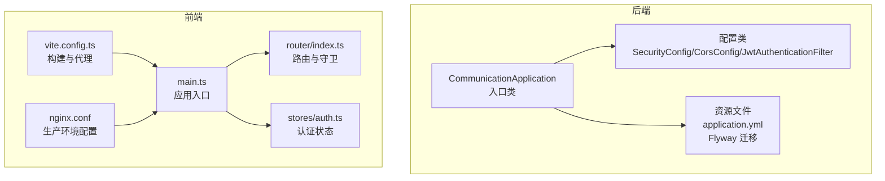
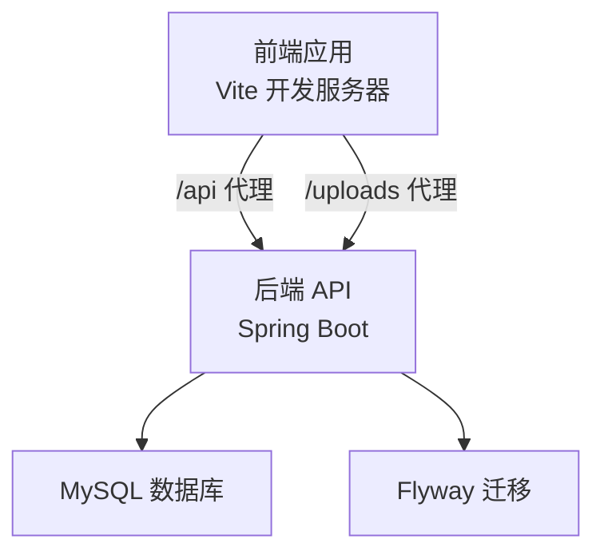
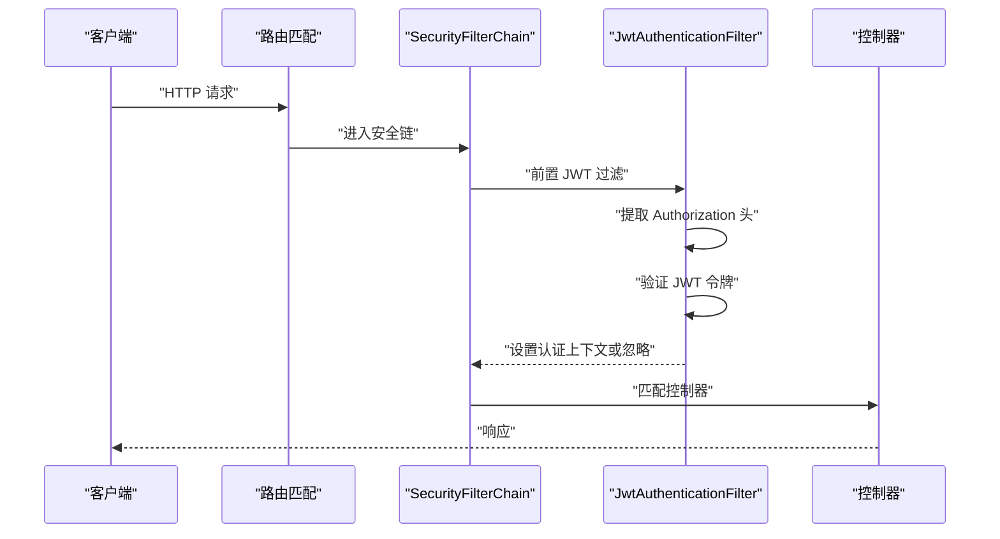
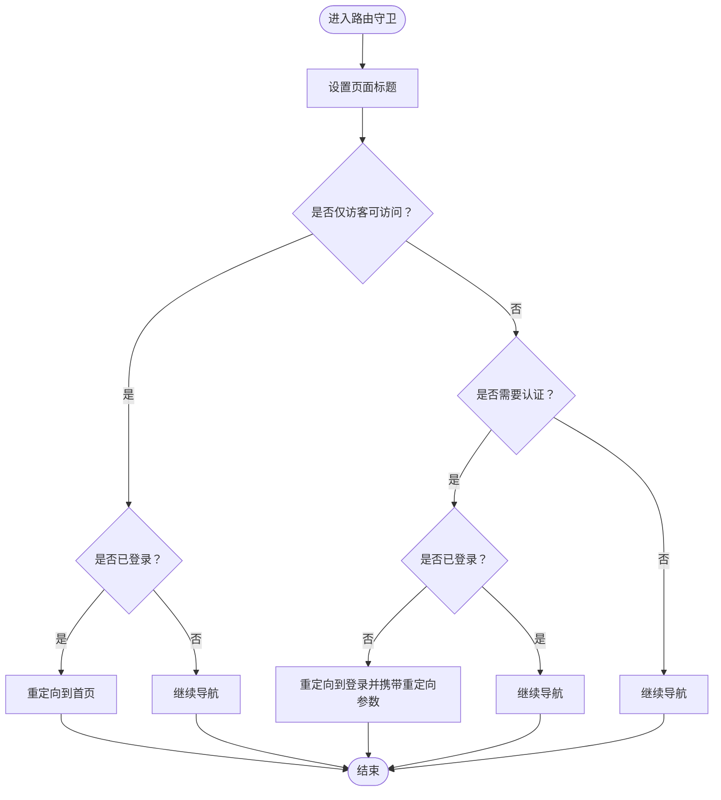
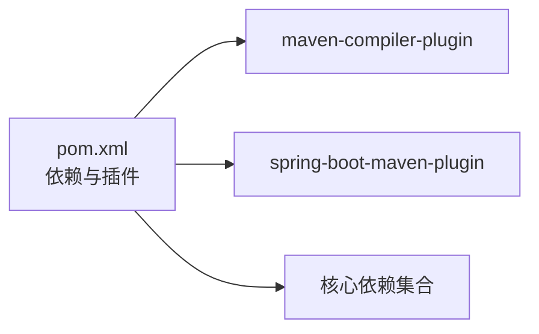
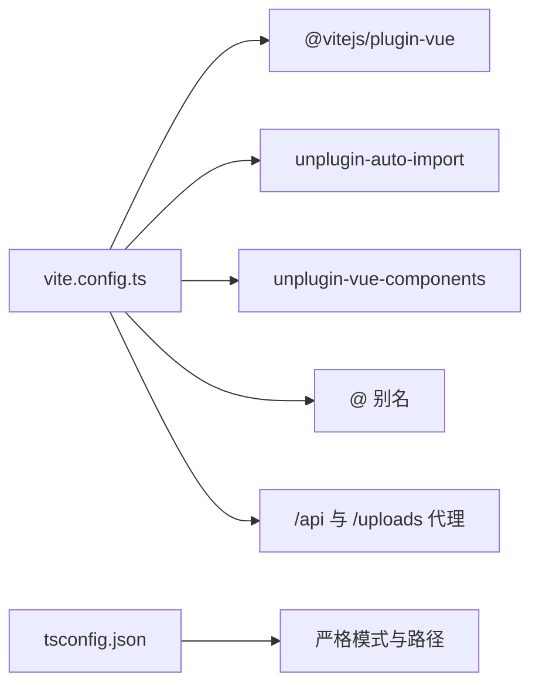
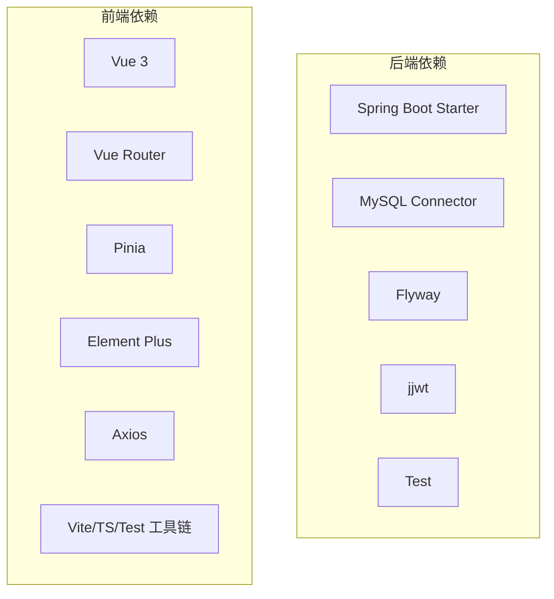

# 开发指南

<cite>
**本文引用的文件**
- [README.md](file://README.md)
- [plan.md](file://plan.md)
- [communication-backend/pom.xml](file://communication-backend/pom.xml)
- [communication-backend/src/main/resources/application.yml](file://communication-backend/src/main/resources/application.yml)
- [communication-backend/src/main/java/com/communication/CommunicationApplication.java](file://communication-backend/src/main/java/com/communication/CommunicationApplication.java)
- [communication-backend/src/main/java/com/communication/config/SecurityConfig.java](file://communication-backend/src/main/java/com/communication/config/SecurityConfig.java)
- [communication-backend/src/main/java/com/communication/config/CorsConfig.java](file://communication-backend/src/main/java/com/communication/config/CorsConfig.java)
- [communication-backend/src/main/java/com/communication/config/JwtAuthenticationFilter.java](file://communication-backend/src/main/java/com/communication/config/JwtAuthenticationFilter.java)
- [communication-backend/Dockerfile](file://communication-backend/Dockerfile)
- [communication-frontend/package.json](file://communication-frontend/package.json)
- [communication-frontend/vite.config.ts](file://communication-frontend/vite.config.ts)
- [communication-frontend/tsconfig.json](file://communication-frontend/tsconfig.json)
- [communication-frontend/src/main.ts](file://communication-frontend/src/main.ts)
- [communication-frontend/src/router/index.ts](file://communication-frontend/src/router/index.ts)
- [communication-frontend/src/stores/auth.ts](file://communication-frontend/src/stores/auth.ts)
- [communication-frontend/Dockerfile](file://communication-frontend/Dockerfile)
- [communication-frontend/nginx.conf](file://communication-frontend/nginx.conf)
- [communication-frontend/playwright.config.ts](file://communication-frontend/playwright.config.ts)
- [communication-frontend/vitest.config.ts](file://communication-frontend/vitest.config.ts)
</cite>

## 更新摘要
**所做更改**
- 更新了后端安全配置的详细分析，包括JWT过滤器实现
- 完善了前端路由守卫和认证状态管理的流程图
- 增强了Docker容器化部署的配置说明
- 补充了测试配置文件的详细说明
- 更新了数据库配置和文件上传设置
- 完善了开发工具和IDE配置建议

## 目录
1. [简介](#简介)
2. [项目结构](#项目结构)
3. [核心组件](#核心组件)
4. [架构总览](#架构总览)
5. [详细组件分析](#详细组件分析)
6. [依赖分析](#依赖分析)
7. [性能考虑](#性能考虑)
8. [故障排查指南](#故障排查指南)
9. [结论](#结论)
10. [附录](#附录)

## 简介
本开发指南面向通信平台项目的后端（Java/Spring Boot）与前端（Vue 3/TypeScript），覆盖代码规范、开发流程、构建配置（Maven/Vite）、IDE 与工具链、Git 工作流、代码评审与质量保障、调试与问题排查、新功能开发流程以及性能优化与重构指导。项目采用前后端分离架构，后端通过 Spring Security + JWT 提供认证授权，前端使用 Pinia + Vue Router + Element Plus，并通过 Vite 构建与代理联调。

## 项目结构
- 后端模块 communication-backend：Spring Boot 应用，包含配置、控制器、服务、仓库、实体、DTO、异常与工具等包。
- 前端模块 communication-frontend：Vue 3 + TypeScript 应用，包含 views、components、stores、api、router、styles 等目录。
- 公共资源：根目录 README.md、plan.md、docker-compose.yml、init.sql 等。

**图表来源**
- [communication-backend/src/main/java/com/communication/CommunicationApplication.java](file://communication-backend/src/main/java/com/communication/CommunicationApplication.java)
- [communication-backend/src/main/java/com/communication/config/SecurityConfig.java](file://communication-backend/src/main/java/com/communication/config/SecurityConfig.java)
- [communication-backend/src/main/java/com/communication/config/CorsConfig.java](file://communication-backend/src/main/java/com/communication/config/CorsConfig.java)
- [communication-backend/src/main/java/com/communication/config/JwtAuthenticationFilter.java](file://communication-backend/src/main/java/com/communication/config/JwtAuthenticationFilter.java)
- [communication-frontend/src/main.ts](file://communication-frontend/src/main.ts)
- [communication-frontend/src/router/index.ts](file://communication-frontend/src/router/index.ts)
- [communication-frontend/src/stores/auth.ts](file://communication-frontend/src/stores/auth.ts)
- [communication-frontend/vite.config.ts](file://communication-frontend/vite.config.ts)
- [communication-frontend/nginx.conf](file://communication-frontend/nginx.conf)

**章节来源**
- [README.md](file://README.md)
- [plan.md](file://plan.md)

## 核心组件
- 后端入口与配置
  - 应用入口类负责启动 Spring Boot 应用。
  - 安全配置启用无状态会话、禁用 CSRF、基于路径的鉴权规则、注册 JWT 过滤器。
  - CORS 配置允许指定源、方法与头，支持凭据与缓存预检请求。
  - JWT 过滤器实现完整的令牌验证与用户认证流程。
  - 数据源、JPA、Flyway、文件上传大小限制、JWT 与上传路径等在 application.yml 中集中配置。
- 前端入口与状态
  - 应用入口初始化 Pinia、路由与 Element Plus，并挂载根组件。
  - 路由守卫根据认证状态与页面元信息控制访问与标题更新。
  - 认证状态管理负责注册、登录、拉取当前用户、登出与本地持久化。

**章节来源**
- [communication-backend/src/main/java/com/communication/CommunicationApplication.java](file://communication-backend/src/main/java/com/communication/CommunicationApplication.java)
- [communication-backend/src/main/java/com/communication/config/SecurityConfig.java](file://communication-backend/src/main/java/com/communication/config/SecurityConfig.java)
- [communication-backend/src/main/java/com/communication/config/CorsConfig.java](file://communication-backend/src/main/java/com/communication/config/CorsConfig.java)
- [communication-backend/src/main/java/com/communication/config/JwtAuthenticationFilter.java](file://communication-backend/src/main/java/com/communication/config/JwtAuthenticationFilter.java)
- [communication-frontend/src/main.ts](file://communication-frontend/src/main.ts)
- [communication-frontend/src/router/index.ts](file://communication-frontend/src/router/index.ts)
- [communication-frontend/src/stores/auth.ts](file://communication-frontend/src/stores/auth.ts)

## 架构总览
后端采用 Spring MVC 控制器层暴露 REST API；前端通过 axios 封装的 HTTP 客户端调用后端接口；开发时前端通过 Vite 代理将 /api 与 /uploads 请求转发至后端；生产环境后端打包为可执行 JAR，前端构建产物由 Nginx 提供静态服务。

**图表来源**
- [communication-frontend/vite.config.ts](file://communication-frontend/vite.config.ts)
- [communication-backend/src/main/resources/application.yml](file://communication-backend/src/main/resources/application.yml)

## 详细组件分析

### 后端安全与跨域配置
- 安全策略
  - 无状态会话（STATELESS）
  - 禁用 CSRF
  - 基于路径的放行与鉴权：公开端点（如 /api/auth/**、部分 GET）、其余需认证
  - 注入 JWT 过滤器于用户名密码过滤器之前
- CORS
  - 支持本地开发的多个前端端口
  - 允许常用方法与通配头，允许凭据，预检缓存 1 小时
- JWT 过滤器
  - 实现完整的令牌提取、验证与用户认证流程
  - 处理无效令牌情况，确保请求继续执行

**图表来源**
- [communication-backend/src/main/java/com/communication/config/SecurityConfig.java](file://communication-backend/src/main/java/com/communication/config/SecurityConfig.java)
- [communication-backend/src/main/java/com/communication/config/JwtAuthenticationFilter.java](file://communication-backend/src/main/java/com/communication/config/JwtAuthenticationFilter.java)
- [communication-backend/src/main/java/com/communication/config/CorsConfig.java](file://communication-backend/src/main/java/com/communication/config/CorsConfig.java)

**章节来源**
- [communication-backend/src/main/java/com/communication/config/SecurityConfig.java](file://communication-backend/src/main/java/com/communication/config/SecurityConfig.java)
- [communication-backend/src/main/java/com/communication/config/CorsConfig.java](file://communication-backend/src/main/java/com/communication/config/CorsConfig.java)
- [communication-backend/src/main/java/com/communication/config/JwtAuthenticationFilter.java](file://communication-backend/src/main/java/com/communication/config/JwtAuthenticationFilter.java)

### 前端路由与认证状态
- 路由守卫
  - 设置页面标题
  - 未登录访问受保护路由重定向至登录并携带重定向地址
  - 已登录访问仅访客页面时重定向至首页
- 认证状态
  - 使用 localStorage 持久化 token 与用户信息
  - 成功/失败消息提示
  - 提供 fetchCurrentUser、logout、updateUser 等操作

**图表来源**
- [communication-frontend/src/router/index.ts](file://communication-frontend/src/router/index.ts)
- [communication-frontend/src/stores/auth.ts](file://communication-frontend/src/stores/auth.ts)

**章节来源**
- [communication-frontend/src/router/index.ts](file://communication-frontend/src/router/index.ts)
- [communication-frontend/src/stores/auth.ts](file://communication-frontend/src/stores/auth.ts)

### 数据库配置与文件上传
- 数据库配置
  - MySQL 连接字符串包含 SSL 和时区配置
  - JPA 配置启用 SQL 格式化与 MySQL 方言
  - Flyway 启用并配置迁移脚本位置
- 文件上传配置
  - 最大文件大小限制为 100MB
  - 支持多种媒体类型（图片和视频）
  - 上传路径可通过环境变量配置

**章节来源**
- [communication-backend/src/main/resources/application.yml](file://communication-backend/src/main/resources/application.yml)

### 构建与运行配置

#### 后端（Maven）
- 版本与插件
  - Java 17 版本属性与编译插件版本固定
  - spring-boot-maven-plugin 用于打包可执行 JAR
- 依赖要点
  - Spring Boot Web、Data JPA、Security、Validation
  - MySQL Connector、Flyway、JWT（jjwt）
  - 测试相关依赖

**图表来源**
- [communication-backend/pom.xml](file://communication-backend/pom.xml)

**章节来源**
- [communication-backend/pom.xml](file://communication-backend/pom.xml)

#### 前端（Vite）
- 插件生态
  - Vue 插件、自动导入与组件解析（Element Plus Resolver）
- 路径别名
  - @ 指向 src
- 代理
  - /api 与 /uploads 代理至后端 8080 端口
- 类型检查与严格模式
  - tsconfig 严格模式、路径映射、bundler 模块解析

**图表来源**
- [communication-frontend/vite.config.ts](file://communication-frontend/vite.config.ts)
- [communication-frontend/tsconfig.json](file://communication-frontend/tsconfig.json)

**章节来源**
- [communication-frontend/vite.config.ts](file://communication-frontend/vite.config.ts)
- [communication-frontend/tsconfig.json](file://communication-frontend/tsconfig.json)
- [communication-frontend/package.json](file://communication-frontend/package.json)

#### Docker 镜像
- 后端镜像
  - 多阶段构建：JDK 构建、JRE 运行，复制 uploads 目录，暴露 8080
- 前端镜像
  - 多阶段构建：Node 构建、Nginx 运行，复制 dist 与 Nginx 配置，暴露 80

**章节来源**
- [communication-backend/Dockerfile](file://communication-backend/Dockerfile)
- [communication-frontend/Dockerfile](file://communication-frontend/Dockerfile)

#### Nginx 生产配置
- 反向代理配置
  - API 请求代理到后端 8080 端口
  - 上传文件代理到后端 8080 端口
  - WebSocket 升级支持
- 静态资源优化
  - Gzip 压缩
  - 长缓存策略
  - SPA 路由支持

**章节来源**
- [communication-frontend/nginx.conf](file://communication-frontend/nginx.conf)

### 测试配置
- 单元测试（Vitest）
  - jsdom 环境配置
  - 全局测试配置
  - 包含模式配置
- E2E 测试（Playwright）
  - Chromium 设备配置
  - 并行测试设置
  - 开发服务器集成

**章节来源**
- [communication-frontend/vitest.config.ts](file://communication-frontend/vitest.config.ts)
- [communication-frontend/playwright.config.ts](file://communication-frontend/playwright.config.ts)

## 依赖分析
- 后端
  - Spring 生态：Web、Security、Data JPA、Validation、Test
  - 数据库：MySQL Connector、Flyway
  - 安全：jjwt API/Impl/Jackson
- 前端
  - 运行时：Vue 3、Vue Router、Pinia、Element Plus、Axios
  - 开发：Vite、TypeScript、Vue TSC、Vitest、Playwright、自动导入与组件解析插件

**图表来源**
- [communication-backend/pom.xml](file://communication-backend/pom.xml)
- [communication-frontend/package.json](file://communication-frontend/package.json)

**章节来源**
- [communication-backend/pom.xml](file://communication-backend/pom.xml)
- [communication-frontend/package.json](file://communication-frontend/package.json)

## 性能考虑
- 后端
  - 启用 JPA SQL 格式化与 Hibernate 方言，便于诊断慢查询
  - Flyway validate 模式避免运行期 DDL 变更带来的风险
  - 限制文件上传大小，防止 OOM 或拒绝服务
- 前端
  - 路由懒加载已默认开启（动态 import）
  - 使用自动导入与组件解析减少样板代码，提升开发效率
  - 代理仅在开发环境生效，生产环境由 Nginx 提供静态资源
  - Nginx 配置启用 Gzip 压缩和长缓存策略

**章节来源**
- [communication-backend/src/main/resources/application.yml](file://communication-backend/src/main/resources/application.yml)
- [communication-frontend/vite.config.ts](file://communication-frontend/vite.config.ts)
- [communication-frontend/nginx.conf](file://communication-frontend/nginx.conf)

## 故障排查指南
- 启动与联调
  - 后端端口 8080，前端端口 5173；确认 Vite 代理已将 /api 与 /uploads 转发至后端
  - 若跨域失败，检查 CORS 配置中的允许源、方法与头
- 认证问题
  - 登录成功但后续请求 401：确认 JWT 是否正确注入与传递
  - 路由守卫导致频繁跳转：检查 auth store 的 isAuthenticated 与 localStorage 存储
- 数据库
  - 迁移未执行：确认 Flyway 启用、脚本命名规范与位置
  - 连接失败：核对 application.yml 中的数据库 URL、用户名、密码
- 文件上传
  - 上传失败或 413/413：检查 multipart 大小限制与前端上传组件
- Docker
  - 前端 404：确认 Nginx 配置与静态文件目录映射
  - 代理连接失败：检查 Nginx 反向代理配置和后端服务可用性

**章节来源**
- [communication-backend/src/main/resources/application.yml](file://communication-backend/src/main/resources/application.yml)
- [communication-backend/src/main/java/com/communication/config/CorsConfig.java](file://communication-backend/src/main/java/com/communication/config/CorsConfig.java)
- [communication-frontend/vite.config.ts](file://communication-frontend/vite.config.ts)
- [communication-frontend/src/router/index.ts](file://communication-frontend/src/router/index.ts)
- [communication-frontend/src/stores/auth.ts](file://communication-frontend/src/stores/auth.ts)
- [communication-frontend/nginx.conf](file://communication-frontend/nginx.conf)

## 结论
本指南提供了从项目结构、核心组件、构建配置到开发流程与质量保障的完整参考。建议团队在日常开发中遵循统一的代码规范与 Git 工作流，严格执行单元测试与 E2E 测试，并结合本指南的调试与性能优化建议持续改进。

## 附录

### 代码规范与开发流程（Java 后端）
- 代码风格
  - 使用一致的缩进与命名约定（类名 PascalCase、方法与变量 camelCase、常量 UPPER_SNAKE_CASE）
  - 控制器方法按 REST 规范命名，异常处理统一在全局异常处理器中处理
- 分层与职责
  - Controller：接收请求、参数校验、调用 Service
  - Service：业务逻辑编排、事务边界
  - Repository：数据访问
  - DTO：请求/响应对象，避免直接暴露实体
- 日志与监控
  - 对关键业务路径输出日志，区分 INFO/WARN/ERROR
  - 使用 Spring Boot Actuator（如启用）暴露健康检查与指标

### 代码规范与开发流程（TypeScript 前端）
- 代码风格
  - 严格 TypeScript 检查，开启 noUnusedLocals/noUnusedParameters/noFallthroughCasesInSwitch
  - 路由懒加载与自动导入减少重复代码
- 组件与状态
  - 组件职责单一，状态收敛至 Pinia Store
  - API 封装统一错误处理与消息提示
- 调试与测试
  - 单测使用 Vitest，E2E 使用 Playwright
  - 使用浏览器开发者工具与 Vue DevTools 定位问题

### 构建配置与优化策略（Maven）
- 多模块与依赖管理
  - 明确版本属性与插件版本，避免依赖冲突
- 编译与打包
  - 固定 Java 版本，使用 spring-boot-maven-plugin 生成可执行 JAR
- 优化建议
  - 仅在 CI 中下载依赖，本地开发可离线构建
  - 合理拆分 profile 以区分开发/测试/生产

### 构建配置与优化策略（Vite）
- 插件与自动导入
  - 自动导入 Vue 与路由 API，组件解析 Element Plus，减少样板代码
- 代理与热更新
  - 仅在开发环境启用代理，生产环境由 Nginx 提供静态资源
- 类型检查与构建
  - 使用 vue-tsc 与 tsc 严格检查，构建前先类型检查

### IDE 配置与开发工具（VS Code）
- 推荐扩展
  - ESLint、Prettier、EditorConfig、Vue Language Features (Volar)、TypeScript Importer、Docker、GitLens
- 设置建议
  - 启用 EditorConfig、格式化与保存时自动修复
  - VS Code settings.json 中可配置工作区特定设置（如路径映射）

### Git 工作流程与分支管理
- 分支模型
  - main/master：稳定发布分支
  - develop：集成分支
  - feature/*：功能开发分支，从 develop 拆分，合并回 develop
  - hotfix/*：线上紧急修复分支，从 main 拆分，同时合并回 main 与 develop
- 提交规范
  - 使用清晰的提交信息，遵循"类型: 内容"格式
- 合并与审查
  - Pull Request/Merge Request 强制代码审查，确保通过测试后再合并

### 代码审查与质量保证
- 覆盖范围
  - 后端：单元测试（JUnit 5）、集成测试（可选）
  - 前端：单元测试（Vitest）、E2E（Playwright）
- 质量门禁
  - 代码覆盖率与静态分析（ESLint、TypeScript 编译检查）
  - Docker 构建作为最终一致性验证

### 新功能开发标准流程与最佳实践
- 需求与设计
  - 明确需求与接口定义，必要时补充 API 文档
- 后端
  - 新增实体与 Repository，编写 Service 与 Controller，补充 DTO 与异常处理
  - 编写单元测试与集成测试
- 前端
  - 新增组件与路由，完善状态管理与 API 封装
  - 编写单测与 E2E 场景
- 联调与回归
  - 本地联调，确保代理与跨域正常
  - 回归测试覆盖新增与相关功能

### 性能优化与代码重构指导原则
- 性能
  - 后端：合理索引、分页查询、缓存热点数据、避免 N+1 查询
  - 前端：懒加载、图片懒加载、减少不必要的响应式计算
- 重构
  - 保持小步快跑，每次重构聚焦单一问题
  - 保留测试，确保行为不变
  - 清晰的提交信息与 PR 描述，便于回溯