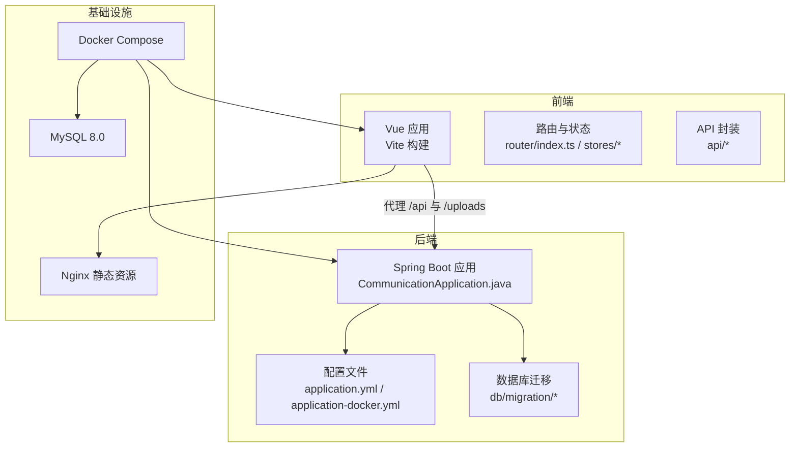
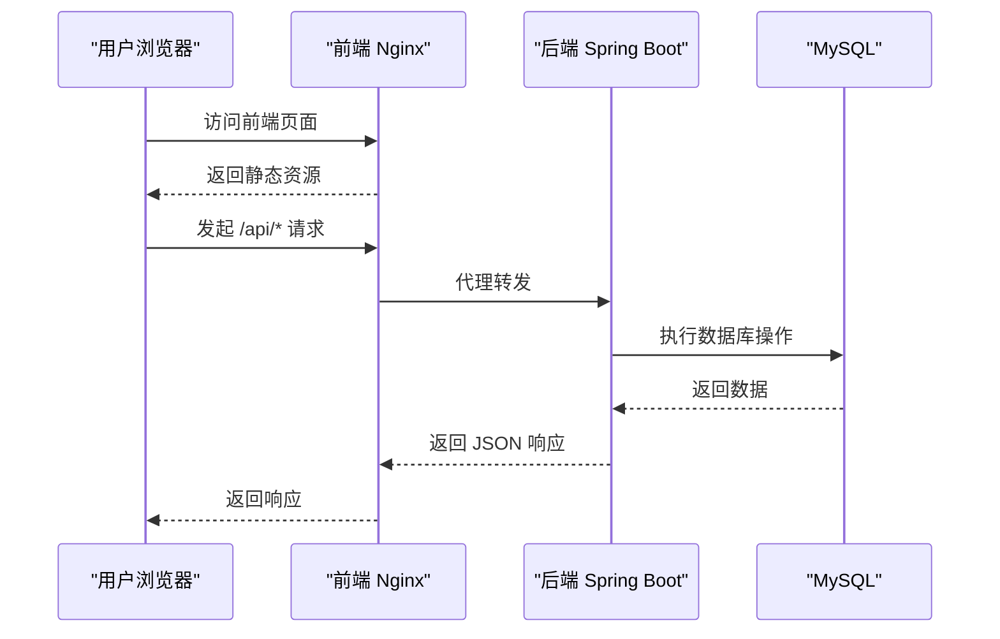
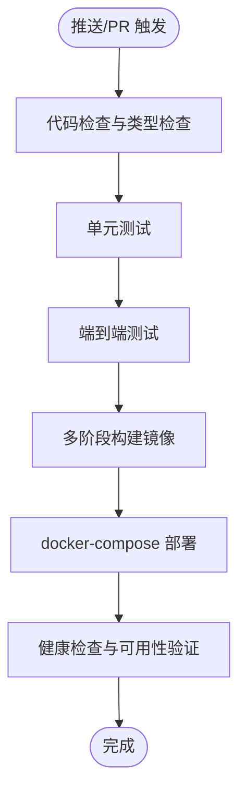
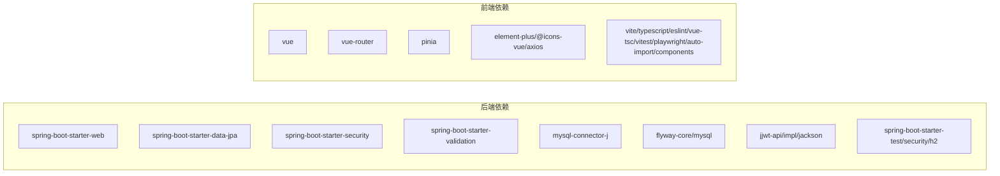

# 开发流程

<cite>
**本文引用的文件**
- [README.md](file://README.md)
- [plan.md](file://plan.md)
- [docker-compose.yml](file://docker-compose.yml)
- [communication-backend/.gitignore](file://communication-backend/.gitignore)
- [communication-frontend/.gitignore](file://communication-frontend/.gitignore)
- [communication-backend/pom.xml](file://communication-backend/pom.xml)
- [communication-frontend/package.json](file://communication-frontend/package.json)
- [communication-backend/Dockerfile](file://communication-backend/Dockerfile)
- [communication-frontend/Dockerfile](file://communication-frontend/Dockerfile)
- [communication-backend/src/main/resources/application.yml](file://communication-backend/src/main/resources/application.yml)
- [communication-backend/src/main/resources/application-docker.yml](file://communication-backend/src/main/resources/application-docker.yml)
- [communication-frontend/vite.config.ts](file://communication-frontend/vite.config.ts)
- [communication-frontend/playwright.config.ts](file://communication-frontend/playwright.config.ts)
- [communication-backend/src/main/java/com/communication/CommunicationApplication.java](file://communication-backend/src/main/java/com/communication/CommunicationApplication.java)
</cite>

## 目录
1. [引言](#引言)
2. [项目结构](#项目结构)
3. [核心组件](#核心组件)
4. [架构总览](#架构总览)
5. [详细组件分析](#详细组件分析)
6. [依赖分析](#依赖分析)
7. [性能考虑](#性能考虑)
8. [故障排查指南](#故障排查指南)
9. [结论](#结论)
10. [附录](#附录)

## 引言
本文件面向通信平台项目团队，提供一套完整且可执行的开发流程文档，覆盖 Git 工作流与分支管理、提交规范、Pull Request 与代码评审、CI/CD 流程、版本发布与变更日志、开发环境同步与团队协作、以及任务分配与进度跟踪方法。文档以仓库现有技术栈与配置为基础，结合实际文件进行说明，确保团队成员在不同阶段都能快速对齐。

## 项目结构
- 后端采用 Spring Boot 3.2 + Java 21，使用 Spring Security + JWT、Spring Data JPA + MySQL、Flyway 数据库迁移。
- 前端采用 Vue 3 + TypeScript + Vite，使用 Pinia 状态管理、Vue Router、Element Plus UI。
- 通过 Docker Compose 提供一键部署，包含 MySQL、后端服务与前端 Nginx。
- 项目包含开发计划文档，明确迭代目标、API 端点与测试验证方式。

图表来源
- [communication-backend/src/main/java/com/communication/CommunicationApplication.java](file://communication-backend/src/main/java/com/communication/CommunicationApplication.java#L1-L13)
- [communication-backend/src/main/resources/application.yml](file://communication-backend/src/main/resources/application.yml#L1-L42)
- [communication-backend/src/main/resources/application-docker.yml](file://communication-backend/src/main/resources/application-docker.yml#L1-L43)
- [docker-compose.yml](file://docker-compose.yml#L1-L60)
- [communication-frontend/vite.config.ts](file://communication-frontend/vite.config.ts#L1-L40)

章节来源
- [README.md](file://README.md#L20-L36)
- [plan.md](file://plan.md#L62-L94)

## 核心组件
- 后端应用入口与配置
  - 应用入口类用于启动 Spring Boot 服务。
  - 开发与 Docker 环境分别使用不同的配置文件，确保本地与容器环境参数一致。
- 前端开发与构建
  - 使用 Vite 开发服务器与构建工具，配置了 API 代理与静态资源代理。
  - Playwright 用于端到端测试，Vitest 用于单元测试。
- 持续交付
  - 后端与前端分别提供多阶段 Dockerfile，配合 docker-compose 实现一键编排。
- 版本与依赖
  - 后端使用 Maven 管理依赖与构建；前端使用 pnpm 管理依赖与脚本。

章节来源
- [communication-backend/src/main/java/com/communication/CommunicationApplication.java](file://communication-backend/src/main/java/com/communication/CommunicationApplication.java#L1-L13)
- [communication-backend/src/main/resources/application.yml](file://communication-backend/src/main/resources/application.yml#L1-L42)
- [communication-backend/src/main/resources/application-docker.yml](file://communication-backend/src/main/resources/application-docker.yml#L1-L43)
- [communication-backend/Dockerfile](file://communication-backend/Dockerfile#L1-L32)
- [communication-frontend/Dockerfile](file://communication-frontend/Dockerfile#L1-L33)
- [docker-compose.yml](file://docker-compose.yml#L1-L60)
- [communication-backend/pom.xml](file://communication-backend/pom.xml#L1-L114)
- [communication-frontend/package.json](file://communication-frontend/package.json#L1-L36)
- [communication-frontend/vite.config.ts](file://communication-frontend/vite.config.ts#L1-L40)
- [communication-frontend/playwright.config.ts](file://communication-frontend/playwright.config.ts#L1-L26)

## 架构总览
下图展示了从浏览器到后端 API 的典型请求链路，以及静态资源的提供方式。

图表来源
- [docker-compose.yml](file://docker-compose.yml#L46-L55)
- [communication-frontend/vite.config.ts](file://communication-frontend/vite.config.ts#L26-L38)
- [communication-backend/src/main/resources/application.yml](file://communication-backend/src/main/resources/application.yml#L5-L18)

## 详细组件分析

### Git 工作流与分支管理策略
- 分支模型建议采用 Git Flow 或简化版 GitHub Flow，结合本项目的技术栈与迭代节奏，推荐如下命名与用途：
  - main/master：生产就绪分支，合并窗口期稳定。
  - develop：集成分支，每日构建与测试通过后合并至 main。
  - feature/*：功能开发分支，基于 develop 创建，完成后合并回 develop。
  - release/*：预发布分支，从 develop 创建，仅做缺陷修复与最终准备，完成后合并至 main 并打标签。
  - hotfix/*：线上紧急修复分支，从 main 创建，修复后同时合并回 main 与 develop。
- 合并要求
  - 所有功能与修复必须通过 Pull Request 合并，禁止直接 push 至主分支。
  - 合并前需满足：通过 CI、代码评审通过、无冲突、提交信息规范。

章节来源
- [README.md](file://README.md#L1-L193)
- [plan.md](file://plan.md#L98-L221)

### 提交规范与提交信息格式
- 提交信息格式建议遵循以下结构，便于生成变更日志与自动化处理：
  - 类型: 功能/修复/文档/样式/重构/测试/其他
  - 范围: 影响模块或文件范围（如后端/前端/数据库/CI）
  - 描述: 简洁说明变更内容
  - 关联: 可选，关联 Issue 或 PR 编号
- 示例格式
  - feat(后端): 新增内容标签搜索接口
  - fix(前端): 修复评论列表空状态显示
  - docs(通用): 更新开发流程与分支规范
  - chore(CI): 更新 Dockerfile 多阶段构建
- 工具建议
  - 使用 commitlint + husky 在本地校验提交信息格式。
  - 使用 conventional commits 生成 CHANGELOG。

章节来源
- [README.md](file://README.md#L1-L193)
- [plan.md](file://plan.md#L98-L221)

### Pull Request 流程与代码评审标准
- PR 流程
  - 基于对应功能分支创建 PR，选择合适的 reviewers。
  - PR 描述需包含：变更动机、改动范围、测试验证方式、风险提示与回滚预案。
  - 通过 CI 与自动检查（lint、类型检查、测试）后再进入评审。
- 评审标准
  - 正确性：需求覆盖、边界处理、异常场景。
  - 可维护性：命名清晰、函数职责单一、注释与文档完善。
  - 性能与安全：避免 N+1 查询、SQL 注入与敏感信息泄露。
  - 兼容性：接口兼容、数据库迁移幂等、前端向后兼容。
- 评审通过后方可合并，合并后清理分支。

章节来源
- [README.md](file://README.md#L1-L193)
- [plan.md](file://plan.md#L254-L271)

### 持续集成与持续部署（CI/CD）
- CI 能力
  - 后端：Maven 构建、单元测试、依赖缓存、JDK 17/21。
  - 前端：pnpm 安装依赖、类型检查、单元测试、端到端测试（Playwright）。
  - 数据库：Flyway 自动迁移，确保测试与生产数据库结构一致。
- CD 能力
  - Docker 多阶段构建：后端打包为可执行 JAR，前端使用 Nginx 提供静态资源。
  - docker-compose 编排：一键启动 MySQL、后端、前端，支持环境变量注入。
- 最佳实践
  - 将 CI 作为“合并门禁”，PR 必须通过 CI 才能合并。
  - 生产环境使用 application-docker.yml，确保数据库连接、JWT 密钥与上传路径正确。
  - 上传目录映射持久化，避免容器重启丢失文件。

图表来源
- [communication-backend/pom.xml](file://communication-backend/pom.xml#L96-L112)
- [communication-frontend/package.json](file://communication-frontend/package.json#L6-L14)
- [communication-backend/Dockerfile](file://communication-backend/Dockerfile#L1-L32)
- [communication-frontend/Dockerfile](file://communication-frontend/Dockerfile#L1-L33)
- [docker-compose.yml](file://docker-compose.yml#L1-L60)

章节来源
- [communication-backend/pom.xml](file://communication-backend/pom.xml#L1-L114)
- [communication-frontend/package.json](file://communication-frontend/package.json#L1-L36)
- [communication-backend/Dockerfile](file://communication-backend/Dockerfile#L1-L32)
- [communication-frontend/Dockerfile](file://communication-frontend/Dockerfile#L1-L33)
- [docker-compose.yml](file://docker-compose.yml#L1-L60)

### 版本发布策略与变更日志管理
- 版本策略
  - 语义化版本：主版本号.次版本号.修订号，遵循破坏性变更、新增功能、缺陷修复的规则。
  - 发布分支：release/* 用于预发布，完成后合并至 main 并打标签。
- 变更日志
  - 使用 conventional-changelog 或类似工具，基于提交信息自动生成变更日志。
  - 日志按模块拆分（后端/前端/数据库/CI），突出重大变更与破坏性更新。
- 发布流程
  - 在 release/* 分支完成最终测试与文档更新。
  - 合并至 main，打上版本标签，推送标签触发 CI 构建镜像并发布。

章节来源
- [README.md](file://README.md#L1-L193)
- [plan.md](file://plan.md#L98-L221)

### 开发环境同步与团队协作最佳实践
- 环境同步
  - 使用 docker-compose 一键拉起完整环境，减少本地差异。
  - 前端通过 Vite 代理将 /api 与 /uploads 指向后端，避免跨域与端口不一致问题。
  - 后端 application-docker.yml 与环境变量对接，确保容器内参数正确。
- 团队协作
  - 统一分支命名与 PR 模板，明确评审人与检查项。
  - 使用 issue 跟踪任务，PR 关联 issue，保持变更可追溯。
  - 定期同步 develop 分支，避免长期偏离导致合并冲突。

章节来源
- [docker-compose.yml](file://docker-compose.yml#L1-L60)
- [communication-frontend/vite.config.ts](file://communication-frontend/vite.config.ts#L26-L38)
- [communication-backend/src/main/resources/application-docker.yml](file://communication-backend/src/main/resources/application-docker.yml#L1-L43)

### 开发任务分配与进度跟踪
- 迭代计划参考
  - 项目计划文档提供了六个迭代的目标与验收标准，可作为任务拆分与里程碑设定依据。
- 任务分配
  - 将迭代目标拆分为功能模块（认证、内容、评论、订阅、搜索、后台），指派给相应开发者。
  - 每个功能模块包含后端接口、前端页面与测试用例，确保全栈覆盖。
- 进度跟踪
  - 使用 issue 与里程碑跟踪，结合 PR 与 CI 状态可视化。
  - 每日站会同步阻塞问题与依赖，及时调整计划。

章节来源
- [plan.md](file://plan.md#L98-L221)

## 依赖分析
- 后端依赖
  - Spring 生态：Web、Data JPA、Security、Validation。
  - 数据库：MySQL Connector、Flyway。
  - JWT：jjwt。
  - 测试：Spring Boot Test、Spring Security Test、H2。
- 前端依赖
  - 运行时：Vue 3、Vue Router、Pinia、Element Plus、Axios。
  - 开发工具：Vite、TypeScript、ESLint、Vue TSC、Vitest、Playwright、Auto Import 与组件解析器。

图表来源
- [communication-backend/pom.xml](file://communication-backend/pom.xml#L25-L94)
- [communication-frontend/package.json](file://communication-frontend/package.json#L15-L34)

章节来源
- [communication-backend/pom.xml](file://communication-backend/pom.xml#L1-L114)
- [communication-frontend/package.json](file://communication-frontend/package.json#L1-L36)

## 性能考虑
- 数据库
  - 使用 Flyway 管理迁移，避免手工变更导致不一致。
  - 合理设置连接池参数，生产环境启用只读迁移策略。
- 应用
  - 后端使用 JPA 与 MySQL，注意避免 N+1 查询，必要时使用 JOIN FETCH 或批量抓取。
  - 前端静态资源由 Nginx 提供，减少后端压力。
- 文件上传
  - 控制最大文件大小与允许类型，避免资源滥用。
- 构建与部署
  - 多阶段 Docker 构建减小镜像体积，提升启动速度与安全性。

章节来源
- [communication-backend/src/main/resources/application.yml](file://communication-backend/src/main/resources/application.yml#L20-L28)
- [communication-backend/src/main/resources/application-docker.yml](file://communication-backend/src/main/resources/application-docker.yml#L8-L11)
- [communication-backend/Dockerfile](file://communication-backend/Dockerfile#L1-L32)
- [communication-frontend/Dockerfile](file://communication-frontend/Dockerfile#L1-L33)

## 故障排查指南
- 启动失败
  - 检查数据库连接参数与网络连通性，确认容器健康检查通过。
  - 核对环境变量是否正确注入（数据库 URL、用户名、密码、JWT 密钥、上传路径）。
- 端口冲突
  - 修改 docker-compose 映射端口或释放占用端口。
- 代理与跨域
  - 确认前端 Vite 代理配置指向后端地址，避免 404 与跨域错误。
- 文件上传
  - 检查上传目录权限与挂载卷，确保容器内可写。
- 测试失败
  - 后端运行单元测试，前端运行 Vitest 与 Playwright，定位失败用例并修复。

章节来源
- [docker-compose.yml](file://docker-compose.yml#L1-L60)
- [communication-frontend/vite.config.ts](file://communication-frontend/vite.config.ts#L26-L38)
- [communication-backend/src/main/resources/application-docker.yml](file://communication-backend/src/main/resources/application-docker.yml#L32-L37)
- [communication-backend/.gitignore](file://communication-backend/.gitignore#L39-L41)
- [communication-frontend/.gitignore](file://communication-frontend/.gitignore#L10-L13)

## 结论
本开发流程文档以项目现有技术栈与配置为依据，给出了从分支管理、提交规范、PR 评审到 CI/CD、版本发布与团队协作的完整方案。建议团队在实践中逐步完善自动化工具链（如 commitlint、husky、conventional changelog），并根据迭代反馈持续优化流程，确保高质量交付与高效协作。

## 附录
- 快速开始
  - Docker 一键部署：在项目根目录执行 docker-compose 启动服务。
  - 本地开发：后端使用 Maven，前端使用 pnpm，分别启动后端与前端服务。
- API 文档与测试
  - 参考 README 中的 API 端点与测试命令，结合项目计划中的核心 E2E 旅程进行验证。

章节来源
- [README.md](file://README.md#L38-L98)
- [plan.md](file://plan.md#L224-L271)