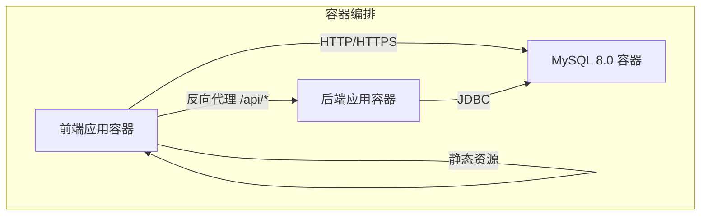
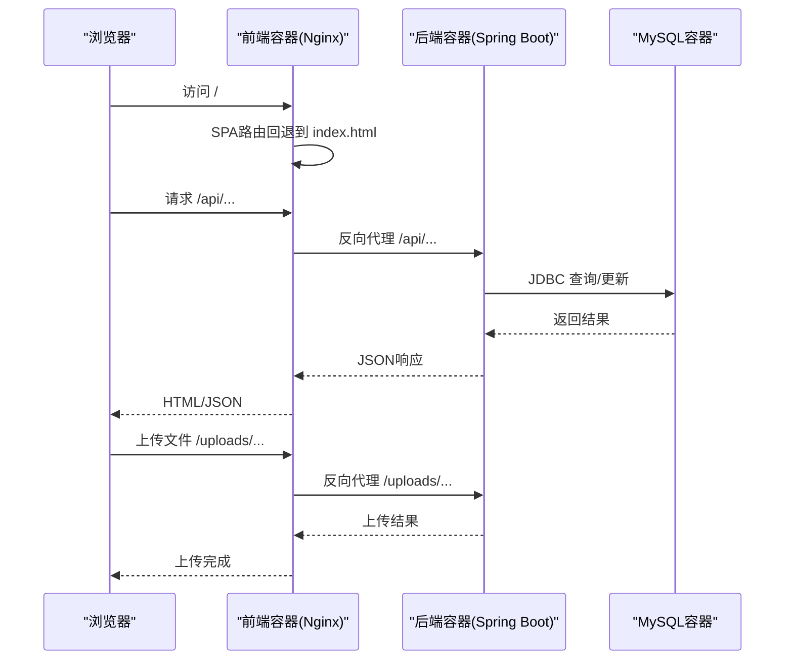
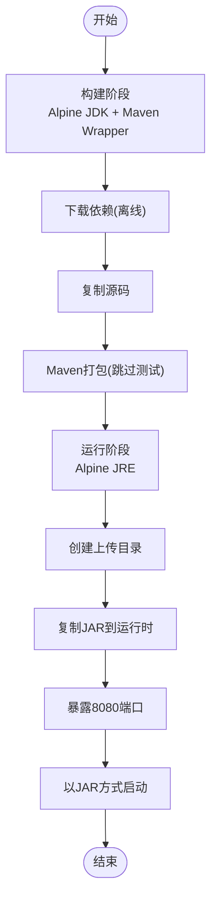
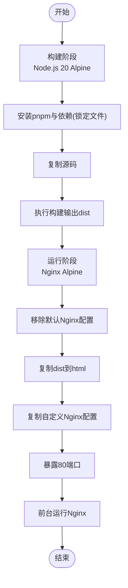
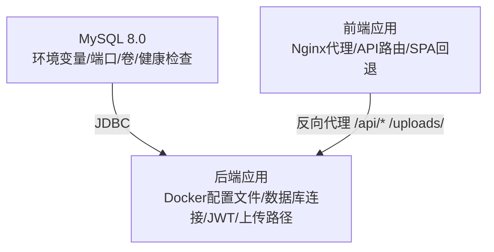
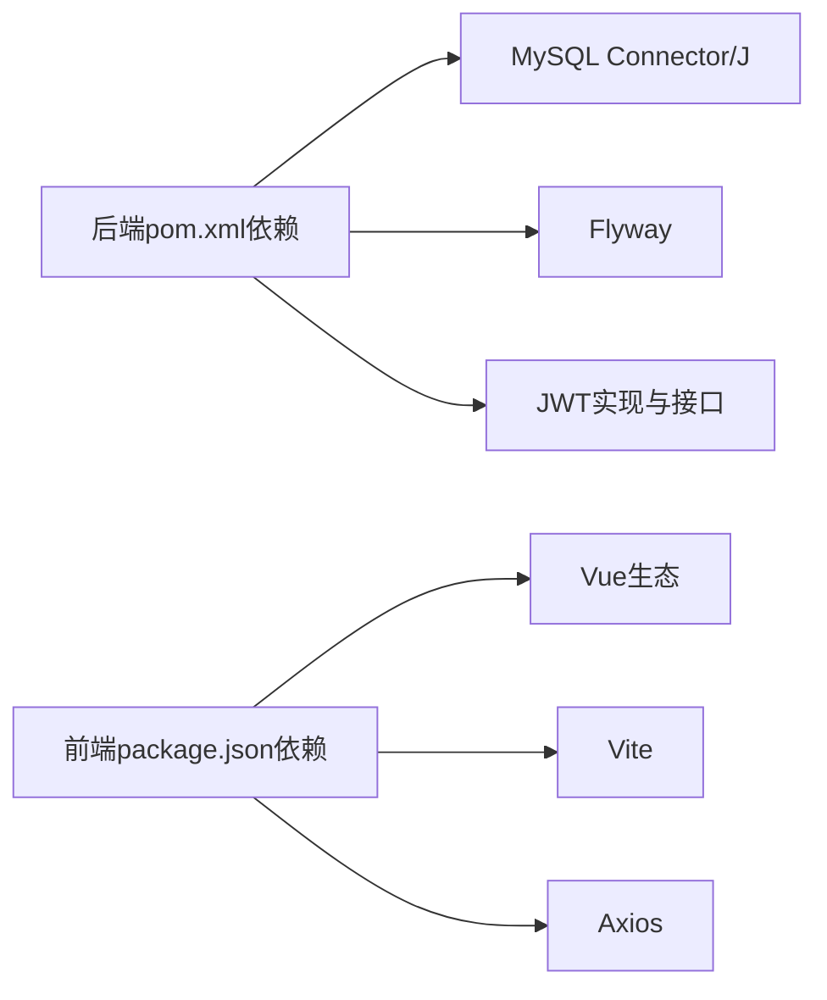

# Docker构建配置

<cite>
**本文档引用的文件**
- [communication-backend/Dockerfile](file://communication-backend/Dockerfile)
- [communication-frontend/Dockerfile](file://communication-frontend/Dockerfile)
- [docker-compose.yml](file://docker-compose.yml)
- [communication-frontend/nginx.conf](file://communication-frontend/nginx.conf)
- [communication-backend/src/main/resources/application-docker.yml](file://communication-backend/src/main/resources/application-docker.yml)
- [communication-backend/pom.xml](file://communication-backend/pom.xml)
- [communication-frontend/package.json](file://communication-frontend/package.json)
- [init.sql](file://init.sql)
</cite>

## 目录
1. [简介](#简介)
2. [项目结构](#项目结构)
3. [核心组件](#核心组件)
4. [架构总览](#架构总览)
5. [详细组件分析](#详细组件分析)
6. [依赖关系分析](#依赖关系分析)
7. [性能考虑](#性能考虑)
8. [故障排除指南](#故障排除指南)
9. [结论](#结论)
10. [附录](#附录)

## 简介
本文件面向通信平台的Docker容器化部署，系统性阐述后端与前端的多阶段构建策略、docker-compose服务编排、镜像优化技巧以及完整的部署与故障排除流程。读者无需深厚的容器化背景即可理解并实施该方案。

## 项目结构
通信平台采用前后端分离的容器化架构：
- 后端使用Spring Boot，基于Maven多阶段构建，最终在轻量JRE运行时中运行。
- 前端使用Vite构建，产物由Nginx提供静态服务，并通过Nginx代理转发API请求到后端。
- docker-compose统一编排MySQL数据库、后端应用与前端应用，实现一键启动与健康检查。

图表来源
- [docker-compose.yml](file://docker-compose.yml#L1-L60)

章节来源
- [docker-compose.yml](file://docker-compose.yml#L1-L60)

## 核心组件
- 后端Dockerfile（多阶段构建）
  - 构建阶段：使用Alpine JDK，下载依赖，复制源码并打包生成可执行JAR。
  - 运行阶段：使用Alpine JRE，创建上传目录，复制JAR并以JAR方式启动。
- 前端Dockerfile（多阶段构建）
  - 构建阶段：使用Node.js Alpine，安装pnpm与依赖，构建静态资源。
  - 生产阶段：使用Nginx Alpine，移除默认配置，复制构建产物与自定义Nginx配置，暴露80端口。
- docker-compose.yml
  - MySQL：持久化数据卷、初始化脚本、健康检查、字符集与认证插件配置。
  - 后端：激活Docker配置文件、连接MySQL、设置JWT密钥与上传路径、依赖MySQL健康状态。
  - 前端：依赖后端可用，映射80端口。
- Nginx配置
  - 反向代理/API路由：将/api/前缀代理至后端8080端口，支持WebSocket升级。
  - 上传资源：将/uploads/前缀代理至后端上传接口。
  - 单页应用路由：对SPA进行回退到index.html。
  - 静态资源缓存：对JS/CSS/字体/图片等设置一年缓存与immutable头。
- 应用配置（Docker环境）
  - 数据库连接：通过环境变量注入，使用服务名作为主机名。
  - Flyway迁移：启用并指定迁移脚本位置。
  - 文件上传：限制最大文件大小与请求大小。
  - JWT：从环境变量读取密钥与过期时间。
  - 日志级别：生产环境下设置INFO级别。

章节来源
- [communication-backend/Dockerfile](file://communication-backend/Dockerfile#L1-L32)
- [communication-frontend/Dockerfile](file://communication-frontend/Dockerfile#L1-L33)
- [docker-compose.yml](file://docker-compose.yml#L1-L60)
- [communication-frontend/nginx.conf](file://communication-frontend/nginx.conf#L1-L42)
- [communication-backend/src/main/resources/application-docker.yml](file://communication-backend/src/main/resources/application-docker.yml#L1-L43)

## 架构总览
下图展示容器间交互与数据流：前端通过Nginx代理访问后端API与上传接口；后端通过JDBC访问MySQL；数据库初始化脚本在首次启动时执行。

图表来源
- [docker-compose.yml](file://docker-compose.yml#L1-L60)
- [communication-frontend/nginx.conf](file://communication-frontend/nginx.conf#L11-L29)

## 详细组件分析

### 后端Dockerfile多阶段构建
- 基础镜像选择
  - 构建阶段：使用Alpine JDK，体积小且包含必要工具链。
  - 运行阶段：使用Alpine JRE，仅包含运行时，显著减少镜像体积。
- 依赖安装与缓存
  - 使用Maven Wrapper与离线模式提前下载依赖，提升构建稳定性与速度。
  - 复制pom与源码顺序合理，便于利用Docker层缓存。
- 应用打包与运行
  - 打包阶段跳过测试，缩短构建时间。
  - 运行阶段创建上传目录，确保文件写入权限。
  - 通过ENTRYPOINT以JAR方式启动，便于参数传递与进程管理。
- 端口与入口
  - 暴露8080端口，ENTRYPOINT直接运行JAR，便于外部访问。

图表来源
- [communication-backend/Dockerfile](file://communication-backend/Dockerfile#L1-L32)

章节来源
- [communication-backend/Dockerfile](file://communication-backend/Dockerfile#L1-L32)
- [communication-backend/pom.xml](file://communication-backend/pom.xml#L1-L114)

### 前端Dockerfile多阶段构建
- Node.js环境配置
  - 使用Node.js 20 Alpine，安装pnpm并使用锁定文件保证依赖一致性。
- 依赖安装与构建
  - 先复制package.json与锁定文件，再安装依赖，充分利用Docker层缓存。
  - 构建阶段复制全部源码并执行构建，输出dist目录。
- Nginx配置与静态资源
  - 运行阶段移除默认Nginx配置，复制构建产物与自定义conf。
  - 暴露80端口，前台运行Nginx，支持热更新与日志输出。
- API与上传代理
  - Nginx配置将/api/与/uploads/前缀代理到后端，支持WebSocket升级与真实IP透传。

图表来源
- [communication-frontend/Dockerfile](file://communication-frontend/Dockerfile#L1-L33)
- [communication-frontend/nginx.conf](file://communication-frontend/nginx.conf#L1-L42)

章节来源
- [communication-frontend/Dockerfile](file://communication-frontend/Dockerfile#L1-L33)
- [communication-frontend/nginx.conf](file://communication-frontend/nginx.conf#L1-L42)
- [communication-frontend/package.json](file://communication-frontend/package.json#L1-L36)

### docker-compose服务编排
- MySQL服务
  - 镜像版本：8.0，字符集utf8mb4与认证插件配置。
  - 环境变量：根密码、数据库名、用户与密码。
  - 端口映射：3306:3306。
  - 卷挂载：数据持久化卷与初始化脚本只读挂载。
  - 健康检查：基于mysqladmin ping。
- 后端服务
  - 构建上下文：communication-backend。
  - 环境变量：激活Docker配置文件、数据库URL、用户名、密码、JWT密钥、上传路径。
  - 端口映射：8080:8080。
  - 卷挂载：上传目录持久化。
  - 依赖：等待MySQL健康后再启动。
- 前端服务
  - 构建上下文：communication-frontend。
  - 端口映射：80:80。
  - 依赖：等待后端可用后再启动。
- 数据卷
  - mysql_data：MySQL数据持久化。
  - uploads_data：后端上传目录持久化。

图表来源
- [docker-compose.yml](file://docker-compose.yml#L1-L60)

章节来源
- [docker-compose.yml](file://docker-compose.yml#L1-L60)

### 应用配置（Docker环境）
- 数据源与连接池
  - URL、用户名、密码通过环境变量注入，驱动类名与Hikari连接池参数配置。
- JPA/Hibernate
  - DDL策略为none，关闭SQL打印，方言为MySQL。
- Flyway迁移
  - 启用并指定迁移脚本位置，启用基线迁移。
- Servlet上传
  - 最大文件大小与请求大小限制。
- JWT
  - 密钥与过期时间从环境变量读取。
- 日志
  - 根日志级别与业务包日志级别设置为INFO。

章节来源
- [communication-backend/src/main/resources/application-docker.yml](file://communication-backend/src/main/resources/application-docker.yml#L1-L43)

## 依赖关系分析
- 组件耦合
  - 前端依赖后端API与上传接口；后端依赖MySQL数据库。
  - docker-compose通过服务名实现容器间DNS解析与通信。
- 外部依赖
  - 后端：MySQL Connector/J、Flyway、JWT相关依赖。
  - 前端：Vue生态、Vite、Axios等。
- 潜在循环依赖
  - 无直接循环依赖，通过compose的depends_on与健康检查避免启动顺序问题。

图表来源
- [communication-backend/pom.xml](file://communication-backend/pom.xml#L25-L94)
- [communication-frontend/package.json](file://communication-frontend/package.json#L15-L34)

章节来源
- [communication-backend/pom.xml](file://communication-backend/pom.xml#L25-L94)
- [communication-frontend/package.json](file://communication-frontend/package.json#L15-L34)

## 性能考虑
- 镜像大小优化
  - 后端：使用Alpine JRE运行时替代完整JDK，显著减小镜像体积。
  - 前端：使用Alpine Nginx，移除默认配置，仅复制必要文件。
- 构建缓存利用
  - 后端：先复制pom与.mvn，再复制源码，使依赖下载层稳定复用。
  - 前端：先复制package.json与锁定文件，再复制源码，避免重复安装依赖。
- 多阶段构建最佳实践
  - 明确区分构建与运行阶段，仅在运行阶段保留最小运行时依赖。
  - 在构建阶段使用更丰富的工具链，在运行阶段使用精简镜像。
- 运行时优化
  - Nginx启用Gzip压缩与静态资源缓存，降低带宽与CPU消耗。
  - 后端连接池参数与日志级别适配容器环境。

## 故障排除指南
- 数据库未初始化或字符集不匹配
  - 检查初始化脚本是否正确挂载与执行。
  - 确认MySQL命令参数包含字符集与认证插件配置。
- 后端无法连接数据库
  - 核对环境变量中的数据库URL、用户名、密码。
  - 确认后端容器已等待MySQL健康后再启动。
- 前端API调用失败
  - 检查Nginx代理配置是否正确指向后端8080端口。
  - 确认后端容器已启动并监听8080端口。
- 上传功能异常
  - 确认上传目录已创建并具有写权限。
  - 检查Nginx对/uploads/的代理配置。
- JWT鉴权问题
  - 确认JWT密钥已在环境变量中正确设置。
- 健康检查失败
  - 查看compose日志与容器状态，确认服务名与端口配置正确。

章节来源
- [docker-compose.yml](file://docker-compose.yml#L1-L60)
- [communication-frontend/nginx.conf](file://communication-frontend/nginx.conf#L11-L29)
- [communication-backend/src/main/resources/application-docker.yml](file://communication-backend/src/main/resources/application-docker.yml#L32-L37)

## 结论
该容器化方案通过多阶段构建与精简运行时镜像实现了较小的镜像体积与较快的启动速度；docker-compose提供了清晰的服务编排与健康检查机制；Nginx代理与SPA路由配置满足现代前端应用需求。结合本文提供的优化建议与故障排除指南，可高效完成通信平台的容器化部署与运维。

## 附录
- 初始化脚本
  - 提供数据库创建语句，确保首次启动时数据库存在。
- 环境变量清单
  - 后端：SPRING_PROFILES_ACTIVE、SPRING_DATASOURCE_URL、SPRING_DATASOURCE_USERNAME、SPRING_DATASOURCE_PASSWORD、JWT_SECRET、UPLOAD_PATH。
  - 前端：无需额外环境变量，依赖后端服务名进行通信。

章节来源
- [init.sql](file://init.sql#L1-L3)
- [docker-compose.yml](file://docker-compose.yml#L31-L37)