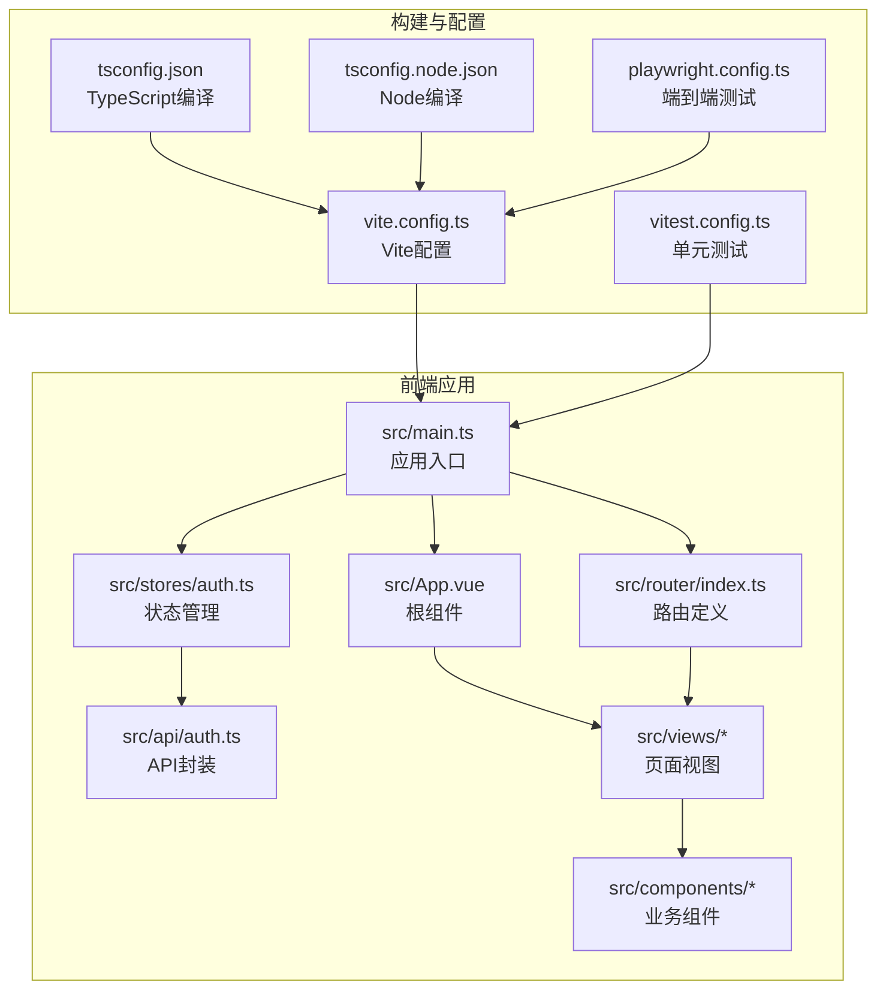
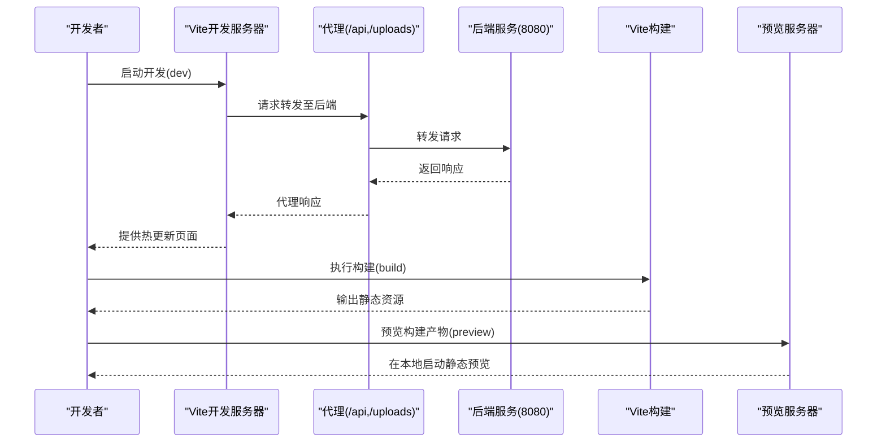
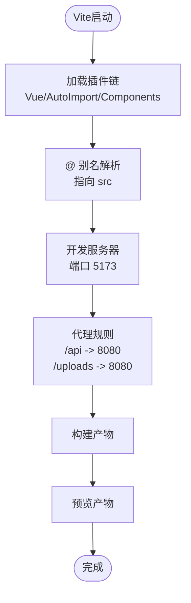
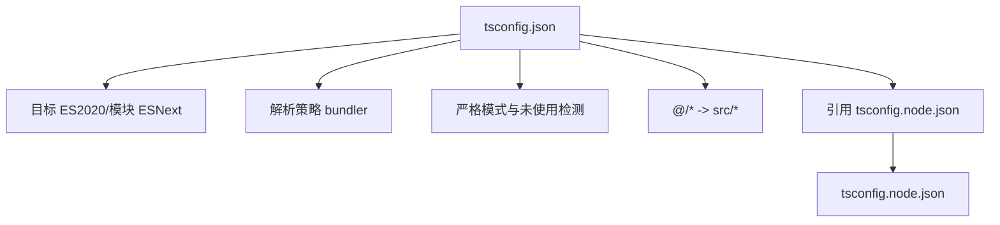
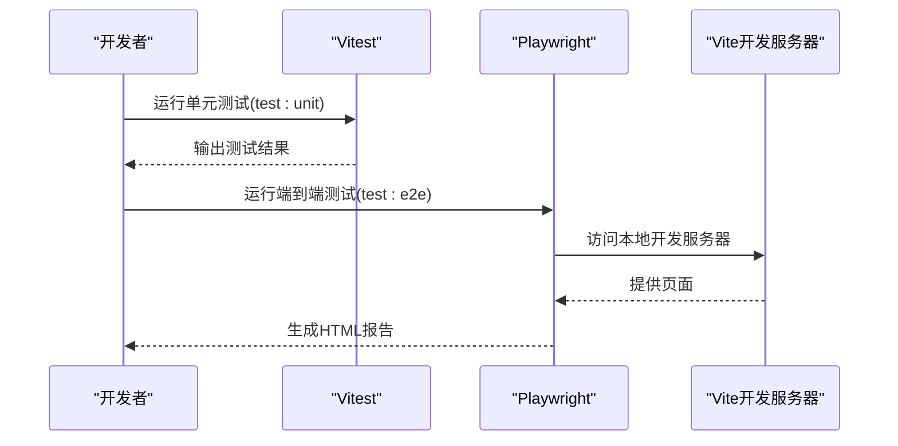
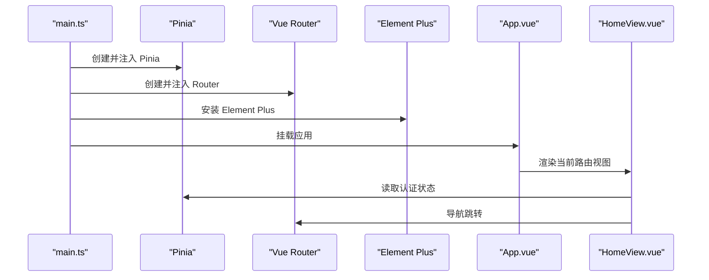
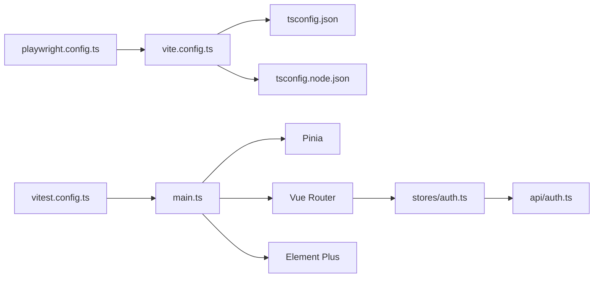

# 前端构建配置

<cite>
**本文引用的文件**
- [vite.config.ts](file://communication-frontend/vite.config.ts)
- [package.json](file://communication-frontend/package.json)
- [tsconfig.json](file://communication-frontend/tsconfig.json)
- [tsconfig.node.json](file://communication-frontend/tsconfig.node.json)
- [vitest.config.ts](file://communication-frontend/vitest.config.ts)
- [playwright.config.ts](file://communication-frontend/playwright.config.ts)
- [main.ts](file://communication-frontend/src/main.ts)
- [router/index.ts](file://communication-frontend/src/router/index.ts)
- [stores/auth.ts](file://communication-frontend/src/stores/auth.ts)
- [api/auth.ts](file://communication-frontend/src/api/auth.ts)
- [App.vue](file://communication-frontend/src/App.vue)
- [HomeView.vue](file://communication-frontend/src/views/HomeView.vue)
</cite>

## 目录
1. [简介](#简介)
2. [项目结构](#项目结构)
3. [核心组件](#核心组件)
4. [架构总览](#架构总览)
5. [详细组件分析](#详细组件分析)
6. [依赖关系分析](#依赖关系分析)
7. [性能考虑](#性能考虑)
8. [故障排查指南](#故障排查指南)
9. [结论](#结论)
10. [附录](#附录)

## 简介
本文件面向通信平台前端，系统性梳理并解读Vite构建配置、TypeScript编译配置、测试配置与依赖管理，帮助开发者在开发与生产环境中高效构建与运行应用。文档同时提供性能优化建议与差异化配置方案，覆盖代码分割、懒加载、代理与构建优化等关键主题。

## 项目结构
前端项目采用Vue 3 + TypeScript + Vite + Pinia + Vue Router + Element Plus技术栈，核心目录与关键配置如下：
- 构建与工具：vite.config.ts、tsconfig.json、tsconfig.node.json、vitest.config.ts、playwright.config.ts
- 应用入口与路由：src/main.ts、src/router/index.ts
- 状态管理：src/stores/auth.ts
- API封装：src/api/auth.ts
- 视图与组件：src/views、src/components、src/App.vue
- 资源与样式：public、src/styles

图表来源
- [vite.config.ts](file://communication-frontend/vite.config.ts#L1-L40)
- [tsconfig.json](file://communication-frontend/tsconfig.json#L1-L26)
- [tsconfig.node.json](file://communication-frontend/tsconfig.node.json#L1-L12)
- [vitest.config.ts](file://communication-frontend/vitest.config.ts#L1-L18)
- [playwright.config.ts](file://communication-frontend/playwright.config.ts#L1-L26)
- [main.ts](file://communication-frontend/src/main.ts#L1-L17)
- [router/index.ts](file://communication-frontend/src/router/index.ts#L1-L98)
- [stores/auth.ts](file://communication-frontend/src/stores/auth.ts#L1-L96)
- [api/auth.ts](file://communication-frontend/src/api/auth.ts#L1-L49)
- [App.vue](file://communication-frontend/src/App.vue#L1-L30)

章节来源
- [vite.config.ts](file://communication-frontend/vite.config.ts#L1-L40)
- [package.json](file://communication-frontend/package.json#L1-L36)
- [tsconfig.json](file://communication-frontend/tsconfig.json#L1-L26)
- [tsconfig.node.json](file://communication-frontend/tsconfig.node.json#L1-L12)
- [vitest.config.ts](file://communication-frontend/vitest.config.ts#L1-L18)
- [playwright.config.ts](file://communication-frontend/playwright.config.ts#L1-L26)
- [main.ts](file://communication-frontend/src/main.ts#L1-L17)
- [router/index.ts](file://communication-frontend/src/router/index.ts#L1-L98)
- [stores/auth.ts](file://communication-frontend/src/stores/auth.ts#L1-L96)
- [api/auth.ts](file://communication-frontend/src/api/auth.ts#L1-L49)
- [App.vue](file://communication-frontend/src/App.vue#L1-L30)

## 核心组件
本节聚焦于构建与开发体验相关的核心配置组件及其职责。

- Vite配置（vite.config.ts）
  - 插件体系：Vue单文件组件支持、自动导入与组件自动注册、Element Plus解析器
  - 路径别名：@ 指向 src 目录，提升导入便捷性
  - 开发服务器：本地端口与API代理（/api、/uploads），便于前后端联调
- TypeScript配置（tsconfig.json、tsconfig.node.json）
  - 编译目标与模块解析：ESNext、bundler解析策略，适配现代打包器
  - 路径映射：@/* 对应 src/*
  - 参考关系：引用 tsconfig.node.json，确保Vite配置类型检查
- 测试配置（vitest.config.ts、playwright.config.ts）
  - 单元测试：jsdom环境、全局测试启用、按路径模式匹配测试文件
  - 端到端测试：基于Playwright，本地开发服务器复用，浏览器设备配置
- 依赖与脚本（package.json）
  - 运行时依赖：Vue 3、Vue Router、Pinia、Element Plus、Axios
  - 开发依赖：Vite、Vue插件、TypeScript、Vitest、Playwright、自动导入与组件扫描插件
  - 脚本命令：dev、build、preview、test:unit、test:e2e、lint、type-check

章节来源
- [vite.config.ts](file://communication-frontend/vite.config.ts#L1-L40)
- [tsconfig.json](file://communication-frontend/tsconfig.json#L1-L26)
- [tsconfig.node.json](file://communication-frontend/tsconfig.node.json#L1-L12)
- [vitest.config.ts](file://communication-frontend/vitest.config.ts#L1-L18)
- [playwright.config.ts](file://communication-frontend/playwright.config.ts#L1-L26)
- [package.json](file://communication-frontend/package.json#L1-L36)

## 架构总览
下图展示从开发到构建的关键流程，以及配置对各环节的影响。

图表来源
- [vite.config.ts](file://communication-frontend/vite.config.ts#L26-L38)
- [package.json](file://communication-frontend/package.json#L6-L14)

章节来源
- [vite.config.ts](file://communication-frontend/vite.config.ts#L26-L38)
- [package.json](file://communication-frontend/package.json#L6-L14)

## 详细组件分析

### Vite配置组件分析
- 插件链路
  - Vue单文件组件：提供模板、脚本与样式的统一处理
  - 自动导入：自动引入vue、vue-router、pinia，生成声明文件，减少样板代码
  - 组件自动注册：自动注册Element Plus组件，降低手动引入成本
- 路径别名
  - 使用 @ 指向 src，统一相对路径，提升可读性与维护性
- 开发服务器与代理
  - 端口：5173
  - 代理：/api 与 /uploads 转发至 http://localhost:8080，便于联调后端接口
- 生产构建
  - 默认由Vite处理代码分割与压缩；如需更细粒度优化，可在扩展配置中加入rollupOptions与插件

图表来源
- [vite.config.ts](file://communication-frontend/vite.config.ts#L8-L39)

章节来源
- [vite.config.ts](file://communication-frontend/vite.config.ts#L8-L39)

### TypeScript配置组件分析
- 编译选项
  - 目标与模块：ES2020、ESNext，适配现代浏览器与打包器
  - 解析策略：bundler，避免传统node解析带来的兼容问题
  - 严格性：开启严格模式、未使用变量/参数检测、switch穷举校验
  - JSX：保留，便于TSX场景
- 路径映射
  - @/* 映射到 src/*，与Vite别名保持一致
- 参考关系
  - 引用 tsconfig.node.json，确保Vite配置文件类型检查通过

图表来源
- [tsconfig.json](file://communication-frontend/tsconfig.json#L2-L25)
- [tsconfig.node.json](file://communication-frontend/tsconfig.node.json#L1-L12)

章节来源
- [tsconfig.json](file://communication-frontend/tsconfig.json#L2-L25)
- [tsconfig.node.json](file://communication-frontend/tsconfig.node.json#L1-L12)

### 测试配置组件分析
- Vitest（单元测试）
  - 环境：jsdom，模拟DOM以支持Vue组件测试
  - 全局：启用测试全局API
  - 匹配：按 src/**/*.{test,spec}.{js,ts} 规则收集测试
  - 别名：与Vite一致的 @ 别名
- Playwright（端到端测试）
  - 测试目录：./e2e
  - 并行与重试：CI环境下启用并行与重试策略
  - 报告器：HTML报告
  - 基准地址：http://localhost:5173
  - Web服务器：复用本地开发服务器，避免重复启动

图表来源
- [vitest.config.ts](file://communication-frontend/vitest.config.ts#L5-L17)
- [playwright.config.ts](file://communication-frontend/playwright.config.ts#L20-L25)

章节来源
- [vitest.config.ts](file://communication-frontend/vitest.config.ts#L5-L17)
- [playwright.config.ts](file://communication-frontend/playwright.config.ts#L1-L26)

### 依赖管理与脚本命令
- 运行时依赖
  - Vue 3、Vue Router、Pinia、Element Plus、Axios，支撑应用功能与UI生态
- 开发依赖
  - Vite、Vue插件、TypeScript、Vitest、Playwright、自动导入与组件扫描插件
- 脚本命令
  - dev：启动开发服务器
  - build：先类型检查再构建
  - preview：本地预览构建产物
  - test:unit：运行单元测试
  - test:e2e：运行端到端测试
  - lint：ESLint修复
  - type-check：仅类型检查

章节来源
- [package.json](file://communication-frontend/package.json#L15-L34)

### 应用集成点与数据流
- 应用入口与插件注入
  - main.ts 注入 Pinia、Router、Element Plus，并挂载应用
- 路由与懒加载
  - router/index.ts 使用动态导入实现页面级懒加载，结合Vite代码分割
- 状态与API
  - stores/auth.ts 通过 Pinia 管理认证状态，api/auth.ts 封装HTTP请求，配合代理访问后端
- 根组件与视图
  - App.vue 使用过渡动画包裹路由视图，HomeView.vue 展示欢迎与内容流

图表来源
- [main.ts](file://communication-frontend/src/main.ts#L10-L16)
- [router/index.ts](file://communication-frontend/src/router/index.ts#L1-L98)
- [stores/auth.ts](file://communication-frontend/src/stores/auth.ts#L1-L96)
- [api/auth.ts](file://communication-frontend/src/api/auth.ts#L36-L48)
- [App.vue](file://communication-frontend/src/App.vue#L9-L14)
- [HomeView.vue](file://communication-frontend/src/views/HomeView.vue#L1-L96)

章节来源
- [main.ts](file://communication-frontend/src/main.ts#L10-L16)
- [router/index.ts](file://communication-frontend/src/router/index.ts#L1-L98)
- [stores/auth.ts](file://communication-frontend/src/stores/auth.ts#L1-L96)
- [api/auth.ts](file://communication-frontend/src/api/auth.ts#L36-L48)
- [App.vue](file://communication-frontend/src/App.vue#L9-L14)
- [HomeView.vue](file://communication-frontend/src/views/HomeView.vue#L1-L96)

## 依赖关系分析
- 组件耦合
  - main.ts 作为唯一入口，耦合 Pinia、Router、Element Plus
  - router/index.ts 依赖 stores/auth.ts 实现鉴权逻辑
  - stores/auth.ts 依赖 api/auth.ts 发起HTTP请求
  - vite.config.ts 与 tsconfig.json/tsconfig.node.json 影响构建与类型检查
- 外部依赖
  - Vite生态：Vue插件、自动导入、组件扫描
  - 测试生态：Vitest（jsdom）、Playwright（浏览器）
- 潜在风险
  - 路径别名不一致可能导致导入错误
  - 代理目标与后端端口不一致会导致联调失败

图表来源
- [vite.config.ts](file://communication-frontend/vite.config.ts#L8-L39)
- [tsconfig.json](file://communication-frontend/tsconfig.json#L1-L26)
- [tsconfig.node.json](file://communication-frontend/tsconfig.node.json#L1-L12)
- [main.ts](file://communication-frontend/src/main.ts#L1-L17)
- [router/index.ts](file://communication-frontend/src/router/index.ts#L1-L98)
- [stores/auth.ts](file://communication-frontend/src/stores/auth.ts#L1-L96)
- [api/auth.ts](file://communication-frontend/src/api/auth.ts#L1-L49)
- [vitest.config.ts](file://communication-frontend/vitest.config.ts#L1-L18)
- [playwright.config.ts](file://communication-frontend/playwright.config.ts#L1-L26)

章节来源
- [vite.config.ts](file://communication-frontend/vite.config.ts#L8-L39)
- [tsconfig.json](file://communication-frontend/tsconfig.json#L1-L26)
- [tsconfig.node.json](file://communication-frontend/tsconfig.node.json#L1-L12)
- [main.ts](file://communication-frontend/src/main.ts#L1-L17)
- [router/index.ts](file://communication-frontend/src/router/index.ts#L1-L98)
- [stores/auth.ts](file://communication-frontend/src/stores/auth.ts#L1-L96)
- [api/auth.ts](file://communication-frontend/src/api/auth.ts#L1-L49)
- [vitest.config.ts](file://communication-frontend/vitest.config.ts#L1-L18)
- [playwright.config.ts](file://communication-frontend/playwright.config.ts#L1-L26)

## 性能考虑
- 代码分割与懒加载
  - 路由级懒加载已在 router/index.ts 中实现，结合Vite默认代码分割策略，可进一步通过路由分组或动态导入的命名策略优化首屏加载
- 构建优化
  - 压缩：Vite默认启用ESBuild压缩；如需更多定制，可在扩展配置中加入压缩器或自定义Rollup插件
  - 资源处理：合理配置静态资源大小阈值与输出目录，避免过大资源影响缓存命中
- 开发体验
  - 代理：保持 /api 与 /uploads 的代理目标一致，减少跨域与联调成本
  - 类型检查：build脚本已包含类型检查，确保构建前发现潜在问题
- 生产环境建议
  - CDN与缓存：结合部署策略，为静态资源配置长缓存与CDN
  - 分包策略：根据业务模块拆分vendor包，提升缓存复用率

[本节为通用性能指导，无需特定文件引用]

## 故障排查指南
- 代理无法访问后端
  - 检查 vite.config.ts 中代理目标是否与后端端口一致
  - 确认后端服务已启动且允许跨域
- 路由懒加载异常
  - 确认动态导入语法正确，且路径别名 @ 与 tsconfig.json 一致
- 类型检查失败
  - 运行 type-check 或 build 脚本，逐条修复类型错误
- 单元测试或端到端测试失败
  - Vitest：确认 jsdom 环境与测试文件命名符合匹配规则
  - Playwright：确认本地开发服务器端口与基准地址一致，必要时关闭复用现有服务器

章节来源
- [vite.config.ts](file://communication-frontend/vite.config.ts#L26-L38)
- [router/index.ts](file://communication-frontend/src/router/index.ts#L10-L72)
- [tsconfig.json](file://communication-frontend/tsconfig.json#L18-L21)
- [vitest.config.ts](file://communication-frontend/vitest.config.ts#L7-L11)
- [playwright.config.ts](file://communication-frontend/playwright.config.ts#L10-L25)

## 结论
本项目在Vite生态下实现了现代化的前端工程化配置：通过自动导入与组件扫描减少样板代码，借助代理与类型检查保障开发效率与质量，配合路由懒加载与严格的TypeScript选项提升可维护性。建议在生产环境进一步细化构建优化与缓存策略，并持续完善测试覆盖与CI流程。

[本节为总结性内容，无需特定文件引用]

## 附录
- 开发与生产差异化配置建议
  - 开发环境：启用热更新、代理、严格类型检查；禁用生产专用压缩与体积分析
  - 生产环境：启用压缩、代码分割、资源指纹与缓存策略；开启体积分析与性能监控
- 最佳实践清单
  - 保持 @ 别名与路径映射一致性
  - 使用动态导入进行页面级懒加载
  - 在构建前执行类型检查
  - 为测试配置合适的环境与报告器

[本节为通用指导，无需特定文件引用]