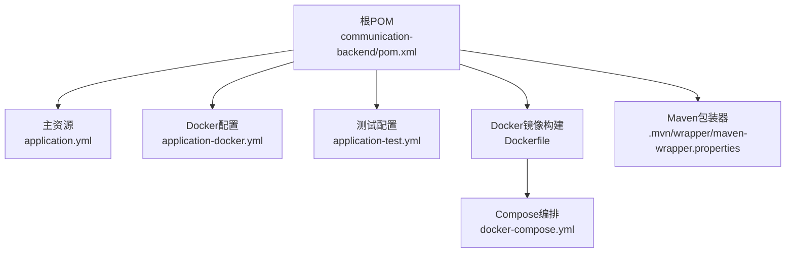
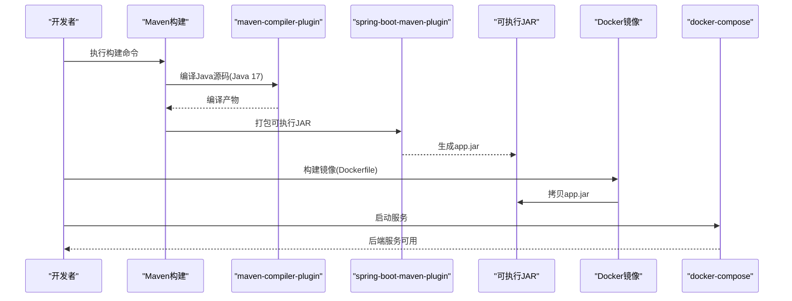
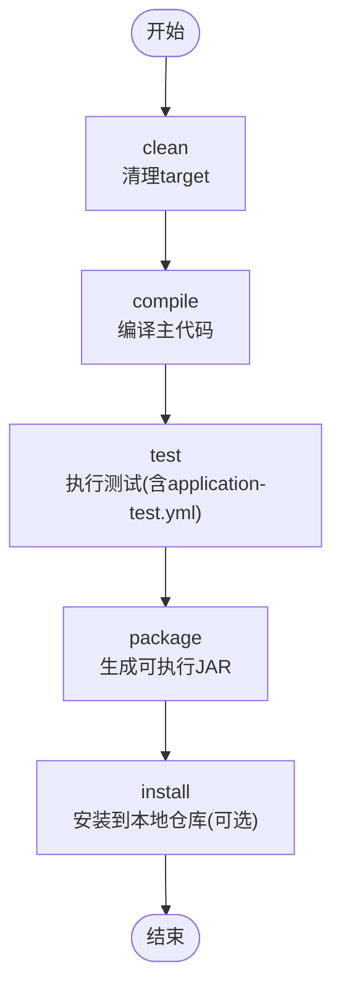
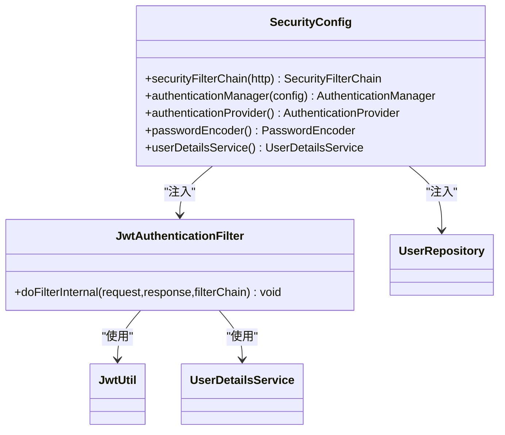

# 后端构建配置

<cite>
**本文引用的文件**
- [pom.xml](file://communication-backend/pom.xml)
- [application.yml](file://communication-backend/src/main/resources/application.yml)
- [application-docker.yml](file://communication-backend/src/main/resources/application-docker.yml)
- [application-test.yml](file://communication-backend/src/test/resources/application-test.yml)
- [Dockerfile](file://communication-backend/Dockerfile)
- [docker-compose.yml](file://docker-compose.yml)
- [JwtAuthenticationFilter.java](file://communication-backend/src/main/java/com/communication/config/JwtAuthenticationFilter.java)
- [SecurityConfig.java](file://communication-backend/src/main/java/com/communication/config/SecurityConfig.java)
- [maven-wrapper.properties](file://communication-backend/.mvn/wrapper/maven-wrapper.properties)
</cite>

## 目录
1. [简介](#简介)
2. [项目结构](#项目结构)
3. [核心组件](#核心组件)
4. [架构总览](#架构总览)
5. [详细组件分析](#详细组件分析)
6. [依赖关系分析](#依赖关系分析)
7. [性能与构建优化](#性能与构建优化)
8. [故障排查指南](#故障排查指南)
9. [结论](#结论)
10. [附录](#附录)

## 简介
本文件面向通信平台后端的Maven构建配置，系统性阐述以下内容：
- 依赖管理策略：Spring Boot Starter、数据库连接、JWT认证、测试与工具类依赖
- 构建插件配置：maven-compiler-plugin的Java版本与编译参数、spring-boot-maven-plugin的打包行为
- 多环境配置：application.yml与application-docker.yml的差异及激活方式
- Maven构建生命周期详解：clean、compile、test、package、install等阶段的作用与影响
- 构建优化技巧与常见问题排查

## 项目结构
后端采用标准Spring Boot多模块风格（当前仅关注communication-backend子模块），关键构建相关文件分布如下：
- 根级构建配置：pom.xml
- 运行时配置：application.yml（本地开发）、application-docker.yml（容器化部署）
- 测试配置：application-test.yml（内存数据库与测试专用参数）
- 容器化：Dockerfile、docker-compose.yml
- 包装器：.mvn/wrapper/maven-wrapper.properties

图表来源
- [pom.xml](file://communication-backend/pom.xml#L1-L114)
- [application.yml](file://communication-backend/src/main/resources/application.yml#L1-L42)
- [application-docker.yml](file://communication-backend/src/main/resources/application-docker.yml#L1-L43)
- [application-test.yml](file://communication-backend/src/test/resources/application-test.yml#L1-L19)
- [Dockerfile](file://communication-backend/Dockerfile#L1-L32)
- [docker-compose.yml](file://docker-compose.yml#L1-L60)
- [maven-wrapper.properties](file://communication-backend/.mvn/wrapper/maven-wrapper.properties#L1-L3)

章节来源
- [pom.xml](file://communication-backend/pom.xml#L1-L114)
- [application.yml](file://communication-backend/src/main/resources/application.yml#L1-L42)
- [application-docker.yml](file://communication-backend/src/main/resources/application-docker.yml#L1-L43)
- [application-test.yml](file://communication-backend/src/test/resources/application-test.yml#L1-L19)
- [Dockerfile](file://communication-backend/Dockerfile#L1-L32)
- [docker-compose.yml](file://docker-compose.yml#L1-L60)
- [maven-wrapper.properties](file://communication-backend/.mvn/wrapper/maven-wrapper.properties#L1-L3)

## 核心组件
- 依赖管理策略
  - Spring Boot Starter：web、data-jpa、security、validation
  - 数据库：MySQL Connector J（运行时）、Flyway（迁移）
  - JWT：jjwt-api、jjwt-impl、jjt-jackson
  - 测试：spring-boot-starter-test、spring-security-test、H2（内存数据库）
- 构建插件
  - maven-compiler-plugin：指定Java 17源/目标版本
  - spring-boot-maven-plugin：生成可执行JAR
- 配置文件
  - application.yml：本地开发默认值
  - application-docker.yml：Docker环境变量覆盖
  - application-test.yml：测试环境内存数据库与DDL策略

章节来源
- [pom.xml](file://communication-backend/pom.xml#L20-L94)
- [application.yml](file://communication-backend/src/main/resources/application.yml#L1-L42)
- [application-docker.yml](file://communication-backend/src/main/resources/application-docker.yml#L1-L43)
- [application-test.yml](file://communication-backend/src/test/resources/application-test.yml#L1-L19)

## 架构总览
下图展示从源码到可运行JAR的构建路径，以及容器化部署的关键节点。

图表来源
- [pom.xml](file://communication-backend/pom.xml#L96-L112)
- [Dockerfile](file://communication-backend/Dockerfile#L1-L32)
- [docker-compose.yml](file://docker-compose.yml#L25-L45)

## 详细组件分析

### 依赖管理策略
- Spring Boot Starter
  - web：REST接口与嵌入式服务器
  - data-jpa：JPA持久层与Hibernate
  - security：安全过滤链与认证提供者
  - validation：Bean验证注解支持
- 数据库与迁移
  - MySQL Connector J：驱动（运行时）
  - Flyway：数据库版本迁移（核心依赖）
- JWT认证
  - jjwt-api：令牌API
  - jjwt-impl：实现（运行时）
  - jjwt-jackson：JSON序列化（运行时）
- 测试与工具
  - spring-boot-starter-test、spring-security-test：测试框架
  - H2：内存数据库（测试）

章节来源
- [pom.xml](file://communication-backend/pom.xml#L25-L94)

### 构建插件配置
- maven-compiler-plugin
  - Java版本：17（源与目标一致）
  - 作用：确保编译期与运行期兼容
- spring-boot-maven-plugin
  - 作用：将应用打包为可执行JAR，包含依赖与启动元数据
  - 注意：未显式配置classifier或mainClass时，默认行为由父POM控制

章节来源
- [pom.xml](file://communication-backend/pom.xml#L96-L112)

### 多环境配置文件管理
- application.yml（本地开发）
  - 数据源：本地MySQL，用户名密码来自环境变量
  - JPA：校验模式、方言、格式化SQL
  - Flyway：启用，迁移脚本位置
  - 文件上传：最大大小限制
  - JWT：默认密钥与过期时间
- application-docker.yml（容器化）
  - 激活profile：docker
  - 数据源：通过环境变量注入，Hikari连接池参数
  - JPA：禁用DDL自动变更
  - 日志级别：INFO
  - 文件上传：更严格的大小限制
- application-test.yml（测试）
  - 数据源：H2内存数据库
  - JPA：创建/删除表，开启SQL输出
  - Flyway：禁用
  - JWT：测试密钥

章节来源
- [application.yml](file://communication-backend/src/main/resources/application.yml#L1-L42)
- [application-docker.yml](file://communication-backend/src/main/resources/application-docker.yml#L1-L43)
- [application-test.yml](file://communication-backend/src/test/resources/application-test.yml#L1-L19)

### Maven构建生命周期详解
- clean：清理target目录，移除历史构建产物
- compile：编译主代码至target/classes
- test：编译并执行测试，使用application-test.yml
- package：打包为可执行JAR（spring-boot-maven-plugin）
- install：安装到本地仓库（可选）

图表来源
- [pom.xml](file://communication-backend/pom.xml#L96-L112)

### 容器化与运行时配置
- Dockerfile
  - 多阶段构建：构建阶段下载依赖并打包，运行阶段仅包含JRE
  - 上传目录：在镜像内创建/app/uploads
  - 入口：java -jar app.jar
- docker-compose
  - 后端服务：激活docker profile，注入数据库URL/凭据、JWT密钥、上传路径
  - 前端服务：依赖后端
  - 卷：持久化MySQL与上传目录

章节来源
- [Dockerfile](file://communication-backend/Dockerfile#L1-L32)
- [docker-compose.yml](file://docker-compose.yml#L25-L45)

### 安全过滤链与JWT集成
- SecurityConfig
  - 禁用CSRF与会话状态（无状态）
  - 公开端点与受保护端点划分
  - 注入JWT过滤器，基于Authorization头解析Bearer令牌
- JwtAuthenticationFilter
  - 提取令牌、解析用户名、加载用户详情、建立认证上下文
  - 异常捕获：无效令牌不阻断请求

章节来源
- [SecurityConfig.java](file://communication-backend/src/main/java/com/communication/config/SecurityConfig.java#L66-L87)
- [JwtAuthenticationFilter.java](file://communication-backend/src/main/java/com/communication/config/JwtAuthenticationFilter.java#L31-L67)

## 依赖关系分析
- 组件耦合
  - SecurityConfig依赖JwtAuthenticationFilter与UserRepository
  - JwtAuthenticationFilter依赖JwtUtil与UserDetailsService
- 外部依赖
  - Spring Boot父POM统一版本管理
  - MySQL驱动与Flyway迁移
  - JWT实现与Jackson序列化
- 可能的循环依赖
  - 当前未见直接循环；注意避免在配置类中直接注入大量业务Bean

图表来源
- [SecurityConfig.java](file://communication-backend/src/main/java/com/communication/config/SecurityConfig.java#L24-L89)
- [JwtAuthenticationFilter.java](file://communication-backend/src/main/java/com/communication/config/JwtAuthenticationFilter.java#L20-L30)

## 性能与构建优化
- 使用Maven包装器
  - 通过.mvn/wrapper/maven-wrapper.properties固定Maven版本，保证团队一致性
- 多阶段Docker构建
  - 构建阶段仅下载依赖与编译，运行阶段仅包含JRE，减小镜像体积
- 依赖离线缓存
  - 在Dockerfile中使用go-offline提前下载依赖，提升CI构建速度
- 并行与增量
  - 在CI中启用并行构建与增量编译（如需要）以缩短构建时间
- 资源隔离
  - 测试使用H2内存数据库，避免对真实数据库造成压力

章节来源
- [maven-wrapper.properties](file://communication-backend/.mvn/wrapper/maven-wrapper.properties#L1-L3)
- [Dockerfile](file://communication-backend/Dockerfile#L10-L15)

## 故障排查指南
- 无法连接数据库
  - 检查application.yml与application-docker.yml中的URL、用户名、密码是否正确
  - 确认docker-compose中环境变量与容器网络连通性
- JWT认证失败
  - 校验Authorization头格式（Bearer 令牌）
  - 确认JWT密钥与过期时间配置一致
- 测试失败
  - application-test.yml中Flyway被禁用，确保迁移脚本已手动执行或通过其他方式初始化
- 构建失败
  - 确认Java版本与maven-compiler-plugin配置一致（17）
  - 在CI中使用go-offline确保依赖下载成功
- 容器启动异常
  - 查看日志级别与卷挂载路径，确认/app/uploads存在且权限正确

章节来源
- [application.yml](file://communication-backend/src/main/resources/application.yml#L5-L9)
- [application-docker.yml](file://communication-backend/src/main/resources/application-docker.yml#L3-L7)
- [application-test.yml](file://communication-backend/src/test/resources/application-test.yml#L1-L19)
- [docker-compose.yml](file://docker-compose.yml#L31-L37)
- [Dockerfile](file://communication-backend/Dockerfile#L21-L25)

## 结论
本项目的Maven构建配置围绕Spring Boot生态与容器化部署展开，通过明确的依赖分层、多环境配置与多阶段Docker构建，实现了可复用、可扩展且易于维护的后端构建体系。建议在持续集成中固化Maven版本、预下载依赖，并结合测试配置确保质量门禁。

## 附录
- 关键配置要点速览
  - Java版本：17（pom.xml与Dockerfile保持一致）
  - 数据库：MySQL Connector J（运行时），Flyway迁移
  - JWT：jjwt-api/impl/jackson三件套
  - 测试：H2内存数据库，禁用Flyway
  - 容器：多阶段构建，JRE运行时，卷挂载上传目录