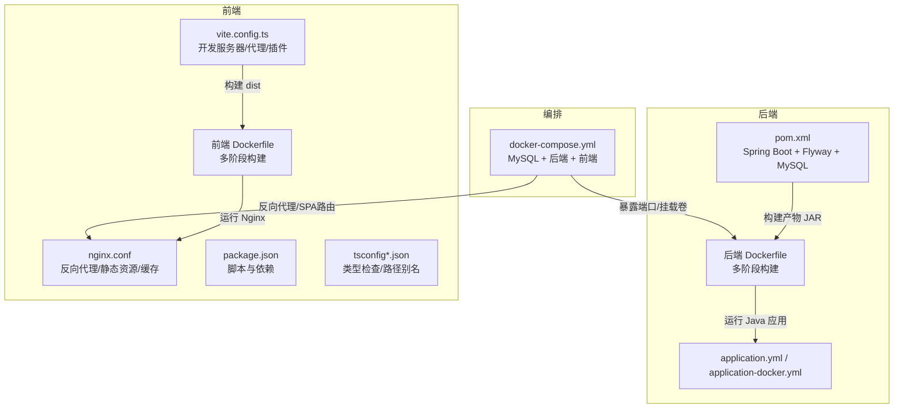
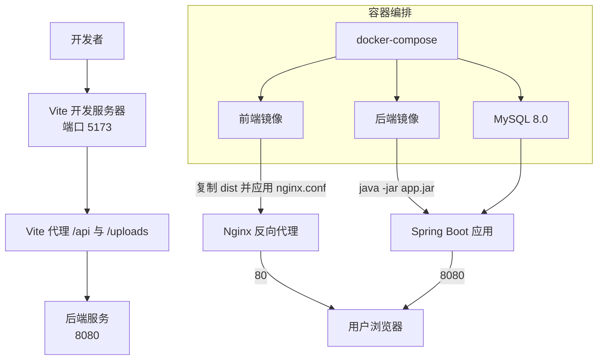
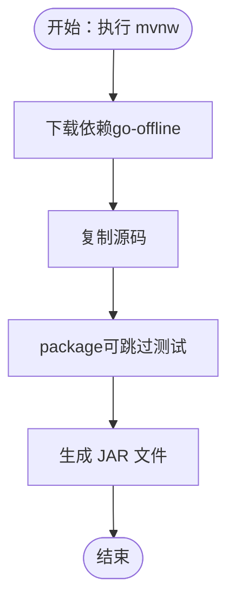
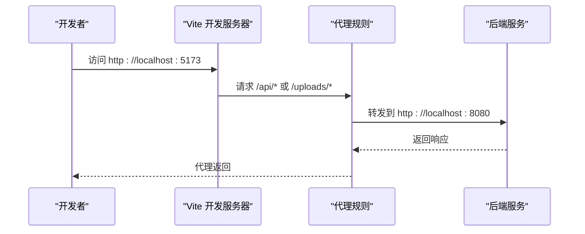
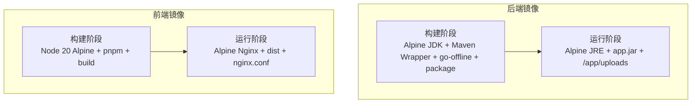
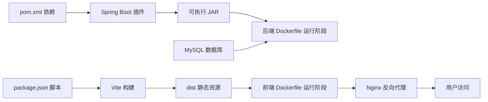

# 构建配置

<cite>
**本文引用的文件**
- [communication-backend/pom.xml](file://communication-backend/pom.xml)
- [communication-backend/mvnw](file://communication-backend/mvnw)
- [.mvn/wrapper/maven-wrapper.properties](file://communication-backend/.mvn/wrapper/maven-wrapper.properties)
- [communication-backend/src/main/resources/application.yml](file://communication-backend/src/main/resources/application.yml)
- [communication-backend/src/main/resources/application-docker.yml](file://communication-backend/src/main/resources/application-docker.yml)
- [communication-backend/Dockerfile](file://communication-backend/Dockerfile)
- [communication-frontend/vite.config.ts](file://communication-frontend/vite.config.ts)
- [communication-frontend/package.json](file://communication-frontend/package.json)
- [communication-frontend/tsconfig.json](file://communication-frontend/tsconfig.json)
- [communication-frontend/tsconfig.node.json](file://communication-frontend/tsconfig.node.json)
- [communication-frontend/nginx.conf](file://communication-frontend/nginx.conf)
- [communication-frontend/Dockerfile](file://communication-frontend/Dockerfile)
- [communication-frontend/playwright.config.ts](file://communication-frontend/playwright.config.ts)
- [communication-frontend/vitest.config.ts](file://communication-frontend/vitest.config.ts)
- [docker-compose.yml](file://docker-compose.yml)
</cite>

## 目录
1. [简介](#简介)
2. [项目结构](#项目结构)
3. [核心组件](#核心组件)
4. [架构总览](#架构总览)
5. [详细组件分析](#详细组件分析)
6. [依赖关系分析](#依赖关系分析)
7. [性能考虑](#性能考虑)
8. [故障排查指南](#故障排查指南)
9. [结论](#结论)
10. [附录](#附录)

## 简介
本文件系统性梳理通信平台的构建配置，覆盖后端 Maven 构建、前端 Vite 构建与 Nginx 打包、以及 Docker 多阶段构建与 Compose 编排。内容包括依赖管理、插件配置、构建生命周期、打包策略、开发服务器与代理、资源处理、镜像分层优化、并行与缓存策略、以及常见问题排查与扩展建议。

## 项目结构
- 后端采用 Spring Boot 3 + Maven：使用 Maven Wrapper 提供一致的本地构建体验；通过 Spring Boot Maven 插件生成可执行 JAR；Flyway 迁移数据库；JPA/Hibernate 访问 MySQL。
- 前端采用 Vue 3 + TypeScript + Vite：通过 Vite 进行开发与生产构建；Nginx 在容器中作为静态资源服务与反向代理；Playwright 与 Vitest 支持端到端与单元测试。
- 容器化采用多阶段 Dockerfile：后端基于 Alpine JDK/JRE 分层构建与运行；前端基于 Node 构建、Nginx 运行；docker-compose 统一编排数据库、后端、前端服务，并持久化上传目录。

图表来源
- [communication-backend/pom.xml](file://communication-backend/pom.xml#L1-L114)
- [communication-backend/Dockerfile](file://communication-backend/Dockerfile#L1-L32)
- [communication-backend/src/main/resources/application.yml](file://communication-backend/src/main/resources/application.yml#L1-L42)
- [communication-backend/src/main/resources/application-docker.yml](file://communication-backend/src/main/resources/application-docker.yml#L1-L43)
- [communication-frontend/vite.config.ts](file://communication-frontend/vite.config.ts#L1-L40)
- [communication-frontend/nginx.conf](file://communication-frontend/nginx.conf#L1-L42)
- [communication-frontend/Dockerfile](file://communication-frontend/Dockerfile#L1-L33)
- [communication-frontend/package.json](file://communication-frontend/package.json#L1-L36)
- [communication-frontend/tsconfig.json](file://communication-frontend/tsconfig.json#L1-L26)
- [communication-frontend/tsconfig.node.json](file://communication-frontend/tsconfig.node.json#L1-L12)
- [docker-compose.yml](file://docker-compose.yml#L1-L60)

章节来源
- [communication-backend/pom.xml](file://communication-backend/pom.xml#L1-L114)
- [communication-frontend/vite.config.ts](file://communication-frontend/vite.config.ts#L1-L40)
- [communication-frontend/package.json](file://communication-frontend/package.json#L1-L36)
- [communication-frontend/tsconfig.json](file://communication-frontend/tsconfig.json#L1-L26)
- [communication-frontend/tsconfig.node.json](file://communication-frontend/tsconfig.node.json#L1-L12)
- [communication-frontend/nginx.conf](file://communication-frontend/nginx.conf#L1-L42)
- [communication-backend/Dockerfile](file://communication-backend/Dockerfile#L1-L32)
- [communication-frontend/Dockerfile](file://communication-frontend/Dockerfile#L1-L33)
- [docker-compose.yml](file://docker-compose.yml#L1-L60)

## 核心组件
- 后端 Maven 构建
  - 使用 Spring Boot 父 POM，统一版本与默认插件行为。
  - 依赖：Web、JPA、Security、Validation、MySQL Connector、Flyway、JWT（jjwt）及测试依赖。
  - 插件：maven-compiler-plugin 指定 Java 17；spring-boot-maven-plugin 生成可执行 JAR。
  - Maven Wrapper：mvnw 与 .mvn/wrapper 配置确保本地一致性。
- 前端 Vite 构建
  - 插件：@vitejs/plugin-vue、unplugin-auto-import、unplugin-vue-components（Element Plus 解析器）。
  - 开发服务器：端口 5173，代理 /api 与 /uploads 到后端 8080。
  - 路径别名：@ 指向 src。
  - 类型检查：vue-tsc 单独进行类型检查；tsconfig 与 tsconfig.node 配置模块解析与路径映射。
- 容器与编排
  - 后端：Alpine JDK 构建、Alpine JRE 运行，复制 JAR 至 app.jar，暴露 8080。
  - 前端：Node 构建、Nginx 运行，复制 dist，应用 nginx.conf，暴露 80。
  - docker-compose：MySQL 数据库、后端服务（环境变量、卷挂载）、前端服务（端口映射），持久化上传目录。

章节来源
- [communication-backend/pom.xml](file://communication-backend/pom.xml#L20-L94)
- [communication-backend/pom.xml](file://communication-backend/pom.xml#L96-L112)
- [communication-backend/mvnw](file://communication-backend/mvnw#L1-L21)
- [.mvn/wrapper/maven-wrapper.properties](file://communication-backend/.mvn/wrapper/maven-wrapper.properties#L1-L3)
- [communication-frontend/vite.config.ts](file://communication-frontend/vite.config.ts#L8-L39)
- [communication-frontend/tsconfig.json](file://communication-frontend/tsconfig.json#L1-L26)
- [communication-frontend/tsconfig.node.json](file://communication-frontend/tsconfig.node.json#L1-L12)
- [communication-frontend/nginx.conf](file://communication-frontend/nginx.conf#L1-L42)
- [communication-backend/Dockerfile](file://communication-backend/Dockerfile#L1-L32)
- [communication-frontend/Dockerfile](file://communication-frontend/Dockerfile#L1-L33)
- [docker-compose.yml](file://docker-compose.yml#L1-L60)

## 架构总览
下图展示从源码到最终运行的整体流程：前端在本地或容器内构建为静态资源，后端在容器内打包为可执行 JAR 并连接 MySQL；Nginx 作为反向代理统一对外提供服务。

图表来源
- [communication-frontend/vite.config.ts](file://communication-frontend/vite.config.ts#L26-L38)
- [communication-frontend/nginx.conf](file://communication-frontend/nginx.conf#L11-L34)
- [communication-backend/Dockerfile](file://communication-backend/Dockerfile#L17-L32)
- [communication-frontend/Dockerfile](file://communication-frontend/Dockerfile#L15-L33)
- [docker-compose.yml](file://docker-compose.yml#L25-L56)

## 详细组件分析

### 后端 Maven 构建配置
- 依赖管理
  - Spring 生态：web、data-jpa、security、validation。
  - 数据库：MySQL Connector（运行时）、Flyway（迁移）。
  - 安全：jjwt API/IMPL/JACKSON。
  - 测试：spring-boot-starter-test、spring-security-test、H2。
- 插件配置
  - maven-compiler-plugin：Java 17 源与目标版本。
  - spring-boot-maven-plugin：生成可执行 JAR，便于 Docker 运行。
- 构建生命周期
  - 使用 Maven Wrapper mvnw，自动下载 wrapper 与指定版本 Maven。
  - offline 拉取依赖，随后 package 构建（可跳过测试）。
- 打包策略
  - 单 JAR 包含依赖，便于容器部署；JAR 名称由 Dockerfile 复制通配符匹配。

图表来源
- [communication-backend/mvnw](file://communication-backend/mvnw#L9-L14)
- [communication-backend/mvnw](file://communication-backend/mvnw#L17-L20)
- [communication-backend/Dockerfile](file://communication-backend/Dockerfile#L11-L15)

章节来源
- [communication-backend/pom.xml](file://communication-backend/pom.xml#L25-L94)
- [communication-backend/pom.xml](file://communication-backend/pom.xml#L96-L112)
- [communication-backend/mvnw](file://communication-backend/mvnw#L1-L21)
- [.mvn/wrapper/maven-wrapper.properties](file://communication-backend/.mvn/wrapper/maven-wrapper.properties#L1-L3)
- [communication-backend/Dockerfile](file://communication-backend/Dockerfile#L11-L25)

### 前端 Vite 构建配置
- 开发服务器与代理
  - 端口 5173；代理 /api 与 /uploads 到后端 8080，支持跨域与升级头（WebSocket）。
- 插件生态
  - Vue 插件、AutoImport（自动导入 Vue/Router/Pinia 与 Element Plus 组件）、Components（自动注册 Element Plus 组件）。
- 资源处理与别名
  - 路径别名 @ 指向 src；Nginx 配置对静态资源设置长缓存与 gzip。
- 类型检查与测试
  - vue-tsc 单独类型检查；Vitest 使用 jsdom 环境；Playwright 配置端到端测试与本地 webServer。

图表来源
- [communication-frontend/vite.config.ts](file://communication-frontend/vite.config.ts#L26-L38)
- [communication-frontend/nginx.conf](file://communication-frontend/nginx.conf#L11-L29)

章节来源
- [communication-frontend/vite.config.ts](file://communication-frontend/vite.config.ts#L8-L39)
- [communication-frontend/package.json](file://communication-frontend/package.json#L6-L14)
- [communication-frontend/tsconfig.json](file://communication-frontend/tsconfig.json#L1-L26)
- [communication-frontend/tsconfig.node.json](file://communication-frontend/tsconfig.node.json#L1-L12)
- [communication-frontend/nginx.conf](file://communication-frontend/nginx.conf#L1-L42)
- [communication-frontend/playwright.config.ts](file://communication-frontend/playwright.config.ts#L1-L26)
- [communication-frontend/vitest.config.ts](file://communication-frontend/vitest.config.ts#L1-L18)

### Docker 构建与多阶段策略
- 后端
  - 构建阶段：Alpine JDK，安装 Maven Wrapper，go-offline 下载依赖，复制源码并 package。
  - 运行阶段：Alpine JRE，创建 /app/uploads，复制 JAR 至 app.jar，暴露 8080，ENTRYPOINT 启动。
- 前端
  - 构建阶段：Node 20 Alpine，全局安装 pnpm，安装依赖（frozen lockfile），复制源码并 pnpm build。
  - 运行阶段：Alpine Nginx，删除默认配置，复制 dist 与 nginx.conf，暴露 80。
- 编排
  - docker-compose：MySQL（持久化与初始化 SQL）、后端（环境变量、卷挂载上传目录、健康检查）、前端（端口映射）。

图表来源
- [communication-backend/Dockerfile](file://communication-backend/Dockerfile#L1-L32)
- [communication-frontend/Dockerfile](file://communication-frontend/Dockerfile#L1-L33)

章节来源
- [communication-backend/Dockerfile](file://communication-backend/Dockerfile#L1-L32)
- [communication-frontend/Dockerfile](file://communication-frontend/Dockerfile#L1-L33)
- [docker-compose.yml](file://docker-compose.yml#L1-L60)

### 配置文件要点
- 后端配置
  - application.yml：本地开发数据源、JPA、Flyway、文件上传大小、服务器端口、JWT 与上传路径。
  - application-docker.yml：Docker 环境变量注入、连接池参数、Flyway、上传路径、日志级别。
- 前端配置
  - vite.config.ts：插件、别名、开发服务器与代理。
  - nginx.conf：API 与上传代理、SPA 路由回退、静态资源缓存与 gzip。
  - tsconfig*.json：模块解析、路径别名、严格模式与类型检查。

章节来源
- [communication-backend/src/main/resources/application.yml](file://communication-backend/src/main/resources/application.yml#L1-L42)
- [communication-backend/src/main/resources/application-docker.yml](file://communication-backend/src/main/resources/application-docker.yml#L1-L43)
- [communication-frontend/vite.config.ts](file://communication-frontend/vite.config.ts#L8-L39)
- [communication-frontend/nginx.conf](file://communication-frontend/nginx.conf#L1-L42)
- [communication-frontend/tsconfig.json](file://communication-frontend/tsconfig.json#L1-L26)
- [communication-frontend/tsconfig.node.json](file://communication-frontend/tsconfig.node.json#L1-L12)

## 依赖关系分析
- 后端
  - pom.xml 内部依赖关系清晰：Spring Boot Starter 与数据库、安全、验证、JWT、Flyway、测试等。
  - Maven Wrapper 保证构建工具链一致性。
- 前端
  - package.json 定义了开发与生产脚本、依赖与开发依赖；Vite 配置与插件生态提升 DX。
  - tsconfig 与 tsconfig.node 影响类型检查与模块解析行为。
- 容器
  - docker-compose 将 MySQL、后端、前端串联，后端挂载上传目录，前端通过 Nginx 暴露 80。

图表来源
- [communication-backend/pom.xml](file://communication-backend/pom.xml#L25-L94)
- [communication-backend/Dockerfile](file://communication-backend/Dockerfile#L17-L32)
- [communication-frontend/package.json](file://communication-frontend/package.json#L6-L14)
- [communication-frontend/Dockerfile](file://communication-frontend/Dockerfile#L15-L33)
- [communication-frontend/nginx.conf](file://communication-frontend/nginx.conf#L11-L34)
- [docker-compose.yml](file://docker-compose.yml#L25-L56)

章节来源
- [communication-backend/pom.xml](file://communication-backend/pom.xml#L25-L94)
- [communication-frontend/package.json](file://communication-frontend/package.json#L1-L36)
- [communication-frontend/tsconfig.json](file://communication-frontend/tsconfig.json#L1-L26)
- [communication-frontend/tsconfig.node.json](file://communication-frontend/tsconfig.node.json#L1-L12)
- [communication-backend/Dockerfile](file://communication-backend/Dockerfile#L1-L32)
- [communication-frontend/Dockerfile](file://communication-frontend/Dockerfile#L1-L33)
- [docker-compose.yml](file://docker-compose.yml#L1-L60)

## 性能考虑
- 并行与缓存
  - Maven：使用 Maven Wrapper 与 go-offline 在 CI 中离线缓存依赖，减少网络波动影响。
  - 前端：Vite 默认热更新与按需加载；Nginx 启用 gzip 与静态资源缓存，降低带宽与首屏时间。
- 增量编译与类型检查
  - 前端：vue-tsc 单独类型检查，避免与 Vite 开发服务器耦合；tsconfig 使用 bundler 模式提升模块解析效率。
- 构建阶段优化
  - 后端：多阶段构建分离 JDK 与 JRE，减小运行镜像体积；仅复制必要文件。
  - 前端：Node 构建阶段使用 frozen lockfile，确保依赖版本稳定；Nginx 运行阶段最小化配置。
- 并发测试
  - Playwright 与 Vitest 支持并行执行，CI 中可限制 worker 数量以平衡稳定性与速度。

章节来源
- [communication-backend/mvnw](file://communication-backend/mvnw#L9-L14)
- [communication-frontend/nginx.conf](file://communication-frontend/nginx.conf#L7-L10)
- [communication-frontend/tsconfig.json](file://communication-frontend/tsconfig.json#L8-L12)
- [communication-frontend/tsconfig.node.json](file://communication-frontend/tsconfig.node.json#L2-L8)
- [communication-frontend/playwright.config.ts](file://communication-frontend/playwright.config.ts#L5-L8)
- [communication-frontend/vitest.config.ts](file://communication-frontend/vitest.config.ts#L7-L11)

## 故障排查指南
- 后端无法连接数据库
  - 检查 application.yml 与 application-docker.yml 的数据源 URL、用户名、密码是否正确；Docker 环境变量是否注入；MySQL 健康检查状态。
- JWT 密钥或过期配置异常
  - 校验 application.yml 与 application-docker.yml 中 jwt.secret 与 expiration 是否设置；生产环境务必替换默认密钥。
- 文件上传失败或路径错误
  - 确认 upload.path 设置（本地默认 ./uploads，Docker 默认 /app/uploads）；后端容器已创建 /app/uploads；docker-compose 已挂载上传卷。
- 前端代理无效或 404
  - 确认 vite.config.ts 代理 /api 与 /uploads 目标地址；后端容器 8080 是否可达；Nginx 是否转发到 backend:8080。
- SPA 路由刷新 404
  - 检查 nginx.conf 的 try_files $uri $uri/ /index.html；确认前端路由模式与 Nginx 回退规则一致。
- Nginx 静态资源未缓存
  - 核对 nginx.conf 中对 JS/CSS/媒体文件的缓存与 Cache-Control 头设置。
- Maven 构建缓慢或失败
  - 清理本地仓库缓存或更换镜像；确保 go-offline 成功下载依赖；CI 中复用依赖缓存。
- 前端类型检查报错
  - 使用 vue-tsc --noEmit 单独检查；确认 tsconfig 与 tsconfig.node 的 moduleResolution 与路径别名配置。

章节来源
- [communication-backend/src/main/resources/application.yml](file://communication-backend/src/main/resources/application.yml#L5-L42)
- [communication-backend/src/main/resources/application-docker.yml](file://communication-backend/src/main/resources/application-docker.yml#L3-L38)
- [communication-frontend/vite.config.ts](file://communication-frontend/vite.config.ts#L26-L38)
- [communication-frontend/nginx.conf](file://communication-frontend/nginx.conf#L31-L40)
- [communication-backend/Dockerfile](file://communication-backend/Dockerfile#L21-L25)
- [docker-compose.yml](file://docker-compose.yml#L32-L41)
- [communication-backend/mvnw](file://communication-backend/mvnw#L9-L14)
- [communication-frontend/tsconfig.json](file://communication-frontend/tsconfig.json#L8-L21)

## 结论
该通信平台构建体系以“前后端分离 + 容器化 + 多阶段构建”为核心，后端通过 Spring Boot 与 Maven Wrapper 实现一致可复用的构建，前端借助 Vite 与 Nginx 提供高效开发与生产体验，docker-compose 将三者整合为可一键启动的完整环境。遵循本文的依赖管理、插件配置、代理与缓存策略、以及故障排查清单，可在不同环境中稳定复现并持续优化构建性能。

## 附录
- 自定义与扩展建议
  - 后端：引入 Maven Profiles 管理不同环境（如 dev/test/prod）；添加 checkstyle/pmd/findbugs 插件；启用 spring-boot-maven-plugin 的 build-info 生成构建元信息。
  - 前端：在 vite.config.ts 添加环境变量注入；集成 ESLint/Prettier；按需开启压缩与代码分割；在 Nginx 中增加 HSTS 与安全头。
  - 容器：为后端增加 JVM 参数调优（如 GC、堆大小）；为前端镜像启用只读根文件系统与非 root 用户；在 docker-compose 中加入日志驱动与资源限制。