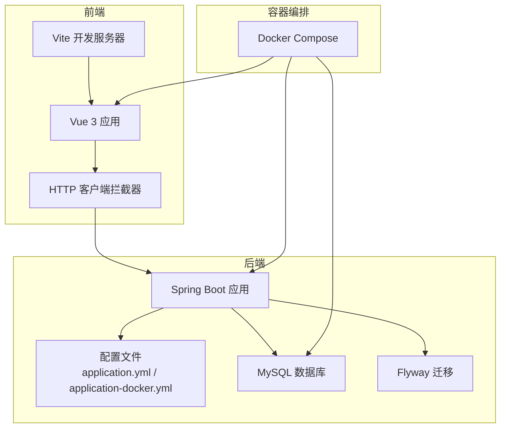
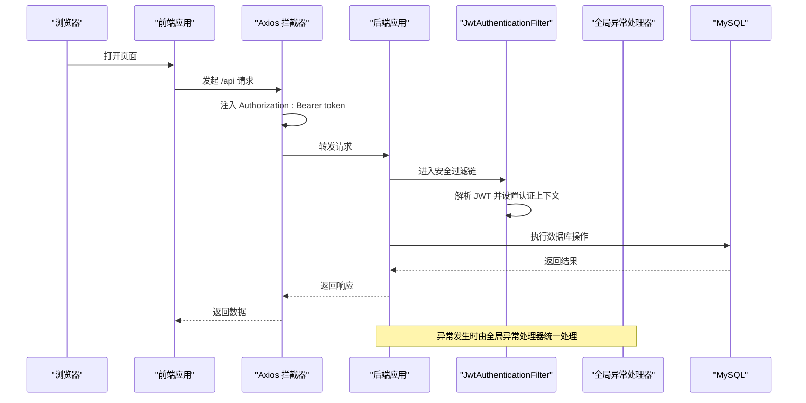
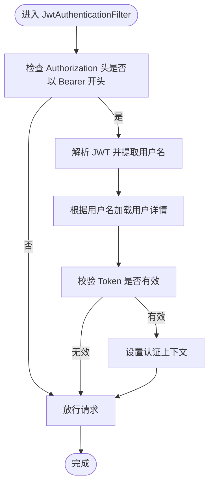
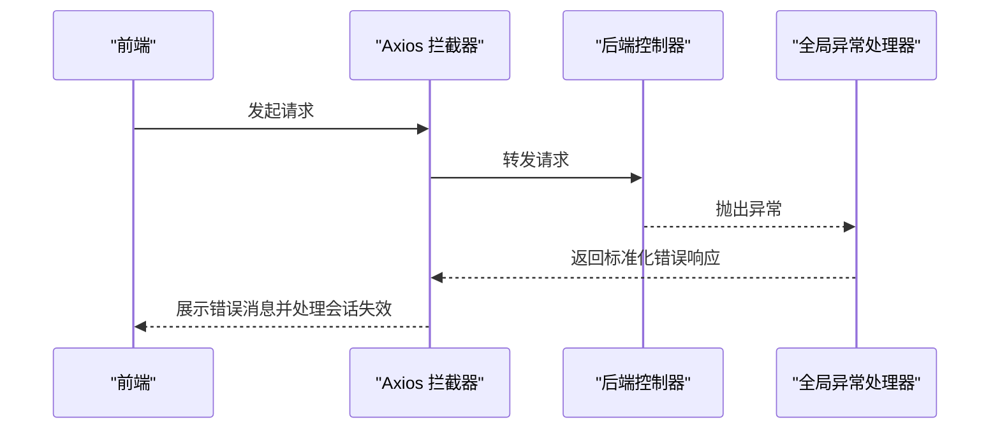
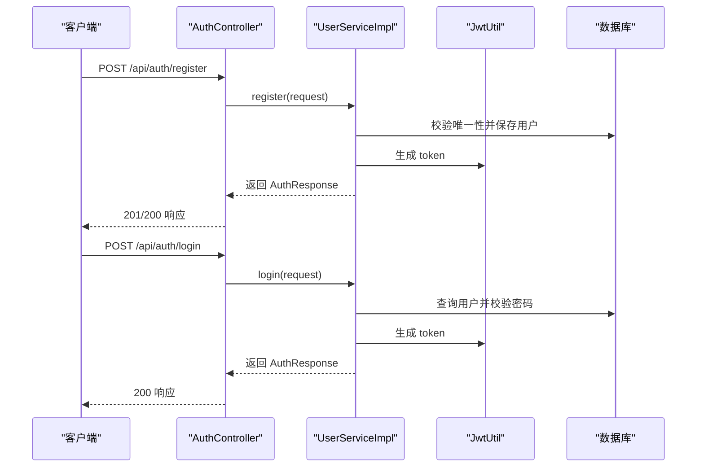
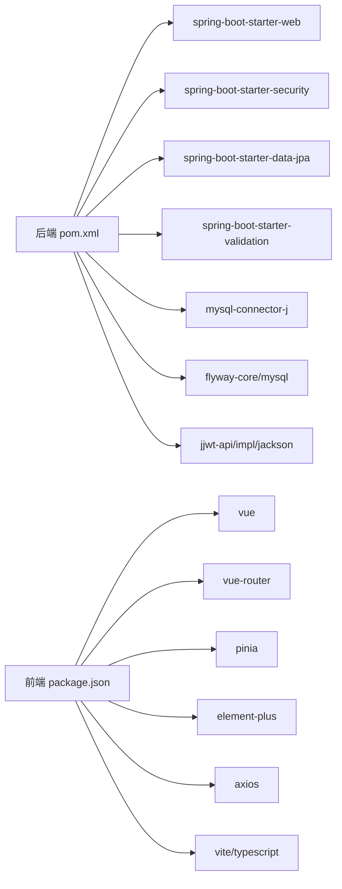

# 调试与故障排除

<cite>
**本文引用的文件**
- [README.md](file://README.md)
- [docker-compose.yml](file://docker-compose.yml)
- [communication-backend/pom.xml](file://communication-backend/pom.xml)
- [communication-backend/src/main/resources/application.yml](file://communication-backend/src/main/resources/application.yml)
- [communication-backend/src/main/resources/application-docker.yml](file://communication-backend/src/main/resources/application-docker.yml)
- [communication-backend/src/main/java/com/communication/config/JwtAuthenticationFilter.java](file://communication-backend/src/main/java/com/communication/config/JwtAuthenticationFilter.java)
- [communication-backend/src/main/java/com/communication/exception/GlobalExceptionHandler.java](file://communication-backend/src/main/java/com/communication/exception/GlobalExceptionHandler.java)
- [communication-backend/src/main/java/com/communication/util/JwtUtil.java](file://communication-backend/src/main/java/com/communication/util/JwtUtil.java)
- [communication-backend/src/main/java/com/communication/controller/AuthController.java](file://communication-backend/src/main/java/com/communication/controller/AuthController.java)
- [communication-backend/src/main/java/com/communication/service/impl/UserServiceImpl.java](file://communication-backend/src/main/java/com/communication/service/impl/UserServiceImpl.java)
- [communication-backend/Dockerfile](file://communication-backend/Dockerfile)
- [communication-frontend/package.json](file://communication-frontend/package.json)
- [communication-frontend/vite.config.ts](file://communication-frontend/vite.config.ts)
- [communication-frontend/src/api/http.ts](file://communication-frontend/src/api/http.ts)
- [communication-frontend/src/stores/auth.ts](file://communication-frontend/src/stores/auth.ts)
</cite>

## 目录
1. [简介](#简介)
2. [项目结构](#项目结构)
3. [核心组件](#核心组件)
4. [架构总览](#架构总览)
5. [详细组件分析](#详细组件分析)
6. [依赖关系分析](#依赖关系分析)
7. [性能考虑](#性能考虑)
8. [故障排除指南](#故障排除指南)
9. [结论](#结论)
10. [附录](#附录)

## 简介
本指南面向通信平台的后端与前端开发者，提供系统化的调试与故障排除方法，覆盖以下方面：
- 后端 Spring Boot 应用的日志配置、断点调试、性能分析
- 前端应用的浏览器开发者工具、Vue DevTools 使用、TypeScript 调试
- 常见问题诊断：JWT 认证问题、数据库连接问题、文件上传问题
- 日志分析与错误追踪
- 性能瓶颈识别与优化建议
- 网络请求调试与 API 问题排查

## 项目结构
该仓库采用前后端分离架构，后端基于 Spring Boot 3.2 + Java 21，前端基于 Vue 3 + TypeScript + Vite。通过 Docker Compose 统一编排，MySQL 提供持久化存储。

图表来源
- [docker-compose.yml](file://docker-compose.yml#L1-L60)
- [communication-backend/src/main/resources/application.yml](file://communication-backend/src/main/resources/application.yml#L1-L42)
- [communication-backend/src/main/resources/application-docker.yml](file://communication-backend/src/main/resources/application-docker.yml#L1-L43)
- [communication-frontend/vite.config.ts](file://communication-frontend/vite.config.ts#L1-L40)

章节来源
- [README.md](file://README.md#L1-L193)
- [docker-compose.yml](file://docker-compose.yml#L1-L60)

## 核心组件
- 后端配置与环境
  - application.yml：数据源、JPA、Flyway、文件上传、JWT 等默认配置
  - application-docker.yml：Docker 环境下的 profile 配置，含连接池、日志级别
  - Dockerfile：多阶段构建与运行时镜像
- 安全与认证
  - JwtAuthenticationFilter：从 Authorization 请求头解析 Bearer Token 并注入安全上下文
  - JwtUtil：Token 生成与校验
  - GlobalExceptionHandler：统一异常处理，返回标准化响应
- 控制器与服务
  - AuthController：注册、登录、获取当前用户
  - UserServiceImpl：用户注册/登录业务逻辑
- 前端配置与拦截器
  - vite.config.ts：代理到后端 8080 端口，便于本地联调
  - http.ts：Axios 实例与请求/响应拦截器，自动注入 Bearer Token、处理 401/404/500 等错误
  - auth.ts：Pinia 状态管理，维护 token 与用户信息

章节来源
- [communication-backend/src/main/resources/application.yml](file://communication-backend/src/main/resources/application.yml#L1-L42)
- [communication-backend/src/main/resources/application-docker.yml](file://communication-backend/src/main/resources/application-docker.yml#L1-L43)
- [communication-backend/Dockerfile](file://communication-backend/Dockerfile#L1-L32)
- [communication-backend/src/main/java/com/communication/config/JwtAuthenticationFilter.java](file://communication-backend/src/main/java/com/communication/config/JwtAuthenticationFilter.java#L1-L69)
- [communication-backend/src/main/java/com/communication/util/JwtUtil.java](file://communication-backend/src/main/java/com/communication/util/JwtUtil.java#L1-L67)
- [communication-backend/src/main/java/com/communication/exception/GlobalExceptionHandler.java](file://communication-backend/src/main/java/com/communication/exception/GlobalExceptionHandler.java#L1-L63)
- [communication-backend/src/main/java/com/communication/controller/AuthController.java](file://communication-backend/src/main/java/com/communication/controller/AuthController.java#L1-L42)
- [communication-backend/src/main/java/com/communication/service/impl/UserServiceImpl.java](file://communication-backend/src/main/java/com/communication/service/impl/UserServiceImpl.java#L1-L86)
- [communication-frontend/vite.config.ts](file://communication-frontend/vite.config.ts#L1-L40)
- [communication-frontend/src/api/http.ts](file://communication-frontend/src/api/http.ts#L1-L66)
- [communication-frontend/src/stores/auth.ts](file://communication-frontend/src/stores/auth.ts#L1-L96)

## 架构总览
下图展示了从前端发起请求到后端处理与数据库交互的关键流程，以及异常处理与日志输出位置。

图表来源
- [communication-frontend/src/api/http.ts](file://communication-frontend/src/api/http.ts#L1-L66)
- [communication-backend/src/main/java/com/communication/config/JwtAuthenticationFilter.java](file://communication-backend/src/main/java/com/communication/config/JwtAuthenticationFilter.java#L1-L69)
- [communication-backend/src/main/java/com/communication/exception/GlobalExceptionHandler.java](file://communication-backend/src/main/java/com/communication/exception/GlobalExceptionHandler.java#L1-L63)

## 详细组件分析

### 后端日志与配置调试
- 本地开发日志级别
  - application.yml 中默认关闭 SQL 输出，便于减少噪声；生产或调试可按需开启
  - application-docker.yml 中定义了 root 与包名的日志级别，便于在容器中定位问题
- Docker 环境
  - docker-compose 将后端容器暴露 8080 端口，前端通过 /api 代理访问
  - 上传目录映射至宿主机卷，便于查看上传文件与权限问题
- 关键配置项
  - 数据源连接参数、JWT 密钥与过期时间、文件上传大小限制

章节来源
- [communication-backend/src/main/resources/application.yml](file://communication-backend/src/main/resources/application.yml#L1-L42)
- [communication-backend/src/main/resources/application-docker.yml](file://communication-backend/src/main/resources/application-docker.yml#L1-L43)
- [docker-compose.yml](file://docker-compose.yml#L1-L60)

### JWT 认证调试
- 请求头格式
  - 前端拦截器会自动在请求头添加 Authorization: Bearer <token>
- 过滤器行为
  - JwtAuthenticationFilter 仅当请求头存在且以 Bearer 开头时尝试解析
  - 解析失败或无效时，继续放行但不设置认证上下文
- Token 生成与校验
  - JwtUtil 负责签名密钥加载、生成、提取声明与过期判断
- 常见问题定位
  - 前端未正确存储/传递 token
  - 后端未正确配置 JWT_SECRET 或密钥长度不足
  - Token 已过期或被篡改

图表来源
- [communication-backend/src/main/java/com/communication/config/JwtAuthenticationFilter.java](file://communication-backend/src/main/java/com/communication/config/JwtAuthenticationFilter.java#L1-L69)
- [communication-backend/src/main/java/com/communication/util/JwtUtil.java](file://communication-backend/src/main/java/com/communication/util/JwtUtil.java#L1-L67)

章节来源
- [communication-backend/src/main/java/com/communication/config/JwtAuthenticationFilter.java](file://communication-backend/src/main/java/com/communication/config/JwtAuthenticationFilter.java#L1-L69)
- [communication-backend/src/main/java/com/communication/util/JwtUtil.java](file://communication-backend/src/main/java/com/communication/util/JwtUtil.java#L1-L67)
- [communication-frontend/src/api/http.ts](file://communication-frontend/src/api/http.ts#L1-L66)

### 全局异常处理与错误追踪
- 全局异常处理器
  - 对业务异常、资源不存在、凭据错误、参数校验失败、通用异常进行分类处理
  - 统一返回包含 code/message/data 的响应体
- 前端错误处理
  - Axios 响应拦截器对 401/403/404/500 等状态码进行提示与路由跳转
  - 未返回响应（网络错误）时提示网络异常

图表来源
- [communication-backend/src/main/java/com/communication/exception/GlobalExceptionHandler.java](file://communication-backend/src/main/java/com/communication/exception/GlobalExceptionHandler.java#L1-L63)
- [communication-frontend/src/api/http.ts](file://communication-frontend/src/api/http.ts#L1-L66)

章节来源
- [communication-backend/src/main/java/com/communication/exception/GlobalExceptionHandler.java](file://communication-backend/src/main/java/com/communication/exception/GlobalExceptionHandler.java#L1-L63)
- [communication-frontend/src/api/http.ts](file://communication-frontend/src/api/http.ts#L1-L66)

### 认证流程与断点调试
- 注册/登录流程
  - AuthController 接收请求，调用 UserServiceImpl 完成业务处理
  - UserServiceImpl 校验唯一性、加密密码、生成 JWT 并返回响应
- 断点调试建议
  - 在 AuthController 的注册/登录方法入口设置断点
  - 在 UserServiceImpl 的注册/登录实现处设置断点，观察用户名/邮箱重复、密码匹配、Token 生成
  - 在 JwtAuthenticationFilter 的 doFilterInternal 设置断点，验证请求头解析与认证上下文设置

图表来源
- [communication-backend/src/main/java/com/communication/controller/AuthController.java](file://communication-backend/src/main/java/com/communication/controller/AuthController.java#L1-L42)
- [communication-backend/src/main/java/com/communication/service/impl/UserServiceImpl.java](file://communication-backend/src/main/java/com/communication/service/impl/UserServiceImpl.java#L1-L86)
- [communication-backend/src/main/java/com/communication/util/JwtUtil.java](file://communication-backend/src/main/java/com/communication/util/JwtUtil.java#L1-L67)

章节来源
- [communication-backend/src/main/java/com/communication/controller/AuthController.java](file://communication-backend/src/main/java/com/communication/controller/AuthController.java#L1-L42)
- [communication-backend/src/main/java/com/communication/service/impl/UserServiceImpl.java](file://communication-backend/src/main/java/com/communication/service/impl/UserServiceImpl.java#L1-L86)

### 前端调试技巧
- 浏览器开发者工具
  - Network 面板：查看 /api 与 /uploads 请求的请求头、响应状态与负载
  - Console 面板：查看错误日志与拦截器抛出的异常
  - Application 面板：检查 localStorage 中 token 与 user 是否正确写入
- Vue DevTools
  - 安装后可查看组件层级、Props、状态与 Pinia Store
  - 在 auth.ts 中观察 token、user、loading 的变化
- TypeScript 调试
  - 在 Vite 开发模式下启用 Source Map，可在浏览器断点调试 TS/TSX
  - 使用 vite.config.ts 的别名与插件确保类型与组件解析正常

章节来源
- [communication-frontend/vite.config.ts](file://communication-frontend/vite.config.ts#L1-L40)
- [communication-frontend/src/api/http.ts](file://communication-frontend/src/api/http.ts#L1-L66)
- [communication-frontend/src/stores/auth.ts](file://communication-frontend/src/stores/auth.ts#L1-L96)

### 文件上传问题排查
- 配置要点
  - application.yml 与 application-docker.yml 中设置了最大文件大小与允许类型
  - docker-compose 将上传目录映射到宿主机卷，便于检查权限与磁盘空间
- 常见问题
  - 前端未携带文件或类型不在允许列表
  - 后端未正确接收 multipart/form-data
  - 上传目录无写权限或磁盘空间不足
- 排查步骤
  - 查看前端 Network 面板的 multipart/form-data 负载
  - 检查后端日志与上传路径是否存在
  - 在容器内执行文件写入测试，确认权限与路径

章节来源
- [communication-backend/src/main/resources/application.yml](file://communication-backend/src/main/resources/application.yml#L25-L42)
- [communication-backend/src/main/resources/application-docker.yml](file://communication-backend/src/main/resources/application-docker.yml#L27-L38)
- [docker-compose.yml](file://docker-compose.yml#L40-L45)

## 依赖关系分析
- 后端依赖
  - Spring Web、Security、Data JPA、Validation
  - MySQL Connector、Flyway、JWT（jjwt）
- 前端依赖
  - Vue 3、Vue Router、Pinia、Element Plus、Axios
  - Vite、TypeScript、测试工具链

图表来源
- [communication-backend/pom.xml](file://communication-backend/pom.xml#L1-L114)
- [communication-frontend/package.json](file://communication-frontend/package.json#L1-L36)

章节来源
- [communication-backend/pom.xml](file://communication-backend/pom.xml#L1-L114)
- [communication-frontend/package.json](file://communication-frontend/package.json#L1-L36)

## 性能考虑
- 日志与 SQL
  - 生产环境建议保持 SQL 关闭，避免大量日志影响性能
  - Docker 环境可通过 application-docker.yml 调整日志级别
- 数据库连接池
  - application-docker.yml 中配置了最大连接数、最小空闲与超时，可根据并发调整
- 文件上传
  - 合理设置最大文件大小与请求大小，避免内存压力
- 前端性能
  - 使用 Vite 的按需加载与 Tree Shaking，避免引入不必要的依赖
  - Pinia 状态粒度控制，避免频繁重渲染

章节来源
- [communication-backend/src/main/resources/application.yml](file://communication-backend/src/main/resources/application.yml#L11-L28)
- [communication-backend/src/main/resources/application-docker.yml](file://communication-backend/src/main/resources/application-docker.yml#L8-L11)
- [communication-frontend/package.json](file://communication-frontend/package.json#L15-L34)

## 故障排除指南

### JWT 认证问题
- 症状
  - 登录成功但后续接口返回 401
- 排查
  - 检查前端是否正确将 token 写入 localStorage，并在拦截器中注入 Authorization
  - 检查后端 JWT_SECRET 是否一致且长度足够
  - 查看 JwtAuthenticationFilter 是否正确解析请求头
  - 观察全局异常处理器是否返回 401 错误信息

章节来源
- [communication-frontend/src/api/http.ts](file://communication-frontend/src/api/http.ts#L13-L25)
- [communication-backend/src/main/java/com/communication/config/JwtAuthenticationFilter.java](file://communication-backend/src/main/java/com/communication/config/JwtAuthenticationFilter.java#L37-L42)
- [communication-backend/src/main/java/com/communication/util/JwtUtil.java](file://communication-backend/src/main/java/com/communication/util/JwtUtil.java#L17-L21)
- [communication-backend/src/main/java/com/communication/exception/GlobalExceptionHandler.java](file://communication-backend/src/main/java/com/communication/exception/GlobalExceptionHandler.java#L32-L37)

### 数据库连接问题
- 症状
  - 启动时报连接失败或 Flyway 初始化失败
- 排查
  - 检查 docker-compose 中的数据库环境变量与端口映射
  - 确认 application.yml 与 application-docker.yml 的数据源 URL、用户名、密码
  - 在容器内执行数据库连通性测试，确认网络策略与健康检查

章节来源
- [docker-compose.yml](file://docker-compose.yml#L4-L23)
- [communication-backend/src/main/resources/application.yml](file://communication-backend/src/main/resources/application.yml#L5-L9)
- [communication-backend/src/main/resources/application-docker.yml](file://communication-backend/src/main/resources/application-docker.yml#L3-L7)

### 文件上传问题
- 症状
  - 上传失败或后端报错
- 排查
  - 检查前端是否以 multipart/form-data 提交
  - 检查后端 application.yml 与 application-docker.yml 的上传大小与类型配置
  - 检查容器上传卷权限与磁盘空间

章节来源
- [communication-backend/src/main/resources/application.yml](file://communication-backend/src/main/resources/application.yml#L25-L42)
- [communication-backend/src/main/resources/application-docker.yml](file://communication-backend/src/main/resources/application-docker.yml#L27-L38)
- [docker-compose.yml](file://docker-compose.yml#L40-L45)

### 网络请求与 API 排查
- 使用浏览器 Network 面板
  - 关注 /api 与 /uploads 的请求头、状态码、响应体
  - 检查 CORS 与代理配置是否正确
- Axios 拦截器
  - 确认请求拦截器已注入 Authorization
  - 确认响应拦截器对 401/404/500 的处理逻辑
- 代理配置
  - vite.config.ts 将 /api 与 /uploads 代理到后端 8080 端口，确保本地联调可用

章节来源
- [communication-frontend/vite.config.ts](file://communication-frontend/vite.config.ts#L26-L38)
- [communication-frontend/src/api/http.ts](file://communication-frontend/src/api/http.ts#L13-L25)
- [communication-frontend/src/api/http.ts](file://communication-frontend/src/api/http.ts#L27-L63)

### 日志分析与错误追踪
- 后端
  - 通过 application-docker.yml 设置日志级别，定位认证、异常与业务层问题
  - 结合全局异常处理器的响应体字段进行快速定位
- 前端
  - 通过浏览器 Console 查看拦截器抛出的错误
  - 通过 Network 面板核对后端返回的错误码与 message

章节来源
- [communication-backend/src/main/resources/application-docker.yml](file://communication-backend/src/main/resources/application-docker.yml#L39-L43)
- [communication-backend/src/main/java/com/communication/exception/GlobalExceptionHandler.java](file://communication-backend/src/main/java/com/communication/exception/GlobalExceptionHandler.java#L15-L63)
- [communication-frontend/src/api/http.ts](file://communication-frontend/src/api/http.ts#L27-L63)

## 结论
本指南提供了从配置、日志、断点到网络与性能的全链路调试方法。建议在开发过程中：
- 明确各层职责与边界（前端拦截器、后端过滤器、全局异常处理器）
- 利用容器编排快速复现环境问题
- 通过日志与错误响应体快速定位问题根因
- 在认证、数据库、文件上传等关键路径设置断点与观测点

## 附录
- 快速启动与访问
  - 前端：http://localhost
  - 后端 API：http://localhost:8080/api
- 关键端口
  - 前端开发：5173
  - 后端服务：8080
  - 数据库：3306

章节来源
- [README.md](file://README.md#L49-L51)
- [docker-compose.yml](file://docker-compose.yml#L38-L55)
- [communication-frontend/vite.config.ts](file://communication-frontend/vite.config.ts#L26-L38)