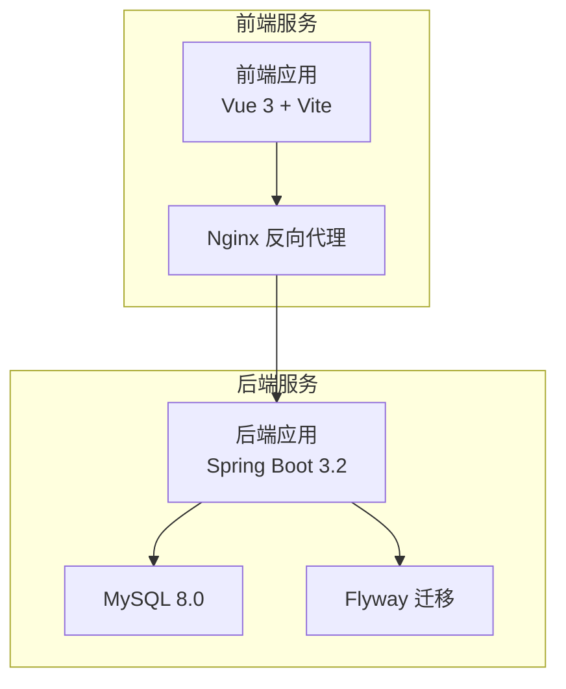
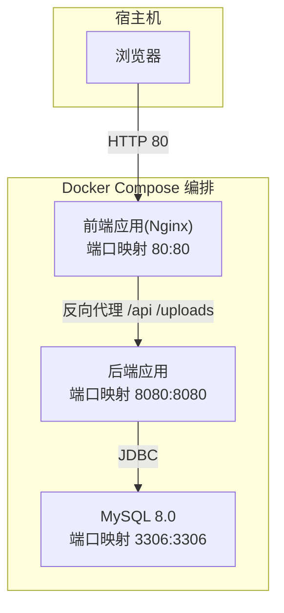
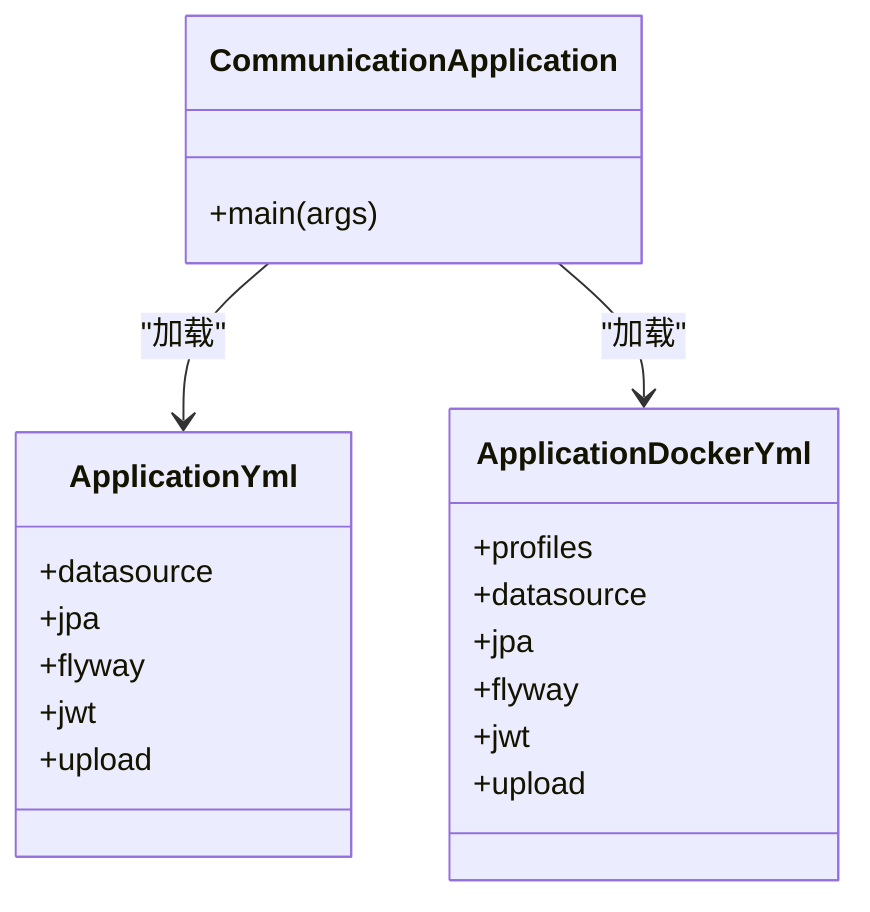
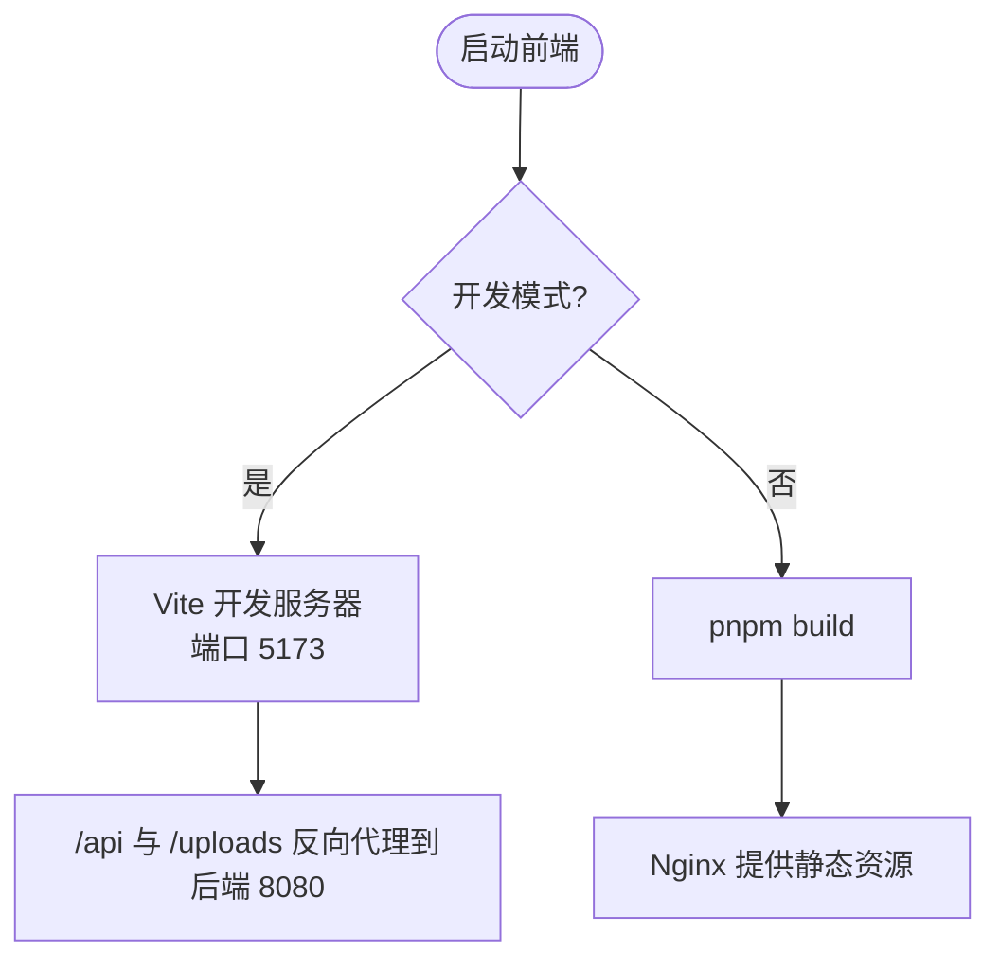
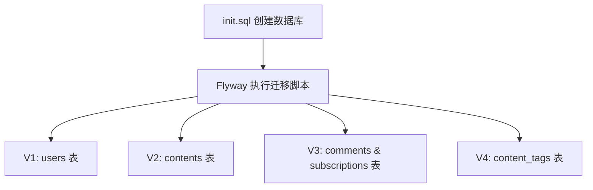

# 快速开始

<cite>
**本文引用的文件**
- [README.md](file://README.md)
- [docker-compose.yml](file://docker-compose.yml)
- [init.sql](file://init.sql)
- [communication-backend/Dockerfile](file://communication-backend/Dockerfile)
- [communication-frontend/Dockerfile](file://communication-frontend/Dockerfile)
- [communication-backend/pom.xml](file://communication-backend/pom.xml)
- [communication-frontend/package.json](file://communication-frontend/package.json)
- [communication-backend/src/main/resources/application.yml](file://communication-backend/src/main/resources/application.yml)
- [communication-backend/src/main/resources/application-docker.yml](file://communication-backend/src/main/resources/application-docker.yml)
- [communication-backend/src/main/java/com/communication/CommunicationApplication.java](file://communication-backend/src/main/java/com/communication/CommunicationApplication.java)
- [communication-frontend/vite.config.ts](file://communication-frontend/vite.config.ts)
- [communication-frontend/nginx.conf](file://communication-frontend/nginx.conf)
- [communication-backend/src/main/resources/db/migration/V1__init_users.sql](file://communication-backend/src/main/resources/db/migration/V1__init_users.sql)
- [communication-backend/src/main/resources/db/migration/V2__create_contents.sql](file://communication-backend/src/main/resources/db/migration/V2__create_contents.sql)
- [communication-backend/src/main/resources/db/migration/V3__create_comments_subscriptions.sql](file://communication-backend/src/main/resources/db/migration/V3__create_comments_subscriptions.sql)
- [communication-backend/src/main/resources/db/migration/V4__create_content_tags.sql](file://communication-backend/src/main/resources/db/migration/V4__create_content_tags.sql)
</cite>

## 目录
1. [简介](#简介)
2. [前置条件](#前置条件)
3. [方式一：Docker 部署（推荐）](#方式一docker-部署推荐)
4. [方式二：本地开发](#方式二本地开发)
5. [默认配置参考](#默认配置参考)
6. [常见问题](#常见问题)
7. [项目结构](#项目结构)
8. [核心组件](#核心组件)
9. [架构总览](#架构总览)
10. [详细组件分析](#详细组件分析)
11. [性能与最佳实践](#性能与最佳实践)
12. [结论](#结论)

## 简介
本指南面向希望快速搭建并运行通信平台项目的开发者，提供两种部署方式：Docker 一键部署与本地开发环境搭建。文档覆盖前置条件、完整部署步骤、常见问题排查以及实际命令示例，帮助你在最短时间内成功运行项目。

## 前置条件

| 工具 | 最低版本 | 说明 |
|------|---------|------|
| JDK | 21+ | 后端运行环境 |
| Node.js | 20+ | 前端运行环境 |
| pnpm | 8+ | 前端包管理器 |
| MySQL | 8.0+ | 数据库（本地开发） |
| Docker & Docker Compose | 最新版 | 容器化部署（推荐） |

## 方式一：Docker 部署（推荐）

Docker Compose 一键启动 MySQL、后端、前端三个服务，无需手动安装配置依赖。

### 步骤

```bash
# 1. 克隆项目
git clone <repo-url>
cd communication

# 2. 启动所有服务
docker-compose up -d

# 3. 查看服务状态
docker-compose ps
```

### 访问地址

| 服务 | 地址 |
|------|------|
| 前端页面 | http://localhost |
| 后端 API | http://localhost:8080/api |
| MySQL | localhost:3306 |

### 停止服务

```bash
docker-compose down
```

### 清理数据卷

```bash
docker-compose down -v
```

## 方式二：本地开发

### 1. 准备数据库

```sql
-- 创建数据库
CREATE DATABASE communication
  CHARACTER SET utf8mb4
  COLLATE utf8mb4_unicode_ci;
```

### 2. 启动后端

```bash
cd communication-backend

# 首次构建（跳过测试）
./mvnw clean install -DskipTests

# 启动开发服务器
./mvnw spring-boot:run
```

> 后端默认监听 http://localhost:8080

**环境变量配置**（可选，未配置时使用默认值）：

```bash
export MYSQL_PASSWORD=your_password
export JWT_SECRET=your-jwt-secret-at-least-256-bits
export UPLOAD_PATH=./uploads
```

或直接修改 `communication-backend/src/main/resources/application.yml`。

### 3. 启动前端

```bash
cd communication-frontend

# 安装依赖
pnpm install

# 启动开发服务器
pnpm dev
```

> 前端默认监听 http://localhost:5173

## 默认配置参考

### application.yml 关键配置

```yaml
spring:
  datasource:
    url: jdbc:mysql://localhost:3306/communication
    username: root
    password: ${MYSQL_PASSWORD:root}

server:
  port: 8080

jwt:
  secret: ${JWT_SECRET:communication-platform-secret-key-must-be-at-least-256-bits-long}
  expiration: 86400000   # 24 小时（毫秒）

upload:
  path: ${UPLOAD_PATH:./uploads}
  allowed-types: image/jpeg,image/png,image/gif,video/mp4,video/webm
```

### application-docker.yml 关键配置

```yaml
spring:
  profiles: docker
  datasource:
    url: ${SPRING_DATASOURCE_URL:jdbc:mysql://mysql:3306/communication}
    username: ${SPRING_DATASOURCE_USERNAME:communication}
    password: ${SPRING_DATASOURCE_PASSWORD:comm123}
    hikari:
      maximum-pool-size: 10
      minimum-idle: 5
      connection-timeout: 30000

jwt:
  secret: ${JWT_SECRET:your-super-secret-jwt-key-change-in-production}
  expiration: 86400000

upload:
  path: ${UPLOAD_PATH:/app/uploads}
```

## 常见问题

### 后端启动报错：数据库连接失败

确认 MySQL 已启动，数据库 `communication` 已创建，并检查用户名/密码配置。

### 前端请求后端接口报错 CORS

检查后端 `CorsConfig.java` 中是否允许了前端开发地址 `http://localhost:5173`。

### Docker 中后端无法连接 MySQL

确保 `docker-compose.yml` 中后端服务已配置 `depends_on: mysql` 并等待健康检查通过。

### 文件上传失败

确认 `upload.path` 目录存在且有写权限；Docker 中已挂载 `uploads_data` 卷到 `/app/uploads`。

### 前端开发代理失效

检查 `vite.config.ts` 中的代理配置是否正确指向后端 8080 端口。

### Nginx 反向代理配置错误

确认 `nginx.conf` 中的 `/api` 和 `/uploads` 代理路径正确指向后端服务。

## 项目结构
项目采用前后端分离架构，后端基于 Spring Boot 3.2 + Java 21，前端基于 Vue 3 + TypeScript + Vite，使用 MySQL 作为持久化存储，Flyway 进行数据库迁移，Nginx 用于静态资源与反向代理。



**图表来源**
- [docker-compose.yml](file://docker-compose.yml#L1-L60)
- [communication-backend/src/main/resources/application.yml](file://communication-backend/src/main/resources/application.yml#L1-L42)
- [communication-frontend/nginx.conf](file://communication-frontend/nginx.conf#L1-L42)

**章节来源**
- [README.md](file://README.md#L20-L36)

## 核心组件
- 后端应用：Spring Boot 应用，提供认证、内容管理、评论、订阅、搜索、仪表盘等接口。
- 前端应用：Vue 3 单页应用，通过 Vite 开发服务器提供交互界面，Nginx 提供生产级静态资源与反向代理。
- 数据库：MySQL 8.0，Flyway 自动执行迁移脚本初始化表结构。
- 容器编排：Docker Compose 统一管理 MySQL、后端、前端三类服务。

**章节来源**
- [README.md](file://README.md#L7-L18)
- [communication-backend/pom.xml](file://communication-backend/pom.xml#L25-L102)
- [communication-frontend/package.json](file://communication-frontend/package.json#L15-L34)

## 架构总览
下图展示了 Docker 一键部署时的服务关系与网络拓扑，以及请求在容器间的流转。



**图表来源**
- [docker-compose.yml](file://docker-compose.yml#L1-L60)
- [communication-frontend/nginx.conf](file://communication-frontend/nginx.conf#L11-L29)

## 详细组件分析

### 后端应用（Spring Boot）
- 项目信息与依赖：使用 Spring Boot 3.2、Spring Security、Spring Data JPA、MySQL Connector、JWT、Flyway、Lombok 等。
- 配置文件：
  - application.yml：本地开发默认配置，含数据源、JPA、Flyway、JWT、文件上传等。
  - application-docker.yml：Docker 环境下的覆盖配置，启用 Flyway、设置连接池参数、日志级别等。
- 启动入口：CommunicationApplication.main 启动 Spring Boot 应用。
- Docker 构建：基于 Eclipse Temurin 21，先构建再运行，暴露 8080 端口。



**图表来源**
- [communication-backend/src/main/java/com/communication/CommunicationApplication.java](file://communication-backend/src/main/java/com/communication/CommunicationApplication.java#L1-L13)
- [communication-backend/src/main/resources/application.yml](file://communication-backend/src/main/resources/application.yml#L1-L42)
- [communication-backend/src/main/resources/application-docker.yml](file://communication-backend/src/main/resources/application-docker.yml#L1-L43)

**章节来源**
- [communication-backend/pom.xml](file://communication-backend/pom.xml#L25-L102)
- [communication-backend/src/main/resources/application.yml](file://communication-backend/src/main/resources/application.yml#L1-L42)
- [communication-backend/src/main/resources/application-docker.yml](file://communication-backend/src/main/resources/application-docker.yml#L1-L43)
- [communication-backend/Dockerfile](file://communication-backend/Dockerfile#L1-L32)
- [communication-backend/src/main/java/com/communication/CommunicationApplication.java](file://communication-backend/src/main/java/com/communication/CommunicationApplication.java#L1-L13)

### 前端应用（Vue 3 + Vite + Nginx）
- 依赖与脚本：Vue 3、Vue Router、Pinia、Element Plus、Axios、Vite、TypeScript 等。
- 开发服务器：Vite 默认监听 5173 端口，配置了 /api 与 /uploads 的反向代理到后端 8080。
- 生产构建：使用 pnpm 构建，Nginx 提供静态资源与 SPA 路由回退；nginx.conf 将 /api 与 /uploads 代理至后端。
- Docker 构建：基于 Node 20，使用 pnpm 安装依赖并构建，最终由 Nginx 提供服务。



**图表来源**
- [communication-frontend/vite.config.ts](file://communication-frontend/vite.config.ts#L26-L38)
- [communication-frontend/nginx.conf](file://communication-frontend/nginx.conf#L11-L34)
- [communication-frontend/Dockerfile](file://communication-frontend/Dockerfile#L1-L33)

**章节来源**
- [communication-frontend/package.json](file://communication-frontend/package.json#L1-L36)
- [communication-frontend/vite.config.ts](file://communication-frontend/vite.config.ts#L1-L40)
- [communication-frontend/nginx.conf](file://communication-frontend/nginx.conf#L1-L42)
- [communication-frontend/Dockerfile](file://communication-frontend/Dockerfile#L1-L33)

### 数据库与迁移（MySQL + Flyway）
- 初始化脚本：init.sql 创建数据库。
- 迁移脚本：V1 初始化用户表，V2 初始化内容表，V3 创建评论和订阅表，V4 创建内容标签表，后续可继续扩展。
- Docker 环境：application-docker.yml 启用 Flyway 并设置迁移位置为 classpath:db/migration。



**图表来源**
- [init.sql](file://init.sql#L1-L3)
- [communication-backend/src/main/resources/db/migration/V1__init_users.sql](file://communication-backend/src/main/resources/db/migration/V1__init_users.sql#L1-L14)
- [communication-backend/src/main/resources/db/migration/V2__create_contents.sql](file://communication-backend/src/main/resources/db/migration/V2__create_contents.sql#L1-L19)
- [communication-backend/src/main/resources/db/migration/V3__create_comments_subscriptions.sql](file://communication-backend/src/main/resources/db/migration/V3__create_comments_subscriptions.sql#L1-L33)
- [communication-backend/src/main/resources/db/migration/V4__create_content_tags.sql](file://communication-backend/src/main/resources/db/migration/V4__create_content_tags.sql#L1-L14)
- [docker-compose.yml](file://docker-compose.yml#L17-L17)

**章节来源**
- [init.sql](file://init.sql#L1-L3)
- [communication-backend/src/main/resources/db/migration/V1__init_users.sql](file://communication-backend/src/main/resources/db/migration/V1__init_users.sql#L1-L14)
- [communication-backend/src/main/resources/db/migration/V2__create_contents.sql](file://communication-backend/src/main/resources/db/migration/V2__create_contents.sql#L1-L19)
- [communication-backend/src/main/resources/db/migration/V3__create_comments_subscriptions.sql](file://communication-backend/src/main/resources/db/migration/V3__create_comments_subscriptions.sql#L1-L33)
- [communication-backend/src/main/resources/db/migration/V4__create_content_tags.sql](file://communication-backend/src/main/resources/db/migration/V4__create_content_tags.sql#L1-L14)
- [communication-backend/src/main/resources/application-docker.yml](file://communication-backend/src/main/resources/application-docker.yml#L22-L25)

## 性能与最佳实践
- Docker 环境建议
  - 使用独立卷挂载数据库与上传目录，避免容器重建丢失数据。
  - 参考：[docker-compose.yml](file://docker-compose.yml#L57-L60)
- 后端连接池
  - application-docker.yml 中设置了最大池大小、最小空闲、连接超时等参数，可根据并发调整。
  - 参考：[application-docker.yml](file://communication-backend/src/main/resources/application-docker.yml#L8-L11)
- 前端缓存策略
  - Nginx 对静态资源设置长缓存，提升加载速度。
  - 参考：[nginx.conf](file://communication-frontend/nginx.conf#L37-L40)
- 数据库性能优化
  - 迁移脚本中包含了全文索引和复合索引，提升查询性能。
  - 参考：[V1__init_users.sql](file://communication-backend/src/main/resources/db/migration/V1__init_users.sql#L11-L13)
  - 参考：[V2__create_contents.sql](file://communication-backend/src/main/resources/db/migration/V2__create_contents.sql#L14-L18)

## 结论
通过本指南，你可以选择 Docker 一键部署或本地开发两种方式快速运行通信平台项目。若遇到问题，请根据"常见问题"逐项核对配置与依赖。建议在生产环境中进一步完善安全与监控配置，并按需扩展数据库与后端服务规模。