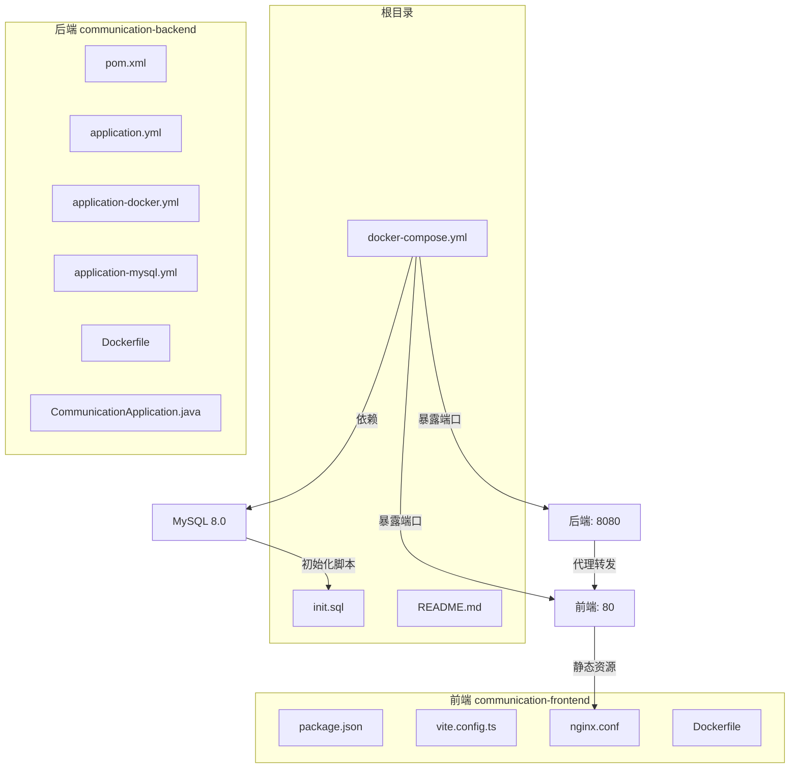
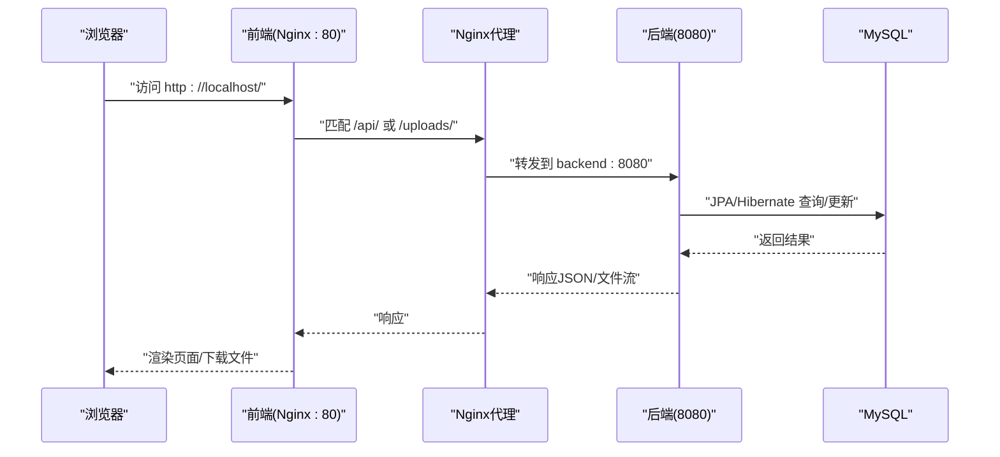
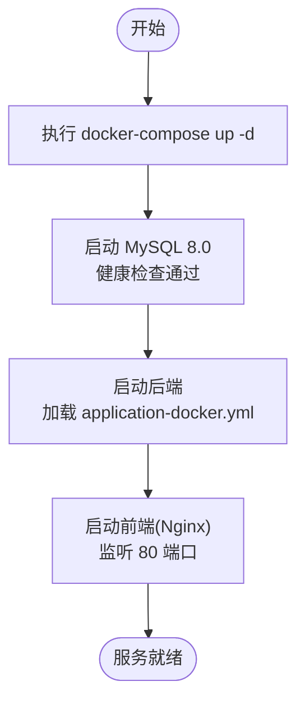

# 快速开始

<cite>
**本文引用的文件**
- [README.md](file://README.md)
- [docker-compose.yml](file://docker-compose.yml)
- [init.sql](file://init.sql)
- [communication-backend/pom.xml](file://communication-backend/pom.xml)
- [communication-backend/src/main/resources/application.yml](file://communication-backend/src/main/resources/application.yml)
- [communication-backend/src/main/resources/application-docker.yml](file://communication-backend/src/main/resources/application-docker.yml)
- [communication-backend/src/main/resources/application-mysql.yml](file://communication-backend/src/main/resources/application-mysql.yml)
- [communication-backend/Dockerfile](file://communication-backend/Dockerfile)
- [communication-backend/src/main/java/com/communication/CommunicationApplication.java](file://communication-backend/src/main/java/com/communication/CommunicationApplication.java)
- [communication-frontend/package.json](file://communication-frontend/package.json)
- [communication-frontend/vite.config.ts](file://communication-frontend/vite.config.ts)
- [communication-frontend/nginx.conf](file://communication-frontend/nginx.conf)
- [communication-frontend/Dockerfile](file://communication-frontend/Dockerfile)
- [communication-frontend/src/api/http.ts](file://communication-frontend/src/api/http.ts)
- [communication-frontend/src/api/auth.ts](file://communication-frontend/src/api/auth.ts)
- [communication-frontend/src/main.ts](file://communication-frontend/src/main.ts)
- [scripts/start-backend-mysql.sh](file://scripts/start-backend-mysql.sh)
</cite>

## 目录
1. [简介](#简介)
2. [项目结构](#项目结构)
3. [核心组件](#核心组件)
4. [架构总览](#架构总览)
5. [详细组件分析](#详细组件分析)
6. [依赖关系分析](#依赖关系分析)
7. [性能注意事项](#性能注意事项)
8. [故障排查指南](#故障排查指南)
9. [结论](#结论)
10. [附录](#附录)

## 简介
本指南面向希望在30分钟内成功运行通信平台项目的开发者，提供两种部署方式：Docker一键部署与本地开发环境搭建。文档覆盖前置条件、环境配置、命令行步骤、配置文件修改说明、常见问题与验证方法，并给出基本使用示例。

## 项目结构
项目采用前后端分离架构，后端基于Spring Boot 3.2（Java 21），前端基于Vue 3 + TypeScript，通过Vite构建，使用Element Plus与Pinia。Docker编排文件统一管理MySQL、后端与前端服务。

图表来源
- [docker-compose.yml:1-60](file://docker-compose.yml#L1-L60)
- [init.sql:1-3](file://init.sql#L1-L3)
- [communication-backend/pom.xml:1-114](file://communication-backend/pom.xml#L1-L114)
- [communication-backend/src/main/resources/application.yml:1-42](file://communication-backend/src/main/resources/application.yml#L1-L42)
- [communication-backend/src/main/resources/application-docker.yml:1-43](file://communication-backend/src/main/resources/application-docker.yml#L1-L43)
- [communication-backend/src/main/resources/application-mysql.yml:1-10](file://communication-backend/src/main/resources/application-mysql.yml#L1-L10)
- [communication-backend/Dockerfile:1-32](file://communication-backend/Dockerfile#L1-L32)
- [communication-frontend/package.json:1-36](file://communication-frontend/package.json#L1-L36)
- [communication-frontend/vite.config.ts:1-40](file://communication-frontend/vite.config.ts#L1-L40)
- [communication-frontend/nginx.conf:1-42](file://communication-frontend/nginx.conf#L1-L42)
- [communication-frontend/Dockerfile:1-33](file://communication-frontend/Dockerfile#L1-L33)

章节来源
- [README.md:38-99](file://README.md#L38-L99)
- [docker-compose.yml:1-60](file://docker-compose.yml#L1-L60)

## 核心组件
- 后端服务（Spring Boot）
  - 使用Spring Web、Security、Data JPA、Flyway进行认证、数据访问与数据库迁移。
  - 支持多环境配置：本地默认、Docker、MySQL专用配置。
  - 提供JWT认证与文件上传能力。
- 前端服务（Vue 3）
  - 使用Vite构建，Axios封装HTTP请求，Element Plus UI组件库，Pinia状态管理。
  - 通过Vite代理将/api前缀转发到后端，/uploads转发到后端上传目录。
- 数据库（MySQL 8.0）
  - 通过Flyway自动迁移数据库结构；Docker模式下由init.sql初始化数据库。
- 容器编排（Docker Compose）
  - 统一启动MySQL、后端、前端，设置健康检查与端口映射。

章节来源
- [communication-backend/pom.xml:25-94](file://communication-backend/pom.xml#L25-L94)
- [communication-backend/src/main/resources/application.yml:1-42](file://communication-backend/src/main/resources/application.yml#L1-L42)
- [communication-backend/src/main/resources/application-docker.yml:1-43](file://communication-backend/src/main/resources/application-docker.yml#L1-L43)
- [communication-backend/src/main/resources/application-mysql.yml:1-10](file://communication-backend/src/main/resources/application-mysql.yml#L1-L10)
- [communication-frontend/vite.config.ts:26-38](file://communication-frontend/vite.config.ts#L26-L38)
- [communication-frontend/nginx.conf:11-29](file://communication-frontend/nginx.conf#L11-L29)

## 架构总览
下图展示了Docker一键部署时的整体交互流程：浏览器访问前端容器，前端通过Nginx代理转发到后端容器，后端访问MySQL完成数据读写。

图表来源
- [docker-compose.yml:46-56](file://docker-compose.yml#L46-L56)
- [communication-frontend/nginx.conf:11-29](file://communication-frontend/nginx.conf#L11-L29)
- [communication-backend/src/main/resources/application-docker.yml:1-43](file://communication-backend/src/main/resources/application-docker.yml#L1-L43)

## 详细组件分析

### Docker一键部署（推荐）
- 前置条件
  - 已安装Docker与Docker Compose。
- 步骤
  1) 在项目根目录执行编排启动。
  2) 访问前端与后端API。
- 端口与服务
  - 前端：80/tcp → Nginx静态资源与反向代理。
  - 后端：8080/tcp → Spring Boot服务。
  - MySQL：3306/tcp → 数据持久化。
- 环境变量与配置
  - 后端通过Docker环境变量注入数据库连接、JWT密钥与上传路径。
  - 健康检查确保MySQL可用后再启动后端。
- 初始化脚本
  - Docker启动时会挂载init.sql，确保数据库存在。

章节来源
- [README.md:40-52](file://README.md#L40-L52)
- [docker-compose.yml:1-60](file://docker-compose.yml#L1-L60)
- [init.sql:1-3](file://init.sql#L1-L3)

### 本地开发环境搭建
- 前置条件
  - JDK 21+、Node.js 20+、pnpm、MySQL 8.0+。
- 后端
  - 创建数据库（字符集utf8mb4）。
  - 修改数据源连接信息（application.yml）。
  - 使用Maven Wrapper启动后端。
- 前端
  - 安装依赖并启动开发服务器。
  - Vite代理将/api与/uploads转发至后端。
- 启动脚本
  - 提供固定使用MySQL配置的启动脚本，避免误用H2内存库。

章节来源
- [README.md:53-99](file://README.md#L53-L99)
- [communication-backend/src/main/resources/application.yml:5-9](file://communication-backend/src/main/resources/application.yml#L5-L9)
- [scripts/start-backend-mysql.sh:1-9](file://scripts/start-backend-mysql.sh#L1-L9)
- [communication-frontend/vite.config.ts:26-38](file://communication-frontend/vite.config.ts#L26-L38)

### 后端配置要点
- 多环境配置
  - application.yml：本地默认配置。
  - application-docker.yml：Docker模式下的数据库、日志、文件上传路径。
  - application-mysql.yml：本地连接Docker中的MySQL或同账号本地实例。
- 数据库与迁移
  - Flyway启用，迁移脚本位于classpath:db/migration。
- JWT与文件上传
  - JWT密钥与过期时间、上传路径与允许类型均在配置中定义。

章节来源
- [communication-backend/src/main/resources/application.yml:1-42](file://communication-backend/src/main/resources/application.yml#L1-L42)
- [communication-backend/src/main/resources/application-docker.yml:1-43](file://communication-backend/src/main/resources/application-docker.yml#L1-L43)
- [communication-backend/src/main/resources/application-mysql.yml:1-10](file://communication-backend/src/main/resources/application-mysql.yml#L1-L10)

### 前端配置要点
- 构建与依赖
  - 使用Vite与Vue 3，pnpm管理依赖。
- 开发代理
  - 将/api与/uploads转发到后端8080端口。
- 生产环境
  - Nginx作为静态资源服务器，开启gzip与缓存策略。
  - 代理转发规则与SPA路由回退。

章节来源
- [communication-frontend/package.json:1-36](file://communication-frontend/package.json#L1-L36)
- [communication-frontend/vite.config.ts:26-38](file://communication-frontend/vite.config.ts#L26-L38)
- [communication-frontend/nginx.conf:1-42](file://communication-frontend/nginx.conf#L1-L42)

### 启动顺序与依赖关系

图表来源
- [docker-compose.yml:1-60](file://docker-compose.yml#L1-L60)
- [communication-backend/src/main/resources/application-docker.yml:1-43](file://communication-backend/src/main/resources/application-docker.yml#L1-L43)

## 依赖关系分析
- 后端依赖
  - Spring Web、Security、Data JPA、Validation。
  - MySQL Connector/J、Flyway核心与MySQL适配。
  - JWT相关依赖（jjwt-api/jackson/impl）。
- 前端依赖
  - Vue 3、Vue Router、Pinia、Element Plus、Axios。
  - Vite、TypeScript、ESLint、Playwright等开发工具。

章节来源
- [communication-backend/pom.xml:25-94](file://communication-backend/pom.xml#L25-L94)
- [communication-frontend/package.json:15-34](file://communication-frontend/package.json#L15-L34)

## 性能注意事项
- 文件上传大小限制
  - 本地默认最大单文件与请求为100MB；Docker模式为50MB。
- 连接池参数
  - Docker配置中设置了最大池大小、最小空闲与连接超时，适合容器化场景。
- 前端静态资源缓存
  - Nginx对JS/CSS/媒体文件设置一年缓存，提升二次访问性能。

章节来源
- [communication-backend/src/main/resources/application.yml:25-28](file://communication-backend/src/main/resources/application.yml#L25-L28)
- [communication-backend/src/main/resources/application-docker.yml:8-11](file://communication-backend/src/main/resources/application-docker.yml#L8-L11)
- [communication-frontend/nginx.conf:37-40](file://communication-frontend/nginx.conf#L37-L40)

## 故障排查指南
- 启动后端报数据库连接错误
  - 检查application.yml中的数据源URL、用户名与密码是否正确。
  - 若使用Docker，确认SPRING_DATASOURCE_URL指向mysql容器且网络连通。
- JWT认证失败
  - 确认JWT_SECRET已在环境变量中设置，且前后端一致。
- 前端无法访问API
  - 检查Vite代理配置是否将/api与/uploads转发到后端8080端口。
  - Docker模式下，前端Nginx需将/api转发到backend:8080。
- 上传文件失败
  - 检查上传路径权限与大小限制，Docker模式下上传目录为/app/uploads。
- 服务未就绪
  - 查看docker-compose健康检查，确保MySQL健康后再启动后端。

章节来源
- [communication-backend/src/main/resources/application.yml:5-9](file://communication-backend/src/main/resources/application.yml#L5-L9)
- [communication-backend/src/main/resources/application-docker.yml:32-34](file://communication-backend/src/main/resources/application-docker.yml#L32-L34)
- [communication-frontend/vite.config.ts:28-36](file://communication-frontend/vite.config.ts#L28-L36)
- [communication-frontend/nginx.conf:11-29](file://communication-frontend/nginx.conf#L11-L29)

## 结论
通过Docker一键部署可快速获得完整运行环境；若偏好本地开发，按前置条件与配置步骤即可在30分钟内完成启动与验证。建议生产环境替换默认JWT密钥与数据库凭据，并根据需要调整文件上传与连接池参数。

## 附录

### 验证方法
- 前端访问
  - 浏览器打开 http://localhost，应显示首页。
- 后端访问
  - 浏览器打开 http://localhost:8080（或后端容器8080端口），查看健康与基础信息。
- API可用性
  - 使用任意HTTP客户端调用认证接口（如POST /api/auth/login），成功后返回令牌。
- 文件上传
  - 上传图片或视频至后端，访问 /uploads 下对应文件，确认Nginx代理与后端上传目录工作正常。

章节来源
- [README.md:49-51](file://README.md#L49-L51)
- [communication-frontend/nginx.conf:24-29](file://communication-frontend/nginx.conf#L24-L29)

### 基本使用示例（概念性说明）
- 注册与登录
  - 使用前端注册页面或调用 /api/auth/register 与 /api/auth/login。
- 发布内容
  - 登录后进入内容发布页，填写标题与正文，选择图片/视频上传，提交后可在内容列表查看。
- 关注与订阅
  - 在用户资料页点击关注，进入“订阅动态”查看关注用户的最新内容。
- 搜索
  - 使用顶部搜索框输入关键词或标签，查看搜索结果。

章节来源
- [README.md:100-164](file://README.md#L100-L164)
- [communication-frontend/src/api/auth.ts:36-48](file://communication-frontend/src/api/auth.ts#L36-L48)
- [communication-frontend/src/api/http.ts:14-25](file://communication-frontend/src/api/http.ts#L14-L25)