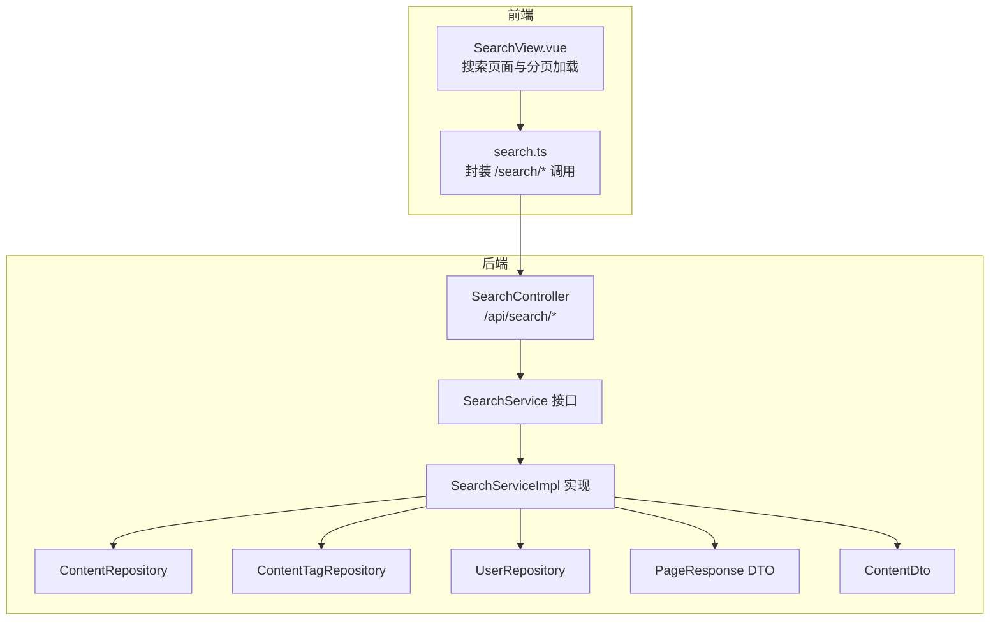
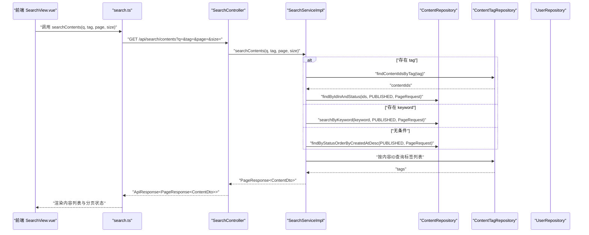
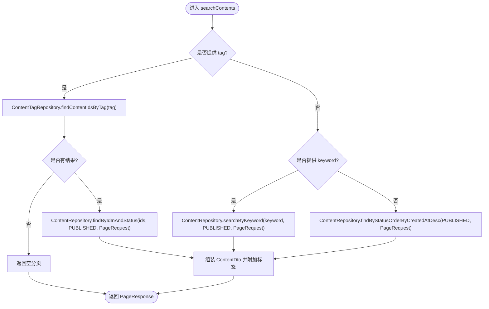
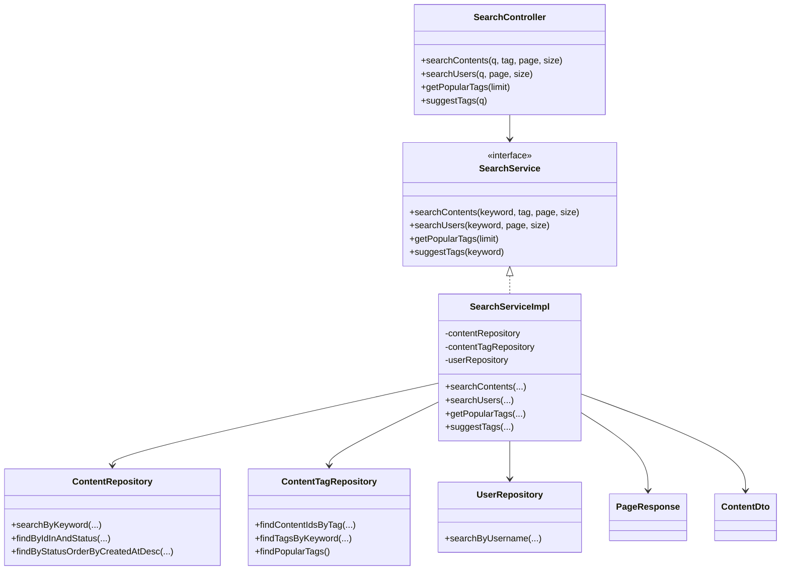

# 内容搜索

<cite>
**本文引用的文件**
- [SearchController.java](file://communication-backend/src/main/java/com/communication/controller/SearchController.java)
- [SearchService.java](file://communication-backend/src/main/java/com/communication/service/SearchService.java)
- [SearchServiceImpl.java](file://communication-backend/src/main/java/com/communication/service/impl/SearchServiceImpl.java)
- [ContentRepository.java](file://communication-backend/src/main/java/com/communication/repository/ContentRepository.java)
- [ContentTagRepository.java](file://communication-backend/src/main/java/com/communication/repository/ContentTagRepository.java)
- [UserRepository.java](file://communication-backend/src/main/java/com/communication/repository/UserRepository.java)
- [PageResponse.java](file://communication-backend/src/main/java/com/communication/dto/PageResponse.java)
- [ContentDto.java](file://communication-backend/src/main/java/com/communication/dto/ContentDto.java)
- [V2__create_contents.sql](file://communication-backend/src/main/resources/db/migration/V2__create_contents.sql)
- [V4__create_content_tags.sql](file://communication-backend/src/main/resources/db/migration/V4__create_content_tags.sql)
- [search.ts](file://communication-frontend/src/api/search.ts)
- [SearchView.vue](file://communication-frontend/src/views/search/SearchView.vue)
- [SearchServiceTest.java](file://communication-backend/src/test/java/com/communication/service/SearchServiceTest.java)
</cite>

## 目录
1. [简介](#简介)
2. [项目结构](#项目结构)
3. [核心组件](#核心组件)
4. [架构总览](#架构总览)
5. [详细组件分析](#详细组件分析)
6. [依赖关系分析](#依赖关系分析)
7. [性能考虑](#性能考虑)
8. [故障排查指南](#故障排查指南)
9. [结论](#结论)
10. [附录：搜索场景与示例](#附录搜索场景与示例)

## 简介
本文件围绕“内容搜索”功能进行全面实现文档化，重点覆盖以下方面：
- API 设计与端点说明：/api/search/contents 的查询参数处理（关键词 q、标签 tag、分页参数 page/size）。
- 搜索算法与实现逻辑：全文检索、标题与正文匹配、标签过滤、默认返回最新内容。
- 服务层实现细节：查询解析、SQL 构建、结果排序与分页处理。
- 数据库优化策略：索引设计、查询性能优化与缓存策略建议。
- 前后端联调示例：前端搜索调用、路由参数联动、分页加载与空结果处理。

## 项目结构
后端采用 Spring Boot 分层架构，搜索功能涉及控制器、服务接口与实现、仓库层以及 DTO 和实体模型；前端通过独立的搜索视图与 API 封装完成交互。

图表来源
- [SearchController.java](file://communication-backend/src/main/java/com/communication/controller/SearchController.java#L23-L54)
- [SearchService.java](file://communication-backend/src/main/java/com/communication/service/SearchService.java#L9-L18)
- [SearchServiceImpl.java](file://communication-backend/src/main/java/com/communication/service/impl/SearchServiceImpl.java#L20-L128)
- [ContentRepository.java](file://communication-backend/src/main/java/com/communication/repository/ContentRepository.java#L16-L55)
- [ContentTagRepository.java](file://communication-backend/src/main/java/com/communication/repository/ContentTagRepository.java#L11-L28)
- [UserRepository.java](file://communication-backend/src/main/java/com/communication/repository/UserRepository.java#L13-L26)
- [PageResponse.java](file://communication-backend/src/main/java/com/communication/dto/PageResponse.java#L5-L64)
- [ContentDto.java](file://communication-backend/src/main/java/com/communication/dto/ContentDto.java#L10-L117)
- [search.ts](file://communication-frontend/src/api/search.ts#L11-L35)
- [SearchView.vue](file://communication-frontend/src/views/search/SearchView.vue#L95-L229)

章节来源
- [SearchController.java](file://communication-backend/src/main/java/com/communication/controller/SearchController.java#L13-L55)
- [SearchService.java](file://communication-backend/src/main/java/com/communication/service/SearchService.java#L9-L18)
- [SearchServiceImpl.java](file://communication-backend/src/main/java/com/communication/service/impl/SearchServiceImpl.java#L20-L128)
- [ContentRepository.java](file://communication-backend/src/main/java/com/communication/repository/ContentRepository.java#L16-L55)
- [ContentTagRepository.java](file://communication-backend/src/main/java/com/communication/repository/ContentTagRepository.java#L11-L28)
- [UserRepository.java](file://communication-backend/src/main/java/com/communication/repository/UserRepository.java#L13-L26)
- [PageResponse.java](file://communication-backend/src/main/java/com/communication/dto/PageResponse.java#L5-L64)
- [ContentDto.java](file://communication-backend/src/main/java/com/communication/dto/ContentDto.java#L10-L117)
- [search.ts](file://communication-frontend/src/api/search.ts#L11-L35)
- [SearchView.vue](file://communication-frontend/src/views/search/SearchView.vue#L95-L229)

## 核心组件
- 控制器层：提供 /api/search/contents、/api/search/users、/api/search/tags/popular、/api/search/tags/suggest 端点，负责接收查询参数并返回统一封装的响应。
- 服务层：SearchService 定义搜索契约，SearchServiceImpl 实现内容与用户搜索、热门标签与标签建议。
- 仓库层：ContentRepository、ContentTagRepository、UserRepository 提供 SQL 查询与分页能力。
- DTO 层：PageResponse 统一分页响应结构，ContentDto 包含内容与标签信息。

章节来源
- [SearchController.java](file://communication-backend/src/main/java/com/communication/controller/SearchController.java#L23-L54)
- [SearchService.java](file://communication-backend/src/main/java/com/communication/service/SearchService.java#L9-L18)
- [SearchServiceImpl.java](file://communication-backend/src/main/java/com/communication/service/impl/SearchServiceImpl.java#L33-L105)
- [ContentRepository.java](file://communication-backend/src/main/java/com/communication/repository/ContentRepository.java#L46-L54)
- [ContentTagRepository.java](file://communication-backend/src/main/java/com/communication/repository/ContentTagRepository.java#L18-L25)
- [UserRepository.java](file://communication-backend/src/main/java/com/communication/repository/UserRepository.java#L24-L25)
- [PageResponse.java](file://communication-backend/src/main/java/com/communication/dto/PageResponse.java#L43-L63)
- [ContentDto.java](file://communication-backend/src/main/java/com/communication/dto/ContentDto.java#L68-L82)

## 架构总览
下图展示了从前端到后端的请求流程与数据流：

图表来源
- [SearchController.java](file://communication-backend/src/main/java/com/communication/controller/SearchController.java#L23-L31)
- [SearchServiceImpl.java](file://communication-backend/src/main/java/com/communication/service/impl/SearchServiceImpl.java#L33-L66)
- [ContentRepository.java](file://communication-backend/src/main/java/com/communication/repository/ContentRepository.java#L46-L54)
- [ContentTagRepository.java](file://communication-backend/src/main/java/com/communication/repository/ContentTagRepository.java#L21-L22)
- [search.ts](file://communication-frontend/src/api/search.ts#L12-L16)
- [SearchView.vue](file://communication-frontend/src/views/search/SearchView.vue#L146-L172)

## 详细组件分析

### API 设计与端点
- /api/search/contents
  - 查询参数：q（关键词）、tag（标签）、page（页码，默认 0）、size（每页大小，默认 10）
  - 返回：ApiResponse 包裹 PageResponse<ContentDto>
- /api/search/users
  - 查询参数：q（用户名关键词）、page、size
  - 返回：ApiResponse 包裹 PageResponse<UserDto>
- /api/search/tags/popular
  - 查询参数：limit（默认 20）
  - 返回：ApiResponse 包裹标签字符串数组
- /api/search/tags/suggest
  - 查询参数：q（标签关键词）
  - 返回：ApiResponse 包裹标签字符串数组

章节来源
- [SearchController.java](file://communication-backend/src/main/java/com/communication/controller/SearchController.java#L23-L54)
- [search.ts](file://communication-frontend/src/api/search.ts#L11-L35)

### 搜索算法与实现逻辑
- 内容搜索优先级
  - 若提供 tag：先查 content_tags 表获取 content_ids，再在 contents 表按 ID 列表与状态过滤，最后补充标签列表。
  - 否则若提供 keyword：使用 JPQL 全文匹配 title/body 并按创建时间倒序。
  - 否则：按状态 PUBLISHED 降序返回最新内容。
- 用户搜索
  - 使用 JPQL 对 username 进行模糊匹配，支持分页。
- 标签建议与热门标签
  - 标签建议：基于 content_tags 表的 LIKE 查询。
  - 热门标签：按标签分组统计数量并取前 N。

图表来源
- [SearchServiceImpl.java](file://communication-backend/src/main/java/com/communication/service/impl/SearchServiceImpl.java#L33-L66)
- [ContentRepository.java](file://communication-backend/src/main/java/com/communication/repository/ContentRepository.java#L46-L54)
- [ContentTagRepository.java](file://communication-backend/src/main/java/com/communication/repository/ContentTagRepository.java#L21-L22)

章节来源
- [SearchServiceImpl.java](file://communication-backend/src/main/java/com/communication/service/impl/SearchServiceImpl.java#L33-L66)
- [ContentRepository.java](file://communication-backend/src/main/java/com/communication/repository/ContentRepository.java#L46-L54)
- [ContentTagRepository.java](file://communication-backend/src/main/java/com/communication/repository/ContentTagRepository.java#L18-L25)
- [UserRepository.java](file://communication-backend/src/main/java/com/communication/repository/UserRepository.java#L24-L25)

### 服务层实现细节
- 分页与排序
  - 使用 PageRequest.of(page, size) 构造分页对象。
  - 内容按 created_at DESC 排序；用户按 username 模糊匹配。
- 结果映射
  - 将 Entity 映射为 DTO，并额外查询标签列表附加到 ContentDto。
- 边界处理
  - 空关键词或空标签结果返回空分页；无条件搜索返回最新内容。

章节来源
- [SearchServiceImpl.java](file://communication-backend/src/main/java/com/communication/service/impl/SearchServiceImpl.java#L33-L127)
- [PageResponse.java](file://communication-backend/src/main/java/com/communication/dto/PageResponse.java#L43-L63)
- [ContentDto.java](file://communication-backend/src/main/java/com/communication/dto/ContentDto.java#L68-L82)

### 数据模型与仓库层
- 内容表 contents
  - 主键、作者外键、标题、正文、媒体字段、状态、时间戳。
  - 索引：author_id、status、created_at、全文索引 title+body。
- 内容标签表 content_tags
  - 主键、内容外键、标签、时间戳。
  - 索引：content_id、tag。
- 用户表 users
  - username 用于搜索优化，添加 username 搜索索引。

章节来源
- [V2__create_contents.sql](file://communication-backend/src/main/resources/db/migration/V2__create_contents.sql#L2-L18)
- [V4__create_content_tags.sql](file://communication-backend/src/main/resources/db/migration/V4__create_content_tags.sql#L2-L13)

### 前端集成与交互
- 前端通过 search.ts 封装 /search/* 请求，SearchView.vue 负责：
  - 输入框防抖触发搜索；
  - 标签页切换与分页加载；
  - 路由 query 同步与重置分页；
  - 空结果与加载骨架屏提示。

章节来源
- [search.ts](file://communication-frontend/src/api/search.ts#L11-L35)
- [SearchView.vue](file://communication-frontend/src/views/search/SearchView.vue#L125-L229)

## 依赖关系分析
- 控制器依赖服务接口，服务实现依赖仓库接口与分页工具。
- 仓库层基于 JPA 注解定义查询，利用数据库索引提升性能。
- DTO 作为跨层传输载体，避免直接暴露实体。

图表来源
- [SearchController.java](file://communication-backend/src/main/java/com/communication/controller/SearchController.java#L17-L21)
- [SearchService.java](file://communication-backend/src/main/java/com/communication/service/SearchService.java#L9-L18)
- [SearchServiceImpl.java](file://communication-backend/src/main/java/com/communication/service/impl/SearchServiceImpl.java#L23-L31)
- [ContentRepository.java](file://communication-backend/src/main/java/com/communication/repository/ContentRepository.java#L16-L55)
- [ContentTagRepository.java](file://communication-backend/src/main/java/com/communication/repository/ContentTagRepository.java#L11-L28)
- [UserRepository.java](file://communication-backend/src/main/java/com/communication/repository/UserRepository.java#L13-L26)
- [PageResponse.java](file://communication-backend/src/main/java/com/communication/dto/PageResponse.java#L5-L64)
- [ContentDto.java](file://communication-backend/src/main/java/com/communication/dto/ContentDto.java#L10-L117)

## 性能考虑
- 索引优化
  - 内容表：全文索引 idx_fulltext(title, body)，可显著提升关键词搜索效率。
  - 内容标签表：content_id 与 tag 字段建立索引，加速标签过滤与标签建议。
  - 用户表：username 添加搜索索引，提升用户名模糊匹配性能。
- 查询优化
  - 标签搜索先走 content_tags 获取 content_ids，再在 contents 表按状态与 ID 列表过滤，减少全表扫描。
  - 关键词搜索使用 LOWER + LIKE 模式，配合全文索引效果更佳。
- 分页与排序
  - 使用 PageRequest 控制分页，避免一次性加载大量数据。
  - 排序字段使用索引列（如 created_at），降低排序成本。
- 缓存策略建议
  - 热门标签与标签建议可引入 Redis 缓存，设置合理过期时间。
  - 高频搜索关键词可做 LRU 缓存，结合命中率动态调整缓存大小。
- 前端优化
  - 输入防抖（如 300ms）减少请求频率。
  - 虚拟列表或无限滚动结合分页，避免一次性渲染过多 DOM。

章节来源
- [V2__create_contents.sql](file://communication-backend/src/main/resources/db/migration/V2__create_contents.sql#L14-L17)
- [V4__create_content_tags.sql](file://communication-backend/src/main/resources/db/migration/V4__create_content_tags.sql#L8-L13)
- [SearchServiceImpl.java](file://communication-backend/src/main/java/com/communication/service/impl/SearchServiceImpl.java#L33-L66)
- [SearchView.vue](file://communication-frontend/src/views/search/SearchView.vue#L125-L130)

## 故障排查指南
- 无结果
  - 检查关键词是否为空；若为空，服务层会返回空分页。
  - 标签搜索若无匹配，返回空分页；确认标签是否存在且内容状态为 PUBLISHED。
- 性能问题
  - 确认数据库索引是否生效（特别是全文索引与标签索引）。
  - 检查分页参数是否过大，适当限制 size。
- 响应结构异常
  - 确保前端传入的 page/size 类型正确，后端默认值为 0/10。
- 测试验证
  - 参考单元测试用例覆盖关键词搜索、标签搜索、空关键词用户搜索、热门标签与标签建议等场景。

章节来源
- [SearchServiceTest.java](file://communication-backend/src/test/java/com/communication/service/SearchServiceTest.java#L76-L184)
- [SearchServiceImpl.java](file://communication-backend/src/main/java/com/communication/service/impl/SearchServiceImpl.java#L117-L127)

## 结论
内容搜索功能通过清晰的分层设计与合理的数据库索引，实现了关键词与标签双维度检索、用户搜索、热门标签与标签建议等能力。结合前端防抖与分页加载，整体具备良好的用户体验与扩展性。后续可在高频查询场景引入缓存与全文搜索引擎进一步提升性能。

## 附录：搜索场景与示例
- 场景一：按关键词搜索内容
  - 前端调用：searchContents(q="java", page=0, size=10)
  - 后端行为：ContentRepository.searchByKeyword(...) 执行标题/正文匹配并按创建时间倒序。
  - 前端展示：内容卡片列表与分页状态。
- 场景二：按标签筛选内容
  - 前端调用：searchContents(tag="spring", page=0, size=10)
  - 后端行为：ContentTagRepository.findContentIdsByTag(...) 获取内容ID列表，再按状态过滤。
  - 前端展示：仅显示带该标签的内容。
- 场景三：无条件搜索返回最新内容
  - 前端调用：searchContents(page=0, size=10)
  - 后端行为：ContentRepository.findByStatusOrderByCreatedAtDesc(...) 返回最新已发布内容。
- 场景四：用户搜索
  - 前端调用：searchUsers(q="alice", page=0, size=10)
  - 后端行为：UserRepository.searchByUsername(...) 模糊匹配用户名。
- 场景五：标签建议与热门标签
  - 前端调用：suggestTags(q="ja")、getPopularTags(limit=20)
  - 后端行为：ContentTagRepository.findTagsByKeyword(...) 与分组统计。

章节来源
- [search.ts](file://communication-frontend/src/api/search.ts#L12-L34)
- [SearchView.vue](file://communication-frontend/src/views/search/SearchView.vue#L146-L201)
- [SearchServiceImpl.java](file://communication-backend/src/main/java/com/communication/service/impl/SearchServiceImpl.java#L33-L105)
- [ContentRepository.java](file://communication-backend/src/main/java/com/communication/repository/ContentRepository.java#L46-L54)
- [ContentTagRepository.java](file://communication-backend/src/main/java/com/communication/repository/ContentTagRepository.java#L18-L25)
- [UserRepository.java](file://communication-backend/src/main/java/com/communication/repository/UserRepository.java#L24-L25)