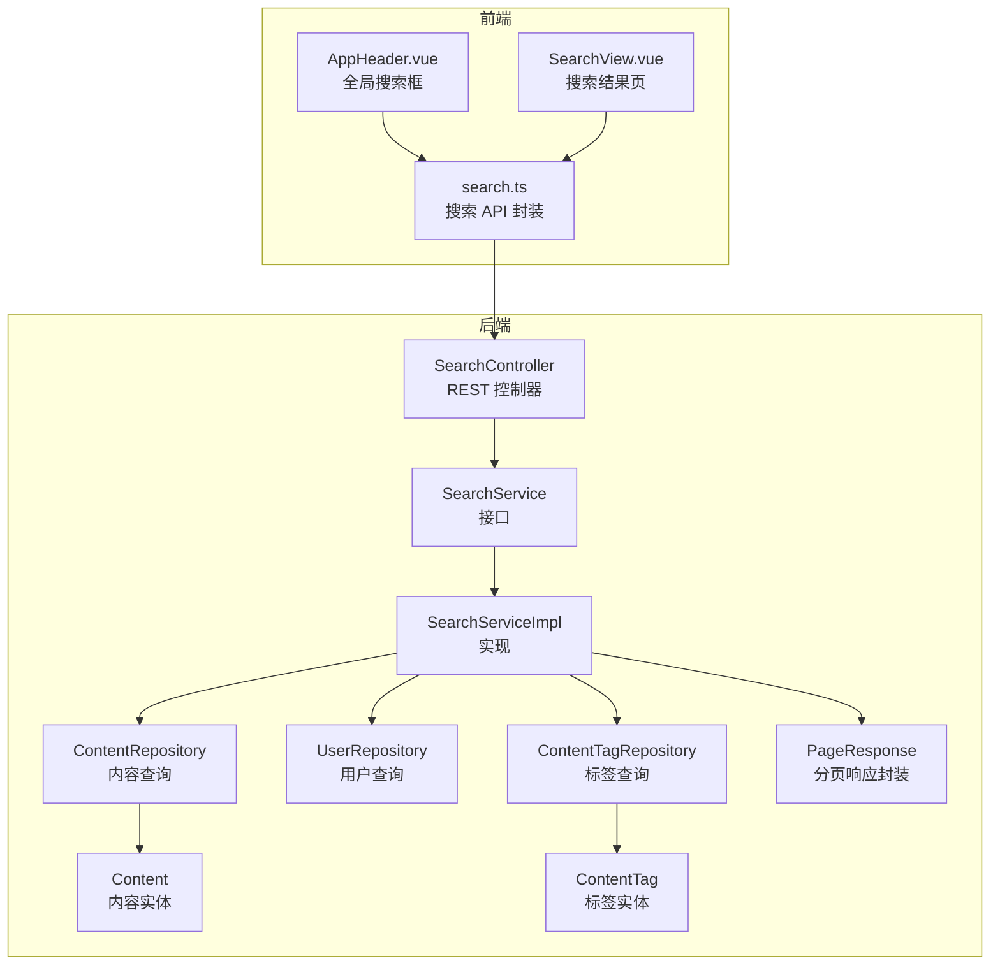
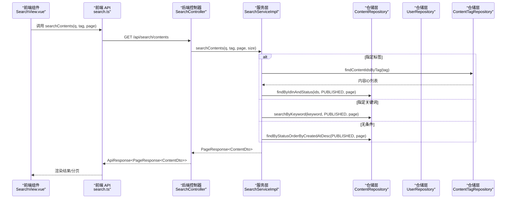
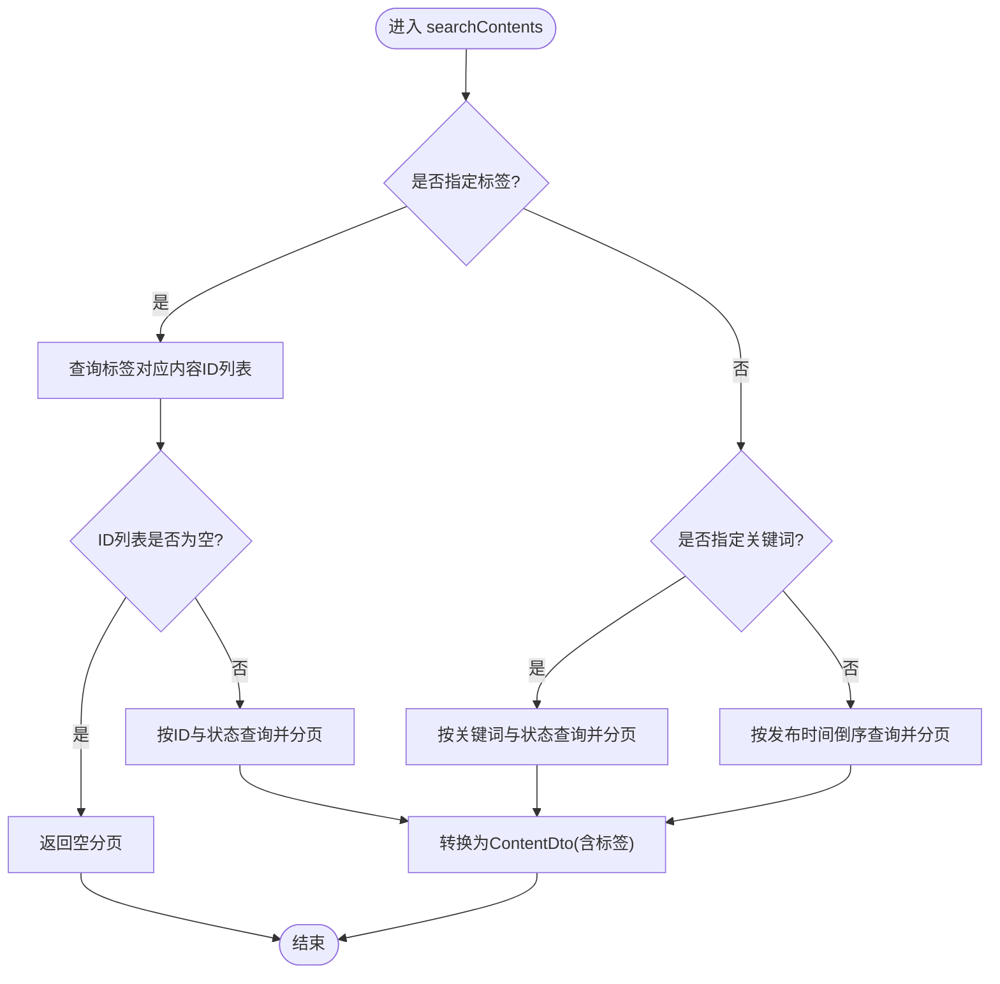
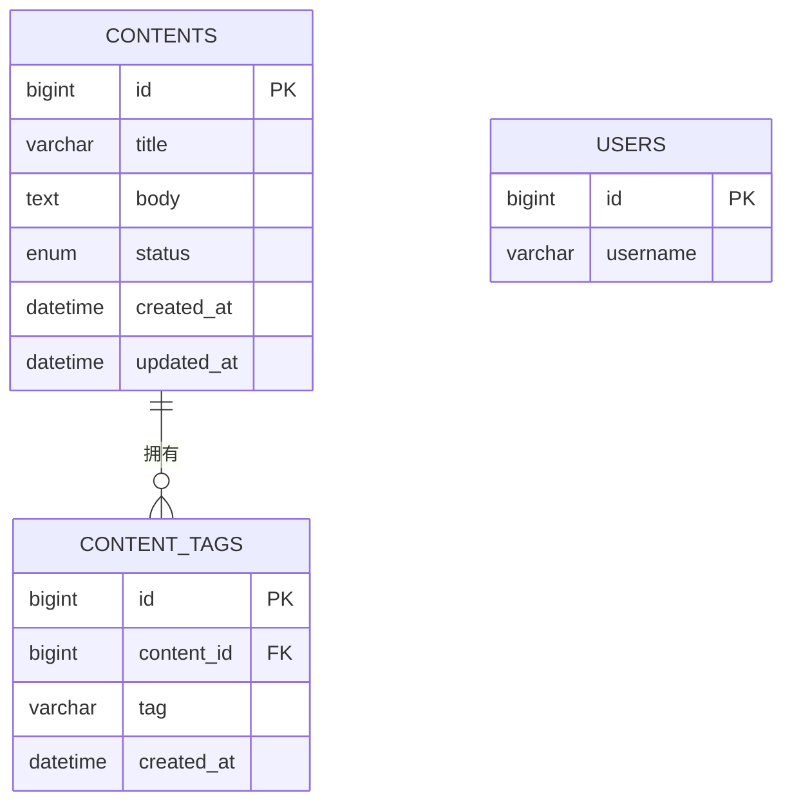
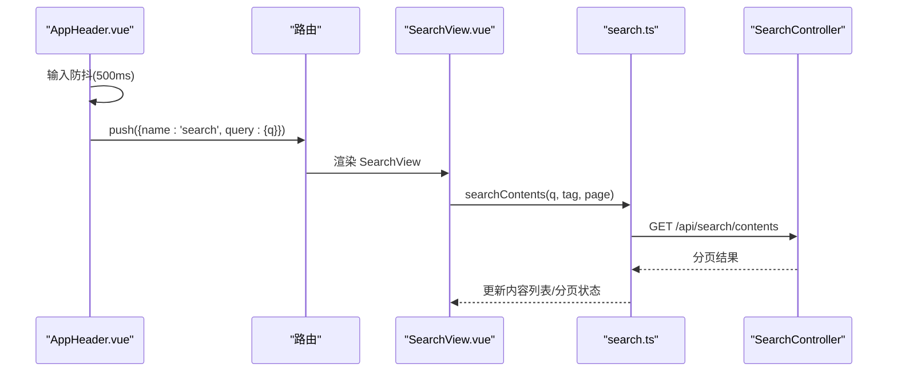
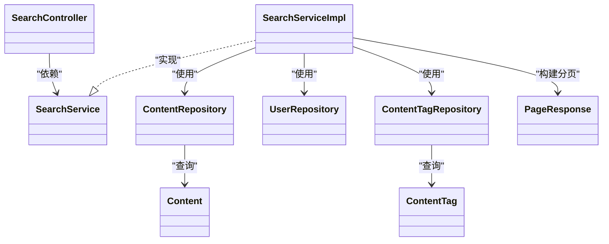

# 搜索系统

<cite>
**本文引用的文件**
- [wiki/08-搜索系统.md](file://wiki/08-搜索系统.md)
- [communication-backend/src/main/java/com/communication/controller/SearchController.java](file://communication-backend/src/main/java/com/communication/controller/SearchController.java)
- [communication-backend/src/main/java/com/communication/service/SearchService.java](file://communication-backend/src/main/java/com/communication/service/SearchService.java)
- [communication-backend/src/main/java/com/communication/service/impl/SearchServiceImpl.java](file://communication-backend/src/main/java/com/communication/service/impl/SearchServiceImpl.java)
- [communication-backend/src/main/java/com/communication/repository/ContentRepository.java](file://communication-backend/src/main/java/com/communication/repository/ContentRepository.java)
- [communication-backend/src/main/java/com/communication/repository/UserRepository.java](file://communication-backend/src/main/java/com/communication/repository/UserRepository.java)
- [communication-backend/src/main/java/com/communication/repository/ContentTagRepository.java](file://communication-backend/src/main/java/com/communication/repository/ContentTagRepository.java)
- [communication-backend/src/main/java/com/communication/entity/Content.java](file://communication-backend/src/main/java/com/communication/entity/Content.java)
- [communication-backend/src/main/java/com/communication/entity/ContentTag.java](file://communication-backend/src/main/java/com/communication/entity/ContentTag.java)
- [communication-backend/src/main/java/com/communication/dto/PageResponse.java](file://communication-backend/src/main/java/com/communication/dto/PageResponse.java)
- [communication-backend/src/test/java/com/communication/service/SearchServiceTest.java](file://communication-backend/src/test/java/com/communication/service/SearchServiceTest.java)
- [communication-frontend/src/api/search.ts](file://communication-frontend/src/api/search.ts)
- [communication-frontend/src/views/search/SearchView.vue](file://communication-frontend/src/views/search/SearchView.vue)
- [communication-frontend/src/components/layout/AppHeader.vue](file://communication-frontend/src/components/layout/AppHeader.vue)
</cite>

## 目录
1. [简介](#简介)
2. [项目结构](#项目结构)
3. [核心组件](#核心组件)
4. [架构总览](#架构总览)
5. [详细组件分析](#详细组件分析)
6. [依赖关系分析](#依赖关系分析)
7. [性能考虑](#性能考虑)
8. [故障排查指南](#故障排查指南)
9. [结论](#结论)
10. [附录](#附录)

## 简介
本文件面向“搜索系统”的技术文档，覆盖后端控制器、服务层、仓储层与前端组件的完整实现，重点阐述以下方面：
- 搜索功能整体架构与三类搜索能力：内容搜索、用户搜索、标签搜索（含热门标签与标签建议）
- 全文搜索引擎选择与配置：MySQL 全文索引 vs Elasticsearch 的对比与取舍
- 搜索算法与相关性：关键词匹配策略、标签过滤、结果分页与排序
- 热门标签系统：热度统计与推荐策略
- 性能优化：索引优化、查询缓存、分页策略
- 前端搜索组件：全局搜索框、自动完成、搜索结果页与交互体验
- 搜索体验优化：搜索历史、搜索建议、错误处理与空状态

## 项目结构
搜索系统由前后端协作实现：
- 后端采用 Spring Boot + JPA，提供 REST 接口与数据访问
- 前端采用 Vue 3 + Element Plus，负责搜索 UI、交互与分页加载

图表来源
- [communication-frontend/src/components/layout/AppHeader.vue](file://communication-frontend/src/components/layout/AppHeader.vue)
- [communication-frontend/src/views/search/SearchView.vue](file://communication-frontend/src/views/search/SearchView.vue)
- [communication-frontend/src/api/search.ts](file://communication-frontend/src/api/search.ts)
- [communication-backend/src/main/java/com/communication/controller/SearchController.java](file://communication-backend/src/main/java/com/communication/controller/SearchController.java)
- [communication-backend/src/main/java/com/communication/service/impl/SearchServiceImpl.java](file://communication-backend/src/main/java/com/communication/service/impl/SearchServiceImpl.java)
- [communication-backend/src/main/java/com/communication/repository/ContentRepository.java](file://communication-backend/src/main/java/com/communication/repository/ContentRepository.java)
- [communication-backend/src/main/java/com/communication/repository/UserRepository.java](file://communication-backend/src/main/java/com/communication/repository/UserRepository.java)
- [communication-backend/src/main/java/com/communication/repository/ContentTagRepository.java](file://communication-backend/src/main/java/com/communication/repository/ContentTagRepository.java)
- [communication-backend/src/main/java/com/communication/entity/Content.java](file://communication-backend/src/main/java/com/communication/entity/Content.java)
- [communication-backend/src/main/java/com/communication/entity/ContentTag.java](file://communication-backend/src/main/java/com/communication/entity/ContentTag.java)
- [communication-backend/src/main/java/com/communication/dto/PageResponse.java](file://communication-backend/src/main/java/com/communication/dto/PageResponse.java)

章节来源
- [wiki/08-搜索系统.md](file://wiki/08-搜索系统.md)
- [communication-backend/src/main/java/com/communication/controller/SearchController.java](file://communication-backend/src/main/java/com/communication/controller/SearchController.java)
- [communication-frontend/src/api/search.ts](file://communication-frontend/src/api/search.ts)

## 核心组件
- 后端控制器：提供内容搜索、用户搜索、热门标签与标签建议四个接口
- 服务层：统一处理搜索逻辑、分页与 DTO 转换
- 仓储层：基于 JPA 查询语言实现关键词、标签、用户等检索
- 实体模型：内容与标签实体，支持多对多标签关联
- 前端 API：封装搜索请求，统一错误处理
- 前端视图：全局搜索框与搜索结果页，支持防抖、分页与空状态

章节来源
- [communication-backend/src/main/java/com/communication/controller/SearchController.java](file://communication-backend/src/main/java/com/communication/controller/SearchController.java)
- [communication-backend/src/main/java/com/communication/service/impl/SearchServiceImpl.java](file://communication-backend/src/main/java/com/communication/service/impl/SearchServiceImpl.java)
- [communication-backend/src/main/java/com/communication/repository/ContentRepository.java](file://communication-backend/src/main/java/com/communication/repository/ContentRepository.java)
- [communication-backend/src/main/java/com/communication/repository/UserRepository.java](file://communication-backend/src/main/java/com/communication/repository/UserRepository.java)
- [communication-backend/src/main/java/com/communication/repository/ContentTagRepository.java](file://communication-backend/src/main/java/com/communication/repository/ContentTagRepository.java)
- [communication-backend/src/main/java/com/communication/entity/Content.java](file://communication-backend/src/main/java/com/communication/entity/Content.java)
- [communication-backend/src/main/java/com/communication/entity/ContentTag.java](file://communication-backend/src/main/java/com/communication/entity/ContentTag.java)
- [communication-backend/src/main/java/com/communication/dto/PageResponse.java](file://communication-backend/src/main/java/com/communication/dto/PageResponse.java)
- [communication-frontend/src/api/search.ts](file://communication-frontend/src/api/search.ts)
- [communication-frontend/src/views/search/SearchView.vue](file://communication-frontend/src/views/search/SearchView.vue)
- [communication-frontend/src/components/layout/AppHeader.vue](file://communication-frontend/src/components/layout/AppHeader.vue)

## 架构总览
后端通过控制器暴露 REST 接口，服务层根据关键词与标签组合执行不同查询路径；仓储层使用 JPQL 实现关键词匹配、标签过滤与热门标签统计；前端通过 API 封装调用接口，并在视图中实现防抖、分页与空状态展示。

图表来源
- [communication-frontend/src/views/search/SearchView.vue](file://communication-frontend/src/views/search/SearchView.vue)
- [communication-frontend/src/api/search.ts](file://communication-frontend/src/api/search.ts)
- [communication-backend/src/main/java/com/communication/controller/SearchController.java](file://communication-backend/src/main/java/com/communication/controller/SearchController.java)
- [communication-backend/src/main/java/com/communication/service/impl/SearchServiceImpl.java](file://communication-backend/src/main/java/com/communication/service/impl/SearchServiceImpl.java)
- [communication-backend/src/main/java/com/communication/repository/ContentRepository.java](file://communication-backend/src/main/java/com/communication/repository/ContentRepository.java)
- [communication-backend/src/main/java/com/communication/repository/ContentTagRepository.java](file://communication-backend/src/main/java/com/communication/repository/ContentTagRepository.java)

## 详细组件分析

### 后端控制器与接口定义
- 内容搜索：支持关键词与标签组合查询，返回分页内容
- 用户搜索：按用户名模糊匹配，返回分页用户
- 热门标签：按标签出现频次降序取前 N
- 标签建议：按前缀匹配返回候选标签

章节来源
- [communication-backend/src/main/java/com/communication/controller/SearchController.java](file://communication-backend/src/main/java/com/communication/controller/SearchController.java)
- [wiki/08-搜索系统.md](file://wiki/08-搜索系统.md)

### 服务层实现策略
- 内容搜索：
  - 若存在标签：先查标签对应的内容 ID 列表，再按状态过滤与分页查询
  - 若存在关键词：按标题/正文模糊匹配并分页
  - 否则：按发布时间倒序返回最新内容
- 用户搜索：关键词非空才执行查询，否则返回空分页
- 热门标签：按标签分组计数并排序，限制数量
- 标签建议：按前缀 LIKE 匹配，限制返回数量

图表来源
- [communication-backend/src/main/java/com/communication/service/impl/SearchServiceImpl.java](file://communication-backend/src/main/java/com/communication/service/impl/SearchServiceImpl.java)
- [communication-backend/src/main/java/com/communication/repository/ContentTagRepository.java](file://communication-backend/src/main/java/com/communication/repository/ContentTagRepository.java)
- [communication-backend/src/main/java/com/communication/repository/ContentRepository.java](file://communication-backend/src/main/java/com/communication/repository/ContentRepository.java)

章节来源
- [communication-backend/src/main/java/com/communication/service/impl/SearchServiceImpl.java](file://communication-backend/src/main/java/com/communication/service/impl/SearchServiceImpl.java)
- [communication-backend/src/main/java/com/communication/service/SearchService.java](file://communication-backend/src/main/java/com/communication/service/SearchService.java)

### 仓储层与查询实现
- 内容仓库：
  - 按关键词模糊匹配标题/正文并按创建时间倒序
  - 按 ID 列表与状态查询并分页
  - 按状态查询并按创建时间倒序
- 用户仓库：按用户名模糊匹配
- 标签仓库：
  - 按标签查询内容 ID 列表
  - 按前缀查询标签建议
  - 统计热门标签（分组计数）

章节来源
- [communication-backend/src/main/java/com/communication/repository/ContentRepository.java](file://communication-backend/src/main/java/com/communication/repository/ContentRepository.java)
- [communication-backend/src/main/java/com/communication/repository/UserRepository.java](file://communication-backend/src/main/java/com/communication/repository/UserRepository.java)
- [communication-backend/src/main/java/com/communication/repository/ContentTagRepository.java](file://communication-backend/src/main/java/com/communication/repository/ContentTagRepository.java)

### 数据模型与关系
内容与标签为多对多关系，通过中间表维护。

图表来源
- [communication-backend/src/main/java/com/communication/entity/Content.java](file://communication-backend/src/main/java/com/communication/entity/Content.java)
- [communication-backend/src/main/java/com/communication/entity/ContentTag.java](file://communication-backend/src/main/java/com/communication/entity/ContentTag.java)

章节来源
- [communication-backend/src/main/java/com/communication/entity/Content.java](file://communication-backend/src/main/java/com/communication/entity/Content.java)
- [communication-backend/src/main/java/com/communication/entity/ContentTag.java](file://communication-backend/src/main/java/com/communication/entity/ContentTag.java)

### 前端搜索组件
- 全局搜索框（AppHeader）：输入防抖（不同组件设置不同延迟），回车或点击跳转搜索页
- 搜索结果页（SearchView）：支持内容/用户双标签页，关键词变化触发请求，空结果展示空状态，支持分页加载
- 搜索 API：统一封装 GET 请求与错误处理，返回分页数据或空数组

图表来源
- [communication-frontend/src/components/layout/AppHeader.vue](file://communication-frontend/src/components/layout/AppHeader.vue)
- [communication-frontend/src/views/search/SearchView.vue](file://communication-frontend/src/views/search/SearchView.vue)
- [communication-frontend/src/api/search.ts](file://communication-frontend/src/api/search.ts)
- [communication-backend/src/main/java/com/communication/controller/SearchController.java](file://communication-backend/src/main/java/com/communication/controller/SearchController.java)

章节来源
- [communication-frontend/src/components/layout/AppHeader.vue](file://communication-frontend/src/components/layout/AppHeader.vue)
- [communication-frontend/src/views/search/SearchView.vue](file://communication-frontend/src/views/search/SearchView.vue)
- [communication-frontend/src/api/search.ts](file://communication-frontend/src/api/search.ts)

## 依赖关系分析
- 控制器依赖服务层接口
- 服务实现依赖三个仓储接口
- 仓储依赖实体模型
- 前端 API 依赖控制器提供的接口路径
- 测试覆盖服务层关键分支：关键词搜索、标签搜索、空关键词用户搜索、热门标签与标签建议

图表来源
- [communication-backend/src/main/java/com/communication/controller/SearchController.java](file://communication-backend/src/main/java/com/communication/controller/SearchController.java)
- [communication-backend/src/main/java/com/communication/service/SearchService.java](file://communication-backend/src/main/java/com/communication/service/SearchService.java)
- [communication-backend/src/main/java/com/communication/service/impl/SearchServiceImpl.java](file://communication-backend/src/main/java/com/communication/service/impl/SearchServiceImpl.java)
- [communication-backend/src/main/java/com/communication/repository/ContentRepository.java](file://communication-backend/src/main/java/com/communication/repository/ContentRepository.java)
- [communication-backend/src/main/java/com/communication/repository/UserRepository.java](file://communication-backend/src/main/java/com/communication/repository/UserRepository.java)
- [communication-backend/src/main/java/com/communication/repository/ContentTagRepository.java](file://communication-backend/src/main/java/com/communication/repository/ContentTagRepository.java)
- [communication-backend/src/main/java/com/communication/entity/Content.java](file://communication-backend/src/main/java/com/communication/entity/Content.java)
- [communication-backend/src/main/java/com/communication/entity/ContentTag.java](file://communication-backend/src/main/java/com/communication/entity/ContentTag.java)
- [communication-backend/src/main/java/com/communication/dto/PageResponse.java](file://communication-backend/src/main/java/com/communication/dto/PageResponse.java)

章节来源
- [communication-backend/src/test/java/com/communication/service/SearchServiceTest.java](file://communication-backend/src/test/java/com/communication/service/SearchServiceTest.java)

## 性能考虑
- 索引与查询优化
  - 内容关键词搜索：当前使用标题/正文模糊匹配，建议在生产环境启用 MySQL 全文索引以提升匹配效率与相关性排序能力
  - 标签搜索：先通过标签表获取内容 ID 列表，再按 ID 与状态查询，避免跨表复杂 JOIN
  - 热门标签：按标签分组计数并排序，建议对标签列建立索引以加速 GROUP BY
- 分页策略
  - 使用 PageRequest 控制页码与大小，避免一次性返回大量数据
  - 前端 SearchView 已实现“加载更多”分页，建议结合虚拟滚动进一步优化长列表渲染
- 缓存策略
  - 热门标签可引入短期缓存（如 Redis）降低重复统计开销
  - 标签建议可缓存常用前缀结果
- 并发与防抖
  - 前端全局搜索框与搜索页均实现防抖，减少高频请求
- 全文搜索引擎选型
  - MySQL 全文索引：实现简单，适合中小规模数据与基础相关性排序
  - Elasticsearch：支持更丰富的全文检索、高亮、聚合与近似匹配，适合大规模与高并发场景，但增加运维复杂度

章节来源
- [wiki/08-搜索系统.md](file://wiki/08-搜索系统.md)
- [communication-backend/src/main/java/com/communication/repository/ContentRepository.java](file://communication-backend/src/main/java/com/communication/repository/ContentRepository.java)
- [communication-backend/src/main/java/com/communication/repository/ContentTagRepository.java](file://communication-backend/src/main/java/com/communication/repository/ContentTagRepository.java)
- [communication-frontend/src/views/search/SearchView.vue](file://communication-frontend/src/views/search/SearchView.vue)
- [communication-frontend/src/components/layout/AppHeader.vue](file://communication-frontend/src/components/layout/AppHeader.vue)

## 故障排查指南
- 搜索无结果
  - 检查关键词是否为空，用户搜索需非空关键词
  - 标签搜索若返回空，确认标签是否存在且内容状态为已发布
- 分页异常
  - 确认 page/size 参数默认值与前端传参一致
  - 检查 last/first 标志位是否正确用于控制“加载更多”
- 热门标签为空
  - 确认标签表中有数据，且查询语句返回了结果
- 前端错误处理
  - API 封装已捕获异常并返回空值或空数组，便于前端展示空状态
- 单元测试参考
  - 提供关键词搜索、标签搜索、空关键词用户搜索、热门标签与标签建议的测试用例，可作为回归验证依据

章节来源
- [communication-backend/src/main/java/com/communication/service/impl/SearchServiceImpl.java](file://communication-backend/src/main/java/com/communication/service/impl/SearchServiceImpl.java)
- [communication-backend/src/test/java/com/communication/service/SearchServiceTest.java](file://communication-backend/src/test/java/com/communication/service/SearchServiceTest.java)
- [communication-frontend/src/api/search.ts](file://communication-frontend/src/api/search.ts)
- [communication-frontend/src/views/search/SearchView.vue](file://communication-frontend/src/views/search/SearchView.vue)

## 结论
该搜索系统以简洁的三层架构实现内容、用户与标签的多维检索，前端通过防抖与分页优化用户体验，后端以 JPA 查询语言支撑基础全文与标签过滤。针对性能与扩展性，建议在生产环境中引入 MySQL 全文索引或 Elasticsearch，并配合缓存与分页优化策略，持续提升搜索质量与响应速度。

## 附录
- 接口一览
  - 内容搜索：GET /api/search/contents?q=&tag=&page=&size=
  - 用户搜索：GET /api/search/users?q=&page=&size=
  - 热门标签：GET /api/search/tags/popular?limit=
  - 标签建议：GET /api/search/tags/suggest?q=

章节来源
- [wiki/08-搜索系统.md](file://wiki/08-搜索系统.md)